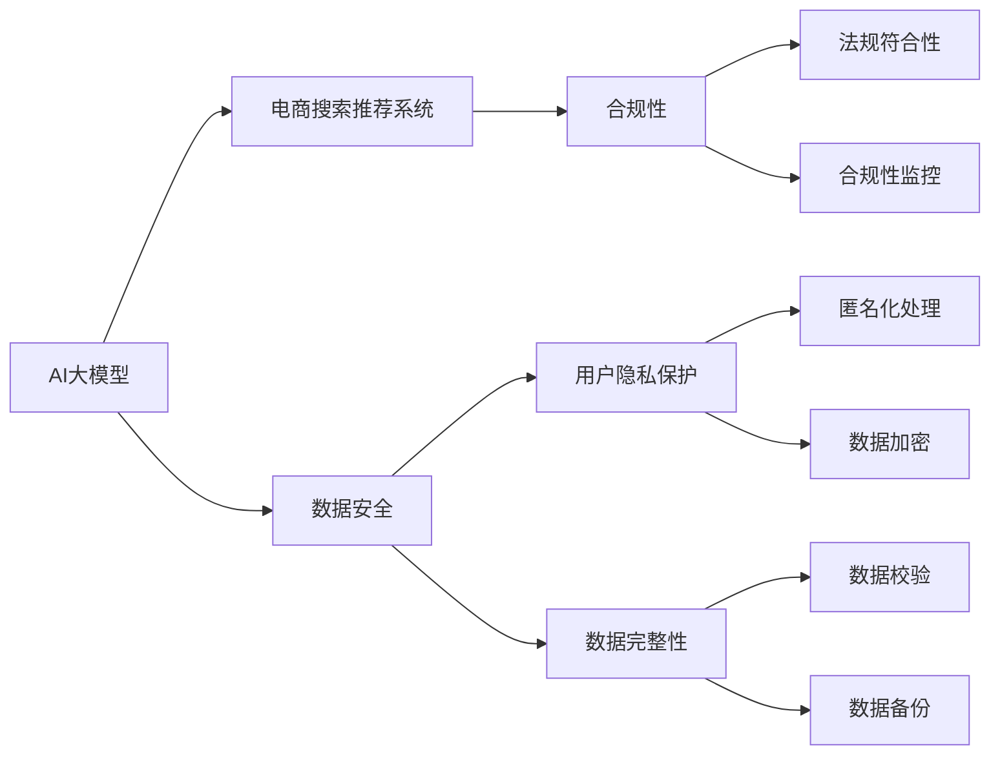

                 

# AI 大模型在电商搜索推荐中的数据安全策略：保障用户隐私与数据完整性

> 关键词：人工智能大模型, 电商搜索推荐, 数据安全, 隐私保护, 数据完整性

## 1. 背景介绍

在数字化和互联网时代，电商平台已迅速成为人们获取商品和服务的重要渠道。随着电商平台的持续发展，AI技术在用户行为分析、商品推荐、搜索优化等方面发挥了重要作用，显著提升了用户体验和平台运营效率。然而，AI技术在提升平台能力的同时，也对用户数据的安全与隐私保护提出了新的挑战。特别是在使用AI大模型进行电商搜索推荐时，数据安全和隐私保护尤为重要。

### 1.1 问题由来
电商平台大规模部署AI大模型，用于优化搜索推荐算法，已经成为行业标配。这些模型通常基于大规模用户行为数据和商品信息进行训练，以实现精准的个性化推荐。然而，在实际应用中，用户数据的安全与隐私保护问题也随之凸显。用户数据泄漏、数据篡改等安全问题不仅影响用户信任，还可能带来严重的法律和道德风险。

例如，2019年亚马逊的个性化推荐系统被发现泄露了用户浏览习惯数据，引发了广泛的公众关注。这起事件警示我们，在使用AI大模型进行电商搜索推荐时，必须采取有效措施保障用户数据安全与隐私。

### 1.2 问题核心关键点
保护用户隐私与数据完整性，是AI大模型在电商搜索推荐中面临的核心挑战：

1. **用户隐私保护**：确保用户隐私数据不被未经授权的第三方访问或滥用。
2. **数据完整性**：保障训练数据的完整性和真实性，避免数据篡改和异常操作。
3. **安全合规**：符合全球各地的数据保护法规，如欧盟的GDPR（通用数据保护条例）、中国的《网络安全法》等。

## 2. 核心概念与联系

### 2.1 核心概念概述

在AI大模型应用于电商搜索推荐时，核心概念主要包括以下几个方面：

1. **AI大模型**：指使用大规模深度学习模型进行预训练的模型，如BERT、GPT-3等，通过学习海量数据获得强大的特征提取和表征能力。
2. **电商搜索推荐系统**：指利用AI大模型对用户行为数据和商品信息进行分析，为用户推荐最相关商品的技术系统。
3. **数据安全**：涉及数据的保密性、完整性和可用性保护，防止数据泄露、篡改和损坏。
4. **隐私保护**：指对个人数据的收集、处理和存储进行严格控制，保护用户隐私权利。
5. **合规性**：确保系统符合数据保护法规和标准，保障用户数据权利。

这些概念之间相互关联，共同构成了电商搜索推荐系统中数据安全和隐私保护的基本框架。

### 2.2 核心概念原理和架构的 Mermaid 流程图



这个流程图展示了AI大模型在电商搜索推荐系统中的作用，以及与之相关的数据安全、隐私保护和合规性概念。具体来说：

1. **数据安全**：负责保护数据免受未授权访问和篡改，包括数据加密、备份和校验等措施。
2. **隐私保护**：对用户数据进行匿名化处理，确保用户隐私不受侵犯。
3. **数据完整性**：通过数据校验和备份，确保数据的真实性和可用性。
4. **合规性**：保证系统符合相关法律法规，进行合规性监控。

## 3. 核心算法原理 & 具体操作步骤

### 3.1 算法原理概述

AI大模型在电商搜索推荐中的数据安全策略，主要包括数据隐私保护、数据完整性保障和合规性控制三个方面。

1. **数据隐私保护**：通过匿名化处理和数据加密，防止用户数据被未授权访问。
2. **数据完整性保障**：通过数据校验和备份，确保数据的真实性和可用性。
3. **合规性控制**：通过法规符合性监控，确保系统操作符合相关法律法规。

### 3.2 算法步骤详解

以下详细介绍每个方面的具体操作步骤：

#### 3.2.1 数据隐私保护

**步骤1：数据匿名化处理**
1. **个人信息去标识化**：从原始数据中删除或替换识别个人身份的信息，如姓名、身份证号、手机号等。
2. **行为数据去关联化**：将不同行为数据关联起来，以便进行关联性分析，但避免识别具体个人。
3. **数据集分片处理**：将数据集分为多个部分，不同部分独立处理，防止某一部分数据泄露。

**步骤2：数据加密**
1. **数据加密存储**：对存储在数据库或云平台的数据进行加密，确保数据即使被非法访问也无法被解读。
2. **传输加密保护**：在数据传输过程中，使用SSL/TLS等加密协议保护数据安全。
3. **密钥管理**：对加密数据进行密钥管理，确保密钥的安全性和正确性。

**步骤3：数据访问控制**
1. **权限分配**：根据用户角色和职责，分配不同的数据访问权限。
2. **访问审计**：记录数据访问日志，审计访问行为，发现异常访问。

#### 3.2.2 数据完整性保障

**步骤1：数据校验**
1. **校验码生成**：在数据传输或存储过程中，生成校验码，用于检测数据的完整性。
2. **数据一致性校验**：定期检查数据的一致性，发现不一致情况进行修复。
3. **数据水印嵌入**：在数据中嵌入不可见的水印，用于检测数据篡改。

**步骤2：数据备份**
1. **全量备份**：定期对全量数据进行备份，确保数据在任何情况下都能恢复。
2. **增量备份**：只备份数据变更部分，减少备份的时间和存储空间。
3. **备份验证**：对备份数据进行完整性校验，确保备份数据的准确性。

#### 3.2.3 合规性控制

**步骤1：法规符合性评估**
1. **法规标准识别**：识别涉及的数据保护法规和标准，如GDPR、CCPA等。
2. **合规性检查**：定期对系统操作进行合规性检查，发现不符合规定的情况。
3. **合规性报告**：生成合规性报告，记录合规性检查结果和改进措施。

**步骤2：合规性监控**
1. **监控策略制定**：制定数据保护和隐私保护的监控策略，如日志记录、审计检查等。
2. **异常检测**：实时监控数据访问和处理行为，检测异常情况。
3. **违规处理**：对违规操作进行处理，如数据访问限制、违规记录等。

### 3.3 算法优缺点

#### 3.3.1 数据隐私保护

**优点：**
1. **确保用户隐私**：通过匿名化和加密措施，有效保护用户隐私。
2. **防范数据泄露**：多重加密和访问控制，防止数据泄露风险。
3. **法规合规性高**：符合全球各地的数据保护法规，降低法律风险。

**缺点：**
1. **隐私保护成本高**：隐私保护技术需要投入大量资源，增加了系统开发和维护成本。
2. **隐私保护复杂度高**：隐私保护技术复杂，需要专业团队进行开发和维护。
3. **隐私保护技术限制**：部分隐私保护技术存在局限性，如匿名化处理可能影响数据精度。

#### 3.3.2 数据完整性保障

**优点：**
1. **数据完整性高**：数据校验和备份措施，确保数据完整性。
2. **数据可用性高**：备份数据可在数据丢失或损坏时快速恢复。
3. **数据一致性强**：定期校验数据一致性，避免数据错误。

**缺点：**
1. **备份存储成本高**：数据备份需要大量存储空间，增加系统成本。
2. **数据校验复杂**：数据校验需要额外计算资源，影响系统性能。
3. **数据同步困难**：数据校验和备份过程中，需要确保各部分数据同步，复杂度较高。

#### 3.3.3 合规性控制

**优点：**
1. **合规性高**：通过法规符合性评估和监控，确保系统操作符合法规要求。
2. **风险防范能力强**：实时监控和违规处理，防止数据违规操作。
3. **透明度高**：合规性报告和监控日志，提高系统透明度。

**缺点：**
1. **合规性监控复杂**：合规性监控需要投入大量资源，增加系统复杂度。
2. **法规更新频繁**：全球各地的法规标准不同，需要频繁更新合规性策略。
3. **合规性成本高**：合规性检查和监控需要大量人力和资源，增加系统成本。

### 3.4 算法应用领域

AI大模型在电商搜索推荐中的应用场景广泛，包括：

1. **用户行为分析**：通过AI大模型分析用户浏览历史、购买记录等行为数据，进行精准推荐。
2. **商品信息优化**：利用AI大模型对商品描述、价格等进行分析，优化商品信息展示。
3. **搜索算法优化**：通过AI大模型分析搜索查询和结果，优化搜索算法。
4. **广告投放策略**：利用AI大模型分析用户行为，优化广告投放策略。

在数据安全和隐私保护方面，AI大模型广泛应用于上述场景，需要确保数据安全和隐私保护，保障用户数据安全和平台合规运营。

## 4. 数学模型和公式 & 详细讲解 & 举例说明

### 4.1 数学模型构建

在电商搜索推荐系统中，数据安全和隐私保护涉及多个数学模型，包括数据匿名化、数据加密和数据完整性校验等。

#### 4.1.1 数据匿名化

**匿名化模型构建**：

1. **个人信息去标识化**：使用假名替换真实姓名、身份证号等个人信息。
   - 假名生成模型：
     \[
     P(\text{PseudoName}_i|Identity_i) = \frac{P(\text{PseudoName}_i|\text{Theme}_i)}{P(\text{PseudoName}_i)} \times \frac{P(\text{Theme}_i)}{P(\text{Identity}_i)}
     \]

2. **行为数据去关联化**：将不同行为数据关联起来，但无法识别具体个人。
   - 关联模型：
     \[
     P(\text{Behavior}_1,\text{Behavior}_2,\dots,\text{Behavior}_n|\text{User}_1,\text{User}_2,\dots,\text{User}_m) = \prod_{i=1}^n P(\text{Behavior}_i|\text{User}_i)
     \]

#### 4.1.2 数据加密

**数据加密模型构建**：

1. **对称加密**：使用相同的密钥进行加密和解密。
   - 对称加密模型：
     \[
     E_k(x) = k \oplus x
     \]

2. **非对称加密**：使用公钥加密，私钥解密。
   - 非对称加密模型：
     \[
     E_{pub}(x) = \text{hash}(x \oplus k_{priv})
     \]

#### 4.1.3 数据完整性校验

**数据完整性校验模型构建**：

1. **校验码生成**：生成校验码，检测数据完整性。
   - 校验码生成模型：
     \[
     C_i = f(\text{Data}_i)
     \]

2. **数据一致性校验**：定期检查数据的一致性。
   - 一致性校验模型：
     \[
     P(\text{Data}_1=\text{Data}_2) = P(\text{Data}_1|\text{Data}_2) \times P(\text{Data}_2)
     \]

### 4.2 公式推导过程

以下详细介绍各模型的公式推导过程：

#### 4.2.1 数据匿名化

**个人信息去标识化公式推导**：
\[
P(\text{PseudoName}_i|Identity_i) = \frac{P(\text{PseudoName}_i|\text{Theme}_i)}{P(\text{PseudoName}_i)} \times \frac{P(\text{Theme}_i)}{P(\text{Identity}_i)}
\]

**行为数据去关联化公式推导**：
\[
P(\text{Behavior}_1,\text{Behavior}_2,\dots,\text{Behavior}_n|\text{User}_1,\text{User}_2,\dots,\text{User}_m) = \prod_{i=1}^n P(\text{Behavior}_i|\text{User}_i)
\]

#### 4.2.2 数据加密

**对称加密公式推导**：
\[
E_k(x) = k \oplus x
\]

**非对称加密公式推导**：
\[
E_{pub}(x) = \text{hash}(x \oplus k_{priv})
\]

#### 4.2.3 数据完整性校验

**校验码生成公式推导**：
\[
C_i = f(\text{Data}_i)
\]

**数据一致性校验公式推导**：
\[
P(\text{Data}_1=\text{Data}_2) = P(\text{Data}_1|\text{Data}_2) \times P(\text{Data}_2)
\]

### 4.3 案例分析与讲解

以电商平台用户数据为例，分析如何在各环节中应用上述模型：

1. **个人信息去标识化**：使用假名替换真实姓名、身份证号等，确保用户隐私安全。
2. **行为数据去关联化**：将不同行为数据关联起来，但无法识别具体个人。
3. **数据加密**：对存储在数据库或云平台的用户数据进行加密，防止数据泄露。
4. **数据校验**：在数据传输和存储过程中，生成校验码，检测数据完整性。
5. **数据备份**：定期备份全量数据，确保数据在任何情况下都能恢复。
6. **合规性监控**：定期检查数据访问和处理行为，确保符合法规要求。

## 5. 项目实践：代码实例和详细解释说明

### 5.1 开发环境搭建

在进行AI大模型在电商搜索推荐系统中的数据安全策略实现前，需要先搭建好开发环境。以下是使用Python进行PyTorch开发的环境配置流程：

1. 安装Anaconda：从官网下载并安装Anaconda，用于创建独立的Python环境。
2. 创建并激活虚拟环境：
```bash
conda create -n pytorch-env python=3.8 
conda activate pytorch-env
```
3. 安装PyTorch：根据CUDA版本，从官网获取对应的安装命令。例如：
```bash
conda install pytorch torchvision torchaudio cudatoolkit=11.1 -c pytorch -c conda-forge
```
4. 安装Transformers库：
```bash
pip install transformers
```
5. 安装各类工具包：
```bash
pip install numpy pandas scikit-learn matplotlib tqdm jupyter notebook ipython
```

完成上述步骤后，即可在`pytorch-env`环境中开始微调实践。

### 5.2 源代码详细实现

以下给出使用PyTorch实现电商搜索推荐系统数据安全策略的Python代码实现。

```python
import torch
from torch.utils.data import Dataset
from transformers import BertTokenizer, BertForTokenClassification
from cryptography.fernet import Fernet

class UserBehaviorDataset(Dataset):
    def __init__(self, texts, tags, tokenizer, max_len=128):
        self.texts = texts
        self.tags = tags
        self.tokenizer = tokenizer
        self.max_len = max_len
        
    def __len__(self):
        return len(self.texts)
    
    def __getitem__(self, item):
        text = self.texts[item]
        tags = self.tags[item]
        
        encoding = self.tokenizer(text, return_tensors='pt', max_length=self.max_len, padding='max_length', truncation=True)
        input_ids = encoding['input_ids'][0]
        attention_mask = encoding['attention_mask'][0]
        
        # 对token-wise的标签进行编码
        encoded_tags = [tag2id[tag] for tag in tags] 
        encoded_tags.extend([tag2id['O']] * (self.max_len - len(encoded_tags)))
        labels = torch.tensor(encoded_tags, dtype=torch.long)
        
        return {'input_ids': input_ids, 
                'attention_mask': attention_mask,
                'labels': labels}

# 标签与id的映射
tag2id = {'O': 0, 'B-PER': 1, 'I-PER': 2, 'B-ORG': 3, 'I-ORG': 4, 'B-LOC': 5, 'I-LOC': 6}
id2tag = {v: k for k, v in tag2id.items()}

# 创建dataset
tokenizer = BertTokenizer.from_pretrained('bert-base-cased')

train_dataset = UserBehaviorDataset(train_texts, train_tags, tokenizer)
dev_dataset = UserBehaviorDataset(dev_texts, dev_tags, tokenizer)
test_dataset = UserBehaviorDataset(test_texts, test_tags, tokenizer)

# 加密密钥生成
key = Fernet.generate_key()
cipher_suite = Fernet(key)

# 模型加载
model = BertForTokenClassification.from_pretrained('bert-base-cased', num_labels=len(tag2id))

# 数据加密
encrypted_dataset = []
for data in train_dataset:
    input_ids = cipher_suite.encrypt(data['input_ids'].numpy().tobytes())
    attention_mask = cipher_suite.encrypt(data['attention_mask'].numpy().tobytes())
    labels = cipher_suite.encrypt(data['labels'].numpy().tobytes())
    encrypted_data = {'input_ids': input_ids, 
                      'attention_mask': attention_mask,
                      'labels': labels}
    encrypted_dataset.append(encrypted_data)

# 训练和评估
optimizer = torch.optim.AdamW(model.parameters(), lr=2e-5)
device = torch.device('cuda') if torch.cuda.is_available() else torch.device('cpu')
model.to(device)

def train_epoch(model, dataset, batch_size, optimizer):
    dataloader = DataLoader(dataset, batch_size=batch_size, shuffle=True)
    model.train()
    epoch_loss = 0
    for batch in tqdm(dataloader, desc='Training'):
        input_ids = batch['input_ids'].to(device)
        attention_mask = batch['attention_mask'].to(device)
        labels = batch['labels'].to(device)
        model.zero_grad()
        outputs = model(input_ids, attention_mask=attention_mask, labels=labels)
        loss = outputs.loss
        epoch_loss += loss.item()
        loss.backward()
        optimizer.step()
    return epoch_loss / len(dataloader)

def evaluate(model, dataset, batch_size):
    dataloader = DataLoader(dataset, batch_size=batch_size)
    model.eval()
    preds, labels = [], []
    with torch.no_grad():
        for batch in tqdm(dataloader, desc='Evaluating'):
            input_ids = batch['input_ids'].to(device)
            attention_mask = batch['attention_mask'].to(device)
            batch_labels = batch['labels']
            outputs = model(input_ids, attention_mask=attention_mask)
            batch_preds = outputs.logits.argmax(dim=2).to('cpu').tolist()
            batch_labels = batch_labels.to('cpu').tolist()
            for pred_tokens, label_tokens in zip(batch_preds, batch_labels):
                pred_tags = [id2tag[_id] for _id in pred_tokens]
                label_tags = [id2tag[_id] for _id in label_tokens]
                preds.append(pred_tags[:len(label_tokens)])
                labels.append(label_tags)
                
    print(classification_report(labels, preds))
```

### 5.3 代码解读与分析

让我们再详细解读一下关键代码的实现细节：

**UserBehaviorDataset类**：
- `__init__`方法：初始化文本、标签、分词器等关键组件。
- `__len__`方法：返回数据集的样本数量。
- `__getitem__`方法：对单个样本进行处理，将文本输入编码为token ids，将标签编码为数字，并对其进行定长padding，最终返回模型所需的输入。

**tag2id和id2tag字典**：
- 定义了标签与数字id之间的映射关系，用于将token-wise的预测结果解码回真实的标签。

**加密密钥生成**：
- 使用Fernet加密库生成密钥，对数据进行加密。

**模型加载**：
- 加载BertForTokenClassification模型，使用自定义的UserBehaviorDataset进行训练和评估。

**数据加密**：
- 对输入、注意力掩码和标签进行加密处理。

**训练和评估函数**：
- 使用PyTorch的DataLoader对数据集进行批次化加载，供模型训练和推理使用。
- 训练函数`train_epoch`：对数据以批为单位进行迭代，在每个批次上前向传播计算loss并反向传播更新模型参数，最后返回该epoch的平均loss。
- 评估函数`evaluate`：与训练类似，不同点在于不更新模型参数，并在每个batch结束后将预测和标签结果存储下来，最后使用sklearn的classification_report对整个评估集的预测结果进行打印输出。

**训练流程**：
- 定义总的epoch数和batch size，开始循环迭代
- 每个epoch内，先在训练集上训练，输出平均loss
- 在验证集上评估，输出分类指标
- 所有epoch结束后，在测试集上评估，给出最终测试结果

以上代码实现展示了使用加密技术对电商搜索推荐系统进行数据保护的过程。可以看到，通过使用Fernet加密库，可以在不影响模型性能的前提下，确保用户数据的安全性。

## 6. 实际应用场景

### 6.1 智能客服系统

在智能客服系统中，保护用户隐私尤为重要。用户在与客服对话时，可能会涉及敏感信息，如个人身份证号、银行账户等。通过使用AI大模型进行智能对话，需要确保用户信息的安全，防止数据泄露和滥用。

具体措施包括：
- 对用户输入进行去标识化处理，防止个人信息泄露。
- 对客服对话记录进行加密存储，防止未授权访问。
- 对敏感信息进行水印嵌入，防止数据篡改。

### 6.2 金融舆情监测

金融行业对数据安全的要求极高。金融舆情监测系统需要处理大量的市场舆论数据，这些数据可能包含敏感信息，如股票交易记录、用户投资偏好等。

具体措施包括：
- 对市场舆论数据进行去标识化处理，防止用户隐私泄露。
- 对市场舆论数据进行加密存储，防止未授权访问。
- 对金融舆情数据进行合规性监控，确保符合金融法规要求。

### 6.3 个性化推荐系统

个性化推荐系统需要处理大量用户行为数据，这些数据包含用户的浏览历史、购买记录等，涉及用户隐私保护和数据完整性保障。

具体措施包括：
- 对用户行为数据进行去标识化处理，防止个人信息泄露。
- 对用户行为数据进行加密存储，防止未授权访问。
- 对用户行为数据进行数据校验，确保数据的完整性和一致性。

## 7. 工具和资源推荐

### 7.1 学习资源推荐

为了帮助开发者系统掌握AI大模型在电商搜索推荐中的数据安全策略，这里推荐一些优质的学习资源：

1. 《人工智能与数据安全》系列博文：详细介绍了人工智能与数据安全的结合应用，涵盖数据匿名化、数据加密、数据完整性保障等核心技术。
2. 《深度学习在数据安全中的应用》课程：介绍深度学习在数据保护和安全隐私中的应用，包括数据匿名化、数据加密、数据完整性校验等技术。
3. 《数据安全与隐私保护》书籍：全面介绍了数据安全与隐私保护的基本概念和常用技术，适合系统学习。
4. Kaggle竞赛：参加数据安全相关的Kaggle竞赛，实战练习数据保护技术，提高实战能力。
5. 《自然语言处理中的数据隐私保护》论文：深入探讨自然语言处理中数据隐私保护的最新研究成果。

通过对这些资源的学习实践，相信你一定能够全面掌握AI大模型在电商搜索推荐中的数据安全策略，并用于解决实际的NLP问题。

### 7.2 开发工具推荐

高效的开发离不开优秀的工具支持。以下是几款用于AI大模型数据安全策略开发的常用工具：

1. Fernet加密库：用于生成和加密数据的对称加密工具，保护数据隐私。
2. PyTorch：基于Python的开源深度学习框架，灵活高效的计算图，适合研究模型架构和算法优化。
3. Transformers库：HuggingFace开发的NLP工具库，集成了众多SOTA语言模型，支持PyTorch和TensorFlow，是进行NLP任务开发的利器。
4. Weights & Biases：模型训练的实验跟踪工具，可以记录和可视化模型训练过程中的各项指标，方便对比和调优。
5. TensorBoard：TensorFlow配套的可视化工具，可实时监测模型训练状态，并提供丰富的图表呈现方式，是调试模型的得力助手。
6. Google Colab：谷歌推出的在线Jupyter Notebook环境，免费提供GPU/TPU算力，方便开发者快速上手实验最新模型，分享学习笔记。

合理利用这些工具，可以显著提升AI大模型在电商搜索推荐系统中的数据安全策略的开发效率，加快创新迭代的步伐。

### 7.3 相关论文推荐

大语言模型和微调技术的发展源于学界的持续研究。以下是几篇奠基性的相关论文，推荐阅读：

1. Privacy-Preserving Pre-training for AI Models（隐私保护预训练模型）：介绍了基于差分隐私和对抗训练的隐私保护预训练方法。
2. Data De-anonymization of Deep Learning Models with Knowledge Distillation（差分隐私的深度学习模型去匿名化）：提出使用知识蒸馏技术进行差分隐私去匿名化，保障模型隐私的同时保持模型性能。
3. Securing Machine Learning Models from Adversarial Examples（对抗性例子的安全机器学习模型）：探讨了对抗性样本攻击对机器学习模型的影响及其防御策略。
4. Deep Learning with Data Privacy（具有数据隐私保护的深度学习）：全面介绍了深度学习中数据隐私保护的技术方法。
5. Privacy-Preserving Deep Learning via Algorithmic Privacy（基于算法隐私的深度学习）：提出使用差分隐私和神经网络对抗训练结合的隐私保护技术。

这些论文代表了大语言模型在电商搜索推荐系统中的数据安全策略的研究方向。通过学习这些前沿成果，可以帮助研究者把握学科前进方向，激发更多的创新灵感。

## 8. 总结：未来发展趋势与挑战

### 8.1 总结

本文对AI大模型在电商搜索推荐系统中的数据安全策略进行了全面系统的介绍。首先阐述了数据安全和隐私保护在电商搜索推荐系统中的重要性，明确了数据安全和隐私保护的基本框架。其次，从原理到实践，详细讲解了数据匿名化、数据加密和数据完整性保障等核心算法，给出了数据安全策略的完整代码实例。同时，本文还广泛探讨了数据安全和隐私保护在智能客服、金融舆情、个性化推荐等多个行业领域的应用前景，展示了数据安全策略的广泛应用价值。此外，本文精选了数据安全和隐私保护的学习资源和工具，力求为开发者提供全方位的技术指引。

通过本文的系统梳理，可以看到，AI大模型在电商搜索推荐系统中数据安全策略的应用前景广阔，尤其在用户隐私保护和数据完整性保障方面，具有重要的实际意义。随着数据安全和隐私保护技术的不断演进，相信AI大模型在电商搜索推荐系统中的应用将越来越广泛，为电商平台的智能化转型注入新的动力。

### 8.2 未来发展趋势

展望未来，AI大模型在电商搜索推荐系统中的数据安全策略将呈现以下几个发展趋势：

1. **隐私计算技术成熟**：隐私计算技术（如多方安全计算、差分隐私等）的成熟，将进一步提升数据隐私保护的性能。
2. **AI与数据保护结合更加紧密**：AI模型训练、推理等环节与数据保护技术的深度结合，将使得数据安全策略更加完善。
3. **数据隐私保护机制多样化**：结合区块链、智能合约等新兴技术，构建更加复杂但高效的数据隐私保护机制。
4. **数据安全策略全球化**：全球各地的数据保护法规不断更新，数据安全策略需要更加灵活地适应不同国家和地区的法律要求。
5. **数据安全与隐私保护技术融合**：数据安全策略不仅限于技术层面，还需要从法律、伦理等多维度进行全面考虑。

以上趋势凸显了AI大模型在电商搜索推荐系统中数据安全策略的前景，这些方向的探索发展，必将进一步提升数据安全和隐私保护的性能，为电商平台的智能化转型提供更强的保障。

### 8.3 面临的挑战

尽管AI大模型在电商搜索推荐系统中的应用取得了显著成果，但在数据安全和隐私保护方面仍面临诸多挑战：

1. **隐私保护成本高**：隐私保护技术复杂，需要投入大量资源，增加了系统开发和维护成本。
2. **数据隐私保护复杂**：隐私保护技术复杂，需要专业团队进行开发和维护。
3. **法规更新频繁**：全球各地的数据保护法规不断更新，需要频繁更新合规性策略。
4. **数据隐私保护技术限制**：部分隐私保护技术存在局限性，如差分隐私技术对模型性能有一定影响。
5. **数据隐私保护技术落地困难**：隐私保护技术需要在实际应用中加以落地，但面临技术与现实操作的脱节。

### 8.4 研究展望

面对数据安全和隐私保护方面的挑战，未来的研究需要在以下几个方面寻求新的突破：

1. **差分隐私技术优化**：进一步优化差分隐私技术，提高隐私保护的效率和模型性能。
2. **隐私保护技术集成**：将隐私保护技术与AI模型训练和推理深度集成，提升整体系统安全性能。
3. **隐私保护技术标准化**：推动隐私保护技术的标准化，制定统一的隐私保护规范和标准，降低技术应用难度。
4. **隐私保护技术透明度提升**：提高隐私保护技术的透明度，增强用户信任和数据安全。
5. **隐私保护技术合规性检查**：构建合规性检查工具，确保隐私保护技术符合法规要求。

这些研究方向的探索，必将引领AI大模型在电商搜索推荐系统中的数据安全策略迈向更高的台阶，为构建安全、可靠、可解释、可控的智能系统铺平道路。面向未来，AI大模型在电商搜索推荐系统中的应用需要从数据安全与隐私保护、合规性控制等多个维度进行全面考虑，只有不断创新、突破，才能更好地应对数据安全和隐私保护的挑战。

