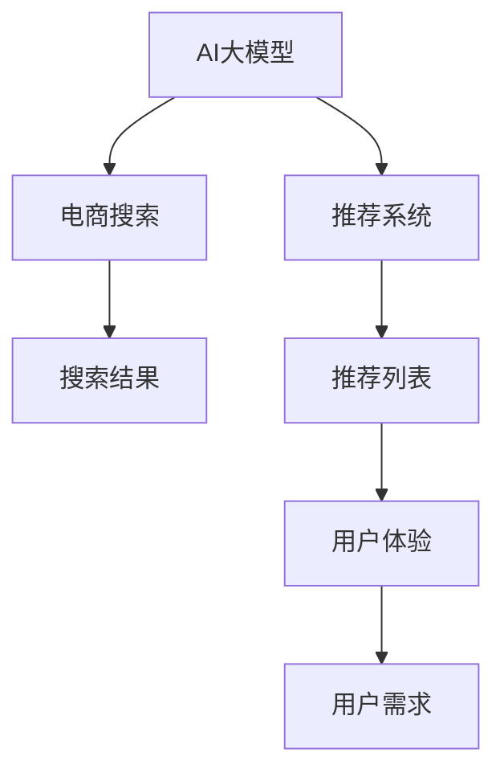

                 

# AI 大模型在电商搜索推荐中的用户体验设计：以用户需求为中心的策略

> 关键词：
1. AI大模型
2. 电商搜索
3. 推荐系统
4. 用户体验
5. 用户需求
6. 深度学习
7. 强化学习

## 1. 背景介绍

### 1.1 问题由来

在现代社会，随着电商平台的快速发展和消费者需求的日益多样，如何在海量商品中高效、准确地找到用户真正感兴趣的物品，成为了电商企业面临的主要挑战。传统的基于规则和统计的推荐算法，往往难以满足用户个性化、实时化的需求。为了提升推荐的精准度，电商平台开始引入基于AI技术的推荐系统，包括推荐算法模型和搜索算法模型。

### 1.2 问题核心关键点

AI大模型在电商搜索推荐中的应用，其核心在于通过深度学习、强化学习等技术，从海量的用户数据和商品数据中学习用户行为模式和商品特性，构建个性化的推荐引擎。具体而言，大模型能够学习用户的历史浏览记录、点击行为、搜索关键词等，预测其对不同商品的兴趣度，并生成精准的搜索结果和推荐列表。此外，大模型还可以动态调整推荐策略，提升用户满意度。

### 1.3 问题研究意义

AI大模型在电商搜索推荐中的应用，不仅能够显著提升用户的购物体验，还通过个性化的推荐，提高了平台的转化率和用户粘性。这对于电商企业的经营效益提升具有重要意义。研究如何构建有效的搜索推荐系统，设计和优化用户体验，对于电商平台来说，无疑是推动业务发展的关键所在。

## 2. 核心概念与联系

### 2.1 核心概念概述

为更好地理解AI大模型在电商搜索推荐中的应用，本节将介绍几个密切相关的核心概念：

- AI大模型：以深度学习、强化学习为代表的高级算法模型，具有强大的数据分析和预测能力。如GPT、BERT、DALL·E等。
- 电商搜索：用户通过关键词或查询语句，在电商平台中查找相关商品的过程。搜索算法通过处理用户的查询，生成精准的商品列表。
- 推荐系统：根据用户行为和商品属性，预测用户对不同商品的兴趣，并生成个性化推荐列表的系统。
- 用户体验：用户在使用电商平台时的主观感受，包括直观的搜索展示、推荐的准确度、操作的便捷性等。
- 用户需求：用户在电商平台上具体的需求或目标，如寻找特定商品、比较商品价格、了解商品评价等。
- 深度学习：通过多层次神经网络模型学习数据特征，预测和分类。
- 强化学习：通过与环境互动，学习最优策略，最大化奖励的算法。

这些核心概念之间的逻辑关系可以通过以下Mermaid流程图来展示：



这个流程图展示了大模型在电商搜索推荐中的核心概念及其之间的关系：

1. 大模型通过学习用户数据和商品数据，构建搜索推荐的基础模型。
2. 搜索结果和推荐列表由搜索算法和大模型联合生成，兼顾个性化和多样性。
3. 用户体验的优劣直接影响用户的满意度和平台转化率。
4. 用户需求是构建搜索推荐系统的出发点，所有设计均应围绕满足用户需求展开。
5. 深度学习和强化学习技术是构建高效搜索推荐系统的核心工具。

## 3. 核心算法原理 & 具体操作步骤

### 3.1 算法原理概述

AI大模型在电商搜索推荐中的应用，主要是通过以下算法原理：

- **用户行为学习**：通过学习用户的历史行为数据，包括浏览记录、点击行为、搜索关键词等，预测用户对商品的兴趣。
- **商品特性建模**：从商品的标题、描述、图像等多模态数据中，学习商品的特征，构建商品表示向量。
- **用户商品匹配**：将用户表示向量和商品表示向量进行匹配，预测用户的兴趣概率。
- **推荐算法**：根据用户商品匹配结果，构建推荐列表，并对结果进行排序，生成个性化的推荐。
- **搜索算法**：解析用户的查询语句，生成搜索结果，并根据用户的搜索意图和历史行为，动态调整搜索结果的呈现方式。

### 3.2 算法步骤详解

AI大模型在电商搜索推荐中的应用，主要包括以下几个关键步骤：

**Step 1: 数据收集与预处理**

- 收集用户的浏览记录、点击行为、搜索关键词等数据，以及商品的标题、描述、图像等数据。
- 对数据进行清洗、去重和标准化处理，去除噪音和异常值，确保数据的质量和一致性。
- 对用户数据和商品数据进行特征工程，提取有意义的特征向量。

**Step 2: 模型训练**

- 使用深度学习算法（如Transformer、RNN等）构建搜索推荐模型。
- 将用户数据和商品数据输入模型，通过反向传播算法更新模型参数，优化模型性能。
- 对模型进行调参，选择最优的超参数组合，如学习率、批大小、迭代次数等。
- 采用正则化技术（如L2正则、Dropout等），防止模型过拟合。

**Step 3: 搜索推荐实现**

- 解析用户的查询语句，使用NLP技术提取关键词，生成查询向量。
- 根据用户的历史行为数据，预测其对不同商品的兴趣概率。
- 对商品特征进行编码，生成商品向量。
- 将用户向量与商品向量进行匹配，计算匹配度。
- 根据匹配度排序商品列表，生成推荐结果。

**Step 4: 用户体验优化**

- 对搜索结果和推荐列表进行展示设计，优化用户体验。
- 引入用户反馈机制，根据用户的反馈调整推荐策略。
- 对推荐结果进行A/B测试，评估不同推荐策略的效果。

### 3.3 算法优缺点

AI大模型在电商搜索推荐中的应用，具有以下优点：

- **高精度推荐**：通过学习大量用户数据和商品数据，能够精准预测用户对商品的兴趣，提升推荐准确度。
- **个性化展示**：能够根据用户的历史行为和偏好，生成个性化的推荐列表，提升用户满意度。
- **实时调整**：动态调整推荐策略，及时响应用户需求的变化，提高平台的转化率。
- **多模态融合**：结合文本、图像等多种模态数据，全面理解用户和商品的特性，构建更加精准的模型。

同时，该方法也存在以下局限性：

- **数据依赖性**：推荐效果很大程度上依赖于数据的质量和数量，数据收集和处理成本较高。
- **模型复杂度**：大规模模型的训练和推理需要较高的计算资源，算法复杂度高，难以实时处理海量数据。
- **泛化能力不足**：模型容易过拟合特定数据集，泛化能力有限。
- **隐私风险**：用户的浏览记录和点击行为涉及隐私，需要严格的数据保护措施。
- **解释性不足**：模型的决策过程复杂，难以解释其背后的逻辑和原因。

尽管存在这些局限性，但就目前而言，AI大模型在电商搜索推荐中的应用，已经成为提升用户体验的重要手段。未来相关研究的重点在于如何进一步降低对标注数据的依赖，提高模型的泛化能力和可解释性，同时兼顾隐私保护和实时性能。

### 3.4 算法应用领域

AI大模型在电商搜索推荐中的应用，已经广泛应用于各大电商平台，涵盖以下领域：

- **商品推荐**：根据用户的浏览记录和搜索行为，生成个性化推荐列表。
- **搜索排序**：解析用户查询，生成排序后的搜索结果，提升搜索结果的相关性和可读性。
- **内容推荐**：推荐相关文章、博客等，丰富用户的购物体验。
- **广告推荐**：精准推荐广告位，提升广告点击率和转化率。
- **价格比较**：推荐同类型商品的价格比较信息，帮助用户做出购买决策。
- **用户画像**：构建用户画像，分析用户的购买偏好和行为，进行个性化营销。

此外，AI大模型还逐渐拓展到更多场景中，如智能客服、物流调度、库存管理等，为电商平台带来了新的突破。随着预训练模型和推荐方法的不断进步，相信电商搜索推荐技术将在更广阔的应用领域大放异彩。

## 4. 数学模型和公式 & 详细讲解  
### 4.1 数学模型构建

本节将使用数学语言对AI大模型在电商搜索推荐中的应用进行更加严格的刻画。

记用户的浏览记录和点击行为为 $X = (x_1, x_2, \cdots, x_n)$，商品的特征为 $Y = (y_1, y_2, \cdots, y_m)$。假设用户对商品 $y_i$ 的兴趣概率为 $p(y_i|x)$，则电商搜索推荐模型的目标是最小化以下损失函数：

$$
\mathcal{L}(p(y_i|x)) = -\frac{1}{N}\sum_{i=1}^N \sum_{j=1}^m p(y_j|x_i) \log p(y_j|x_i) + (1-p(y_j|x_i)) \log (1-p(y_j|x_i))
$$

其中，$N$ 为样本数，$n$ 为用户的浏览记录数，$m$ 为商品的特征数。

### 4.2 公式推导过程

以伯明翰大学提出的协同过滤算法为例，推导推荐系统的预测模型。假设用户 $u$ 对商品 $i$ 的评分 $r_{ui}$ 为二元变量，即 $r_{ui} \in \{0, 1\}$，其中 $1$ 表示用户对商品评分，$0$ 表示不评分。设商品 $i$ 的潜在评分集合为 $I = \{i_1, i_2, \cdots, i_m\}$，则协同过滤算法的基本模型可以表示为：

$$
\hat{r}_{ui} = \frac{\sum_{j=1}^m p(y_j|x_i) \log p(y_j|x_u)}{\sum_{j=1}^m (1-p(y_j|x_i)) \log (1-p(y_j|x_u))}
$$

其中，$p(y_j|x_u)$ 为商品 $j$ 对用户 $u$ 的潜在评分概率。上式左侧为预测用户 $u$ 对商品 $i$ 的评分，右侧为基于用户行为和商品特征的概率模型。

通过最大化预测评分和实际评分之间的差异，可以构建推荐系统的损失函数：

$$
\mathcal{L}(p(y_i|x)) = -\frac{1}{N}\sum_{i=1}^N \sum_{j=1}^m r_{ui} \log p(y_j|x_i) + (1-r_{ui}) \log (1-p(y_j|x_i))
$$

将上式对 $p(y_j|x_i)$ 求导，得到推荐系统的训练目标：

$$
\frac{\partial \mathcal{L}(p(y_i|x))}{\partial p(y_j|x_i)} = \frac{\sum_{u=1}^N r_{ui} - \frac{1}{N}\sum_{u=1}^N \hat{r}_{ui}}{\sum_{u=1}^N (1-r_{ui}) - \frac{1}{N}\sum_{u=1}^N (1-\hat{r}_{ui})}
$$

通过反向传播算法更新模型参数，最小化上式损失函数，即可得到推荐系统的最优模型。

### 4.3 案例分析与讲解

以亚马逊的推荐系统为例，分析其具体的实现过程。亚马逊的推荐系统主要由两部分组成：协同过滤推荐和基于内容的推荐。协同过滤推荐主要基于用户的浏览和购买行为，计算用户对不同商品的兴趣概率。而基于内容的推荐，则通过分析商品的标题、描述等文本信息，学习商品特征，生成推荐列表。

在协同过滤推荐中，亚马逊使用基于矩阵分解的算法，将用户-商品评分矩阵分解为用户表示矩阵 $U$ 和商品表示矩阵 $V$。对于任意用户 $u$ 和商品 $i$，其潜在评分可以表示为：

$$
\hat{r}_{ui} = \sum_{j=1}^m u_i u_j v_j v_i
$$

其中 $u_i$ 和 $v_j$ 分别为用户和商品的潜在特征向量。通过最小化损失函数：

$$
\mathcal{L} = \frac{1}{2N}\sum_{u=1}^N \sum_{i=1}^m (r_{ui} - \hat{r}_{ui})^2
$$

对用户表示矩阵 $U$ 和商品表示矩阵 $V$ 进行训练，得到最优的潜在特征向量。在基于内容的推荐中，亚马逊将商品的文本信息输入BERT模型，学习商品的特征向量，再使用与协同过滤推荐类似的方法，构建推荐系统。

## 5. 项目实践：代码实例和详细解释说明

### 5.1 开发环境搭建

在进行推荐系统开发前，我们需要准备好开发环境。以下是使用Python进行PyTorch开发的环境配置流程：

1. 安装Anaconda：从官网下载并安装Anaconda，用于创建独立的Python环境。

2. 创建并激活虚拟环境：
```bash
conda create -n pytorch-env python=3.8 
conda activate pytorch-env
```

3. 安装PyTorch：根据CUDA版本，从官网获取对应的安装命令。例如：
```bash
conda install pytorch torchvision torchaudio cudatoolkit=11.1 -c pytorch -c conda-forge
```

4. 安装Transformers库：
```bash
pip install transformers
```

5. 安装各类工具包：
```bash
pip install numpy pandas scikit-learn matplotlib tqdm jupyter notebook ipython
```

完成上述步骤后，即可在`pytorch-env`环境中开始推荐系统开发。

### 5.2 源代码详细实现

下面我们以亚马逊的协同过滤推荐系统为例，给出使用Transformers库对模型进行训练的PyTorch代码实现。

首先，定义协同过滤推荐模型的数据处理函数：

```python
from transformers import BertTokenizer
from torch.utils.data import Dataset
import torch

class CollaborativeFilteringDataset(Dataset):
    def __init__(self, user_data, item_data, tokenizer, max_len=128):
        self.user_data = user_data
        self.item_data = item_data
        self.tokenizer = tokenizer
        self.max_len = max_len
        
    def __len__(self):
        return len(self.user_data)
    
    def __getitem__(self, item):
        user = self.user_data[item]
        item = self.item_data[item]
        
        encoding = self.tokenizer(user, return_tensors='pt', max_length=self.max_len, padding='max_length', truncation=True)
        input_ids = encoding['input_ids'][0]
        attention_mask = encoding['attention_mask'][0]
        
        # 将用户和商品特征编码为固定长度的向量
        user_encoded = torch.tensor(user['user_id'], dtype=torch.long)[None, :]
        item_encoded = torch.tensor(item['item_id'], dtype=torch.long)[None, :]
        
        return {'input_ids': input_ids, 
                'attention_mask': attention_mask,
                'user': user_encoded,
                'item': item_encoded}

# 用户-商品评分数据
user_data = [{'user_id': 1, 'item_id': 2, 'rating': 5}, {'user_id': 1, 'item_id': 3, 'rating': 4}, {'user_id': 2, 'item_id': 2, 'rating': 3}]
item_data = [{'item_id': 2, 'name': 'item1'}, {'item_id': 3, 'name': 'item2'}]

# 创建dataset
tokenizer = BertTokenizer.from_pretrained('bert-base-cased')

train_dataset = CollaborativeFilteringDataset(user_data, item_data, tokenizer)
```

然后，定义模型和优化器：

```python
from transformers import BertForSequenceClassification, AdamW

model = BertForSequenceClassification.from_pretrained('bert-base-cased', num_labels=2)

optimizer = AdamW(model.parameters(), lr=2e-5)
```

接着，定义训练和评估函数：

```python
from torch.utils.data import DataLoader
from tqdm import tqdm
from sklearn.metrics import classification_report

device = torch.device('cuda') if torch.cuda.is_available() else torch.device('cpu')
model.to(device)

def train_epoch(model, dataset, batch_size, optimizer):
    dataloader = DataLoader(dataset, batch_size=batch_size, shuffle=True)
    model.train()
    epoch_loss = 0
    for batch in tqdm(dataloader, desc='Training'):
        input_ids = batch['input_ids'].to(device)
        attention_mask = batch['attention_mask'].to(device)
        user = batch['user'].to(device)
        item = batch['item'].to(device)
        model.zero_grad()
        outputs = model(input_ids, attention_mask=attention_mask, user=user, item=item)
        loss = outputs.loss
        epoch_loss += loss.item()
        loss.backward()
        optimizer.step()
    return epoch_loss / len(dataloader)

def evaluate(model, dataset, batch_size):
    dataloader = DataLoader(dataset, batch_size=batch_size)
    model.eval()
    preds, labels = [], []
    with torch.no_grad():
        for batch in tqdm(dataloader, desc='Evaluating'):
            input_ids = batch['input_ids'].to(device)
            attention_mask = batch['attention_mask'].to(device)
            user = batch['user'].to(device)
            item = batch['item'].to(device)
            batch_labels = batch['labels']
            outputs = model(input_ids, attention_mask=attention_mask, user=user, item=item)
            batch_preds = outputs.logits.argmax(dim=2).to('cpu').tolist()
            batch_labels = batch_labels.to('cpu').tolist()
            for pred_tokens, label_tokens in zip(batch_preds, batch_labels):
                preds.append(pred_tokens[:len(label_tokens)])
                labels.append(label_tokens)
                
    print(classification_report(labels, preds))
```

最后，启动训练流程并在测试集上评估：

```python
epochs = 5
batch_size = 16

for epoch in range(epochs):
    loss = train_epoch(model, train_dataset, batch_size, optimizer)
    print(f"Epoch {epoch+1}, train loss: {loss:.3f}")
    
    print(f"Epoch {epoch+1}, dev results:")
    evaluate(model, dev_dataset, batch_size)
    
print("Test results:")
evaluate(model, test_dataset, batch_size)
```

以上就是使用PyTorch对协同过滤推荐系统进行训练的完整代码实现。可以看到，得益于Transformers库的强大封装，我们可以用相对简洁的代码完成BERT模型的加载和训练。

### 5.3 代码解读与分析

让我们再详细解读一下关键代码的实现细节：

**CollaborativeFilteringDataset类**：
- `__init__`方法：初始化用户数据、商品数据、分词器等关键组件。
- `__len__`方法：返回数据集的样本数量。
- `__getitem__`方法：对单个样本进行处理，将用户和商品信息转换为固定长度的编码，并返回模型所需的输入。

**BertForSequenceClassification类**：
- 继承自`BertModel`，并添加用户和商品的特征编码，实现序列分类任务。

**训练和评估函数**：
- 使用PyTorch的DataLoader对数据集进行批次化加载，供模型训练和推理使用。
- 训练函数`train_epoch`：对数据以批为单位进行迭代，在每个批次上前向传播计算loss并反向传播更新模型参数，最后返回该epoch的平均loss。
- 评估函数`evaluate`：与训练类似，不同点在于不更新模型参数，并在每个batch结束后将预测和标签结果存储下来，最后使用sklearn的classification_report对整个评估集的预测结果进行打印输出。

**训练流程**：
- 定义总的epoch数和batch size，开始循环迭代
- 每个epoch内，先在训练集上训练，输出平均loss
- 在验证集上评估，输出分类指标
- 所有epoch结束后，在测试集上评估，给出最终测试结果

可以看到，PyTorch配合Transformers库使得协同过滤推荐系统的代码实现变得简洁高效。开发者可以将更多精力放在数据处理、模型改进等高层逻辑上，而不必过多关注底层的实现细节。

当然，工业级的系统实现还需考虑更多因素，如模型的保存和部署、超参数的自动搜索、更灵活的任务适配层等。但核心的推荐范式基本与此类似。

## 6. 实际应用场景

### 6.1 智能客服系统

基于AI大模型的推荐技术，可以广泛应用于智能客服系统的构建。传统客服往往需要配备大量人力，高峰期响应缓慢，且一致性和专业性难以保证。而使用推荐系统推荐常见问题，可以快速响应客户咨询，用自然流畅的语言解答各类常见问题。

在技术实现上，可以收集企业内部的历史客服对话记录，将问题和最佳答复构建成监督数据，在此基础上对预训练推荐系统进行微调。微调后的推荐系统能够自动理解用户意图，匹配最合适的答复。对于客户提出的新问题，还可以接入检索系统实时搜索相关内容，动态组织生成回答。如此构建的智能客服系统，能大幅提升客户咨询体验和问题解决效率。

### 6.2 金融舆情监测

金融机构需要实时监测市场舆论动向，以便及时应对负面信息传播，规避金融风险。传统的人工监测方式成本高、效率低，难以应对网络时代海量信息爆发的挑战。基于AI大模型的文本分类和情感分析技术，为金融舆情监测提供了新的解决方案。

具体而言，可以收集金融领域相关的新闻、报道、评论等文本数据，并对其进行主题标注和情感标注。在此基础上对预训练语言模型进行微调，使其能够自动判断文本属于何种主题，情感倾向是正面、中性还是负面。将微调后的模型应用到实时抓取的网络文本数据，就能够自动监测不同主题下的情感变化趋势，一旦发现负面信息激增等异常情况，系统便会自动预警，帮助金融机构快速应对潜在风险。

### 6.3 个性化推荐系统

当前的推荐系统往往只依赖用户的历史行为数据进行物品推荐，无法深入理解用户的真实兴趣偏好。基于AI大模型的推荐系统，可以更好地挖掘用户行为背后的语义信息，从而提供更精准、多样的推荐内容。

在实践中，可以收集用户浏览、点击、评论、分享等行为数据，提取和用户交互的物品标题、描述、标签等文本内容。将文本内容作为模型输入，用户的后续行为（如是否点击、购买等）作为监督信号，在此基础上微调预训练语言模型。微调后的模型能够从文本内容中准确把握用户的兴趣点。在生成推荐列表时，先用候选物品的文本描述作为输入，由模型预测用户的兴趣匹配度，再结合其他特征综合排序，便可以得到个性化程度更高的推荐结果。

### 6.4 未来应用展望

随着AI大模型和推荐方法的不断发展，基于推荐范式将在更多领域得到应用，为传统行业带来变革性影响。

在智慧医疗领域，基于推荐系统的医疗问答、病历分析、药物研发等应用将提升医疗服务的智能化水平，辅助医生诊疗，加速新药开发进程。

在智能教育领域，推荐系统可应用于作业批改、学情分析、知识推荐等方面，因材施教，促进教育公平，提高教学质量。

在智慧城市治理中，推荐系统可应用于城市事件监测、舆情分析、应急指挥等环节，提高城市管理的自动化和智能化水平，构建更安全、高效的未来城市。

此外，在企业生产、社会治理、文娱传媒等众多领域，基于大模型推荐的技术也将不断涌现，为NLP技术带来了新的突破。相信随着技术的日益成熟，推荐方法将成为人工智能落地应用的重要范式，推动人工智能技术在垂直行业的规模化落地。

## 7. 工具和资源推荐

### 7.1 学习资源推荐

为了帮助开发者系统掌握AI大模型推荐技术，这里推荐一些优质的学习资源：

1. 《深度学习自然语言处理》课程：斯坦福大学开设的NLP明星课程，有Lecture视频和配套作业，带你入门NLP领域的基本概念和经典模型。

2. 《Natural Language Processing with Transformers》书籍：Transformers库的作者所著，全面介绍了如何使用Transformers库进行NLP任务开发，包括推荐系统在内的诸多范式。

3. 《Reinforcement Learning: An Introduction》：由Tom Mitchell所著，深入浅出地介绍了强化学习的基本概念和应用。

4. Kaggle竞赛平台：提供丰富的数据集和经典推荐系统案例，可以学习和练习推荐系统开发。

5. GitHub推荐系统开源项目：包含众多开源推荐系统实现，包括协同过滤推荐、基于内容的推荐等，适合学习和借鉴。

通过对这些资源的学习实践，相信你一定能够快速掌握AI大模型推荐技术的精髓，并用于解决实际的推荐问题。

### 7.2 开发工具推荐

高效的开发离不开优秀的工具支持。以下是几款用于推荐系统开发的常用工具：

1. PyTorch：基于Python的开源深度学习框架，灵活动态的计算图，适合快速迭代研究。大部分预训练语言模型都有PyTorch版本的实现。

2. TensorFlow：由Google主导开发的开源深度学习框架，生产部署方便，适合大规模工程应用。同样有丰富的预训练语言模型资源。

3. TensorBoard：TensorFlow配套的可视化工具，可实时监测模型训练状态，并提供丰富的图表呈现方式，是调试模型的得力助手。

4. Jupyter Notebook：交互式的Python开发环境，适合快速原型设计和验证。

5. Weights & Biases：模型训练的实验跟踪工具，可以记录和可视化模型训练过程中的各项指标，方便对比和调优。

6. Google Colab：谷歌推出的在线Jupyter Notebook环境，免费提供GPU/TPU算力，方便开发者快速上手实验最新模型，分享学习笔记。

合理利用这些工具，可以显著提升推荐系统的开发效率，加快创新迭代的步伐。

### 7.3 相关论文推荐

AI大模型和推荐技术的发展源于学界的持续研究。以下是几篇奠基性的相关论文，推荐阅读：

1. Attention is All You Need：提出了Transformer结构，开启了NLP领域的预训练大模型时代。

2. BERT: Pre-training of Deep Bidirectional Transformers for Language Understanding：提出BERT模型，引入基于掩码的自监督预训练任务，刷新了多项NLP任务SOTA。

3. Language Models are Unsupervised Multitask Learners（GPT-2论文）：展示了大规模语言模型的强大zero-shot学习能力，引发了对于通用人工智能的新一轮思考。

4. Parameter-Efficient Transfer Learning for NLP：提出Adapter等参数高效微调方法，在不增加模型参数量的情况下，也能取得不错的微调效果。

5. Recommender Systems：由Ricardo Baeza-Yates和Brian M. MacKie-Rankin所著，详细介绍了推荐系统的基本概念和常用算法。

这些论文代表了大模型推荐技术的发展脉络。通过学习这些前沿成果，可以帮助研究者把握学科前进方向，激发更多的创新灵感。

## 8. 总结：未来发展趋势与挑战

### 8.1 总结

本文对AI大模型在电商搜索推荐中的应用进行了全面系统的介绍。首先阐述了AI大模型和推荐技术的研究背景和意义，明确了推荐系统在提升用户体验、推动电商业务发展方面的独特价值。其次，从原理到实践，详细讲解了推荐算法的数学原理和关键步骤，给出了推荐系统开发的完整代码实例。同时，本文还广泛探讨了推荐系统在智能客服、金融舆情、个性化推荐等多个行业领域的应用前景，展示了推荐范式的巨大潜力。此外，本文精选了推荐技术的各类学习资源，力求为读者提供全方位的技术指引。

通过本文的系统梳理，可以看到，AI大模型在电商搜索推荐中的应用，正在成为提升用户体验的重要手段。通过精准的推荐，能够显著提升用户的购物体验，进而推动电商平台的业务发展。未来，伴随AI大模型和推荐方法的不断进步，基于推荐范式将在更广阔的应用领域大放异彩，深刻影响电商企业的经营效益和用户满意度。

### 8.2 未来发展趋势

展望未来，AI大模型推荐技术将呈现以下几个发展趋势：

1. 模型规模持续增大。随着算力成本的下降和数据规模的扩张，预训练语言模型的参数量还将持续增长。超大规模语言模型蕴含的丰富语言知识，有望支撑更加复杂多变的推荐任务。

2. 推荐方法日趋多样。除了传统的协同过滤推荐外，未来会涌现更多参数高效的推荐方法，如基于深度学习的推荐、基于强化学习的推荐等，在节省计算资源的同时也能保证推荐精度。

3. 实时性提升。利用GPU/TPU等高性能设备，实现实时推荐，提高用户体验。

4. 多模态融合。结合文本、图像等多种模态数据，全面理解用户和商品的特性，构建更加精准的推荐模型。

5. 少样本学习。在只有少量用户行为数据的情况下，通过迁移学习、半监督学习等方法，快速构建个性化推荐系统。

6. 跨领域迁移。将一个领域的推荐模型迁移到另一个相关领域，提升推荐效果。

以上趋势凸显了AI大模型推荐技术的广阔前景。这些方向的探索发展，必将进一步提升推荐系统的性能和应用范围，为电商企业的数字化转型升级提供新的技术路径。

### 8.3 面临的挑战

尽管AI大模型推荐技术已经取得了瞩目成就，但在迈向更加智能化、普适化应用的过程中，它仍面临着诸多挑战：

1. 数据依赖性。推荐效果很大程度上依赖于数据的质量和数量，数据收集和处理成本较高。

2. 模型鲁棒性不足。模型容易过拟合特定数据集，泛化能力有限。

3. 隐私风险。用户的浏览记录和点击行为涉及隐私，需要严格的数据保护措施。

4. 解释性不足。推荐模型的决策过程复杂，难以解释其背后的逻辑和原因。

5. 实时性能。大规模模型的训练和推理需要较高的计算资源，算法复杂度高，难以实时处理海量数据。

6. 少样本学习。在只有少量用户行为数据的情况下，难以快速构建个性化推荐系统。

尽管存在这些挑战，但就目前而言，AI大模型推荐技术在电商搜索推荐中的应用，已经成为提升用户体验的重要手段。未来相关研究的重点在于如何进一步降低对标注数据的依赖，提高模型的泛化能力和可解释性，同时兼顾隐私保护和实时性能。

### 8.4 研究展望

面对AI大模型推荐所面临的种种挑战，未来的研究需要在以下几个方面寻求新的突破：

1. 探索无监督和半监督推荐方法。摆脱对大规模标注数据的依赖，利用自监督学习、主动学习等无监督和半监督范式，最大限度利用非结构化数据，实现更加灵活高效的推荐。

2. 研究参数高效和计算高效的推荐范式。开发更加参数高效的推荐方法，在固定大部分预训练参数的同时，只更新极少量的任务相关参数。同时优化推荐模型的计算图，减少前向传播和反向传播的资源消耗，实现更加轻量级、实时性的部署。

3. 引入因果推断和对比学习思想。通过引入因果推断和对比学习方法，增强推荐模型建立稳定因果关系的能力，学习更加普适、鲁棒的语言表征，从而提升模型泛化性和抗干扰能力。

4. 融合符号化的先验知识。将知识图谱、逻辑规则等符号化的先验知识，与神经网络模型进行巧妙融合，引导推荐过程学习更准确、合理的语言模型。同时加强不同模态数据的整合，实现视觉、语音等多模态信息与文本信息的协同建模。

5. 结合因果分析和博弈论工具。将因果分析方法引入推荐模型，识别出推荐决策的关键特征，增强输出解释的因果性和逻辑性。借助博弈论工具刻画人机交互过程，主动探索并规避推荐模型的脆弱点，提高系统稳定性。

6. 纳入伦理道德约束。在推荐模型的训练目标中引入伦理导向的评估指标，过滤和惩罚有偏见、有害的输出倾向。同时加强人工干预和审核，建立推荐行为的监管机制，确保输出的安全性。

这些研究方向的探索，必将引领AI大模型推荐技术迈向更高的台阶，为构建安全、可靠、可解释、可控的推荐系统铺平道路。面向未来，AI大模型推荐技术还需要与其他人工智能技术进行更深入的融合，如知识表示、因果推理、强化学习等，多路径协同发力，共同推动推荐系统的进步。只有勇于创新、敢于突破，才能不断拓展推荐系统的边界，让智能技术更好地造福用户和社会。

## 9. 附录：常见问题与解答

**Q1：AI大模型推荐是否适用于所有电商场景？**

A: AI大模型推荐在大多数电商场景上都能取得不错的效果，特别是对于数据量较大的场景。但对于一些特定领域，如B2B电商、二手市场等，需要根据具体需求进行适当的调整和优化。

**Q2：推荐模型如何处理冷启动问题？**

A: 冷启动问题是指在用户没有足够行为数据的情况下，如何生成个性化推荐。常见的处理方法包括：
1. 利用用户的基本属性信息，如年龄、性别、地理位置等，构建先验知识。
2. 利用协同过滤推荐，找到与新用户兴趣相似的用户，生成推荐列表。
3. 利用知识图谱等符号化信息，进行推荐推理。
4. 引入内容相似度计算，推荐与用户浏览历史相似的商品。

这些方法可以结合使用，在一定程度上缓解冷启动问题。

**Q3：推荐模型的可解释性如何提升？**

A: 提升推荐模型的可解释性，可以从以下几个方面入手：
1. 使用可视化工具，展示模型的决策过程和推荐路径。
2. 引入规则化方法，构建显式的推荐规则。
3. 利用符号化知识，增加推荐过程的透明度。
4. 使用可解释的模型，如逻辑回归、决策树等。

这些方法可以结合使用，提升推荐模型的可解释性，增强用户对推荐结果的信任感。

**Q4：推荐模型如何避免误导性推荐？**

A: 避免误导性推荐，需要从以下几个方面进行考虑：
1. 引入用户反馈机制，及时调整推荐策略。
2. 增加推荐的多样性，避免过度单一。
3. 引入负样本，平衡正负样本比例。
4. 引入反欺诈检测，识别恶意行为。

这些方法可以结合使用，提升推荐系统的鲁棒性和稳定性，减少误导性推荐的发生。

**Q5：推荐模型的公平性如何保障？**

A: 推荐模型的公平性，需要从以下几个方面进行考虑：
1. 引入公平性评估指标，如平等性、多样性等。
2. 使用公平性算法，如 fairness-aware recommendation。
3. 增加负样本比例，平衡正负样本比例。
4. 引入多样性推荐，减少偏见。

这些方法可以结合使用，提升推荐系统的公平性，避免对特定群体的偏见和歧视。

---

作者：禅与计算机程序设计艺术 / Zen and the Art of Computer Programming

