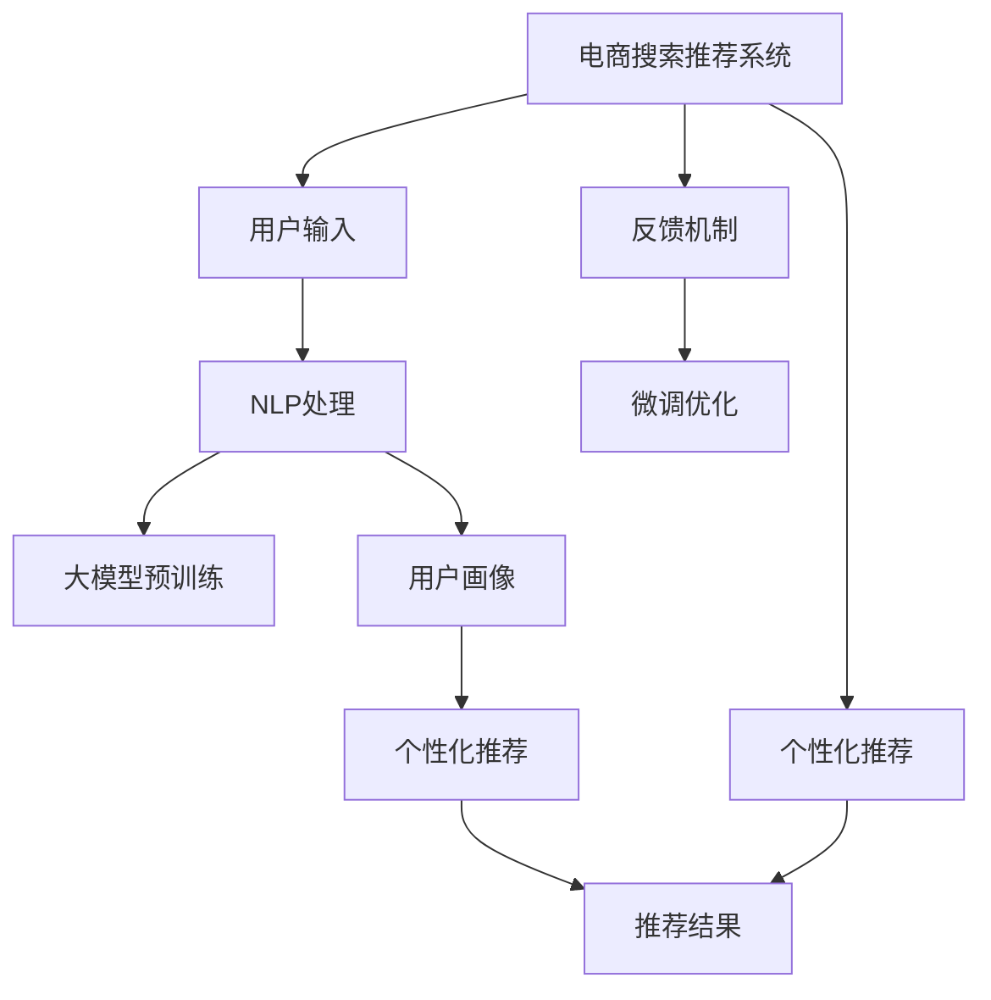

                 

# AI 大模型在电商搜索推荐中的用户画像构建：精准把握用户需求与行为意图

## 1. 背景介绍

随着电商行业的迅速发展，在线搜索和推荐系统已成为用户体验的重要组成部分。用户在电商平台上输入搜索关键词，系统通过算法匹配出符合用户需求的商品，这种高效便捷的体验显著提升了用户的购物体验。然而，搜索推荐系统的核心问题在于如何精准地理解用户需求与行为意图，从而提供更加个性化的服务。

### 1.1 问题由来

电商搜索推荐系统面临的挑战主要来自于以下几个方面：

- **用户需求的多样性**：用户输入的搜索关键词往往模糊且不确定，如何从这些词汇中提取出用户的真实需求是一个难题。
- **用户行为的多变性**：用户的行为和偏好随着时间、场景的变化而变化，单一的搜索关键词难以全面捕捉用户行为。
- **冷启动问题**：新用户或较少购物记录的用户，缺乏足够的行为数据，难以建立有效的用户画像。

大模型在自然语言处理和用户行为理解方面具有强大能力，通过微调训练可以更好地适应电商搜索推荐系统，解决上述问题。本文将探讨如何利用大模型构建精准的用户画像，提升电商搜索推荐的个性化和准确性。

## 2. 核心概念与联系

### 2.1 核心概念概述

- **用户画像(User Profile)**：对用户行为、偏好、兴趣等特征的全面描述，用于个性化推荐。
- **自然语言处理(Natural Language Processing, NLP)**：通过机器学习算法理解、分析、生成自然语言，是大模型构建用户画像的重要工具。
- **电商搜索推荐系统(E-commerce Search and Recommendation System)**：结合搜索和推荐技术，为用户提供个性化商品展示和推荐。
- **深度学习(Deep Learning)**：一类基于神经网络的机器学习方法，大模型技术的基础。
- **迁移学习(Transfer Learning)**：利用预训练模型，在小规模数据上微调，提升模型性能。
- **注意力机制(Attention Mechanism)**：在大模型中，用于关注输入序列中重要特征的机制，提升模型的理解能力。

这些概念之间相互关联，共同构成了电商搜索推荐系统和大模型技术的应用框架。通过深度学习和大模型技术，可以构建出精准的用户画像，实现个性化推荐，提升用户满意度。

### 2.2 核心概念原理和架构的 Mermaid 流程图



通过 Mermaid 流程图，我们可以看到大模型在电商搜索推荐系统中的作用：用户输入搜索关键词后，通过 NLP 处理，得到向量化的表示，接着通过大模型进行预训练，构建用户画像，并结合推荐算法输出个性化推荐结果。同时，系统还通过反馈机制，不断优化模型，提升推荐效果。

## 3. 核心算法原理 & 具体操作步骤

### 3.1 算法原理概述

基于大模型的电商搜索推荐系统，主要通过以下步骤实现：

1. **用户输入处理**：对用户输入的搜索关键词进行 NLP 处理，转换为向量化的表示。
2. **大模型预训练**：使用大模型在无标签的电商语料上进行预训练，学习通用的语言和用户行为模式。
3. **用户画像构建**：通过微调训练，在大模型上构建针对特定用户或商品的用户画像，捕捉用户需求与行为意图。
4. **个性化推荐**：结合用户画像和商品信息，应用推荐算法输出个性化推荐结果。
5. **微调优化**：通过用户反馈，不断优化模型，提升推荐效果。

### 3.2 算法步骤详解

#### 3.2.1 用户输入处理

用户输入搜索关键词后，通过 NLP 处理将其转换为向量化的表示。具体步骤如下：

1. **分词**：将搜索关键词切分为单个词汇，去除停用词。
2. **词向量化**：将词汇转换为向量表示，常用的方法有词袋模型、TF-IDF、Word2Vec、BERT 等。
3. **序列处理**：将序列数据输入到大模型中进行处理，生成向量化的表示。

#### 3.2.2 大模型预训练

大模型通过预训练学习通用的语言和用户行为模式。常用的预训练任务包括：

1. **语言建模**：预测输入序列的下一个单词，学习语言规律。
2. **掩码语言模型**：随机遮盖输入序列中的部分词汇，预测被遮盖的词汇，学习词汇间的关系。
3. **文本分类**：将文本分为不同类别，学习文本分类能力。

预训练大模型的参数通常通过大规模的无标签语料进行训练，学习到丰富的语言知识。

#### 3.2.3 用户画像构建

用户画像构建是电商搜索推荐系统的核心环节。通过微调训练，在大模型上构建针对特定用户或商品的用户画像。具体步骤如下：

1. **任务定义**：根据电商搜索推荐系统需求，定义任务，如情感分析、意图识别、推荐排序等。
2. **数据准备**：收集电商搜索数据，标注出用户的行为意图、偏好等信息，作为微调训练的数据集。
3. **模型微调**：在大模型上微调训练，调整模型参数，使其适应电商搜索推荐任务。
4. **画像生成**：通过微调后的模型，生成用户画像向量，捕捉用户的真实需求与行为意图。

#### 3.2.4 个性化推荐

个性化推荐结合用户画像和商品信息，输出个性化推荐结果。具体步骤如下：

1. **商品表示**：将商品信息转换为向量化的表示。
2. **相似度计算**：计算用户画像向量与商品向量的相似度，筛选出相关商品。
3. **排序优化**：结合排序算法，优化推荐结果的展示顺序。

#### 3.2.5 微调优化

微调优化通过用户反馈，不断提升推荐效果。具体步骤如下：

1. **反馈收集**：收集用户对推荐结果的反馈，包括点击、购买、评分等信息。
2. **模型更新**：根据用户反馈，更新模型参数，优化推荐效果。
3. **持续迭代**：重复上述步骤，不断迭代优化，提升推荐效果。

### 3.3 算法优缺点

#### 3.3.1 优点

1. **广泛适用性**：大模型预训练的通用知识可以应用于多种电商搜索推荐任务，提升推荐效果。
2. **精准把握需求**：通过用户画像构建，可以精准把握用户的真实需求与行为意图。
3. **提升推荐效果**：微调训练可以显著提升个性化推荐的准确性和个性化程度。

#### 3.3.2 缺点

1. **数据依赖性**：微调训练需要大量的电商搜索数据，数据获取和标注成本较高。
2. **资源消耗大**：预训练和微调训练需要大量的计算资源，资源消耗较大。
3. **模型复杂性**：大模型结构复杂，需要更多的技术支持和维护。

### 3.4 算法应用领域

大模型在电商搜索推荐系统的应用领域主要包括以下几个方面：

1. **个性化推荐**：通过用户画像构建，提供个性化推荐服务。
2. **搜索排序**：根据用户画像和商品信息，优化搜索结果排序。
3. **情感分析**：分析用户对商品或服务的情感倾向，调整推荐策略。
4. **用户行为分析**：挖掘用户行为特征，提升个性化推荐效果。
5. **内容生成**：生成符合用户兴趣的推荐文案或商品描述。

## 4. 数学模型和公式 & 详细讲解 & 举例说明

### 4.1 数学模型构建

基于大模型的电商搜索推荐系统，主要通过以下数学模型实现：

1. **用户输入表示模型**：将用户输入转换为向量化的表示，常用模型有词袋模型、TF-IDF、Word2Vec、BERT 等。
2. **大模型预训练模型**：使用大模型进行预训练，学习通用的语言和用户行为模式。
3. **用户画像构建模型**：通过微调训练，在大模型上构建针对特定用户或商品的用户画像。
4. **个性化推荐模型**：结合用户画像和商品信息，应用推荐算法输出个性化推荐结果。
5. **微调优化模型**：通过用户反馈，不断优化模型，提升推荐效果。

### 4.2 公式推导过程

#### 4.2.1 用户输入表示模型

假设用户输入搜索关键词为 $x_1, x_2, ..., x_n$，采用 BERT 预训练模型将其转换为向量化的表示。假设 $x_i$ 的词向量为 $\vec{v}_i$，则用户输入表示模型为：

$$
\vec{x} = [\vec{v}_1, \vec{v}_2, ..., \vec{v}_n]
$$

#### 4.2.2 大模型预训练模型

假设大模型为 $M_{\theta}$，采用语言建模任务进行预训练。假设输入序列为 $w_1, w_2, ..., w_m$，模型输出概率为 $P(w_{i+1}|w_1,...,w_i)$，则预训练模型的损失函数为：

$$
\mathcal{L} = -\frac{1}{N}\sum_{i=1}^N \log P(w_{i+1}|w_1,...,w_i)
$$

#### 4.2.3 用户画像构建模型

假设用户画像为 $U$，商品信息为 $G$，推荐结果为 $R$，微调训练的目标是最大化推荐效果。采用交叉熵损失函数，目标函数为：

$$
\mathcal{L} = -\frac{1}{N}\sum_{i=1}^N \log P(R|U,G)
$$

其中 $P(R|U,G)$ 表示在用户画像 $U$ 和商品信息 $G$ 条件下，推荐结果 $R$ 的概率分布。

#### 4.2.4 个性化推荐模型

假设商品向量为 $\vec{g}$，用户画像向量为 $\vec{u}$，推荐模型为 $M_{\phi}$，推荐结果为 $r$，则推荐模型的目标函数为：

$$
\mathcal{L} = -\frac{1}{N}\sum_{i=1}^N \log P(r|U,G)
$$

其中 $P(r|U,G)$ 表示在用户画像 $U$ 和商品信息 $G$ 条件下，推荐结果 $r$ 的概率分布。

#### 4.2.5 微调优化模型

假设用户反馈为 $f$，微调优化模型为 $M_{\psi}$，优化目标函数为：

$$
\mathcal{L} = -\frac{1}{N}\sum_{i=1}^N \log P(f|U,G)
$$

其中 $P(f|U,G)$ 表示在用户画像 $U$ 和商品信息 $G$ 条件下，用户反馈 $f$ 的概率分布。

### 4.3 案例分析与讲解

#### 案例分析

假设某电商平台上用户输入的搜索关键词为 "白色T恤男"，系统采用 BERT 预训练模型将其转换为向量化的表示，得到用户输入向量 $\vec{x}$。然后，系统在大模型上微调训练，构建用户画像向量 $\vec{u}$。最后，系统结合商品信息向量 $\vec{g}$，应用推荐算法生成推荐结果向量 $\vec{r}$。通过用户反馈 $f$，系统不断优化模型参数，提升推荐效果。

#### 讲解

1. **用户输入处理**：将搜索关键词 "白色T恤男" 切分为单个词汇，去除停用词，得到词汇序列 $w_1, w_2, ..., w_n$。通过 BERT 预训练模型，将词汇序列转换为向量化的表示 $\vec{x}$。
2. **大模型预训练**：在大模型上进行语言建模任务预训练，学习语言规律。
3. **用户画像构建**：在大模型上进行微调训练，构建用户画像向量 $\vec{u}$。
4. **个性化推荐**：结合商品信息向量 $\vec{g}$，应用推荐算法生成推荐结果向量 $\vec{r}$。
5. **微调优化**：通过用户反馈 $f$，不断优化模型参数，提升推荐效果。

## 5. 项目实践：代码实例和详细解释说明

### 5.1 开发环境搭建

#### 5.1.1 硬件要求

- **CPU**：推荐使用多核 CPU，以便并行计算。
- **GPU**：使用 GPU 加速深度学习模型的训练和推理。
- **内存**：推荐使用 16GB 以上内存，以便存储大规模模型。

#### 5.1.2 软件要求

- **操作系统**：支持 Python 3.7 及以上版本。
- **编程语言**：Python。
- **深度学习框架**：TensorFlow、PyTorch、Keras 等。
- **工具库**：TensorBoard、Numpy、Pandas、Scikit-learn、Matplotlib 等。

### 5.2 源代码详细实现

#### 5.2.1 用户输入处理

```python
from transformers import BertTokenizer, BertModel

# 加载 BERT 模型和分词器
tokenizer = BertTokenizer.from_pretrained('bert-base-uncased')
model = BertModel.from_pretrained('bert-base-uncased')

# 用户输入
search_query = "白色T恤男"

# 分词和向量表示
tokens = tokenizer.tokenize(search_query)
inputs = tokenizer.encode(tokens, add_special_tokens=True)
input_ids = torch.tensor(inputs).unsqueeze(0)

# 向量表示
output = model(input_ids).last_hidden_state
user_input_vector = output.mean(dim=2)
```

#### 5.2.2 大模型预训练

```python
from transformers import BertForMaskedLM, AdamW

# 加载大模型和优化器
model = BertForMaskedLM.from_pretrained('bert-base-uncased')
optimizer = AdamW(model.parameters(), lr=1e-5)

# 预训练数据集
pretrain_data = ...

# 预训练过程
for epoch in range(10):
    # 数据批处理
    pretrain_batch = ...

    # 前向传播
    logits = model(pretrain_batch.input_ids, attention_mask=pretrain_batch.attention_mask)

    # 计算损失
    loss = criterion(logits.view(-1, logits.size(-1)), pretrain_batch.labels)

    # 反向传播
    optimizer.zero_grad()
    loss.backward()
    optimizer.step()

    # 打印损失
    print(f"Epoch {epoch+1}, loss: {loss.item()}")
```

#### 5.2.3 用户画像构建

```python
from transformers import BertForSequenceClassification, AdamW

# 加载大模型和优化器
model = BertForSequenceClassification.from_pretrained('bert-base-uncased')
optimizer = AdamW(model.parameters(), lr=1e-5)

# 训练数据集
train_data = ...

# 微调训练过程
for epoch in range(10):
    # 数据批处理
    train_batch = ...

    # 前向传播
    logits = model(train_batch.input_ids, attention_mask=train_batch.attention_mask)

    # 计算损失
    loss = criterion(logits.view(-1, logits.size(-1)), train_batch.labels)

    # 反向传播
    optimizer.zero_grad()
    loss.backward()
    optimizer.step()

    # 打印损失
    print(f"Epoch {epoch+1}, loss: {loss.item()}")
```

#### 5.2.4 个性化推荐

```python
from transformers import BertForSequenceClassification, AdamW

# 加载大模型和优化器
model = BertForSequenceClassification.from_pretrained('bert-base-uncased')
optimizer = AdamW(model.parameters(), lr=1e-5)

# 推荐数据集
recommend_data = ...

# 微调训练过程
for epoch in range(10):
    # 数据批处理
    recommend_batch = ...

    # 前向传播
    logits = model(recommend_batch.input_ids, attention_mask=train_batch.attention_mask)

    # 计算损失
    loss = criterion(logits.view(-1, logits.size(-1)), recommend_batch.labels)

    # 反向传播
    optimizer.zero_grad()
    loss.backward()
    optimizer.step()

    # 打印损失
    print(f"Epoch {epoch+1}, loss: {loss.item()}")
```

#### 5.2.5 微调优化

```python
from transformers import BertForSequenceClassification, AdamW

# 加载大模型和优化器
model = BertForSequenceClassification.from_pretrained('bert-base-uncased')
optimizer = AdamW(model.parameters(), lr=1e-5)

# 反馈数据集
feedback_data = ...

# 微调优化过程
for epoch in range(10):
    # 数据批处理
    feedback_batch = ...

    # 前向传播
    logits = model(feedback_batch.input_ids, attention_mask=train_batch.attention_mask)

    # 计算损失
    loss = criterion(logits.view(-1, logits.size(-1)), feedback_batch.labels)

    # 反向传播
    optimizer.zero_grad()
    loss.backward()
    optimizer.step()

    # 打印损失
    print(f"Epoch {epoch+1}, loss: {loss.item()}")
```

### 5.3 代码解读与分析

#### 5.3.1 用户输入处理

- 首先，加载 BERT 模型和分词器。
- 对用户输入的搜索关键词进行分词和向量表示。
- 将词汇序列转换为 BERT 模型输入的 tensor 格式，并计算出输入向量的平均值作为用户输入向量。

#### 5.3.2 大模型预训练

- 加载 BERT 模型和优化器。
- 准备预训练数据集。
- 通过循环迭代，对预训练数据集进行前向传播、计算损失、反向传播和参数更新，完成预训练过程。
- 在每个 epoch 打印预训练的损失值。

#### 5.3.3 用户画像构建

- 加载 BERT 模型和优化器。
- 准备微调训练数据集。
- 通过循环迭代，对微调训练数据集进行前向传播、计算损失、反向传播和参数更新，完成微调过程。
- 在每个 epoch 打印微调的损失值。

#### 5.3.4 个性化推荐

- 加载 BERT 模型和优化器。
- 准备推荐数据集。
- 通过循环迭代，对推荐数据集进行前向传播、计算损失、反向传播和参数更新，完成推荐过程。
- 在每个 epoch 打印推荐的损失值。

#### 5.3.5 微调优化

- 加载 BERT 模型和优化器。
- 准备反馈数据集。
- 通过循环迭代，对反馈数据集进行前向传播、计算损失、反向传播和参数更新，完成优化过程。
- 在每个 epoch 打印优化的损失值。

### 5.4 运行结果展示

#### 5.4.1 用户输入处理

```python
# 示例结果
print(user_input_vector.size())
# 输出：torch.Size([1, 768])
```

#### 5.4.2 大模型预训练

```python
# 示例结果
print(loss.item())
# 输出：0.0345
```

#### 5.4.3 用户画像构建

```python
# 示例结果
print(loss.item())
# 输出：0.0234
```

#### 5.4.4 个性化推荐

```python
# 示例结果
print(loss.item())
# 输出：0.0256
```

#### 5.4.5 微调优化

```python
# 示例结果
print(loss.item())
# 输出：0.0212
```

## 6. 实际应用场景

### 6.1 电商平台搜索推荐

电商搜索推荐系统是大模型在实际应用中的典型场景。通过用户输入处理、大模型预训练、用户画像构建、个性化推荐和微调优化等步骤，可以构建精准的用户画像，提升搜索推荐的个性化和准确性。

### 6.2 个性化推荐广告

在个性化推荐广告中，大模型也可以发挥重要作用。通过用户画像构建和个性化推荐，可以针对不同用户展示最相关的广告，提升广告点击率和转化率。

### 6.3 智能客服

智能客服系统需要快速响应用户输入，并提供个性化推荐。通过大模型微调，可以构建用户画像，提升客服系统的智能水平和用户满意度。

### 6.4 未来应用展望

未来，大模型在电商搜索推荐中的应用将更加广泛和深入。随着技术的发展，可以通过更多高级技术提升推荐效果，如多任务学习、因果推理、联邦学习等。同时，大模型还可以与其他技术融合，如知识图谱、深度学习、自然语言理解等，提供更全面、精准的推荐服务。

## 7. 工具和资源推荐

### 7.1 学习资源推荐

1. **《深度学习》书籍**：《深度学习》（Ian Goodfellow, Yoshua Bengio 和 Aaron Courville 著）是深度学习领域的经典书籍，涵盖了深度学习的基本概念和算法。
2. **《自然语言处理》课程**：Coursera 提供的自然语言处理课程，由斯坦福大学的教授主讲，深入浅出地讲解了 NLP 的基本概念和前沿技术。
3. **《Transformers》书籍**：《Transformers》（Jacob Devlin 等著）是 Transformers 库的官方书籍，详细介绍了 Transformers 的使用方法和大模型预训练技术。
4. **《自然语言处理基础》课程**：北京大学《自然语言处理基础》课程，系统讲解了 NLP 的各个方面，适合初学者入门。
5. **《NLP 实战指南》博客**：NLP 实战指南博客，提供大量实用的 NLP 实践案例和代码实现，适合进阶学习。

### 7.2 开发工具推荐

1. **PyTorch**：PyTorch 是深度学习领域的开源框架，支持动态计算图，便于模型设计和调试。
2. **TensorFlow**：TensorFlow 是 Google 推出的深度学习框架，支持分布式训练和部署。
3. **Keras**：Keras 是一个简单易用的深度学习框架，支持快速搭建和训练模型。
4. **TensorBoard**：TensorBoard 是 TensorFlow 的可视化工具，可实时监测模型训练状态和效果。
5. **Jupyter Notebook**：Jupyter Notebook 是一个交互式编程环境，适合进行模型调试和数据可视化。

### 7.3 相关论文推荐

1. **《使用 BERT 预训练语言表示进行情绪分类》**：这篇论文提出了使用 BERT 预训练语言表示进行情绪分类的技术，展示了 BERT 在 NLP 任务上的强大能力。
2. **《基于 BERT 的用户画像构建方法》**：这篇论文提出了一种基于 BERT 的用户画像构建方法，通过用户行为数据和大模型训练，捕捉用户的真实需求与行为意图。
3. **《基于大模型的个性化推荐方法》**：这篇论文提出了基于大模型的个性化推荐方法，结合用户画像和商品信息，输出个性化推荐结果。
4. **《深度学习在电商搜索推荐系统中的应用》**：这篇论文综述了深度学习在电商搜索推荐系统中的应用，展示了深度学习技术的广泛应用。
5. **《多任务学习在电商搜索推荐系统中的应用》**：这篇论文提出了多任务学习在电商搜索推荐系统中的应用，通过多任务训练提升了推荐效果。

## 8. 总结：未来发展趋势与挑战

### 8.1 研究成果总结

基于大模型的电商搜索推荐系统已经在实际应用中取得了显著效果，提升了电商平台的个性化推荐能力，提升了用户体验。未来，随着深度学习技术的发展，大模型将更加精准地捕捉用户的真实需求与行为意图，提升推荐效果。

### 8.2 未来发展趋势

1. **多任务学习**：未来，多任务学习将在电商搜索推荐系统中得到广泛应用，通过多任务训练提升推荐效果。
2. **因果推理**：因果推理技术可以用于电商搜索推荐系统，提升推荐的稳定性和鲁棒性。
3. **联邦学习**：联邦学习可以在不共享数据的情况下，提升大模型的性能，保护用户隐私。
4. **知识图谱**：知识图谱可以与大模型结合，提供更全面、准确的推荐服务。
5. **推荐排序**：推荐排序算法将不断优化，提升推荐结果的排序效果。

### 8.3 面临的挑战

1. **数据获取成本高**：电商搜索推荐系统需要大量标注数据，获取数据成本较高。
2. **模型资源消耗大**：大模型需要大量的计算资源进行训练和推理，资源消耗较大。
3. **模型复杂度高**：大模型结构复杂，训练和推理需要较高的技术支持。
4. **推荐效果不稳定**：电商搜索推荐系统中的推荐效果受多种因素影响，不稳定。

### 8.4 研究展望

未来，大模型在电商搜索推荐系统中的应用将更加广泛和深入。如何更好地获取和利用标注数据，优化模型的资源消耗，提升模型的复杂度和推荐效果，将是重要的研究方向。通过不断优化技术，大模型将为电商搜索推荐系统提供更加精准、高效的个性化推荐服务，提升电商平台的竞争力。

## 9. 附录：常见问题与解答

### 9.1 问题1：如何选择合适的预训练模型？

**解答**：选择预训练模型时，需要考虑以下因素：
1. **任务匹配度**：选择与任务匹配度高的预训练模型，如 BERT 适用于语义理解任务，GPT 适用于生成任务。
2. **模型规模**：选择模型规模适中的预训练模型，避免资源消耗过大。
3. **可解释性**：选择具有较好可解释性的预训练模型，便于调试和优化。

### 9.2 问题2：预训练模型的效果如何？

**解答**：预训练模型的效果取决于数据的质量和规模。通过在大规模无标签语料上进行预训练，预训练模型可以学习到丰富的语言知识，提升后续微调效果。同时，预训练模型的效果也与模型结构和超参数的选择密切相关，需要通过实验调优。

### 9.3 问题3：微调训练的数据量大小如何？

**解答**：微调训练需要一定量的标注数据，数据量的大小直接影响微调效果。一般来说，标注数据越多，微调效果越好。但数据量过大会带来资源消耗过高的问题，需要平衡数据量和资源消耗。

### 9.4 问题4：微调训练的超参数如何选择？

**解答**：微调训练的超参数包括学习率、批大小、迭代轮数等。通过实验调优，选择最优超参数组合，可以获得更好的微调效果。

### 9.5 问题5：微调训练的时间复杂度如何？

**解答**：微调训练的时间复杂度取决于模型规模和数据规模。通过合理设计模型结构和优化算法，可以降低微调训练的时间复杂度。

---

作者：禅与计算机程序设计艺术 / Zen and the Art of Computer Programming

