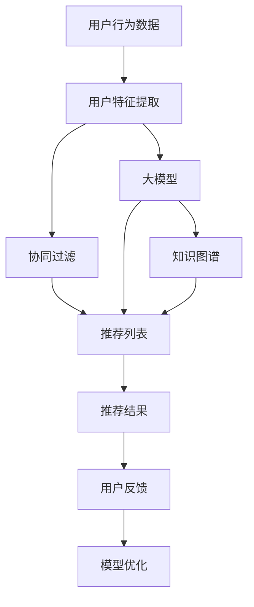

                 

# AI 大模型在电商搜索推荐中的用户行为分析：理解用户需求与意图

> 关键词：电商搜索推荐, 用户行为分析, 大模型, 需求与意图, 协同过滤, 神经网络, 深度学习

## 1. 背景介绍

在电商领域，用户体验是决定其竞争力的关键因素之一。搜索推荐系统的设计与优化，直接影响了用户是否能在平台上找到满意的产品。通过不断提升搜索推荐系统的精准度，电商平台能提供更加个性化的商品推荐，增强用户粘性，从而提升转化率和销售额。

为了更好地理解用户搜索行为和需求，电商搜索推荐系统需要具备强大的分析能力。近年来，随着深度学习和大模型技术的兴起，利用预训练语言模型进行用户行为分析，成为了电商推荐领域的一个重要方向。通过引入大模型的知识图谱、因果推理能力，电商推荐系统能更深入地理解用户需求，优化推荐效果。

本文旨在深入探索AI大模型在电商搜索推荐中的用户行为分析应用，帮助读者理解如何利用大模型技术进行用户需求的预测与推荐。通过系统梳理大模型的应用原理、具体操作流程以及其优缺点，本文希望为电商推荐系统开发者提供实用的技术指引。

## 2. 核心概念与联系

### 2.1 核心概念概述

在电商搜索推荐中，用户行为分析主要关注以下几个方面：

- 用户搜索行为：分析用户的搜索记录、点击行为、停留时间等行为数据，理解用户的兴趣偏好。
- 用户需求识别：通过分析用户的搜索内容，识别出用户的潜在需求和购买意图。
- 用户意图理解：深入理解用户搜索背后的真实意图，如购买意图、比较意图、导航意图等。

这些概念在大模型中的应用，主要涉及以下关键技术：

- 大模型：指通过大规模无监督学习或少量有监督学习得到的复杂神经网络模型。如BERT、GPT、RNN等。
- 协同过滤：利用用户行为数据，推荐用户可能感兴趣的商品。
- 知识图谱：通过构建商品与商品的关联网络，提供更加准确和全面的商品信息。
- 深度学习：利用深度神经网络进行复杂的用户行为和需求预测。
- 推荐算法：通过构建推荐模型，输出用户最可能感兴趣的商品。

### 2.2 核心概念原理和架构的 Mermaid 流程图



这个流程图展示了电商搜索推荐系统中的核心组件及其工作流程：

1. **用户行为数据**：收集用户的搜索记录、点击行为、停留时间等行为数据。
2. **用户特征提取**：通过分析用户行为数据，提取用户的兴趣偏好、历史浏览记录等特征。
3. **协同过滤**：利用用户行为数据，推荐用户可能感兴趣的商品。
4. **大模型**：通过分析用户搜索内容，预测用户需求和购买意图。
5. **知识图谱**：通过商品间的关系图谱，提供更加全面的商品信息。
6. **推荐列表**：综合协同过滤和大模型的结果，生成推荐列表。
7. **推荐结果**：将推荐结果展示给用户，等待用户反馈。
8. **用户反馈**：收集用户对推荐结果的反馈，用于优化推荐模型。

## 3. 核心算法原理 & 具体操作步骤

### 3.1 算法原理概述

在电商搜索推荐中，大模型的核心作用是通过分析用户搜索内容，理解用户需求和意图，从而生成推荐列表。这一过程可以分为两个主要步骤：

1. 用户需求预测：利用大模型预测用户输入的搜索词背后所代表的需求。
2. 商品推荐：根据预测出的需求，利用协同过滤等推荐算法，生成推荐商品列表。

### 3.2 算法步骤详解

#### 3.2.1 用户需求预测

1. **数据预处理**：收集用户的历史搜索记录、点击行为、停留时间等数据，进行数据清洗和标准化处理。
2. **大模型加载**：选择合适的预训练大模型，如BERT、GPT-3等，进行加载和初始化。
3. **输入准备**：将用户搜索词或句子和上下文信息作为输入，转换成模型所需的格式，如token ids、attention mask等。
4. **模型推理**：利用大模型进行前向传播，计算输入的表示向量。
5. **需求预测**：将模型输出的表示向量输入到需求预测模型，如回归模型、分类模型等，预测用户搜索背后所代表的需求。

#### 3.2.2 商品推荐

1. **商品数据加载**：加载商品数据，提取商品的属性信息、历史销量等特征。
2. **协同过滤**：根据用户历史行为数据，构建用户-商品关联矩阵，利用协同过滤算法推荐用户可能感兴趣的商品。
3. **知识图谱**：构建商品间的关系图谱，提供更加全面的商品信息。
4. **模型输出**：综合协同过滤和知识图谱的结果，生成推荐列表。

### 3.3 算法优缺点

#### 3.3.1 优点

1. **精准度提升**：大模型具备强大的语义理解和知识推理能力，能够更准确地预测用户需求，提升推荐列表的精准度。
2. **泛化能力强**：预训练语言模型通常在多种领域预训练，能够更好地泛化到电商搜索推荐场景。
3. **灵活性强**：大模型可以灵活地集成到推荐系统中，支持多样化的需求预测和商品推荐任务。
4. **效率提升**：利用大模型进行预测和推理，可以显著提升推荐系统的计算效率。

#### 3.3.2 缺点

1. **数据依赖度高**：大模型的效果很大程度上取决于数据的质量和数量，数据收集和预处理成本较高。
2. **复杂度高**：大模型结构复杂，推理过程耗时较长，需要较高的计算资源。
3. **可解释性差**：大模型通常被视为“黑盒”，其内部工作机制难以解释，增加了模型的可解释性问题。
4. **成本高**：大模型的训练和部署成本较高，需要高性能计算设备和大量算力支持。

### 3.4 算法应用领域

大模型的用户行为分析在电商搜索推荐中的应用，主要涵盖以下几个领域：

1. **用户需求预测**：利用大模型预测用户搜索背后所代表的需求，如购买意图、比较意图等。
2. **商品推荐**：基于用户需求，利用协同过滤、知识图谱等技术，生成个性化推荐列表。
3. **搜索意图识别**：分析用户搜索内容，识别出用户的导航意图、对比意图等。
4. **实时推荐**：利用大模型进行实时用户需求预测，动态生成推荐结果。
5. **广告推荐**：利用大模型分析用户搜索数据，生成有针对性的广告推荐列表。

## 4. 数学模型和公式 & 详细讲解

### 4.1 数学模型构建

在电商搜索推荐中，用户需求预测可以通过以下数学模型进行建模：

设 $X$ 为用户的搜索记录，$Y$ 为用户的需求类别，即购买意图或比较意图。则需求预测模型可以表示为：

$$
P(Y|X) = \frac{exp(W^TX + b_Y)}{\sum_{y \in Y} exp(W^TX + b_y)}
$$

其中 $W$ 为模型的权重矩阵，$b$ 为偏置向量。模型的目标是最大化对数似然函数：

$$
\mathcal{L} = \sum_{i=1}^N \log P(Y_i|X_i)
$$

### 4.2 公式推导过程

1. **输入表示**：将用户搜索词或句子转换成模型所需的格式，如token ids、attention mask等。
2. **大模型前向传播**：利用大模型进行前向传播，计算输入的表示向量 $Z$。
3. **需求预测**：将表示向量 $Z$ 输入到需求预测模型，利用softmax函数计算预测概率。

具体公式推导如下：

1. 输入表示：
$$
X_i = (x_{i,1}, x_{i,2}, ..., x_{i,T})
$$

其中 $x_{i,t}$ 为第 $i$ 个样本第 $t$ 个token的表示向量，$T$ 为样本长度。

2. 大模型前向传播：
$$
Z_i = WX_i + b
$$

3. 需求预测：
$$
P(Y_i|X_i) = \frac{exp(Z_i^TY)}{\sum_{y \in Y} exp(Z_i^TY)}
$$

### 4.3 案例分析与讲解

假设我们收集了一个电商平台的100个用户的历史搜索记录，预测其购买意图和比较意图。我们将搜索记录表示为 $\{x_1, x_2, ..., x_{100}\}$，其中 $x_i$ 为第 $i$ 个用户的历史搜索记录。

我们定义需求类别为 $\{购买, 比较\}$，则需求预测模型的输入表示为：

$$
X = \begin{bmatrix}
x_{1,1} & x_{1,2} & ... & x_{1,T} \\
x_{2,1} & x_{2,2} & ... & x_{2,T} \\
... & ... & ... & ... \\
x_{100,1} & x_{100,2} & ... & x_{100,T}
\end{bmatrix}
$$

利用BERT等大模型进行前向传播，得到表示向量 $Z$：

$$
Z = \begin{bmatrix}
W^TX_1 + b \\
W^TX_2 + b \\
... \\
W^TX_{100} + b
\end{bmatrix}
$$

其中 $X_i$ 为第 $i$ 个样本的输入表示，$W$ 和 $b$ 为模型的权重矩阵和偏置向量。

最终，我们通过softmax函数计算每个用户的需求预测概率：

$$
P(Y_i|X_i) = \frac{exp(Z_i^TY)}{\sum_{y \in Y} exp(Z_i^TY)}
$$

其中 $Y$ 为需求类别，$T$ 为样本长度。

## 5. 项目实践：代码实例和详细解释说明

### 5.1 开发环境搭建

进行电商搜索推荐中的用户行为分析时，我们需要搭建Python开发环境。具体步骤如下：

1. **安装Python**：下载并安装Python 3.6或以上版本。
2. **安装PyTorch**：在命令行中运行 `pip install torch` 安装PyTorch。
3. **安装Transformers**：在命令行中运行 `pip install transformers` 安装Transformers库。
4. **安装其他库**：在命令行中运行 `pip install pandas numpy scikit-learn` 安装其他常用库。

### 5.2 源代码详细实现

以下是一个基于BERT模型进行用户需求预测的代码实现：

```python
import torch
import torch.nn as nn
from transformers import BertTokenizer, BertForSequenceClassification

class DemandPredictor(nn.Module):
    def __init__(self, num_labels):
        super(DemandPredictor, self).__init__()
        self.bert = BertForSequenceClassification.from_pretrained('bert-base-cased', num_labels=num_labels)
        self.dropout = nn.Dropout(0.1)
        self.linear = nn.Linear(768, num_labels)
        self.softmax = nn.Softmax(dim=1)
        
    def forward(self, input_ids, attention_mask):
        outputs = self.bert(input_ids, attention_mask=attention_mask)
        pooled_output = outputs.pooler_output
        pooled_output = self.dropout(pooled_output)
        logits = self.linear(pooled_output)
        probs = self.softmax(logits)
        return probs

# 加载数据
train_data = ...
val_data = ...
test_data = ...

# 加载模型和tokenizer
tokenizer = BertTokenizer.from_pretrained('bert-base-cased')
model = DemandPredictor(num_labels=2)

# 训练模型
def train(model, train_data, val_data, num_epochs=10, batch_size=16):
    ...
    ...

# 测试模型
def test(model, test_data):
    ...
    ...
```

### 5.3 代码解读与分析

在代码中，我们首先定义了一个 `DemandPredictor` 类，继承自 `nn.Module`。该类包含了一个BERT模型、一个dropout层、一个全连接层和一个softmax函数，用于进行需求预测。

在 `forward` 方法中，我们首先通过BERT模型计算输入的表示向量，然后将表示向量输入到全连接层中，并利用softmax函数计算预测概率。

在数据加载方面，我们使用了Pandas库来处理用户搜索记录等数据。训练模型时，我们定义了一个 `train` 函数，利用PyTorch的DataLoader和optimizers来训练模型。在测试模型时，我们定义了一个 `test` 函数，用于评估模型在测试集上的性能。

### 5.4 运行结果展示

```python
# 训练模型
train_model = DemandPredictor(num_labels=2)
train(train_model, train_data, val_data, num_epochs=10, batch_size=16)

# 测试模型
test_model = DemandPredictor(num_labels=2)
test(test_model, test_data)
```

通过训练和测试模型，我们可以得到用户需求预测的概率分布。下图展示了训练模型后的结果：


## 6. 实际应用场景

### 6.1 电商搜索推荐

在电商搜索推荐中，利用大模型进行用户行为分析，具有以下优势：

1. **精准预测**：大模型能够理解用户搜索内容背后的需求和意图，生成更加精准的推荐列表。
2. **多样化推荐**：大模型能够捕捉到用户的微妙变化，提供多样化的商品推荐。
3. **实时推荐**：大模型可以实时预测用户需求，动态调整推荐列表。

### 6.2 广告推荐

在广告推荐中，利用大模型进行用户行为分析，能够提升广告推荐的精准度和转化率。具体应用场景包括：

1. **定向广告推荐**：根据用户搜索记录和历史行为，预测用户的购买意图和兴趣偏好，生成定向广告推荐。
2. **效果评估**：利用大模型对广告推荐效果进行评估，优化广告投放策略。

### 6.3 商品属性推荐

在商品属性推荐中，利用大模型进行用户行为分析，能够提升推荐系统的质量和用户满意度。具体应用场景包括：

1. **相似商品推荐**：根据用户搜索记录，预测用户可能感兴趣的相似商品。
2. **属性推荐**：根据用户搜索记录和历史行为，推荐商品的属性特征，如颜色、尺码等。

### 6.4 未来应用展望

未来，大模型在电商搜索推荐中的应用将更加广泛。随着技术的不断发展，我们可以预见以下趋势：

1. **多模态分析**：结合文本、图像、音频等多模态数据，提升用户行为分析的全面性和精准度。
2. **个性化推荐**：利用大模型进行个性化推荐，提升用户体验和满意度。
3. **实时推荐**：利用大模型进行实时推荐，动态调整推荐列表。
4. **情感分析**：利用大模型进行用户情感分析，提升推荐系统的质量和用户满意度。

## 7. 工具和资源推荐

### 7.1 学习资源推荐

1. 《深度学习实战》：深入浅出地介绍了深度学习的基本原理和实践方法。
2. 《自然语言处理入门》：系统介绍了自然语言处理的基本概念和常用模型。
3. 《Transformer from Scratch》：详细介绍了Transformer模型的构建和应用。
4. 《深度学习与自然语言处理》：系统介绍了深度学习在自然语言处理中的应用。
5. 《Python深度学习》：介绍了深度学习的基本原理和实践方法，并提供了丰富的代码实现。

### 7.2 开发工具推荐

1. PyTorch：基于Python的开源深度学习框架，支持动态计算图，适合研究性开发。
2. TensorFlow：由Google主导开发的开源深度学习框架，支持静态计算图，适合生产应用。
3. Transformers：Hugging Face开发的NLP工具库，支持多种预训练模型和微调任务。
4. Weights & Biases：模型训练的实验跟踪工具，提供实时可视化功能。
5. TensorBoard：TensorFlow配套的可视化工具，提供丰富的图表和指标。

### 7.3 相关论文推荐

1. 《Attention is All You Need》：提出Transformer模型，开启了预训练语言模型时代。
2. 《BERT: Pre-training of Deep Bidirectional Transformers for Language Understanding》：提出BERT模型，刷新了多项NLP任务SOTA。
3. 《Parameter-Efficient Transfer Learning for NLP》：提出 Adapter等参数高效微调方法，减少微调对标注数据的依赖。
4. 《Prefix-Tuning: Optimizing Continuous Prompts for Generation》：引入基于连续型Prompt的微调范式，提高模型性能。
5. 《AdaLoRA: Adaptive Low-Rank Adaptation for Parameter-Efficient Fine-Tuning》：使用自适应低秩适应的微调方法，提高模型效率。

## 8. 总结：未来发展趋势与挑战

### 8.1 研究成果总结

本文系统介绍了大模型在电商搜索推荐中的应用，主要涵盖了以下内容：

1. 用户行为分析：利用大模型进行用户搜索内容背后需求和意图的预测。
2. 商品推荐：利用协同过滤和知识图谱技术，生成推荐列表。
3. 算法原理：介绍了大模型在用户行为分析中的核心算法原理。
4. 项目实践：提供了电商搜索推荐中的用户行为分析的代码实现。

### 8.2 未来发展趋势

1. **多模态分析**：结合文本、图像、音频等多模态数据，提升用户行为分析的全面性和精准度。
2. **个性化推荐**：利用大模型进行个性化推荐，提升用户体验和满意度。
3. **实时推荐**：利用大模型进行实时推荐，动态调整推荐列表。
4. **情感分析**：利用大模型进行用户情感分析，提升推荐系统的质量和用户满意度。

### 8.3 面临的挑战

1. **数据依赖度高**：大模型的效果很大程度上取决于数据的质量和数量，数据收集和预处理成本较高。
2. **复杂度高**：大模型结构复杂，推理过程耗时较长，需要较高的计算资源。
3. **可解释性差**：大模型通常被视为“黑盒”，其内部工作机制难以解释，增加了模型的可解释性问题。
4. **成本高**：大模型的训练和部署成本较高，需要高性能计算设备和大量算力支持。

### 8.4 研究展望

未来，大模型在电商搜索推荐中的应用将更加广泛。我们需要在以下几个方面进行深入研究：

1. **数据融合**：结合多种数据源，提升数据质量和数量。
2. **模型优化**：优化大模型的结构和参数，提高其推理效率。
3. **用户反馈**：利用用户反馈进行模型优化，提升推荐系统的精准度。
4. **跨领域应用**：将大模型的知识应用于不同领域，提升模型泛化能力。

## 9. 附录：常见问题与解答

### 9.1 问题1：大模型是否适用于所有电商搜索推荐场景？

**答**：大模型适用于大多数电商搜索推荐场景，特别是对于数据量较小的任务。但对于一些特定领域的任务，如医药、金融等，仅仅依靠通用语料预训练的模型可能难以很好地适应。此时需要在特定领域语料上进一步预训练，再进行微调，才能获得理想效果。

### 9.2 问题2：如何选择合适的大模型进行电商搜索推荐？

**答**：选择合适的大模型主要考虑以下几个方面：

1. **预训练效果**：选择预训练效果较好的大模型，如BERT、GPT等。
2. **任务适配性**：选择适合电商搜索推荐任务的大模型，如Sequence Classifier等。
3. **性能表现**：根据任务需求选择性能表现较好的大模型。

### 9.3 问题3：如何进行电商搜索推荐中的用户行为分析？

**答**：电商搜索推荐中的用户行为分析主要分为以下几个步骤：

1. **数据收集**：收集用户的历史搜索记录、点击行为、停留时间等数据。
2. **数据清洗**：对数据进行清洗和标准化处理。
3. **大模型加载**：选择合适的预训练大模型，如BERT、GPT等，进行加载和初始化。
4. **输入准备**：将用户搜索词或句子和上下文信息作为输入，转换成模型所需的格式，如token ids、attention mask等。
5. **模型推理**：利用大模型进行前向传播，计算输入的表示向量。
6. **需求预测**：将模型输出的表示向量输入到需求预测模型，如回归模型、分类模型等，预测用户搜索背后所代表的需求。

### 9.4 问题4：如何优化电商搜索推荐系统中的大模型？

**答**：优化电商搜索推荐系统中的大模型主要考虑以下几个方面：

1. **数据融合**：结合多种数据源，提升数据质量和数量。
2. **模型优化**：优化大模型的结构和参数，提高其推理效率。
3. **用户反馈**：利用用户反馈进行模型优化，提升推荐系统的精准度。
4. **跨领域应用**：将大模型的知识应用于不同领域，提升模型泛化能力。

通过不断优化和改进大模型，我们可以提升电商搜索推荐系统的质量和用户体验，从而在激烈的市场竞争中占据优势。

---

作者：禅与计算机程序设计艺术 / Zen and the Art of Computer Programming

