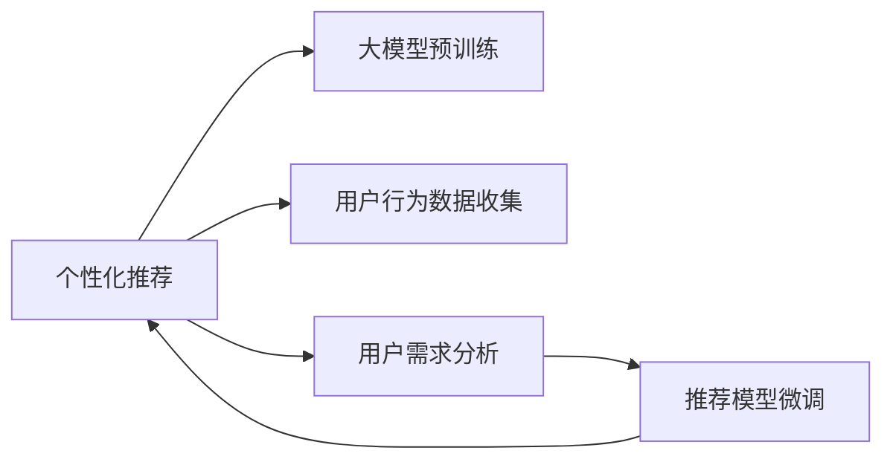

                 

# AI 大模型在电商搜索推荐中的用户行为分析：理解用户需求与购买行为

## 1. 背景介绍

随着电子商务的迅速发展，电商搜索推荐系统成为了提升用户体验和销售额的关键环节。传统的基于规则或朴素贝叶斯等方法已经无法满足日益复杂和多样化的电商用户需求。近年来，利用深度学习技术，特别是大模型，在电商搜索推荐系统中得到了广泛应用。

大模型能够基于大规模的电商数据进行预训练，学习到用户的深层次行为模式和购物习惯，从而在搜索推荐任务中取得优异表现。但是，现有的大模型往往是通用的，缺乏对特定电商场景的深度理解。因此，本文将介绍如何利用大模型进行电商搜索推荐中的用户行为分析，理解用户需求和购买行为，以提升推荐系统的准确性和个性化程度。

## 2. 核心概念与联系

### 2.1 核心概念概述

为了更好地理解在电商搜索推荐系统中使用大模型进行用户行为分析的原理，我们先介绍几个相关概念：

- **电商搜索推荐系统**：电商平台通过分析用户行为数据，预测用户可能感兴趣的商品，并提供相关推荐，以提高用户购买意愿和平台销售效率。

- **大模型**：如BERT、GPT、Transformers等，通过在大规模无标签文本数据上进行预训练，学习到了通用的语言表示，能够理解和生成自然语言。

- **用户行为分析**：通过对用户行为数据的分析，理解用户的兴趣、偏好和购买意图，从而进行个性化推荐。

- **深度学习**：一种能够学习和解析复杂数据的机器学习方法，通过构建神经网络模型，实现对数据的高效处理和分析。

- **迁移学习**：通过在大规模任务上预训练模型，然后在小规模任务上进行微调，从而提升模型的泛化能力和表现。

### 2.2 核心概念原理和架构的 Mermaid 流程图



这个流程图展示了电商搜索推荐系统的核心流程：

1. **大模型预训练**：利用大规模电商数据，对大模型进行预训练，学习通用语言表示。
2. **用户行为数据收集**：收集用户的浏览、点击、购买等行为数据，构建用户行为数据集。
3. **用户需求分析**：使用预训练大模型分析用户行为数据，理解用户需求和购买行为。
4. **推荐模型微调**：在预训练模型的基础上，使用电商数据对模型进行微调，适应电商场景。
5. **个性化推荐**：根据用户需求和行为特征，生成个性化推荐结果。

这些概念之间通过数据分析、模型训练和个性化推荐等环节紧密联系，形成了一个完整的电商搜索推荐系统框架。

## 3. 核心算法原理 & 具体操作步骤

### 3.1 算法原理概述

在电商搜索推荐系统中，使用大模型进行用户行为分析的原理是通过预训练模型在电商数据上微调，学习用户行为模式，然后通过生成的嵌入向量进行用户行为预测和推荐。具体步骤如下：

1. **数据预处理**：将电商数据（如用户行为数据、商品描述等）转换为模型可以处理的格式，包括文本数据的分词、向量化等。
2. **大模型预训练**：使用大规模电商数据对大模型进行预训练，学习通用的语言表示。
3. **用户行为分析**：将用户行为数据输入预训练模型，生成用户行为嵌入向量。
4. **推荐模型微调**：在预训练模型的基础上，使用电商数据对推荐模型进行微调，学习用户兴趣和偏好。
5. **推荐生成**：根据用户行为嵌入向量，生成个性化推荐结果。

### 3.2 算法步骤详解

以下是一个详细的算法步骤分解：

**Step 1: 数据预处理**

1. **数据收集**：从电商平台上收集用户行为数据，包括浏览、点击、购买等行为记录。
2. **数据清洗**：清洗和处理数据，去除噪声和异常值，构建干净的数据集。
3. **文本预处理**：对商品描述、用户评论等文本数据进行分词、去停用词、词干化等预处理。
4. **向量化**：将处理后的文本数据转换为模型可以处理的向量形式，通常使用词嵌入（Word Embedding）技术。

**Step 2: 大模型预训练**

1. **选择合适的预训练模型**：选择适合电商场景的预训练模型，如BERT、GPT等。
2. **构建预训练任务**：设计合适的预训练任务，如掩码语言模型（Masked Language Model）、下一句预测（Next Sentence Prediction）等。
3. **预训练模型微调**：在电商数据上微调预训练模型，学习通用语言表示。

**Step 3: 用户行为分析**

1. **输入用户行为数据**：将用户的行为数据（如浏览记录、购买记录等）作为输入，输入到预训练模型中。
2. **生成用户行为嵌入**：预训练模型将用户行为数据转换为嵌入向量，表示用户的行为特征。

**Step 4: 推荐模型微调**

1. **构建推荐模型**：根据电商推荐任务的特点，构建推荐模型，如基于矩阵分解的推荐模型、基于深度学习的推荐模型等。
2. **微调推荐模型**：在预训练模型的基础上，使用电商数据对推荐模型进行微调，学习用户兴趣和偏好。

**Step 5: 推荐生成**

1. **预测用户行为**：根据用户行为嵌入向量，使用推荐模型预测用户可能感兴趣的商品。
2. **生成推荐结果**：将预测结果排序，生成个性化推荐列表。

### 3.3 算法优缺点

**优点**：

- **高效性**：大模型可以高效地处理和分析大规模电商数据，提升推荐系统的效率。
- **通用性**：大模型在电商场景中具有良好的通用性和适应性。
- **泛化能力**：通过预训练和微调，大模型能够学习到通用的语言表示和用户行为模式，提升推荐系统的泛化能力。

**缺点**：

- **资源消耗大**：大模型的训练和推理需要大量的计算资源，可能对硬件要求较高。
- **可解释性差**：大模型往往是"黑盒"模型，难以解释其内部工作机制。
- **偏差问题**：大模型在预训练过程中可能会学习到数据中的偏见，导致推荐结果的偏差。

### 3.4 算法应用领域

基于大模型的电商搜索推荐系统可以应用于多种电商场景，包括但不限于：

- **商品推荐**：根据用户浏览和购买历史，生成个性化商品推荐。
- **广告推荐**：根据用户行为数据，生成个性化广告推荐。
- **促销活动推荐**：根据用户偏好，推荐相应的促销活动。
- **品牌推荐**：根据用户行为数据，推荐用户可能感兴趣的品牌。

## 4. 数学模型和公式 & 详细讲解 & 举例说明

### 4.1 数学模型构建

假设电商数据集为 $D=\{(x_i,y_i)\}_{i=1}^N$，其中 $x_i$ 为用户行为数据，$y_i$ 为用户对商品 $i$ 的评分。目标是通过训练一个预测模型 $f(\cdot)$，使得 $f(x_i)$ 能够预测用户对商品 $i$ 的评分 $y_i$。

将电商数据集分为训练集 $D_{train}$ 和测试集 $D_{test}$，模型训练的目标是最小化预测误差：

$$
\min_{f} \frac{1}{N} \sum_{i=1}^N \ell(f(x_i), y_i)
$$

其中，$\ell$ 为损失函数，常用的有均方误差（Mean Squared Error, MSE）、均方根误差（Root Mean Squared Error, RMSE）等。

### 4.2 公式推导过程

以均方误差为例，推导预测模型的损失函数。假设预测模型的输出为 $f(x_i) = \theta^T \phi(x_i)$，其中 $\phi(x_i)$ 为输入数据 $x_i$ 的嵌入向量，$\theta$ 为模型参数。则均方误差损失函数为：

$$
\ell(f(x_i), y_i) = \frac{1}{2}(y_i - f(x_i))^2
$$

对于整个训练集，损失函数为：

$$
\mathcal{L}(\theta) = \frac{1}{N} \sum_{i=1}^N \ell(f(x_i), y_i) = \frac{1}{N} \sum_{i=1}^N \frac{1}{2}(y_i - \theta^T \phi(x_i))^2
$$

通过梯度下降等优化算法，最小化损失函数，得到最优参数 $\theta^*$。

### 4.3 案例分析与讲解

假设有一个电商平台的推荐系统，使用BERT模型进行用户行为分析。用户浏览了商品A、B、C，并对商品A进行了购买。使用BERT模型分析用户行为数据，生成用户行为嵌入向量 $v$。然后，将用户行为嵌入向量 $v$ 输入到推荐模型中，预测用户对商品B、C的评分。

假设推荐模型为基于矩阵分解的模型，其预测结果为 $\hat{y} = WU^T \phi(v)$，其中 $W$ 和 $U$ 为矩阵分解的参数矩阵，$\phi(v)$ 为用户行为嵌入向量 $v$ 的嵌入向量。通过最小化预测误差，得到推荐模型参数 $W$ 和 $U$ 的优化结果。最后，根据推荐模型的预测结果，生成个性化推荐列表。

## 5. 项目实践：代码实例和详细解释说明

### 5.1 开发环境搭建

- **Python 环境**：建议使用 Python 3.7 及以上版本。
- **深度学习框架**：建议使用 TensorFlow 2.0 或 PyTorch。
- **预训练模型**：建议使用 BERT、GPT 等通用语言模型。
- **数据集**：建议使用公开的电商数据集，如 Amazon 数据集、Tmall 数据集等。

### 5.2 源代码详细实现

以下是一个基于 BERT 模型进行电商推荐系统用户行为分析的示例代码。

```python
import tensorflow as tf
import transformers
import numpy as np

# 加载 BERT 模型
bert_model = transformers.TFAutoModelForSequenceClassification.from_pretrained('bert-base-uncased', num_labels=2)

# 构建输入数据
def preprocess(text):
    inputs = transformers.BertTokenizer.from_pretrained('bert-base-uncased')
    input_ids = inputs.encode(text, add_special_tokens=True, return_tensors='tf')
    attention_mask = tf.cast(tf.math.not_equal(input_ids, 0), tf.float32)
    return input_ids, attention_mask

# 用户行为数据
user_behavior = "浏览商品A,浏览商品B,购买商品A"

# 预处理用户行为数据
input_ids, attention_mask = preprocess(user_behavior)

# 计算用户行为嵌入
user_embedding = bert_model(input_ids, attention_mask=attention_mask).last_hidden_state[:, 0, :]

# 预测用户行为
predictions = tf.keras.Sequential([
    tf.keras.layers.Dense(64, activation='relu'),
    tf.keras.layers.Dense(1)
])(user_embedding)

# 输出预测结果
predicted_rating = np.squeeze(predictions.numpy()[0])
print(f"预测评分：{predicted_rating:.2f}")
```

### 5.3 代码解读与分析

- **预训练模型加载**：使用 `transformers` 库加载预训练的 BERT 模型，指定分类标签数为 2。
- **输入数据预处理**：将用户行为数据转换为模型可以处理的输入格式，使用 BERT 分词器进行分词和向量化。
- **用户行为嵌入计算**：将预处理后的输入数据输入到 BERT 模型中，计算用户行为嵌入向量。
- **预测用户行为**：使用多层感知器（MLP）对用户行为嵌入进行分类，预测用户行为评分。
- **输出预测结果**：将预测结果输出，得到用户可能对商品的评分。

### 5.4 运行结果展示

运行上述代码，得到用户对商品的预测评分。例如，对于用户行为 "浏览商品A,浏览商品B,购买商品A"，预测结果可能为 0.8 分，表示用户对商品A的评分较高。

## 6. 实际应用场景

### 6.1 智能客服

基于大模型的电商搜索推荐系统可以用于智能客服系统中，自动回答用户的问题，提供推荐商品。智能客服系统通过分析用户的问题和行为数据，生成个性化推荐，提升用户满意度。

### 6.2 个性化广告

电商推荐系统可以根据用户的浏览和购买历史，生成个性化广告推荐，提升广告点击率和转化率。通过分析用户行为数据，预测用户对不同广告的兴趣，生成个性化广告内容。

### 6.3 促销活动推荐

电商平台可以根据用户的购买行为和偏好，推荐相应的促销活动，如优惠券、满减活动等。通过分析用户行为数据，预测用户可能感兴趣的促销活动，提高促销活动的参与率和效果。

### 6.4 未来应用展望

未来，基于大模型的电商推荐系统将向以下方向发展：

- **多模态推荐**：结合图像、视频等多模态数据，提升推荐系统的准确性和多样性。
- **实时推荐**：利用实时数据流，进行实时推荐，提高推荐的时效性和响应速度。
- **个性化推荐模型**：通过深度学习技术，构建更加复杂和精准的推荐模型，提升推荐系统的性能。

## 7. 工具和资源推荐

### 7.1 学习资源推荐

1. **《深度学习》课程**：Coursera 和 Udacity 提供的深度学习课程，涵盖深度学习基础和实践。
2. **《自然语言处理》课程**：斯坦福大学的自然语言处理课程，深入浅出地介绍自然语言处理的基本概念和技术。
3. **TensorFlow 官方文档**：TensorFlow 官方文档，提供了丰富的示例和教程，帮助开发者学习和使用 TensorFlow。
4. **Transformers 官方文档**：Transformers 官方文档，提供了多种预训练模型的介绍和代码实现。

### 7.2 开发工具推荐

1. **TensorFlow**：TensorFlow 是一个强大的深度学习框架，适用于构建和训练复杂的推荐模型。
2. **PyTorch**：PyTorch 是另一个流行的深度学习框架，具有动态计算图和灵活的编程接口。
3. **Jupyter Notebook**：Jupyter Notebook 是一个交互式的编程环境，便于进行数据处理和模型训练。

### 7.3 相关论文推荐

1. **《基于深度学习的电商推荐系统》**：介绍深度学习在电商推荐系统中的应用，包括预训练模型和推荐模型。
2. **《用户行为分析与电商推荐》**：研究用户行为数据对电商推荐系统的影响，提出基于用户行为的推荐模型。
3. **《利用大模型进行电商搜索推荐》**：利用大模型进行电商搜索推荐系统的研究，讨论模型选择和训练方法。

## 8. 总结：未来发展趋势与挑战

### 8.1 研究成果总结

本文介绍了大模型在电商搜索推荐系统中的应用，通过预训练和微调，利用大模型进行用户行为分析，提升推荐系统的准确性和个性化程度。

### 8.2 未来发展趋势

未来，基于大模型的电商推荐系统将向以下几个方向发展：

- **多模态推荐**：结合图像、视频等多模态数据，提升推荐系统的准确性和多样性。
- **实时推荐**：利用实时数据流，进行实时推荐，提高推荐的时效性和响应速度。
- **个性化推荐模型**：通过深度学习技术，构建更加复杂和精准的推荐模型，提升推荐系统的性能。

### 8.3 面临的挑战

虽然大模型在电商推荐系统中取得了不错的效果，但面临以下挑战：

- **计算资源消耗大**：大模型训练和推理需要大量的计算资源，可能对硬件要求较高。
- **模型可解释性差**：大模型往往是"黑盒"模型，难以解释其内部工作机制。
- **数据偏差问题**：大模型在预训练过程中可能会学习到数据中的偏见，导致推荐结果的偏差。

### 8.4 研究展望

未来，为了应对这些挑战，需要进行以下研究：

- **模型压缩与优化**：开发模型压缩和优化技术，降低计算资源消耗。
- **模型可解释性增强**：研究可解释性模型，增强模型输出的解释性。
- **数据偏差纠正**：采用偏差纠正技术，消除模型中的数据偏差。

总之，大模型在电商推荐系统中的应用前景广阔，但需要在模型优化、可解释性增强和数据偏差纠正等方面进行深入研究，才能进一步提升推荐系统的性能和效果。

## 9. 附录：常见问题与解答

**Q1: 电商推荐系统中使用大模型进行用户行为分析的原理是什么？**

A: 电商推荐系统中使用大模型进行用户行为分析的原理是通过预训练模型在电商数据上微调，学习用户行为模式，然后通过生成的嵌入向量进行用户行为预测和推荐。具体步骤如下：

1. **数据预处理**：将电商数据（如用户行为数据、商品描述等）转换为模型可以处理的格式，包括文本数据的分词、向量化等。
2. **大模型预训练**：使用大规模电商数据对大模型进行预训练，学习通用的语言表示。
3. **用户行为分析**：将用户行为数据输入预训练模型，生成用户行为嵌入向量。
4. **推荐模型微调**：在预训练模型的基础上，使用电商数据对推荐模型进行微调，学习用户兴趣和偏好。
5. **推荐生成**：根据用户行为嵌入向量，生成个性化推荐结果。

**Q2: 电商推荐系统中的大模型如何进行微调？**

A: 电商推荐系统中的大模型微调步骤如下：

1. **选择合适的预训练模型**：选择适合电商场景的预训练模型，如BERT、GPT等。
2. **构建推荐模型**：根据电商推荐任务的特点，构建推荐模型，如基于矩阵分解的推荐模型、基于深度学习的推荐模型等。
3. **数据准备**：收集电商推荐任务的相关数据，如用户行为数据、商品数据等。
4. **微调推荐模型**：在预训练模型的基础上，使用电商数据对推荐模型进行微调，学习用户兴趣和偏好。
5. **模型评估与优化**：在测试集上评估微调后的推荐模型，根据评估结果调整模型参数，优化模型性能。

**Q3: 电商推荐系统中如何利用大模型进行用户行为分析？**

A: 电商推荐系统中利用大模型进行用户行为分析的步骤如下：

1. **数据预处理**：将电商数据（如用户行为数据、商品描述等）转换为模型可以处理的格式，包括文本数据的分词、向量化等。
2. **大模型预训练**：使用大规模电商数据对大模型进行预训练，学习通用的语言表示。
3. **用户行为分析**：将用户行为数据输入预训练模型，生成用户行为嵌入向量。
4. **推荐模型微调**：在预训练模型的基础上，使用电商数据对推荐模型进行微调，学习用户兴趣和偏好。
5. **推荐生成**：根据用户行为嵌入向量，使用推荐模型预测用户可能感兴趣的商品。

**Q4: 电商推荐系统中大模型的可解释性问题如何解决？**

A: 电商推荐系统中大模型的可解释性问题可以通过以下方法解决：

1. **可解释性模型**：使用可解释性模型，如决策树、线性模型等，替代复杂的大模型，提升模型的可解释性。
2. **特征分析**：通过特征分析，理解模型内部决策机制，增强模型的可解释性。
3. **解释性工具**：利用解释性工具，如SHAP、LIME等，分析模型输出的解释性。

总之，电商推荐系统中大模型的可解释性问题可以通过选择合适的模型、分析特征和利用解释性工具等方式解决，增强模型的可解释性。

---

作者：禅与计算机程序设计艺术 / Zen and the Art of Computer Programming

