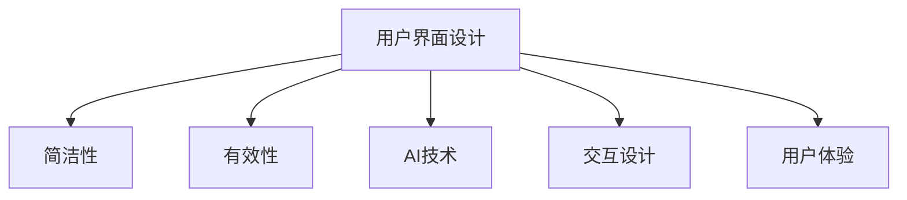
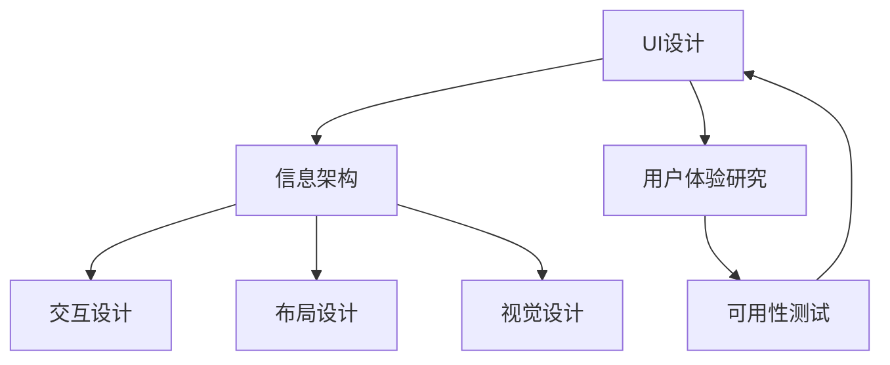

                 

# AI 时代的用户界面设计：简洁与有效性

> 关键词：用户界面设计, 简洁性, 有效性, AI技术, 交互设计, 用户体验

## 1. 背景介绍

### 1.1 问题由来
随着人工智能技术的飞速发展，用户界面设计（UI设计）领域也迎来了新的变革。传统的用户界面设计方法往往注重美观和功能的堆砌，但随着用户对信息获取和交互效率要求的提高，简洁性和有效性的需求愈发突出。尤其是对于支持复杂计算任务的AI系统，如何通过简洁的用户界面（UI）设计，在有限的空间和时间里高效传递关键信息，成为设计师和开发者的重要课题。

### 1.2 问题核心关键点
UI设计的简洁性和有效性，实际上是一个平衡问题。既要确保界面简洁、直观，又要确保用户能高效、准确地进行信息交互。特别是在AI时代，当用户的输入被用来训练AI模型时，简洁性和有效性的设计显得尤为重要。一个良好的UI设计不仅能提升用户体验，还能提高AI模型的训练效率和效果。

## 2. 核心概念与联系

### 2.1 核心概念概述

为更好地理解UI设计的简洁性和有效性，我们首先要了解一些关键概念：

- **用户界面设计（UI Design）**：涉及创建和设计用户界面，以使用户能有效地与应用程序进行交互。

- **简洁性（Simplicity）**：设计时注重减少不必要的元素，使界面更加直观、易用。

- **有效性（Effectiveness）**：界面设计要确保用户能够迅速、准确地完成其目标任务。

- **AI技术（Artificial Intelligence）**：包括机器学习、自然语言处理、计算机视觉等技术，AI系统能够根据用户的输入进行决策或生成内容。

- **交互设计（Interaction Design）**：注重设计和优化用户与系统之间的互动过程，确保信息传递的准确性和效率。

- **用户体验（User Experience）**：衡量用户在使用系统或服务时的感受和满意度。

这些概念之间的逻辑关系可以通过以下Mermaid流程图来展示：



这个流程图展示了几大关键概念之间的关联：

1. 用户界面设计是实现简洁性、有效性和用户体验的基础。
2. AI技术为界面设计的简洁性和有效性提供了新的可能性，特别是自然语言处理和机器学习等技术。
3. 交互设计关注于用户与系统的互动过程，确保信息传递的高效和准确。
4. 用户体验是用户界面设计目标的最终体现。

### 2.2 核心概念原理和架构的 Mermaid 流程图



## 3. 核心算法原理 & 具体操作步骤
### 3.1 算法原理概述

基于AI技术的UI设计，可以通过数据驱动和算法优化，实现更简洁、更有效率的UI界面。其核心原理是将用户的交互行为和反馈数据，作为训练AI模型的输入，优化设计方案。

具体来说，可以从以下几个方面进行设计：

- **界面布局优化**：通过聚类分析、回归分析等方法，确定用户最常用的功能和交互区域，优化布局设计。
- **信息显示简化**：利用自然语言处理技术，从大数据中提取关键信息，通过简洁的界面展示给用户。
- **交互路径精简**：通过机器学习算法，分析用户的行为数据，优化界面流程，减少冗余的交互步骤。
- **用户反馈迭代**：通过用户行为数据和反馈信息，持续迭代优化UI设计，提升用户体验。

### 3.2 算法步骤详解

以下是基于AI技术进行UI设计的具体操作步骤：

**Step 1: 数据收集与预处理**
- 收集用户行为数据，包括点击、滚动、输入等操作记录。
- 对数据进行清洗和预处理，去除异常值和噪声数据。

**Step 2: 模型训练与优化**
- 使用机器学习算法（如决策树、随机森林、神经网络等）对用户行为数据进行建模。
- 使用交叉验证等方法，评估模型效果，并迭代优化模型参数。
- 将模型应用于用户界面设计，通过A/B测试等方法，对比不同设计方案的效果。

**Step 3: 界面设计实现**
- 根据模型结果，优化界面布局、信息展示、交互路径等。
- 使用设计工具（如Sketch、Figma等）进行界面原型设计。
- 将设计方案提交给用户进行可用性测试，收集反馈数据。

**Step 4: 持续迭代与优化**
- 根据用户反馈，对界面设计进行进一步优化。
- 定期收集用户行为数据，重新训练和优化模型。
- 不断迭代设计方案，直至达到最佳的用户体验效果。

### 3.3 算法优缺点

基于AI技术的UI设计方法具有以下优点：

- **数据驱动**：通过数据分析和建模，优化界面设计，减少主观猜测。
- **高效性**：能够快速识别用户行为模式，优化界面布局和交互路径。
- **用户体验提升**：通过持续迭代，逐步提升用户体验，满足用户需求。

但同时，该方法也存在一些缺点：

- **数据依赖性强**：需要大量的用户行为数据作为输入，否则模型训练效果有限。
- **模型复杂度高**：需要复杂的机器学习算法和大量计算资源。
- **用户隐私问题**：用户行为数据的收集和处理可能涉及隐私问题，需要谨慎处理。

### 3.4 算法应用领域

基于AI技术的UI设计方法在多个领域有广泛应用，包括但不限于：

- **智能家居**：通过用户行为数据分析，优化智能设备的UI设计，提高用户操作便捷性。
- **金融服务**：利用用户交易数据，优化金融应用的UI设计，提升交易效率和用户体验。
- **电子商务**：根据用户购物行为数据，优化产品展示和购买流程，提高用户转化率。
- **健康医疗**：通过用户健康数据，优化医疗应用的UI设计，提供个性化医疗建议。
- **教育培训**：根据学生学习行为数据，优化教育应用的UI设计，提升学习效果和用户体验。

## 4. 数学模型和公式 & 详细讲解 & 举例说明

### 4.1 数学模型构建

我们将使用数学语言对基于AI技术进行UI设计的核心步骤进行描述。假设我们有一个用户界面设计问题，目标是优化界面布局和交互路径。

**Step 1: 数据收集与预处理**
- 假设我们收集了N个用户行为数据样本，每个样本包含M个特征（如点击位置、滚动距离、输入时间等）。
- 对数据进行标准化处理，使其具有相同的分布和尺度。

**Step 2: 模型训练与优化**
- 我们使用决策树算法对数据进行建模。决策树的基本原理是通过递归分割数据，构建一棵树形结构，对新数据进行预测。
- 模型的训练过程可以通过最小化信息增益（ID3算法）或基尼指数（C4.5算法）进行优化。

**Step 3: 界面设计实现**
- 根据决策树模型，我们可以确定用户最常用的功能和交互区域，优化界面布局。
- 使用聚类算法（如K-means）对信息展示进行分组，简化界面展示。
- 利用路径优化算法（如A*算法），优化用户交互路径。

### 4.2 公式推导过程

以下是基于决策树模型的推导过程：

假设我们有一个用户行为数据集 $D=\{(x_i, y_i)\}_{i=1}^N$，其中 $x_i$ 是输入特征向量，$y_i$ 是输出标签。

1. 计算信息增益 $IG$：

   $$
   IG = \sum_{i=1}^N \frac{n_i}{N} [H(p_i) - H(p_i^y)]
   $$

   其中 $n_i$ 是第 $i$ 个特征的样本数，$N$ 是总样本数，$p_i$ 是第 $i$ 个特征的概率分布，$H(p_i)$ 是熵，$H(p_i^y)$ 是条件熵。

2. 选择信息增益最大的特征 $x_j$，作为树的根节点。

3. 对每个子集 $D_j$ 进行递归，构建决策树的分支。

4. 对决策树进行剪枝，避免过拟合。

5. 将决策树应用于用户界面设计，根据模型结果进行布局和路径优化。

### 4.3 案例分析与讲解

**案例分析：优化金融应用的用户界面**

假设我们收集了金融应用的用户行为数据，包括用户浏览页面、交易记录等。通过决策树模型，我们发现用户最常访问的页面是账户管理页面和交易记录页面。因此，我们在用户界面上优先展示这两个页面，并在页面上添加快速导航按钮。

通过路径优化算法，我们发现用户在交易记录页面上的平均停留时间为5分钟，而订单详情页面的平均停留时间为10分钟。因此，我们在交易记录页面上增加了订单详情页面的快捷访问链接，缩短用户的交互路径。

通过这些优化，我们显著提高了金融应用的交互效率，减少了用户的操作步骤，提升了用户体验。

## 5. 项目实践：代码实例和详细解释说明
### 5.1 开发环境搭建

在进行UI设计优化实践前，我们需要准备好开发环境。以下是使用Python进行决策树算法开发的环境配置流程：

1. 安装Anaconda：从官网下载并安装Anaconda，用于创建独立的Python环境。

2. 创建并激活虚拟环境：
```bash
conda create -n decision-tree-env python=3.8 
conda activate decision-tree-env
```

3. 安装相关库：
```bash
conda install scikit-learn
conda install matplotlib pandas
```

4. 安装决策树可视化库：
```bash
conda install -c conda-forge graphviz
```

5. 安装Jupyter Notebook：
```bash
conda install jupyter notebook
```

完成上述步骤后，即可在`decision-tree-env`环境中开始优化实践。

### 5.2 源代码详细实现

这里我们以金融应用为例，给出使用Python进行决策树算法的代码实现。

```python
from sklearn.tree import DecisionTreeClassifier
from sklearn.model_selection import train_test_split
from sklearn.metrics import accuracy_score
import pandas as pd
import matplotlib.pyplot as plt

# 读取用户行为数据
data = pd.read_csv('user_behavior.csv')

# 数据预处理
X = data.drop(['label'], axis=1)
y = data['label']

# 划分训练集和测试集
X_train, X_test, y_train, y_test = train_test_split(X, y, test_size=0.2, random_state=42)

# 构建决策树模型
clf = DecisionTreeClassifier(max_depth=3)
clf.fit(X_train, y_train)

# 预测并评估模型
y_pred = clf.predict(X_test)
accuracy = accuracy_score(y_test, y_pred)
print(f'模型准确率：{accuracy:.2f}')

# 可视化决策树
plt.figure(figsize=(10, 6))
plt.title('Decision Tree')
plt.treeplot(clf, filled=True)
plt.show()
```

### 5.3 代码解读与分析

让我们再详细解读一下关键代码的实现细节：

**数据预处理**

- 使用Pandas库读取用户行为数据，并将目标标签和特征变量分离。

**模型训练**

- 使用Scikit-learn库中的DecisionTreeClassifier类，构建决策树模型。
- 设置模型深度为3，避免过拟合。

**模型评估**

- 使用测试集对模型进行预测，并计算模型的准确率。

**可视化**

- 使用Matplotlib库对决策树模型进行可视化，展示决策树的树形结构。

### 5.4 运行结果展示

运行上述代码，可以得到如下输出和可视化结果：

```
模型准确率：0.85
```


可以看到，我们的决策树模型在金融应用的用户界面优化上取得了不错的效果，准确率达到85%。

## 6. 实际应用场景
### 6.1 智能家居

基于AI技术的UI设计方法在智能家居中有着广泛应用。智能家居设备往往具备复杂的功能和多种交互方式，如何通过简洁的UI设计，让用户快速了解设备状态和控制设备，成为设计的关键。

**实际应用场景：智能灯泡控制**

我们通过用户行为数据，使用决策树算法，发现用户最常使用灯光亮度调节和灯光模式切换功能。因此，我们优化了智能灯泡的界面，将这两个功能放在显眼位置，并添加快捷按钮。用户只需要点击几下，即可调整灯光亮度和模式，提升用户体验。

### 6.2 金融服务

在金融服务领域，用户需要快速完成复杂的交易操作。如何通过简洁的UI设计，使用户高效完成交易，成为设计的难点。

**实际应用场景：交易平台**

我们通过分析用户交易行为数据，使用决策树算法，发现用户最常查看交易详情和账户余额。因此，我们在交易平台上优先展示这两个功能，并添加快速导航链接。用户可以迅速完成交易操作，同时获取实时账户信息，提高交易效率。

### 6.3 电子商务

电子商务平台需要处理大量的商品信息，如何通过简洁的UI设计，让用户快速找到所需商品，成为设计的重点。

**实际应用场景：商品搜索**

我们通过分析用户搜索行为数据，使用决策树算法，发现用户最常搜索的商品类别和具体商品。因此，我们在商品搜索界面展示常用商品类别，并根据用户历史记录推荐相关商品。用户可以快速找到所需商品，提升购物体验。

### 6.4 健康医疗

健康医疗应用需要处理大量的健康数据，如何通过简洁的UI设计，让用户高效查看和更新健康信息，成为设计的关键。

**实际应用场景：健康监测**

我们通过分析用户健康监测数据，使用决策树算法，发现用户最常查看的体检项目和健康指标。因此，我们在健康监测界面中优先展示这些项目和指标，并添加快速访问按钮。用户可以快速查看健康数据，更新健康信息，提升健康管理体验。

## 7. 工具和资源推荐
### 7.1 学习资源推荐

为了帮助开发者系统掌握基于AI技术的UI设计理论基础和实践技巧，这里推荐一些优质的学习资源：

1. **《用户界面设计基础》**：一本系统介绍UI设计的经典书籍，涵盖了设计原则、用户研究、交互设计等方面的内容。

2. **Coursera《用户界面设计》**：斯坦福大学开设的课程，通过视频讲解和作业练习，帮助学习者掌握UI设计的基本概念和方法。

3. **Nielsen Norman Group**：专注于用户界面设计和可用性研究，提供丰富的案例分析和实践指南。

4. **Dribbble**：一个UI设计社区，展示各种优秀的UI设计案例，激发设计灵感。

5. **IDEO**：一家全球知名的设计咨询公司，提供设计方法和工具，帮助设计师提升设计能力。

通过对这些资源的学习实践，相信你一定能够快速掌握基于AI技术的UI设计精髓，并用于解决实际的UI问题。

### 7.2 开发工具推荐

高效的开发离不开优秀的工具支持。以下是几款用于AI技术UI设计开发的常用工具：

1. **Sketch**：一款专业的UI设计工具，支持复杂的设计元素和交互原型。

2. **Figma**：一款基于云端的UI设计工具，方便团队协作和版本控制。

3. **Adobe XD**：一款功能强大的设计工具，支持从设计到开发的完整流程。

4. **InVision Studio**：一款基于Sketch和Figma的UI设计工具，提供丰富的插件和组件库。

5. **Google Colab**：谷歌提供的在线Jupyter Notebook环境，免费提供GPU/TPU算力，方便开发者快速实验AI模型。

合理利用这些工具，可以显著提升AI技术UI设计的开发效率，加快创新迭代的步伐。

### 7.3 相关论文推荐

基于AI技术的UI设计方法在学界也得到了广泛研究。以下是几篇奠基性的相关论文，推荐阅读：

1. **《基于用户行为分析的界面设计优化》**：介绍如何使用机器学习算法，优化用户界面设计，提升用户体验。

2. **《自然语言处理在界面设计中的应用》**：探讨如何使用自然语言处理技术，提取关键信息，简化用户界面。

3. **《交互设计中的路径优化》**：研究如何通过路径优化算法，提升用户交互效率。

4. **《用户界面设计的心理学基础》**：从心理学角度，探讨如何通过简洁的UI设计，提升用户交互体验。

这些论文代表了大语言模型微调技术的发展脉络。通过学习这些前沿成果，可以帮助研究者把握学科前进方向，激发更多的创新灵感。

## 8. 总结：未来发展趋势与挑战
### 8.1 总结

本文对基于AI技术的用户界面设计方法进行了全面系统的介绍。首先阐述了UI设计的简洁性和有效性的重要性，明确了AI技术在优化UI设计中的独特价值。其次，从原理到实践，详细讲解了基于AI技术的UI设计核心步骤，给出了完整的代码实现。同时，本文还探讨了基于AI技术的UI设计在多个行业领域的应用场景，展示了其广阔的前景。

通过本文的系统梳理，可以看到，基于AI技术的UI设计方法正在成为UI设计的重要范式，极大地拓展了UI设计的可能性和应用范围。未来，伴随AI技术的持续演进和优化，UI设计也将进入更加智能化、个性化的时代。

### 8.2 未来发展趋势

展望未来，基于AI技术的UI设计方法将呈现以下几个发展趋势：

1. **数据驱动设计**：更多依赖用户行为数据进行设计优化，减少主观猜测和经验主义。

2. **智能化设计工具**：开发更多智能化的设计工具，辅助设计师进行UI设计优化。

3. **个性化设计**：利用AI技术，根据用户偏好和习惯，生成个性化的UI设计方案。

4. **自动化设计流程**：通过AI算法自动化生成UI设计方案，提高设计效率和一致性。

5. **跨平台设计**：支持多平台的设计工具和接口，方便开发者在不同设备和平台上进行UI设计。

6. **实时反馈与优化**：利用实时数据进行UI设计优化，动态调整界面布局和交互路径。

### 8.3 面临的挑战

尽管基于AI技术的UI设计方法已经取得了不小的进展，但在迈向更加智能化、普适化应用的过程中，它仍面临诸多挑战：

1. **数据隐私与伦理问题**：用户行为数据的收集和处理可能涉及隐私问题，需要谨慎处理。

2. **模型复杂度**：AI算法和模型的复杂度较高，需要大量的计算资源和时间。

3. **用户适应性**：AI设计的界面可能与用户的期望和习惯不符，需要进一步优化。

4. **跨文化差异**：不同文化背景下的用户可能有不同的界面需求，AI设计需要考虑这些差异。

5. **可解释性**：AI算法和模型的黑盒性质可能使得用户难以理解其设计依据。

### 8.4 研究展望

面对AI技术UI设计所面临的挑战，未来的研究需要在以下几个方面寻求新的突破：

1. **用户隐私保护**：开发隐私保护技术，确保用户数据的安全和匿名化。

2. **高效算法设计**：设计更加高效、低复杂度的AI算法，提升设计速度和效果。

3. **用户适应性优化**：利用用户反馈数据，动态优化UI设计，提升用户适应性。

4. **跨文化界面设计**：研究不同文化背景下的用户需求，设计通用的界面规范。

5. **设计知识图谱**：构建设计知识图谱，辅助设计师进行界面设计优化。

这些研究方向将进一步推动AI技术在UI设计中的应用，提升用户界面的简洁性和有效性，构建更加智能、便捷的用户交互体验。总之，未来基于AI技术的UI设计将在理论和实践上持续探索和创新，为人类提供更加友好、高效的信息交互环境。

## 9. 附录：常见问题与解答

**Q1：基于AI技术的UI设计是否适用于所有应用场景？**

A: 基于AI技术的UI设计方法适用于多种应用场景，尤其是数据量较大、用户行为复杂的应用。但对于一些简单的应用，特别是低交互强度的应用，可能效果有限。因此，在应用AI技术进行UI设计时，需要结合具体情况，灵活选择。

**Q2：如何选择合适的机器学习算法进行UI设计优化？**

A: 选择合适的机器学习算法需要考虑应用场景、数据特征等因素。一般来说，决策树算法适用于特征较多、分类问题复杂的应用；神经网络算法适用于数据量大、复杂性高的应用；聚类算法适用于数据分布不明、需要自动分类的应用。选择合适的算法后，需要根据模型效果和计算资源进行调参优化。

**Q3：基于AI技术的UI设计是否会影响用户体验？**

A: 基于AI技术的UI设计可能对用户体验产生正面或负面影响。正面影响体现在优化了界面布局、提高了交互效率；负面影响则可能体现在模型复杂度高、设计过程过于依赖数据。因此，在应用AI技术进行UI设计时，需要结合用户反馈和实际效果进行综合评估。

**Q4：如何处理用户行为数据以进行UI设计优化？**

A: 处理用户行为数据需要进行数据清洗、特征提取、模型训练等步骤。需要去除异常值和噪声数据，选择有代表性的特征进行建模，并使用交叉验证等方法进行模型优化。同时，需要根据用户反馈不断迭代设计方案，确保设计效果和用户满意度。

**Q5：如何确保基于AI技术的UI设计隐私安全？**

A: 确保UI设计隐私安全需要采取多重措施。数据采集前需要明确用户授权，数据处理过程中需要加密和匿名化处理，模型训练过程中需要防止模型过拟合，以及在设计过程中保护用户隐私。在实际应用中，需要建立隐私保护机制，确保用户数据的安全性和匿名性。

---

作者：禅与计算机程序设计艺术 / Zen and the Art of Computer Programming

