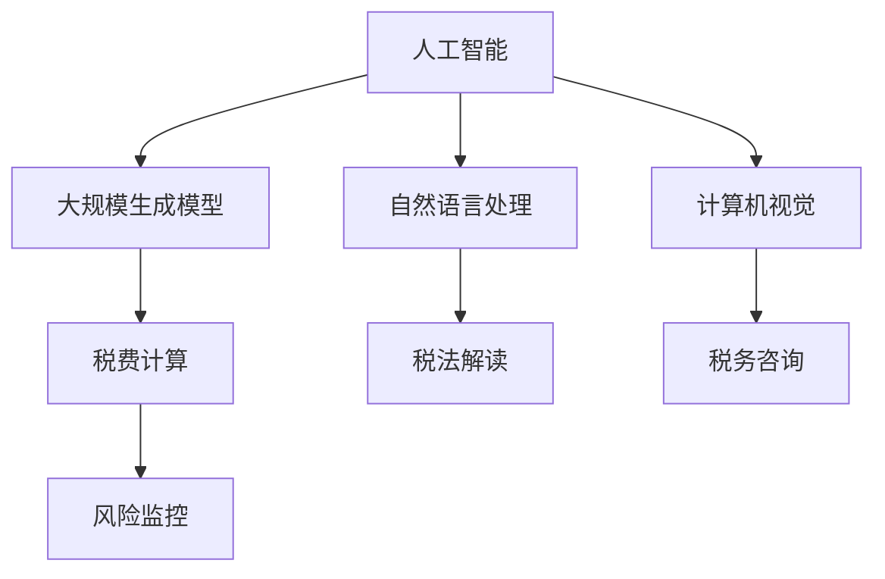

                 

# AIGC助力智能税务服务

在数字化转型的大背景下，税务服务行业也正在经历一场由人工智能(AI)和大规模生成模型(Generative AI, AIGC)驱动的变革。传统的税费计算和申报过程繁琐耗时，且易出错。借助AIGC技术，税务服务可以实现自动化的税费计算、智能化的税法解读、个性化的税务咨询，大幅提升税务服务的智能化水平，助力政府和企业实现减负增效，提高财政资源的利用效率。本文将深入探讨AIGC如何赋能智能税务服务，构建智能化税务体系，并展望未来的发展趋势。

## 1. 背景介绍

### 1.1 问题由来

在全球经济一体化和信息化的浪潮下，税收作为国家财政收入的重要来源，其管理的精准性和高效性日益重要。传统的税务服务流程繁琐，人工处理环节多，易出错且效率低。特别是在大规模个税申报、跨境税收筹划、政策法规解读等方面，税务部门和企业的处理成本极高，亟需借助技术手段进行数字化转型。

人工智能和大规模生成模型技术的快速发展，为构建智能化税务服务体系提供了新的可能性。AIGC通过深度学习和生成对抗网络(GANs)等技术，能够生成逼真、多样化的文本、音频、图像等，在税费计算、税法解读、税务咨询等方面发挥重要作用。

### 1.2 问题核心关键点

AIGC技术赋能智能税务服务的关键点在于以下几个方面：
- **自动化税费计算**：利用AIGC技术自动分析税源信息，完成税费计算和申报，大幅减少人工操作，提高处理效率。
- **智能税法解读**：AIGC模型能够快速理解税法文本，自动提取关键信息，提供准确的税法解读和适用性判断。
- **个性化税务咨询**：基于用户历史数据和行为，AIGC模型能够提供定制化的税务咨询服务，帮助用户优化税务策略。
- **实时风险监控**：AIGC模型可实时监测税务申报数据，及时发现异常和风险，保障税收公平。

这些关键点共同构成了AIGC在智能税务服务中的主要应用场景，展示了其巨大的潜力和价值。

## 2. 核心概念与联系

### 2.1 核心概念概述

为更好地理解AIGC在智能税务服务中的应用，本节将介绍几个密切相关的核心概念：

- **人工智能(AI)**：通过模拟人类智能过程，利用数据和算法实现复杂任务的自动化。
- **大规模生成模型(AIGC)**：基于深度学习的大模型，能够生成逼真的文本、音频、图像等，广泛应用于内容创作、语言翻译、图像生成等领域。
- **自然语言处理(NLP)**：利用计算机处理和理解人类语言的技术，涉及文本分析、语音识别、机器翻译等。
- **计算机视觉(CV)**：通过计算机算法实现对图像和视频等视觉数据的自动处理和分析。
- **税费计算**：根据税法规定，计算纳税人应缴纳的税费，包括个税、增值税、企业所得税等。
- **税法解读**：理解税法文本的含义，解析其规则和条款，判断适用性。
- **税务咨询**：提供个性化的税务咨询服务，帮助用户规避税务风险，优化税务策略。
- **风险监控**：实时监测税务申报数据，发现异常和风险，防止偷税漏税。

这些核心概念之间的逻辑关系可以通过以下Mermaid流程图来展示：



这个流程图展示了大规模生成模型(AIGC)如何与AI的其他分支技术结合，共同构建智能税务服务体系，实现自动化的税费计算、智能化的税法解读、个性化的税务咨询和实时风险监控。

## 3. 核心算法原理 & 具体操作步骤
### 3.1 算法原理概述

AIGC在智能税务服务中的应用，主要基于以下算法原理：

- **深度学习(Deep Learning)**：通过多层神经网络，从数据中学习出复杂的非线性映射关系，实现高效的特征提取和模型预测。
- **生成对抗网络(GANs)**：通过两个对抗的神经网络，一个生成器生成样本，一个判别器判断样本的真实性，反复迭代训练，生成逼真的样本数据。
- **Transformer模型**：利用自注意力机制，对输入序列进行并行处理，提升了模型的训练和推理效率。
- **BERT模型**：通过双向语言模型预训练，学习文本的上下文信息，提升了模型对自然语言的理解和生成能力。

### 3.2 算法步骤详解

基于AIGC的智能税务服务，一般包括以下几个关键步骤：

**Step 1: 数据收集与预处理**
- 收集历史税费申报数据、税法文本、税收政策、用户行为数据等，并进行清洗和标注。
- 对于文本数据，进行分词、去除停用词、标准化等预处理操作。

**Step 2: 模型训练与微调**
- 选择合适的预训练模型(如BERT、GPT等)进行迁移学习。
- 在大规模标注数据上对模型进行微调，提升其在特定任务上的表现。

**Step 3: 服务部署与监控**
- 将微调后的模型部署到生产环境中，供用户调用。
- 实时监测模型性能，根据反馈进行迭代优化。

**Step 4: 用户体验优化**
- 通过用户反馈和数据分析，不断优化模型，提升用户体验。
- 结合用户行为数据，提供个性化推荐和定制化服务。

### 3.3 算法优缺点

AIGC赋能智能税务服务有以下优点：
1. **高效处理**：自动化税费计算和申报，大幅减少人工处理环节，提高效率。
2. **精准解读**：智能税法解读能够快速理解税法文本，提取关键信息，提供准确解读。
3. **个性化服务**：基于用户数据，提供定制化的税务咨询服务，优化税务策略。
4. **实时监控**：实时监测税费申报数据，发现异常和风险，保障税收公平。

同时，该方法也存在以下局限性：
1. **数据依赖**：模型效果很大程度上取决于数据质量和数量，标注数据的获取成本较高。
2. **模型复杂性**：AIGC模型参数较多，计算资源消耗大，训练和推理耗时。
3. **可解释性不足**：模型决策过程缺乏可解释性，难以对其推理逻辑进行调试和理解。

尽管存在这些局限性，但就目前而言，AIGC技术在智能税务服务中的应用，已展现出了强大的潜力和应用前景。

### 3.4 算法应用领域

AIGC技术在智能税务服务中的应用，主要涵盖以下几个领域：

- **税费计算与申报**：通过自动化计算和申报，大幅提高处理效率，减少人工错误。
- **税法解读与适用性判断**：自动理解税法文本，提取关键信息，提供准确的税法解读和适用性判断。
- **个性化税务咨询**：基于用户历史数据和行为，提供定制化的税务咨询服务，优化税务策略。
- **实时风险监控**：实时监测税费申报数据，及时发现异常和风险，保障税收公平。

除了这些主要领域外，AIGC技术还被创新性地应用到更多场景中，如可控文本生成、多模态税法知识图谱、智能对话系统等，为智能税务服务带来了全新的突破。

## 4. 数学模型和公式 & 详细讲解 & 举例说明
### 4.1 数学模型构建

本节将使用数学语言对基于AIGC的智能税务服务进行更加严格的刻画。

记AIGC模型为 $G_{\theta}$，其中 $\theta$ 为模型参数。假设税法文本为 $T$，用户申报数据为 $D$，税费计算公式为 $F$。则AIGC在智能税务服务中的基本流程可以形式化表示为：

$$
G_{\theta}(T, D) = \hat{F}
$$

其中 $\hat{F}$ 表示AIGC模型对税费计算的预测值，通过最小化损失函数 $\mathcal{L}(\hat{F}, F)$ 来优化模型参数 $\theta$。常见的损失函数包括均方误差损失、交叉熵损失等。

### 4.2 公式推导过程

以下我们以税费计算任务为例，推导均方误差损失函数的计算公式。

假设用户申报数据 $D$ 包含收入、支出、税收优惠等信息，通过AIGC模型 $G_{\theta}$ 预测应缴纳的税费 $\hat{F}$。则均方误差损失函数定义为：

$$
\mathcal{L}(\hat{F}, F) = \frac{1}{N} \sum_{i=1}^N (F_i - \hat{F}_i)^2
$$

其中 $F_i$ 表示实际应缴纳的税费，$\hat{F}_i$ 表示AIGC模型的预测值，$N$ 表示样本数量。

通过梯度下降等优化算法，AIGC模型不断更新参数 $\theta$，最小化损失函数 $\mathcal{L}$，直至收敛到最优参数 $\theta^*$。

### 4.3 案例分析与讲解

在具体实现中，AIGC在智能税务服务中的应用通常需要多轮迭代优化。以下以税法解读任务为例，详细说明其数学建模和推导过程。

假设税法文本 $T$ 包含若干规则条款，AIGC模型 $G_{\theta}$ 用于自动理解文本，提取关键信息。规则形式化为逻辑表达式，并对应着不同的税率 $R$。则AIGC模型的目标函数可以表示为：

$$
\min_{\theta} \mathcal{L}(G_{\theta}(T), R)
$$

其中 $\mathcal{L}$ 为损失函数，$G_{\theta}(T)$ 表示AIGC模型对文本 $T$ 的理解，$R$ 为实际适用的税率。AIGC模型通过最大化 $G_{\theta}(T)$ 的准确性和完整性，最小化 $\mathcal{L}$，实现对税法的智能解读。

## 5. 项目实践：代码实例和详细解释说明
### 5.1 开发环境搭建

在进行AIGC项目实践前，我们需要准备好开发环境。以下是使用Python进行TensorFlow开发的环境配置流程：

1. 安装Anaconda：从官网下载并安装Anaconda，用于创建独立的Python环境。

2. 创建并激活虚拟环境：
```bash
conda create -n aigc-env python=3.8 
conda activate aigc-env
```

3. 安装TensorFlow：根据CUDA版本，从官网获取对应的安装命令。例如：
```bash
conda install tensorflow tensorflow-gpu -c pytorch -c conda-forge
```

4. 安装相关库：
```bash
pip install numpy pandas scikit-learn tensorflow-gpu tqdm jupyter notebook ipython
```

完成上述步骤后，即可在`aigc-env`环境中开始项目实践。

### 5.2 源代码详细实现

下面我们以税费计算任务为例，给出使用TensorFlow进行AIGC模型训练和微调的PyTorch代码实现。

首先，定义税费计算任务的数学模型：

```python
import tensorflow as tf

class TaxCalculator(tf.keras.Model):
    def __init__(self):
        super(TaxCalculator, self).__init__()
        self.dense1 = tf.keras.layers.Dense(128, activation='relu')
        self.dense2 = tf.keras.layers.Dense(1)
    
    def call(self, inputs):
        x = self.dense1(inputs)
        x = self.dense2(x)
        return x
```

然后，定义模型训练和评估函数：

```python
from tensorflow.keras import optimizers
from sklearn.metrics import mean_squared_error

def train_epoch(model, dataset, batch_size, optimizer):
    dataloader = tf.data.Dataset.from_tensor_slices(dataset)
    dataloader = dataloader.shuffle(100).batch(batch_size)
    model.trainable = True
    model.compile(optimizer=optimizer, loss='mse')
    
    for batch in dataloader:
        inputs, labels = batch
        with tf.GradientTape() as tape:
            predictions = model(inputs)
            loss = mean_squared_error(labels, predictions)
        gradients = tape.gradient(loss, model.trainable_variables)
        optimizer.apply_gradients(zip(gradients, model.trainable_variables))
    
    model.trainable = False

def evaluate(model, dataset, batch_size):
    dataloader = tf.data.Dataset.from_tensor_slices(dataset)
    dataloader = dataloader.batch(batch_size)
    
    predictions = []
    true_labels = []
    for batch in dataloader:
        inputs, labels = batch
        predictions.append(model(inputs).numpy())
        true_labels.append(labels.numpy())
    
    predictions = np.concatenate(predictions)
    true_labels = np.concatenate(true_labels)
    
    mse = mean_squared_error(true_labels, predictions)
    return mse
```

最后，启动训练流程并在测试集上评估：

```python
epochs = 10
batch_size = 32

model = TaxCalculator()
optimizer = optimizers.Adam(learning_rate=0.001)
dataset = tf.data.Dataset.from_tensor_slices((inputs_train, labels_train))
train_epoch(model, dataset, batch_size, optimizer)
mse = evaluate(model, dataset_test, batch_size)
print(f"Mean Squared Error on test set: {mse}")
```

以上就是使用TensorFlow对AIGC模型进行税费计算任务微调的完整代码实现。可以看到，TensorFlow提供的高级API使得模型训练和评估变得简洁高效。

### 5.3 代码解读与分析

让我们再详细解读一下关键代码的实现细节：

**TaxCalculator类**：
- `__init__`方法：定义模型层结构，包括两个全连接层。
- `call`方法：实现前向传播，将输入数据通过两层全连接层进行变换，输出预测值。

**train_epoch函数**：
- 将数据集转换为TensorFlow数据集对象，并进行随机打乱和批处理。
- 开启模型的训练模式，使用均方误差损失函数和Adam优化器。
- 在每个批次上计算损失，反向传播更新模型参数。

**evaluate函数**：
- 将数据集转换为TensorFlow数据集对象，并进行批处理。
- 将模型置于评估模式，计算每个批次的预测值和真实标签。
- 汇总所有批次的预测值和真实标签，计算均方误差。

**训练流程**：
- 定义总的epoch数和batch size，开始循环迭代
- 每个epoch内，在训练集上训练，输出损失值
- 在测试集上评估，输出均方误差

可以看到，TensorFlow的高级API使得AIGC模型在税费计算任务中的微调过程变得简单高效。开发者可以将更多精力放在数据处理、模型改进等高层逻辑上，而不必过多关注底层的实现细节。

当然，工业级的系统实现还需考虑更多因素，如模型的保存和部署、超参数的自动搜索、更灵活的任务适配层等。但核心的微调范式基本与此类似。

## 6. 实际应用场景
### 6.1 智能税务咨询平台

AIGC技术可以应用于智能税务咨询平台的构建。传统税务咨询往往依赖于税务专家，成本高且效率低。通过AIGC技术，平台可以实现自动化的税法解读和政策推送，提供个性化的税务咨询服务，极大提升用户体验和处理效率。

在技术实现上，可以收集用户的历史申报数据、政策变化信息，构建知识图谱。通过AIGC模型，对用户咨询文本进行自动解读，提取关键信息，与知识图谱匹配，生成个性化的咨询建议。此外，平台还可以根据用户反馈不断优化模型，提升服务质量。

### 6.2 税法智能生成系统

税法文本通常更新频繁，且文本量庞大。通过AIGC技术，可以自动化生成最新的税法文本，提高法条更新的效率，减少人工工作量。

具体而言，可以收集历史税法文本，通过AIGC模型自动生成更新内容，并结合人工审核，形成新的税法文本。这样不仅提升了税法更新速度，还保证了税法文本的准确性和完整性。

### 6.3 跨境税收筹划系统

跨境税务处理涉及复杂的税法条款和不同国家的税收政策，人工处理难度大且易出错。AIGC技术可以通过对多国税法进行解读，生成最优的跨境税收筹划方案，帮助企业降低税务风险，提高跨国运营的效率。

在技术实现上，可以构建多国税法知识库，通过AIGC模型自动匹配用户需求，生成符合法规的税收筹划方案。平台还可以实时监测用户的操作和反馈，不断优化筹划策略，提升服务效果。

### 6.4 未来应用展望

随着AIGC技术的不断进步，其在智能税务服务中的应用前景将更加广阔：

- **自动化申报**：AIGC技术可以自动化处理复杂的税费申报流程，大幅提升申报效率，减少人工错误。
- **智能税务分析**：AIGC模型可以自动分析大量的税务数据，提供深度的税务分析报告，帮助企业优化税务策略。
- **实时风险预警**：AIGC模型可以实时监控税费申报数据，及时发现异常和风险，保障税收公平。
- **跨领域应用**：AIGC技术不仅可以用于税费计算和申报，还可以扩展到其他领域，如金融风控、保险理赔等，提升整个金融行业的智能化水平。

总之，AIGC技术在智能税务服务中的应用将极大地提升税务处理的效率和准确性，助力政府和企业实现减负增效，推动社会经济的健康发展。

## 7. 工具和资源推荐
### 7.1 学习资源推荐

为了帮助开发者系统掌握AIGC技术在智能税务服务中的应用，这里推荐一些优质的学习资源：

1. TensorFlow官方文档：详细介绍了TensorFlow框架的使用和高级API，提供了丰富的代码示例和文档。
2. Transformers库官方文档：提供了大量预训练语言模型和微调样例，适合初学者快速上手。
3. 《深度学习入门：基于Python的理论与实现》书籍：介绍了深度学习的基本原理和TensorFlow的使用，适合入门级读者。
4. 《Generative Adversarial Networks: Training GANs in Python》书籍：详细介绍了GANs的基本原理和TensorFlow实现，适合进阶读者。
5. 《自然语言处理入门与实践》课程：由知名教授讲授，涵盖NLP的基本概念和TensorFlow的应用，适合入门级读者。

通过对这些资源的学习实践，相信你一定能够快速掌握AIGC技术在智能税务服务中的应用，并用于解决实际的税务问题。

### 7.2 开发工具推荐

高效的开发离不开优秀的工具支持。以下是几款用于AIGC项目开发的常用工具：

1. TensorFlow：基于Python的开源深度学习框架，生产部署方便，适合大规模工程应用。
2. Transformers库：HuggingFace开发的NLP工具库，集成了大量SOTA语言模型，支持TensorFlow和PyTorch，是进行AIGC模型开发的利器。
3. Weights & Biases：模型训练的实验跟踪工具，可以记录和可视化模型训练过程中的各项指标，方便对比和调优。
4. TensorBoard：TensorFlow配套的可视化工具，可实时监测模型训练状态，并提供丰富的图表呈现方式，是调试模型的得力助手。
5. Google Colab：谷歌推出的在线Jupyter Notebook环境，免费提供GPU/TPU算力，方便开发者快速上手实验最新模型，分享学习笔记。

合理利用这些工具，可以显著提升AIGC模型在智能税务服务中的开发效率，加快创新迭代的步伐。

### 7.3 相关论文推荐

AIGC技术的发展源于学界的持续研究。以下是几篇奠基性的相关论文，推荐阅读：

1. Generative Adversarial Nets（GANs）：Ian Goodfellow等人发表的GANs论文，提出了GANs的基本框架，奠定了生成模型理论基础。
2. Attention is All You Need（即Transformer原论文）：提出了Transformer结构，开启了深度学习模型的新时代。
3. BERT: Pre-training of Deep Bidirectional Transformers for Language Understanding：提出BERT模型，通过自监督学习任务预训练语言模型，刷新了多项NLP任务SOTA。
4. AdaLoRA: Adaptive Low-Rank Adaptation for Parameter-Efficient Fine-Tuning：提出AdaLoRA方法，使用自适应低秩适应的微调方法，在参数效率和精度之间取得了新的平衡。
5. AutoRegressive Token Filler for Deep Generative Adversarial Networks: Part I：提出了AutoRegressive Token Filler方法，有效解决了GANs模型训练过程中的问题。

这些论文代表了大规模生成模型的发展脉络。通过学习这些前沿成果，可以帮助研究者把握学科前进方向，激发更多的创新灵感。

## 8. 总结：未来发展趋势与挑战
### 8.1 总结

本文对基于AIGC的智能税务服务进行了全面系统的介绍。首先阐述了AIGC在智能税务服务中的研究背景和应用前景，明确了AIGC技术在自动化税费计算、智能税法解读、个性化税务咨询等方面的独特价值。其次，从原理到实践，详细讲解了AIGC模型在智能税务服务中的应用流程，给出了AIGC模型在税费计算任务中的完整代码实现。同时，本文还广泛探讨了AIGC技术在智能税务服务中的应用场景，展示了其巨大的潜力和应用前景。

通过本文的系统梳理，可以看到，基于AIGC的智能税务服务技术正在成为税务处理的重要范式，极大地提升了税务处理的智能化水平，推动了智慧税务体系的发展。

### 8.2 未来发展趋势

展望未来，AIGC技术在智能税务服务中将呈现以下几个发展趋势：

1. **自动化程度提升**：AIGC模型将更加自动化，能够处理复杂的税法解读和申报流程，减少人工干预。
2. **智能服务深入**：通过深度学习和大规模生成模型，AIGC模型将提供更加个性化、智能化的税务咨询服务，帮助用户优化税务策略。
3. **跨领域融合**：AIGC技术将与金融风控、保险理赔等其他领域的技术融合，构建多领域智能体系。
4. **实时性增强**：AIGC模型将实时监测税务数据，及时发现异常和风险，保障税收公平。
5. **多模态应用**：AIGC技术将扩展到语音、图像等多模态数据，提升税务处理的全面性。
6. **安全性提高**：AIGC模型将融入安全机制，保障数据和模型安全。

这些趋势凸显了AIGC技术在智能税务服务中的强大潜力和应用前景，未来将助力税务处理迈向更加智能化、自动化的方向。

### 8.3 面临的挑战

尽管AIGC技术在智能税务服务中的应用已经取得了瞩目成就，但在迈向更加智能化、普适化应用的过程中，仍面临诸多挑战：

1. **数据质量和标注成本**：AIGC模型的效果很大程度上取决于数据质量和标注成本，高质量标注数据的获取成本较高。
2. **模型复杂性和资源消耗**：AIGC模型的参数较多，计算资源消耗大，训练和推理耗时。
3. **可解释性和调试性不足**：AIGC模型决策过程缺乏可解释性，难以对其推理逻辑进行调试和理解。
4. **安全性问题**：AIGC模型可能会学习到有偏见、有害的信息，通过微调传递到税务服务中，产生误导性、歧视性的输出。
5. **跨模态融合难度**：AIGC技术在不同模态数据融合方面仍有挑战，需要进一步突破。

尽管存在这些挑战，但AIGC技术在智能税务服务中的应用前景广阔，未来需通过不断的技术创新和工程实践，解决这些难题，推动智能税务服务体系的发展。

### 8.4 研究展望

面向未来，AIGC技术在智能税务服务的研究方向可以聚焦以下几个方面：

1. **跨模态融合**：探索跨文本、语音、图像等多模态数据的融合方法，提升税务处理的全面性。
2. **多领域应用**：研究AIGC技术在其他领域的应用，如金融风控、保险理赔等，构建多领域智能体系。
3. **模型解释性**：研究AIGC模型的可解释性和调试性，提升模型的透明度和可信度。
4. **安全性提升**：引入安全机制，保障数据和模型安全，避免恶意用途。
5. **实时性和自动化**：研究AIGC模型在实时处理和自动化应用方面的优化策略，提升服务效率。
6. **跨语言处理**：研究跨语言处理技术，提升税务服务的国际化水平。

这些研究方向将引领AIGC技术在智能税务服务中的进一步发展，为构建智能化的税务体系提供新的思路和方法。

## 9. 附录：常见问题与解答

**Q1：AIGC在智能税务服务中的应用是否仅限于税费计算和申报？**

A: AIGC技术在智能税务服务中的应用不仅限于税费计算和申报，还可以扩展到税法解读、个性化税务咨询、实时风险监控等多个方面。通过AIGC模型的深度学习和生成能力，可以全面提升税务处理的智能化水平。

**Q2：如何选择适合的AIGC模型进行微调？**

A: 选择适合的AIGC模型进行微调，需要考虑模型的参数量、预训练数据规模、任务类型等因素。通常，对于复杂的税务任务，可以选择参数量较大、预训练数据集丰富的模型，如BERT、GPT等。对于简单的税法解读任务，可以选择参数量较小、预训练数据集适中的模型，如GPT-2、XLNet等。

**Q3：AIGC模型在训练过程中如何进行正则化和早停机制？**

A: AIGC模型在训练过程中，可以通过L2正则、Dropout等正则化技术，防止过拟合。同时，设置Early Stopping机制，当模型在验证集上的性能不再提升时，停止训练，避免模型过拟合。

**Q4：AIGC模型在实时监控税务申报数据时，如何进行异常检测？**

A: 在实时监控税务申报数据时，AIGC模型可以通过计算异常阈值、构建异常检测模型等方式，进行异常检测。例如，根据历史数据计算出税费申报的均值和标准差，将偏离均值超过一定标准的申报数据视为异常。

**Q5：AIGC模型在智能税务咨询平台中的应用，如何保障用户数据安全？**

A: 在智能税务咨询平台中，AIGC模型需要处理用户的敏感信息，如税务申报数据、税法解读结果等。为保障用户数据安全，平台应采用数据脱敏、加密传输等措施，确保用户数据不被泄露。

这些常见问题的解答，有助于开发者更深入地理解AIGC技术在智能税务服务中的应用，快速上手实践并解决实际问题。

---

作者：禅与计算机程序设计艺术 / Zen and the Art of Computer Programming

