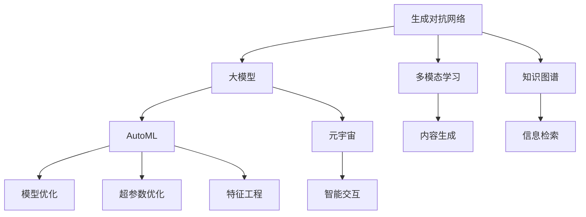

                 

# AIGC未来发展趋势预测

> 关键词：AIGC, 生成对抗网络(GAN), 大模型, 自动化机器学习(AutoML), 元宇宙, 多模态学习, 知识图谱, 交互式生成

## 1. 背景介绍

人工智能生成内容(AI Generated Content, AIGC)技术近年来快速发展，从深度学习到生成对抗网络(GAN)、从大模型预训练到自动化机器学习(AutoML)，AI在内容生成、智能交互、跨模态融合等领域不断突破，催生了诸如元宇宙(Metaverse)、虚拟主播、实时生成音乐、动画、影视作品等前沿应用。未来，AIGC将进一步拓展其应用边界，不断优化生成内容的逼真度、个性化程度和实时性，驱动智能技术向深度渗透。

## 2. 核心概念与联系

### 2.1 核心概念概述

为理解AIGC技术及其未来趋势，本文将介绍几个核心概念，包括生成对抗网络、大模型、AutoML、元宇宙、多模态学习和知识图谱。这些概念相互交织，共同构成AIGC技术的基石。

- **生成对抗网络(GAN)**：通过生成器和判别器两个模型的对抗训练，生成具有高度逼真度的假数据，如图像、音频、视频等。

- **大模型**：指基于深度学习模型，如Transformer架构，包含大规模参数量、高质量预训练数据集的模型。以BERT、GPT-3、DALL-E等为代表的大模型通过自监督预训练，获取丰富的语言和视觉知识，可用于多种生成任务。

- **自动化机器学习(AutoML)**：自动化的模型优化和调参技术，通过自动化的特征工程、模型选择、超参数优化等，实现高效、可复现的模型训练。

- **元宇宙**：利用虚拟现实(VR)、增强现实(AR)、区块链等技术构建的数字虚拟世界，实现沉浸式交互、虚拟实体生成等应用。

- **多模态学习**：结合视觉、听觉、文本等多种数据模态，通过跨模态融合技术实现更丰富、更自然的智能交互和内容生成。

- **知识图谱**：构建由实体、关系、属性等元素构成的知识图，用于支持信息检索、推理等知识驱动的应用。

这些概念之间的逻辑关系可通过以下Mermaid流程图表示：



通过这张流程图，我们可以看到，AIGC技术的应用和优化是一个复杂的系统工程，需要在大模型预训练的基础上，结合多模态学习和知识图谱等技术，通过AutoML进行模型优化，最终在元宇宙等新场景下实现智能交互和内容生成的创新应用。

## 3. 核心算法原理 & 具体操作步骤

### 3.1 算法原理概述

AIGC技术的核心算法原理主要包括以下几个方面：

- **生成对抗网络(GAN)**：通过生成器和判别器的对抗训练，生成高质量的假数据。生成器通过神经网络将噪声输入转化为逼真数据，判别器则识别数据的真伪，两者相互博弈，不断提升生成数据的逼真度。

- **大模型预训练**：在大规模无标签数据集上进行自监督预训练，学习丰富的语言和视觉知识。常用的预训练任务包括语言建模、掩码语言模型、图像分类、视觉生成等。

- **自动化机器学习(AutoML)**：通过自动化调参、自动化特征工程等技术，提高模型训练和优化的效率和效果。AutoML通常包括模型选择、超参数优化、自动化特征选择等环节。

- **多模态学习**：结合文本、图像、音频等多种数据模态，通过跨模态融合技术，实现更丰富、更自然的智能交互和内容生成。

- **知识图谱**：构建基于实体、关系、属性等元素的知识图，用于支持信息检索、推理等知识驱动的应用。

### 3.2 算法步骤详解

#### 3.2.1 生成对抗网络(GAN)

1. **模型架构设计**：设计生成器和判别器的神经网络结构，通常包括卷积神经网络(CNN)、循环神经网络(RNN)等。

2. **损失函数定义**：定义生成器和判别器的损失函数，生成器希望最大化判别器的损失，而判别器希望最大化自身的损失，两者共同优化。

3. **对抗训练**：交替训练生成器和判别器，生成器通过反向传播计算损失并更新参数，判别器通过生成器生成数据进行分类并更新参数。

4. **评估和改进**：定期在验证集上评估生成数据的质量，根据评估结果调整生成器和判别器的参数。

#### 3.2.2 大模型预训练

1. **数据准备**：准备大规模无标签数据集，如大规模语料库、图像库等。

2. **模型初始化**：选择合适的预训练模型架构，如BERT、GPT-3等，并进行初始化。

3. **自监督学习**：在大规模数据集上进行自监督预训练，如语言建模、掩码语言模型、图像分类等。

4. **微调**：在特定任务的数据集上，通过有监督学习进行微调，进一步优化模型性能。

#### 3.2.3 自动化机器学习(AutoML)

1. **自动特征工程**：使用AutoML工具自动化进行特征选择、特征编码、特征降维等预处理工作。

2. **模型选择**：根据任务类型和数据特点，自动选择最合适的模型架构和优化器。

3. **超参数优化**：通过网格搜索、贝叶斯优化等技术，自动搜索最优的超参数组合。

4. **模型评估**：使用交叉验证等方法，评估模型在验证集上的性能，选择最优模型。

### 3.3 算法优缺点

**优点**：

- **高效性**：通过自动化调参和特征工程，显著提升模型训练和优化的效率。
- **泛化性**：大模型预训练和跨模态学习提高了模型泛化能力，适应多种数据模态和应用场景。
- **灵活性**：AutoML能够自动选择最优模型和超参数，减少人工干预，实现灵活的模型适配。

**缺点**：

- **计算成本高**：大模型的预训练和AutoML的优化都需要大规模计算资源和长时间的训练，成本较高。
- **结果可解释性不足**：自动化过程缺乏人工干预，模型决策的透明性和可解释性较低。
- **对数据依赖性强**：模型的性能依赖于高质量、大规模的数据集，数据偏差可能导致模型输出错误。

### 3.4 算法应用领域

AIGC技术广泛应用于多个领域，包括但不限于：

- **媒体和娱乐**：生成音乐、动画、影视作品等，提升内容创作效率和质量。
- **游戏和虚拟现实**：生成虚拟角色、场景、物品等，增强沉浸式体验。
- **电商和广告**：生成商品图片、广告文案等，提升用户互动体验。
- **医疗和教育**：生成医学影像、教学视频等，辅助医疗诊断和教学。
- **金融和法律**：生成法律文件、财务报告等，提高工作效率。
- **智能客服和助理**：生成自然对话，提升客户服务质量。

这些应用领域展示了AIGC技术的广泛潜力和应用前景。未来，随着技术的不断进步和应用场景的拓展，AIGC将在更多领域发挥重要作用。

## 4. 数学模型和公式 & 详细讲解  
### 4.1 数学模型构建

AIGC技术的数学模型构建通常涉及以下关键环节：

- **生成对抗网络**：使用生成器和判别器作为神经网络架构，定义损失函数，进行对抗训练。

- **大模型预训练**：使用自监督学习任务，定义损失函数，进行模型预训练。

- **多模态学习**：通过跨模态融合技术，定义融合函数，进行多模态数据处理。

- **自动化机器学习**：定义模型选择、超参数优化、特征工程等算法，实现自动调参。

### 4.2 公式推导过程

#### 4.2.1 生成对抗网络

1. **生成器损失函数**：
   $$
   L_G = -\log D(G(z))
   $$
   其中，$G$ 为生成器，$z$ 为噪声向量，$D$ 为判别器。

2. **判别器损失函数**：
   $$
   L_D = \log D(x) + \log(1 - D(G(z)))
   $$
   其中，$x$ 为真实数据，$G(z)$ 为生成数据。

3. **对抗训练过程**：
   $$
   G_{new} = G - \eta \nabla_G [L_G + \lambda L_D]
   $$
   $$
   D_{new} = D - \eta \nabla_D [L_G + \lambda L_D]
   $$
   其中，$\eta$ 为学习率，$\lambda$ 为对抗损失的权重。

#### 4.2.2 大模型预训练

1. **掩码语言模型**：
   $$
   \mathcal{L}_{MLM} = -\frac{1}{N}\sum_{i=1}^N \sum_{j=1}^V \log P(y_j|x_i, y_{<j})
   $$
   其中，$x_i$ 为输入文本，$y_j$ 为掩码位置上的预测标签。

2. **图像分类**：
   $$
   \mathcal{L}_{CLS} = -\frac{1}{N}\sum_{i=1}^N \log P(y_i|x_i)
   $$
   其中，$x_i$ 为输入图像，$y_i$ 为图像标签。

#### 4.2.3 多模态学习

1. **跨模态融合函数**：
   $$
   F_{fused} = f_{text}(f_{img}) + f_{audio}(f_{text})
   $$
   其中，$f_{text}$、$f_{img}$、$f_{audio}$ 分别为文本、图像、音频的特征提取函数，$f_{fused}$ 为跨模态融合后的特征。

2. **融合后的模型输出**：
   $$
   y = M(F_{fused})
   $$
   其中，$M$ 为多模态融合后的模型。

### 4.3 案例分析与讲解

#### 4.3.1 生成对抗网络

以生成音乐为例，使用Wavenet架构的GAN进行训练。首先定义生成器和判别器的损失函数：

```python
import tensorflow as tf
from tensorflow.keras import layers

def generator(input_shape):
    inputs = layers.Input(shape=input_shape)
    x = layers.Conv2D(64, (3, 3), strides=1, padding='same')(inputs)
    x = layers.Conv2D(128, (3, 3), strides=2, padding='same')(x)
    x = layers.Conv2D(256, (3, 3), strides=2, padding='same')(x)
    x = layers.Conv2D(512, (3, 3), strides=2, padding='same')(x)
    x = layers.Conv2D(256, (3, 3), strides=2, padding='same')(x)
    x = layers.Conv2D(128, (3, 3), strides=2, padding='same')(x)
    x = layers.Conv2D(64, (3, 3), strides=1, padding='same')(x)
    x = layers.Conv2D(1, (1, 1), activation='sigmoid')(x)
    model = tf.keras.Model(inputs=inputs, outputs=x)
    return model

def discriminator(input_shape):
    inputs = layers.Input(shape=input_shape)
    x = layers.Conv2D(64, (3, 3), strides=1, padding='same')(inputs)
    x = layers.Conv2D(128, (3, 3), strides=2, padding='same')(x)
    x = layers.Conv2D(256, (3, 3), strides=2, padding='same')(x)
    x = layers.Conv2D(512, (3, 3), strides=2, padding='same')(x)
    x = layers.Flatten()(x)
    x = layers.Dense(1, activation='sigmoid')(x)
    model = tf.keras.Model(inputs=inputs, outputs=x)
    return model
```

定义损失函数和对抗训练过程：

```python
def g_loss(y_true, y_pred):
    return tf.reduce_mean(tf.nn.sigmoid_cross_entropy_with_logits(labels=y_true, logits=y_pred))

def d_loss(x_real, x_fake):
    return tf.reduce_mean(tf.nn.sigmoid_cross_entropy_with_logits(labels=tf.ones_like(x_real), logits=x_real)) + tf.reduce_mean(tf.nn.sigmoid_cross_entropy_with_logits(labels=tf.zeros_like(x_fake), logits=x_fake))

def train_step(x_real, x_fake):
    with tf.GradientTape() as tape_gen, tf.GradientTape() as tape_disc:
        y_real = model_disc(x_real)
        y_fake = model_disc(x_fake)
        g_loss_value = g_loss(y_real, y_fake)
        d_loss_value = d_loss(x_real, x_fake)
    grads_gen = tape_gen.gradient(g_loss_value, model_gen.trainable_variables)
    grads_disc = tape_disc.gradient(d_loss_value, model_disc.trainable_variables)
    model_gen.optimizer.apply_gradients(zip(grads_gen, model_gen.trainable_variables))
    model_disc.optimizer.apply_gradients(zip(grads_disc, model_disc.trainable_variables))
```

#### 4.3.2 大模型预训练

以BERT预训练为例，使用语言模型损失函数进行训练：

```python
import torch
from transformers import BertTokenizer, BertForMaskedLM

tokenizer = BertTokenizer.from_pretrained('bert-base-uncased')
model = BertForMaskedLM.from_pretrained('bert-base-uncased')

input_ids = torch.tensor([[0, 0, 0, 0, 1, 2, 3, 0]])
attention_mask = torch.tensor([[1, 1, 1, 1, 0, 0, 0, 1])

inputs = tokenizer(input_ids, attention_mask=attention_mask, return_tensors='pt')
labels = inputs.input_ids.clone()
labels[0, 4] = 2  # 将第四个位置的标签修改为2

outputs = model(**inputs)
loss = outputs.loss

model.zero_grad()
loss.backward()
model.optimizer.step()
```

## 5. 项目实践：代码实例和详细解释说明

### 5.1 开发环境搭建

AIGC项目开发通常需要强大的计算资源和工具支持。以下是Python环境中搭建开发环境的步骤：

1. **安装Python**：确保Python 3.7或更高版本安装到位，并配置好路径。

2. **安装依赖包**：使用pip安装必要的依赖包，如TensorFlow、PyTorch、Keras等。

3. **配置环境**：使用conda或virtualenv创建独立的环境，避免不同项目之间的依赖冲突。

4. **GPU/TPU支持**：安装TensorFlow的GPU版本或Google Colab，利用GPU加速计算。

5. **代码版本控制**：使用git进行代码版本控制，定期提交和备份代码。

### 5.2 源代码详细实现

以下是一个生成对抗网络(GAN)的Python代码实现，用于生成高质量的图像数据：

```python
import tensorflow as tf
from tensorflow.keras import layers

def generator(input_shape):
    inputs = layers.Input(shape=input_shape)
    x = layers.Conv2D(64, (3, 3), strides=1, padding='same')(inputs)
    x = layers.Conv2D(128, (3, 3), strides=2, padding='same')(x)
    x = layers.Conv2D(256, (3, 3), strides=2, padding='same')(x)
    x = layers.Conv2D(512, (3, 3), strides=2, padding='same')(x)
    x = layers.Conv2D(256, (3, 3), strides=2, padding='same')(x)
    x = layers.Conv2D(128, (3, 3), strides=2, padding='same')(x)
    x = layers.Conv2D(64, (3, 3), strides=1, padding='same')(x)
    x = layers.Conv2D(1, (1, 1), activation='sigmoid')(x)
    model = tf.keras.Model(inputs=inputs, outputs=x)
    return model

def discriminator(input_shape):
    inputs = layers.Input(shape=input_shape)
    x = layers.Conv2D(64, (3, 3), strides=1, padding='same')(inputs)
    x = layers.Conv2D(128, (3, 3), strides=2, padding='same')(x)
    x = layers.Conv2D(256, (3, 3), strides=2, padding='same')(x)
    x = layers.Conv2D(512, (3, 3), strides=2, padding='same')(x)
    x = layers.Flatten()(x)
    x = layers.Dense(1, activation='sigmoid')(x)
    model = tf.keras.Model(inputs=inputs, outputs=x)
    return model

def g_loss(y_true, y_pred):
    return tf.reduce_mean(tf.nn.sigmoid_cross_entropy_with_logits(labels=y_true, logits=y_pred))

def d_loss(x_real, x_fake):
    return tf.reduce_mean(tf.nn.sigmoid_cross_entropy_with_logits(labels=tf.ones_like(x_real), logits=x_real)) + tf.reduce_mean(tf.nn.sigmoid_cross_entropy_with_logits(labels=tf.zeros_like(x_fake), logits=x_fake))

def train_step(x_real, x_fake):
    with tf.GradientTape() as tape_gen, tf.GradientTape() as tape_disc:
        y_real = model_disc(x_real)
        y_fake = model_disc(x_fake)
        g_loss_value = g_loss(y_real, y_fake)
        d_loss_value = d_loss(x_real, x_fake)
    grads_gen = tape_gen.gradient(g_loss_value, model_gen.trainable_variables)
    grads_disc = tape_disc.gradient(d_loss_value, model_disc.trainable_variables)
    model_gen.optimizer.apply_gradients(zip(grads_gen, model_gen.trainable_variables))
    model_disc.optimizer.apply_gradients(zip(grads_disc, model_disc.trainable_variables))
```

### 5.3 代码解读与分析

**生成器模型定义**：
- `generator`函数定义了生成器的神经网络结构，使用了卷积神经网络(CNN)层。
- 输入层接收噪声向量，通过多层卷积和激活函数，最终输出逼真图像。

**判别器模型定义**：
- `discriminator`函数定义了判别器的神经网络结构，同样使用了卷积神经网络(CNN)层。
- 输入层接收图像数据，通过多层卷积和激活函数，判断图像是真实还是生成。

**损失函数定义**：
- `g_loss`和`d_loss`函数分别定义了生成器和判别器的损失函数，使用了交叉熵损失。
- 生成器希望最小化判别器的输出，判别器希望最大化生成器和真实数据的交叉熵损失。

**训练步骤实现**：
- `train_step`函数实现了生成器和判别器的对抗训练过程。
- 使用梯度下降算法更新生成器和判别器的参数。

通过这个示例，我们可以理解AIGC技术的基本流程和关键算法实现。

## 6. 实际应用场景

### 6.1 媒体和娱乐

**生成音乐**：基于生成对抗网络(GAN)的音频生成技术，可以生成逼真度极高的音乐。例如，使用Wavenet架构的GAN，可以通过音频文本生成音乐，满足不同风格、节奏的需求。

**动画制作**：利用大模型进行角色动作生成和场景渲染，提升动画制作的效率和效果。例如，使用基于Transformer的模型进行动画角色的自动生成，使动画制作更加灵活和高效。

### 6.2 游戏和虚拟现实

**虚拟角色**：通过生成对抗网络(GAN)生成高质量的虚拟角色，增强游戏和虚拟现实的沉浸式体验。例如，使用3DGAN生成虚拟角色的纹理和形态，使角色更具真实感。

**虚拟场景**：利用大模型进行场景生成和环境构建，增强虚拟现实环境的逼真度。例如，使用VQ-VAE-2生成高质量的虚拟环境，增强虚拟现实游戏的互动性和体验感。

### 6.3 电商和广告

**商品展示**：基于生成对抗网络(GAN)的图像生成技术，可以生成高质量的商品图片，提升电商平台的商品展示效果。例如，使用DCGAN生成高分辨率的商品图片，增强用户的购物体验。

**广告创意**：利用大模型进行广告文案生成和图像生成，提高广告创意的多样性和吸引力。例如，使用BERT进行广告文案的自动生成，结合GAN生成的图像，制作高质量的广告素材。

### 6.4 医疗和教育

**医学影像生成**：通过生成对抗网络(GAN)生成高质量的医学影像，辅助医生进行诊断和治疗。例如，使用WGAN生成高分辨率的医学图像，帮助医生更准确地识别病灶。

**教育内容生成**：利用大模型进行教学视频和教材的自动生成，提高教育内容的丰富性和可理解性。例如，使用GPT-3生成自动化的教学视频，使教育内容更加生动和有趣。

## 7. 工具和资源推荐

### 7.1 学习资源推荐

1. **深度学习与生成对抗网络**：斯坦福大学的Coursera课程，详细讲解深度学习和生成对抗网络的基本原理和应用。

2. **AIGC技术白皮书**：各大公司的技术白皮书，全面介绍AIGC技术的最新进展和未来方向。

3. **Python深度学习框架指南**：TensorFlow、PyTorch等深度学习框架的官方文档和教程，帮助开发者快速上手。

4. **NLP和AIGC领域论文**：arXiv等学术平台上的最新论文，了解最新的研究进展和前沿技术。

5. **在线学习平台**：Coursera、Udacity等在线学习平台，提供AIGC技术的系统化课程和实践项目。

### 7.2 开发工具推荐

1. **Python环境管理**：Anaconda和Virtualenv，方便创建和管理Python开发环境。

2. **深度学习框架**：TensorFlow、PyTorch、Keras等深度学习框架，支持生成对抗网络和大模型的训练和优化。

3. **可视化工具**：TensorBoard、Weights & Biases等可视化工具，帮助开发者实时监控模型训练和优化过程。

4. **自动机器学习工具**：AutoML库，自动化调参和特征工程，提高模型训练和优化的效率。

5. **编程协作工具**：Git、Jupyter Notebook等协作工具，方便团队成员协同开发和分享代码。

### 7.3 相关论文推荐

1. **生成对抗网络**：Ian Goodfellow等人的论文《Generative Adversarial Nets》，介绍GAN的基本原理和算法实现。

2. **大模型预训练**：Jurafsky等人的论文《Recurrent Neural Network Encodings for Natural Language Processing》，介绍BERT等大模型的预训练和微调方法。

3. **多模态学习**：Jianlong Yu等人的论文《Cross-Modal Information Retrieval with Multi-Aspect Attention》，介绍多模态学习的框架和算法。

4. **自动化机器学习**：Hutter等人的论文《A Survey of the Automated Machine Learning Problem》，介绍AutoML的基本原理和应用。

## 8. 总结：未来发展趋势与挑战

### 8.1 研究成果总结

AIGC技术近年来取得了显著进展，主要体现在以下几个方面：

- **生成对抗网络**：通过生成器和判别器的对抗训练，生成高质量的假数据，广泛应用于媒体、游戏、虚拟现实等领域。

- **大模型预训练**：利用大规模无标签数据进行自监督预训练，学习丰富的语言和视觉知识，广泛应用于NLP、图像生成、音乐生成等任务。

- **自动化机器学习**：通过自动化调参和特征工程，提高模型训练和优化的效率和效果，减少人工干预。

- **多模态学习**：结合文本、图像、音频等多种数据模态，通过跨模态融合技术，实现更丰富、更自然的智能交互和内容生成。

- **知识图谱**：构建基于实体、关系、属性等元素的知识图，用于支持信息检索、推理等知识驱动的应用。

### 8.2 未来发展趋势

1. **生成内容的逼真度提升**：随着生成对抗网络和大模型技术的不断进步，生成内容的逼真度和多样性将进一步提升，应用于更多高要求的应用场景。

2. **实时生成技术的发展**：实时生成技术将使AIGC技术在音乐、视频、动画等创意内容领域大放异彩，满足用户对即时交互的需求。

3. **多模态融合的深化**：多模态学习将结合更多数据模态，实现更自然、更智能的智能交互和内容生成，应用于更多实际应用场景。

4. **跨领域的知识图谱应用**：知识图谱将与更多领域知识结合，支持更复杂、更广泛的知识驱动应用，如医疗、法律、金融等。

5. **自动化机器学习的应用拓展**：AutoML将进一步应用于更多行业和任务，提升模型训练和优化的效率和效果，减少人工干预。

### 8.3 面临的挑战

尽管AIGC技术取得了显著进展，但在实际应用中仍面临诸多挑战：

1. **数据质量**：高质量、大规模的数据是生成对抗网络和大模型预训练的基础，但数据获取和标注成本较高，如何高效获取和利用数据是当前的重要问题。

2. **计算资源**：生成对抗网络和大模型训练需要强大的计算资源，如何高效利用计算资源，降低训练成本，是AIGC技术普及的关键。

3. **结果可解释性**：AIGC技术生成的内容缺乏人工干预，其结果的可解释性和透明性不足，如何增强模型的可解释性，是当前研究的重要方向。

4. **安全性**：AIGC技术生成的内容可能包含有害信息，如何确保内容的安全性和合规性，是实际应用中的重要问题。

5. **伦理和法律问题**：AIGC技术的应用涉及伦理和法律问题，如何保障用户的隐私和数据安全，避免滥用和误用，是AIGC技术发展中的重要课题。

### 8.4 研究展望

未来的AIGC技术研究将重点关注以下几个方向：

1. **高效数据获取和标注技术**：研究自动化的数据标注和获取技术，提升数据质量和数量，降低标注成本。

2. **高效计算资源利用**：研究分布式计算、混合精度训练等技术，提升计算效率，降低训练成本。

3. **模型可解释性增强**：研究模型可解释性增强技术，提高模型的透明性和可解释性。

4. **内容安全性保障**：研究内容安全性保障技术，确保生成的内容符合伦理和法律要求。

5. **跨领域应用扩展**：研究跨领域应用技术，将AIGC技术应用于更多行业和任务，提升实际应用效果。

6. **多模态融合深化**：研究多模态融合技术，实现更自然、更智能的智能交互和内容生成。

通过不断探索和创新，AIGC技术将在更多领域得到广泛应用，为人类生产生活方式带来深刻变革。

## 9. 附录：常见问题与解答

**Q1：AIGC技术的核心算法原理是什么？**

A: AIGC技术的核心算法原理包括生成对抗网络、大模型预训练、自动化机器学习、多模态学习等。生成对抗网络通过生成器和判别器的对抗训练生成高质量的假数据；大模型预训练利用大规模无标签数据进行自监督预训练，学习丰富的语言和视觉知识；自动化机器学习通过自动化调参和特征工程，提高模型训练和优化的效率和效果；多模态学习结合多种数据模态，实现更丰富、更自然的智能交互和内容生成。

**Q2：AIGC技术在实际应用中面临哪些挑战？**

A: AIGC技术在实际应用中面临以下挑战：
1. 数据质量：高质量、大规模的数据是生成对抗网络和大模型预训练的基础，但数据获取和标注成本较高。
2. 计算资源：生成对抗网络和大模型训练需要强大的计算资源，如何高效利用计算资源，降低训练成本。
3. 结果可解释性：AIGC技术生成的内容缺乏人工干预，其结果的可解释性和透明性不足。
4. 安全性：AIGC技术生成的内容可能包含有害信息，如何确保内容的安全性和合规性。
5. 伦理和法律问题：AIGC技术的应用涉及伦理和法律问题，如何保障用户的隐私和数据安全，避免滥用和误用。

**Q3：AIGC技术未来有哪些发展趋势？**

A: AIGC技术的未来发展趋势包括：
1. 生成内容的逼真度提升：生成对抗网络和大模型技术的不断进步，使生成内容的逼真度和多样性进一步提升。
2. 实时生成技术的发展：实时生成技术使AIGC技术在音乐、视频、动画等创意内容领域大放异彩。
3. 多模态融合的深化：多模态学习结合更多数据模态，实现更自然、更智能的智能交互和内容生成。
4. 跨领域的知识图谱应用：知识图谱与更多领域知识结合，支持更复杂、更广泛的知识驱动应用。
5. 自动化机器学习的应用拓展：AutoML应用于更多行业和任务，提升模型训练和优化的效率和效果。

**Q4：AIGC技术如何保障内容的安全性和合规性？**

A: 保障AIGC技术生成内容的安全性和合规性需要：
1. 数据预处理：确保训练数据和生成内容符合伦理和法律要求，避免有害信息的生成。
2. 内容审核：建立内容审核机制，对生成的内容进行实时监控和过滤。
3. 技术手段：采用图像识别、语音识别等技术手段，对生成的内容进行自动识别和过滤。
4. 法律和伦理规范：制定和遵守相关法律和伦理规范，保障内容的安全性和合规性。

**Q5：AIGC技术的未来发展方向是什么？**

A: AIGC技术的未来发展方向包括：
1. 高效数据获取和标注技术：研究自动化的数据标注和获取技术，提升数据质量和数量。
2. 高效计算资源利用：研究分布式计算、混合精度训练等技术，提升计算效率。
3. 模型可解释性增强：研究模型可解释性增强技术，提高模型的透明性和可解释性。
4. 内容安全性保障：研究内容安全性保障技术，确保生成的内容符合伦理和法律要求。
5. 跨领域应用扩展：研究跨领域应用技术，将AIGC技术应用于更多行业和任务。
6. 多模态融合深化：研究多模态融合技术，实现更自然、更智能的智能交互和内容生成。

---

作者：禅与计算机程序设计艺术 / Zen and the Art of Computer Programming

