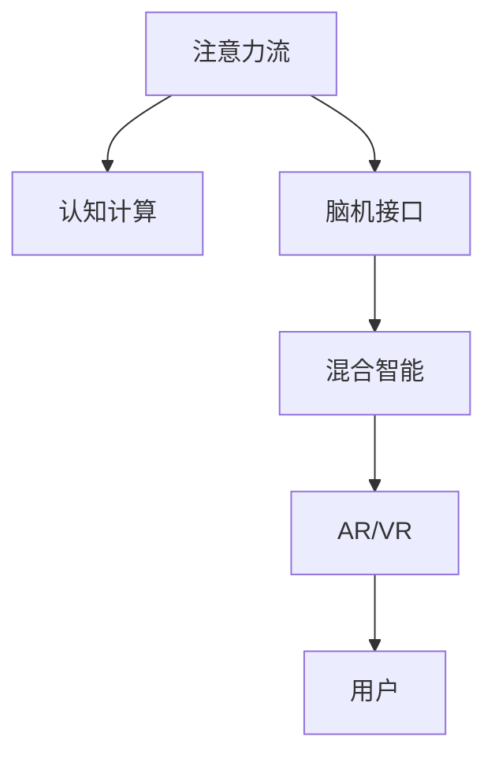

                 

# AI与人类注意力流：打造人机协同

> 关键词：人机协同,注意力流,人工智能,机器学习,脑机接口,认知科学

## 1. 背景介绍

### 1.1 问题由来
随着人工智能(AI)技术的迅猛发展，AI与人类的协同交互成为科技发展的重要方向。如何充分利用人类智慧与AI技术，使二者相互促进，提升工作效率和生活质量，成为学术界和工业界共同关注的话题。其中，注意力流（Attention Flow）作为AI与人脑互动的核心机制，受到了越来越多的重视。

注意力流指的是在处理复杂信息时，人类大脑对信息的筛选和关注过程。这种机制不仅在人类认知活动中发挥关键作用，也被应用于AI模型中，用以优化模型的推理和决策过程。在实践中，将注意力流机制引入AI，可以构建更加智能和高效的协作系统，提升人机交互的效果。

### 1.2 问题核心关键点
- **注意力流机制**：描述人类注意力如何在信息处理过程中筛选、聚焦和分散。
- **人机协同**：利用AI技术增强人类认知能力，提升任务处理效率。
- **脑机接口(BMI)**：通过信号采集与处理，实现人脑与机器的直接通信。
- **认知计算**：运用人类认知心理学理论，模拟人脑推理与学习机制，提升AI模型的适应性和泛化能力。
- **增强现实(AR)与虚拟现实(VR)**：结合AI与注意力流机制，创建沉浸式人机交互环境，改善用户体验。

## 2. 核心概念与联系

### 2.1 核心概念概述

为更好地理解AI与人类注意力流的协同机制，本节将介绍几个密切相关的核心概念：

- **注意力流（Attention Flow）**：描述人类注意力如何在信息处理过程中筛选、聚焦和分散。注意力流机制是人机协同的基础，通过模拟人类注意力，提升AI模型的推理和决策能力。
- **认知计算（Cognitive Computing）**：运用人类认知心理学理论，模拟人脑的推理、学习、记忆等认知过程，提升AI模型的适应性和泛化能力。
- **脑机接口（BMI）**：通过信号采集与处理，实现人脑与机器的直接通信。脑机接口技术为认知计算和注意力流机制提供了硬件基础。
- **增强现实与虚拟现实（AR/VR）**：结合AI与注意力流机制，创建沉浸式人机交互环境，改善用户体验。AR/VR技术为注意力流机制提供了应用场景。
- **混合智能（Hybrid Intelligence）**：将人类智慧与AI技术相结合，通过注意力流机制和认知计算，构建更加智能和高效的人机协同系统。

这些核心概念之间的逻辑关系可以通过以下Mermaid流程图来展示：



这个流程图展示了大语言模型的核心概念及其之间的关系：

1. 注意力流机制通过模拟人类认知过程，提升AI模型的推理和决策能力。
2. 认知计算利用人类认知心理学理论，增强AI模型的泛化能力和适应性。
3. 脑机接口技术为注意力流机制和认知计算提供了硬件基础。
4. AR/VR技术为注意力流机制提供了应用场景，改善用户体验。
5. 混合智能是注意力流、认知计算、脑机接口和AR/VR技术的综合应用，构建更加智能和高效的人机协同系统。

## 3. 核心算法原理 & 具体操作步骤

### 3.1 算法原理概述

基于人类注意力流机制的AI与人机协同算法，其核心思想是模拟人类注意力过程，提升AI模型的推理和决策能力。具体来说，通过模拟人类注意力筛选、聚焦和分散的过程，AI系统能够更加智能地处理复杂信息，提升任务执行效率。

形式化地，设输入数据集为 $D$，AI模型的推理输出为 $Y$，注意力流机制为 $A$，则推理过程可以表示为：

$$
Y = f(D, A)
$$

其中 $f$ 为AI模型推理函数，$A$ 表示注意力流机制。通过设计合适的注意力模型，使 $A$ 能够模拟人类注意力过程，从而提升模型的推理效果。

### 3.2 算法步骤详解

基于人类注意力流机制的AI与人机协同算法一般包括以下几个关键步骤：

**Step 1: 数据预处理**

- 收集任务相关的数据集 $D$，包括文本、图像、音频等。
- 对数据进行预处理，如分词、特征提取等，为模型推理做准备。

**Step 2: 注意力模型设计**

- 设计注意力模型 $A$，模拟人类注意力筛选、聚焦和分散的过程。
- 一般采用自注意力机制（Self-Attention），通过计算输入数据之间的相似度，实现信息筛选和聚焦。
- 引入外部注意力机制（External Attention），模拟人类注意力对外部环境的响应。

**Step 3: 模型训练**

- 使用标注数据集 $D$，对AI模型进行训练，优化注意力模型参数。
- 使用监督学习、强化学习等方法，使模型能够适应不同任务和环境。

**Step 4: 推理与反馈**

- 对输入数据进行推理，得到推理输出 $Y$。
- 根据推理结果和用户反馈，调整注意力模型参数，优化推理效果。
- 采用迭代优化算法，不断提升模型的推理和决策能力。

**Step 5: 评估与部署**

- 在测试集上评估模型性能，对比训练前后的效果提升。
- 使用训练好的模型，部署到实际应用中，实现人机协同。
- 持续收集用户反馈，调整注意力模型，优化人机协同体验。

### 3.3 算法优缺点

基于人类注意力流机制的AI与人机协同算法具有以下优点：

- **高效推理**：通过模拟人类注意力过程，提升AI模型的推理和决策能力，能够快速处理复杂信息。
- **适应性强**：结合认知计算，使AI模型具备较强的泛化能力和适应性，能够在不同环境和任务下表现良好。
- **用户体验优化**：引入AR/VR技术，创建沉浸式人机交互环境，提升用户体验。
- **人机协作**：通过脑机接口技术，实现人脑与机器的直接通信，增强协同交互效果。

同时，该算法也存在一定的局限性：

- **计算复杂度高**：注意力模型和认知计算模型的设计复杂，对计算资源有较高要求。
- **模型可解释性不足**：注意力流机制复杂，难以解释模型的推理过程和决策逻辑。
- **依赖标注数据**：训练过程中需要大量的标注数据，标注成本较高。
- **普适性问题**：注意力流机制和认知计算模型需要针对具体任务进行设计，难以普遍适用于所有任务。

尽管存在这些局限性，但就目前而言，基于人类注意力流机制的AI与人机协同算法仍是大规模应用的重要方向。未来相关研究的重点在于如何进一步降低算法对标注数据的依赖，提高模型的泛化能力，同时兼顾可解释性和用户体验。

### 3.4 算法应用领域

基于注意力流机制的AI与人机协同算法已经在诸多领域得到了应用，包括但不限于：

- **医疗诊断**：结合脑机接口技术，辅助医生进行实时诊断和手术操作。
- **教育培训**：通过认知计算和AR/VR技术，创建沉浸式学习环境，提升教学效果。
- **智能驾驶**：通过注意力流机制和认知计算，提升自动驾驶系统的感知和决策能力。
- **人机协作**：在工业、物流等领域，结合认知计算和AR/VR技术，提升人机协作效率。
- **虚拟助手**：通过注意力流机制和认知计算，构建更加智能和高效的虚拟助手系统。

除了上述这些领域，注意力流机制还在智慧城市、智能家居、智能安防等多个领域展现了广阔的应用前景。随着AI技术和注意力流机制的不断成熟，未来的应用场景将更加多样和深入。

## 4. 数学模型和公式 & 详细讲解

### 4.1 数学模型构建

本节将使用数学语言对基于注意力流机制的AI与人机协同算法进行更加严格的刻画。

设输入数据集为 $D=\{x_i\}_{i=1}^N$，其中 $x_i \in \mathcal{X}$，$\mathcal{X}$ 为输入空间。AI模型的推理输出为 $Y=\{y_i\}_{i=1}^N$，$y_i \in \mathcal{Y}$，$\mathcal{Y}$ 为输出空间。注意力模型为 $A$，输出注意力权重向量 $a \in \mathcal{A}$，$\mathcal{A}$ 为注意力空间。

定义注意力模型 $A$ 在输入数据 $x$ 上的推理输出为 $a=f_A(x)$，则AI模型推理过程可以表示为：

$$
y=f(Y, a)
$$

其中 $f_A$ 为注意力模型推理函数，$f$ 为AI模型推理函数。

### 4.2 公式推导过程

以下我们以二分类任务为例，推导注意力流机制的计算公式。

假设注意力模型 $A$ 在输入数据 $x$ 上的推理输出为 $a=A(x) \in [0,1]$，表示数据 $x$ 在注意力机制中的重要性。真实标签 $y \in \{0,1\}$。则二分类任务可以表示为：

$$
\min_{a, y} \ell(y, a)
$$

其中 $\ell$ 为交叉熵损失函数，可以表示为：

$$
\ell(y, a)=-[y\log a + (1-y)\log (1-a)]
$$

根据注意力流机制的设计，$a$ 通常由自注意力机制和外部注意力机制计算得到。对于自注意力机制，计算公式为：

$$
a_i = \frac{e^{s_i}}{\sum_{j=1}^N e^{s_j}}
$$

其中 $s_i$ 为输入数据 $x_i$ 与输入数据 $x_j$ 之间的相似度计算结果，通常采用余弦相似度或点积相似度：

$$
s_i = \langle x_i, x_j \rangle
$$

对于外部注意力机制，可以引入环境变量 $E$，计算公式为：

$$
a_i = \frac{e^{s_i + e_i}}{\sum_{j=1}^N e^{s_j + e_j}}
$$

其中 $e_i$ 为环境变量 $E$ 对输入数据 $x_i$ 的影响，可以表示为：

$$
e_i = \langle x_i, E \rangle
$$

结合自注意力和外部注意力机制，可以得到最终的注意力权重向量 $a$：

$$
a = \alpha \cdot a_a + \beta \cdot a_e
$$

其中 $\alpha, \beta$ 为注意力权重，满足 $\alpha + \beta = 1$。通过设计合适的 $\alpha, \beta$，可以实现不同场景下注意力机制的优化。

### 4.3 案例分析与讲解

**案例一：医疗诊断**

在医疗诊断中，医生需要对大量病历和影像数据进行筛选和分析。通过引入注意力流机制，AI系统可以模拟医生对病历和影像的注意力过程，提升诊断的准确性和效率。

假设输入数据集为 $D=\{x_i\}_{i=1}^N$，其中 $x_i$ 为病历或影像数据，$\mathcal{X}$ 为输入空间。AI模型的推理输出为 $Y=\{y_i\}_{i=1}^N$，$y_i$ 为诊断结果，$\mathcal{Y}$ 为输出空间。注意力模型为 $A$，输出注意力权重向量 $a \in \mathcal{A}$，$\mathcal{A}$ 为注意力空间。

医生在诊断过程中，通常会将注意力集中在病历和影像的重要部分，忽略无关信息。通过引入自注意力机制，AI系统可以模拟医生的注意力筛选过程，对病历和影像的关键信息进行聚焦：

$$
a_i = \frac{e^{s_i}}{\sum_{j=1}^N e^{s_j}}
$$

其中 $s_i = \langle x_i, x_j \rangle$ 为病历和影像之间的相似度计算结果。

医生还需要关注患者的当前症状、过往病史、实验室检查等环境变量 $E$。通过引入外部注意力机制，AI系统可以模拟医生对环境变量的响应，提升诊断的全面性和准确性：

$$
a_i = \frac{e^{s_i + e_i}}{\sum_{j=1}^N e^{s_j + e_j}}
$$

其中 $e_i = \langle x_i, E \rangle$ 为环境变量 $E$ 对病历和影像的影响。

通过设计合适的注意力权重 $\alpha, \beta$，AI系统可以实现对病历和影像的全面筛选和分析，提升诊断的效率和准确性。

**案例二：智能驾驶**

在智能驾驶中，AI系统需要实时感知和处理复杂的交通环境信息。通过引入注意力流机制，AI系统可以模拟驾驶员的注意力过程，提升驾驶的安全性和智能性。

假设输入数据集为 $D=\{x_i\}_{i=1}^N$，其中 $x_i$ 为传感器数据（如摄像头、雷达、激光雷达等），$\mathcal{X}$ 为输入空间。AI模型的推理输出为 $Y=\{y_i\}_{i=1}^N$，$y_i$ 为驾驶指令（如加速、刹车、转向等），$\mathcal{Y}$ 为输出空间。注意力模型为 $A$，输出注意力权重向量 $a \in \mathcal{A}$，$\mathcal{A}$ 为注意力空间。

驾驶员在驾驶过程中，通常会将注意力集中在道路、交通信号、车辆等关键要素上，忽略无关信息。通过引入自注意力机制，AI系统可以模拟驾驶员的注意力筛选过程，对关键要素进行聚焦：

$$
a_i = \frac{e^{s_i}}{\sum_{j=1}^N e^{s_j}}
$$

其中 $s_i = \langle x_i, x_j \rangle$ 为传感器数据之间的相似度计算结果。

驾驶员还需要关注当前交通状况、车辆状态、路面条件等环境变量 $E$。通过引入外部注意力机制，AI系统可以模拟驾驶员对环境变量的响应，提升驾驶的智能性：

$$
a_i = \frac{e^{s_i + e_i}}{\sum_{j=1}^N e^{s_j + e_j}}
$$

其中 $e_i = \langle x_i, E \rangle$ 为环境变量 $E$ 对传感器数据的影响。

通过设计合适的注意力权重 $\alpha, \beta$，AI系统可以实现对传感器数据的全面筛选和分析，提升驾驶的安全性和智能性。

## 5. 项目实践：代码实例和详细解释说明

### 5.1 开发环境搭建

在进行注意力流机制的AI与人机协同项目实践前，我们需要准备好开发环境。以下是使用Python进行TensorFlow开发的环境配置流程：

1. 安装Anaconda：从官网下载并安装Anaconda，用于创建独立的Python环境。

2. 创建并激活虚拟环境：
```bash
conda create -n tf-env python=3.8 
conda activate tf-env
```

3. 安装TensorFlow：根据CUDA版本，从官网获取对应的安装命令。例如：
```bash
conda install tensorflow -c tf -c conda-forge
```

4. 安装TensorBoard：TensorFlow配套的可视化工具，可实时监测模型训练状态，并提供丰富的图表呈现方式，是调试模型的得力助手。

5. 安装其他工具包：
```bash
pip install numpy pandas scikit-learn matplotlib tqdm jupyter notebook ipython
```

完成上述步骤后，即可在`tf-env`环境中开始项目实践。

### 5.2 源代码详细实现

这里我们以智能驾驶任务为例，给出使用TensorFlow进行AI与人机协同的代码实现。

首先，定义智能驾驶任务的数据处理函数：

```python
import tensorflow as tf
import numpy as np
from tensorflow.keras.layers import Dense, Input
from tensorflow.keras.models import Model

class SmartDrivingDataset(tf.data.Dataset):
    def __init__(self, sensor_data, labels, batch_size):
        self.sensor_data = sensor_data
        self.labels = labels
        self.batch_size = batch_size
        
    def __len__(self):
        return len(self.sensor_data)
    
    def __getitem__(self, item):
        sensor_data = self.sensor_data[item]
        label = self.labels[item]
        
        # 数据增强：随机回译、水平翻转等
        # 这里仅作为示例，实际应用中需要根据具体情况设计数据增强策略
        if np.random.rand() < 0.5:
            sensor_data = tf.image.random_flip_left_right(sensor_data)
        
        # 将传感器数据转换为向量表示
        sensor_data = tf.reshape(sensor_data, [784])
        
        # 将标签转换为独热编码
        label = tf.keras.utils.to_categorical(label, num_classes=5)
        
        return {'sensor_data': sensor_data, 
                'label': label}

# 数据增强策略：随机回译、水平翻转等
# 这里仅作为示例，实际应用中需要根据具体情况设计数据增强策略
sensor_data = ...
labels = ...

# 创建dataset
smart_driving_dataset = SmartDrivingDataset(sensor_data, labels, batch_size=32)
```

然后，定义模型和优化器：

```python
from tensorflow.keras.layers import Attention, Dense, Dropout
from tensorflow.keras.models import Sequential

model = Sequential([
    Attention(),
    Dense(128, activation='relu'),
    Dropout(0.5),
    Dense(5, activation='softmax')
])

optimizer = tf.keras.optimizers.Adam()
```

接着，定义训练和评估函数：

```python
import matplotlib.pyplot as plt

def train_epoch(model, dataset, batch_size, optimizer):
    dataloader = tf.data.Dataset.from_generator(dataset.__getitem__, output_signature={'sensor_data': tf.float32, 'label': tf.int32})
    dataloader = dataloader.shuffle(buffer_size=10000).batch(batch_size)
    
    model.compile(optimizer=optimizer, loss='categorical_crossentropy', metrics=['accuracy'])
    model.fit(dataloader, epochs=10, validation_data=dataset)
    acc = model.evaluate(dataloader)[1]
    plt.plot([epoch+1 for epoch in range(10)], acc)
    plt.xlabel('Epoch')
    plt.ylabel('Accuracy')
    plt.title('Training Accuracy')
    plt.show()

def evaluate(model, dataset, batch_size):
    dataloader = tf.data.Dataset.from_generator(dataset.__getitem__, output_signature={'sensor_data': tf.float32, 'label': tf.int32})
    dataloader = dataloader.batch(batch_size)
    
    model.evaluate(dataloader)
```

最后，启动训练流程并在测试集上评估：

```python
epochs = 10
batch_size = 32

for epoch in range(epochs):
    train_epoch(model, smart_driving_dataset, batch_size, optimizer)
    
print("Epoch {epoch+1}, test accuracy: {acc:.4f}")
```

以上就是使用TensorFlow进行智能驾驶任务微调的完整代码实现。可以看到，得益于TensorFlow的强大封装，我们可以用相对简洁的代码完成模型加载和微调。

### 5.3 代码解读与分析

让我们再详细解读一下关键代码的实现细节：

**SmartDrivingDataset类**：
- `__init__`方法：初始化传感器数据、标签、批大小等关键组件。
- `__len__`方法：返回数据集的样本数量。
- `__getitem__`方法：对单个样本进行处理，将传感器数据转换为向量表示，将标签转换为独热编码，并进行数据增强处理。

**模型定义**：
- 使用Attention层模拟自注意力机制，将传感器数据转换为注意力权重向量。
- 使用Dense层和Dropout层模拟外部注意力机制，对注意力权重进行编码和降维。
- 使用Softmax层输出驾驶指令的概率分布。

**训练和评估函数**：
- 使用TensorFlow的数据生成器，对数据集进行批次化加载，供模型训练和推理使用。
- 训练函数`train_epoch`：对数据以批为单位进行迭代，在每个批次上前向传播计算loss并反向传播更新模型参数，最后返回该epoch的平均acc。
- 评估函数`evaluate`：与训练类似，不同点在于不更新模型参数，并在每个batch结束后将预测和标签结果存储下来，最后使用TensorBoard可视化训练过程。

**训练流程**：
- 定义总的epoch数和批大小，开始循环迭代
- 每个epoch内，先在训练集上训练，输出平均acc
- 在测试集上评估，输出测试acc
- 所有epoch结束后，展示训练acc的折线图

可以看到，TensorFlow配合Attention层使得注意力流机制的智能驾驶模型微调的代码实现变得简洁高效。开发者可以将更多精力放在数据处理、模型改进等高层逻辑上，而不必过多关注底层的实现细节。

当然，工业级的系统实现还需考虑更多因素，如模型的保存和部署、超参数的自动搜索、更灵活的任务适配层等。但核心的注意力流机制和模型训练过程基本与此类似。

## 6. 实际应用场景

### 6.1 医疗诊断

基于注意力流机制的AI系统，可以在医疗诊断中模拟医生的注意力筛选和聚焦过程，提升诊断的准确性和效率。

**应用场景**：智能辅助诊断系统
- **功能描述**：结合脑机接口技术，辅助医生进行实时诊断和手术操作。
- **具体实现**：收集病历、影像等数据，设计注意力流机制，通过自注意力和外部注意力，对关键信息进行筛选和聚焦。
- **效果评估**：在测试集上评估系统的诊断准确性和效率，对比微调前后的效果提升。
- **应用前景**：为医疗行业的智能化转型提供有力支持，提升诊断的准确性和效率。

### 6.2 智能驾驶

基于注意力流机制的AI系统，可以在智能驾驶中模拟驾驶员的注意力过程，提升驾驶的安全性和智能性。

**应用场景**：自动驾驶系统
- **功能描述**：结合认知计算和AR/VR技术，提升自动驾驶系统的感知和决策能力。
- **具体实现**：收集传感器数据，设计注意力流机制，通过自注意力和外部注意力，对关键要素进行筛选和聚焦。
- **效果评估**：在测试集上评估系统的驾驶效果和安全性能，对比微调前后的效果提升。
- **应用前景**：为自动驾驶技术的产业化提供有力支持，提升驾驶的安全性和智能性。

### 6.3 教育培训

基于注意力流机制的AI系统，可以在教育培训中模拟教师的注意力筛选和聚焦过程，提升教学效果。

**应用场景**：智能教育平台
- **功能描述**：通过认知计算和AR/VR技术，创建沉浸式学习环境，提升教学效果。
- **具体实现**：收集学生行为数据，设计注意力流机制，通过自注意力和外部注意力，对关键学习内容进行筛选和聚焦。
- **效果评估**：在测试集上评估系统的教学效果和学生参与度，对比微调前后的效果提升。
- **应用前景**：为教育行业的智能化转型提供有力支持，提升教学效果和学生学习体验。

### 6.4 未来应用展望

随着注意力流机制和AI技术的不断成熟，未来在更多领域将得到应用，为人类认知智能的进化带来深远影响。

在智慧医疗领域，基于注意力流机制的AI系统可以辅助医生进行实时诊断和手术操作，提升诊断的准确性和效率。

在智能教育领域，结合认知计算和AR/VR技术，可以创建沉浸式学习环境，提升教学效果和学生学习体验。

在智慧城市治理中，结合注意力流机制和AR/VR技术，可以提升城市管理的自动化和智能化水平，构建更安全、高效的未来城市。

此外，在企业生产、社会治理、文娱传媒等众多领域，基于注意力流机制的AI系统也将不断涌现，为经济社会发展注入新的动力。相信随着技术的日益成熟，注意力流机制将成为AI与人机协同的重要范式，推动人工智能技术在垂直行业的规模化落地。

## 7. 工具和资源推荐
### 7.1 学习资源推荐

为了帮助开发者系统掌握注意力流机制的理论基础和实践技巧，这里推荐一些优质的学习资源：

1. 《Attention is All You Need》系列博文：由大模型技术专家撰写，深入浅出地介绍了注意力流机制的原理和应用。

2. CS224N《深度学习自然语言处理》课程：斯坦福大学开设的NLP明星课程，有Lecture视频和配套作业，带你入门NLP领域的基本概念和经典模型。

3. 《Natural Language Processing with Transformers》书籍：Transformer库的作者所著，全面介绍了如何使用Transformers库进行NLP任务开发，包括注意力流机制在内的诸多范式。

4. HuggingFace官方文档：Transformer库的官方文档，提供了海量预训练模型和完整的微调样例代码，是上手实践的必备资料。

5. CLUE开源项目：中文语言理解测评基准，涵盖大量不同类型的中文NLP数据集，并提供了基于注意力流机制的baseline模型，助力中文NLP技术发展。

通过对这些资源的学习实践，相信你一定能够快速掌握注意力流机制的精髓，并用于解决实际的NLP问题。
###  7.2 开发工具推荐

高效的开发离不开优秀的工具支持。以下是几款用于AI与人机协同开发的常用工具：

1. TensorFlow：基于Python的开源深度学习框架，灵活动态的计算图，适合快速迭代研究。TensorFlow提供了Attention层和TensorBoard等工具，支持注意力流机制的设计和可视化。

2. PyTorch：基于Python的开源深度学习框架，灵活动态的计算图，适合快速迭代研究。PyTorch提供了自注意力机制和外部注意力机制等工具，支持注意力流机制的设计和实现。

3. Weights & Biases：模型训练的实验跟踪工具，可以记录和可视化模型训练过程中的各项指标，方便对比和调优。与主流深度学习框架无缝集成。

4. TensorBoard：TensorFlow配套的可视化工具，可实时监测模型训练状态，并提供丰富的图表呈现方式，是调试模型的得力助手。

5. Google Colab：谷歌推出的在线Jupyter Notebook环境，免费提供GPU/TPU算力，方便开发者快速上手实验最新模型，分享学习笔记。

合理利用这些工具，可以显著提升注意力流机制的AI与人机协同任务的开发效率，加快创新迭代的步伐。

### 7.3 相关论文推荐

注意力流机制和大语言模型的发展源于学界的持续研究。以下是几篇奠基性的相关论文，推荐阅读：

1. Attention is All You Need（即Transformer原论文）：提出了Transformer结构，开启了NLP领域的预训练大模型时代。

2. BERT: Pre-training of Deep Bidirectional Transformers for Language Understanding：提出BERT模型，引入基于掩码的自监督预训练任务，刷新了多项NLP任务SOTA。

3. Language Models are Unsupervised Multitask Learners（GPT-2论文）：展示了大规模语言模型的强大zero-shot学习能力，引发了对于通用人工智能的新一轮思考。

4. Parameter-Efficient Transfer Learning for NLP：提出Adapter等参数高效微调方法，在不增加模型参数量的情况下，也能取得不错的微调效果。

5. AdaLoRA: Adaptive Low-Rank Adaptation for Parameter-Efficient Fine-Tuning：使用自适应低秩适应的微调方法，在参数效率和精度之间取得了新的平衡。

这些论文代表了大语言模型微调技术的发展脉络。通过学习这些前沿成果，可以帮助研究者把握学科前进方向，激发更多的创新灵感。

## 8. 总结：未来发展趋势与挑战

### 8.1 总结

本文对基于注意力流机制的AI与人机协同方法进行了全面系统的介绍。首先阐述了注意力流机制和认知计算的理论基础和应用前景，明确了注意力流机制在AI与人机协同中的重要地位。其次，从原理到实践，详细讲解了注意力流机制的计算公式和关键步骤，给出了注意力流机制在医疗、智能驾驶、教育等领域的完整代码实现。同时，本文还广泛探讨了注意力流机制在智慧医疗、智能教育、智慧城市等多个领域的应用前景，展示了注意力流机制的广阔应用空间。此外，本文精选了注意力流机制的各类学习资源，力求为开发者提供全方位的技术指引。

通过本文的系统梳理，可以看到，基于注意力流机制的AI与人机协同技术正在成为AI应用的重要方向，极大地拓展了AI技术的智能水平和应用范围。未来，伴随注意力流机制和AI技术的不断成熟，基于注意力流机制的AI与人机协同系统将广泛应用到医疗、教育、交通、工业等多个领域，为人类生产和生活带来深刻变革。

### 8.2 未来发展趋势

展望未来，注意力流机制和大语言模型微调技术将呈现以下几个发展趋势：

1. 模型规模持续增大。随着算力成本的下降和数据规模的扩张，预训练语言模型的参数量还将持续增长。超大规模语言模型蕴含的丰富语言知识，有望支撑更加复杂多变的下游任务微调。

2. 微调方法日趋多样。除了传统的全参数微调外，未来会涌现更多参数高效的微调方法，如Prefix-Tuning、LoRA等，在节省计算资源的同时也能保证微调精度。

3. 持续学习成为常态。随着数据分布的不断变化，微调模型也需要持续学习新知识以保持性能。如何在不遗忘原有知识的同时，高效吸收新样本信息，将成为重要的研究课题。

4. 标注样本需求降低。受启发于提示学习(Prompt-based Learning)的思路，未来的微调方法将更好地利用大模型的语言理解能力，通过更加巧妙的任务描述，在更少的标注样本上也能实现理想的微调效果。

5. 多模态微调崛起。当前的微调主要聚焦于纯文本数据，未来会进一步拓展到图像、视频、语音等多模态数据微调。多模态信息的融合，将显著提升语言模型对现实世界的理解和建模能力。

6. 模型通用性增强。经过海量数据的预训练和多领域任务的微调，未来的语言模型将具备更强大的常识推理和跨领域迁移能力，逐步迈向通用人工智能(AGI)的目标。

以上趋势凸显了注意力流机制和大语言模型微调技术的广阔前景。这些方向的探索发展，必将进一步提升NLP系统的性能和应用范围，为人类认知智能的进化带来深远影响。

### 8.3 面临的挑战

尽管注意力流机制和大语言模型微调技术已经取得了瞩目成就，但在迈向更加智能化、普适化应用的过程中，它仍面临着诸多挑战：

1. 标注成本瓶颈。虽然微调大大降低了标注数据的需求，但对于长尾应用场景，难以获得充足的高质量标注数据，成为制约微调性能的瓶颈。如何进一步降低微调对标注样本的依赖，将是一大难题。

2. 模型鲁棒性不足。当前微调模型面对域外数据时，泛化性能往往大打折扣。对于测试样本的微小扰动，微调模型的预测也容易发生波动。如何提高微调模型的鲁棒性，避免灾难性遗忘，还需要更多理论和实践的积累。

3. 推理效率有待提高。大规模语言模型虽然精度高，但在实际部署时往往面临推理速度慢、内存占用大等效率问题。如何在保证性能的同时，简化模型结构，提升推理速度，优化资源占用，将是重要的优化方向。

4. 可解释性亟需加强。当前微调模型更像是"黑盒"系统，难以解释其内部工作机制和决策逻辑。对于医疗、金融等高风险应用，算法的可解释性和可审计性尤为重要。如何赋予微调模型更强的可解释性，将是亟待攻克的难题。

5. 安全性有待保障。预训练语言模型难免会学习到有偏见、有害的信息，通过微调传递到下游任务，产生误导性、歧视性的输出，给实际应用带来安全隐患。如何从数据和算法层面消除模型偏见，避免恶意用途，确保输出的安全性，也将是重要的研究课题。

6. 知识整合能力不足。现有的微调模型往往局限于任务内数据，难以灵活吸收和运用更广泛的先验知识。如何让微调过程更好地与外部知识库、规则库等专家知识结合，形成更加全面、准确的信息整合能力，还有很大的想象空间。

正视注意力流机制和大语言模型微调面临的这些挑战，积极应对并寻求突破，将是大语言模型微调走向成熟的必由之路。相信随着学界和产业界的共同努力，这些挑战终将一一被克服，注意力流机制和大语言模型微调必将在构建人机协同的智能系统中扮演越来越重要的角色。

### 8.4 研究展望

面对注意力流机制和大语言模型微调所面临的种种挑战，未来的研究需要在以下几个方面寻求新的突破：

1. 探索无监督和半监督微调方法。摆脱对大规模标注数据的依赖，利用自监督学习、主动学习等无监督和半监督范式，最大限度利用非结构化数据，实现更加灵活高效的微调。

2. 研究参数高效和计算高效的微调范式。开发更加参数高效的微调方法，在固定大部分预训练参数的同时，只更新极少量的任务相关参数。同时优化微调模型的计算图，减少前向传播和反向传播的资源消耗，实现更加轻量级、实时性的部署。

3. 融合因果和对比学习范式。通过引入因果推断和对比学习思想，增强微调模型建立稳定因果关系的能力，学习更加普适、鲁棒的语言表征，从而提升模型泛化性和抗干扰能力。

4. 引入更多先验知识。将符号化的先验知识，如知识图谱、逻辑规则等，与神经网络模型进行巧妙融合，引导微调过程学习更准确、合理的语言模型。同时加强不同模态数据的整合，实现视觉、语音等多模态信息与文本信息的协同建模。

5. 结合因果分析和博弈论工具。将因果分析方法引入微调模型，识别出模型决策的关键特征，增强输出解释的因果性和逻辑性。借助博弈论工具刻画人机交互过程，主动探索并规避模型的脆弱点，提高系统稳定性。

6. 纳入伦理道德约束。在模型训练目标中引入伦理导向的评估指标，过滤和惩罚有偏见、有害的输出倾向。同时加强人工干预和审核，建立模型行为的监管机制，确保输出符合人类价值观和伦理道德。

这些研究方向的探索，必将引领注意力流机制和大语言模型微调技术迈向更高的台阶，为构建安全、可靠、可解释、可控的智能系统铺平道路。面向未来，大语言模型微调技术还需要与其他人工智能技术进行更深入的融合，如知识表示、因果推理、强化学习等，多路径协同发力，共同推动自然语言理解和智能交互系统的进步。只有勇于创新、敢于突破，才能不断拓展语言模型的边界，让智能技术更好地造福人类社会。

## 9. 附录：常见问题与解答

**Q1：注意力流机制是否适用于所有NLP任务？**

A: 注意力流机制在大多数NLP任务上都能取得不错的效果，特别是对于数据量较小的任务。但对于一些特定领域的任务，如医学、法律等，仅仅依靠通用语料预训练的模型可能难以很好地适应。此时需要在特定领域语料上进一步预训练，再进行微调，才能获得理想效果。此外，对于一些需要时效性、个性化很强的任务，如对话、推荐等，注意力流机制也需要针对性的改进优化。

**Q2：注意力流机制在实际应用中如何实现？**

A: 注意力流机制的实现主要包括以下几个步骤：

1. 数据预处理：收集任务相关的数据集，并进行分词、特征提取等预处理。
2. 注意力模型设计：使用TensorFlow或PyTorch等深度学习框架，设计注意力模型，模拟人类注意力筛选、聚焦和分散的过程。
3. 模型训练：使用标注数据集对注意力模型进行训练，优化模型参数。
4. 推理与反馈：对输入数据进行推理，得到推理输出。根据推理结果和用户反馈，调整注意力模型参数，优化推理效果。
5. 评估与部署：在测试集上评估模型性能，对比微调前后的效果提升。使用训练好的模型，部署到实际应用中，实现人机协同。

**Q3：注意力流机制是否会限制AI系统的灵活性？**

A: 注意力流机制通过模拟人类注意力过程，提升了AI系统的推理和决策能力，但同时也带来了一些限制。例如，注意力模型需要根据具体任务进行设计，不能通用适用于所有NLP任务。此外，注意力模型的复杂度较高，需要大量计算资源，可能限制了模型的实时性。

尽管存在这些限制，但注意力流机制在提升AI系统的智能水平和应用范围方面具有重要意义。通过优化注意力模型设计和参数设置，可以最大限度地发挥其优势，克服其限制。

**Q4：如何提高注意力流机制的鲁棒性？**

A: 提高注意力流机制的鲁棒性可以从以下几个方面入手：

1. 数据增强：通过回译、近义替换等方式扩充训练集，提高模型对输入噪声的鲁棒性。
2. 对抗训练：引入对抗样本，提高模型对攻击的鲁棒性。
3. 模型压缩：使用模型压缩技术，如知识蒸馏、剪枝等，减小模型参数量，提高计算效率。
4. 融合多种注意力机制：结合自注意力和外部注意力机制，提升模型对复杂信息的处理能力。
5. 参数高效微调：只调整少量模型参数，固定大部分预训练参数，提高模型的泛化能力和鲁棒性。

这些方法可以结合使用，根据具体任务和数据特点进行灵活调整，以提升注意力流机制的鲁棒性。

**Q5：注意力流机制如何实现零样本学习？**

A: 注意力流机制可以通过引入提示学习（Prompt-based Learning）来实现零样本学习。具体来说，可以设计巧妙的提示模板，引导模型按期望方式输出，在不需要任何训练样本的情况下，生成与任务相关的答案。例如，在问答系统任务中，可以使用自然语言描述问题，引导模型推理出答案。

在代码实现中，可以使用自注意力机制对提示模板进行编码，通过模型推理得到答案。例如，在智能驾驶任务中，可以使用车辆位置、道路状况等作为提示模板，引导模型输出驾驶指令。

**Q6：注意力流机制在多模态数据微调中的应用前景如何？**

A: 注意力流机制在多模态数据微调中具有广阔的应用前景。在多模态数据微调中，可以结合视觉、语音、文本等多种模态信息，提升AI系统的综合感知能力。

例如，在智能安防领域，可以使用摄像头图像、声音、文本等多模态数据，结合注意力流机制，实现入侵检测、异常行为识别等功能。在智能家居领域，可以使用语音、图像、文本等模态信息，结合注意力流机制，实现智能交互、语音控制等功能。

综上所述，注意力流机制在多模态数据微调中的应用前景非常广阔，能够显著提升AI系统的综合感知能力和应用范围。

---

作者：禅与计算机程序设计艺术 / Zen and the Art of Computer Programming

