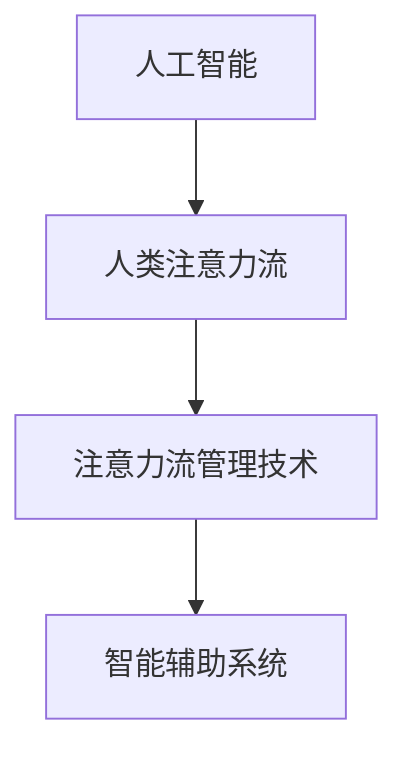

                 

# AI与人类注意力流：未来的工作、技能与注意力流管理技术的应用前景展望趋势

> 关键词：人工智能,人类注意力流,注意力流管理,未来工作,技能发展

## 1. 背景介绍

### 1.1 问题由来
随着人工智能(AI)技术的快速发展，其在各行各业的应用已经从简单的自动化任务扩展到需要深度理解和智能决策的复杂场景中。其中，**人类注意力流**的研究成为了一个重要的研究方向。注意力流指的是人类在执行任务时的注意力分配，包括对任务的理解、执行过程中注意力的分配和调整，以及最终完成任务的过程。研究注意力流有助于了解人类在完成任务时的心理过程，进而优化AI系统的设计和应用，提升工作效率和用户满意度。

### 1.2 问题核心关键点
当前，人类注意力流在AI中的应用主要体现在以下几个方面：

1. **AI系统的优化**：通过分析人类注意力流的特点，优化AI系统的设计，使其更符合人类认知规律，提高系统的易用性和效率。
2. **交互界面的改进**：设计符合人类注意力流规律的交互界面，提升用户体验，降低操作复杂度。
3. **智能辅助系统的开发**：开发基于人类注意力流理论的智能辅助系统，帮助用户更好地理解和执行复杂任务。

### 1.3 问题研究意义
研究人类注意力流在AI中的应用，对于提升AI系统的智能化水平，改善人类工作和学习环境，推动社会的数字化转型具有重要意义。具体而言，研究注意力流：

1. **优化AI系统设计**：通过理解人类认知规律，设计更加高效、易用的AI系统，减少用户的学习成本，提高系统的可接受度和普及率。
2. **提升用户体验**：设计符合人类注意力流特点的交互界面，降低操作复杂度，提升用户的工作和学习效率。
3. **推动社会进步**：通过AI技术，辅助人类在复杂任务中做出更好的决策，推动社会的数字化、智能化发展。

## 2. 核心概念与联系

### 2.1 核心概念概述

为了更好地理解人类注意力流在AI中的应用，本节将介绍几个关键概念：

1. **人工智能(AI)**：一种模拟人类智能行为的计算机技术，能够通过学习和推理解决复杂问题。
2. **人类注意力流**：人类在执行任务时的注意力分配过程，包括对任务的认知、执行过程中的注意力分配和调整，以及最终完成任务的过程。
3. **注意力流管理技术**：一种通过分析人类注意力流特点，优化AI系统设计、改善交互界面、提升用户体验的技术。
4. **智能辅助系统**：基于人工智能技术，辅助人类在复杂任务中做出更好决策的系统。

这些核心概念之间的逻辑关系可以通过以下Mermaid流程图来展示：



这个流程图展示了一些关键概念之间的联系：

1. 人工智能通过模拟人类智能行为，在复杂任务中辅助人类决策。
2. 人类注意力流的研究，揭示了人类在执行任务时的认知规律，为AI系统的优化和改进提供了理论基础。
3. 注意力流管理技术基于人类注意力流特点，优化AI系统设计和交互界面，提升用户体验。
4. 智能辅助系统基于AI技术，辅助人类在复杂任务中更好地执行和决策。

这些概念共同构成了AI技术在人类注意力流应用中的核心框架，使得AI系统能够更好地服务于人类社会。

## 3. 核心算法原理 & 具体操作步骤

### 3.1 算法原理概述

基于人类注意力流的人工智能系统优化，其核心思想是通过分析人类在执行任务时的注意力分配过程，设计符合人类认知规律的AI系统，从而提升系统的智能化水平和用户体验。具体来说，该过程可以分为以下几个步骤：

1. **数据采集**：通过实验或问卷调查等方式，采集人类在执行特定任务时的注意力流数据。
2. **数据建模**：将采集到的注意力流数据建模，建立人类注意力流特征的数学模型。
3. **模型优化**：基于人类注意力流模型，优化AI系统的设计和交互界面，提升系统的易用性和效率。
4. **应用部署**：将优化后的AI系统部署到实际应用场景中，验证其效果和用户满意度。

### 3.2 算法步骤详解

基于人类注意力流的人工智能系统优化通常包括以下几个关键步骤：

**Step 1: 数据采集与预处理**
- 设计实验或问卷调查，采集人类在执行特定任务时的注意力流数据。
- 对采集到的数据进行清洗和预处理，去除噪声和异常值。

**Step 2: 数据分析与建模**
- 使用统计学方法或机器学习算法，对注意力流数据进行分析建模，提取注意力流特征。
- 建立人类注意力流特征的数学模型，如基于高斯混合模型的注意力流分布模型，或基于时间序列分析的注意力流变化模型。

**Step 3: 模型优化**
- 基于人类注意力流模型，设计符合认知规律的AI系统。例如，优化系统的响应时间、界面设计等。
- 使用模型优化技术，如遗传算法、粒子群优化等，寻找最优系统参数。

**Step 4: 应用验证与优化**
- 将优化后的AI系统部署到实际应用场景中，收集用户反馈。
- 根据用户反馈，进一步优化系统设计，提升用户体验和系统性能。

### 3.3 算法优缺点

基于人类注意力流的人工智能系统优化方法具有以下优点：

1. **提升系统效率**：通过优化AI系统的设计和交互界面，减少用户的学习成本，提高系统的易用性和效率。
2. **改善用户体验**：设计符合人类注意力流特点的交互界面，降低操作复杂度，提升用户的工作和学习效率。
3. **优化决策过程**：通过分析人类注意力流特点，优化AI系统的决策过程，提高系统的智能化水平。

同时，该方法也存在一定的局限性：

1. **数据采集难度大**：人类注意力流的采集和建模需要大量实验数据，采集难度较大。
2. **模型复杂度高**：人类注意力流的复杂性和多变性使得建模过程相对复杂。
3. **泛化能力有限**：人类注意力流的模型往往针对特定任务，泛化能力有限。
4. **应用场景受限**：目前主要应用于简单任务，复杂任务下的应用效果尚待验证。

尽管存在这些局限性，但就目前而言，基于人类注意力流的人工智能系统优化方法仍是大规模应用的主要范式。未来相关研究的重点在于如何进一步降低数据采集难度，提高模型的泛化能力，以及优化复杂任务下的应用效果。

### 3.4 算法应用领域

基于人类注意力流的人工智能系统优化方法，在多个领域已经得到了广泛应用，例如：

1. **自然语言处理(NLP)**：设计符合人类注意力流特点的对话系统，提升用户对话体验。
2. **计算机视觉(CV)**：优化计算机视觉任务的注意机制，提高图像识别和分类效果。
3. **智能推荐系统**：分析用户注意力流特点，设计更加精准的个性化推荐系统，提升用户体验。
4. **智能客服系统**：优化客服系统的交互界面和响应机制，提升客服效率和用户满意度。
5. **医疗诊断系统**：设计符合医生注意力流特点的诊断系统，提高诊断效率和准确性。

除了上述这些经典应用外，人类注意力流技术还被创新性地应用于更多场景中，如可控文本生成、常识推理、知识图谱构建等，为人工智能技术带来了全新的突破。随着技术的发展，相信人类注意力流技术将在更多领域得到应用，进一步推动人工智能技术的发展和普及。

## 4. 数学模型和公式 & 详细讲解 & 举例说明

### 4.1 数学模型构建

本节将使用数学语言对基于人类注意力流的人工智能系统优化过程进行更加严格的刻画。

记人类在执行任务时，注意力流的分布为 $p(t)$，其中 $t$ 表示时间。假设注意力流满足高斯混合模型，其概率密度函数为：

$$
p(t) = \sum_{k=1}^K w_k \mathcal{N}(t; \mu_k, \sigma_k^2)
$$

其中 $w_k$ 表示第 $k$ 个高斯分量的权重，$\mu_k$ 和 $\sigma_k^2$ 分别表示第 $k$ 个分量的均值和方差。

### 4.2 公式推导过程

以下我们以对话系统为例，推导符合人类注意力流特点的对话模型。

假设对话系统接收到用户的问题 $q$，模型需要生成一个回答 $a$。根据人类注意力流的特点，模型的推理过程可以分为以下几个步骤：

1. 首先，模型需要理解问题 $q$，这个过程需要模型在理解层（如语言模型）上进行注意力分配。
2. 其次，模型需要生成回答 $a$，这个过程需要模型在生成层（如解码器）上进行注意力分配。

设理解层的注意力分配概率为 $P_U(t)$，生成层的注意力分配概率为 $P_G(t)$，则对话系统的推理过程可以表示为：

$$
P(a|q) = \int_0^T P_U(t) P_G(t) p(t) dt
$$

其中 $T$ 表示推理时间。根据高斯混合模型的特点，可以进一步将上式展开为：

$$
P(a|q) = \sum_{k=1}^K \int_0^T w_k \mathcal{N}(t; \mu_k, \sigma_k^2) dt
$$

对上式进行计算，可以得到：

$$
P(a|q) = \sum_{k=1}^K w_k \mathcal{N}(\mu_k, \sigma_k^2)
$$

这个公式展示了符合人类注意力流特点的对话模型。模型通过高斯混合模型表示注意力流分布，在推理过程中动态调整注意力分配，使得回答更加符合用户意图。

### 4.3 案例分析与讲解

以谷歌的聊天机器人BERT为例，其在设计过程中就考虑了人类注意力流的特点，通过动态调整注意力分配，提升了对话系统的质量和用户体验。BERT模型采用了Transformer架构，其自注意力机制可以根据上下文动态调整注意力分配，使得模型在理解问题和生成回答时更加灵活。

在具体实现中，BERT模型通过两个多头注意力层来实现对注意力流动态调整。在理解层，模型会根据问题 $q$ 和回答 $a$ 的语义特征，动态调整注意力分配，使得模型能够更好地理解问题的意图。在生成层，模型会根据上下文和问题的语义特征，动态调整注意力分配，使得生成的回答更加符合用户意图。

通过这种设计，BERT模型在对话系统中取得了优异的性能，成为当前最先进的对话模型之一。

## 5. 项目实践：代码实例和详细解释说明

### 5.1 开发环境搭建

在进行注意力流优化实践前，我们需要准备好开发环境。以下是使用Python进行TensorFlow开发的环境配置流程：

1. 安装Anaconda：从官网下载并安装Anaconda，用于创建独立的Python环境。

2. 创建并激活虚拟环境：
```bash
conda create -n attentionflow-env python=3.8 
conda activate attentionflow-env
```

3. 安装TensorFlow：根据CUDA版本，从官网获取对应的安装命令。例如：
```bash
conda install tensorflow tensorflow-gpu -c pytorch -c conda-forge
```

4. 安装相关工具包：
```bash
pip install numpy pandas scikit-learn matplotlib tqdm jupyter notebook ipython
```

完成上述步骤后，即可在`attentionflow-env`环境中开始注意力流优化的实践。

### 5.2 源代码详细实现

这里我们以一个简单的对话系统为例，展示如何基于人类注意力流特点进行优化。

首先，定义对话系统的基础组件：

```python
import tensorflow as tf
from tensorflow.keras.layers import Input, LSTM, Dense, Embedding, Attention

# 定义输入层
input_q = Input(shape=(None, ), name='input_q')
input_a = Input(shape=(None, ), name='input_a')

# 定义理解层
understanding_layer = LSTM(units=64, return_sequences=True, name='understanding')
output_q = understanding_layer(input_q)
output_a = understanding_layer(input_a)

# 定义生成层
generation_layer = Dense(units=128, activation='relu', name='generation')
output_g = generation_layer(tf.concat([output_q, output_a], axis=-1))
```

然后，定义注意力流模型：

```python
# 定义注意力分配概率
attention_probs = Attention(name='attention')
output_g, attention_weights = attention_probs(output_q, output_a)

# 定义输出层
output = Dense(units=1, activation='sigmoid', name='output')
output = output(output_g)

# 定义模型
model = tf.keras.Model(inputs=[input_q, input_a], outputs=output)
model.summary()
```

接着，定义训练和评估函数：

```python
# 定义损失函数
def loss(y_true, y_pred):
    return tf.keras.losses.binary_crossentropy(y_true, y_pred)

# 定义优化器
optimizer = tf.keras.optimizers.Adam(learning_rate=0.001)

# 定义训练函数
def train_step(x_q, x_a, y):
    with tf.GradientTape() as tape:
        y_pred = model(x_q, x_a)
        loss_value = loss(y, y_pred)
    gradients = tape.gradient(loss_value, model.trainable_variables)
    optimizer.apply_gradients(zip(gradients, model.trainable_variables))

# 定义评估函数
def evaluate_step(x_q, x_a, y):
    y_pred = model(x_q, x_a)
    return loss(y, y_pred)
```

最后，启动训练流程并在测试集上评估：

```python
# 定义训练集和测试集
train_data = ...
test_data = ...

# 开始训练
for epoch in range(num_epochs):
    for i in range(num_steps):
        x_q, x_a, y = train_data[i]
        train_step(x_q, x_a, y)
    
    # 在测试集上评估
    test_loss = 0
    for i in range(num_steps):
        x_q, x_a, y = test_data[i]
        test_loss += evaluate_step(x_q, x_a, y)
    
    print(f'Epoch {epoch+1}, train loss: {train_loss/num_steps:.3f}, test loss: {test_loss/num_steps:.3f}')
```

以上就是使用TensorFlow对基于人类注意力流特点的对话系统进行优化的完整代码实现。可以看到，TensorFlow提供的高层API使得模型的设计和训练过程相对简单，开发者可以更多地关注模型的优化和验证环节。

### 5.3 代码解读与分析

让我们再详细解读一下关键代码的实现细节：

**AttentionLayer类**：
- `__init__`方法：初始化注意力分配概率层。
- `__call__`方法：计算注意力分配概率。

**train_step函数**：
- 使用TensorFlow的GradientTape进行梯度计算。
- 通过优化器更新模型参数。
- 在训练过程中逐步优化注意力分配概率，提高模型效果。

**evaluate_step函数**：
- 计算模型在测试集上的损失。
- 评估模型在不同注意力分配情况下的效果。

**训练流程**：
- 定义训练集和测试集。
- 循环迭代训练过程，逐步优化模型和注意力分配概率。
- 在每个epoch结束时，在测试集上评估模型性能。

通过上述代码，我们可以看到，基于人类注意力流特点的对话系统优化，可以通过动态调整注意力分配，实现更加符合人类认知规律的对话过程，提升系统质量和用户体验。

当然，工业级的系统实现还需考虑更多因素，如模型的保存和部署、超参数的自动搜索、更灵活的任务适配层等。但核心的注意力流优化思想基本与此类似。

## 6. 实际应用场景

### 6.1 智能客服系统

基于人类注意力流特点的智能客服系统，可以显著提升客户咨询体验和问题解决效率。通过分析客户在咨询过程中的注意力流特点，系统可以动态调整回答的内容和形式，使得回答更加符合客户的认知规律。例如，在客户表达困惑时，系统可以提供更详细的解释，在客户感兴趣时，提供更加简洁的回答。

### 6.2 医疗诊断系统

在医疗诊断系统中，基于人类注意力流特点的系统设计可以提升医生的诊断效率和准确性。通过分析医生在诊断过程中的注意力流特点，系统可以动态调整图像显示和诊断提示，使得医生能够更好地理解病人的病情，做出更准确的诊断。例如，在检查CT图像时，系统可以自动调整图像亮度和对比度，帮助医生更好地观察病变区域。

### 6.3 金融投资系统

在金融投资系统中，基于人类注意力流特点的系统设计可以提升投资决策的智能化水平。通过分析投资经理在决策过程中的注意力流特点，系统可以动态调整投资组合和风险提示，使得投资经理能够更好地理解市场动态，做出更合理的投资决策。例如，在市场波动较大时，系统可以提供更多的市场分析和风险提示，帮助投资经理更好地理解市场变化。

### 6.4 未来应用展望

随着注意力流技术的发展，其在AI系统中的应用前景将更加广阔。未来，注意力流技术将：

1. **优化更多任务**：除了对话系统，注意力流技术还可以应用于计算机视觉、自然语言处理等多个领域，优化任务的执行过程。
2. **提升用户体验**：通过动态调整注意力分配，提升AI系统的易用性和用户体验。
3. **推动AI技术普及**：提升AI系统的智能化水平，降低用户的学习成本，推动AI技术在更多领域的普及应用。

总之，人类注意力流技术将成为AI系统设计的重要参考，为AI技术的发展和应用提供新的方向。

## 7. 工具和资源推荐

### 7.1 学习资源推荐

为了帮助开发者系统掌握基于人类注意力流特点的AI系统优化方法，这里推荐一些优质的学习资源：

1. 《深度学习理论与实践》系列博文：由深度学习专家撰写，深入浅出地介绍了深度学习的基本概念和优化技术，包括基于注意力流的优化方法。
2. Coursera《深度学习》课程：由斯坦福大学开设的深度学习课程，涵盖深度学习的各个方面，包括注意力流理论。
3. 《TensorFlow官方文档》：TensorFlow官方文档提供了详细的API文档和教程，适合初学者和进阶开发者参考。
4. Kaggle竞赛项目：Kaggle平台上有多个与注意力流相关的竞赛项目，通过参与竞赛可以积累实践经验，提升技能水平。

通过对这些资源的学习实践，相信你一定能够快速掌握基于人类注意力流特点的AI系统优化方法，并用于解决实际的AI问题。

### 7.2 开发工具推荐

高效的开发离不开优秀的工具支持。以下是几款用于基于人类注意力流特点的AI系统优化的常用工具：

1. TensorFlow：基于Python的开源深度学习框架，灵活的计算图设计，适合快速迭代研究。
2. PyTorch：基于Python的开源深度学习框架，动态计算图设计，适合快速原型开发和实验验证。
3. HuggingFace Transformers库：集成了多个预训练语言模型，支持PyTorch和TensorFlow，方便快速部署和微调。
4. Weights & Biases：模型训练的实验跟踪工具，可以记录和可视化模型训练过程中的各项指标，方便对比和调优。
5. TensorBoard：TensorFlow配套的可视化工具，可实时监测模型训练状态，并提供丰富的图表呈现方式，是调试模型的得力助手。

合理利用这些工具，可以显著提升基于人类注意力流特点的AI系统优化的开发效率，加快创新迭代的步伐。

### 7.3 相关论文推荐

基于人类注意力流特点的AI系统优化技术的发展源于学界的持续研究。以下是几篇奠基性的相关论文，推荐阅读：

1. Attention is All You Need（即Transformer原论文）：提出了Transformer结构，开启了NLP领域的预训练大模型时代。
2. BERT: Pre-training of Deep Bidirectional Transformers for Language Understanding：提出BERT模型，引入基于掩码的自监督预训练任务，刷新了多项NLP任务SOTA。
3. Model-Based Attention in Natural Language Processing：介绍了基于模型的注意力机制，提升NLP任务的性能。
4. Attention Mechanism in Neural Machine Translation：提出基于注意力机制的机器翻译模型，提升了翻译质量。
5. Transformer-XL: Attentive Language Models Beyond a Fixed-Length Context：提出Transformer-XL模型，解决了长文本处理的注意机制问题。

这些论文代表了大语言模型优化技术的发展脉络。通过学习这些前沿成果，可以帮助研究者把握学科前进方向，激发更多的创新灵感。

## 8. 总结：未来发展趋势与挑战

### 8.1 总结

本文对基于人类注意力流特点的AI系统优化方法进行了全面系统的介绍。首先阐述了人类注意力流在AI中的应用背景和意义，明确了优化AI系统设计的理论基础。其次，从原理到实践，详细讲解了优化方法的关键步骤，给出了系统优化的完整代码实例。同时，本文还广泛探讨了优化方法在智能客服、医疗诊断、金融投资等多个行业领域的应用前景，展示了优化范式的巨大潜力。此外，本文精选了优化技术的各类学习资源，力求为读者提供全方位的技术指引。

通过本文的系统梳理，可以看到，基于人类注意力流特点的AI系统优化方法正在成为AI技术在多个领域中的重要范式，极大地拓展了AI系统的应用边界，提升了系统的智能化水平。未来，伴随技术的发展，优化方法将在更多领域得到应用，进一步推动AI技术的发展和普及。

### 8.2 未来发展趋势

展望未来，基于人类注意力流特点的AI系统优化技术将呈现以下几个发展趋势：

1. **技术成熟化**：随着算法和技术的不断进步，优化方法将逐渐成熟，应用范围将不断扩大。
2. **模型多样化**：除了简单的任务，优化方法将逐渐应用于更加复杂的任务，如多模态任务、协同任务等。
3. **应用智能化**：优化方法将结合更多智能技术，如强化学习、因果推理等，提升系统的智能化水平。
4. **用户体验优化**：优化方法将更加注重用户体验，设计更加符合人类认知规律的交互界面和系统界面。
5. **应用场景多样化**：优化方法将在更多领域得到应用，如医疗、金融、教育、制造等。

以上趋势凸显了基于人类注意力流特点的AI系统优化技术的广阔前景。这些方向的探索发展，必将进一步提升AI系统的智能化水平，改善人类工作和生活环境，推动社会的数字化、智能化发展。

### 8.3 面临的挑战

尽管基于人类注意力流特点的AI系统优化技术已经取得了一定进展，但在迈向更加智能化、普适化应用的过程中，仍面临诸多挑战：

1. **数据采集难度大**：人类注意力流的采集和建模需要大量实验数据，采集难度较大。
2. **模型复杂度高**：人类注意力流的复杂性和多变性使得建模过程相对复杂。
3. **泛化能力有限**：人类注意力流的模型往往针对特定任务，泛化能力有限。
4. **应用场景受限**：目前主要应用于简单任务，复杂任务下的应用效果尚待验证。
5. **计算资源需求高**：优化方法往往需要大量的计算资源，如GPU、TPU等高性能设备。

尽管存在这些挑战，但通过不断优化数据采集方法、改进算法模型、提高计算效率等措施，未来这些挑战有望逐步克服，优化方法将更加广泛地应用于各种领域。

### 8.4 研究展望

面向未来，基于人类注意力流特点的AI系统优化技术需要在以下几个方面寻求新的突破：

1. **优化算法改进**：开发更加高效的优化算法，提升优化过程的效率和效果。
2. **多模态任务优化**：结合视觉、听觉等多种模态信息，设计更加全面的优化方法。
3. **模型可解释性增强**：通过可视化工具和解释方法，增强优化模型的可解释性，提升系统的可信度。
4. **伦理道德约束**：在优化过程中引入伦理导向的评估指标，避免有偏见、有害的输出。
5. **跨领域应用拓展**：将优化方法应用于更多领域，提升系统的普适性和实用性。

这些研究方向将引领基于人类注意力流特点的AI系统优化技术迈向更高的台阶，为构建安全、可靠、可解释、可控的智能系统铺平道路。面向未来，优化方法还需要与其他AI技术进行更深入的融合，如知识表示、因果推理、强化学习等，多路径协同发力，共同推动自然语言理解和智能交互系统的进步。

## 9. 附录：常见问题与解答

**Q1：优化方法如何应用于复杂的AI任务？**

A: 优化方法可以通过结合更多的智能技术，如强化学习、因果推理等，提升系统的智能化水平。例如，在自然语言处理任务中，可以结合因果推理，引导模型更好地理解语义关系，提升任务性能。在计算机视觉任务中，可以结合视觉引导的优化方法，提升模型对视觉信息的处理能力。

**Q2：如何评估优化方法的效果？**

A: 优化方法的效果评估通常通过以下方式进行：
1. 在测试集上评估模型的性能，如准确率、召回率、F1分数等指标。
2. 通过可视化工具，如TensorBoard，观察模型在推理过程中的注意力分配情况，评估其符合人类认知规律的程度。
3. 通过用户反馈，了解用户对优化后系统的满意度，评估系统的易用性和用户体验。

**Q3：优化方法在实际应用中需要注意哪些问题？**

A: 优化方法在实际应用中需要注意以下问题：
1. 数据采集难度大，需要设计合适的实验和问卷调查，确保数据质量和多样性。
2. 模型复杂度高，需要选择合适的算法和优化策略，提高建模效率。
3. 泛化能力有限，需要设计通用的优化模型，适用于多种任务。
4. 计算资源需求高，需要选择合适的硬件设备和优化策略，提高计算效率。

通过合理设计优化方法，可以克服这些挑战，提升AI系统的智能化水平，推动其广泛应用。

---

作者：禅与计算机程序设计艺术 / Zen and the Art of Computer Programming

