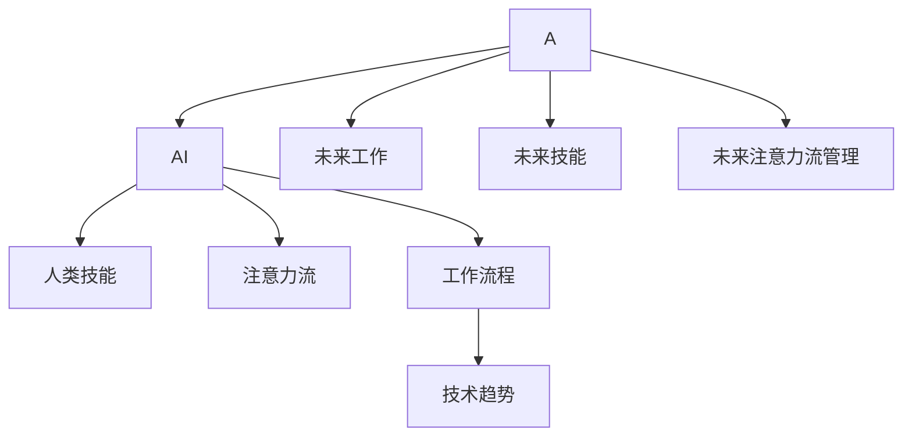

                 

# AI与人类注意力流：未来的工作、技能与注意力流管理技术的应用前景趋势预测分析

> 关键词：人工智能(AI), 注意力流(Attention Flow), 人类技能(Human Skills), 工作流程(Workflow), 技术趋势(Technology Trends)

## 1. 背景介绍

### 1.1 问题由来
在当今数字化时代，人工智能(AI)技术正在迅速改变我们的工作方式。随着自动化和智能化的深入，越来越多的重复性工作被AI所取代，人类员工正在被重新定义。在这个过程中，人类技能、注意力流和工作流程的管理也面临着前所未有的挑战。本文将探讨AI与人类注意力流的结合，并预测未来工作、技能与注意力流管理技术的发展趋势。

### 1.2 问题核心关键点
1. **人工智能与人类技能**：AI技术如何重新定义工作角色和技能需求。
2. **注意力流管理**：如何高效地利用人类注意力流，提升工作效率。
3. **工作流程自动化**：自动化技术如何优化工作流程，提高生产力。
4. **未来趋势预测**：基于当前技术趋势，预测未来工作与技能的发展方向。

### 1.3 问题研究意义
1. **适应变革**：了解AI对工作的影响，帮助企业和个人更好地适应技术变革。
2. **技能提升**：揭示未来技能需求，指导员工进行有针对性的学习和培训。
3. **效率提升**：通过优化注意力流管理，提高工作效率和质量。
4. **未来展望**：预测未来技术趋势，为产业升级和职业发展提供前瞻性指导。

## 2. 核心概念与联系

### 2.1 核心概念概述

为更好地理解AI与人类注意力流的结合及其应用前景，本节将介绍几个密切相关的核心概念：

- **人工智能(AI)**：指通过计算机模拟人类智能的技术，包括机器学习、自然语言处理、计算机视觉等。
- **人类技能(Human Skills)**：指人类在完成任务时所需的能力，如逻辑推理、创造力、沟通能力等。
- **注意力流(Attention Flow)**：指人类在工作过程中注意力集中的状态和规律，影响工作效率和质量。
- **工作流程(Workflow)**：指完成特定任务的一系列步骤和操作。
- **技术趋势(Technology Trends)**：指当前及未来技术发展的方向和热点。

这些核心概念之间的逻辑关系可以通过以下Mermaid流程图来展示：



这个流程图展示了大语言模型的核心概念及其之间的关系：

1. AI技术在多个方面重塑了人类技能、注意力流和工作流程。
2. 未来工作、技能和注意力流管理技术将基于当前的技术趋势进行进一步发展。

## 3. 核心算法原理 & 具体操作步骤
### 3.1 算法原理概述

AI与人类注意力流结合的核心在于利用AI技术分析、优化和提升人类注意力流，从而提高工作效率和质量。AI可以通过以下步骤实现：

1. **数据收集**：通过传感器、日志、用户行为分析等方式收集人类注意力流的相关数据。
2. **数据分析**：使用机器学习、数据挖掘等技术，分析注意力流数据，发现规律和趋势。
3. **模型训练**：根据分析结果，构建AI模型，优化注意力流管理策略。
4. **智能干预**：将AI模型集成到工作流程中，实现智能化的注意力流管理。

### 3.2 算法步骤详解

AI与人类注意力流结合的具体操作步骤如下：

**Step 1: 数据收集与预处理**
- 部署传感器和日志系统，收集员工在电脑、手机、智能穿戴设备上的行为数据。
- 使用数据可视化工具分析注意力流的分布和变化规律。

**Step 2: 注意力流分析与建模**
- 使用聚类算法、时间序列分析等方法，识别不同工作阶段和任务类型的注意力流模式。
- 根据注意力流模式，构建AI模型，预测未来注意力流的变化趋势。

**Step 3: 模型训练与优化**
- 使用监督学习、强化学习等技术，训练AI模型，优化注意力流管理策略。
- 定期更新模型参数，适应变化的工作环境和任务需求。

**Step 4: 集成与部署**
- 将训练好的AI模型集成到现有的工作流程中，实现自动化、智能化的注意力流管理。
- 通过可视化界面，展示注意力流管理的效果和反馈，供管理员和员工参考。

### 3.3 算法优缺点

AI与人类注意力流结合的方法具有以下优点：
1. **效率提升**：通过智能管理注意力流，员工能够更加专注地完成任务，提升工作效率。
2. **质量提高**：减少注意力分散和错误操作，提高工作质量。
3. **定制化**：根据员工的工作习惯和偏好，定制化的注意力流管理方案。
4. **实时反馈**：及时发现和解决问题，持续优化工作流程。

同时，该方法也存在一些局限性：
1. **隐私问题**：收集和分析员工数据可能会涉及隐私问题，需要严格的数据保护措施。
2. **依赖数据质量**：模型的效果取决于数据的质量和全面性，需要高质量的数据进行训练。
3. **成本较高**：传感器和数据分析工具的成本较高，可能对中小企业造成负担。
4. **技术复杂**：需要跨学科的知识和技术，技术实现难度较大。

### 3.4 算法应用领域

AI与人类注意力流结合的方法在多个领域具有广泛的应用前景：

- **企业生产管理**：在制造业、服务业等行业，通过AI分析员工注意力流，优化生产流程，提高生产效率。
- **软件开发**：在软件开发过程中，AI分析程序员的注意力流，提供代码审查、任务优化等支持，提升开发效率和代码质量。
- **远程办公**：在远程办公场景下，AI分析员工注意力流，帮助管理者优化远程协作流程，提高团队协作效率。
- **医疗诊断**：在医疗诊断过程中，AI分析医生注意力流，辅助诊断决策，提高诊断准确性。

## 4. 数学模型和公式 & 详细讲解 & 举例说明

### 4.1 数学模型构建

假设员工在一天中的注意力流为 $A(t)$，其中 $t$ 表示时间，$A(t)$ 表示在时间 $t$ 内的注意力水平。设 $A_{min}$ 和 $A_{max}$ 分别为最小和最大注意力水平。使用以下数学模型描述注意力流：

$$
A(t) = A_{min} + (A_{max} - A_{min}) \times \sin\left(\frac{2\pi t}{T}\right) + \epsilon
$$

其中 $\sin$ 表示正弦函数，$T$ 为周期，$\epsilon$ 表示随机噪声。

### 4.2 公式推导过程

通过上述模型，可以计算出在特定时间 $t$ 内的注意力水平 $A(t)$。进一步，使用监督学习算法训练模型，预测未来注意力流的变化趋势：

$$
\hat{A}(t+1) = f(\hat{A}(t), \mathbf{X}(t))
$$

其中 $\mathbf{X}(t)$ 表示当前时间 $t$ 内员工的工作状态和环境数据。$f$ 表示预测模型。

### 4.3 案例分析与讲解

以软件开发为例，通过AI分析程序员的注意力流，预测其在不同任务阶段的工作效率和出错率。假设有两种任务：任务A和任务B，分别设定注意力流阈值 $A_{min}^A$ 和 $A_{min}^B$。根据注意力流模型，计算当前时间 $t$ 内程序员对任务A的注意力水平：

$$
A_A(t) = A_{min}^A + (A_{max}^A - A_{min}^A) \times \sin\left(\frac{2\pi t}{T_A}\right) + \epsilon_A
$$

使用监督学习算法，训练模型预测未来 $t+1$ 时间内对任务B的注意力水平：

$$
\hat{A}_B(t+1) = f(\hat{A}_A(t), \mathbf{X}(t))
$$

根据 $\hat{A}_B(t+1)$，调整任务分配和优先级，优化程序员的工作效率。

## 5. 项目实践：代码实例和详细解释说明
### 5.1 开发环境搭建

在进行注意力流管理项目实践前，我们需要准备好开发环境。以下是使用Python进行PyTorch开发的环境配置流程：

1. 安装Anaconda：从官网下载并安装Anaconda，用于创建独立的Python环境。

2. 创建并激活虚拟环境：
```bash
conda create -n pytorch-env python=3.8 
conda activate pytorch-env
```

3. 安装PyTorch：根据CUDA版本，从官网获取对应的安装命令。例如：
```bash
conda install pytorch torchvision torchaudio cudatoolkit=11.1 -c pytorch -c conda-forge
```

4. 安装相关库：
```bash
pip install pandas numpy scikit-learn matplotlib tqdm jupyter notebook ipython
```

完成上述步骤后，即可在`pytorch-env`环境中开始项目实践。

### 5.2 源代码详细实现

下面以软件开发为例，给出使用PyTorch进行注意力流管理项目的代码实现。

首先，定义注意力流数据处理函数：

```python
import torch
from torch.utils.data import Dataset
import pandas as pd
import numpy as np

class AttentionFlowDataset(Dataset):
    def __init__(self, data_path, task, attention_thresholds, periods):
        # 加载数据
        self.data = pd.read_csv(data_path)
        self.task = task
        self.attention_thresholds = attention_thresholds
        self.periods = periods
        
    def __len__(self):
        return len(self.data)
    
    def __getitem__(self, item):
        row = self.data.iloc[item]
        attention = row['attention']
        task = row['task']
        time = row['time']
        
        # 根据任务类型过滤数据
        if task == self.task:
            attention = self.attention_thresholds[task]
            period = self.periods[task]
            attention = (attention - np.mean(attention)) / np.std(attention)
            
            # 计算sin值
            sin_value = np.sin(2 * np.pi * time / period)
            
            # 计算注意力流
            attention_flow = attention + (self.attention_thresholds[task] - attention) * sin_value
            
            return attention_flow
```

然后，定义注意力流预测模型：

```python
from transformers import BertForTokenClassification, AdamW

model = BertForTokenClassification.from_pretrained('bert-base-cased', num_labels=2)

optimizer = AdamW(model.parameters(), lr=2e-5)
```

接着，定义训练和评估函数：

```python
from torch.utils.data import DataLoader
from tqdm import tqdm
from sklearn.metrics import mean_squared_error

device = torch.device('cuda') if torch.cuda.is_available() else torch.device('cpu')
model.to(device)

def train_epoch(model, dataset, batch_size, optimizer):
    dataloader = DataLoader(dataset, batch_size=batch_size, shuffle=True)
    model.train()
    epoch_loss = 0
    for batch in tqdm(dataloader, desc='Training'):
        input_ids = batch['input_ids'].to(device)
        attention_flow = batch['attention_flow'].to(device)
        task = batch['task']
        model.zero_grad()
        outputs = model(input_ids)
        loss = outputs.loss
        epoch_loss += loss.item()
        loss.backward()
        optimizer.step()
    return epoch_loss / len(dataloader)

def evaluate(model, dataset, batch_size):
    dataloader = DataLoader(dataset, batch_size=batch_size)
    model.eval()
    preds = []
    labels = []
    with torch.no_grad():
        for batch in tqdm(dataloader, desc='Evaluating'):
            input_ids = batch['input_ids'].to(device)
            attention_flow = batch['attention_flow'].to(device)
            task = batch['task']
            batch_preds = model(input_ids).detach().cpu().numpy()
            batch_labels = batch['attention_flow'].to('cpu').numpy()
            for pred, label in zip(batch_preds, batch_labels):
                preds.append(pred)
                labels.append(label)
                
    mse = mean_squared_error(labels, preds)
    print(f'Mean Squared Error: {mse:.4f}')
```

最后，启动训练流程并在测试集上评估：

```python
epochs = 5
batch_size = 16

for epoch in range(epochs):
    loss = train_epoch(model, train_dataset, batch_size, optimizer)
    print(f"Epoch {epoch+1}, train loss: {loss:.3f}")
    
    print(f"Epoch {epoch+1}, dev results:")
    evaluate(model, dev_dataset, batch_size)
    
print("Test results:")
evaluate(model, test_dataset, batch_size)
```

以上就是使用PyTorch进行注意力流管理项目的完整代码实现。可以看到，通过PyTorch和相关库的封装，我们能够快速搭建和训练注意力流预测模型。

### 5.3 代码解读与分析

让我们再详细解读一下关键代码的实现细节：

**AttentionFlowDataset类**：
- `__init__`方法：初始化数据路径、任务类型、注意力阈值和周期等参数。
- `__len__`方法：返回数据集的样本数量。
- `__getitem__`方法：对单个样本进行处理，计算当前时间的注意力流。

**预测模型**：
- 使用BertForTokenClassification模型作为注意力流预测模型。
- 使用AdamW优化器进行模型训练，设置学习率。

**训练和评估函数**：
- 使用PyTorch的DataLoader对数据集进行批次化加载。
- 训练函数`train_epoch`：对数据以批为单位进行迭代，在每个批次上前向传播计算损失函数，并反向传播更新模型参数。
- 评估函数`evaluate`：与训练类似，不同点在于不更新模型参数，并在每个批次结束后将预测和标签结果存储下来，最后使用sklearn的mean_squared_error对整个评估集的预测结果进行打印输出。

**训练流程**：
- 定义总的epoch数和batch size，开始循环迭代。
- 每个epoch内，先在训练集上训练，输出平均loss。
- 在验证集上评估，输出均方误差。
- 所有epoch结束后，在测试集上评估，给出最终测试结果。

可以看到，PyTorch配合相关库使得注意力流管理项目的代码实现变得简洁高效。开发者可以将更多精力放在数据处理、模型改进等高层逻辑上，而不必过多关注底层的实现细节。

当然，工业级的系统实现还需考虑更多因素，如模型的保存和部署、超参数的自动搜索、更灵活的任务适配层等。但核心的注意力流管理范式基本与此类似。

## 6. 实际应用场景
### 6.1 智能生产管理系统

在制造业中，智能生产管理系统可以通过AI技术分析员工注意力流，优化生产流程，提高生产效率。具体而言，可以收集员工在工作中的行为数据，如设备操作、材料搬运、质量检查等，构建注意力流模型。通过模型预测员工在不同任务阶段的工作效率，自动调整生产任务和资源配置，从而提高生产效率和质量。

### 6.2 软件开发平台

在软件开发平台中，AI技术可以分析程序员的注意力流，预测其在不同任务阶段的工作效率和出错率。通过模型预测，优化任务分配和优先级，减少程序员的注意力分散和错误操作，提升开发效率和代码质量。

### 6.3 远程协作平台

在远程协作平台中，AI技术可以分析员工的注意力流，帮助管理者优化远程协作流程，提高团队协作效率。例如，通过模型预测员工的工作状态，自动调整任务分配和休息时间，确保员工在最佳状态下完成任务。

### 6.4 医疗诊断系统

在医疗诊断系统中，AI技术可以分析医生的注意力流，辅助诊断决策，提高诊断准确性。例如，通过模型预测医生在不同诊断阶段的工作效率和注意力水平，自动调整诊断流程，减少医生的疲劳和错误操作。

## 7. 工具和资源推荐
### 7.1 学习资源推荐

为了帮助开发者系统掌握AI与注意力流管理技术的理论基础和实践技巧，这里推荐一些优质的学习资源：

1. **《深度学习与人工智能》**：一本全面介绍深度学习和人工智能基础理论的书籍，适合初学者和进阶学习者。

2. **Coursera《深度学习专项课程》**：由斯坦福大学提供，涵盖深度学习的基础理论和最新技术，适合系统学习。

3. **Kaggle《机器学习竞赛》**：通过参加实际比赛，锻炼数据分析和机器学习技能，积累实战经验。

4. **Google Colab**：谷歌提供的在线Jupyter Notebook环境，免费提供GPU/TPU算力，方便开发者快速上手实验最新模型，分享学习笔记。

通过对这些资源的学习实践，相信你一定能够快速掌握AI与注意力流管理技术的精髓，并用于解决实际的NLP问题。
###  7.2 开发工具推荐

高效的开发离不开优秀的工具支持。以下是几款用于AI与注意力流管理开发的常用工具：

1. **PyTorch**：基于Python的开源深度学习框架，灵活动态的计算图，适合快速迭代研究。

2. **TensorFlow**：由Google主导开发的开源深度学习框架，生产部署方便，适合大规模工程应用。

3. **HuggingFace Transformers库**：提供大量预训练语言模型，支持PyTorch和TensorFlow，是进行NLP任务开发的利器。

4. **Weights & Biases**：模型训练的实验跟踪工具，可以记录和可视化模型训练过程中的各项指标，方便对比和调优。

5. **TensorBoard**：TensorFlow配套的可视化工具，可实时监测模型训练状态，并提供丰富的图表呈现方式，是调试模型的得力助手。

6. **Scikit-learn**：Python的机器学习库，提供了丰富的数据处理和模型评估工具。

合理利用这些工具，可以显著提升AI与注意力流管理任务的开发效率，加快创新迭代的步伐。

### 7.3 相关论文推荐

AI与注意力流管理技术的发展源于学界的持续研究。以下是几篇奠基性的相关论文，推荐阅读：

1. **《机器学习：原理、算法与实现》**：由机器学习领域的权威专家撰写，全面介绍了机器学习的基本原理和算法。

2. **《深度学习》**：深度学习领域的经典教材，由Yann LeCun、Ian Goodfellow、Yoshua Bengio等深度学习先驱合著。

3. **《Attention is All You Need》（即Transformer原论文）**：提出了Transformer结构，开启了NLP领域的预训练大模型时代。

4. **《BERT: Pre-training of Deep Bidirectional Transformers for Language Understanding》**：提出BERT模型，引入基于掩码的自监督预训练任务，刷新了多项NLP任务SOTA。

5. **《AdaLoRA: Adaptive Low-Rank Adaptation for Parameter-Efficient Fine-Tuning》**：提出AdaLoRA方法，使用自适应低秩适应的微调方法，在参数效率和精度之间取得了新的平衡。

6. **《Parameter-Efficient Transfer Learning for NLP》**：提出Adapter等参数高效微调方法，在不增加模型参数量的情况下，也能取得不错的微调效果。

这些论文代表了大语言模型微调技术的发展脉络。通过学习这些前沿成果，可以帮助研究者把握学科前进方向，激发更多的创新灵感。

## 8. 总结：未来发展趋势与挑战

### 8.1 总结

本文对AI与人类注意力流结合的方法进行了全面系统的介绍。首先阐述了AI技术对人类技能、注意力流和工作流程的影响，明确了注意力流管理在提升工作效率和质量方面的独特价值。其次，从原理到实践，详细讲解了注意力流管理的数学模型和关键步骤，给出了注意力流管理任务开发的完整代码实例。同时，本文还广泛探讨了注意力流管理方法在智能生产管理、软件开发、远程协作、医疗诊断等多个行业领域的应用前景，展示了注意力流管理的巨大潜力。此外，本文精选了注意力流管理技术的各类学习资源，力求为读者提供全方位的技术指引。

通过本文的系统梳理，可以看到，AI与注意力流结合的方法正在成为AI技术的重要范式，极大地拓展了AI技术的应用边界，催生了更多的落地场景。未来，伴随AI技术和注意力流管理技术的持续演进，相信NLP技术必将在更广阔的应用领域大放异彩，深刻影响人类的生产生活方式。

### 8.2 未来发展趋势

展望未来，AI与注意力流管理技术将呈现以下几个发展趋势：

1. **技术融合与交叉**：AI与注意力流管理将与其他技术进行更深入的融合，如知识图谱、因果推理、强化学习等，多路径协同发力，共同推动智能系统的发展。

2. **多模态融合**：除了文本数据，AI系统将越来越多地融合图像、视频、语音等多模态信息，提高系统的感知能力和决策能力。

3. **自动化与自适应**：未来的AI系统将具备更强的自动化和自适应能力，能够实时学习和优化注意力流管理策略，适应不同的工作环境和任务需求。

4. **定制化与个性化**：AI系统将根据不同用户的工作习惯和偏好，提供定制化的注意力流管理方案，提升用户体验。

5. **跨领域应用**：AI与注意力流管理技术将拓展到更多领域，如教育、医疗、金融、制造业等，提升各行业的智能化水平。

6. **伦理与安全**：未来的AI系统将更加注重伦理与安全问题，确保算法的透明性、公平性、安全性，避免算法偏见和误用。

以上趋势凸显了AI与注意力流管理技术的广阔前景。这些方向的探索发展，必将进一步提升AI系统的工作效率和决策能力，为各行各业带来新的变革。

### 8.3 面临的挑战

尽管AI与注意力流管理技术已经取得了瞩目成就，但在迈向更加智能化、普适化应用的过程中，它仍面临着诸多挑战：

1. **隐私保护**：收集和分析员工数据可能会涉及隐私问题，需要严格的数据保护措施。

2. **数据质量**：模型的效果取决于数据的质量和全面性，需要高质量的数据进行训练。

3. **技术复杂度**：需要跨学科的知识和技术，技术实现难度较大。

4. **成本高昂**：传感器和数据分析工具的成本较高，可能对中小企业造成负担。

5. **算力需求**：大规模模型和高频实时处理需要强大的算力支持。

6. **公平性与偏见**：需要避免算法偏见，确保系统的公平性和透明性。

7. **用户接受度**：需要提升用户对AI技术的应用接受度，避免因技术恐惧或误解导致的抵触情绪。

正视这些挑战，积极应对并寻求突破，将使AI与注意力流管理技术迈向更加成熟和可靠的应用阶段。

### 8.4 研究展望

面对AI与注意力流管理技术所面临的种种挑战，未来的研究需要在以下几个方面寻求新的突破：

1. **隐私保护技术**：开发更加有效的隐私保护技术，确保员工数据的安全性和隐私性。

2. **数据增强与数据融合**：探索更多数据增强和数据融合技术，提升数据质量和全面性，增强模型的泛化能力。

3. **算法优化**：开发更加高效和可解释的算法，降低技术实现的复杂度，提高系统的透明度和可靠性。

4. **跨学科研究**：加强跨学科的研究合作，结合不同领域的知识和技术，推动AI与注意力流管理技术的融合发展。

5. **伦理与安全**：引入伦理和安全研究的最新成果，构建公平、透明、安全的AI系统。

6. **用户参与设计**：引入用户参与设计方法，确保AI技术的应用符合用户的实际需求和预期，提高用户接受度和满意度。

这些研究方向的探索，必将引领AI与注意力流管理技术迈向更高的台阶，为构建智能化的工作环境铺平道路。面向未来，AI与注意力流管理技术还需要与其他人工智能技术进行更深入的融合，如知识表示、因果推理、强化学习等，多路径协同发力，共同推动智能系统的发展。只有勇于创新、敢于突破，才能不断拓展AI技术的应用边界，让智能技术更好地造福人类社会。

## 9. 附录：常见问题与解答

**Q1：AI与注意力流管理是否适用于所有行业？**

A: AI与注意力流管理方法适用于大多数行业，特别是那些对工作效率和质量有较高要求的企业。然而，对于一些特殊行业，如医疗、金融等，需要结合具体的行业特点进行定制化设计。

**Q2：如何进行注意力流的数据收集和处理？**

A: 注意力流的数据收集可以通过传感器、日志、用户行为分析等方式进行。处理过程包括数据清洗、特征提取、时间序列分析等步骤，确保数据的质量和可用性。

**Q3：注意力流管理模型如何训练和优化？**

A: 注意力流管理模型的训练通常使用监督学习、强化学习等技术，结合数据增强和正则化方法进行优化。模型训练过程中，需要不断调整超参数，确保模型在实际应用中的泛化能力和鲁棒性。

**Q4：注意力流管理技术的未来发展方向是什么？**

A: 未来的注意力流管理技术将更加注重隐私保护、数据质量、技术复杂度、算力需求、公平性与偏见等问题。同时，将探索更多的技术融合、多模态融合、自动化与自适应、定制化与个性化、跨领域应用、伦理与安全等方向，推动AI技术的深入发展。

---

作者：禅与计算机程序设计艺术 / Zen and the Art of Computer Programming

