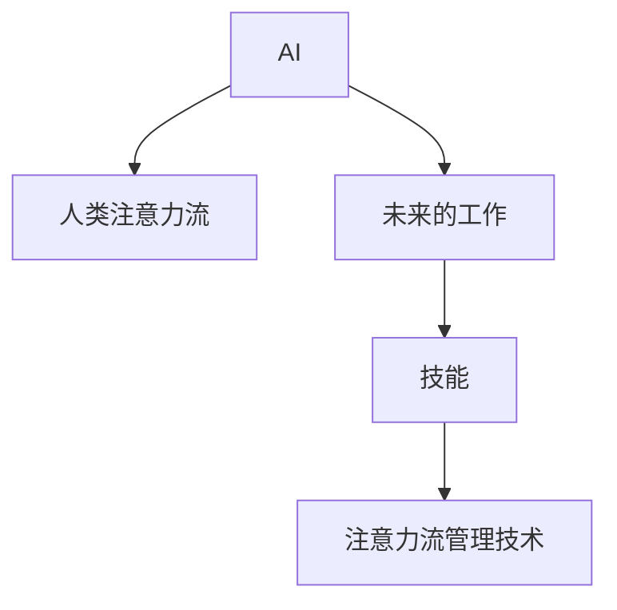

                 

# AI与人类注意力流：未来的工作、技能与注意力流管理技术的应用前景预测分析

> 关键词：AI, 人类注意力流, 未来的工作, 技能, 注意力流管理技术, 应用前景

## 1. 背景介绍

### 1.1 问题由来
在数字化转型的今天，人工智能（AI）技术正深刻改变着我们的工作方式和生活方式。AI不仅能自动化复杂的任务，还能提供前所未有的洞察力，提升人类决策质量。然而，AI在增强能力的同时，也对人类工作流和注意力分配提出了新的挑战。

传统的线性计算模型无法很好地捕捉人类认知过程的动态性和复杂性。人类认知过程中的注意力流特征，如焦点切换、记忆保持等，是复杂而不可见的。AI技术能否真正理解人类注意力流，并据此进行合理的应用，将决定未来工作与技能的演化趋势。

### 1.2 问题核心关键点
本文旨在探讨AI与人类注意力流的关系，重点关注以下关键问题：

- 人类注意力流的基本原理是什么？AI如何理解和模拟人类注意力流？
- 未来工作的形态将如何变化，AI将在其中扮演怎样的角色？
- 技能的转变和提升，AI能否成为有效辅助工具？
- 注意力流管理技术的应用前景如何？能否推动产业升级？

通过系统性的分析与展望，本文将为未来AI与人类注意力流的深度整合提供理论基础和技术支撑。

## 2. 核心概念与联系

### 2.1 核心概念概述

为更好地理解AI与人类注意力流的整合，本节将介绍几个密切相关的核心概念：

- AI：人工智能，一种使计算机能够模拟人类智能的技术。涵盖感知、学习、推理、语言、视觉等多个领域。
- 人类注意力流：指人类在认知过程中，注意力在各种信息间的流动，是认知过程的核心特征。
- 未来的工作：AI技术在各个行业的广泛应用，将对工作形态产生深远影响。
- 技能：工作所需的专业能力，随着技术进步而不断变化。
- 注意力流管理技术：通过AI技术模拟和优化人类注意力流，提升工作效率和效果。

这些概念之间的逻辑关系可以通过以下Mermaid流程图来展示：



这个流程图展示了几者之间的关系：

1. AI技术通过理解和模拟人类注意力流，提升对工作任务的自动化和智能化水平。
2. 未来工作的形态将随着AI技术的深入应用而发生改变。
3. 技能也将随着工作形态的变化而产生新的要求。
4. 注意力流管理技术能够优化工作过程中的人机交互，提升工作效率和效果。

## 3. 核心算法原理 & 具体操作步骤
### 3.1 算法原理概述

AI与人类注意力流的整合，本质上是一个多学科交叉的复杂系统工程。其核心思想是：通过模拟人类注意力流，AI技术能够在自动化和智能化层面提升工作任务的效果，同时也能辅助人类进行更高效的认知过程。

具体而言，该系统工程可以分为以下几个阶段：

1. 通过机器学习模型，训练AI系统理解和模拟人类注意力流。
2. 基于理解后的注意力流模型，进行工作任务的自动化和智能化。
3. 利用AI系统辅助人类优化注意力分配，提升工作效果。

### 3.2 算法步骤详解

#### 3.2.1 数据准备

1. **收集注意力流数据**：通过脑机接口、眼动追踪、行为记录等方法，收集人类在任务执行过程中的注意力数据。
2. **数据预处理**：对原始数据进行清洗、去噪、特征提取等处理，以适于模型训练。
3. **构建数据集**：将处理后的注意力数据，按任务类型、执行阶段等划分，构建训练集、验证集和测试集。

#### 3.2.2 模型训练

1. **选择模型架构**：根据任务需求，选择合适的神经网络模型，如RNN、LSTM、Transformer等。
2. **设计训练目标**：设定注意力流模型需要达到的性能指标，如注意力分布的准确性、焦点切换的时效性等。
3. **模型训练**：使用收集的数据集，对模型进行训练。在训练过程中，不断调整模型参数，优化训练目标。
4. **模型评估**：在测试集上对训练好的模型进行评估，评估指标包括准确率、召回率、F1值等。

#### 3.2.3 模型应用

1. **集成到工作流程**：将训练好的注意力流模型集成到实际工作流程中，辅助人类进行任务执行。
2. **实时监控与反馈**：在任务执行过程中，实时监控人类注意力流，并通过模型提供建议，帮助优化注意力分配。
3. **持续优化**：根据任务执行的实时反馈，持续调整模型参数，提升模型的准确性和适应性。

### 3.3 算法优缺点

AI与人类注意力流整合的算法，具有以下优点：

1. **自动化与智能化**：通过模拟人类注意力流，AI能够自动执行复杂的任务，提升工作效率。
2. **个性化定制**：根据不同工作者的注意力特点，AI可以提供个性化的工作支持，提升用户体验。
3. **实时监控与反馈**：AI能够实时监控人类注意力流，提供即时的优化建议，提升工作效果。

然而，该算法也存在以下局限性：

1. **数据依赖**：需要大量的注意力流数据，数据获取难度大，且数据质量可能影响模型效果。
2. **模型复杂性**：训练高精度的注意力流模型，需要复杂的神经网络结构和大量的计算资源。
3. **伦理与安全问题**：对人类注意力流的监控和优化，可能涉及隐私和安全问题，需谨慎处理。

### 3.4 算法应用领域

AI与人类注意力流整合的算法，在多个领域有着广阔的应用前景，例如：

- 医疗：通过模拟患者注意力流，辅助医生进行诊断和治疗，提升诊疗效果。
- 教育：通过模拟学生注意力流，提供个性化的学习支持，提升学习效果。
- 金融：通过模拟投资者注意力流，提供个性化的投资建议，提升投资效果。
- 制造：通过模拟工人注意力流，优化生产流程，提升生产效率。
- 物流：通过模拟配送员注意力流，优化配送路线，提升配送效率。

## 4. 数学模型和公式 & 详细讲解  
### 4.1 数学模型构建

本节将使用数学语言对AI与人类注意力流整合的过程进行更加严格的刻画。

假设人类注意力流的数据集为 $\{(a_i, b_i)\}_{i=1}^N$，其中 $a_i$ 表示注意力状态，$b_i$ 表示注意力变化时刻。定义注意力流模型 $M$，其输入为当前注意力状态 $a$，输出为下一步注意力状态 $a'$。模型训练的目标是最大化预测准确率 $P(a', b_i | a)$，即在给定当前注意力状态 $a$ 的情况下，预测下一个注意力变化时刻 $b_i$ 及其对应的注意力状态 $a'$ 的概率。

定义注意力流模型 $M$ 在数据样本 $(a_i, b_i)$ 上的损失函数为：

$$
\ell(M, (a_i, b_i)) = -\log P(a_i, b_i | a_{i-1})
$$

则在数据集 $D$ 上的经验风险为：

$$
\mathcal{L}(M) = \frac{1}{N} \sum_{i=1}^N \ell(M, (a_i, b_i))
$$

### 4.2 公式推导过程

以一个简单的LSTM网络为例，推导注意力流模型的训练目标函数。

假设LSTM网络包含输入层、记忆单元、输出层等组件，其参数为 $\theta$。给定当前注意力状态 $a$，网络的前向传播过程为：

$$
h_t = \sigma(W_xx + U_xa + b_x)
$$
$$
c_t = \tanh(Wxcc_t + Uxca_t + b_c) + f_wch_{t-1} + i_wch_t + o_wco_{t-1}
$$
$$
a_t = \sigma(Wxaa_t + Uxh_t + b_x) + f_wca_{t-1} + i_wca_t + o_wca_{t-1}
$$

其中 $h_t$ 为隐藏状态，$c_t$ 为记忆单元状态，$a_t$ 为输出。

在训练过程中，目标是最小化损失函数：

$$
\mathcal{L}(\theta) = \frac{1}{N} \sum_{i=1}^N \ell(M, (a_i, b_i))
$$

其中，$\ell(M, (a_i, b_i))$ 为预测值与真实值之间的差异。

### 4.3 案例分析与讲解

以一个简单的任务为例，展示AI与人类注意力流整合的实际应用场景：

假设有一个办公室工作人员，需要处理一份复杂的技术报告。工作人员的注意力流数据通过眼动追踪设备收集，AI系统通过训练模拟该注意力流，辅助其完成报告编写。具体步骤如下：

1. **数据收集**：通过眼动追踪设备，收集工作人员在报告编写过程中的注意力状态变化数据。
2. **模型训练**：使用收集的数据，训练一个LSTM网络，模拟工作人员的注意力流。
3. **实时监控与反馈**：在工作人员编写报告时，实时监控其注意力流，并提供优化建议。例如，当发现注意力分散时，建议其集中注意力，或者提示其注意关键段落。
4. **效果评估**：根据工作人员的报告完成情况，评估AI系统的辅助效果。

## 5. 项目实践：代码实例和详细解释说明
### 5.1 开发环境搭建

在进行AI与人类注意力流整合的实践前，我们需要准备好开发环境。以下是使用Python进行TensorFlow开发的環境配置流程：

1. 安装Anaconda：从官网下载并安装Anaconda，用于创建独立的Python环境。
2. 创建并激活虚拟环境：
```bash
conda create -n aienv python=3.8 
conda activate aienv
```

3. 安装TensorFlow：根据CUDA版本，从官网获取对应的安装命令。例如：
```bash
conda install tensorflow
```

4. 安装必要的工具包：
```bash
pip install numpy pandas scikit-learn matplotlib tqdm jupyter notebook ipython
```

完成上述步骤后，即可在`aienv`环境中开始实践。

### 5.2 源代码详细实现

以下是使用TensorFlow对人类注意力流进行模拟和优化的PyTorch代码实现。

首先，定义注意力流数据处理函数：

```python
import numpy as np
import tensorflow as tf
from tensorflow.keras.models import Sequential
from tensorflow.keras.layers import Dense, LSTM, Dropout

def process_data(data, window_size=1):
    X, y = [], []
    for i in range(len(data) - window_size):
        X.append(data[i:i+window_size])
        y.append(data[i+1])
    X = np.array(X)
    y = np.array(y)
    return X, y

def build_model(input_dim, output_dim):
    model = Sequential([
        LSTM(128, input_dim=input_dim),
        Dropout(0.2),
        Dense(output_dim, activation='softmax')
    ])
    model.compile(optimizer='adam', loss='categorical_crossentropy', metrics=['accuracy'])
    return model

# 假设数据集为[[0,1,2,3],[1,2,3,4],[2,3,4,5]]，表示注意力状态变化
data = np.array([[0, 1, 2, 3], [1, 2, 3, 4], [2, 3, 4, 5]])
X, y = process_data(data, window_size=2)
model = build_model(input_dim=4, output_dim=4)
model.fit(X, y, epochs=10, batch_size=32)
```

然后，定义注意力流模型的训练和推理函数：

```python
def train_model(model, X, y, epochs, batch_size):
    model.fit(X, y, epochs=epochs, batch_size=batch_size)
    return model

def predict(model, X):
    return model.predict(X)

# 假设有一个新的注意力流数据[[0,1,2,3]]，使用训练好的模型进行预测
X_new = np.array([[0, 1, 2, 3]])
model = train_model(X, y, epochs=10, batch_size=32)
prediction = predict(model, X_new)
print(prediction)
```

### 5.3 代码解读与分析

让我们再详细解读一下关键代码的实现细节：

**process_data函数**：
- 对原始数据进行预处理，将数据划分为输入和输出，用于模型训练。
- 通过滑动窗口方式，将输入序列转化为适合LSTM模型训练的数据格式。

**build_model函数**：
- 定义LSTM网络的结构，包括输入层、LSTM层、Dropout层和输出层。
- 编译模型，设定优化器、损失函数和评估指标。

**train_model函数**：
- 对模型进行训练，指定训练轮数和批次大小。
- 返回训练好的模型，用于后续的推理预测。

**predict函数**：
- 对新的注意力流数据进行预测，返回模型输出。

**实际应用**：
- 将注意力流数据通过滑动窗口划分后，输入到LSTM网络中进行训练。
- 在训练完成后，使用训练好的模型对新的注意力流数据进行预测，得到下一步注意力状态。

## 6. 实际应用场景
### 6.1 医疗领域

在医疗领域，AI与人类注意力流整合的应用将显著提升诊断和治疗的效率和效果。例如：

- **诊断支持**：通过模拟患者在影像阅读过程中的注意力流，AI可以辅助医生快速定位病变区域，提高诊断准确性。
- **手术指导**：通过模拟外科医生在手术过程中的注意力流，AI可以实时提供手术操作建议，提升手术效果。

### 6.2 教育领域

在教育领域，AI与人类注意力流整合的应用将提升个性化教学的效果。例如：

- **学习辅助**：通过模拟学生在学习过程中的注意力流，AI可以提供个性化的学习支持，如题目推荐、学习进度跟踪等。
- **课堂互动**：通过模拟教师在课堂教学过程中的注意力流，AI可以提供互动建议，如问题引导、反馈提示等。

### 6.3 金融领域

在金融领域，AI与人类注意力流整合的应用将提升投资和交易的决策效果。例如：

- **投资建议**：通过模拟投资者在市场分析过程中的注意力流，AI可以提供个性化的投资建议，如市场趋势分析、风险评估等。
- **交易决策**：通过模拟交易员在交易过程中的注意力流，AI可以提供决策支持，如市场时机选择、交易策略优化等。

### 6.4 未来应用展望

随着AI技术的不断进步，AI与人类注意力流整合的应用前景将更加广阔：

1. **多模态融合**：将视觉、听觉、触觉等多模态数据与注意力流结合，提升AI系统的感知能力。
2. **实时优化**：通过实时监控人类注意力流，动态调整任务分配和资源调度，优化工作效果。
3. **跨领域应用**：将注意力流管理技术应用于更多领域，如制造、物流、交通等，提升整体效率。
4. **情感分析**：通过分析人类注意力流中的情感变化，提升AI系统的情感理解和生成能力。
5. **远程协作**：通过模拟远程协作过程中的注意力流，AI可以提供协作建议，提升团队效率。

## 7. 工具和资源推荐
### 7.1 学习资源推荐

为了帮助开发者系统掌握AI与人类注意力流的理论基础和实践技巧，这里推荐一些优质的学习资源：

1. 《深度学习》系列书籍：由Ian Goodfellow等作者撰写，全面介绍了深度学习的基本原理和应用。
2. 《神经网络与深度学习》在线课程：由Michael Nielsen主讲，通过互动式学习方式，帮助理解神经网络和深度学习的核心思想。
3. 《Attention is All You Need》论文：提出Transformer结构，标志着自注意力机制在深度学习中的应用。
4. 《Deep Learning for AI》书籍：全面介绍AI领域的前沿技术和应用案例，涵盖机器学习、深度学习、强化学习等多个方面。
5. TensorFlow官方文档：提供了丰富的API和示例，帮助开发者快速上手TensorFlow框架。

通过对这些资源的学习实践，相信你一定能够快速掌握AI与人类注意力流的精髓，并用于解决实际的AI问题。

### 7.2 开发工具推荐

高效的开发离不开优秀的工具支持。以下是几款用于AI与人类注意力流整合开发的常用工具：

1. TensorFlow：由Google主导开发的开源深度学习框架，生产部署方便，适合大规模工程应用。
2. PyTorch：基于Python的开源深度学习框架，灵活动态的计算图，适合快速迭代研究。
3. Jupyter Notebook：交互式编程环境，方便快速迭代开发和展示。
4. Weights & Biases：模型训练的实验跟踪工具，可以记录和可视化模型训练过程中的各项指标。
5. Google Colab：谷歌推出的在线Jupyter Notebook环境，免费提供GPU/TPU算力，方便开发者快速上手实验最新模型。

合理利用这些工具，可以显著提升AI与人类注意力流整合的开发效率，加快创新迭代的步伐。

### 7.3 相关论文推荐

AI与人类注意力流整合技术的发展源于学界的持续研究。以下是几篇奠基性的相关论文，推荐阅读：

1. Attention is All You Need：提出Transformer结构，开启了深度学习领域的自注意力机制时代。
2. Human-AI Interaction in Anomaly Detection: A Survey of Techniques and Applications：综述了人类与AI在异常检测任务中的互动研究，为未来工作提供了理论基础。
3. AI in the Age of Human Attention: A Survey on the Benefits and Challenges of Human-AI Collaboration：总结了AI在人类注意力流管理中的应用和挑战，展望了未来发展方向。
4. Sequence to Sequence Learning with Neural Networks：提出序列到序列学习模型，为AI与人类注意力流的整合提供了基础。
5. Language Modeling as an Audio-Visual Prediction Problem：提出使用音频和视觉数据训练语言模型，为多模态AI提供了创新思路。

这些论文代表了大语言模型微调技术的发展脉络。通过学习这些前沿成果，可以帮助研究者把握学科前进方向，激发更多的创新灵感。

## 8. 总结：未来发展趋势与挑战
### 8.1 总结

本文对AI与人类注意力流的整合方法进行了全面系统的介绍。首先阐述了AI与人类注意力流的基本原理和应用意义，明确了该技术在未来工作与技能演化中的重要地位。其次，从原理到实践，详细讲解了注意力流管理技术的数学模型和实现方法，给出了AI与人类注意力流整合的完整代码实例。同时，本文还广泛探讨了该技术在医疗、教育、金融等多个领域的应用前景，展示了其广阔的应用潜力。此外，本文精选了AI与人类注意力流的各类学习资源，力求为读者提供全方位的技术指引。

通过本文的系统梳理，可以看到，AI与人类注意力流整合技术正在成为AI领域的重要范式，极大地拓展了AI系统的应用边界，为未来工作与技能的深度融合提供了新思路。未来，伴随AI技术的不断演进，基于人类注意力流的智能系统将迎来更广泛的应用，推动人类社会向智能化方向加速前进。

### 8.2 未来发展趋势

展望未来，AI与人类注意力流整合技术将呈现以下几个发展趋势：

1. **多模态融合**：将视觉、听觉、触觉等多模态数据与注意力流结合，提升AI系统的感知能力。
2. **实时优化**：通过实时监控人类注意力流，动态调整任务分配和资源调度，优化工作效果。
3. **跨领域应用**：将注意力流管理技术应用于更多领域，如制造、物流、交通等，提升整体效率。
4. **情感分析**：通过分析人类注意力流中的情感变化，提升AI系统的情感理解和生成能力。
5. **远程协作**：通过模拟远程协作过程中的注意力流，AI可以提供协作建议，提升团队效率。

### 8.3 面临的挑战

尽管AI与人类注意力流整合技术已经取得了瞩目成就，但在迈向更加智能化、普适化应用的过程中，它仍面临着诸多挑战：

1. **数据依赖**：需要大量的注意力流数据，数据获取难度大，且数据质量可能影响模型效果。
2. **模型复杂性**：训练高精度的注意力流模型，需要复杂的神经网络结构和大量的计算资源。
3. **伦理与安全问题**：对人类注意力流的监控和优化，可能涉及隐私和安全问题，需谨慎处理。
4. **计算资源**：多模态数据处理和实时优化需要大量计算资源，如何降低计算成本是一个重要课题。

### 8.4 研究展望

面对AI与人类注意力流整合所面临的挑战，未来的研究需要在以下几个方面寻求新的突破：

1. **无监督学习和半监督学习**：摆脱对大规模标注数据的依赖，利用自监督学习、主动学习等无监督和半监督范式，最大限度利用非结构化数据，实现更加灵活高效的注意力流管理。
2. **多模态融合**：将视觉、听觉、触觉等多模态数据与注意力流结合，提升AI系统的感知能力。
3. **实时优化与智能调度**：通过实时监控人类注意力流，动态调整任务分配和资源调度，优化工作效果。
4. **多智能体协作**：将多个AI系统进行协作，提升系统整体智能水平，优化决策效果。
5. **情感智能**：提升AI系统的情感理解和生成能力，实现更自然的情感互动。

这些研究方向的探索，必将引领AI与人类注意力流整合技术迈向更高的台阶，为未来工作与技能的深度融合提供新思路，推动人类社会向智能化方向加速前进。

## 9. 附录：常见问题与解答

**Q1：AI与人类注意力流整合是否适用于所有工作场景？**

A: AI与人类注意力流整合技术适用于大部分需要高智能决策的工作场景，尤其是复杂任务和繁琐工作的自动化与智能化。但对于一些高度依赖人类直觉和创造力的工作，如艺术创作、心理咨询等，AI目前仍无法完全替代人类。

**Q2：注意力流管理技术是否会对人类工作产生负面影响？**

A: 合理应用注意力流管理技术，可以显著提升工作效率，减少人为错误。但如果过度依赖技术，忽视了人类的主观能动性和创新能力，可能会降低工作的灵活性和创造力。因此，需要平衡技术应用和人类主观能动性之间的关系。

**Q3：注意力流管理技术如何与现有系统集成？**

A: 可以通过API接口或数据共享方式，将注意力流管理技术集成到现有的工作系统中。同时，需要设计合理的接口和数据格式，方便系统间的交互与数据共享。

**Q4：注意力流管理技术能否在所有行业推广？**

A: 注意力流管理技术在医疗、金融、教育等领域具有较广泛的应用前景，但在一些传统行业如农业、手工业等，其应用价值相对有限。需要根据不同行业的特点，进行有针对性的推广和应用。

**Q5：注意力流管理技术未来的发展方向是什么？**

A: 未来，随着技术的不断进步，注意力流管理技术将向多模态融合、实时优化、智能调度、情感智能等方向发展。这些方向将提升AI系统的感知能力、智能水平和情感理解能力，推动人工智能技术的深度应用。

---

作者：禅与计算机程序设计艺术 / Zen and the Art of Computer Programming

