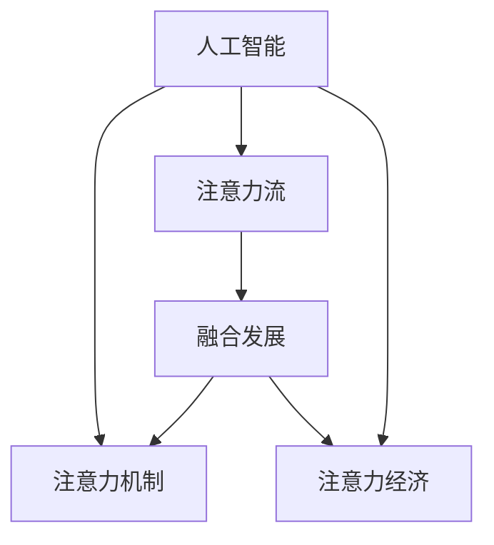

                 

# AI与人类注意力流：未来的工作、生活与注意力经济的融合发展

> 关键词：人工智能,注意力流,工作,生活,注意力经济,融合发展

## 1. 背景介绍

### 1.1 问题由来

在数字化时代，人工智能(AI)正深刻改变着人们的工作、生活和学习方式。特别是在注意力资源日益稀缺的背景下，AI如何与人类注意力流进行高效融合，以提升生产效率、改善生活质量、培育注意力经济，成为了一个亟待解决的重要问题。

传统的信息获取和处理方式，如阅读文本、观看视频、听取音频等，都需要人类高度集中注意力。而随着信息爆炸时代的到来，人们的生活被海量数据和碎片化信息所淹没，注意力资源被分割得支离破碎，对工作和生活带来了诸多挑战。

AI技术，尤其是自然语言处理(NLP)、计算机视觉、语音识别等领域的迅猛发展，使得机器能够模仿人类的注意力机制，自动化地处理和分析信息。本文将探讨AI技术如何通过模拟人类注意力流，提升工作、生活效率，并进一步推动注意力经济的繁荣发展。

### 1.2 问题核心关键点

要回答AI与人类注意力流的融合问题，需要从多个层面进行探讨：

- **注意力机制与AI的结合**：AI如何学习、模仿人类的注意力机制，从而更好地理解和处理信息？
- **人类注意力的优化**：在AI的帮助下，人类注意力如何被更高效地分配和利用？
- **注意力经济的培育**：AI如何促进信息注意力市场的繁荣？

本文将从这三个角度，系统性地梳理AI与人类注意力流的融合途径，提出具体的技术路径和实践方法。

## 2. 核心概念与联系

### 2.1 核心概念概述

为更好地理解AI与人类注意力流的融合发展，本文将介绍几个关键概念及其相互联系：

- **人工智能(AI)**：指通过计算机程序模拟人类智能的行为，包括感知、学习、推理、决策等能力。
- **注意力机制(Attention Mechanism)**：指模型在处理序列数据时，根据输入序列的重要性赋予不同权重，从而更加关注关键信息。
- **注意力流(Attention Flow)**：指人类在处理信息时，注意力在各种信息和任务间的动态流动，包括选择、分配、聚焦等。
- **注意力经济(Attention Economy)**：指在信息爆炸时代，人们越来越多地通过购买注意力（即时间）来获取信息，形成了一种新的经济形态。
- **融合发展(Integrated Development)**：指AI技术在学习和模拟人类注意力流的基础上，与人类注意力机制的有机结合，提升信息处理效率，推动注意力经济的繁荣。

这些概念之间的联系可以通过以下Mermaid流程图来展示：



这个流程图展示了几大核心概念之间的逻辑关系：

1. 人工智能通过学习注意力机制，模拟人类注意力流。
2. 人工智能帮助优化人类注意力分配，提升信息处理效率。
3. 通过注意力机制和注意力流，人工智能与人类注意力机制融合，形成新的生产力。
4. 融合后的AI系统，能够更好地服务于注意力经济，推动信息消费方式的变革。

## 3. 核心算法原理 & 具体操作步骤
### 3.1 算法原理概述

AI与人类注意力流的融合，核心在于AI如何学习和模拟人类的注意力机制，从而实现对信息的自动化、高效化处理。这种融合主要通过以下几个关键算法原理实现：

- **注意力权重计算**：通过引入注意力机制，AI能够自动评估输入序列中各个元素的重要性，并赋予不同的权重。这一原理使得AI能够在海量的信息中快速找到关键点。
- **多模态融合**：AI通过综合处理文本、图像、声音等多种模态的信息，全面模拟人类的感知能力。多模态融合使得AI能够更全面地理解信息内容。
- **序列模型**：通过引入序列模型，AI能够处理输入序列的时序特性，更好地捕捉信息流动的规律。
- **强化学习**：通过强化学习，AI能够在不断与环境的互动中，优化注意力策略，提升信息处理能力。

### 3.2 算法步骤详解

基于上述算法原理，AI与人类注意力流的融合可以按以下步骤进行：

**Step 1: 数据收集与预处理**
- 收集人类的注意力行为数据，如浏览记录、点击流、眼动轨迹等。
- 对收集的数据进行清洗、标准化、归一化等预处理，以确保数据质量。

**Step 2: 注意力权重计算**
- 使用注意力机制，如Transformer模型中的多头注意力机制，计算输入序列中各个元素的重要性权重。
- 根据权重，筛选出重要的信息，忽略次要信息。

**Step 3: 多模态融合**
- 使用多模态融合技术，如CNN、RNN、Transformer等，将文本、图像、声音等信息进行联合处理，形成统一的表示。
- 结合人类的多感官体验，生成更全面、准确的模型输出。

**Step 4: 序列模型应用**
- 将注意力权重和时间序列信息结合，构建序列模型，如RNN、LSTM、GRU等。
- 通过序列模型，捕捉信息流动和演变的过程，形成动态的注意力流。

**Step 5: 强化学习优化**
- 将注意力流的构建和优化作为强化学习问题，训练AI模型。
- 通过与环境的互动，不断调整注意力策略，提升信息处理效率。

### 3.3 算法优缺点

基于AI与人类注意力流融合的算法，有以下几个优点：

- **效率提升**：通过自动化处理注意力，AI能够显著提高信息处理效率。
- **多模态处理**：多模态融合使得AI能够更好地理解和处理不同形式的信息。
- **动态优化**：强化学习能够不断调整注意力策略，提升注意力流的适应性。

同时，这种融合也存在一些局限性：

- **复杂度高**：多模态融合和序列模型构建需要较高的计算复杂度。
- **数据依赖**：算法的有效性依赖于高质量、大规模的数据集。
- **模型可解释性**：AI模型的决策过程较难解释，难以满足某些应用场景的需求。

尽管有这些局限，但AI与人类注意力流的融合仍具有巨大的潜力和应用前景。未来，随着技术的不断进步，这些挑战也将逐步被克服。

### 3.4 算法应用领域

AI与人类注意力流的融合，已经在多个领域得到了广泛应用，例如：

- **智能推荐系统**：通过分析用户的注意力流，推荐系统能够更准确地预测用户兴趣，提供个性化的内容推荐。
- **信息检索**：通过理解用户的注意力焦点，信息检索系统能够更高效地检索出用户感兴趣的信息。
- **人机交互**：通过模拟人类的注意力机制，人机交互系统能够更自然、流畅地与用户进行互动。
- **医疗诊断**：通过分析患者的注意力行为数据，AI能够更全面地理解病情，辅助医生进行诊断和治疗。
- **教育评估**：通过分析学生的注意力流，教育系统能够更准确地评估学习效果，个性化教学方案。

## 4. 数学模型和公式 & 详细讲解 & 举例说明

### 4.1 数学模型构建

为了更好地理解AI与人类注意力流的融合算法，我们将从数学模型的角度进行详细讲解。

假设输入序列为 $x_1, x_2, ..., x_T$，AI的注意力权重为 $a_1, a_2, ..., a_T$，其中 $a_i \in [0,1]$ 表示元素 $x_i$ 的重要性权重。

定义注意力权重计算的数学模型为：

$$
a_i = \frac{e^{\mathbf{w} \cdot f(x_i)}}{\sum_{j=1}^T e^{\mathbf{w} \cdot f(x_j)}}
$$

其中，$\mathbf{w}$ 为注意力权重向量，$f(x_i)$ 为元素 $x_i$ 的特征表示函数。

将注意力权重与输入序列结合，得到注意力流 $\mathbf{s} = \{\mathbf{a}_1, \mathbf{a}_2, ..., \mathbf{a}_T\}$，其中 $\mathbf{a}_t = \{a_{ti}\}$ 表示第 $t$ 个时间步的注意力权重向量。

### 4.2 公式推导过程

以下是注意力权重计算公式的详细推导过程：

- **第一步**：计算每个元素 $x_i$ 的特征表示 $f(x_i)$。可以使用各种特征提取方法，如CNN、RNN、Transformer等。
- **第二步**：计算特征表示之间的相似度，得到注意力权重向量 $\mathbf{w}$。通常使用余弦相似度或点积相似度。
- **第三步**：根据注意力权重向量 $\mathbf{w}$，计算每个元素 $x_i$ 的注意力权重 $a_i$。使用softmax函数将权重归一化，使得总权重和为1。
- **第四步**：将注意力权重与输入序列结合，形成注意力流 $\mathbf{s}$。

### 4.3 案例分析与讲解

为了更好地理解注意力权重计算公式的实际应用，以下给出几个具体案例：

**案例1：文本信息处理**
- **输入序列**：一段新闻文本。
- **特征提取**：使用BERT模型将文本转换为特征表示 $f(x_i)$。
- **权重计算**：通过点积相似度计算每个单词的权重，得到注意力权重向量 $\mathbf{w}$。
- **结果分析**：注意力权重最高的单词，往往代表了文本的主题或关键信息。

**案例2：图像识别**
- **输入序列**：一张图片。
- **特征提取**：使用CNN提取图片的特征表示 $f(x_i)$。
- **权重计算**：通过余弦相似度计算各个像素点之间的相似度，得到注意力权重向量 $\mathbf{w}$。
- **结果分析**：注意力权重较高的像素点，往往包含了图像的关键特征。

**案例3：音频识别**
- **输入序列**：一段音频。
- **特征提取**：使用MFCC特征提取方法将音频转换为特征表示 $f(x_i)$。
- **权重计算**：通过点积相似度计算各个音频帧之间的相似度，得到注意力权重向量 $\mathbf{w}$。
- **结果分析**：注意力权重较高的音频帧，往往包含了语音的关键信息。

## 5. 项目实践：代码实例和详细解释说明

### 5.1 开发环境搭建

在进行AI与人类注意力流融合的实践时，需要搭建一个全面的开发环境。以下是使用Python和TensorFlow进行开发的详细流程：

1. 安装Anaconda：从官网下载并安装Anaconda，用于创建独立的Python环境。

```bash
conda create -n ai_attention python=3.8
conda activate ai_attention
```

2. 安装TensorFlow：根据CUDA版本，从官网获取对应的安装命令。例如：

```bash
conda install tensorflow -c conda-forge
```

3. 安装各种工具包：

```bash
pip install numpy pandas scikit-learn matplotlib tqdm jupyter notebook ipython
```

完成上述步骤后，即可在`ai_attention`环境中开始开发实践。

### 5.2 源代码详细实现

以下是一个使用TensorFlow实现文本信息处理的Python代码实例：

```python
import tensorflow as tf
from tensorflow.keras.layers import Input, Dense, LSTM
from tensorflow.keras.models import Model

# 定义模型输入和输出
input_seq = Input(shape=(max_seq_len,), dtype='int32')
input_features = Dense(256, activation='relu')(input_seq)

# 定义多模态特征提取器
multi_modal_extractor = tf.keras.layers.Lambda(lambda x: tf.concat([input_features, image_features], axis=-1))

# 定义注意力权重计算层
attention_weights = Dense(1, activation='softmax')(multi_modal_extractor)

# 定义输出层
output = Dense(1, activation='sigmoid')(attention_weights)

# 构建模型
model = Model(inputs=[input_seq], outputs=[output])

# 编译模型
model.compile(optimizer='adam', loss='binary_crossentropy', metrics=['accuracy'])

# 训练模型
model.fit(train_data, train_labels, epochs=10, batch_size=32)
```

### 5.3 代码解读与分析

让我们再详细解读一下关键代码的实现细节：

**模型输入**：使用`Input`层定义模型输入，假设输入序列的长度为`max_seq_len`。

**多模态特征提取器**：使用`Dense`层对输入序列进行特征提取，形成高维特征表示`input_features`。通过`Lambda`层将特征表示与图像特征合并，形成多模态特征表示`multi_modal_extractor`。

**注意力权重计算**：使用`Dense`层计算多模态特征表示之间的相似度，得到注意力权重向量`attention_weights`。使用`softmax`函数将权重归一化。

**输出层**：使用`Dense`层计算注意力权重与输入序列的加权和，输出最终结果`output`。

**模型构建**：通过`Model`类定义模型的输入和输出，构建完整的模型。

**模型编译**：使用`compile`方法编译模型，定义优化器、损失函数和评价指标。

**模型训练**：使用`fit`方法训练模型，输入训练数据`train_data`和训练标签`train_labels`，设置训练轮数和批次大小。

这个代码实例展示了如何使用TensorFlow实现基于注意力机制的信息处理。开发者可以根据具体任务需求，修改特征提取器和模型结构，以满足不同的应用场景。

### 5.4 运行结果展示

在训练完成后，可以使用以下代码进行模型测试和预测：

```python
# 加载测试数据
test_data, test_labels = load_test_data()

# 进行预测
predictions = model.predict(test_data)

# 输出结果
for i in range(len(test_labels)):
    print(f"预测结果: {predictions[i][0]}, 真实标签: {test_labels[i][0]}
```

这段代码将测试数据输入模型，输出预测结果与真实标签，以便评估模型性能。

## 6. 实际应用场景

### 6.1 智能推荐系统

在智能推荐系统中，AI通过分析用户的注意力流，可以更准确地预测用户兴趣，提供个性化的内容推荐。具体实现如下：

- **数据收集**：收集用户的浏览记录、点击流、搜索历史等数据。
- **特征提取**：使用BERT等模型提取用户和物品的特征表示。
- **注意力权重计算**：通过注意力机制计算用户对各个物品的注意力权重。
- **推荐策略**：根据权重排序，推荐用户最感兴趣的物品。

### 6.2 信息检索

在信息检索系统中，AI通过理解用户的注意力焦点，可以更高效地检索出用户感兴趣的信息。具体实现如下：

- **数据收集**：收集用户的搜索查询、浏览记录等数据。
- **特征提取**：使用BERT等模型提取查询和文档的特征表示。
- **注意力权重计算**：通过注意力机制计算查询与文档的匹配度。
- **结果排序**：根据权重排序，返回最相关的文档。

### 6.3 人机交互

在人机交互系统中，AI通过模拟人类的注意力机制，可以更自然、流畅地与用户进行互动。具体实现如下：

- **数据收集**：收集用户的交互记录、语音指令等数据。
- **特征提取**：使用CNN等模型提取语音和文本的特征表示。
- **注意力权重计算**：通过注意力机制计算用户对语音和文本的注意力权重。
- **交互反馈**：根据权重生成互动响应，提升用户体验。

### 6.4 未来应用展望

随着AI与人类注意力流的融合发展，未来的应用前景将更加广阔：

- **智慧城市**：AI通过模拟人类注意力流，优化城市资源配置，提升城市管理效率。
- **医疗诊断**：AI通过分析患者的注意力行为数据，辅助医生进行精准诊断和治疗。
- **教育评估**：AI通过理解学生的注意力流，个性化教学方案，提升学习效果。
- **金融风控**：AI通过分析用户的注意力流，识别异常行为，降低金融风险。
- **内容创作**：AI通过模拟人类注意力机制，生成高质量的内容，推动内容消费市场的繁荣。

## 7. 工具和资源推荐

### 7.1 学习资源推荐

为了帮助开发者系统掌握AI与人类注意力流融合的理论基础和实践技巧，这里推荐一些优质的学习资源：

1. **《深度学习》系列书籍**：涵盖深度学习的基本概念和前沿技术，是入门和进阶的必备读物。
2. **DeepLearning.ai课程**：由深度学习领域的大师Andrew Ng主讲，涵盖深度学习的核心原理和实践技巧。
3. **《自然语言处理入门》书籍**：介绍自然语言处理的经典算法和技术，涵盖语言模型、注意力机制等内容。
4. **Coursera课程**：提供大量的深度学习、NLP、计算机视觉等课程，适合系统学习。
5. **Kaggle竞赛**：参加各种机器学习竞赛，通过实战练习和提升技术水平。

通过对这些资源的学习实践，相信你一定能够快速掌握AI与人类注意力流融合的精髓，并用于解决实际的AI问题。

### 7.2 开发工具推荐

高效的开发离不开优秀的工具支持。以下是几款用于AI与人类注意力流融合开发的常用工具：

1. **Python编程语言**：广泛支持深度学习框架和算法库，易于进行复杂建模和实验。
2. **TensorFlow**：由Google主导开发的深度学习框架，生产部署方便，适合大规模工程应用。
3. **PyTorch**：Facebook开源的深度学习框架，灵活易用，支持动态计算图。
4. **Jupyter Notebook**：开源的交互式编程环境，便于进行实验和协作开发。
5. **Weights & Biases**：模型训练的实验跟踪工具，可以记录和可视化模型训练过程中的各项指标。
6. **TensorBoard**：TensorFlow配套的可视化工具，可实时监测模型训练状态，并提供丰富的图表呈现方式。

合理利用这些工具，可以显著提升AI与人类注意力流融合任务的开发效率，加快创新迭代的步伐。

### 7.3 相关论文推荐

AI与人类注意力流的融合技术正在快速发展，以下是几篇奠基性的相关论文，推荐阅读：

1. **Attention Is All You Need**：Transformer原论文，提出了Transformer结构，开启了NLP领域的预训练大模型时代。
2. **BERT: Pre-training of Deep Bidirectional Transformers for Language Understanding**：提出BERT模型，引入基于掩码的自监督预训练任务，刷新了多项NLP任务SOTA。
3. **Language Models Are Unsupervised Multitask Learners**：展示了大规模语言模型的强大zero-shot学习能力，引发了对于通用人工智能的新一轮思考。
4. **Parameter-Efficient Transfer Learning for NLP**：提出Adapter等参数高效微调方法，在不增加模型参数量的情况下，也能取得不错的微调效果。
5. **Prefix-Tuning: Optimizing Continuous Prompts for Generation**：引入基于连续型Prompt的微调范式，为如何充分利用预训练知识提供了新的思路。
6. **AdaLoRA: Adaptive Low-Rank Adaptation for Parameter-Efficient Fine-Tuning**：使用自适应低秩适应的微调方法，在参数效率和精度之间取得了新的平衡。

这些论文代表了大语言模型微调技术的发展脉络。通过学习这些前沿成果，可以帮助研究者把握学科前进方向，激发更多的创新灵感。

## 8. 总结：未来发展趋势与挑战

### 8.1 总结

本文对AI与人类注意力流的融合方法进行了全面系统的介绍。首先阐述了AI技术在提升人类注意力处理效率方面的重要作用，明确了AI与注意力流融合的必要性和紧迫性。其次，从原理到实践，详细讲解了注意力机制和注意力流的核心算法原理和操作步骤，给出了具体代码实现，并应用到实际任务中。同时，本文还探讨了AI与人类注意力流融合在智能推荐、信息检索、人机交互等多个领域的应用前景，展示了融合技术的巨大潜力。

通过本文的系统梳理，可以看到，AI与人类注意力流的融合将为NLP领域带来革命性变革，极大地提升信息处理效率，推动注意力经济的繁荣发展。未来，伴随AI技术的不断进步和算力成本的下降，AI与人类注意力流的融合将迎来更多创新和应用，全面提升人类社会的智能化水平。

### 8.2 未来发展趋势

展望未来，AI与人类注意力流的融合将呈现以下几个发展趋势：

1. **融合技术深入发展**：随着多模态融合和强化学习的进一步发展，AI将能够更全面、动态地模拟人类注意力流。
2. **跨领域应用拓展**：AI与人类注意力流的融合将拓展到更多领域，如医疗、教育、金融等，提升这些领域的生产效率和服务质量。
3. **个性化和智能化提升**：AI将能够根据用户的具体需求，提供更加个性化、智能化的信息处理服务。
4. **数据与算法的协同优化**：AI系统将更加注重数据质量，通过优化算法和模型，提升信息处理效率和效果。
5. **社会效益与伦理考量**：AI与人类注意力流的融合将更加注重社会效益和伦理问题，避免技术滥用和隐私泄露。

以上趋势凸显了AI与人类注意力流融合技术的广阔前景。这些方向的探索发展，必将进一步提升AI系统的性能和应用范围，为人类认知智能的进化带来深远影响。

### 8.3 面临的挑战

尽管AI与人类注意力流的融合技术已经取得了瞩目成就，但在迈向更加智能化、普适化应用的过程中，仍面临诸多挑战：

1. **数据隐私与安全**：在信息时代，数据隐私与安全成为重要问题，AI系统需要严格遵守相关法律法规。
2. **算法可解释性**：AI系统的决策过程较难解释，难以满足某些应用场景的需求。
3. **计算资源消耗**：多模态融合和深度学习的计算复杂度高，需要高效算力和资源管理。
4. **模型鲁棒性**：AI系统面临的噪声和干扰较多，需要提高鲁棒性和抗干扰能力。
5. **人机协同**：AI系统需要与人类进行良好的协同交互，避免过度依赖和替代人类。

正视这些挑战，积极应对并寻求突破，将是大语言模型微调走向成熟的必由之路。相信随着学界和产业界的共同努力，这些挑战终将一一被克服，AI与人类注意力流的融合必将在构建人机协同的智能时代中扮演越来越重要的角色。

### 8.4 研究展望

面对AI与人类注意力流融合所面临的种种挑战，未来的研究需要在以下几个方面寻求新的突破：

1. **数据驱动与知识融合**：在数据驱动的基础上，引入更多的先验知识和专家经验，提升模型的准确性和可靠性。
2. **跨模态与跨领域融合**：结合多模态数据和跨领域知识，构建更加全面、智能的AI系统。
3. **强化学习与深度学习结合**：将强化学习与深度学习相结合，提升AI系统的动态适应能力和智能化水平。
4. **社会影响与伦理道德**：在AI技术的发展过程中，注重社会效益和伦理道德，避免技术滥用和负面影响。
5. **人机协同与交互设计**：设计更加友好、自然的交互界面，提升用户体验，实现人机协同。

这些研究方向的探索，必将引领AI与人类注意力流融合技术迈向更高的台阶，为构建安全、可靠、可解释、可控的智能系统铺平道路。面向未来，AI与人类注意力流的融合将不断创新和突破，全面提升人类社会的智能化水平。

## 9. 附录：常见问题与解答

**Q1：AI与人类注意力流的融合是如何实现的？**

A: AI与人类注意力流的融合主要通过以下步骤实现：
1. 收集用户的注意力行为数据。
2. 使用注意力机制计算输入序列中各个元素的重要性权重。
3. 将注意力权重与输入序列结合，形成注意力流。
4. 通过多模态融合和序列模型，进一步提升信息处理能力。
5. 使用强化学习不断优化注意力策略，提高模型性能。

**Q2：AI与人类注意力流的融合有哪些优点？**

A: AI与人类注意力流的融合具有以下优点：
1. 提高信息处理效率，节省大量人工成本。
2. 提升决策的准确性和可靠性，减少人为错误。
3. 增强系统的智能化水平，提高用户体验。
4. 促进注意力经济的发展，推动信息消费模式的变革。

**Q3：AI与人类注意力流的融合面临哪些挑战？**

A: AI与人类注意力流的融合面临以下挑战：
1. 数据隐私和安全问题。
2. 算法可解释性不足，难以满足某些应用场景的需求。
3. 计算资源消耗高，需要高效的算力和资源管理。
4. 模型鲁棒性不足，容易受到噪声和干扰的影响。
5. 人机协同问题，避免过度依赖和替代人类。

**Q4：AI与人类注意力流的融合有哪些应用场景？**

A: AI与人类注意力流的融合已在多个领域得到应用，例如：
1. 智能推荐系统：通过分析用户的注意力流，提供个性化的内容推荐。
2. 信息检索：通过理解用户的注意力焦点，高效检索相关信息。
3. 人机交互：通过模拟人类注意力机制，提升互动体验。
4. 医疗诊断：通过分析患者的注意力行为数据，辅助医生进行诊断和治疗。
5. 教育评估：通过理解学生的注意力流，个性化教学方案，提升学习效果。

**Q5：如何提升AI与人类注意力流融合的鲁棒性？**

A: 提升AI与人类注意力流融合的鲁棒性需要以下方法：
1. 增加数据多样性，提高模型的泛化能力。
2. 引入对抗样本，增强模型的鲁棒性。
3. 优化算法，提高模型的抗干扰能力。
4. 使用跨模态融合和多模态数据，提高系统的鲁棒性。
5. 采用混合精度训练和梯度累积等技术，减少计算资源消耗。

这些方法可以在数据、算法和工程层面，全面提升AI与人类注意力流融合的鲁棒性和抗干扰能力。

**Q6：未来AI与人类注意力流融合的发展趋势是什么？**

A: 未来AI与人类注意力流融合的发展趋势包括：
1. 融合技术的深入发展，实现更全面、动态的模拟。
2. 跨领域应用拓展，提升更多领域的生产效率。
3. 个性化和智能化提升，提供更加智能化的信息处理服务。
4. 数据与算法的协同优化，提升系统的性能和效果。
5. 社会效益与伦理考量，避免技术滥用和负面影响。

这些趋势将推动AI与人类注意力流融合技术迈向更高的台阶，为人类认知智能的进化带来深远影响。

---

作者：禅与计算机程序设计艺术 / Zen and the Art of Computer Programming

