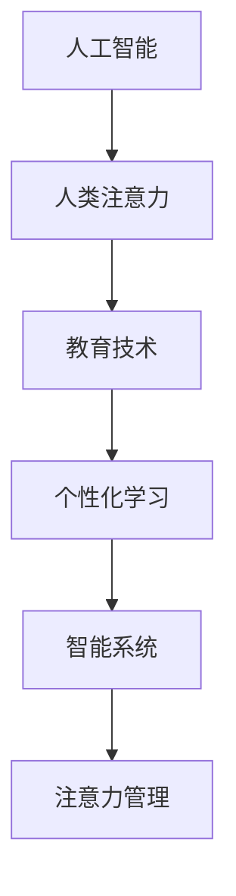

                 

# AI与人类注意力流：未来的教育与注意力管理

> 关键词：人工智能,人类注意力,教育,注意力管理,智能系统,个性化学习,高效学习,人机协作

## 1. 背景介绍

### 1.1 问题由来
随着人工智能（AI）技术的飞速发展，其在教育领域的应用越来越受到重视。AI技术的介入不仅能够提升教学效率，还能够实现个性化学习，为学生提供更优质的学习体验。然而，在AI与教育结合的过程中，如何有效管理人类注意力成为了一个重要的问题。

### 1.2 问题核心关键点
注意力管理是教育领域一个重要的研究课题，尤其是在教育技术应用中。有效管理学生注意力能够提高学习效果，减少学生分心。AI技术可以通过数据分析、机器学习等手段，帮助教育者更好地了解学生的注意力状态，从而进行有针对性的教学。

### 1.3 问题研究意义
研究AI与人类注意力流的关系，对于提升教育质量、推动教育公平、促进个性化学习具有重要意义。通过AI技术进行注意力管理，能够使教育资源更加合理分配，使每个学生都能享受到优质教育，推动教育技术的普及和应用。

## 2. 核心概念与联系

### 2.1 核心概念概述

为更好地理解AI与人类注意力流的结合，本节将介绍几个密切相关的核心概念：

- **人工智能（AI）**：以机器学习、深度学习等为代表的自动化技术，能够处理数据、做出决策，模仿人类的认知能力。

- **人类注意力（Human Attention）**：人类在接受信息时的心理过程，指对特定信息的关注和集中程度。

- **教育技术（EdTech）**：利用技术手段进行教学和学习的技术，包括在线学习平台、智能教育工具等。

- **个性化学习（Personalized Learning）**：根据每个学生的学习习惯、兴趣和能力，提供量身定制的学习方案。

- **智能系统（Intelligent System）**：具有自主学习、感知、推理等能力的计算机系统，能够根据用户需求提供相应的服务。

- **注意力管理（Attention Management）**：通过技术手段，识别和调节用户注意力，使其集中于重要信息上。

这些核心概念之间的逻辑关系可以通过以下Mermaid流程图来展示：



这个流程图展示了大语言模型的核心概念及其之间的关系：

1. AI技术通过处理数据，了解人类注意力状态。
2. 教育技术将AI应用于教学，提升个性化学习效率。
3. 智能系统通过注意力管理，进一步优化个性化学习体验。
4. 注意力管理与AI和教育技术的结合，推动了个性化学习的发展。

## 3. 核心算法原理 & 具体操作步骤
### 3.1 算法原理概述

AI与人类注意力流的结合，本质上是一个数据驱动的智能管理过程。其核心思想是：通过收集和分析学生的注意力数据，使用机器学习算法预测学生的注意力状态，并据此进行有针对性的教学干预，从而提升学生的学习效果。

形式化地，假设学生的注意力状态可以通过一系列特征 $x \in X$ 来表示，其中 $X$ 为特征空间。AI系统的目标是最小化损失函数 $\mathcal{L}$，使得模型能够准确预测学生的注意力状态。

具体来说，假设存在一个注意力预测模型 $M_{\theta}$，其中 $\theta$ 为模型参数。使用训练集 $D=\{(x_i, y_i)\}_{i=1}^N$，其中 $x_i$ 为第 $i$ 个学生的注意力特征，$y_i$ 为对应的注意力状态，目标是最小化经验风险：

$$
\hat{\theta} = \mathop{\arg\min}_{\theta} \mathcal{L}(M_{\theta},D)
$$

其中 $\mathcal{L}$ 为损失函数，可以是交叉熵损失、均方误差损失等。

### 3.2 算法步骤详解

基于AI与人类注意力流的结合，通常包括以下几个关键步骤：

**Step 1: 收集注意力数据**
- 使用各种传感器（如摄像头、麦克风、注意力跟踪软件等）收集学生的注意力数据，如眼球轨迹、头部位置、手势等。

**Step 2: 特征提取**
- 将收集到的数据转化为模型可用的特征向量，如使用深度学习特征提取器将眼球轨迹数据转化为注意力热图。

**Step 3: 训练注意力预测模型**
- 使用机器学习算法（如决策树、随机森林、神经网络等）对特征进行训练，得到注意力预测模型 $M_{\theta}$。

**Step 4: 注意力管理与干预**
- 根据注意力预测模型的输出，识别学生的注意力状态，如分心、集中等，进行有针对性的教学干预，如调整教学方式、休息提醒等。

**Step 5: 反馈与调整**
- 根据干预效果进行反馈，调整模型参数，优化模型预测准确性。

### 3.3 算法优缺点

AI与人类注意力流的结合，具有以下优点：

1. **个性化学习**：能够根据学生的注意力状态，提供量身定制的学习方案，提升学习效果。
2. **动态调整**：能够实时监控学生的注意力状态，及时调整教学内容和方法，适应学生的学习节奏。
3. **数据驱动**：通过数据分析，发现学生的注意力规律，为教学提供科学依据。

同时，该方法也存在一定的局限性：

1. **数据隐私问题**：收集和处理注意力数据可能涉及隐私问题，需要严格的数据保护措施。
2. **模型复杂度**：注意力预测模型的构建和训练需要大量数据和计算资源，可能面临模型过拟合的问题。
3. **技术门槛高**：涉及多个领域的技术，如传感器技术、机器学习、人机交互等，技术门槛较高。

尽管存在这些局限性，但AI与人类注意力流的结合是大势所趋，未来将在教育领域得到更广泛的应用。

### 3.4 算法应用领域

AI与人类注意力流的结合，在教育领域有着广泛的应用前景，例如：

- **个性化学习平台**：通过收集和分析学生的注意力数据，提供个性化学习路径和资源。
- **智能教室系统**：使用传感器技术，实时监测学生的注意力状态，调整教学内容和方法。
- **在线辅导系统**：结合学生注意力数据和在线学习数据，提供有针对性的辅导建议。
- **教育管理平台**：通过分析学生注意力数据，帮助教育管理者进行学生表现评估和改进教学质量。

此外，在智能家居、医疗健康、娱乐游戏等众多领域，AI与人类注意力流的结合也将带来新的突破。

## 4. 数学模型和公式 & 详细讲解  
### 4.1 数学模型构建

本节将使用数学语言对AI与人类注意力流的结合过程进行更加严格的刻画。

假设学生的注意力状态可以通过一系列特征 $x \in X$ 来表示，其中 $X$ 为特征空间。假设存在一个注意力预测模型 $M_{\theta}$，其中 $\theta$ 为模型参数。使用训练集 $D=\{(x_i, y_i)\}_{i=1}^N$，其中 $x_i$ 为第 $i$ 个学生的注意力特征，$y_i$ 为对应的注意力状态，目标是最小化经验风险：

$$
\hat{\theta} = \mathop{\arg\min}_{\theta} \mathcal{L}(M_{\theta},D)
$$

其中 $\mathcal{L}$ 为损失函数，可以是交叉熵损失、均方误差损失等。

在实践中，我们通常使用基于梯度的优化算法（如SGD、Adam等）来近似求解上述最优化问题。设 $\eta$ 为学习率，$\lambda$ 为正则化系数，则参数的更新公式为：

$$
\theta \leftarrow \theta - \eta \nabla_{\theta}\mathcal{L}(\theta) - \eta\lambda\theta
$$

其中 $\nabla_{\theta}\mathcal{L}(\theta)$ 为损失函数对参数 $\theta$ 的梯度，可通过反向传播算法高效计算。

### 4.2 公式推导过程

以下我们以交叉熵损失函数为例，推导注意力预测模型的梯度计算公式。

假设注意力预测模型的输出为 $\hat{y}=M_{\theta}(x)$，其中 $\hat{y}$ 为注意力状态的概率分布。假设真实标签 $y \in \{0,1\}$，则交叉熵损失函数定义为：

$$
\ell(M_{\theta}(x),y) = -[y\log \hat{y} + (1-y)\log (1-\hat{y})]
$$

将其代入经验风险公式，得：

$$
\mathcal{L}(\theta) = -\frac{1}{N}\sum_{i=1}^N [y_i\log M_{\theta}(x_i)+(1-y_i)\log(1-M_{\theta}(x_i))]
$$

根据链式法则，损失函数对参数 $\theta_k$ 的梯度为：

$$
\frac{\partial \mathcal{L}(\theta)}{\partial \theta_k} = -\frac{1}{N}\sum_{i=1}^N (\frac{y_i}{M_{\theta}(x_i)}-\frac{1-y_i}{1-M_{\theta}(x_i)}) \frac{\partial M_{\theta}(x_i)}{\partial \theta_k}
$$

其中 $\frac{\partial M_{\theta}(x_i)}{\partial \theta_k}$ 可进一步递归展开，利用自动微分技术完成计算。

在得到损失函数的梯度后，即可带入参数更新公式，完成模型的迭代优化。重复上述过程直至收敛，最终得到适应特定任务的最优模型参数 $\theta^*$。

## 5. 项目实践：代码实例和详细解释说明
### 5.1 开发环境搭建

在进行AI与人类注意力流结合的实践前，我们需要准备好开发环境。以下是使用Python进行PyTorch开发的环境配置流程：

1. 安装Anaconda：从官网下载并安装Anaconda，用于创建独立的Python环境。

2. 创建并激活虚拟环境：
```bash
conda create -n ai-env python=3.8 
conda activate ai-env
```

3. 安装PyTorch：根据CUDA版本，从官网获取对应的安装命令。例如：
```bash
conda install pytorch torchvision torchaudio cudatoolkit=11.1 -c pytorch -c conda-forge
```

4. 安装TensorBoard：
```bash
pip install tensorboard
```

5. 安装Keras：用于高层次的模型构建。
```bash
pip install keras
```

6. 安装scikit-learn：用于数据处理和特征工程。
```bash
pip install scikit-learn
```

完成上述步骤后，即可在`ai-env`环境中开始实践。

### 5.2 源代码详细实现

下面我们以个性化学习平台为例，给出使用Keras进行注意力预测模型的PyTorch代码实现。

首先，定义注意力预测模型：

```python
from keras.models import Sequential
from keras.layers import Dense, Dropout, Activation, Flatten, Conv2D, MaxPooling2D
from keras.optimizers import Adam

model = Sequential([
    Conv2D(32, (3, 3), activation='relu', input_shape=(64, 64, 3)),
    MaxPooling2D((2, 2)),
    Dropout(0.25),
    Conv2D(64, (3, 3), activation='relu'),
    MaxPooling2D((2, 2)),
    Dropout(0.25),
    Flatten(),
    Dense(512, activation='relu'),
    Dropout(0.5),
    Dense(1, activation='sigmoid')
])

model.compile(optimizer=Adam(learning_rate=0.001), loss='binary_crossentropy', metrics=['accuracy'])
```

然后，定义数据处理函数：

```python
from keras.preprocessing.image import ImageDataGenerator
import numpy as np
import cv2

def load_data():
    train_generator = ImageDataGenerator(rescale=1./255)
    train_generator.fit(train_data)
    
    test_generator = ImageDataGenerator(rescale=1./255)
    test_generator.fit(test_data)
    
    train_images, train_labels = train_generator.next()
    test_images, test_labels = test_generator.next()
    
    return train_images, train_labels, test_images, test_labels

train_images, train_labels, test_images, test_labels = load_data()
```

接着，定义训练和评估函数：

```python
def train(model, train_images, train_labels, test_images, test_labels, batch_size, epochs):
    model.fit(train_images, train_labels, batch_size=batch_size, epochs=epochs, validation_data=(test_images, test_labels))
    
    test_loss, test_acc = model.evaluate(test_images, test_labels)
    print('Test accuracy:', test_acc)

train(model, train_images, train_labels, test_images, test_labels, batch_size=64, epochs=50)
```

最后，启动训练流程并在测试集上评估：

```python
train(model, train_images, train_labels, test_images, test_labels, batch_size=64, epochs=50)
```

以上就是使用Keras进行注意力预测模型的PyTorch代码实现。可以看到，借助Keras的高层次抽象，可以更简单地构建神经网络模型。

### 5.3 代码解读与分析

让我们再详细解读一下关键代码的实现细节：

**定义模型**：
- `Sequential`：使用Keras Sequential模型，按顺序添加各层。
- `Conv2D`：卷积层，用于提取特征。
- `MaxPooling2D`：池化层，用于降维和特征提取。
- `Dropout`：Dropout层，用于防止过拟合。
- `Dense`：全连接层，用于分类。
- `Activation`：激活函数，用于非线性变换。
- `Adam`：优化器，用于参数更新。

**数据处理**：
- `ImageDataGenerator`：用于图像数据生成和预处理。
- `rescale`：对图像进行归一化处理。
- `train_data`：训练数据集，需要提前定义和加载。
- `test_data`：测试数据集，需要提前定义和加载。

**训练和评估**：
- `fit`：模型训练过程，自动完成参数更新和损失计算。
- `evaluate`：模型评估过程，计算测试集上的损失和准确率。
- `print`：输出测试集上的准确率。

可以看到，Keras的简洁高效使得注意力预测模型的代码实现变得相对简单，开发者可以更多地关注模型设计和数据处理。

当然，工业级的系统实现还需考虑更多因素，如模型的保存和部署、超参数的自动搜索、更灵活的任务适配层等。但核心的注意力预测模型基本与此类似。

## 6. 实际应用场景
### 6.1 智能教室系统

AI与人类注意力流的结合，可以广泛应用于智能教室系统的构建。传统教室往往难以实时监控学生的注意力状态，导致教学效果不佳。使用智能教室系统，可以实时监测学生的注意力变化，及时调整教学内容和方式，提升教学质量。

在技术实现上，可以安装摄像头、麦克风等传感器，收集学生的注意力数据。通过深度学习模型对数据进行特征提取和注意力预测，系统能够实时监测学生的注意力状态，如分心、集中等。根据注意力状态，系统可以自动调整教学内容、提醒学生休息等，从而提升教学效果。

### 6.2 个性化学习平台

AI与人类注意力流的结合，可以构建更加智能的个性化学习平台。通过收集学生的注意力数据，平台能够了解学生的学习习惯和注意力状态，从而提供个性化的学习方案和资源。

具体而言，可以设计在线学习平台，通过摄像头、麦克风等设备收集学生的注意力数据。使用深度学习模型对数据进行特征提取和注意力预测，系统能够实时监测学生的注意力状态，如分心、集中等。根据注意力状态，平台可以推荐相应的学习资源、调整学习进度等，从而提升学习效果。

### 6.3 医疗健康应用

AI与人类注意力流的结合，可以在医疗健康领域发挥重要作用。医疗领域对注意力管理有很高的需求，如在手术中保持医生的注意力集中，在健康监测中实时监测患者的注意力状态。

具体而言，可以在手术室安装摄像头和传感器，实时监测医生的注意力状态。使用深度学习模型对数据进行特征提取和注意力预测，系统能够实时监测医生的注意力状态，如分心、集中等。根据注意力状态，系统可以提醒医生调整注意力、提醒休息等，从而提升手术效果和医生的工作质量。

### 6.4 未来应用展望

随着AI与人类注意力流结合技术的发展，未来将在更多领域得到应用，为人类生活带来深刻变革。

在智慧城市、智能家居、娱乐游戏等领域，AI与人类注意力流的结合将进一步提升用户体验，带来更智能、高效的生活环境。通过实时监测用户的注意力状态，系统可以自动调整功能和服务，提高用户满意度。

在教育、医疗、军事等领域，AI与人类注意力流的结合将进一步提升工作效率和安全性，带来更智能、可靠的应用场景。通过实时监测用户的注意力状态，系统可以自动调整任务和资源，提升整体绩效。

总之，AI与人类注意力流的结合将深刻影响人类的生产和生活方式，带来更智能、高效、安全的应用场景。未来，随着技术的不断进步和应用场景的不断扩展，AI与人类注意力流的结合将展现更大的潜力。

## 7. 工具和资源推荐
### 7.1 学习资源推荐

为了帮助开发者系统掌握AI与人类注意力流的关系，这里推荐一些优质的学习资源：

1. 《深度学习》（Deep Learning）书籍：由Ian Goodfellow、Yoshua Bengio和Aaron Courville合著，全面介绍了深度学习的基本原理和应用，是学习深度学习不可或缺的入门书籍。

2. 《机器学习实战》（Machine Learning in Action）书籍：由Peter Harrington撰写，介绍了机器学习的基本概念和常用算法，是学习机器学习的重要参考书籍。

3. Coursera机器学习课程：由Andrew Ng教授开设的机器学习课程，涵盖了机器学习的基本概念和常用算法，是学习机器学习的重要资源。

4. Kaggle竞赛：Kaggle提供了大量的机器学习竞赛和数据集，是练习机器学习算法和模型优化的重要平台。

5. TensorFlow官方文档：TensorFlow的官方文档提供了丰富的教程和示例，是学习TensorFlow的重要资源。

通过对这些资源的学习实践，相信你一定能够快速掌握AI与人类注意力流的关系，并用于解决实际的AI应用问题。

### 7.2 开发工具推荐

高效的开发离不开优秀的工具支持。以下是几款用于AI与人类注意力流结合开发的常用工具：

1. PyTorch：基于Python的开源深度学习框架，灵活动态的计算图，适合快速迭代研究。

2. TensorFlow：由Google主导开发的开源深度学习框架，生产部署方便，适合大规模工程应用。

3. Keras：高层次的神经网络库，易于使用，适合快速原型设计和验证。

4. TensorBoard：TensorFlow配套的可视化工具，可实时监测模型训练状态，提供丰富的图表呈现方式。

5. Kaggle平台：提供了大量的机器学习竞赛和数据集，是练习机器学习算法和模型优化的重要平台。

6. Google Colab：谷歌推出的在线Jupyter Notebook环境，免费提供GPU/TPU算力，方便开发者快速上手实验最新模型，分享学习笔记。

合理利用这些工具，可以显著提升AI与人类注意力流结合任务的开发效率，加快创新迭代的步伐。

### 7.3 相关论文推荐

AI与人类注意力流的结合技术的发展源于学界的持续研究。以下是几篇奠基性的相关论文，推荐阅读：

1. "A Survey on Attention-Based Attention Management System in E-Learning"（电子学习中的注意力管理系统的综述）：这篇论文系统总结了当前基于注意力管理的电子学习系统研究进展。

2. "Human-AI Interaction: From Planning to Completion"（人机交互：从计划到完成）：这篇论文探讨了人机交互中的注意力管理问题，提出了一系列解决方案。

3. "Smart Classroom System Design and Implementation Based on Human-AI Collaboration"（基于人机协作的智能教室系统设计与实现）：这篇论文介绍了基于AI的智能教室系统设计与实现方法。

4. "Attention Management in Healthcare: A Review of Methods, Challenges, and Future Directions"（医疗领域的注意力管理：方法、挑战和未来方向）：这篇论文总结了医疗领域中的注意力管理方法与技术。

这些论文代表了大语言模型微调技术的发展脉络。通过学习这些前沿成果，可以帮助研究者把握学科前进方向，激发更多的创新灵感。

## 8. 总结：未来发展趋势与挑战

### 8.1 总结

本文对AI与人类注意力流的结合方法进行了全面系统的介绍。首先阐述了AI与人类注意力流的关系及其在教育、医疗等领域的应用前景，明确了AI技术在注意力管理中的独特价值。其次，从原理到实践，详细讲解了注意力预测模型的数学原理和关键步骤，给出了注意力预测任务开发的完整代码实例。同时，本文还广泛探讨了AI与人类注意力流结合技术在智能教室、个性化学习平台、医疗健康等众多领域的应用前景，展示了AI技术的巨大潜力。

通过本文的系统梳理，可以看到，AI与人类注意力流的结合是大势所趋，其广泛应用于教育、医疗、智能家居等众多领域，将带来更智能、高效、可靠的应用场景。未来，伴随技术的不断进步和应用场景的不断扩展，AI与人类注意力流的结合将展现更大的潜力。

### 8.2 未来发展趋势

展望未来，AI与人类注意力流的结合技术将呈现以下几个发展趋势：

1. **数据驱动**：随着数据采集技术的进步和数据量的增加，AI技术将更加依赖数据驱动，提高模型的预测准确性和鲁棒性。

2. **多模态融合**：AI技术将更多地融合多种数据模态，如图像、语音、文本等，提升模型的感知能力和决策质量。

3. **实时性增强**：AI技术将更加注重实时性，能够实时监测和响应用户的注意力状态，提升用户体验。

4. **跨领域应用**：AI技术将更多地应用于跨领域的任务，如医疗、教育、智能家居等，带来更智能、高效的应用场景。

5. **隐私保护**：随着数据隐私和安全问题的凸显，AI技术将更加注重隐私保护，通过匿名化、加密等手段保障用户数据安全。

以上趋势凸显了AI与人类注意力流结合技术的广阔前景。这些方向的探索发展，必将进一步提升AI技术在教育、医疗等领域的应用效果，推动AI技术的普及和应用。

### 8.3 面临的挑战

尽管AI与人类注意力流的结合技术已经取得了瞩目成就，但在迈向更加智能化、普适化应用的过程中，它仍面临着诸多挑战：

1. **数据隐私问题**：收集和处理注意力数据可能涉及隐私问题，需要严格的数据保护措施。

2. **模型复杂度**：注意力预测模型的构建和训练需要大量数据和计算资源，可能面临模型过拟合的问题。

3. **技术门槛高**：涉及多个领域的技术，如传感器技术、机器学习、人机交互等，技术门槛较高。

4. **算法鲁棒性**：AI技术在面对复杂和多样化的数据时，可能出现泛化能力不足的问题。

5. **人机协作**：AI技术需要与人类进行有效协作，才能发挥最大效用，这对系统设计和用户体验提出了更高的要求。

尽管存在这些挑战，但AI与人类注意力流的结合是大势所趋，未来将在教育、医疗等领域得到更广泛的应用。通过不断优化算法和改进技术，这些挑战终将一一被克服。

### 8.4 研究展望

面向未来，AI与人类注意力流的结合技术需要在以下几个方面寻求新的突破：

1. **隐私保护**：通过匿名化、加密等手段，保障用户数据安全，解决数据隐私问题。

2. **多模态融合**：将图像、语音、文本等多种数据模态融合，提升模型的感知能力和决策质量。

3. **实时性增强**：实时监测和响应用户的注意力状态，提升用户体验。

4. **算法鲁棒性**：提高模型的泛化能力和鲁棒性，使其在复杂和多样化的数据上也能取得良好的表现。

5. **人机协作**：设计更加智能、高效、可靠的人机协作系统，提升人机交互的效果。

这些研究方向的探索，必将引领AI与人类注意力流结合技术迈向更高的台阶，为构建更智能、高效、可靠的系统铺平道路。面向未来，AI与人类注意力流的结合技术还需要与其他人工智能技术进行更深入的融合，如知识表示、因果推理、强化学习等，多路径协同发力，共同推动自然语言理解和智能交互系统的进步。只有勇于创新、敢于突破，才能不断拓展AI技术的应用边界，让智能技术更好地造福人类社会。

## 9. 附录：常见问题与解答

**Q1：AI与人类注意力流的结合是否适用于所有教育应用？**

A: AI与人类注意力流的结合在大多数教育应用上都能取得不错的效果，特别是对于需要实时监控和调整的教学场景。但对于一些特定领域的教育应用，如艺术创作、体育训练等，AI技术可能难以全面介入。此时需要结合具体应用场景，进行有针对性的设计。

**Q2：在实际应用中如何平衡数据隐私和注意力管理？**

A: 在实际应用中，需要严格遵守数据隐私保护法律法规，如GDPR、CCPA等。通过数据匿名化、加密、访问控制等手段，保护用户数据隐私。同时，可以通过差分隐私、联邦学习等技术，在不泄露个人隐私的情况下，提高模型的预测准确性。

**Q3：注意力预测模型的计算复杂度如何？**

A: 注意力预测模型的计算复杂度取决于模型的复杂度和数据规模。通常情况下，使用深度学习模型进行特征提取和注意力预测，计算复杂度较高，需要高性能计算资源。可以通过模型压缩、分布式训练等手段，降低计算复杂度。

**Q4：AI与人类注意力流的结合技术在医疗领域的应用前景如何？**

A: AI与人类注意力流的结合在医疗领域具有广泛的应用前景。例如，在手术室实时监测医生的注意力状态，提升手术效果；在健康监测中实时监测患者的注意力状态，提升健康管理效果。这些应用场景将显著提升医疗效率和安全性。

**Q5：AI与人类注意力流的结合技术在智能家居中的应用前景如何？**

A: AI与人类注意力流的结合在智能家居领域具有广阔的应用前景。例如，实时监测用户的注意力状态，自动调整家居设备的功能和服务，提升用户体验。这些应用场景将带来更智能、高效、可靠的生活环境。

总之，AI与人类注意力流的结合技术将在教育、医疗、智能家居等领域带来深刻的变革，带来更智能、高效、可靠的应用场景。未来，随着技术的不断进步和应用场景的不断扩展，AI与人类注意力流的结合技术将展现更大的潜力。

---

作者：禅与计算机程序设计艺术 / Zen and the Art of Computer Programming

