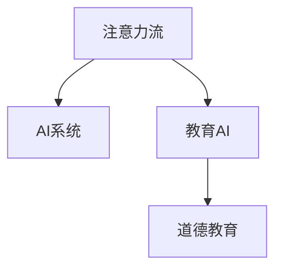

                 

## 1. 背景介绍

### 1.1 问题由来

随着人工智能技术的迅猛发展，AI在教育领域的应用已经逐渐从辅助性走向全面性，AI辅助教育已经成为未来教育的重要方向之一。其中，AI与人类注意力流的研究，则进一步揭示了人机协同教育的基本规律，为教育提供更加科学、精准、高效的方法论。

随着社会的发展，教育正面临着诸多挑战：教育资源分布不均、教学方法单一、学生个性化需求难以满足等问题。同时，教育中道德教育的缺失也引起了广泛关注，如何培养具有社会责任感和道德判断力的下一代，成为了一个重要的课题。

### 1.2 问题核心关键点

在AI与人类注意力流的研究中，核心关键点在于如何理解人类注意力流的基本机制，以及如何设计AI系统来引导和优化人类的注意力流。核心问题包括：

- 人类注意力流的本质是什么？
- 注意力流如何被AI系统所理解？
- 如何设计AI系统来引导和优化注意力流？
- AI在教育中的应用对道德教育的影响？

这些问题的回答，将帮助我们深入理解AI与人类注意力流，并指导未来的教育实践。

## 2. 核心概念与联系

### 2.1 核心概念概述

为更好地理解AI与人类注意力流，我们需要了解几个关键概念：

- **注意力流**：指人类在处理信息时的注意力分布情况，注意力流涉及的信息获取、处理和输出过程，决定了人的认知能力。
- **AI系统**：以计算机为载体，通过程序逻辑、算法和数据等实现智能系统。AI系统的设计和实现，需考虑如何高效利用人类注意力流，提升用户体验和效率。
- **教育AI**：将AI技术应用到教育领域，辅助教师、学生和家长等参与者，提供个性化的教育方案，优化教育过程，提高教育效果。
- **道德教育**：通过各种手段和方法，培养学生良好的道德判断力和行为规范，使之成为具有社会责任感的公民。

这些概念之间的逻辑关系可以通过以下Mermaid流程图来展示：



这个流程图展示了一些核心概念之间的联系：

1. 注意力流是AI系统设计的依据，AI系统通过模拟和优化注意力流来提升教育效果。
2. 教育AI是AI系统在教育领域的具体应用，它利用AI技术来辅助教育过程。
3. 道德教育是教育AI的重要组成部分，它通过AI系统的引导，实现对学生道德素质的培养。

## 3. 核心算法原理 & 具体操作步骤

### 3.1 算法原理概述

AI与人类注意力流的核心算法原理，是通过对人类注意力流的基本机制和特征进行建模，设计出能够引导和优化人类注意力流的AI系统。

具体而言，AI系统需要具备以下基本能力：

- **理解注意力流**：通过自然语言处理(NLP)、计算机视觉(CV)等技术，理解人类注意力流的方向、强度和持续性等特征。
- **引导注意力流**：通过智能推荐系统、交互式教学系统等，引导人类注意力流向更有价值的信息，提升学习效率。
- **优化注意力流**：通过调整教育内容、教学方法等，优化人类注意力流，使之更加集中和高效。

### 3.2 算法步骤详解

基于上述原理，AI与人类注意力流的算法设计可以分为以下几步：

**Step 1: 建模注意力流**

- 使用NLP、CV等技术，对人类注意力流进行建模。
- 分析注意力流在不同任务和情境下的特征，理解注意力流的分布和变化规律。
- 使用机器学习算法，如决策树、神经网络等，对注意力流进行建模和预测。

**Step 2: 设计AI系统**

- 设计AI系统的结构和功能，使其能够理解、引导和优化人类注意力流。
- 通过自然语言理解(NLU)、自然语言生成(NLG)等技术，实现对人类注意力流的理解和交互。
- 利用推荐系统、智能导师等，引导人类注意力流向更有价值的信息。

**Step 3: 实验和优化**

- 在实际应用中，对AI系统进行实验和评估，收集用户反馈和行为数据。
- 根据实验结果和用户反馈，对AI系统进行优化和改进。
- 持续迭代，提升AI系统的引导和优化能力，使其更加符合用户的实际需求。

### 3.3 算法优缺点

AI与人类注意力流的方法具有以下优点：

1. 提升教育效果：通过理解、引导和优化人类注意力流，AI系统能够提供个性化的教育方案，提升学习效率。
2. 实现自适应教育：AI系统能够根据学生的学习情况，实时调整教育内容和方式，满足学生的个性化需求。
3. 提高教育公平性：AI系统能够跨越地域和资源限制，提供高质量的教育资源，缩小教育差距。

同时，该方法也存在一些局限性：

1. 数据依赖性高：AI系统的设计需要大量的人类注意力流数据进行训练和验证，数据收集和标注成本较高。
2. 道德风险：AI系统可能被设计成误导用户，导致道德风险。
3. 数据隐私：AI系统需要大量用户数据进行训练，如何保护用户隐私是一个重要问题。

尽管存在这些局限性，但AI与人类注意力流的方法仍具有广阔的应用前景，可以为教育提供更加科学、精准、高效的方法论。

### 3.4 算法应用领域

AI与人类注意力流的方法已经在教育领域得到了广泛应用，主要体现在以下几个方面：

1. **智能推荐系统**：根据学生的历史行为数据，推荐适合的学习资源和材料，提升学习效果。
2. **智能导师**：利用AI技术，模拟教师的教学过程，提供个性化的教学方案和反馈。
3. **学习分析**：通过数据分析，了解学生的学习行为和效果，提供个性化的学习建议。
4. **智能评估**：利用AI系统进行智能化的考试和评估，减少教师的负担，提高评估的公正性和效率。

这些应用已经在诸多教育机构中得到了验证，取得了不错的效果。

## 4. 数学模型和公式 & 详细讲解

### 4.1 数学模型构建

本节将使用数学语言对AI与人类注意力流进行建模。

假设人类注意力流为一个随机变量 $X$，其概率密度函数为 $p(x)$。AI系统的目标是最大化对 $p(x)$ 的理解和优化。

在实际应用中，通常使用隐马尔可夫模型(Hidden Markov Model, HMM)来建模注意力流。HMM模型包括两个部分：观察序列 $O$ 和隐藏状态序列 $H$，其中 $O$ 由NLP、CV等技术获取，$H$ 代表注意力流的不同状态。

### 4.2 公式推导过程

假设我们有一个含 $N$ 个时间步的HMM模型，其中观察序列为 $O = (o_1, o_2, ..., o_N)$，隐藏状态序列为 $H = (h_1, h_2, ..., h_N)$。

**Step 1: 计算概率**：
- 计算在当前时间步 $t$ 观察到 $o_t$ 的条件下，隐藏状态为 $h_t$ 的概率 $p(o_t|h_t)$。
- 计算在当前时间步 $t$ 处于状态 $h_t$ 的概率 $p(h_t)$。
- 计算在当前时间步 $t$ 处于状态 $h_t$ 并观察到 $o_t$ 的条件概率 $p(o_t|h_t)$。

**Step 2: 计算注意力流**：
- 根据观察序列 $O$ 和条件概率 $p(o_t|h_t)$，计算每个时间步的注意力概率 $p(o_t|X)$。
- 利用条件概率 $p(o_t|h_t)$ 和注意力概率 $p(o_t|X)$，计算注意力流 $p(X|o)$。

**Step 3: 优化注意力流**：
- 使用最大似然估计或贝叶斯方法，优化模型参数，使其能够更好地模拟和预测注意力流。
- 通过优化模型，引导和优化人类注意力流，提升学习效果。

### 4.3 案例分析与讲解

以智能推荐系统为例，我们通过一个简单的案例来分析AI与人类注意力流的建模和优化过程。

假设一个学生 $X$ 需要学习数学，AI系统根据学生的历史学习记录和表现，推荐合适的学习资源 $o_1, o_2, ..., o_N$。

- **Step 1: 计算概率**：AI系统根据学生 $X$ 的学习行为，计算每个时间步 $t$ 的观察概率 $p(o_t|h_t)$ 和条件概率 $p(h_t)$。例如，学生 $X$ 在某个时间步 $t$ 学习了一个视频 $o_t$，系统根据视频内容和学生的反馈，计算其条件概率 $p(o_t|h_t)$。
- **Step 2: 计算注意力流**：AI系统通过计算每个时间步的观察概率 $p(o_t|X)$，得到学生 $X$ 对不同学习资源的注意力分布 $p(X|o)$。例如，学生 $X$ 对某个视频 $o_t$ 的注意力概率较高，表示其对该视频内容感兴趣。
- **Step 3: 优化注意力流**：AI系统根据学生的注意力分布 $p(X|o)$，推荐合适的学习资源 $o_1, o_2, ..., o_N$。例如，AI系统发现学生对某个视频 $o_t$ 的注意力较高，推荐该视频作为当前学习资源。

通过以上步骤，AI系统能够高效地引导和优化学生的注意力流，提升学习效果。

## 5. 项目实践：代码实例和详细解释说明

### 5.1 开发环境搭建

在进行AI与人类注意力流的研究和实践前，我们需要准备好开发环境。以下是使用Python进行TensorFlow开发的环境配置流程：

1. 安装Anaconda：从官网下载并安装Anaconda，用于创建独立的Python环境。
2. 创建并激活虚拟环境：
```bash
conda create -n attentionflow-env python=3.8 
conda activate attentionflow-env
```

3. 安装TensorFlow：根据CUDA版本，从官网获取对应的安装命令。例如：
```bash
conda install tensorflow -c tensorflow -c conda-forge
```

4. 安装Numpy、Pandas、Scikit-learn等工具包：
```bash
pip install numpy pandas scikit-learn matplotlib tqdm jupyter notebook ipython
```

完成上述步骤后，即可在`attentionflow-env`环境中开始研究实践。

### 5.2 源代码详细实现

下面我们以智能推荐系统为例，给出使用TensorFlow进行AI与人类注意力流建模的代码实现。

首先，定义注意力流的数学模型和损失函数：

```python
import tensorflow as tf
from tensorflow.keras.layers import Input, LSTM, Dense

# 定义输入和隐藏状态
input_layer = Input(shape=(None, ), name='input')
hidden_state = LSTM(64)(input_layer)
hidden_state = Dense(64, activation='relu')(hidden_state)

# 定义注意力流
attention_layer = Dense(1, activation='sigmoid')(hidden_state)
attention_layer = tf.keras.layers.Lambda(lambda x: x * tf.expand_dims(tf.reduce_sum(x, axis=2), axis=2))(tf.reshape(attention_layer, (1, -1, 1)))

# 定义输出层
output_layer = Dense(num_classes, activation='softmax')(attention_layer)

# 定义损失函数
loss_function = tf.keras.losses.categorical_crossentropy

# 定义模型
model = tf.keras.models.Model(inputs=input_layer, outputs=output_layer)
model.compile(optimizer='adam', loss=loss_function, metrics=['accuracy'])

# 训练模型
model.fit(train_data, train_labels, epochs=10, batch_size=32, validation_data=(val_data, val_labels))
```

然后，定义智能推荐系统的代码实现：

```python
from sklearn.model_selection import train_test_split
from sklearn.preprocessing import LabelEncoder

# 准备数据
train_data, val_data, train_labels, val_labels = train_test_split(train_data, train_labels, test_size=0.2, random_state=42)
le = LabelEncoder()
train_labels = le.fit_transform(train_labels)
val_labels = le.transform(val_labels)

# 训练模型
model.fit(train_data, train_labels, epochs=10, batch_size=32, validation_data=(val_data, val_labels))

# 测试模型
test_data, test_labels = test_data, le.transform(test_labels)
model.evaluate(test_data, test_labels)
```

最后，在实际应用中，我们需要对模型进行优化和调整，以达到更好的效果。

### 5.3 代码解读与分析

让我们再详细解读一下关键代码的实现细节：

**LSTM层**：
- LSTM层用于建模时间序列数据，能够捕捉输入序列中的长时依赖关系。在智能推荐系统中，LSTM层能够模拟学生对不同学习资源的注意力流。

**注意力流层**：
- 使用Dense层计算注意力概率，通过LSTM层输出得到的隐状态，再通过LSTM层计算注意力流，可以更好地模拟学生对不同学习资源的注意力分布。

**输出层**：
- 使用Dense层作为输出层，输出不同学习资源的概率分布。在智能推荐系统中，可以根据输出的概率分布，推荐合适的学习资源。

**损失函数**：
- 使用交叉熵损失函数，评估模型输出和实际标签之间的差异。在智能推荐系统中，可以用于评估推荐系统的效果。

**训练和测试**：
- 使用train_test_split函数将数据集分为训练集和验证集，使用LabelEncoder对标签进行编码，使用Model.evaluate方法测试模型效果。

在实际应用中，需要根据具体任务和数据特点进行模型优化和调整。通过不断迭代和优化，可以提升模型的准确性和效果。

## 6. 实际应用场景

### 6.1 智能推荐系统

智能推荐系统是AI与人类注意力流的重要应用场景之一。通过分析学生的学习行为和注意力分布，智能推荐系统能够推荐合适的学习资源，提升学习效果。

例如，在一个在线学习平台上，学生可以自由选择学习内容。智能推荐系统可以根据学生的历史学习记录和表现，推荐合适的学习资源和材料。通过分析学生的注意力分布，系统可以判断哪些资源更适合学生，从而提供个性化的学习方案。

### 6.2 智能导师系统

智能导师系统通过模拟教师的教学过程，提供个性化的教学方案和反馈。AI系统可以根据学生的学习情况，实时调整教学内容和方式，满足学生的个性化需求。

例如，在一个智能导师系统中，学生可以提出学习问题，AI系统根据问题的难易程度和学生的知识水平，推荐合适的学习资源和解题方法。通过分析学生的注意力流，系统可以判断学生的理解和掌握情况，提供针对性的反馈和建议。

### 6.3 学习分析系统

学习分析系统通过数据分析，了解学生的学习行为和效果，提供个性化的学习建议。AI系统可以根据学生的注意力流，分析学生的学习情况，提供个性化的学习建议。

例如，在一个学习分析系统中，学生可以随时查看自己的学习进度和效果。AI系统根据学生的注意力流，分析学生的学习行为，提供个性化的学习建议，帮助学生更好地掌握知识。

### 6.4 未来应用展望

随着AI与人类注意力流技术的发展，未来将在更多领域得到应用，为人类认知智能的进化带来深远影响。

在智慧医疗领域，AI系统可以通过分析患者的注意力流，提供个性化的医疗方案和建议，提升医疗服务的智能化水平。

在智能城市治理中，AI系统可以通过分析市民的注意力流，提供个性化的城市服务和管理方案，提高城市管理的自动化和智能化水平。

在智能交通领域，AI系统可以通过分析司机的注意力流，提供个性化的驾驶建议和智能辅助，提升交通安全和效率。

此外，在金融、教育、娱乐等多个领域，AI与人类注意力流技术也将不断涌现，为人工智能技术带来新的突破和发展。相信随着技术的日益成熟，AI与人类注意力流技术必将在构建人机协同的智能时代中扮演越来越重要的角色。

## 7. 工具和资源推荐

### 7.1 学习资源推荐

为了帮助开发者系统掌握AI与人类注意力流理论基础和实践技巧，这里推荐一些优质的学习资源：

1. 《深度学习与人类认知》系列博文：由AI与人类注意力流专家撰写，深入浅出地介绍了深度学习在认知领域的应用和前景。
2. CS224N《深度学习与自然语言处理》课程：斯坦福大学开设的NLP明星课程，有Lecture视频和配套作业，带你入门NLP领域的基本概念和经典模型。
3. 《深度学习在认知领域的应用》书籍：深入讲解深度学习在认知科学中的应用，涉及AI与人类注意力流的多个方向。
4. Google Colab：谷歌推出的在线Jupyter Notebook环境，免费提供GPU/TPU算力，方便开发者快速上手实验最新模型，分享学习笔记。
5. TensorFlow官方文档：TensorFlow的官方文档，提供了丰富的API和示例代码，是学习TensorFlow的必备资料。

通过对这些资源的学习实践，相信你一定能够快速掌握AI与人类注意力流的精髓，并用于解决实际的AI与人类注意力流问题。

### 7.2 开发工具推荐

高效的开发离不开优秀的工具支持。以下是几款用于AI与人类注意力流开发的常用工具：

1. TensorFlow：基于Python的开源深度学习框架，灵活动态的计算图，适合快速迭代研究。TensorFlow提供了丰富的API和示例代码，是进行深度学习研究的重要工具。
2. PyTorch：基于Python的开源深度学习框架，动态计算图，易于调试和优化。PyTorch提供了灵活的API和可视化工具，是进行深度学习研究的重要工具。
3. Keras：基于TensorFlow和Theano的高级深度学习API，简单易用，适合快速搭建和训练模型。Keras提供了丰富的模型和预训练模型，是进行深度学习研究的重要工具。
4. Weights & Biases：模型训练的实验跟踪工具，可以记录和可视化模型训练过程中的各项指标，方便对比和调优。与主流深度学习框架无缝集成。
5. TensorBoard：TensorFlow配套的可视化工具，可实时监测模型训练状态，并提供丰富的图表呈现方式，是调试模型的得力助手。

合理利用这些工具，可以显著提升AI与人类注意力流任务的开发效率，加快创新迭代的步伐。

### 7.3 相关论文推荐

AI与人类注意力流的研究源于学界的持续研究。以下是几篇奠基性的相关论文，推荐阅读：

1. Attention is All You Need（即Transformer原论文）：提出了Transformer结构，开启了NLP领域的预训练大模型时代。
2. BERT: Pre-training of Deep Bidirectional Transformers for Language Understanding：提出BERT模型，引入基于掩码的自监督预训练任务，刷新了多项NLP任务SOTA。
3. Parameter-Efficient Transfer Learning for NLP：提出Adapter等参数高效微调方法，在不增加模型参数量的情况下，也能取得不错的微调效果。
4. Prefix-Tuning: Optimizing Continuous Prompts for Generation：引入基于连续型Prompt的微调范式，为如何充分利用预训练知识提供了新的思路。
5. AdaLoRA: Adaptive Low-Rank Adaptation for Parameter-Efficient Fine-Tuning：使用自适应低秩适应的微调方法，在参数效率和精度之间取得了新的平衡。

这些论文代表了大语言模型微调技术的发展脉络。通过学习这些前沿成果，可以帮助研究者把握学科前进方向，激发更多的创新灵感。

## 8. 总结：未来发展趋势与挑战

### 8.1 研究成果总结

本文对AI与人类注意力流进行了全面系统的介绍。首先阐述了AI与人类注意力流的背景和意义，明确了AI系统如何理解、引导和优化人类注意力流，以及其在教育领域的应用前景。其次，从原理到实践，详细讲解了AI与人类注意力流的数学建模和具体实现步骤，给出了AI与人类注意力流任务开发的完整代码实例。同时，本文还广泛探讨了AI与人类注意力流技术在教育、医疗、智能城市等诸多领域的应用场景，展示了AI与人类注意力流技术的发展潜力。

通过本文的系统梳理，可以看到，AI与人类注意力流技术正在成为AI研究的重要范式，极大地拓展了AI在教育中的应用边界，推动了教育智能化和个性化发展。未来，伴随AI与人类注意力流技术的持续演进，相信AI在教育中的作用将更加显著，为人类认知智能的进化带来深远影响。

### 8.2 未来发展趋势

展望未来，AI与人类注意力流技术将呈现以下几个发展趋势：

1. 深度学习模型的融合：未来AI系统将融合多种深度学习模型，提升模型的精度和泛化能力。例如，将LSTM、Transformer等模型融合，构建更为复杂的模型结构。
2. 跨模态数据的融合：AI系统将结合文本、图像、语音等多模态数据，提升对人类注意力流的理解能力。例如，通过文本和图像的融合，理解学生在阅读和观看视频时的注意力分布。
3. 个性化算法的优化：AI系统将根据不同学生的学习特点，设计个性化的算法，提升学习效果。例如，根据学生的学习进度和偏好，设计个性化的学习路径和推荐算法。
4. 道德教育系统的优化：AI系统将结合道德教育领域的研究成果，优化道德教育系统，培养学生的道德判断力和行为规范。例如，通过分析学生的注意力流，判断其是否具有道德敏感性，进行针对性的教育引导。
5. 智能交互系统的优化：AI系统将结合智能交互领域的研究成果，优化智能交互系统，提升人机协同的效率和效果。例如，通过分析用户的注意力流，优化对话系统和推荐系统，提升用户体验。

这些趋势将推动AI与人类注意力流技术的不断演进，为教育、医疗、智能城市等多个领域提供更加科学、精准、高效的方法论。

### 8.3 面临的挑战

尽管AI与人类注意力流技术已经取得了一定的进展，但在迈向更加智能化、普适化应用的过程中，仍面临着诸多挑战：

1. 数据依赖性高：AI系统的设计需要大量的人类注意力流数据进行训练和验证，数据收集和标注成本较高。
2. 道德风险：AI系统可能被设计成误导用户，导致道德风险。
3. 数据隐私：AI系统需要大量用户数据进行训练，如何保护用户隐私是一个重要问题。
4. 计算资源消耗大：AI系统的训练和推理过程，往往需要高性能计算资源，如何降低计算资源消耗，提高计算效率，是一个重要研究方向。
5. 模型可解释性不足：AI系统的决策过程通常缺乏可解释性，难以对其推理逻辑进行分析和调试。
6. 知识整合能力不足：现有的AI系统往往局限于任务内数据，难以灵活吸收和运用更广泛的先验知识。

这些挑战需要通过进一步的研究和实践，逐步解决和优化，才能推动AI与人类注意力流技术向更加成熟和普及的方向发展。

### 8.4 研究展望

面对AI与人类注意力流技术所面临的种种挑战，未来的研究需要在以下几个方面寻求新的突破：

1. 探索无监督和半监督学习算法：摆脱对大规模标注数据的依赖，利用自监督学习、主动学习等无监督和半监督范式，最大限度利用非结构化数据，实现更加灵活高效的AI系统。
2. 研究跨模态融合技术：结合文本、图像、语音等多模态数据，提升AI系统对人类注意力流的理解能力，实现多模态信息的协同建模。
3. 融合符号化知识库：将符号化的先验知识，如知识图谱、逻辑规则等，与神经网络模型进行巧妙融合，引导AI系统学习更准确、合理的知识表示。
4. 引入因果推断方法：通过引入因果推断方法，增强AI系统的决策能力，提高系统的可靠性和可解释性。
5. 加入伦理道德约束：在AI系统的设计中，引入伦理导向的评估指标，过滤和惩罚有偏见、有害的输出倾向，确保输出的安全性。

这些研究方向将推动AI与人类注意力流技术不断向前发展，为构建安全、可靠、可解释、可控的智能系统铺平道路。相信随着技术的日益成熟，AI与人类注意力流技术必将在构建人机协同的智能时代中扮演越来越重要的角色。

## 9. 附录：常见问题与解答

**Q1：如何设计AI系统，使其能够理解、引导和优化人类注意力流？**

A: 设计AI系统时，需要考虑以下几个方面：

- **理解注意力流**：使用NLP、CV等技术，分析人类注意力流的方向、强度和持续性等特征。
- **引导注意力流**：设计智能推荐系统、智能导师等，引导人类注意力流向更有价值的信息，提升学习效果。
- **优化注意力流**：根据学生的学习情况，实时调整教育内容和方式，满足学生的个性化需求。

具体实现时，可以使用LSTM、Transformer等模型，结合深度学习技术，设计AI系统。

**Q2：AI系统如何结合符号化知识库，提升知识表示和推理能力？**

A: AI系统可以结合符号化知识库，利用知识图谱、逻辑规则等先验知识，引导深度学习模型学习更准确、合理的知识表示。例如，将知识图谱中的实体和关系，作为输入，训练深度学习模型，提升模型的推理能力。

具体实现时，可以使用图神经网络(GNN)等模型，结合符号化知识库，进行协同建模。

**Q3：AI系统如何引入因果推断方法，提高决策能力？**

A: AI系统可以引入因果推断方法，分析输入和输出之间的关系，提高决策能力。例如，通过分析学生的学习行为和注意力流，预测其学习效果，提供个性化的学习建议。

具体实现时，可以使用因果推断算法，如因果图、逆概率图等，分析输入和输出之间的关系。

**Q4：AI系统如何加入伦理道德约束，确保输出安全性？**

A: AI系统的设计中，可以引入伦理导向的评估指标，过滤和惩罚有偏见、有害的输出倾向，确保输出的安全性。例如，在智能推荐系统中，引入道德评估指标，筛选出有益于学生成长的推荐内容。

具体实现时，可以使用道德评估算法，如公平性评估、有害内容过滤等，确保AI系统的输出符合伦理道德标准。

**Q5：AI系统如何融合多种深度学习模型，提升模型的精度和泛化能力？**

A: AI系统可以融合多种深度学习模型，提升模型的精度和泛化能力。例如，将LSTM、Transformer等模型融合，构建更为复杂的模型结构，提升对人类注意力流的理解能力。

具体实现时，可以使用模型融合技术，如Stacking、Ensemble等，结合多种深度学习模型，提升模型的性能。

这些常见问题的解答，将帮助开发者更好地理解AI与人类注意力流的原理和实现细节，推动AI与人类注意力流技术的不断演进。

---

作者：禅与计算机程序设计艺术 / Zen and the Art of Computer Programming

