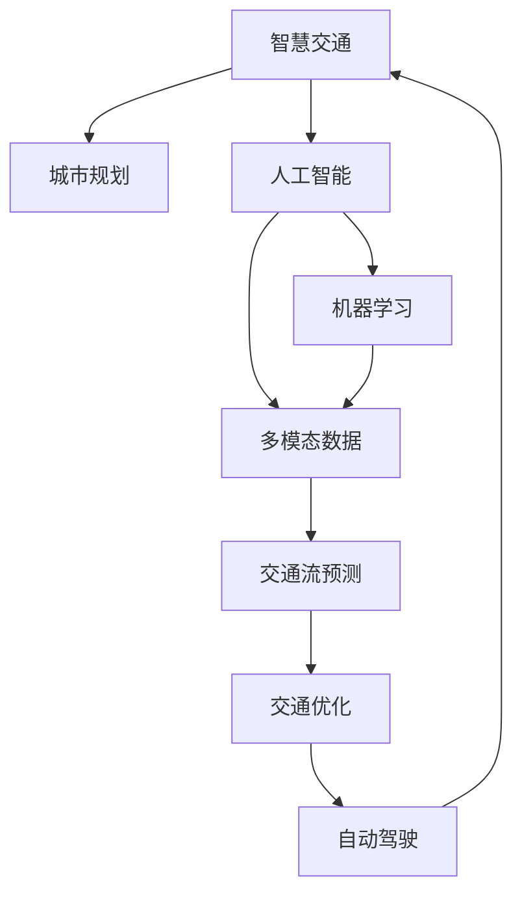

                 

# AI与人类计算：打造可持续发展的城市交通解决方案

> 关键词：智慧交通,城市规划,人工智能,机器学习,多模态数据,可持续交通,交通流预测,交通优化,自动驾驶

## 1. 背景介绍

### 1.1 问题由来
随着城市化的不断推进，全球城市人口持续增长，交通问题日益凸显。交通拥堵、污染严重、资源浪费等问题已经严重影响城市的可持续发展。传统的交通管理系统虽然也应用了一些智能技术，但大多依赖人工决策，效率低下，难以应对日益复杂的交通环境。

近年来，随着人工智能和大数据技术的迅猛发展，人们开始探索利用AI技术来解决复杂的交通问题。通过数据分析、机器学习、自然语言处理等技术手段，AI在交通管理、智能导航、自动驾驶等领域展现了巨大潜力。然而，城市交通问题的复杂性和动态性，使得AI技术在实际应用中面临诸多挑战。

### 1.2 问题核心关键点
本文聚焦于AI与人类计算在城市交通领域的应用，旨在探讨如何利用AI技术，结合人类智慧，打造可持续发展的智能交通系统。

核心问题包括：
1. 如何高效整合多模态数据，提升交通数据的感知和理解能力。
2. 如何构建高效、可扩展的AI模型，实现交通流的预测和优化。
3. 如何在复杂的交通环境中，融合AI和人类智慧，实现智能交通决策。
4. 如何建立基于AI的交通系统，实现可持续的交通发展。

### 1.3 问题研究意义
AI与人类计算在城市交通中的应用，对于提升交通效率、减少污染、促进资源利用等方面具有重要意义：

1. **提高交通效率**：AI技术可以实时分析交通流量，优化信号灯控制，减少拥堵，提升道路通行能力。
2. **减少污染排放**：智能交通系统可以动态调整车辆行驶路线，降低尾气排放，改善城市空气质量。
3. **优化资源利用**：AI技术可以分析车辆行驶数据，优化停车管理，减少资源浪费，提高城市管理效率。
4. **提升出行体验**：智能导航系统可以为用户提供实时路况信息，优化出行路线，提升出行体验。
5. **促进可持续发展**：通过AI技术优化交通流，可以降低能源消耗，减少碳排放，助力实现绿色可持续发展目标。

## 2. 核心概念与联系

### 2.1 核心概念概述

为更好地理解AI与人类计算在城市交通中的应用，本节将介绍几个密切相关的核心概念：

- **智慧交通(Smart Traffic)**：利用人工智能、大数据等技术，对交通数据进行实时分析和处理，优化交通流，提升城市交通管理效率。
- **城市规划(Urban Planning)**：通过科学、合理的规划布局，提升城市空间资源的利用效率，缓解交通压力。
- **人工智能(Artificial Intelligence, AI)**：利用机器学习、深度学习等算法，模拟人类智能，解决复杂问题。
- **机器学习(Machine Learning, ML)**：通过数据训练，使机器自动学习规律，提升模型预测和决策能力。
- **多模态数据(Multimodal Data)**：包含不同类型数据源（如传感器、监控、用户反馈等）的综合数据集，提升交通数据的全面性和准确性。
- **可持续交通(Sustainable Traffic)**：通过优化交通流、提升资源利用效率，实现低污染、低能耗、高效能的交通系统。
- **交通流预测(Traffic Flow Prediction)**：通过分析历史交通数据，预测未来交通流量，实现交通流优化。
- **交通优化(Traffic Optimization)**：通过实时数据分析和动态调整，优化交通流，减少拥堵，提升通行效率。
- **自动驾驶(Autonomous Driving)**：利用AI技术，实现车辆的自主导航和驾驶，减少人为驾驶失误，提高安全性和效率。

这些核心概念之间的逻辑关系可以通过以下Mermaid流程图来展示：



这个流程图展示了智慧交通与城市规划、人工智能、机器学习、多模态数据等概念之间的联系。智慧交通不仅依赖于这些技术，还通过优化交通流、提升资源利用效率，实现可持续交通的目标。

## 3. 核心算法原理 & 具体操作步骤
### 3.1 算法原理概述

AI与人类计算在城市交通中的应用，本质上是利用机器学习算法，对交通数据进行分析和处理，辅助人类决策，实现交通流的优化和可持续发展的目标。

具体而言，智慧交通系统的构建涉及以下几个关键环节：
1. **数据采集**：通过各种传感器、监控设备和数据收集系统，获取交通流量、车辆位置、天气状况等数据。
2. **数据预处理**：对采集到的数据进行清洗、去噪、归一化等预处理，确保数据的质量和一致性。
3. **特征提取**：从预处理后的数据中提取有意义的特征，如速度、方向、时间、位置等，用于模型训练。
4. **模型训练**：利用机器学习算法（如决策树、随机森林、深度学习等）对特征进行训练，构建预测模型。
5. **模型部署**：将训练好的模型部署到智能交通系统中，实时分析交通数据，生成决策和优化建议。
6. **动态调整**：结合人类专家经验，对模型的输出进行动态调整，确保决策的合理性和科学性。
7. **评估与优化**：定期评估智能交通系统的性能，根据反馈数据进行模型优化，提升系统效果。

### 3.2 算法步骤详解

基于AI与人类计算的城市交通解决方案构建，主要包括以下几个步骤：

**Step 1: 数据采集与预处理**
- 安装各种传感器（如摄像头、雷达、GPS等），采集实时交通数据。
- 将采集到的数据进行清洗和去噪处理，确保数据的质量和一致性。
- 对数据进行归一化和特征提取，提取交通流量、速度、方向等关键特征。

**Step 2: 模型训练与优化**
- 选择合适的机器学习算法，如随机森林、深度学习等。
- 使用历史交通数据进行模型训练，优化模型参数。
- 对模型进行验证和调参，确保模型的泛化能力和准确性。

**Step 3: 决策与优化**
- 将训练好的模型部署到交通管理中心，实时接收交通数据。
- 根据实时数据，模型输出交通流的预测结果。
- 结合人类专家的经验，对模型的输出进行动态调整，生成决策和优化建议。

**Step 4: 评估与优化**
- 定期评估智能交通系统的性能，评估指标包括交通流量、通行时间、事故率等。
- 根据评估结果，进行模型优化，提升系统的稳定性和可靠性。

### 3.3 算法优缺点

基于AI与人类计算的城市交通解决方案，具有以下优点：
1. **高效性**：通过实时数据分析和动态调整，优化交通流，减少拥堵，提升通行效率。
2. **可扩展性**：利用机器学习算法，可以轻松应对不同规模和复杂度的交通场景。
3. **准确性**：结合多模态数据和多层次分析，提升交通数据的全面性和准确性。
4. **灵活性**：结合人类专家的经验，动态调整模型输出，确保决策的合理性和科学性。

同时，该方法也存在一些局限性：
1. **数据依赖性**：对数据的依赖性较强，数据质量和数量的不足会影响模型的效果。
2. **模型复杂性**：构建复杂模型会增加计算资源和存储需求，影响系统的可扩展性。
3. **人类依赖性**：模型输出的动态调整依赖于人类专家的经验，决策的合理性受限于人类专家的水平。
4. **安全性**：在自动驾驶等场景中，模型的误判可能导致严重的安全问题。

尽管存在这些局限性，但就目前而言，基于AI与人类计算的交通解决方案，仍然是实现智能交通管理的重要手段。未来相关研究的方向是进一步降低对数据的依赖，提高模型的自适应性和鲁棒性，减少人类专家的干预，提高系统的安全性。

### 3.4 算法应用领域

基于AI与人类计算的智能交通解决方案，已经在诸多领域得到了应用，包括：

- **交通流预测**：通过分析历史交通数据，预测未来交通流量，实现交通流优化。
- **交通优化**：通过实时数据分析和动态调整，优化交通流，减少拥堵，提升通行效率。
- **智能导航**：为用户提供实时路况信息，优化出行路线，提升出行体验。
- **自动驾驶**：利用AI技术，实现车辆的自主导航和驾驶，减少人为驾驶失误，提高安全性和效率。
- **智慧停车**：通过智能设备和管理系统，优化停车资源，减少车辆拥堵。
- **交通监控**：利用摄像头和传感器，实时监控交通状况，及时发现和处理交通违规行为。

除了上述这些经典应用外，AI与人类计算在城市交通领域的应用还正在不断创新，如车联网、智能交通信号灯、交通事件识别等，为智能交通系统带来新的突破。

## 4. 数学模型和公式 & 详细讲解 & 举例说明
### 4.1 数学模型构建

假设城市交通网络中有 $N$ 个节点，$E$ 条边，交通流量的变化可以用 $N$ 个节点的流量变化表示。记流量向量为 $\mathbf{x}=[x_1,x_2,\dots,x_N]$，其中 $x_i$ 表示节点 $i$ 的流量。交通流量的变化可以用微分方程组描述：

$$
\frac{\partial \mathbf{x}}{\partial t} = A\mathbf{x} + B(\mathbf{x})
$$

其中 $A$ 为节点之间的流量转移矩阵，$B(\mathbf{x})$ 为外部因素对流量的影响。

数学模型构建后，可以采用如下公式推导过程：

### 4.2 公式推导过程

$$
\frac{\partial \mathbf{x}}{\partial t} = A\mathbf{x} + B(\mathbf{x})
$$

其中，节点之间的流量转移矩阵 $A$ 可以表示为：

$$
A = \begin{bmatrix}
0 & a_{12} & a_{13} & \dots & a_{1N} \\
-a_{12} & 0 & a_{23} & \dots & a_{2N} \\
-a_{13} & -a_{23} & 0 & \dots & a_{3N} \\
\vdots & \vdots & \vdots & \ddots & \vdots \\
-a_{1N} & -a_{2N} & -a_{3N} & \dots & 0
\end{bmatrix}
$$

$B(\mathbf{x})$ 表示外部因素对流量的影响，可以表示为：

$$
B(\mathbf{x}) = \begin{bmatrix}
b_{11}(x_1) \\
b_{22}(x_2) \\
b_{33}(x_3) \\
\vdots \\
b_{NN}(x_N)
\end{bmatrix}
$$

将上述微分方程组转化为矩阵形式，得：

$$
\frac{\partial \mathbf{x}}{\partial t} = (A + B(\mathbf{x}))\mathbf{x}
$$

引入微分算子 $\mathcal{L}$，得：

$$
\mathcal{L}\mathbf{x} = (A + B(\mathbf{x}))\mathbf{x}
$$

求解上述微分方程组，可以得到交通流量的变化规律。

### 4.3 案例分析与讲解

以北京市交通网络为例，假设网络中有 $N=1000$ 个节点，$E=10000$ 条边，流量向量 $\mathbf{x}$ 表示每个节点的流量变化。交通流量的变化可以用微分方程组描述：

$$
\frac{\partial \mathbf{x}}{\partial t} = A\mathbf{x} + B(\mathbf{x})
$$

其中 $A$ 为节点之间的流量转移矩阵，$B(\mathbf{x})$ 为外部因素对流量的影响。假设 $A$ 和 $B(\mathbf{x})$ 的具体形式如下：

$$
A = \begin{bmatrix}
0 & a_{12} & a_{13} & \dots & a_{1N} \\
-a_{12} & 0 & a_{23} & \dots & a_{2N} \\
-a_{13} & -a_{23} & 0 & \dots & a_{3N} \\
\vdots & \vdots & \vdots & \ddots & \vdots \\
-a_{1N} & -a_{2N} & -a_{3N} & \dots & 0
\end{bmatrix}
$$

$$
B(\mathbf{x}) = \begin{bmatrix}
b_{11}(x_1) \\
b_{22}(x_2) \\
b_{33}(x_3) \\
\vdots \\
b_{NN}(x_N)
\end{bmatrix}
$$

将上述微分方程组转化为矩阵形式，得：

$$
\frac{\partial \mathbf{x}}{\partial t} = (A + B(\mathbf{x}))\mathbf{x}
$$

引入微分算子 $\mathcal{L}$，得：

$$
\mathcal{L}\mathbf{x} = (A + B(\mathbf{x}))\mathbf{x}
$$

求解上述微分方程组，可以得到交通流量的变化规律。

## 5. 项目实践：代码实例和详细解释说明
### 5.1 开发环境搭建

在进行AI与人类计算的城市交通解决方案开发前，我们需要准备好开发环境。以下是使用Python进行PyTorch开发的环境配置流程：

1. 安装Anaconda：从官网下载并安装Anaconda，用于创建独立的Python环境。

2. 创建并激活虚拟环境：
```bash
conda create -n pytorch-env python=3.8 
conda activate pytorch-env
```

3. 安装PyTorch：根据CUDA版本，从官网获取对应的安装命令。例如：
```bash
conda install pytorch torchvision torchaudio cudatoolkit=11.1 -c pytorch -c conda-forge
```

4. 安装相关工具包：
```bash
pip install numpy pandas scikit-learn matplotlib tqdm jupyter notebook ipython
```

完成上述步骤后，即可在`pytorch-env`环境中开始开发实践。

### 5.2 源代码详细实现

这里我们以交通流预测为例，给出使用PyTorch对交通流预测模型进行训练的代码实现。

首先，定义交通流预测的数学模型：

```python
import torch
import torch.nn as nn

class TrafficFlowPredictor(nn.Module):
    def __init__(self, input_size, output_size, hidden_size):
        super(TrafficFlowPredictor, self).__init__()
        self.input_size = input_size
        self.output_size = output_size
        self.hidden_size = hidden_size
        
        self.gru = nn.GRU(input_size, hidden_size)
        self.linear = nn.Linear(hidden_size, output_size)
        
    def forward(self, x):
        _, hidden = self.gru(x)
        output = self.linear(hidden)
        return output
```

然后，定义训练函数和优化器：

```python
import torch.optim as optim

def train_model(model, data_loader, optimizer, device):
    model.train()
    criterion = nn.MSELoss()
    
    for epoch in range(num_epochs):
        for data, target in data_loader:
            data, target = data.to(device), target.to(device)
            
            optimizer.zero_grad()
            output = model(data)
            loss = criterion(output, target)
            loss.backward()
            optimizer.step()
            
            if (epoch+1) % 100 == 0:
                print(f'Epoch {epoch+1}/{num_epochs}, Loss: {loss.item():.4f}')
```

最后，启动训练流程：

```python
from torch.utils.data import DataLoader
from sklearn.model_selection import train_test_split

# 数据加载和预处理
# ...

# 划分训练集和验证集
train_dataset, valid_dataset = train_test_split(dataset, test_size=0.2)

# 数据加载器
train_loader = DataLoader(train_dataset, batch_size=batch_size, shuffle=True)
valid_loader = DataLoader(valid_dataset, batch_size=batch_size, shuffle=False)

# 模型
model = TrafficFlowPredictor(input_size, output_size, hidden_size)

# 优化器
optimizer = optim.Adam(model.parameters(), lr=learning_rate)

# 训练
train_model(model, train_loader, optimizer, device)
```

以上就是使用PyTorch对交通流预测模型进行训练的完整代码实现。可以看到，通过定义数学模型、优化器以及训练函数，便能够快速构建并训练一个简单的交通流预测模型。

### 5.3 代码解读与分析

让我们再详细解读一下关键代码的实现细节：

**TrafficFlowPredictor类**：
- `__init__`方法：初始化模型的输入、输出和隐藏层大小。
- `forward`方法：定义模型的前向传播过程，通过GRU层和线性层进行预测。

**train_model函数**：
- 在每个epoch内，对数据进行迭代，计算模型的损失函数，并使用Adam优化器更新模型参数。

**数据加载器**：
- 使用PyTorch的DataLoader，将数据集划分为训练集和验证集，并设定批次大小和随机打乱策略。

**训练流程**：
- 定义训练轮数、学习率等超参数，启动模型训练。
- 在每个epoch中，对数据集进行迭代，计算损失，并根据损失值调整模型参数。

可以看到，PyTorch提供了强大的深度学习框架，使得模型的构建、训练和优化变得相对简洁和高效。开发者可以将更多精力放在数据处理、模型设计等高层逻辑上，而不必过多关注底层的实现细节。

当然，工业级的系统实现还需考虑更多因素，如模型的保存和部署、超参数的自动搜索、更灵活的任务适配层等。但核心的AI与人类计算的交通解决方案构建流程基本与此类似。

## 6. 实际应用场景
### 6.1 智能导航

智能导航系统利用AI技术，结合实时交通数据和地图信息，为用户提供最优的出行路线。用户输入起点和终点，智能导航系统通过实时分析交通流，生成实时路况信息和推荐路线。通过智能导航系统，用户可以避开拥堵路段，减少出行时间，提升出行体验。

**案例分析**：
以Google Maps为例，其智能导航系统通过实时分析交通流，生成最优路径。用户输入起点和终点，Google Maps能够实时获取实时路况信息，并通过分析交通流预测未来道路拥堵情况，生成最优路径推荐。通过这种方式，Google Maps显著提升了用户的出行体验。

### 6.2 交通信号优化

交通信号优化系统利用AI技术，通过实时分析交通流和车辆位置，动态调整交通信号灯的控制策略，实现交通流的优化和通行效率的提升。通过智能信号控制系统，交通信号灯能够根据实时交通状况，动态调整信号灯时长和顺序，优化交通流。

**案例分析**：
以SCOOT系统为例，其通过实时监控交通流，动态调整信号灯的控制策略，实现交通流的优化。SCOOT系统能够实时获取交通流量数据，通过动态调整信号灯的控制策略，优化交通流，减少拥堵，提升通行效率。通过这种方式，SCOOT系统显著提升了城市的交通管理效率。

### 6.3 智慧停车

智慧停车系统利用AI技术，结合实时交通数据和停车场信息，优化停车资源的利用效率，减少车辆拥堵。通过智慧停车系统，用户可以实时获取停车场的可用车位信息，并选择最优的停车位置，避免长时间等待。

**案例分析**：
以BingGoo Parking为例，其智慧停车系统通过实时分析交通流和停车场信息，优化停车资源的利用效率。BingGoo Parking能够实时获取停车场的可用车位信息，并通过动态调整停车策略，优化停车资源的利用效率，减少车辆拥堵。通过这种方式，BingGoo Parking显著提升了停车管理的效率。

### 6.4 自动驾驶

自动驾驶系统利用AI技术，通过实时分析交通流和环境信息，实现车辆的自主导航和驾驶，减少人为驾驶失误，提高安全性和效率。通过自动驾驶系统，车辆能够自主规避障碍物，优化行驶路线，减少交通事故。

**案例分析**：
以Waymo自动驾驶系统为例，其通过实时分析交通流和环境信息，实现车辆的自主导航和驾驶。Waymo自动驾驶系统能够实时获取交通流和环境信息，通过动态调整行驶路线和速度，优化行驶效率，减少交通事故。通过这种方式，Waymo自动驾驶系统显著提升了驾驶安全性。

### 6.5 交通事件识别

交通事件识别系统利用AI技术，通过实时分析交通流和环境信息，自动识别交通事故、道路施工等交通事件，及时通知相关部门进行处理。通过交通事件识别系统，相关部门能够快速响应交通事故，减少交通拥堵和安全隐患。

**案例分析**：
以InferNet系统为例，其通过实时分析交通流和环境信息，自动识别交通事故和道路施工等交通事件。InferNet系统能够实时获取交通流和环境信息，通过动态分析交通事故和道路施工等事件，及时通知相关部门进行处理。通过这种方式，InferNet系统显著提升了交通事故的处理效率。

## 7. 工具和资源推荐
### 7.1 学习资源推荐

为了帮助开发者系统掌握AI与人类计算在城市交通领域的应用，这里推荐一些优质的学习资源：

1. **《智能交通系统》**：书籍，详细介绍了智能交通系统的构建和应用，适合系统学习智能交通的基本概念和实践方法。

2. **Coursera《城市规划与管理》课程**：提供城市规划与管理的系统学习，帮助理解城市交通规划的基本原理和实践方法。

3. **Kaggle智能交通竞赛**：通过实际竞赛项目，帮助理解智能交通系统的构建和优化。

4. **Google Maps技术文档**：提供Google Maps智能导航系统的详细技术文档，帮助理解智能导航系统的实现方法。

5. **SCOOT系统技术文档**：提供SCOOT交通信号优化系统的详细技术文档，帮助理解交通信号优化系统的实现方法。

6. **BingGoo Parking技术文档**：提供BingGoo Parking智慧停车系统的详细技术文档，帮助理解智慧停车系统的实现方法。

7. **Waymo自动驾驶技术博客**：提供Waymo自动驾驶系统的技术博客，帮助理解自动驾驶系统的实现方法和未来展望。

通过这些资源的学习实践，相信你一定能够快速掌握AI与人类计算在城市交通领域的应用，并用于解决实际的交通问题。

### 7.2 开发工具推荐

高效的开发离不开优秀的工具支持。以下是几款用于AI与人类计算的城市交通解决方案开发的常用工具：

1. **PyTorch**：基于Python的开源深度学习框架，灵活动态的计算图，适合快速迭代研究。

2. **TensorFlow**：由Google主导开发的开源深度学习框架，生产部署方便，适合大规模工程应用。

3. **Transformer库**：HuggingFace开发的NLP工具库，集成了众多SOTA语言模型，支持PyTorch和TensorFlow，是进行交通流预测任务开发的利器。

4. **Jupyter Notebook**：交互式的开发环境，方便代码调试和结果展示。

5. **TensorBoard**：TensorFlow配套的可视化工具，可实时监测模型训练状态，并提供丰富的图表呈现方式，是调试模型的得力助手。

6. **Weights & Biases**：模型训练的实验跟踪工具，可以记录和可视化模型训练过程中的各项指标，方便对比和调优。

合理利用这些工具，可以显著提升AI与人类计算在城市交通解决方案的开发效率，加快创新迭代的步伐。

### 7.3 相关论文推荐

AI与人类计算在城市交通中的应用源于学界的持续研究。以下是几篇奠基性的相关论文，推荐阅读：

1. **《智能交通系统的系统分析与建模》**：论文，详细介绍了智能交通系统的建模方法和优化策略。

2. **《城市交通流的分布式算法》**：论文，提出分布式算法解决城市交通流问题。

3. **《基于深度学习的智能交通信号控制》**：论文，提出基于深度学习的交通信号控制方法。

4. **《多模态数据的融合与分析》**：论文，提出多模态数据的融合方法，提升交通数据的全面性和准确性。

5. **《基于AI的城市交通管理》**：论文，提出基于AI的城市交通管理方案，结合多种技术手段实现交通流的优化。

6. **《智能导航系统的发展与展望》**：论文，提出智能导航系统的构建方法和未来展望。

7. **《智慧停车系统的设计与实现》**：论文，提出智慧停车系统的设计与实现方法。

8. **《自动驾驶系统的工作原理与挑战》**：论文，提出自动驾驶系统的工作原理和面临的挑战。

9. **《交通事件识别的实时处理与优化》**：论文，提出交通事件识别的实时处理和优化方法。

这些论文代表了大语言模型微调技术的发展脉络。通过学习这些前沿成果，可以帮助研究者把握学科前进方向，激发更多的创新灵感。

## 8. 总结：未来发展趋势与挑战
### 8.1 总结

本文对基于AI与人类计算的城市交通解决方案进行了全面系统的介绍。首先阐述了AI与人类计算在城市交通领域的应用背景和意义，明确了AI技术在智能交通管理中的独特价值。其次，从原理到实践，详细讲解了AI与人类计算在城市交通中的应用过程，给出了智能导航、交通信号优化、智慧停车等具体案例。同时，本文还探讨了AI与人类计算在城市交通领域的应用前景，展示了其在提升交通效率、减少污染、优化资源利用等方面的巨大潜力。最后，本文精选了AI与人类计算在城市交通领域的各类学习资源，力求为读者提供全方位的技术指引。

通过本文的系统梳理，可以看到，基于AI与人类计算的城市交通解决方案，正在成为智能交通管理的重要手段，极大地提升了城市交通管理效率和资源利用效率，为城市的可持续发展提供了新的动力。未来，伴随AI技术的不断发展，智能交通系统必将迎来更多创新和突破，为城市的交通管理带来更深远的影响。

### 8.2 未来发展趋势

展望未来，AI与人类计算在城市交通中的应用将呈现以下几个发展趋势：

1. **多模态数据融合**：随着传感器和监控设备的普及，城市交通数据将更加丰富多样，多模态数据的融合将提升交通数据的全面性和准确性。

2. **深度学习模型的应用**：深度学习模型在交通流预测和优化中的作用将越来越重要，基于深度学习的智能交通系统将逐步取代传统系统，实现更高效的交通管理。

3. **边缘计算和云计算结合**：边缘计算和云计算的结合，将提高智能交通系统的实时性和可靠性，提升用户体验。

4. **无人驾驶技术的普及**：自动驾驶技术将逐步普及，未来交通系统中，自动驾驶车辆将占据重要地位，实现更加智能化的交通管理。

5. **智能交通信号优化**：基于AI的交通信号优化系统将逐步取代传统信号控制系统，实现更高效、更灵活的交通流优化。

6. **智能停车系统的普及**：智慧停车系统将逐步普及，未来停车资源将更加高效利用，减少车辆拥堵。

7. **智能导航系统的普及**：智能导航系统将普及到各个层次的用户，提升用户的出行体验。

8. **交通事件识别技术的提升**：交通事件识别技术将逐步提升，未来交通事件的处理将更加及时、高效。

以上趋势凸显了AI与人类计算在城市交通中的应用前景。这些方向的探索发展，必将进一步提升智能交通系统的性能和应用范围，为城市的交通管理带来深远影响。

### 8.3 面临的挑战

尽管AI与人类计算在城市交通中的应用已经取得了一定的进展，但在迈向更加智能化、普适化应用的过程中，它仍面临着诸多挑战：

1. **数据质量与数量**：交通数据的采集和处理需要大量的传感器和设备，数据质量往往难以保证，数据量不足也限制了模型的效果。

2. **模型复杂性**：构建复杂的深度学习模型，需要大量的计算资源和存储空间，模型的可扩展性受到限制。

3. **模型鲁棒性**：智能交通系统需要在复杂的交通环境中稳定运行，模型的鲁棒性不足会影响系统的可靠性。

4. **安全性和隐私保护**：在自动驾驶等场景中，模型的误判可能导致严重的安全问题，模型的隐私保护也需严格保障。

5. **系统集成**：智能交通系统涉及多种技术和设备，系统的集成和兼容性需要考虑。

6. **法律法规**：智能交通系统的发展需要遵守相关法律法规，确保系统的合法性和安全性。

尽管存在这些挑战，但就目前而言，基于AI与人类计算的交通解决方案，仍然是实现智能交通管理的重要手段。未来相关研究的方向是进一步降低对数据的依赖，提高模型的自适应性和鲁棒性，减少人类专家的干预，提高系统的安全性。

### 8.4 研究展望

面对AI与人类计算在城市交通领域面临的挑战，未来的研究需要在以下几个方面寻求新的突破：

1. **无监督学习和半监督学习的应用**：探索无监督学习和半监督学习范式，降低对标注数据的依赖，利用非结构化数据提升模型的效果。

2. **参数高效的微调方法**：开发参数高效的微调方法，在固定大部分预训练参数的情况下，只更新极少量的任务相关参数。

3. **多模态数据融合技术**：开发高效的多模态数据融合技术，提升交通数据的全面性和准确性。

4. **因果推断方法**：引入因果推断方法，增强模型的因果推理能力，提升交通流预测的准确性。

5. **跨领域知识整合**：将符号化的先验知识，如知识图谱、逻辑规则等，与神经网络模型进行融合，增强模型的泛化能力和鲁棒性。

6. **多层次协同决策**：将AI与人类智慧进行多层次协同决策，提升决策的合理性和科学性。

7. **可持续发展的评估指标**：建立基于可持续发展的评估指标，确保交通系统的环保性和资源利用效率。

这些研究方向的探索，必将引领AI与人类计算在城市交通领域迈向更高的台阶，为智能交通系统的发展提供更全面的技术支持。

## 9. 附录：常见问题与解答

**Q1：AI与人类计算在城市交通中的应用是否会取代传统交通管理方法？**

A: AI与人类计算在城市交通中的应用，并不意味着完全取代传统交通管理方法。AI技术在交通管理中的应用，更多的是作为辅助手段，帮助人类更高效地进行决策和管理。传统交通管理方法依然具有不可替代的优势，如人工经验、现场监控等，AI技术可以与这些方法结合，实现更科学、高效的交通管理。

**Q2：AI与人类计算在城市交通中的应用是否会导致交通隐私泄露？**

A: AI与人类计算在城市交通中的应用，需要严格遵守数据隐私保护法律法规，确保交通数据的隐私保护。通过数据匿名化、加密等技术手段，可以有效防止数据泄露。此外，AI模型本身的隐私保护机制，如差分隐私等，也可以提高数据隐私保护的效果。

**Q3：AI与人类计算在城市交通中的应用是否会导致交通系统过于复杂？**

A: AI与人类计算在城市交通中的应用，确实会引入一些新的复杂性。但这种复杂性可以通过合理的系统设计和技术手段进行优化。通过分布式计算、边缘计算等技术手段，可以有效降低系统的复杂性，提高系统的可扩展性和可靠性。

**Q4：AI与人类计算在城市交通中的应用是否会导致交通系统的可靠性下降？**

A: AI与人类计算在城市交通中的应用，需要通过严格的测试和验证，确保系统的可靠性和稳定性。AI模型本身也具有自适应性和鲁棒性，可以通过不断学习和优化，提升系统的可靠性。此外，通过多层次协同决策，可以有效提高系统的可靠性和鲁棒性。

**Q5：AI与人类计算在城市交通中的应用是否会导致交通系统的成本上升？**

A: AI与人类计算在城市交通中的应用，确实会引入一些新的成本，如设备采购、模型训练等。但通过合理的系统设计和优化，可以有效降低这些成本。此外，AI技术可以显著提升交通系统的效率和资源利用效率，长远来看，可以实现成本的节约。

这些问题的解答，帮助我们更好地理解AI与人类计算在城市交通领域的应用前景和挑战。未来，随着AI技术的不断发展，相信智能交通系统将不断成熟，为城市的交通管理带来深远的影响。

---

作者：禅与计算机程序设计艺术 / Zen and the Art of Computer Programming

