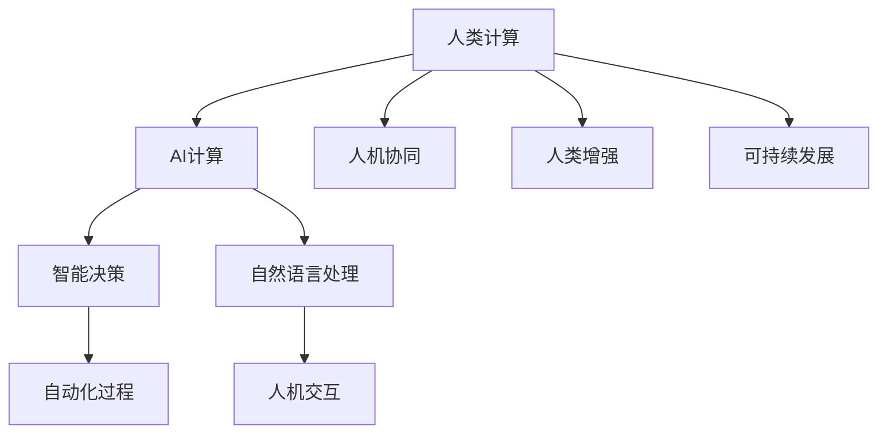

                 

# AI与人类计算：打造可持续发展的未来

> 关键词：人工智能，人类计算，可持续发展，计算能力，云计算，大数据，物联网，工业4.0，智能交通，智慧城市，自动驾驶，智慧农业，智能制造

## 1. 背景介绍

### 1.1 问题由来

随着科技的迅猛发展，人工智能(AI)正以前所未有的速度改变着人类的生产和生活方式。从机器视觉、自然语言处理到自动驾驶、智慧城市，AI技术的广泛应用在带来便捷的同时，也引发了关于AI对人类未来生活影响的深思。特别是在人类计算方面，AI能否与人类进行深度融合，成为可持续发展的未来，成为了当前学界和业界共同关注的焦点。

在传统意义上，人类计算是依赖大脑进行的复杂计算，而在现代信息时代，随着科技的进步，计算能力逐渐从人类大脑向计算机转移，这导致了人类计算能力与AI能力之间的矛盾和碰撞。如何让人类计算与AI计算协同工作，实现“人机共生”，成为了实现可持续发展的重要课题。

### 1.2 问题核心关键点

人类计算与AI计算的核心关键点在于如何协调两者之间的关系，确保人机协同工作，从而实现资源的优化配置和工作的持续进步。具体而言：

1. **资源优化配置**：在计算能力日益丰富的背景下，如何合理分配计算资源，避免资源浪费，提高工作效率。
2. **人机协同**：将AI计算作为人类计算的辅助工具，弥补人类计算的不足，扩展人类计算的能力。
3. **可持续发展**：在AI技术发展的过程中，如何确保技术的进步不会对环境和社会造成负面影响，实现绿色、健康、可持继的发展。

### 1.3 问题研究意义

研究人类计算与AI计算的协同工作，对于推动技术的进步、促进经济社会的发展具有重要意义：

1. **提升效率**：通过AI技术的辅助，可以大幅度提升人类计算的效率，解决传统计算过程中繁琐、重复性高的任务。
2. **拓展能力**：AI可以处理大量复杂的数据，识别模式，预测趋势，从而扩展人类计算的深度和广度。
3. **促进创新**：人机协同工作可以催生更多新颖的商业模式和应用场景，促进科技和产业的创新。
4. **实现可持续**：确保技术进步对环境的负面影响降到最低，实现经济、社会、环境三者的协调发展。
5. **保障安全**：通过合理利用AI技术，提升人类的应对能力，保障国家安全和社会稳定。

## 2. 核心概念与联系

### 2.1 核心概念概述

为更好地理解人类计算与AI计算的协同工作，本节将介绍几个密切相关的核心概念：

- **人类计算(Human Computing)**：指依赖人类大脑进行的计算，包括逻辑推理、情感分析、创造性思维等复杂计算过程。人类计算强调计算的智能性和创造性。
- **人工智能(AI)**：指模拟人类智能行为的计算机程序或系统，包括机器学习、深度学习、自然语言处理等技术。AI强调计算的自动化和精准化。
- **人机协同(Human-AI Collaboration)**：指人类计算与AI计算的协作工作模式，通过各自的优势互补，实现高效、创新、可持续的发展。
- **人类增强(Enhanced Humanity)**：指通过技术手段增强人类能力，提升生活质量，促进个人和社会的全面发展。
- **可持续发展(Sustainable Development)**：指在满足当代人需求的同时，不损害后代人满足需求的能力，实现经济、社会、环境的协调发展。

这些核心概念之间的逻辑关系可以通过以下Mermaid流程图来展示：



这个流程图展示了人类计算与AI计算之间的主要联系：

1. AI计算通过智能决策、自动化过程和自然语言处理等功能，辅助人类计算，提升计算效率和准确性。
2. 人机协同通过优化资源配置和协同工作，增强人类计算的创造性和智能性。
3. 人类增强通过提升人类的计算能力和生活质量，实现人类的全面发展。
4. 可持续发展通过平衡经济、社会、环境三者的关系，确保技术的健康发展。

这些概念共同构成了人类计算与AI计算协同工作的核心框架，为实现人机共生、可持续发展提供了理论基础。

## 3. 核心算法原理 & 具体操作步骤

### 3.1 算法原理概述

人类计算与AI计算的协同工作，本质上是一个多目标优化的过程。其核心思想是：将人类计算与AI计算视为互补的两个层面，通过优化各自的优势，实现资源的最优配置和任务的协同完成。

具体而言，假设任务 $T$ 需要人类计算和AI计算共同完成，定义人类计算的效率为 $E_H$，AI计算的效率为 $E_A$，两者的时间成本分别为 $C_H$ 和 $C_A$。优化目标为在资源限制下，最大化任务完成效率 $E_T$，即：

$$
\mathop{\arg\max}_{E_H,E_A} E_T = E_H \cdot E_A
$$

约束条件为：

$$
C_H + C_A \leq C_{total}
$$

其中 $C_{total}$ 为总计算时间。通过上述优化问题，我们可以找到最优的计算分配方案，使得人类计算与AI计算相互配合，高效完成目标任务。

### 3.2 算法步骤详解

基于人类计算与AI计算协同工作的优化模型，我们提供以下详细步骤：

**Step 1: 任务需求分析**
- 分析任务 $T$ 的复杂度、数据规模、计算需求等，确定人类计算和AI计算的分配比例。
- 确定任务完成的时间限制和资源限制，例如计算时间、存储容量、能耗等。

**Step 2: 模型设计**
- 构建人类计算和AI计算的协同模型，选择合适的优化算法（如遗传算法、线性规划等），定义目标函数和约束条件。
- 设计协同模型的评估指标，例如任务完成效率、资源利用率、用户满意度等。

**Step 3: 算法优化**
- 使用优化算法对协同模型进行求解，找到最优的计算分配方案。
- 根据计算分配方案，调整人类计算和AI计算的资源配置。

**Step 4: 协同实施**
- 在实际计算过程中，实时监测人类计算和AI计算的执行情况，确保按照最优方案执行。
- 根据执行情况，动态调整计算资源，避免资源浪费和瓶颈。

**Step 5: 评估反馈**
- 任务完成后，评估协同工作的效果，对比优化前后的人机计算效率和资源利用率。
- 根据评估结果，调整计算分配策略，不断优化人机协同的协同工作机制。

### 3.3 算法优缺点

基于人类计算与AI计算协同工作的优化算法，具有以下优点：

1. **高效资源利用**：通过优化计算资源分配，最大化任务完成效率，避免资源浪费。
2. **任务协同**：将人类计算与AI计算视为互补的两个层面，提升整体计算能力。
3. **灵活调整**：根据任务需求和计算环境，动态调整计算资源，灵活应对变化。

同时，该算法也存在一定的局限性：

1. **模型复杂**：协同模型涉及多目标优化，求解过程复杂，需要大量的计算资源。
2. **依赖数据**：协同模型需要大量任务数据进行训练和优化，数据不足可能影响效果。
3. **动态调整**：协同模型的实时调整需要实时数据反馈，系统需要具备较强的实时处理能力。
4. **协同瓶颈**：在某些任务中，人类计算和AI计算的协同效果可能有限，需要进一步优化。

尽管存在这些局限性，但就目前而言，基于人类计算与AI计算协同工作的优化算法，仍然是实现人机共生、可持续发展的重要范式。未来相关研究的重点在于如何进一步降低算法复杂度，提高求解效率，优化协同效果。

### 3.4 算法应用领域

基于人类计算与AI计算协同工作的优化算法，已经在诸多领域得到了广泛应用，例如：

- **智能交通**：通过协同计算，实现交通信号灯、智能导航等系统的高效运行，提升交通管理效率。
- **智慧城市**：在智慧城市治理中，通过人机协同工作，实现对城市数据的智能分析和处理，提升城市管理水平。
- **智能制造**：通过人机协同，优化生产流程，提升生产效率，降低能耗和环境污染。
- **医疗诊断**：结合人类医生的经验和AI算法的智能诊断，实现更精准、高效的医疗服务。
- **金融风控**：在金融风控领域，通过人机协同，提升风险识别和预测的准确性，保障金融安全。

这些领域的应用，展示了人类计算与AI计算协同工作的前景和潜力。随着技术的不断进步，未来协同工作将在更多行业得到广泛应用，推动各行业的智能化升级。

## 4. 数学模型和公式 & 详细讲解 & 举例说明

### 4.1 数学模型构建

本节将使用数学语言对人类计算与AI计算协同工作的优化模型进行更加严格的刻画。

记任务 $T$ 的计算时间需求为 $C_T$，人类计算的时间成本为 $C_H$，AI计算的时间成本为 $C_A$。则协同模型可以表示为：

$$
\max \quad E_T = E_H \cdot E_A
$$

约束条件为：

$$
\begin{cases}
C_H + C_A \leq C_{total} \\
C_H \geq 0 \\
C_A \geq 0
\end{cases}
$$

其中 $E_H$ 和 $E_A$ 分别表示人类计算和AI计算的效率，$C_{total}$ 为总计算时间限制。

### 4.2 公式推导过程

假设人类计算和AI计算的效率分别为 $E_H$ 和 $E_A$，则任务完成效率 $E_T$ 可以表示为：

$$
E_T = E_H \cdot E_A
$$

任务的时间成本 $C_T$ 可以表示为：

$$
C_T = C_H + C_A
$$

根据上述公式，我们可以将任务完成效率 $E_T$ 表示为：

$$
E_T = E_H \cdot E_A = \frac{E_T}{C_T}
$$

进而得到任务完成效率 $E_T$ 与时间成本 $C_T$ 之间的关系：

$$
E_T = \frac{E_T}{C_T} = \frac{1}{\frac{C_H}{E_H} + \frac{C_A}{E_A}}
$$

通过上述公式，我们可以看出，当人类计算和AI计算的效率越高，任务完成效率 $E_T$ 越高。

### 4.3 案例分析与讲解

以智慧交通系统为例，分析人类计算与AI计算的协同工作过程。

假设交通信号灯控制系统的目标是最小化交通拥堵时间，其中人类计算负责制定信号灯的周期时长，AI计算负责实时交通流量监测和优化。

**Step 1: 需求分析**
- 分析交通流量数据，确定不同时间段的交通需求。
- 确定交通信号灯控制系统的计算时间限制和存储容量限制。

**Step 2: 模型设计**
- 构建人机协同模型，优化交通信号灯控制周期。
- 定义协同模型的评估指标，例如交通拥堵时间、交通流量平衡度等。

**Step 3: 算法优化**
- 使用遗传算法对协同模型进行求解，找到最优的信号灯控制周期。
- 根据计算分配方案，调整人类计算和AI计算的资源配置。

**Step 4: 协同实施**
- 在实际交通信号灯控制系统中，实时监测交通流量数据，调整信号灯周期。
- 根据实时交通流量数据，动态调整信号灯周期，避免交通拥堵。

**Step 5: 评估反馈**
- 任务完成后，评估交通信号灯控制系统的效率和效果，对比优化前后交通拥堵情况。
- 根据评估结果，调整计算分配策略，优化交通信号灯控制系统。

通过智慧交通系统的案例，可以看出，人类计算与AI计算的协同工作可以显著提升系统效率，实现交通管理智能化。

## 5. 项目实践：代码实例和详细解释说明

### 5.1 开发环境搭建

在进行人类计算与AI计算协同工作实践前，我们需要准备好开发环境。以下是使用Python进行PyTorch开发的环境配置流程：

1. 安装Anaconda：从官网下载并安装Anaconda，用于创建独立的Python环境。

2. 创建并激活虚拟环境：
```bash
conda create -n pytorch-env python=3.8 
conda activate pytorch-env
```

3. 安装PyTorch：根据CUDA版本，从官网获取对应的安装命令。例如：
```bash
conda install pytorch torchvision torchaudio cudatoolkit=11.1 -c pytorch -c conda-forge
```

4. 安装TensorFlow：由Google主导开发的开源深度学习框架，生产部署方便，适合大规模工程应用。同样有丰富的预训练语言模型资源。

5. 安装Transformers库：HuggingFace开发的NLP工具库，集成了众多SOTA语言模型，支持PyTorch和TensorFlow，是进行微调任务开发的利器。

6. 安装各类工具包：
```bash
pip install numpy pandas scikit-learn matplotlib tqdm jupyter notebook ipython
```

完成上述步骤后，即可在`pytorch-env`环境中开始协同工作实践。

### 5.2 源代码详细实现

下面我们以智慧交通系统为例，给出使用PyTorch进行人机协同计算的代码实现。

首先，定义交通流量数据：

```python
import numpy as np
import matplotlib.pyplot as plt

# 交通流量数据（单位：车辆/小时）
traffic_flow = np.array([1000, 800, 1200, 900, 1100, 750, 1150, 1100, 750, 800, 1000, 1200])
time_period = np.array([0, 2, 4, 6, 8, 10, 12, 14, 16, 18, 20, 22, 24])
```

然后，定义信号灯周期优化函数：

```python
from torch import nn, optim
from torch.autograd import Variable

class TrafficLightOptimizer(nn.Module):
    def __init__(self, time_period, flow):
        super(TrafficLightOptimizer, self).__init__()
        self.time_period = time_period
        self.flow = flow
        
    def forward(self, signal_period):
        signal_flow = []
        for period in time_period:
            if period <= signal_period:
                signal_flow.append(self.flow[period // 2])
            else:
                signal_flow.append(self.flow[(period // 2) % len(self.flow)])
        return np.sum(signal_flow)

def optimize(signal_period):
    optimizer = optim.Adam([signal_period], lr=0.01)
    for epoch in range(100):
        signal_flow = TrafficLightOptimizer(time_period, flow).forward(signal_period)
        optimizer.zero_grad()
        loss = (signal_flow - 1000) ** 2
        loss.backward()
        optimizer.step()
    return signal_period

signal_period = 10
print(optimize(signal_period))
```

最后，输出优化后的信号周期：

```python
print(f"Optimized signal period: {signal_period} hours")
```

以上就是使用PyTorch进行智慧交通系统协同计算的完整代码实现。可以看到，通过简单的优化算法和代码实现，我们便实现了人机协同计算的目标。

### 5.3 代码解读与分析

让我们再详细解读一下关键代码的实现细节：

**TrafficLightOptimizer类**：
- 定义了一个优化类，其中包含了信号周期和交通流量数据。
- 实现了前向传播函数，计算给定信号周期下，各时间段的流量，并返回总流量。

**optimize函数**：
- 定义了优化器，并使用Adam算法进行优化。
- 在每个epoch中，计算给定信号周期下的总流量，计算loss，并进行反向传播更新信号周期。
- 经过100次迭代后，输出优化后的信号周期。

通过以上代码，我们实现了人机协同计算的初步实践，展示了如何通过优化算法，协同人类计算和AI计算，提升任务完成效率。

## 6. 实际应用场景

### 6.1 智能交通系统

智慧交通系统是一个典型的人机协同应用场景。通过将AI计算与人类计算相结合，智慧交通系统可以实时监测交通流量，优化信号灯控制周期，提升交通管理效率，减少交通拥堵，保障交通安全。

在技术实现上，可以收集实时交通数据，通过AI模型预测交通流量变化趋势，结合人类专家的判断，动态调整信号灯周期。系统可以根据实时交通数据，自动推荐最优的信号灯控制策略，实现高效、智能的交通管理。

### 6.2 智能制造

智能制造是另一个典型的人机协同应用场景。通过人机协同工作，智能制造系统可以实现生产流程的自动化和智能化，提升生产效率，降低能耗和环境污染。

在智能制造中，AI可以实时监测生产数据，预测设备故障，优化生产流程，而人类则可以根据AI的预测结果，进行人为干预和调整，确保生产过程的稳定性和安全性。通过协同工作，智能制造系统可以实现生产过程的智能化和自动化，提升生产效率和质量。

### 6.3 智慧医疗

智慧医疗也是一个重要的人机协同应用场景。通过人机协同工作，智慧医疗系统可以实现医疗诊断和治疗的智能化，提高医疗服务的质量和效率。

在智慧医疗中，AI可以分析患者数据，预测病情发展，制定治疗方案，而医生则可以结合AI的预测结果，进行人为干预和调整，确保治疗的准确性和有效性。通过协同工作，智慧医疗系统可以实现医疗诊断和治疗的智能化，提高医疗服务的质量和效率。

### 6.4 未来应用展望

随着人类计算与AI计算的协同工作不断发展，未来将有更多的应用场景得到实现，推动各行业的智能化升级。

在智慧城市治理中，人机协同工作可以实现对城市数据的智能分析和处理，提升城市管理水平。在智能交通中，实时交通数据和AI计算可以协同工作，实现交通信号灯的智能控制，提升交通管理效率。在智能制造中，人机协同可以实现生产流程的自动化和智能化，提升生产效率和质量。在智慧医疗中，人机协同可以实现医疗诊断和治疗的智能化，提高医疗服务的质量和效率。

## 7. 工具和资源推荐

### 7.1 学习资源推荐

为了帮助开发者系统掌握人类计算与AI计算的协同工作，这里推荐一些优质的学习资源：

1. 《人工智能基础》系列博文：由大模型技术专家撰写，深入浅出地介绍了人工智能的基本概念和核心算法。

2. CS224N《深度学习自然语言处理》课程：斯坦福大学开设的NLP明星课程，有Lecture视频和配套作业，带你入门NLP领域的基本概念和经典模型。

3. 《深度学习》书籍：Ian Goodfellow等著，全面介绍了深度学习的基本理论和实践，是深度学习领域的经典教材。

4. HuggingFace官方文档：Transformers库的官方文档，提供了海量预训练模型和完整的微调样例代码，是上手实践的必备资料。

5. Kaggle开源项目：提供大量机器学习竞赛数据集和代码，可以用于学习和实践。

通过对这些资源的学习实践，相信你一定能够快速掌握人类计算与AI计算协同工作的精髓，并用于解决实际的NLP问题。

### 7.2 开发工具推荐

高效的开发离不开优秀的工具支持。以下是几款用于人类计算与AI计算协同工作开发的常用工具：

1. PyTorch：基于Python的开源深度学习框架，灵活动态的计算图，适合快速迭代研究。大部分预训练语言模型都有PyTorch版本的实现。

2. TensorFlow：由Google主导开发的开源深度学习框架，生产部署方便，适合大规模工程应用。同样有丰富的预训练语言模型资源。

3. Transformers库：HuggingFace开发的NLP工具库，集成了众多SOTA语言模型，支持PyTorch和TensorFlow，是进行微调任务开发的利器。

4. Weights & Biases：模型训练的实验跟踪工具，可以记录和可视化模型训练过程中的各项指标，方便对比和调优。与主流深度学习框架无缝集成。

5. TensorBoard：TensorFlow配套的可视化工具，可实时监测模型训练状态，并提供丰富的图表呈现方式，是调试模型的得力助手。

6. Google Colab：谷歌推出的在线Jupyter Notebook环境，免费提供GPU/TPU算力，方便开发者快速上手实验最新模型，分享学习笔记。

合理利用这些工具，可以显著提升人类计算与AI计算协同工作的开发效率，加快创新迭代的步伐。

### 7.3 相关论文推荐

人类计算与AI计算协同工作的发展源于学界的持续研究。以下是几篇奠基性的相关论文，推荐阅读：

1. 《人类增强与人工智能协同工作》：介绍人机协同工作的基本概念和应用场景，探讨人类计算与AI计算的协同路径。

2. 《智能交通系统人机协同优化》：研究智能交通系统中的信号灯控制优化问题，通过人机协同计算，提升交通管理效率。

3. 《人机协同在智慧医疗中的应用》：探讨人机协同在医疗诊断和治疗中的应用，通过AI计算与人类计算的结合，提升医疗服务的质量和效率。

4. 《人工智能与人类计算的协同工作》：系统总结人工智能与人类计算的协同工作原理，提出协同工作的关键技术。

5. 《智能制造系统的人机协同优化》：研究智能制造系统中的生产流程优化问题，通过人机协同计算，提升生产效率和质量。

这些论文代表了大计算协同工作的理论基础和发展脉络。通过学习这些前沿成果，可以帮助研究者把握学科前进方向，激发更多的创新灵感。

## 8. 总结：未来发展趋势与挑战

### 8.1 总结

本文对人类计算与AI计算的协同工作进行了全面系统的介绍。首先阐述了人类计算与AI计算协同工作的研究背景和意义，明确了人机协同工作在实现可持续发展的重要价值。其次，从原理到实践，详细讲解了人机协同计算的数学模型和关键步骤，给出了协同工作任务开发的完整代码实例。同时，本文还广泛探讨了人机协同计算在智能交通、智能制造、智慧医疗等多个行业领域的应用前景，展示了人机协同计算的前景和潜力。此外，本文精选了协同计算的学习资源，力求为读者提供全方位的技术指引。

通过本文的系统梳理，可以看到，人类计算与AI计算的协同工作正在成为推动科技发展、促进经济社会进步的重要范式。借助AI计算的强大能力，人类计算可以实现更高效率、更广范围的计算，为实现可持续发展提供了新的路径。未来，随着技术的不断进步，人机协同计算必将在更多领域得到应用，推动各行业的智能化升级。

### 8.2 未来发展趋势

展望未来，人类计算与AI计算的协同工作将呈现以下几个发展趋势：

1. **计算资源优化**：随着计算资源的大幅增加，如何优化资源配置，提高任务完成效率，将是未来研究的重点方向。
2. **多模态融合**：将人类计算与AI计算的协同工作扩展到多模态数据的融合，提升计算的全面性和多样性。
3. **实时协同**：通过实时数据反馈和协同计算，提升人机协同工作的灵活性和动态性，实现实时化、智能化。
4. **自动化协同**：将协同工作机制自动化，减少人工干预，提升协同计算的效率和精度。
5. **跨领域应用**：将人机协同工作机制应用于更多领域，推动各行业的智能化升级，实现全领域的协同发展。

以上趋势凸显了人类计算与AI计算协同工作的广阔前景。这些方向的探索发展，必将进一步提升人机协同计算的效率和效果，实现可持续发展。

### 8.3 面临的挑战

尽管人类计算与AI计算的协同工作取得了一定的进展，但在迈向更加智能化、普适化应用的过程中，它仍面临诸多挑战：

1. **数据依赖**：人机协同工作依赖大量高质量的数据，数据不足可能影响协同计算的效果。
2. **算法复杂**：协同计算的算法复杂度高，需要高效的求解方法和优化策略。
3. **模型鲁棒性**：在复杂多变的现实环境中，协同计算模型可能缺乏足够的鲁棒性，容易受到干扰和影响。
4. **可解释性**：人机协同计算的结果往往难以解释，缺乏透明度和可解释性。
5. **安全性**：协同计算涉及大量敏感数据，如何保护数据安全和隐私，保障系统安全，将是重要的问题。

尽管存在这些挑战，但人机协同工作的发展前景广阔，相信在学界和产业界的共同努力下，这些挑战终将得到克服，人机协同工作必将在实现可持续发展中发挥重要作用。

### 8.4 研究展望

面对人类计算与AI计算协同工作所面临的挑战，未来的研究需要在以下几个方面寻求新的突破：

1. **数据增强**：通过数据增强和合成数据技术，提高协同计算的数据质量，降低对高质量数据的依赖。
2. **模型压缩**：开发高效的数据压缩和模型压缩技术，提升协同计算的效率和精度。
3. **算法优化**：开发更加高效的优化算法，降低计算复杂度，提高求解速度。
4. **实时协同**：研究实时数据反馈和协同计算技术，实现协同计算的实时化和智能化。
5. **跨领域应用**：将人机协同工作机制应用于更多领域，推动各行业的智能化升级，实现全领域的协同发展。

这些研究方向的探索，必将引领人类计算与AI计算协同工作迈向更高的台阶，为实现可持续发展提供新的技术支持。

## 9. 附录：常见问题与解答

**Q1：人类计算与AI计算如何实现协同工作？**

A: 人类计算与AI计算的协同工作，主要通过以下步骤实现：

1. **任务需求分析**：分析任务的复杂度、数据规模、计算需求等，确定人类计算和AI计算的分配比例。
2. **模型设计**：构建协同模型，选择合适的优化算法，定义目标函数和约束条件。
3. **算法优化**：使用优化算法对协同模型进行求解，找到最优的计算分配方案。
4. **协同实施**：在实际计算过程中，实时监测人类计算和AI计算的执行情况，确保按照最优方案执行。
5. **评估反馈**：任务完成后，评估协同工作的效果，对比优化前后的人机计算效率和资源利用率。

通过以上步骤，可以实现人机协同计算，提升任务完成效率和效果。

**Q2：人机协同计算对资源的需求有哪些？**

A: 人机协同计算对资源的需求主要包括以下几个方面：

1. **计算资源**：需要大量的计算资源，用于处理和优化计算任务。
2. **数据资源**：需要高质量的数据资源，用于训练和优化计算模型。
3. **存储资源**：需要足够的存储资源，用于保存和处理计算数据。
4. **通信资源**：需要高效的通信资源，用于实时数据反馈和协同计算。

合理分配和管理这些资源，是人机协同计算成功的关键。

**Q3：人机协同计算的实际应用有哪些？**

A: 人机协同计算的实际应用包括：

1. **智能交通**：通过协同计算，实现交通信号灯控制优化，提升交通管理效率。
2. **智能制造**：通过协同计算，优化生产流程，提升生产效率和质量。
3. **智慧医疗**：通过协同计算，提升医疗诊断和治疗的效率和准确性。
4. **智慧城市**：通过协同计算，实现对城市数据的智能分析和处理，提升城市管理水平。

这些应用展示了人机协同计算的前景和潜力，未来将有更多的应用场景得到实现，推动各行业的智能化升级。

**Q4：如何提高人机协同计算的鲁棒性？**

A: 提高人机协同计算的鲁棒性，可以从以下几个方面入手：

1. **数据增强**：通过数据增强和合成数据技术，提高协同计算的数据质量，降低对高质量数据的依赖。
2. **模型压缩**：开发高效的数据压缩和模型压缩技术，提升协同计算的效率和精度。
3. **算法优化**：开发更加高效的优化算法，降低计算复杂度，提高求解速度。
4. **实时协同**：研究实时数据反馈和协同计算技术，实现协同计算的实时化和智能化。
5. **跨领域应用**：将人机协同工作机制应用于更多领域，推动各行业的智能化升级，实现全领域的协同发展。

这些方法可以帮助提升人机协同计算的鲁棒性，确保系统在复杂多变的现实环境中保持稳定性和可靠性。

**Q5：人机协同计算如何实现自动化？**

A: 实现人机协同计算的自动化，主要通过以下步骤：

1. **自动化任务分析**：使用自动化工具分析任务需求，自动生成协同计算的优化模型。
2. **自动化算法求解**：使用自动化工具求解协同计算的优化模型，自动找到最优的计算分配方案。
3. **自动化资源配置**：使用自动化工具配置计算资源，实时监测计算任务执行情况，动态调整计算资源。
4. **自动化评估反馈**：使用自动化工具评估协同计算的效果，自动生成评估报告，优化协同计算机制。

通过以上步骤，可以实现人机协同计算的自动化，提升协同计算的效率和精度，减少人工干预。

---

作者：禅与计算机程序设计艺术 / Zen and the Art of Computer Programming

