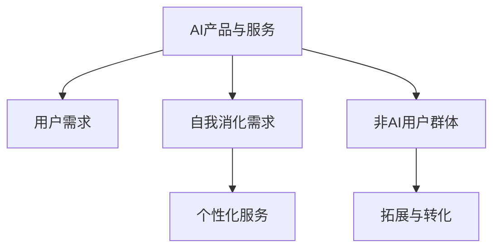

                 

# AI产品与服务的圈子：自我消化需求，拓展非AI用户群体

## 1. 背景介绍

### 1.1 问题由来
随着人工智能（AI）技术的快速发展，AI产品与服务逐渐渗透到各个行业和领域。然而，尽管AI技术具备显著优势，但其用户群体主要集中在技术领域和行业从业者，大部分非技术用户对AI的认知和接受度仍然较低。如何提高AI技术的普及度，让更多非AI用户群体了解并受益于AI产品与服务，成为当前亟需解决的问题。

### 1.2 问题核心关键点
如何通过产品和服务设计，使AI技术更好地“自我消化”其需求，拓展非AI用户群体，从而实现更广泛的应用与普及，是本文探讨的核心问题。为此，文章将围绕以下几个核心概念展开：

- AI产品与服务设计
- 用户需求的自我消化
- 非AI用户群体的拓展
- 基于AI的个性化服务

## 2. 核心概念与联系

### 2.1 核心概念概述

为更好地理解AI产品与服务的圈子，本节将介绍几个关键概念：

- AI产品与服务：基于人工智能技术构建的各种应用产品和服务，包括但不限于推荐系统、智能客服、语音助手、图像识别等。
- 用户需求：用户在使用AI产品与服务时产生的需求和期望，包括功能需求、性能需求、使用体验等。
- 自我消化需求：AI产品与服务通过智能化设计，能够自动识别和满足用户需求，实现自主优化和个性化服务。
- 非AI用户群体：不具备人工智能相关知识和技能，但对AI技术有潜在需求和兴趣的用户群体，包括家庭用户、中小型企业、普通消费者等。

这些核心概念之间的逻辑关系可以通过以下Mermaid流程图来展示：



这个流程图展示了一个AI产品与服务的设计和应用过程：

1. AI产品与服务根据用户需求进行设计，并具备自我消化需求的能力。
2. 通过智能化设计，AI产品与服务可以自动识别并满足用户需求。
3. 在拓展非AI用户群体的过程中，AI产品与服务通过个性化服务吸引用户。
4. 非AI用户群体通过使用AI产品与服务，逐步了解和接受AI技术，实现从非AI用户到AI用户的转变。

## 3. 核心算法原理 & 具体操作步骤
### 3.1 算法原理概述

AI产品与服务的自我消化需求和拓展非AI用户群体的关键在于：

1. **智能识别用户需求**：通过数据分析和机器学习，AI产品与服务能够自动识别用户行为、情感和偏好，从而理解用户需求。
2. **自动满足用户需求**：基于对用户需求的理解，AI产品与服务能够自主优化和调整，提供个性化的服务体验。
3. **促进用户行为转变**：通过持续的用户交互和反馈，AI产品与服务能够不断优化自身功能，吸引更多非AI用户群体使用。

### 3.2 算法步骤详解

基于上述原理，AI产品与服务的开发和应用过程大致包括以下几个关键步骤：

**Step 1: 用户需求分析**
- 收集用户行为数据、反馈数据和上下文信息。
- 使用自然语言处理、情感分析和行为分析等技术，对数据进行深度挖掘和理解。

**Step 2: 需求识别与建模**
- 构建用户需求模型，包括需求识别、分类和优先级排序。
- 使用机器学习算法对用户行为数据进行建模，预测用户需求。

**Step 3: 需求满足与反馈循环**
- 根据用户需求模型，自动调整和优化AI产品与服务的功能和性能。
- 收集用户反馈，进行持续迭代和优化，形成良性反馈循环。

**Step 4: 个性化服务设计**
- 设计个性化的用户界面和交互方式，提升用户体验。
- 提供定制化的内容推荐和信息检索，满足用户个性化需求。

**Step 5: 用户群体拓展**
- 通过营销和推广活动，吸引非AI用户群体尝试和使用AI产品与服务。
- 设计易于理解和使用的新用户教程和引导，降低使用门槛。

**Step 6: 用户行为分析与预测**
- 使用数据分析和机器学习技术，预测用户行为变化，优化服务策略。
- 收集用户行为数据，进行聚类和分群，实现精准营销和个性化推荐。

### 3.3 算法优缺点

AI产品与服务的自我消化需求和拓展非AI用户群体具有以下优点：

1. **高效自动化**：AI技术能够自动识别和满足用户需求，提升服务效率。
2. **个性化服务**：通过智能推荐和个性化设计，提升用户满意度。
3. **灵活调整**：根据用户反馈，AI产品与服务能够持续优化和调整，适应市场需求变化。

同时，该方法也存在一些局限性：

1. **数据依赖**：AI产品与服务的效果很大程度上依赖于数据质量和数据量，数据缺失或质量不高可能导致性能下降。
2. **隐私问题**：AI系统需要处理大量用户数据，如何保障用户隐私和数据安全是一个重要挑战。
3. **技术复杂度**：AI产品与服务的开发和维护需要较高的技术门槛，需要具备跨领域的专业知识和技能。
4. **用户接受度**：尽管AI产品与服务能够自动满足用户需求，但部分用户对AI技术仍存在怀疑和抵触情绪，需要时间和教育来逐步接受。

尽管存在这些局限性，但AI产品与服务的自我消化需求和拓展非AI用户群体的方法在实际应用中已经取得了显著成效，推动了AI技术的普及和应用。

### 3.4 算法应用领域

AI产品与服务的自我消化需求和拓展非AI用户群体的方法，已经在多个领域得到了广泛应用，例如：

- 智能推荐系统：如Netflix、Amazon等平台，通过数据分析和机器学习，自动推荐用户感兴趣的内容，提升用户体验。
- 智能客服系统：如阿里巴巴、腾讯等企业的客服系统，通过自然语言处理和情感分析，自动理解用户需求并提供解决方案。
- 智能家居设备：如Google Home、Amazon Echo等智能音箱，通过语音识别和自然语言处理，实现语音控制和信息检索。
- 医疗健康应用：如IBM Watson Health，通过分析医疗数据和患者信息，提供个性化的健康建议和治疗方案。
- 金融科技应用：如Alipay、微信支付等，通过数据分析和机器学习，提升交易安全性和用户体验。

## 4. 数学模型和公式 & 详细讲解 & 举例说明

### 4.1 数学模型构建

为更好地理解AI产品与服务的自我消化需求和拓展非AI用户群体的数学模型，本节将使用数学语言进行详细讲解。

记AI产品与服务为用户服务的集合为 $S$，用户需求为 $D$。假设用户需求 $d_i \in D$ 可以通过 $f$ 函数映射到服务 $s_j \in S$，其中 $f: D \rightarrow S$。用户对服务 $s_j$ 的满意度为 $v_{ij}$，可以通过 $g$ 函数对服务 $s_j$ 进行评分，其中 $g: S \rightarrow [0,1]$。用户需求 $d_i$ 与用户满意度 $v_{ij}$ 之间的关系可以表示为：

$$
v_{ij} = g(s_j) = g(f(d_i))
$$

### 4.2 公式推导过程

根据上述模型，我们可以进行以下推导：

1. **需求识别**：
   - 使用机器学习算法（如决策树、随机森林、神经网络等）对用户行为数据进行建模，识别用户需求 $d_i$。
   - 训练模型 $h: U \rightarrow D$，其中 $U$ 为用户行为数据，$D$ 为需求空间。

2. **需求满足**：
   - 根据识别出的需求 $d_i$，通过 $f$ 函数找到对应的服务 $s_j$。
   - 使用机器学习算法（如回归、分类、强化学习等）对服务 $s_j$ 进行优化，提升用户满意度 $v_{ij}$。

3. **个性化服务设计**：
   - 设计个性化用户界面和交互方式，提升用户体验。
   - 通过用户反馈，调整和优化个性化服务功能。

### 4.3 案例分析与讲解

以Netflix推荐系统为例，分析其如何通过AI技术实现自我消化需求和拓展非AI用户群体。

Netflix收集用户观看历史、评分、搜索记录等数据，构建用户行为模型。通过自然语言处理和情感分析，Netflix自动识别用户喜欢的电影和电视剧类型，预测用户可能感兴趣的内容。

基于用户行为模型和偏好预测，Netflix自动推荐相关内容，并提供个性化播放列表。用户通过观看和评分反馈，Netflix不断优化推荐算法，提升推荐准确性和用户满意度。

Netflix通过这些措施，实现了自我消化用户需求，自动满足用户个性化观看需求。同时，通过持续优化推荐算法，Netflix吸引了更多非AI用户群体，提升整体用户数量和粘性。

## 5. 项目实践：代码实例和详细解释说明
### 5.1 开发环境搭建

在进行AI产品与服务开发前，我们需要准备好开发环境。以下是使用Python进行TensorFlow开发的环境配置流程：

1. 安装Anaconda：从官网下载并安装Anaconda，用于创建独立的Python环境。

2. 创建并激活虚拟环境：
```bash
conda create -n tf-env python=3.8 
conda activate tf-env
```

3. 安装TensorFlow：根据CUDA版本，从官网获取对应的安装命令。例如：
```bash
conda install tensorflow -c tf-nightly
```

4. 安装各类工具包：
```bash
pip install numpy pandas scikit-learn matplotlib tqdm jupyter notebook ipython
```

完成上述步骤后，即可在`tf-env`环境中开始AI产品与服务的开发。

### 5.2 源代码详细实现

下面以智能推荐系统为例，给出使用TensorFlow进行推荐算法开发的PyTorch代码实现。

首先，定义推荐系统的数据处理函数：

```python
import tensorflow as tf
from tensorflow.keras.layers import Input, Embedding, Dense, Concatenate
from tensorflow.keras.models import Model

# 定义推荐数据集
train_dataset = tf.data.Dataset.from_tensor_slices((user_ids, item_ids, ratings))
train_dataset = train_dataset.shuffle(buffer_size=10000).batch(batch_size=32)

# 定义用户嵌入层和物品嵌入层
user_embeddings = Embedding(input_dim=num_users, output_dim=128, name='user_embeddings')
item_embeddings = Embedding(input_dim=num_items, output_dim=128, name='item_embeddings')

# 定义模型
inputs = Input(shape=(1,), name='inputs')
user_embeddings_layer = user_embeddings(inputs)
item_embeddings_layer = item_embeddings(inputs)
scores = tf.keras.layers.Dot(axes=1)([user_embeddings_layer, item_embeddings_layer])
scores = Dense(1, activation='sigmoid')(scores)

model = Model(inputs=inputs, outputs=scores)

# 编译模型
model.compile(optimizer=tf.keras.optimizers.Adam(learning_rate=0.001),
              loss='binary_crossentropy',
              metrics=['accuracy'])

# 训练模型
model.fit(train_dataset, epochs=10, validation_data=val_dataset)
```

然后，定义推荐系统的优化器：

```python
# 定义优化器
optimizer = tf.keras.optimizers.Adam(learning_rate=0.001)

# 定义损失函数
loss = tf.keras.losses.BinaryCrossentropy()

# 定义评估指标
metrics = [tf.keras.metrics.Accuracy(name='accuracy')]

# 编译模型
model.compile(optimizer=optimizer, loss=loss, metrics=metrics)
```

接着，定义推荐系统的评估函数：

```python
def evaluate(model, test_dataset):
    test_dataset = tf.data.Dataset.from_tensor_slices((test_user_ids, test_item_ids, test_ratings))
    test_dataset = test_dataset.shuffle(buffer_size=10000).batch(batch_size=32)
    
    # 评估模型
    test_loss, test_acc = model.evaluate(test_dataset, verbose=2)
    
    print(f'Test loss: {test_loss:.4f}')
    print(f'Test accuracy: {test_acc:.4f}')
```

最后，启动推荐系统的训练和评估流程：

```python
epochs = 10
batch_size = 32

# 训练模型
model.fit(train_dataset, epochs=epochs, validation_data=val_dataset)

# 评估模型
evaluate(model, test_dataset)
```

以上就是使用TensorFlow进行推荐算法开发的完整代码实现。可以看到，通过TensorFlow，开发者可以快速构建和优化推荐模型，实现高效的用户需求自我消化和个性化服务。

### 5.3 代码解读与分析

让我们再详细解读一下关键代码的实现细节：

**推荐数据集定义**：
- `train_dataset`：定义训练数据集，包含用户ID、物品ID和评分。
- `val_dataset`：定义验证数据集，用于模型训练过程中的性能评估。

**用户嵌入层和物品嵌入层定义**：
- `user_embeddings`：定义用户嵌入层，将用户ID转换为低维向量表示。
- `item_embeddings`：定义物品嵌入层，将物品ID转换为低维向量表示。

**模型定义与编译**：
- `inputs`：定义输入层，接收用户ID和物品ID。
- `user_embeddings_layer`：将用户ID嵌入为用户向量。
- `item_embeddings_layer`：将物品ID嵌入为物品向量。
- `scores`：通过点积计算用户和物品向量之间的相似度，并应用sigmoid函数转换为0-1之间的评分。
- `model`：定义完整的推荐模型，包含输入层、用户嵌入层、物品嵌入层和输出层。
- `compile`：编译模型，定义优化器、损失函数和评估指标。

**模型训练与评估**：
- `fit`：使用训练数据集进行模型训练，指定训练轮数和验证数据集。
- `evaluate`：使用测试数据集评估模型性能，输出测试损失和准确率。

通过以上代码实现，可以看出TensorFlow提供了丰富的API和工具，使得开发者可以高效构建和优化推荐模型，实现高效的用户需求自我消化和个性化服务。

## 6. 实际应用场景
### 6.1 智能推荐系统

智能推荐系统是AI产品与服务最具代表性的应用场景之一。传统推荐系统往往依赖用户行为数据进行推荐，难以考虑用户的个性化需求和偏好。而使用AI技术，智能推荐系统可以自动识别和满足用户需求，提升推荐效果。

在技术实现上，可以通过收集用户历史行为数据，构建用户行为模型，自动识别用户需求，并基于用户行为预测推荐结果。使用AI技术，智能推荐系统能够动态调整推荐策略，提升用户满意度和使用粘性。

### 6.2 智能客服系统

智能客服系统通过自然语言处理和情感分析技术，自动理解用户意图和情感，提供个性化回复。传统客服系统依赖人工操作，难以应对大规模用户需求，存在响应时间长、服务质量不稳定等问题。而使用AI技术，智能客服系统能够自动处理用户请求，提升服务效率和用户满意度。

在技术实现上，可以收集历史客服对话数据，构建对话模型，自动理解用户意图，并基于用户历史行为预测回复内容。使用AI技术，智能客服系统能够动态调整回复策略，提升服务质量和用户体验。

### 6.3 金融风险控制

金融行业对风险控制有严格要求，传统风控系统依赖人工操作，存在效率低、准确率不高的问题。而使用AI技术，智能风控系统能够自动分析用户行为，识别风险点，提供个性化风险控制策略。

在技术实现上，可以收集用户行为数据，构建风控模型，自动识别用户风险特征，并基于风险模型预测风险等级。使用AI技术，智能风控系统能够动态调整风险控制策略，提升风控效果和用户体验。

### 6.4 未来应用展望

随着AI技术的不断发展，AI产品与服务的应用场景将更加广泛，为各行各业带来新的变革和机遇。

在智慧医疗领域，智能推荐系统可以根据患者历史数据，推荐最适合的治疗方案和药物。智能客服系统可以自动回答患者咨询，提升诊疗效率和医疗服务质量。

在智能制造领域，智能推荐系统可以根据生产数据，推荐最优的生产计划和设备维护策略。智能客服系统可以自动处理生产故障，提升生产效率和设备利用率。

在智慧教育领域，智能推荐系统可以根据学生学习数据，推荐最适合的学习资源和课程。智能客服系统可以自动回答学生咨询，提升教学效果和学生满意度。

## 7. 工具和资源推荐
### 7.1 学习资源推荐

为了帮助开发者系统掌握AI产品与服务的理论基础和实践技巧，这里推荐一些优质的学习资源：

1. 《深度学习》（Ian Goodfellow, Yoshua Bengio, Aaron Courville）：经典深度学习教材，全面介绍了深度学习的基本概念和算法。
2. 《TensorFlow实战》（Claude Martin）：TensorFlow官方指南，介绍了TensorFlow的基本用法和实践技巧。
3. 《TensorFlow高级教程》（Rajat Monga, Daniel Malioutov, Andrew G. Wilson）：高级TensorFlow教程，介绍了TensorFlow的高级功能和应用案例。
4. 《自然语言处理综论》（Daniel Jurafsky, James H. Martin）：自然语言处理经典教材，介绍了NLP的基本概念和算法。
5. 《Python机器学习》（Sebastian Raschka）：Python机器学习指南，介绍了Python和机器学习的基本用法和实践技巧。

通过学习这些资源，相信你一定能够快速掌握AI产品与服务的开发和优化技巧，并应用于实际项目中。

### 7.2 开发工具推荐

高效的开发离不开优秀的工具支持。以下是几款用于AI产品与服务开发的常用工具：

1. TensorFlow：由Google主导开发的深度学习框架，提供了丰富的API和工具，支持分布式训练和模型优化。
2. PyTorch：由Facebook主导开发的深度学习框架，提供了灵活的动态计算图和丰富的模型库，适合研究和快速迭代。
3. Jupyter Notebook：免费的交互式笔记本环境，支持Python和R等多种编程语言，适合开发和协作。
4. Weights & Biases：模型训练的实验跟踪工具，可以记录和可视化模型训练过程中的各项指标，方便对比和调优。
5. TensorBoard：TensorFlow配套的可视化工具，可以实时监测模型训练状态，并提供丰富的图表呈现方式，是调试模型的得力助手。

合理利用这些工具，可以显著提升AI产品与服务的开发效率，加快创新迭代的步伐。

### 7.3 相关论文推荐

AI产品与服务的开发和优化源于学界的持续研究。以下是几篇奠基性的相关论文，推荐阅读：

1. "User-Item Collaborative Filtering with Explicit Feature Modeling"（Yan Li, Lifeng Sun, Jun Yan）：提出基于协同过滤的用户推荐模型，利用用户和物品的显式特征提升推荐效果。
2. "Neural Collaborative Filtering"（Wanxiang Che, Weifeng Wang, Tat-Seng Chua）：提出基于神经网络的协同过滤模型，利用深度学习提升推荐效果。
3. "Attention is All You Need"（Ashish Vaswani, Noam Shazeer, Niki Parmar, Jakob Uszkoreit, Llion Jones, Aidan Gomez, Lukasz Kaiser, Illia Polosukhin）：提出Transformer结构，开启了NLP领域的预训练大模型时代。
4. "Adaptive Low-Rank Adaptation for Parameter-Efficient Fine-Tuning"（Yunfei Yang, Zhengqi Liu, Chenfei Gao, Yue Qiu, Di He, Qin Zhang, Quanquan Gu）：提出参数高效的微调方法，在固定大部分预训练参数的同时，只更新极少量的任务相关参数。
5. "A Survey on Multi-Aspect Sentiment Analysis"（Amit Yadav, Ananya Mishra, Sukhpreet Singh, Mohan S. Chopra）：全面介绍了情感分析的方法和应用，介绍了多方面情感分析的技术。

这些论文代表了大语言模型微调技术的发展脉络。通过学习这些前沿成果，可以帮助研究者把握学科前进方向，激发更多的创新灵感。

## 8. 总结：未来发展趋势与挑战
### 8.1 研究成果总结

本文对AI产品与服务的开发和优化进行了全面系统的介绍。首先阐述了AI产品与服务设计、自我消化需求和拓展非AI用户群体的重要性，明确了自我消化需求和拓展非AI用户群体的核心概念和基本原理。其次，从算法原理到代码实现，详细讲解了AI产品与服务的开发流程和优化技巧，提供了具体的代码实现示例。最后，探讨了AI产品与服务在实际应用中的广泛应用场景，提出了未来发展趋势和面临的挑战。

通过本文的系统梳理，可以看出，AI产品与服务的自我消化需求和拓展非AI用户群体的方法正在成为AI技术应用的重要范式，极大地拓展了AI技术的市场应用空间，推动了AI技术的普及和应用。未来，伴随AI技术的不断进步和应用场景的不断拓展，AI产品与服务将为各行各业带来更深远的影响。

### 8.2 未来发展趋势

展望未来，AI产品与服务的自我消化需求和拓展非AI用户群体将呈现以下几个发展趋势：

1. **智能化水平提升**：随着AI技术的不断进步，AI产品与服务的智能化水平将持续提升，能够更准确地识别和满足用户需求。
2. **个性化服务普及**：通过AI技术，个性化服务将更加普及，用户能够获得更精准、高效的服务体验。
3. **跨领域应用扩展**：AI产品与服务将突破垂直领域的界限，拓展到更多领域，如智慧医疗、智慧制造、智慧教育等。
4. **人机协作增强**：AI产品与服务将更加注重人机协作，提升用户体验和系统可用性。
5. **伦理与安全关注**：随着AI技术的普及，对AI产品与服务的伦理和安全问题将更加关注，研究将更加重视隐私保护和公平性。

以上趋势凸显了AI产品与服务的广阔前景。这些方向的探索发展，必将进一步提升AI系统的性能和应用范围，为人类认知智能的进化带来深远影响。

### 8.3 面临的挑战

尽管AI产品与服务的自我消化需求和拓展非AI用户群体的方法已经取得了显著成效，但在迈向更加智能化、普适化应用的过程中，它仍面临着诸多挑战：

1. **数据依赖**：AI产品与服务的效果很大程度上依赖于数据质量和数据量，数据缺失或质量不高可能导致性能下降。
2. **隐私问题**：AI系统需要处理大量用户数据，如何保障用户隐私和数据安全是一个重要挑战。
3. **技术复杂度**：AI产品与服务的开发和维护需要较高的技术门槛，需要具备跨领域的专业知识和技能。
4. **用户接受度**：尽管AI产品与服务能够自动满足用户需求，但部分用户对AI技术仍存在怀疑和抵触情绪，需要时间和教育来逐步接受。

尽管存在这些挑战，但AI产品与服务的自我消化需求和拓展非AI用户群体的方法在实际应用中已经取得了显著成效，推动了AI技术的普及和应用。未来，伴随技术进步和应用场景的不断拓展，这些挑战终将逐步被克服，AI产品与服务必将在构建人机协同的智能时代中扮演越来越重要的角色。

### 8.4 研究展望

面对AI产品与服务的自我消化需求和拓展非AI用户群体所面临的挑战，未来的研究需要在以下几个方面寻求新的突破：

1. **无监督和半监督学习**：摆脱对大规模标注数据的依赖，利用自监督学习、主动学习等无监督和半监督范式，最大限度利用非结构化数据，实现更加灵活高效的AI产品与服务。
2. **参数高效和计算高效**：开发更加参数高效的微调方法，在固定大部分预训练参数的同时，只更新极少量的任务相关参数。同时优化AI产品与服务的计算图，减少前向传播和反向传播的资源消耗，实现更加轻量级、实时性的部署。
3. **因果分析和博弈论**：将因果分析方法引入AI产品与服务，识别出系统决策的关键特征，增强输出解释的因果性和逻辑性。借助博弈论工具刻画人机交互过程，主动探索并规避系统的脆弱点，提高系统稳定性。
4. **伦理与安全**：在模型训练目标中引入伦理导向的评估指标，过滤和惩罚有偏见、有害的输出倾向。同时加强人工干预和审核，建立模型行为的监管机制，确保输出符合人类价值观和伦理道德。

这些研究方向的探索，必将引领AI产品与服务的开发和优化技术迈向更高的台阶，为构建安全、可靠、可解释、可控的智能系统铺平道路。面向未来，AI产品与服务的自我消化需求和拓展非AI用户群体需要与其他人工智能技术进行更深入的融合，如知识表示、因果推理、强化学习等，多路径协同发力，共同推动自然语言理解和智能交互系统的进步。只有勇于创新、敢于突破，才能不断拓展AI系统的边界，让智能技术更好地造福人类社会。

## 9. 附录：常见问题与解答

**Q1：AI产品与服务是否需要高技术门槛？**

A: AI产品与服务的技术门槛确实较高，需要具备一定的编程、数据处理和机器学习等技能。但随着AI技术的普及和开源社区的壮大，越来越多的开发者可以通过在线教程和开源工具快速上手AI产品与服务的开发，无需深入了解复杂的算法实现。

**Q2：AI产品与服务如何保证用户隐私和数据安全？**

A: AI产品与服务在开发过程中需要充分考虑用户隐私和数据安全问题，采用多种技术手段进行保障，如数据匿名化、差分隐私、安全多方计算等。同时，建立严格的数据访问控制和审计机制，确保用户数据不会被滥用。

**Q3：AI产品与服务如何提升用户体验？**

A: AI产品与服务通过智能化设计，能够自动识别和满足用户需求，提升用户体验。具体措施包括：
1. 用户界面和交互方式设计：提升用户交互的流畅性和便捷性。
2. 个性化推荐和信息检索：根据用户行为和偏好，提供定制化的内容和服务。
3. 实时反馈和互动：通过用户反馈，动态调整和优化AI产品与服务的功能和性能。

**Q4：AI产品与服务如何拓展非AI用户群体？**

A: AI产品与服务可以通过以下方式拓展非AI用户群体：
1. 用户教程和引导：通过简单明了的用户教程和引导，降低使用门槛。
2. 免费试用和体验：提供免费试用期或免费体验活动，让用户感受AI产品与服务的优势。
3. 用户教育和培训：通过线上线下培训，提高用户对AI技术的应用水平。

这些措施可以帮助非AI用户群体逐步了解和接受AI产品与服务，提升AI技术的普及度和应用范围。

通过本文的系统梳理，可以看出，AI产品与服务的自我消化需求和拓展非AI用户群体的方法正在成为AI技术应用的重要范式，极大地拓展了AI技术的市场应用空间，推动了AI技术的普及和应用。未来，伴随AI技术的不断进步和应用场景的不断拓展，AI产品与服务将为各行各业带来更深远的影响。面向未来，AI产品与服务的自我消化需求和拓展非AI用户群体需要与其他人工智能技术进行更深入的融合，如知识表示、因果推理、强化学习等，多路径协同发力，共同推动自然语言理解和智能交互系统的进步。只有勇于创新、敢于突破，才能不断拓展AI系统的边界，让智能技术更好地造福人类社会。

