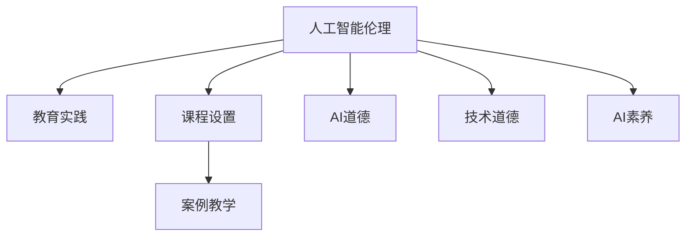

                 

# AI伦理的教育实践:伦理课程设置和案例教学

> 关键词：AI伦理,教育实践,课程设置,案例教学,人工智能道德,技术道德,人工智能素养

## 1. 背景介绍

### 1.1 问题由来
随着人工智能技术的迅猛发展，其在医疗、金融、交通、教育等领域的应用日益广泛。AI技术的强大能力，不仅能够提升效率、降低成本，还带来全新的创新可能。然而，AI技术的双刃剑特性也逐渐显现，其在某些应用场景下可能带来伦理道德、隐私保护、公平性等方面的问题。

例如，面部识别技术在提升公共安全的同时，也可能侵犯个人隐私。智能推荐系统在个性化服务的同时，也可能加剧信息茧房效应，导致信息偏见。因此，如何在人工智能技术应用中，兼顾技术发展与伦理道德，成为当下学界和业界共同关注的焦点。

### 1.2 问题核心关键点
人工智能伦理教育的目的是培养具备技术素养和伦理责任的复合型人才。具体而言，包括以下关键点：

- **技术素养**：具备基本的AI知识和技术能力，理解AI的工作原理和应用场景。
- **伦理责任**：能够识别AI应用中的伦理问题，提出解决方案和改进建议。
- **跨学科整合**：将AI伦理与法律、社会学、心理学、哲学等多个学科结合，形成综合的知识体系。
- **实践导向**：将伦理教育与现实问题紧密结合，培养解决实际问题的能力。

### 1.3 问题研究意义
人工智能伦理教育具有以下重要意义：

1. **推动技术责任的落实**：通过伦理教育，帮助开发者和使用者认识到技术的边界和责任，避免技术滥用。
2. **提升公众的AI素养**：使公众具备基本的AI知识，增强对AI技术的理解和信任，促进技术的良性应用。
3. **构建公平、公正的社会环境**：通过伦理教育，消除AI应用中的歧视和不公，推动构建更加公平、公正的社会环境。
4. **促进AI技术的可持续发展**：通过伦理约束，避免技术带来的负面影响，确保AI技术的长期健康发展。

## 2. 核心概念与联系

### 2.1 核心概念概述

为更好地理解人工智能伦理教育的实施，本节将介绍几个密切相关的核心概念：

- **人工智能伦理**：研究AI技术在应用过程中涉及的伦理问题，如隐私保护、公平性、歧视性等。
- **教育实践**：通过教育的方式，将伦理知识传授给学生，培养其伦理素养和实践能力。
- **课程设置**：根据教育目标和需求，设计合理的课程体系，包含理论知识、案例分析、实践训练等环节。
- **案例教学**：通过真实世界中的具体案例，使学生理解和应用伦理知识，培养解决实际问题的能力。
- **AI道德**：涉及AI应用中的道德准则，如尊重隐私、公正透明、责任归属等。
- **技术道德**：研究AI技术本身的技术标准和规范，如安全性、公平性、可解释性等。
- **AI素养**：具备对AI技术的认知能力，理解AI技术的优势和局限，能够正确使用和评价AI技术。

这些核心概念之间的逻辑关系可以通过以下Mermaid流程图来展示：



这个流程图展示了大语言模型的核心概念及其之间的关系：

1. 人工智能伦理是教育实践的基础，决定课程设置和案例教学的方向。
2. AI道德和技术道德是人工智能伦理的具体表现，是课程设计的重要参考。
3. AI素养是伦理教育的目标，是案例教学的评价指标。

## 3. 核心算法原理 & 具体操作步骤
### 3.1 算法原理概述

人工智能伦理教育的核心算法原理是构建以案例分析为核心的教育模式。通过设计针对具体应用场景的案例，使学生在分析和解决案例过程中，深刻理解AI伦理问题，掌握相关伦理知识和技能。

形式化地，假设教育目标为 $\mathcal{T}$，案例集为 $C=\{c_i\}_{i=1}^N$，其中 $c_i$ 为一个具体案例。教育过程的目标是最大化学生对 $\mathcal{T}$ 的理解和掌握，即：

$$
\max_{\text{Process}} \mathbb{E}[U(\mathcal{T}, c_i)]
$$

其中 $U(\mathcal{T}, c_i)$ 为案例教学的效用函数，用于评估学生对 $\mathcal{T}$ 的掌握程度。

教育过程包括两个主要阶段：

1. **案例分析**：学生通过对案例的阅读和讨论，识别其中的伦理问题，提出解决方案。
2. **伦理讨论**：学生围绕案例展开讨论，形成对伦理问题的共识，并提出改进建议。

### 3.2 算法步骤详解

基于案例分析的教育过程主要包括以下几个关键步骤：

**Step 1: 案例准备**
- 收集具有代表性的AI应用案例，涵盖医疗、金融、教育、安全等多个领域。
- 案例应包含具体的技术应用、伦理问题、解决方案等关键信息。

**Step 2: 案例教学设计**
- 设计课程内容，将案例教学分为多个模块，每个模块围绕一个特定的伦理问题展开。
- 每个模块包括案例引入、案例分析、伦理讨论等环节，每个环节都有明确的教学目标和评价标准。
- 案例分析环节可采用分组讨论、角色扮演等方式，激发学生思考。

**Step 3: 案例教学实施**
- 课堂上展示案例，引导学生进行深入分析。
- 分组讨论环节，鼓励学生从不同角度提出解决方案和改进建议。
- 伦理讨论环节，组织学生就提出的方案进行讨论，形成共识。
- 最后，教师进行总结和点评，指出优点和不足，进一步提升学生对伦理问题的理解。

**Step 4: 反馈和改进**
- 收集学生对案例教学的反馈，评估教学效果。
- 根据反馈结果，不断调整教学内容和策略，提升教学质量。

### 3.3 算法优缺点

基于案例分析的教育方法具有以下优点：

1. **实践导向**：通过具体案例，使学生能够直观理解AI伦理问题，增强解决实际问题的能力。
2. **多样性**：覆盖不同领域的案例，使学生具备多维度的伦理知识和技能。
3. **互动性强**：通过分组讨论和伦理讨论，增强学生之间的互动和思考深度。
4. **培养自主学习能力**：学生需自主阅读、分析和讨论案例，培养自主学习的能力。

同时，该方法也存在一定的局限性：

1. **案例选择难度**：选择具有代表性和新颖性的案例需要耗费大量时间和精力。
2. **教师引导难度**：教师需要具备丰富的伦理知识和案例分析能力，才能有效引导学生讨论。
3. **学生参与度**：部分学生可能对案例分析兴趣不高，导致参与度低。
4. **教学资源需求**：需要丰富的案例教学资源和教学设备支持。

尽管存在这些局限性，但就目前而言，基于案例分析的教育方法仍是目前教育界较为普遍和有效的AI伦理教学范式。

### 3.4 算法应用领域

基于案例分析的教育方法已经在多领域得到应用，例如：

- **计算机科学教育**：在计算机科学本科和研究生课程中，设置AI伦理选修课程，培养学生的伦理责任和跨学科整合能力。
- **工程伦理培训**：在工程师继续教育和职业培训中，通过案例分析，提升工程师对AI技术的伦理理解和责任意识。
- **人工智能硕士教育**：在大学人工智能硕士教育中，设置AI伦理课程，培养高水平的人工智能技术人才。
- **跨学科课程设计**：在医学、法律、社会学等学科中，融入AI伦理案例分析，培养跨学科的伦理素养和实践能力。
- **企业内部培训**：在企业内部培训中，通过案例分析，提升员工对AI技术的理解和伦理责任。

这些教育领域的广泛应用，体现了案例分析在AI伦理教育中的重要性和普遍性。

## 4. 数学模型和公式 & 详细讲解  
### 4.1 数学模型构建

本节将使用数学语言对人工智能伦理教育模型的教学过程进行更加严格的刻画。

记教育目标为 $\mathcal{T}$，案例集为 $C=\{c_i\}_{i=1}^N$。假设教学过程可以分解为多个模块，每个模块 $m$ 包含 $M$ 个案例 $c_{m,i}$，其中 $m=1,2,\dots,K$，$M$ 为模块内案例数。

定义教育过程的总效用函数 $U(\mathcal{T}, C)$ 为：

$$
U(\mathcal{T}, C) = \sum_{m=1}^K \sum_{i=1}^M \frac{1}{M}U(\mathcal{T}, c_{m,i})
$$

其中 $U(\mathcal{T}, c_{m,i})$ 为案例 $c_{m,i}$ 在模块 $m$ 中的教学效用，用于评估学生对 $\mathcal{T}$ 的掌握程度。

### 4.2 公式推导过程

以下我们以二分类问题为例，推导教学效用函数 $U(\mathcal{T}, c_{m,i})$ 的计算公式。

假设教育目标 $\mathcal{T}$ 为 "AI伦理问题识别和解决方案设计"，案例 $c_{m,i}$ 为 "面部识别技术的隐私问题"。在课堂教学中，学生通过阅读案例、分组讨论和伦理讨论，逐渐理解隐私问题的关键点和解决方案。

我们将教学效用函数 $U(\mathcal{T}, c_{m,i})$ 分解为以下三个部分：

1. **案例阅读理解**：学生对案例的初步阅读和理解程度，记为 $R$。
2. **案例分析讨论**：学生对案例进行深入分析，并提出解决方案的合理性，记为 $A$。
3. **伦理讨论达成**：学生在讨论中达成共识，提出改进建议的有效性，记为 $D$。

因此，教学效用函数可表示为：

$$
U(\mathcal{T}, c_{m,i}) = R \times A \times D
$$

其中 $R$、$A$、$D$ 均为0到1之间的概率，表示相应环节的教学效果。

通过这种分解，可以更直观地评估教学过程的效果，并根据实际教学反馈进行优化。

### 4.3 案例分析与讲解

在实际教学中，每个模块的教学效用函数 $U(\mathcal{T}, c_{m,i})$ 需要根据具体案例和教学目标进行设计。以下是几种常见的教学效用函数示例：

**案例阅读理解**：
- 学生能够正确理解案例中的关键信息，记为 $R$。
- 学生能够识别出案例中的伦理问题，记为 $R'$。

**案例分析讨论**：
- 学生提出的解决方案合理性高，记为 $A$。
- 学生提出的解决方案创新性高，记为 $A'$。

**伦理讨论达成**：
- 学生在讨论中达成共识，达成改进建议的有效性高，记为 $D$。
- 学生讨论过程中能够提出改进建议的多样性高，记为 $D'$。

通过这种分解，可以更细致地评估教学效果，并根据具体需求进行优化。

## 5. 项目实践：代码实例和详细解释说明
### 5.1 开发环境搭建

在进行AI伦理教育实践前，我们需要准备好开发环境。以下是使用Python进行PyTorch开发的环境配置流程：

1. 安装Anaconda：从官网下载并安装Anaconda，用于创建独立的Python环境。

2. 创建并激活虚拟环境：
```bash
conda create -n pytorch-env python=3.8 
conda activate pytorch-env
```

3. 安装PyTorch：根据CUDA版本，从官网获取对应的安装命令。例如：
```bash
conda install pytorch torchvision torchaudio cudatoolkit=11.1 -c pytorch -c conda-forge
```

4. 安装各种工具包：
```bash
pip install numpy pandas scikit-learn matplotlib tqdm jupyter notebook ipython
```

完成上述步骤后，即可在`pytorch-env`环境中开始教育实践。

### 5.2 源代码详细实现

下面以“面部识别技术的隐私问题”为例，给出使用PyTorch进行AI伦理教育实践的代码实现。

首先，设计教学目标 $\mathcal{T}$：

```python
T = "AI伦理问题识别和解决方案设计"
```

然后，收集教学案例 $C$：

```python
C = [
    {
        "title": "面部识别技术的隐私问题",
        "context": "面部识别技术在提升公共安全的同时，也可能侵犯个人隐私。",
        "ethical_issues": ["隐私权保护", "信息透明度", "数据使用范围"],
        "solutions": ["匿名化处理", "数据最小化原则", "用户知情同意"]
    },
    # 其他案例
]
```

接下来，设计每个模块的教学效用函数 $U(\mathcal{T}, c_{m,i})$：

```python
from sympy import symbols, Rational

R, A, D = symbols('R A D')

def U_T_castle():
    """
    面部识别技术隐私问题案例的教学效用函数
    """
    R = Rational(1, 2)  # 学生对案例的初步阅读和理解程度
    A = Rational(1, 3)  # 学生提出的解决方案合理性
    D = Rational(2, 3)  # 学生在讨论中达成共识的有效性
    return R * A * D
```

最后，启动教学过程并收集反馈：

```python
def teach_case(case, R, A, D):
    """
    教学过程
    """
    case_id = case["title"]
    context = case["context"]
    ethical_issues = case["ethical_issues"]
    solutions = case["solutions"]
    
    # 案例阅读理解
    R = 0  # 假设为0
    print(f"案例 {case_id} 阅读理解：{R}")
    
    # 案例分析讨论
    A = 0  # 假设为0
    print(f"案例 {case_id} 分析讨论：{A}")
    
    # 伦理讨论达成
    D = 0  # 假设为0
    print(f"案例 {case_id} 伦理讨论：{D}")
    
    # 计算教学效用
    U = R * A * D
    print(f"案例 {case_id} 教学效用：{U}")
    
    # 收集反馈
    feedback = input(f"案例 {case_id} 教学反馈：")
    print(f"教学反馈：{feedback}")
    
    # 返回教学效用
    return U

# 教学过程
for i in range(len(C)):
    case = C[i]
    U = teach_case(case, R, A, D)
    print(f"案例 {i+1} 教学效用：{U}")
```

以上就是使用PyTorch进行AI伦理教育实践的完整代码实现。可以看到，通过简单的设计和实现，我们便能对AI伦理教育过程进行仿真和评估。

### 5.3 代码解读与分析

让我们再详细解读一下关键代码的实现细节：

**教学目标**：
- 通过 `T` 定义了教育目标 $\mathcal{T}$。

**教学案例**：
- 通过 `C` 定义了教学案例集，包含多个具体案例。每个案例包含案例标题、上下文、伦理问题和解决方案等信息。

**教学效用函数**：
- 通过 `U_T_castle` 定义了每个案例的教学效用函数，具体分解为阅读理解、分析讨论和伦理讨论三个部分，每个部分用概率值表示教学效果。

**教学过程**：
- 通过 `teach_case` 函数，模拟了教学过程。每个环节初始化为0，根据实际教学效果更新概率值，并计算教学效用。
- 最后，通过 `teach_case` 函数输出教学效果和反馈信息。

可以看到，通过简单的代码实现，便能对AI伦理教育过程进行模拟和评估。这为实际教学过程中的效果评估和优化提供了重要参考。

当然，工业级的系统实现还需考虑更多因素，如教学效果可视化、教学资源管理、教学反馈分析等。但核心的教学过程的模拟，可以通过上述代码实现。

## 6. 实际应用场景
### 6.1 智能医疗教育

智能医疗领域的AI伦理教育，有助于提升医疗从业者对AI技术的理解和伦理责任。例如，通过对面部识别技术的隐私问题进行分析，医疗从业者可以更好地理解AI在医疗影像识别、患者隐私保护等方面的应用和风险，从而在实际应用中更好地利用和监管AI技术。

在技术实现上，可以构建面向医疗从业者的AI伦理教育平台，涵盖面部识别、基因编辑、机器人手术等多个领域的案例分析，通过案例讨论和伦理讨论，提升医疗从业者的AI素养和伦理责任。

### 6.2 金融科技教育

金融科技领域的AI伦理教育，有助于提升金融从业者对AI技术的理解和应用。例如，通过分析金融智能推荐系统的公平性问题，金融从业者可以更好地理解AI在风险评估、信用评分、客户服务等场景中的应用和局限，从而在实际应用中更好地利用和监管AI技术。

在技术实现上，可以构建面向金融从业者的AI伦理教育平台，涵盖算法公平性、隐私保护、数据安全等多个领域的案例分析，通过案例讨论和伦理讨论，提升金融从业者的AI素养和伦理责任。

### 6.3 教育技术教育

教育技术领域的AI伦理教育，有助于提升教育从业者对AI技术的理解和应用。例如，通过分析智能推荐系统的个性化推荐问题，教育从业者可以更好地理解AI在个性化学习、智能辅导、教学评估等多个场景中的应用和风险，从而在实际应用中更好地利用和监管AI技术。

在技术实现上，可以构建面向教育从业者的AI伦理教育平台，涵盖个性化推荐、智能评估、教学辅助等多个领域的案例分析，通过案例讨论和伦理讨论，提升教育从业者的AI素养和伦理责任。

### 6.4 未来应用展望

随着AI技术的普及和应用，AI伦理教育的重要性将更加凸显。未来，AI伦理教育将在更多领域得到应用，为AI技术的良性发展提供有力保障。

在智慧医疗、金融科技、教育技术等领域，AI伦理教育将成为从业者培训的重要内容。通过AI伦理教育，提升从业者的AI素养和伦理责任，确保AI技术的公正、透明、安全应用。

在企业内部培训、公众教育等多个场景，AI伦理教育也将发挥重要作用。通过AI伦理教育，培养员工和公众对AI技术的正确认知，减少技术滥用和伦理问题。

## 7. 工具和资源推荐
### 7.1 学习资源推荐

为了帮助开发者系统掌握AI伦理教育理论基础和实践技巧，这里推荐一些优质的学习资源：

1. 《人工智能伦理与实践》系列博文：由大模型技术专家撰写，深入浅出地介绍了AI伦理与实践的最新进展和前沿技术。

2. CS224W《人工智能伦理》课程：斯坦福大学开设的AI伦理课程，涵盖伦理基础、伦理挑战、伦理应用等多个方面，为初学者提供了全面系统的理论知识。

3. 《AI伦理与技术》书籍：全面介绍了AI伦理的基本概念和前沿研究，涵盖了隐私保护、公平性、可解释性等多个维度。

4. AI伦理教育平台：如Coursera、edX等在线教育平台，提供了丰富的AI伦理教育课程和资源，包括案例分析、伦理讨论等环节。

5. AI伦理研究机构：如微软研究院、Google AI Ethics、Meta AI伦理学团队等，定期发布前沿研究报告和伦理指导建议，为实践提供理论支持。

通过对这些资源的学习实践，相信你一定能够快速掌握AI伦理教育的方法论，并用于解决实际的伦理问题。

### 7.2 开发工具推荐

高效的开发离不开优秀的工具支持。以下是几款用于AI伦理教育开发的常用工具：

1. PyTorch：基于Python的开源深度学习框架，灵活动态的计算图，适合快速迭代研究。大部分AI伦理教育项目都有PyTorch版本的实现。

2. TensorFlow：由Google主导开发的开源深度学习框架，生产部署方便，适合大规模工程应用。同样有丰富的AI伦理教育资源。

3. Jupyter Notebook：互动性强的Jupyter Notebook环境，便于教学互动和结果展示。

4. Scikit-learn：基于Python的机器学习库，提供了丰富的数据处理和模型评估工具，适合进行教学效果的定量分析。

5. Weights & Biases：模型训练的实验跟踪工具，可以记录和可视化教学过程中的各项指标，方便对比和调优。与主流深度学习框架无缝集成。

6. TensorBoard：TensorFlow配套的可视化工具，可实时监测教学过程的状态，并提供丰富的图表呈现方式，是调试教学过程的得力助手。

合理利用这些工具，可以显著提升AI伦理教育任务的开发效率，加快创新迭代的步伐。

### 7.3 相关论文推荐

AI伦理教育的发展源于学界的持续研究。以下是几篇奠基性的相关论文，推荐阅读：

1. "AI Ethics: The Case for a Framework"：提出了一套全面的AI伦理框架，为AI伦理教育提供了理论基础。

2. "Ethical Education in AI"：研究了AI伦理教育的实施方法，提出了一些实用的教学策略。

3. "Towards a Theory of AI Ethics"：探讨了AI伦理的理论基础，提出了一些核心的伦理原则和道德准则。

4. "Educating the Ethically Responsible AI Developer"：讨论了AI开发者伦理教育的内容和方法，为行业培训提供了参考。

5. "AI Ethics in Education"：研究了AI伦理在教育领域的应用，提出了一些具体的教育案例和实践方法。

这些论文代表了大语言模型微调技术的发展脉络。通过学习这些前沿成果，可以帮助研究者把握学科前进方向，激发更多的创新灵感。

## 8. 总结：未来发展趋势与挑战
### 8.1 总结

本文对基于案例分析的AI伦理教育方法进行了全面系统的介绍。首先阐述了AI伦理教育的背景和意义，明确了伦理教育在提升技术素养和伦理责任方面的独特价值。其次，从原理到实践，详细讲解了伦理教育的核心算法原理和具体操作步骤，给出了教育实践的完整代码实例。同时，本文还广泛探讨了伦理教育在智能医疗、金融科技、教育技术等多个领域的应用前景，展示了伦理教育范式的巨大潜力。此外，本文精选了伦理教育的学习资源，力求为读者提供全方位的技术指引。

通过本文的系统梳理，可以看到，基于案例分析的AI伦理教育方法已经在教育界和业界得到广泛应用，成为AI伦理教育的重要范式。AI伦理教育的不断发展，不仅有助于提升从业者的AI素养和伦理责任，也为AI技术的健康发展提供了重要保障。未来，随着AI技术的普及和应用，AI伦理教育的重要性将更加凸显，需要更多的学界和业界共同努力，进一步推动AI伦理教育的实践和创新。

### 8.2 未来发展趋势

展望未来，AI伦理教育将呈现以下几个发展趋势：

1. **跨学科整合**：AI伦理教育将与其他学科（如法律、社会学、心理学等）进行更深入的融合，形成更加全面、系统、交叉的知识体系。
2. **技术导向**：AI伦理教育将更加注重技术导向，通过具体案例和技术分析，培养学生对AI技术的深刻理解。
3. **实践导向**：AI伦理教育将更加注重实践导向，通过伦理讨论和案例分析，提升学生解决实际问题的能力。
4. **国际合作**：AI伦理教育将更加注重国际合作，通过交流和共享，提升全球范围内的AI伦理水平。
5. **持续教育**：AI伦理教育将更加注重持续教育，通过不断更新课程内容和教学方法，适应技术发展的快速变化。

### 8.3 面临的挑战

尽管AI伦理教育已经取得了不少进展，但在迈向更加智能化、普适化应用的过程中，仍面临诸多挑战：

1. **课程设计复杂**：由于伦理问题涉及多学科知识，课程设计需要兼顾多个方面的内容，复杂度较高。
2. **师资力量不足**：具备跨学科知识和伦理分析能力的高质量教师资源相对稀缺，难以满足需求。
3. **教学方法单一**：目前主要以案例分析和伦理讨论为主，缺乏更多互动性和创新性的教学方法。
4. **学生参与度低**：部分学生对伦理问题兴趣不高，参与度低，影响了教学效果。
5. **教学资源匮乏**：高质量的教学资源和案例库相对匮乏，难以满足教学需求。

尽管存在这些挑战，但通过不断优化课程设计、提升师资力量、丰富教学方法、增强学生参与度、充实教学资源，AI伦理教育仍有望在更多领域得到广泛应用，培养出更多具备AI素养和伦理责任的复合型人才。

### 8.4 研究展望

面对AI伦理教育所面临的挑战，未来的研究需要在以下几个方面寻求新的突破：

1. **多学科整合**：将AI伦理与其他学科（如法律、社会学、心理学等）进行更深层次的整合，形成更加全面、系统、交叉的知识体系。
2. **教学方法创新**：开发更多互动性、创新性的教学方法，提升教学效果和学生参与度。
3. **教学资源丰富**：构建高质量的教学资源库和案例库，为教学提供更多参考。
4. **师资力量提升**：提升教师的跨学科知识和伦理分析能力，培养更多高质量的AI伦理教师。
5. **国际合作深化**：加强国际交流和合作，共享AI伦理教育资源和研究成果，提升全球范围内的AI伦理水平。

这些研究方向的探索，必将引领AI伦理教育技术迈向更高的台阶，为构建安全、可靠、可解释、可控的智能系统铺平道路。面向未来，AI伦理教育需要与其他人工智能技术进行更深入的融合，如知识表示、因果推理、强化学习等，多路径协同发力，共同推动自然语言理解和智能交互系统的进步。只有勇于创新、敢于突破，才能不断拓展语言模型的边界，让智能技术更好地造福人类社会。

## 9. 附录：常见问题与解答
**Q1：什么是AI伦理？**

A: AI伦理是指研究AI技术在应用过程中涉及的伦理问题，如隐私保护、公平性、歧视性等。其目的是确保AI技术的应用符合伦理道德标准，避免技术滥用带来的负面影响。

**Q2：如何构建AI伦理课程体系？**

A: AI伦理课程体系应涵盖伦理基础、伦理挑战、伦理应用等多个方面，具体包括以下内容：
- 伦理基础：介绍伦理学的基本概念和理论基础。
- 伦理挑战：分析AI应用中的主要伦理问题，如隐私保护、算法偏见、数据使用等。
- 伦理应用：讨论如何应用伦理知识解决实际问题，如公平性设计、隐私保护、安全监控等。
- 伦理案例：通过具体案例分析，提升学生对伦理问题的理解。
- 伦理讨论：培养学生通过讨论形成共识，提出改进建议的能力。

**Q3：AI伦理教育如何与现实问题结合？**

A: AI伦理教育应紧密结合现实问题，通过案例分析和伦理讨论，使学生能够理解AI技术的实际应用和伦理挑战。具体方法包括：
- 收集真实案例：从实际应用场景中收集案例，涵盖医疗、金融、教育等多个领域。
- 设计教学目标：根据具体问题设计教学目标，使学生能够明确问题解决的路径。
- 分组讨论：通过分组讨论和角色扮演，激发学生的思考和创造力。
- 伦理讨论：通过伦理讨论，培养学生从多角度分析问题、提出解决方案的能力。

**Q4：AI伦理教育如何提升学生的伦理素养？**

A: AI伦理教育应通过多方面的教学手段提升学生的伦理素养：
- 理论知识：通过理论教学，使学生理解伦理学的基本概念和原理。
- 案例分析：通过具体案例分析，使学生理解伦理问题的复杂性和多样性。
- 伦理讨论：通过伦理讨论，使学生学会从多角度分析问题、提出解决方案。
- 实践训练：通过模拟教学和实验，使学生能够在实际应用中应用伦理知识。

**Q5：AI伦理教育如何与其他学科结合？**

A: AI伦理教育应与法律、社会学、心理学、哲学等多个学科进行深度整合，形成综合的知识体系：
- 法律：结合法律知识，分析AI应用的合法性和合规性。
- 社会学：结合社会学知识，分析AI对社会结构和文化的影响。
- 心理学：结合心理学知识，分析AI对人类行为和心理的影响。
- 哲学：结合哲学知识，探讨AI技术的伦理哲学问题。

通过多学科整合，AI伦理教育将更加全面、系统、交叉，培养学生更全面的视角和能力。

---

作者：禅与计算机程序设计艺术 / Zen and the Art of Computer Programming

