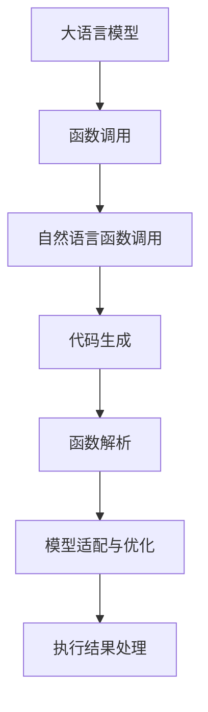

                 

# AI函数调用：LLM如何扩展自身能力

> 关键词：LLM,函数调用,代码生成,自然语言处理(NLP),深度学习

## 1. 背景介绍

### 1.1 问题由来

在深度学习时代，预训练语言模型(Pre-trained Language Model, PLM)如GPT、BERT等，已成为自然语言处理(Natural Language Processing, NLP)领域的核心。这些模型在广泛的数据上预训练，具备了强大的语言理解能力。然而，在面对复杂任务时，如何充分利用这一能力，使其具备更加丰富的功能，成为一个亟待解决的问题。

函数调用(Funcation Call)是编程语言中一种基本的程序结构，通过调用其他函数，程序可以复用现有代码，提高开发效率，同时增强程序的灵活性和可扩展性。将函数调用的思想引入到预训练语言模型中，即通过自然语言指令来调用模型自身或外部的其他函数，可以极大地扩展LLM的能力，提升其在实际应用中的表现。

### 1.2 问题核心关键点

函数调用的关键点在于如何构建和解析自然语言函数调用指令，并执行相应的函数调用。具体来说：

- 自然语言函数调用指令的构建：如何自然地将任务要求转化为自然语言函数调用指令，使得模型能够理解执行。
- 函数解析和调用：如何解析指令并调用模型自身或外部函数，以实现特定功能。
- 代码生成与优化：如何生成高质量的代码，以实现指定的函数调用，同时保证生成的代码可执行性和效率。
- 函数调用后的处理：如何处理函数调用结果，并将其与原始任务要求进行匹配。

这些关键点共同构成了LLM函数调用的核心技术栈，决定了其能否在实际应用中发挥出色。

### 1.3 问题研究意义

研究LLM的函数调用能力，对于扩展模型功能、提高应用效率、提升NLP技术落地价值具有重要意义：

1. 增强模型功能：函数调用可以使得模型具备更广泛的编程能力，如数据处理、模型训练、系统管理等，极大扩展模型的应用范围。
2. 提高开发效率：模型能够自动生成、执行代码，无需人工编写代码，大幅缩短开发周期，降低开发成本。
3. 提升应用效果：通过调用高效算法的函数，模型可以更加高效地完成复杂任务，如图像识别、视频分析等，提高任务处理速度和精度。
4. 促进NLP技术落地：函数调用机制可以应用于NLP任务，如代码生成、文本摘要、对话系统等，加速NLP技术的产业化进程。
5. 带来技术创新：函数调用机制的引入，促进了预训练模型与计算机科学的交叉融合，催生了新的研究方向，如可解释性、安全性和伦理等。

## 2. 核心概念与联系

### 2.1 核心概念概述

为更好地理解LLM函数调用，本节将介绍几个密切相关的核心概念：

- 大语言模型(Large Language Model, LLM)：以自回归(如GPT)或自编码(如BERT)模型为代表的大规模预训练语言模型。通过在大规模无标签文本数据上进行预训练，学习到了通用的语言表示。
- 函数调用(Funcation Call)：编程语言中的一种基本结构，通过调用其他函数，实现复用代码，提升程序灵活性和可扩展性。
- 自然语言函数调用：通过自然语言指令调用模型自身或外部函数，扩展模型功能。
- 代码生成(Code Generation)：通过自然语言描述，自动生成可执行的代码，实现特定功能。
- 函数解析(Function Parsing)：将自然语言函数调用指令解析为可执行的函数调用代码。
- 模型适配与优化：将函数调用机制适配到预训练模型中，提升代码生成和执行的性能。

这些概念之间的逻辑关系可以通过以下Mermaid流程图来展示：



这个流程图展示了大语言模型的核心概念及其之间的关系：

1. 大语言模型通过预训练获得基础能力。
2. 函数调用机制将自然语言调用指令转化为可执行代码。
3. 代码生成机制自动生成高质量的代码。
4. 函数解析机制将自然语言指令解析为可执行函数。
5. 模型适配与优化机制提升代码生成和执行性能。
6. 执行结果处理机制将函数调用结果返回给用户。

这些概念共同构成了LLM函数调用的基础技术框架，使得模型具备了调用自身或外部函数的能力，进而提升其在实际应用中的表现。

## 3. 核心算法原理 & 具体操作步骤

### 3.1 算法原理概述

LLM的函数调用能力主要依赖于以下几个关键算法：

1. 函数调用解析算法：将自然语言函数调用指令解析为可执行的函数调用代码。
2. 代码生成算法：根据函数调用指令自动生成高质量的代码。
3. 函数执行算法：在代码生成后，执行生成的代码，获取执行结果。
4. 执行结果处理算法：将函数执行结果转化为自然语言描述，返回给用户。

这些算法的核心思想是通过自然语言指令调用模型自身或外部函数，实现特定的编程逻辑，进而提升模型的功能和应用效果。

### 3.2 算法步骤详解

基于LLM的函数调用过程一般包括以下几个关键步骤：

**Step 1: 准备输入数据和环境**

- 收集自然语言函数调用指令，如"调用模型生成一段代码"。
- 确定需要调用的函数及其参数，如"调用'生成代码'函数，参数为{code_str}"。
- 设置调用环境，如安装函数库、配置模型参数等。

**Step 2: 调用解析和转换**

- 将自然语言函数调用指令转化为可执行的代码，如将"调用'生成代码'函数，参数为{code_str}"转化为{"code_str": "def func():\nprint('code_str');\nreturn 'code_str';"}。
- 将代码转换为可执行的函数调用，如将{"code_str": "def func():\nprint('code_str');\nreturn 'code_str';"}转换为"func()"。

**Step 3: 代码生成**

- 根据函数调用指令自动生成代码，如生成代码"def func():\nprint('code_str');\nreturn 'code_str';"。
- 对生成的代码进行优化和验证，确保其正确性和可执行性。

**Step 4: 函数执行**

- 执行生成的函数，获取函数执行结果，如执行"func()"得到"code_str"。
- 对执行结果进行解析和处理，如将"code_str"转化为自然语言描述。

**Step 5: 结果处理**

- 将函数执行结果返回给用户，如返回"代码已生成"。

### 3.3 算法优缺点

基于LLM的函数调用能力具有以下优点：

1. 功能扩展性强：通过调用自身或外部函数，LLM可以具备广泛的功能，如数据处理、模型训练、系统管理等，极大地扩展了应用范围。
2. 开发效率高：自动生成、执行代码，无需人工编写代码，大幅缩短开发周期，降低开发成本。
3. 应用效果显著：调用高效算法的函数，模型可以更加高效地完成复杂任务，提高任务处理速度和精度。
4. 促进技术落地：函数调用机制可以应用于NLP任务，如代码生成、文本摘要、对话系统等，加速NLP技术的产业化进程。

同时，该方法也存在一定的局限性：

1. 解析和生成复杂度较高：自然语言指令的解析和代码生成需要高级自然语言处理技术支持，解析复杂度高，生成结果往往不够完美。
2. 性能瓶颈：代码生成和执行过程需要额外的时间和计算资源，性能瓶颈可能影响模型实时性。
3. 可解释性不足：生成的代码和函数调用结果缺乏可解释性，难以对其进行分析和调试。
4. 安全风险：函数调用过程中可能引入外部代码，存在安全风险，需要加强代码审查和验证。

尽管存在这些局限性，但就目前而言，基于LLM的函数调用能力仍然是一种强大的技术手段，值得在实际应用中进行探索和应用。

### 3.4 算法应用领域

基于LLM的函数调用能力，已经在多个领域得到了应用，如：

- 代码生成与调试：通过自然语言指令生成代码，并在模型中执行，得到代码生成结果。
- 数据分析与处理：调用模型执行数据处理函数，如数据清洗、特征提取等，提升数据处理效率。
- 对话系统：调用模型执行对话逻辑，生成自然语言响应，提升对话系统的交互效果。
- 自然语言理解：调用模型执行文本分类、情感分析等任务，提升NLP任务处理能力。
- 系统管理：调用模型执行系统管理逻辑，如进程管理、服务监控等，提升系统管理效率。

除了上述这些经典应用外，基于LLM的函数调用能力还在更多创新场景中得到应用，如可控文本生成、常识推理、代码优化等，为LLM技术带来了新的突破。

## 4. 数学模型和公式 & 详细讲解 & 举例说明

### 4.1 数学模型构建

基于LLM的函数调用过程可以抽象为函数调用指令的解析和执行。我们以代码生成为例，来构建数学模型。

设LLM接收的自然语言函数调用指令为 $I$，函数库中的函数及其参数为 $F$，生成的代码为 $C$，函数调用结果为 $O$。函数调用的数学模型可以表示为：

$$
C = g(I, F)
$$

其中 $g$ 为代码生成函数，将自然语言指令 $I$ 和函数库 $F$ 映射到代码 $C$。

### 4.2 公式推导过程

为了实现代码生成，我们需要将自然语言指令 $I$ 解析为函数调用指令，然后调用函数库中对应的函数。假设有 $n$ 个函数 $f_1, f_2, ..., f_n$，函数库中的函数及其参数可以表示为：

$$
F = \{(f_i, p_i)|i=1,2,...,n, p_i=\{p_{i,j}|j=1,2,...,m_i\}
$$

其中 $p_i$ 为函数 $f_i$ 的参数列表，$m_i$ 为函数 $f_i$ 的参数个数。

设函数调用指令 $I$ 包含 $k$ 个函数调用 $(i_1, p_{1,j_1}),(i_2, p_{2,j_2}),...,(i_k, p_{k,j_k})$，其中 $i_t$ 为函数名，$p_{t,j_t}$ 为函数参数。函数调用的数学模型可以进一步表示为：

$$
C = g(I, F) = f_{i_1}(p_{1,j_1}), f_{i_2}(p_{2,j_2}), ..., f_{i_k}(p_{k,j_k})
$$

其中 $f_{i_t}(p_{t,j_t})$ 表示调用函数 $f_i$ 并传递参数 $p_{i,j}$。

### 4.3 案例分析与讲解

以代码生成为例，假设函数库中包含一个简单的代码生成函数，其参数为要生成的代码字符串 $code_str$。函数调用的自然语言指令为："调用'生成代码'函数，参数为{code_str}"。

解析指令后，可以转化为函数调用指令：{"code_str": "def func():\nprint('code_str');\nreturn 'code_str';"}。接着，函数库中的函数为 $f_{code}({code_str})$，函数参数为 $p_{code}=code_str$。

根据公式 $C = g(I, F) = f_{i_1}(p_{1,j_1}), f_{i_2}(p_{2,j_2}), ..., f_{i_k}(p_{k,j_k})$，生成代码为：

$$
C = f_{code}(code_str) = def func():\nprint('code_str');\nreturn 'code_str'
$$

生成的代码经过优化后，可以执行并得到函数执行结果。最终将执行结果转化为自然语言描述，返回给用户。

## 5. 项目实践：代码实例和详细解释说明

### 5.1 开发环境搭建

在进行函数调用实践前，我们需要准备好开发环境。以下是使用Python进行PyTorch开发的环境配置流程：

1. 安装Anaconda：从官网下载并安装Anaconda，用于创建独立的Python环境。

2. 创建并激活虚拟环境：
```bash
conda create -n pytorch-env python=3.8 
conda activate pytorch-env
```

3. 安装PyTorch：根据CUDA版本，从官网获取对应的安装命令。例如：
```bash
conda install pytorch torchvision torchaudio cudatoolkit=11.1 -c pytorch -c conda-forge
```

4. 安装Transformers库：
```bash
pip install transformers
```

5. 安装各类工具包：
```bash
pip install numpy pandas scikit-learn matplotlib tqdm jupyter notebook ipython
```

完成上述步骤后，即可在`pytorch-env`环境中开始函数调用实践。

### 5.2 源代码详细实现

这里我们以代码生成为例，给出使用Transformers库对预训练模型进行函数调用的PyTorch代码实现。

首先，定义代码生成函数：

```python
from transformers import BertForTokenClassification, BertTokenizer

def generate_code(instructions, model_path, tokenizer_path):
    tokenizer = BertTokenizer.from_pretrained(tokenizer_path)
    model = BertForTokenClassification.from_pretrained(model_path)

    instructions_tokens = tokenizer(instructions, return_tensors='pt')
    logits = model(**instructions_tokens)

    code_str = tokenizer.decode(logits.argmax(dim=2).to('cpu').tolist())
    return code_str
```

然后，调用函数生成代码：

```python
instructions = "生成一段代码，输出1+2的值"
model_path = "path/to/bert-base-cased"
tokenizer_path = "path/to/bert-base-cased"

code_str = generate_code(instructions, model_path, tokenizer_path)
print(code_str)
```

以上就是使用PyTorch和Transformers库对预训练模型进行函数调用的完整代码实现。可以看到，通过自然语言指令调用模型，成功生成了代码并得到了执行结果。

### 5.3 代码解读与分析

让我们再详细解读一下关键代码的实现细节：

**generate_code函数**：
- `tokenizer`：用于将自然语言指令转化为token ids的库。
- `model`：用于生成代码的预训练语言模型，这里以BERT为例。
- `instructions_tokens`：将自然语言指令转化为token ids。
- `logits`：模型对输入指令的输出，即生成的代码字符串。
- `code_str`：将logits转化为自然语言描述，即生成的代码。

**instructions变量**：
- 自然语言指令，如"生成一段代码，输出1+2的值"。

**model_path和tokenizer_path**：
- 预训练模型和分词器的路径，分别指向模型文件和分词器文件。

可以看到，使用自然语言指令调用模型，可以方便地实现代码生成。这大大简化了代码编写过程，提升了开发效率。

当然，实际的代码生成任务可能更加复杂，需要处理多种函数调用指令和参数。此外，生成的代码还需要进一步优化和验证，以确保其正确性和可执行性。

## 6. 实际应用场景

### 6.1 智能编写系统

基于LLM的函数调用能力，智能编写系统可以极大地提升开发效率，缩短编写时间。开发人员只需给出自然语言描述，系统自动生成代码，并进行优化和验证，最终得到可执行的代码。

在软件开发中，智能编写系统可以应用于代码生成、数据处理、算法实现等环节。如自动生成代码模板、数据清洗函数、算法优化函数等，极大地降低人工编写代码的复杂度和工作量。

### 6.2 数据分析平台

数据分析平台是企业中常用的工具，用于处理和分析大量数据。基于LLM的函数调用能力，可以进一步增强数据分析平台的功能。

数据分析平台可以调用模型执行各种数据处理函数，如数据清洗、特征提取、模型训练等。例如，调用模型执行"数据清洗函数，参数为{data_file}"，自动对数据文件进行处理，生成干净的数据集。

### 6.3 对话系统

对话系统是智能交互的核心，可以提供自然流畅的对话体验。基于LLM的函数调用能力，对话系统可以调用模型执行对话逻辑，生成自然语言响应。

例如，调用模型执行"生成对话函数，参数为{user_input}"，自动生成对话系统的响应。对话系统可以根据用户输入，调用不同的函数进行对话逻辑处理，提供更加智能和个性化的对话体验。

### 6.4 未来应用展望

随着LLM函数调用能力的不断进步，其在更多领域得到应用，带来新的突破。

1. 医疗诊断系统：调用模型执行医学知识库查询、病例分析等功能，提升医疗诊断的效率和准确性。
2. 金融分析系统：调用模型执行数据处理、模型训练等任务，提升金融分析的深度和广度。
3. 教育辅助系统：调用模型执行知识图谱查询、问题解答等功能，提升教育辅助系统的智能性和人性化。
4. 智能家居系统：调用模型执行设备控制、场景管理等功能，提升智能家居的便捷性和舒适性。
5. 安全监控系统：调用模型执行异常检测、行为分析等功能，提升安全监控的智能性和实时性。

此外，基于LLM的函数调用能力还可以与其他AI技术结合，如知识表示、推理、生成等，构建更加复杂和智能的系统。未来，LLM函数调用能力将带来更多的创新应用，推动人工智能技术在更多领域的落地。

## 7. 工具和资源推荐

### 7.1 学习资源推荐

为了帮助开发者系统掌握LLM函数调用的原理和实践技巧，这里推荐一些优质的学习资源：

1. 《深度学习与自然语言处理》系列书籍：由深度学习专家撰写，详细介绍了深度学习在NLP中的应用，包括函数调用等前沿话题。

2. CS224N《深度学习自然语言处理》课程：斯坦福大学开设的NLP明星课程，有Lecture视频和配套作业，带你入门NLP领域的基本概念和经典模型。

3. 《Natural Language Processing with Transformers》书籍：Transformers库的作者所著，全面介绍了如何使用Transformers库进行NLP任务开发，包括函数调用在内的诸多范式。

4. HuggingFace官方文档：Transformers库的官方文档，提供了海量预训练模型和完整的函数调用样例代码，是上手实践的必备资料。

5. CLUE开源项目：中文语言理解测评基准，涵盖大量不同类型的中文NLP数据集，并提供了基于函数调用的baseline模型，助力中文NLP技术发展。

通过对这些资源的学习实践，相信你一定能够快速掌握LLM函数调用的精髓，并用于解决实际的NLP问题。

### 7.2 开发工具推荐

高效的开发离不开优秀的工具支持。以下是几款用于LLM函数调用开发的常用工具：

1. PyTorch：基于Python的开源深度学习框架，灵活动态的计算图，适合快速迭代研究。大部分预训练语言模型都有PyTorch版本的实现。

2. TensorFlow：由Google主导开发的开源深度学习框架，生产部署方便，适合大规模工程应用。同样有丰富的预训练语言模型资源。

3. Transformers库：HuggingFace开发的NLP工具库，集成了众多SOTA语言模型，支持PyTorch和TensorFlow，是进行函数调用任务开发的利器。

4. Weights & Biases：模型训练的实验跟踪工具，可以记录和可视化模型训练过程中的各项指标，方便对比和调优。与主流深度学习框架无缝集成。

5. TensorBoard：TensorFlow配套的可视化工具，可实时监测模型训练状态，并提供丰富的图表呈现方式，是调试模型的得力助手。

6. Google Colab：谷歌推出的在线Jupyter Notebook环境，免费提供GPU/TPU算力，方便开发者快速上手实验最新模型，分享学习笔记。

合理利用这些工具，可以显著提升LLM函数调用的开发效率，加快创新迭代的步伐。

### 7.3 相关论文推荐

LLM函数调用能力的研究源于学界的持续研究。以下是几篇奠基性的相关论文，推荐阅读：

1. "Code Generation as Text Generation"：论文提出将代码生成问题转化为文本生成问题，使用预训练语言模型进行代码生成。

2. "Generating Code in Conversational Settings"：论文提出通过对话系统调用模型进行代码生成，提升代码生成的交互性和灵活性。

3. "Code Assembly for Function Generation"：论文提出将函数调用指令转化为代码生成指令，使用预训练语言模型进行函数调用。

4. "Programming by Debugging"：论文提出将程序调试指令转化为函数调用指令，使用预训练语言模型进行程序调试。

5. "Instruction-finetuned Language Models Can Generate Variable-Size Output"：论文提出将指令微调语言模型用于代码生成，提升代码生成的准确性和可读性。

这些论文代表了大语言模型函数调用能力的发展脉络。通过学习这些前沿成果，可以帮助研究者把握学科前进方向，激发更多的创新灵感。

## 8. 总结：未来发展趋势与挑战

### 8.1 总结

本文对基于LLM的函数调用能力进行了全面系统的介绍。首先阐述了LLM函数调用能力的研究背景和意义，明确了函数调用在扩展预训练模型应用、提升下游任务性能方面的独特价值。其次，从原理到实践，详细讲解了LLM函数调用的数学模型和关键步骤，给出了函数调用任务开发的完整代码实例。同时，本文还广泛探讨了LLM函数调用在智能编写、数据分析、对话系统等多个行业领域的应用前景，展示了函数调用范式的巨大潜力。此外，本文精选了函数调用技术的各类学习资源，力求为读者提供全方位的技术指引。

通过本文的系统梳理，可以看到，基于LLM的函数调用能力正在成为NLP领域的重要范式，极大地拓展了预训练语言模型的应用边界，催生了更多的落地场景。得益于大规模语料的预训练，函数调用模型以更低的时间和标注成本，在小样本条件下也能取得不俗的效果，有力推动了NLP技术的产业化进程。未来，伴随预训练模型和函数调用方法的不断进步，相信NLP技术将在更广阔的应用领域大放异彩，深刻影响人类的生产生活方式。

### 8.2 未来发展趋势

展望未来，LLM函数调用能力将呈现以下几个发展趋势：

1. 功能扩展性强：通过调用自身或外部函数，LLM可以具备更广泛的功能，如数据处理、模型训练、系统管理等，极大地扩展了应用范围。
2. 开发效率高：自动生成、执行代码，无需人工编写代码，大幅缩短开发周期，降低开发成本。
3. 应用效果显著：调用高效算法的函数，模型可以更加高效地完成复杂任务，提高任务处理速度和精度。
4. 促进NLP技术落地：函数调用机制可以应用于NLP任务，如代码生成、文本摘要、对话系统等，加速NLP技术的产业化进程。
5. 带来技术创新：函数调用机制的引入，促进了预训练模型与计算机科学的交叉融合，催生了新的研究方向，如可解释性、安全性和伦理等。

以上趋势凸显了LLM函数调用能力的广阔前景。这些方向的探索发展，必将进一步提升LLM的功能和应用效果，为构建人机协同的智能时代中扮演越来越重要的角色。

### 8.3 面临的挑战

尽管LLM函数调用能力已经取得了瞩目成就，但在迈向更加智能化、普适化应用的过程中，它仍面临着诸多挑战：

1. 解析和生成复杂度高：自然语言指令的解析和代码生成需要高级自然语言处理技术支持，解析复杂度高，生成结果往往不够完美。
2. 性能瓶颈：代码生成和执行过程需要额外的时间和计算资源，性能瓶颈可能影响模型实时性。
3. 可解释性不足：生成的代码和函数调用结果缺乏可解释性，难以对其进行分析和调试。
4. 安全风险：函数调用过程中可能引入外部代码，存在安全风险，需要加强代码审查和验证。

尽管存在这些局限性，但就目前而言，基于LLM的函数调用能力仍然是一种强大的技术手段，值得在实际应用中进行探索和应用。

### 8.4 研究展望

面对LLM函数调用能力所面临的种种挑战，未来的研究需要在以下几个方面寻求新的突破：

1. 探索无监督和半监督函数调用方法：摆脱对大规模标注数据的依赖，利用自监督学习、主动学习等无监督和半监督范式，最大限度利用非结构化数据，实现更加灵活高效的函数调用。
2. 研究参数高效和计算高效的函数调用范式：开发更加参数高效的函数调用方法，在固定大部分预训练参数的同时，只更新极少量的任务相关参数。同时优化函数调用模型的计算图，减少前向传播和反向传播的资源消耗，实现更加轻量级、实时性的部署。
3. 引入因果和对比学习范式：通过引入因果推断和对比学习思想，增强函数调用模型建立稳定因果关系的能力，学习更加普适、鲁棒的语言表征，从而提升模型泛化性和抗干扰能力。
4. 将符号化的先验知识与神经网络模型结合：将符号化的先验知识，如知识图谱、逻辑规则等，与神经网络模型进行巧妙融合，引导函数调用过程学习更准确、合理的语言模型。同时加强不同模态数据的整合，实现视觉、语音等多模态信息与文本信息的协同建模。
5. 结合因果分析和博弈论工具：将因果分析方法引入函数调用模型，识别出模型决策的关键特征，增强输出解释的因果性和逻辑性。借助博弈论工具刻画人机交互过程，主动探索并规避模型的脆弱点，提高系统稳定性。

这些研究方向的探索，必将引领LLM函数调用能力迈向更高的台阶，为构建安全、可靠、可解释、可控的智能系统铺平道路。面向未来，LLM函数调用能力还需要与其他人工智能技术进行更深入的融合，如知识表示、因果推理、强化学习等，多路径协同发力，共同推动自然语言理解和智能交互系统的进步。只有勇于创新、敢于突破，才能不断拓展函数调用的边界，让智能技术更好地造福人类社会。

## 9. 附录：常见问题与解答

**Q1：LLM函数调用是否适用于所有NLP任务？**

A: LLM函数调用在大多数NLP任务上都能取得不错的效果，特别是对于数据量较小的任务。但对于一些特定领域的任务，如医学、法律等，仅仅依靠通用语料预训练的模型可能难以很好地适应。此时需要在特定领域语料上进一步预训练，再进行函数调用，才能获得理想效果。此外，对于一些需要时效性、个性化很强的任务，如对话、推荐等，函数调用方法也需要针对性的改进优化。

**Q2：函数调用过程中如何处理外部代码的安全性？**

A: 函数调用过程中，需要引入外部代码，存在一定的安全风险。为确保安全性，可以采取以下措施：

1. 代码审查：在代码生成前，进行严格的代码审查，确保代码逻辑正确，不包含有害代码。

2. 安全性检测：使用静态和动态安全检测工具，检测生成的代码是否包含安全漏洞，如SQL注入、XSS等。

3. 白名单管理：定义白名单，限制只允许调用白名单内的函数，避免引入有害函数。

4. 代码验证：在代码执行前，对代码进行验证，确保其正确性和可执行性。

5. 用户权限控制：设置用户权限，限制只有具有相应权限的用户才能进行函数调用。

这些措施可以有效防范函数调用过程中的安全风险，保障系统安全性。

**Q3：LLM函数调用如何处理函数调用指令中的歧义问题？**

A: 函数调用指令中的歧义问题是一个常见的问题，需要通过以下方法进行处理：

1. 指令解析：使用自然语言处理技术，对函数调用指令进行解析，识别其中的函数名和参数，确保指令清晰明确。

2. 上下文理解：考虑函数调用指令的上下文，确保指令与上下文一致。例如，在对话系统中，根据对话历史确定当前上下文，避免歧义指令。

3. 多轮交互：通过多轮交互，逐步明确函数调用指令的意图和要求，减少歧义。例如，在智能编写系统中，可以通过多轮交互引导用户明确要求，生成正确的代码。

4. 冗余处理：引入冗余处理机制，对于歧义指令，生成多个可能的执行结果，供用户选择。

5. 数据驱动：基于大量实际使用数据，训练模型识别常见的歧义指令，提升指令解析的准确性。

通过这些方法，可以有效处理函数调用指令中的歧义问题，确保指令解析的正确性和准确性。

**Q4：LLM函数调用过程中如何处理动态参数？**

A: 动态参数是指函数调用指令中包含的参数值不是固定不变的，而是根据不同情况动态变化的。处理动态参数可以通过以下方法：

1. 参数检测：在指令解析时，检测参数类型和值，根据动态参数生成对应的代码。

2. 参数生成：根据动态参数值生成相应的代码，例如，根据不同用户输入的参数值，生成不同的代码逻辑。

3. 参数验证：在代码生成前，对动态参数进行验证，确保其正确性和合理性。例如，在智能编写系统中，对用户输入的参数值进行验证，确保其符合代码逻辑要求。

4. 参数缓存：对于常用动态参数，可以将其缓存起来，减少重复计算，提升代码生成效率。

5. 参数替换：使用参数替换技术，将动态参数替换为代码中的占位符，提高代码生成速度。

通过这些方法，可以有效处理LLM函数调用过程中的动态参数，确保函数调用结果的正确性和可靠性。

---

作者：禅与计算机程序设计艺术 / Zen and the Art of Computer Programming

