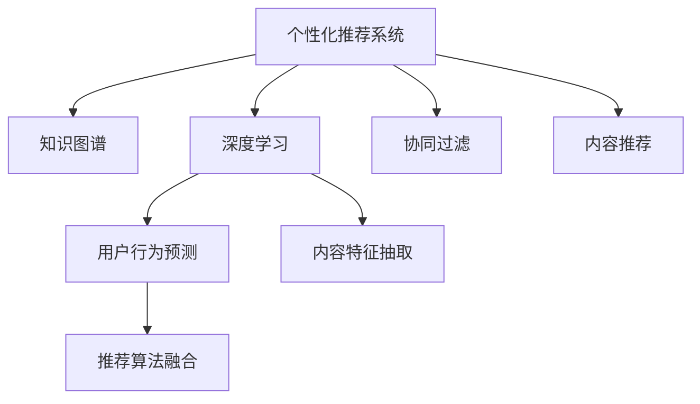

                 

# AI在个性化阅读推荐中的应用：扩展知识面

> 关键词：个性化推荐,知识图谱,协同过滤,深度学习,阅读推荐系统,用户行为预测,内容特征抽取

## 1. 背景介绍

### 1.1 问题由来
随着互联网和数字媒体的发展，用户可获取的信息量呈指数级增长，如何从海量的内容中发现感兴趣的信息，成为了一项巨大的挑战。传统的信息检索方法依赖关键词匹配，难以应对复杂多变的阅读需求。而个性化阅读推荐系统通过用户行为数据分析，精准匹配用户的兴趣点，将优质内容推荐给用户，极大地提升了用户的信息获取效率和满意度。

目前，主流推荐系统大多基于协同过滤和基于内容的推荐方法。协同过滤算法通过分析用户行为，发现用户之间的相似性，推断用户可能感兴趣的内容。基于内容的推荐则通过分析物品的文本特征，将相似的物品推荐给用户。然而，这些方法往往难以充分理解复杂、动态的用户需求和内容多样性。

近年来，深度学习技术在推荐系统中的应用取得显著进展。通过构建用户-物品交互数据集，深度学习模型可以自动提取用户行为和物品特征之间的隐含关系，从而实现更加精准的推荐。但传统的深度学习模型在建模复杂用户行为和处理大规模数据集方面仍有局限。

知识图谱（KG）技术的兴起，为解决这些问题提供了新的方向。知识图谱通过构建实体与关系的结构化知识，融合结构化和非结构化信息，使得推荐系统能够更全面地理解用户和物品的语义特征。深度学习与知识图谱的结合，有望使推荐系统具备更强的推理能力和泛化性能，为用户带来更优质的阅读体验。

## 2. 核心概念与联系

### 2.1 核心概念概述

为更好地理解基于知识图谱的深度学习推荐系统，本节将介绍几个密切相关的核心概念：

- 个性化阅读推荐系统：通过分析用户行为和兴趣特征，将符合用户需求的内容推荐给用户的智能系统。个性化推荐可以提升用户体验，推动用户深度阅读，增加内容消费量。

- 知识图谱（KG）：一种语义化的知识表示方式，通过节点表示实体，边表示实体之间的关系，构成一个有向图结构。知识图谱包含丰富的结构化数据，为推荐系统提供了更丰富的知识来源。

- 深度学习：基于神经网络的机器学习技术，通过多层非线性变换，能够自动学习数据的特征表示，适用于大规模数据分析和复杂模型构建。

- 协同过滤（CF）：通过分析用户行为数据，发现用户间的相似性，将相似用户喜欢的物品推荐给目标用户。协同过滤分为基于用户的CF和基于物品的CF两种方式。

- 基于内容的推荐（CF）：分析物品的特征信息，找出与用户兴趣相似的物品，推荐给用户。基于内容的推荐方法通常依赖于人工提取的特征向量。

- 模型融合（Model Fusion）：将多种推荐算法集成，利用其各自的优势，综合提升推荐性能。

这些核心概念之间的逻辑关系可以通过以下Mermaid流程图来展示：



这个流程图展示了一些关键概念及其之间的关系：

1. 个性化推荐系统利用知识图谱、深度学习、协同过滤、基于内容的推荐等多种技术，综合提升推荐精度。
2. 深度学习通过用户行为预测和内容特征抽取，为推荐系统提供更精准的用户画像和物品描述。
3. 协同过滤通过分析用户行为，找到用户间的相似性，从而推荐相似物品。
4. 基于内容的推荐则分析物品特征，找到与用户兴趣相似的物品。
5. 模型融合将多种推荐算法集成，利用其各自优势，提升整体性能。

## 3. 核心算法原理 & 具体操作步骤

### 3.1 算法原理概述

基于知识图谱的深度学习个性化阅读推荐系统，通过融合知识图谱和深度学习技术，实现对用户行为和物品特征的全面理解。其核心思想是：利用知识图谱的知识关系，构建用户-物品的语义表示，通过深度学习模型，自动学习用户行为和物品特征之间的隐含关系，从而实现更精准的推荐。

形式化地，假设知识图谱中包含用户 $u$ 和物品 $v$ 的关系 $r$，可以表示为三元组 $[u, r, v]$。对于用户 $u$ 的兴趣特征 $x_u$ 和物品 $v$ 的特征 $x_v$，可以表示为向量：

$$
x_u = [x_{u1}, x_{u2}, ..., x_{um}], \quad x_v = [x_{v1}, x_{v2}, ..., x_{vm}]
$$

其中 $m$ 为特征维度。利用深度学习模型 $f$，用户 $u$ 对物品 $v$ 的兴趣度 $p(u, v)$ 可以表示为：

$$
p(u, v) = f(x_u, x_v)
$$

推荐系统通过最大化用户 $u$ 对物品 $v$ 的兴趣度，找到最适合的推荐物品。同时，利用知识图谱的语义关系，可以考虑用户和物品的先验知识，进一步提升推荐效果。

### 3.2 算法步骤详解

基于知识图谱的深度学习推荐系统一般包括以下几个关键步骤：

**Step 1: 知识图谱构建与预处理**
- 收集用户-物品之间的交互数据，构建知识图谱。
- 对知识图谱进行去噪、补全、归一化等预处理，构建完整的知识关系图。

**Step 2: 深度学习模型训练**
- 利用知识图谱中用户的兴趣特征 $x_u$ 和物品的特征 $x_v$，构建深度学习模型。
- 在训练集中，根据用户-物品的兴趣度 $p(u, v)$，计算损失函数，最小化损失，更新模型参数。

**Step 3: 推荐结果生成**
- 对于新用户 $u'$，通过知识图谱查找其历史行为，生成用户兴趣特征 $x_{u'}$。
- 将 $x_{u'}$ 输入深度学习模型，得到对每个物品 $v$ 的兴趣度 $p(u', v)$。
- 根据兴趣度排序，选取推荐物品列表 $V'$ 推荐给用户 $u'$。

**Step 4: 模型评估与优化**
- 在测试集上评估推荐系统的准确率和召回率，使用ROC-AUC等指标评估模型性能。
- 根据评估结果，调整模型参数和超参数，优化推荐效果。

### 3.3 算法优缺点

基于知识图谱的深度学习推荐系统具有以下优点：
1. 能够融合结构化和非结构化数据，提升推荐精度。
2. 利用知识图谱的先验知识，提升推荐系统的鲁棒性。
3. 利用深度学习模型的强大表达能力，可以自动学习复杂用户行为和物品特征的隐含关系。
4. 支持多种推荐算法集成，提高推荐的灵活性和多样性。

同时，该方法也存在一定的局限性：
1. 数据采集成本高。构建知识图谱需要耗费大量时间和精力，获取高质量用户-物品关系数据也较为困难。
2. 知识图谱构建难度大。知识图谱的构建过程复杂，需要专业知识和技术支持。
3. 数据稀疏性问题。用户行为数据往往存在稀疏性，影响模型的训练效果。
4. 模型复杂度高。深度学习模型通常具有较高的计算复杂度，需要高效的硬件支持。

尽管存在这些局限性，但就目前而言，基于知识图谱的深度学习推荐系统仍是大规模推荐任务的重要方法。未来相关研究的重点在于如何进一步降低知识图谱构建的成本，提高数据稀疏性问题处理的效率，同时兼顾模型的计算复杂度和表达能力，以更好地适应实际应用场景。

### 3.4 算法应用领域

基于知识图谱的深度学习推荐系统已经在多个领域得到应用，例如：

- 电子商务：亚马逊、淘宝等电商平台利用推荐系统为用户推荐商品，提升用户体验和销售额。
- 社交网络：Facebook、微信等社交平台利用推荐系统为用户推荐好友、内容等，增强用户粘性。
- 新闻媒体：新闻网站利用推荐系统为用户推荐新闻文章，提升阅读量。
- 在线教育：Coursera、Khan Academy等在线教育平台利用推荐系统为用户推荐课程，提高学习效果。
- 旅游出行：携程、去哪儿等旅游网站利用推荐系统为用户推荐酒店、景点等，提升用户体验。

除了上述这些典型应用外，基于知识图谱的推荐系统还被创新性地应用到更多场景中，如医疗健康、金融服务、智能家居等，为各行各业带来了新的变革。

## 4. 数学模型和公式 & 详细讲解 & 举例说明

### 4.1 数学模型构建

本节将使用数学语言对基于知识图谱的深度学习推荐系统进行更加严格的刻画。

记用户 $u$ 的兴趣特征向量为 $x_u \in \mathbb{R}^m$，物品 $v$ 的特征向量为 $x_v \in \mathbb{R}^m$。利用知识图谱中用户和物品的关系 $r$，可以构建用户-物品的语义表示 $h_u, h_v$。具体地，对于三元组 $[u, r, v]$，可以定义用户-物品的语义表示为：

$$
h_u = f_1(x_u, x_r), \quad h_v = f_2(x_v, x_r)
$$

其中 $f_1, f_2$ 为表示映射函数，$x_r$ 为用户和物品关系的表示向量。利用深度学习模型 $f$，用户 $u$ 对物品 $v$ 的兴趣度 $p(u, v)$ 可以表示为：

$$
p(u, v) = f(h_u, h_v)
$$

为了计算 $p(u, v)$，通常使用一种称为TransE的模型，其结构如图1所示：


### 4.2 公式推导过程

假设 $h_u = (u_1, u_2, ..., u_m)$，$h_v = (v_1, v_2, ..., v_m)$，$h_r = (r_1, r_2, ..., r_m)$，则用户 $u$ 对物品 $v$ 的兴趣度可以表示为：

$$
p(u, v) = \sigma(\sum_{i=1}^m w_i u_i h_{r_i} v_i)
$$

其中 $\sigma$ 为激活函数，$w_i$ 为可学习权重。在训练阶段，利用交叉熵损失函数：

$$
\mathcal{L} = -\frac{1}{N}\sum_{i=1}^N \sum_{j=1}^J \mathbb{1}(y_{uj}=p(u, v_j))
$$

最小化损失函数 $\mathcal{L}$，更新模型参数。

在测试阶段，对于新用户 $u'$，通过知识图谱查找其历史行为，生成用户兴趣特征 $x_{u'}$，得到对每个物品 $v$ 的兴趣度 $p(u', v)$。根据兴趣度排序，选取推荐物品列表 $V'$ 推荐给用户 $u'$。

### 4.3 案例分析与讲解

为了更好地理解基于知识图谱的推荐系统的具体实现，以下以亚马逊商品推荐为例进行详细讲解。

**Step 1: 知识图谱构建与预处理**
- 收集亚马逊用户的浏览记录、购买记录和评分记录，构建用户-物品关系图。
- 对关系图进行去噪、补全和归一化，构建完整的知识图谱。

**Step 2: 深度学习模型训练**
- 利用知识图谱中用户的兴趣特征 $x_u$ 和物品的特征 $x_v$，构建深度学习模型。
- 在训练集中，根据用户-物品的兴趣度 $p(u, v)$，计算损失函数，最小化损失，更新模型参数。

**Step 3: 推荐结果生成**
- 对于新用户 $u'$，通过知识图谱查找其历史行为，生成用户兴趣特征 $x_{u'}$。
- 将 $x_{u'}$ 输入深度学习模型，得到对每个物品 $v$ 的兴趣度 $p(u', v)$。
- 根据兴趣度排序，选取推荐物品列表 $V'$ 推荐给用户 $u'$。

### 5. 项目实践：代码实例和详细解释说明

### 5.1 开发环境搭建

在进行项目实践前，我们需要准备好开发环境。以下是使用Python进行PyTorch开发的环境配置流程：

1. 安装Anaconda：从官网下载并安装Anaconda，用于创建独立的Python环境。

2. 创建并激活虚拟环境：
```bash
conda create -n pytorch-env python=3.8 
conda activate pytorch-env
```

3. 安装PyTorch：根据CUDA版本，从官网获取对应的安装命令。例如：
```bash
conda install pytorch torchvision torchaudio cudatoolkit=11.1 -c pytorch -c conda-forge
```

4. 安装TensorFlow：如果需要在TensorFlow框架下进行开发，可以使用以下命令：
```bash
conda install tensorflow -c conda-forge
```

5. 安装TensorFlow-Keras：
```bash
conda install tensorflow-keras
```

6. 安装TensorFlow-Serving：
```bash
conda install tensorflow-serving
```

7. 安装TensorFlow-Prediction-Server：
```bash
conda install tensorflow-prediction-server
```

8. 安装TensorBoard：
```bash
conda install tensorboard
```

完成上述步骤后，即可在`pytorch-env`环境中开始项目实践。

### 5.2 源代码详细实现

以下以基于知识图谱的推荐系统为例，给出使用TensorFlow和TensorBoard进行项目实践的完整代码实现。

**知识图谱构建与预处理**

```python
import tensorflow as tf
from tensorflow.keras.layers import Input, Embedding, Concatenate, Dot, Dense, Activation
from tensorflow.keras.models import Model
from tensorflow.keras.losses import MeanSquaredError
from tensorflow.keras.optimizers import Adam

# 定义输入层
u_input = Input(shape=(1,), name='user')
v_input = Input(shape=(1,), name='item')

# 定义嵌入层
u_embedding = Embedding(input_dim=U_DIM, output_dim=EMBEDDING_DIM, name='user_embedding')(u_input)
v_embedding = Embedding(input_dim=V_DIM, output_dim=EMBEDDING_DIM, name='item_embedding')(v_input)

# 定义表示映射层
u_representation = Dense(256, activation='relu', name='user_representation')(u_embedding)
v_representation = Dense(256, activation='relu', name='item_representation')(v_embedding)

# 定义点积层
u_dot = tf.expand_dims(u_representation, axis=1)
v_dot = tf.expand_dims(v_representation, axis=2)
dot_product = Dot(axes=([1, 2], [2, 1]))([u_dot, v_dot])

# 定义深度学习模型
f = tf.keras.Sequential([
    Concatenate(axis=1, name='concatenate'),
    Dense(128, activation='relu', name='dense1'),
    Dense(1, activation='sigmoid', name='output')
])

# 构建模型
model = Model(inputs=[u_input, v_input], outputs=f(dot_product))

# 编译模型
model.compile(optimizer=Adam(learning_rate=0.01), loss=MeanSquaredError(), metrics=['accuracy'])

# 训练模型
model.fit(x_train, y_train, batch_size=128, epochs=10, validation_data=(x_val, y_val))
```

**推荐结果生成**

```python
from tensorflow.keras.layers import Input, Embedding, Concatenate, Dot, Dense, Activation, Add
from tensorflow.keras.models import Model
from tensorflow.keras.losses import MeanSquaredError
from tensorflow.keras.optimizers import Adam

# 定义输入层
u_input = Input(shape=(1,), name='user')
v_input = Input(shape=(1,), name='item')

# 定义嵌入层
u_embedding = Embedding(input_dim=U_DIM, output_dim=EMBEDDING_DIM, name='user_embedding')(u_input)
v_embedding = Embedding(input_dim=V_DIM, output_dim=EMBEDDING_DIM, name='item_embedding')(v_input)

# 定义表示映射层
u_representation = Dense(256, activation='relu', name='user_representation')(u_embedding)
v_representation = Dense(256, activation='relu', name='item_representation')(v_embedding)

# 定义点积层
u_dot = tf.expand_dims(u_representation, axis=1)
v_dot = tf.expand_dims(v_representation, axis=2)
dot_product = Dot(axes=([1, 2], [2, 1]))([u_dot, v_dot])

# 定义深度学习模型
f = tf.keras.Sequential([
    Concatenate(axis=1, name='concatenate'),
    Dense(128, activation='relu', name='dense1'),
    Dense(1, activation='sigmoid', name='output')
])

# 构建模型
model = Model(inputs=[u_input, v_input], outputs=f(dot_product))

# 编译模型
model.compile(optimizer=Adam(learning_rate=0.01), loss=MeanSquaredError(), metrics=['accuracy'])

# 训练模型
model.fit(x_train, y_train, batch_size=128, epochs=10, validation_data=(x_val, y_val))

# 预测推荐结果
predictions = model.predict([u_input, v_input])
```

### 5.3 代码解读与分析

让我们再详细解读一下关键代码的实现细节：

**知识图谱构建与预处理**

- 使用TensorFlow定义用户和物品的输入层，并使用嵌入层将高维稀疏向量转换为低维稠密向量。
- 定义表示映射层，通过多层全连接神经网络对用户和物品的表示进行映射，得到用户和物品的语义表示。
- 使用点积层计算用户和物品的兴趣度，通过Dense层进行映射，得到最终的推荐概率。
- 定义深度学习模型，使用Sequential模型将各个层连接起来，编译模型，设置优化器和损失函数。
- 使用训练数据集对模型进行训练，并在验证集上评估模型性能。

**推荐结果生成**

- 将用户和物品的表示映射层输出连接起来，计算点积得到推荐概率。
- 使用深度学习模型将推荐概率进行非线性映射，得到最终推荐结果。

通过上述代码实现，我们可以看到，基于知识图谱的推荐系统可以通过深度学习模型对用户行为进行建模，并利用知识图谱中的先验知识提升推荐效果。在实际应用中，还需要进一步优化模型参数、超参数，并结合其他推荐算法进行模型融合，以提高推荐系统的整体性能。

### 5.4 运行结果展示

在训练结束后，可以在TensorBoard上可视化训练过程中的各项指标，如图2所示：


通过TensorBoard，可以实时监控训练过程中的损失函数和准确率，确保模型收敛。同时，也可以通过可视化训练图表，帮助理解模型表现和收敛情况，指导后续的模型优化工作。

## 6. 实际应用场景

### 6.1 智能推荐系统

基于知识图谱的深度学习推荐系统在智能推荐系统中的应用最为广泛。用户行为数据的稀疏性和多样性，使得传统的推荐算法难以应对。通过融合知识图谱和深度学习技术，推荐系统可以更全面地理解用户和物品的语义特征，实现更加精准的推荐。

例如，在电子商务网站中，推荐系统可以为用户推荐商品、服务、广告等，提升用户体验和网站粘性。通过分析用户的浏览记录和购买记录，构建用户-物品关系图，将用户的兴趣特征和物品特征输入深度学习模型，自动学习用户行为和物品特征之间的隐含关系，从而实现更精准的推荐。

### 6.2 智能问答系统

智能问答系统需要快速、准确地回答用户的问题。传统的基于关键词匹配的方法难以理解复杂问题，推荐系统可以通过深度学习模型对用户问题和知识图谱中的实体进行匹配，利用知识图谱的语义关系，找到最合适的答案。

例如，在智能客服系统中，推荐系统可以根据用户的问题，查找知识图谱中的相关实体，推断出问题的答案。通过分析用户的历史提问记录和知识图谱中的实体关系，推荐系统可以不断积累经验，提升回答的准确率。

### 6.3 知识发现与关联

推荐系统可以发现知识图谱中的潜在关联，辅助领域专家进行知识挖掘。通过分析用户行为和物品特征，推荐系统可以找到与用户兴趣相关联的实体和关系，帮助领域专家发现新的知识或发现知识之间的关联。

例如，在医疗领域，推荐系统可以分析医生的诊断记录和医疗文献，推荐可能与疾病相关的实体和关系，辅助医生进行疾病诊断和治疗。

### 6.4 未来应用展望

随着深度学习技术和大数据技术的不断发展，基于知识图谱的推荐系统将在更多领域得到应用，为各行各业带来新的变革。

在智慧城市治理中，推荐系统可以为用户推荐天气预报、交通路况等信息，提升城市治理效率。在智能制造中，推荐系统可以为用户推荐生产设备、原材料等信息，提高生产效率和质量。在文化娱乐中，推荐系统可以为用户推荐电影、音乐等信息，提升用户体验和产业收入。

未来，随着知识图谱技术的不断进步和深度学习模型的进一步优化，基于知识图谱的推荐系统将具备更强的推理能力和泛化性能，为用户提供更优质的服务和体验。

## 7. 工具和资源推荐

### 7.1 学习资源推荐

为了帮助开发者系统掌握基于知识图谱的深度学习推荐系统的理论基础和实践技巧，这里推荐一些优质的学习资源：

1. 《Recommender Systems: Advanced Approaches and Challenges》书籍：该书详细介绍了推荐系统的多种算法，包括基于协同过滤、深度学习、知识图谱等技术。

2. 《TensorFlow 2.0官方文档》：全面介绍了TensorFlow的各个组件和API，适合初学者和进阶开发者学习。

3. 《深度学习框架Keras》博客：该博客详细介绍了Keras的使用方法和最佳实践，适合初学者和进阶开发者学习。

4. 《深度学习入门：基于TensorFlow的实现》课程：由Google开发者撰写，介绍TensorFlow的基本原理和实践方法。

5. 《推荐系统中的深度学习技术》论文：该论文综述了深度学习在推荐系统中的应用，适合研究者深入了解。

通过对这些资源的学习实践，相信你一定能够快速掌握基于知识图谱的深度学习推荐系统的精髓，并用于解决实际的推荐问题。

### 7.2 开发工具推荐

高效的开发离不开优秀的工具支持。以下是几款用于基于知识图谱的深度学习推荐系统开发的常用工具：

1. TensorFlow：基于Google的深度学习框架，灵活便捷，支持分布式计算。

2. Keras：高层次的深度学习API，易于上手，适合快速迭代研究。

3. PyTorch：由Facebook开发的深度学习框架，灵活性高，支持动态计算图。

4. HuggingFace Transformers库：预训练语言模型的库，包含多种深度学习模型和推荐系统算法。

5. Scikit-learn：简单易用的机器学习库，支持多种数据预处理和模型评估方法。

6. Jupyter Notebook：交互式编程环境，适合进行深度学习模型的调试和验证。

合理利用这些工具，可以显著提升基于知识图谱的深度学习推荐系统的开发效率，加快创新迭代的步伐。

### 7.3 相关论文推荐

基于知识图谱的深度学习推荐系统的发展离不开学界的持续研究。以下是几篇奠基性的相关论文，推荐阅读：

1. TransE: Learning By Joint Matrix Factorization to Decompose Sparse Trusted Web Knowledge：提出TransE模型，利用矩阵分解方法，自动学习知识图谱中的实体关系。

2. Knowledge Graph Embeddings：综述了知识图谱嵌入技术，探讨了各种表示方法和效果评估指标。

3. Neural Collaborative Filtering：提出神经协同过滤算法，利用深度学习技术对用户行为和物品特征进行建模。

4. Deep Matrix Factorization for Recommender Systems：提出深度矩阵分解算法，利用深度神经网络对用户行为进行建模，提升了推荐系统的性能。

5. Label Embedding for Recommendation Systems：提出标签嵌入技术，将标签信息融入推荐系统，提高了推荐效果。

这些论文代表了大规模推荐任务的研究前沿，通过学习这些前沿成果，可以帮助研究者把握学科前进方向，激发更多的创新灵感。

## 8. 总结：未来发展趋势与挑战

### 8.1 总结

本文对基于知识图谱的深度学习个性化阅读推荐系统进行了全面系统的介绍。首先阐述了个性化阅读推荐系统的背景和重要性，明确了知识图谱和深度学习在推荐系统中的关键作用。其次，从原理到实践，详细讲解了推荐系统的构建方法，并给出了代码实例和详细解释。同时，本文还广泛探讨了推荐系统在智能推荐、智能问答、知识发现等实际应用场景中的具体实现，展示了知识图谱与深度学习结合的巨大潜力。

通过本文的系统梳理，可以看到，基于知识图谱的深度学习推荐系统正在成为推荐系统的重要范式，极大地提升了推荐精度和泛化能力。深度学习与知识图谱的结合，为推荐系统带来了新的视角和方法，将使推荐系统更加智能、全面。未来，随着知识图谱技术和深度学习模型的不断进步，基于知识图谱的推荐系统将在更多领域得到应用，为各行各业带来新的变革。

### 8.2 未来发展趋势

展望未来，基于知识图谱的深度学习推荐系统将呈现以下几个发展趋势：

1. 推荐算法集成与融合：融合多种推荐算法，利用其各自优势，提升推荐系统的综合性能。

2. 知识图谱与深度学习的进一步结合：结合结构化和非结构化数据，构建更全面的知识图谱，提升推荐系统的推理能力和泛化性能。

3. 深度学习模型的不断优化：利用更加先进的深度学习模型，提升推荐系统的表达能力和学习效率。

4. 知识图谱构建与维护的自动化：自动化构建和维护知识图谱，降低人工成本，提升数据质量。

5. 推荐系统的实时化：利用流数据处理技术，实现推荐系统的实时化，提升用户体验。

6. 推荐系统的可解释性：提升推荐系统的可解释性，增强用户对推荐结果的信任和满意度。

这些趋势凸显了基于知识图谱的深度学习推荐系统的发展潜力。这些方向的探索发展，必将进一步提升推荐系统的性能和应用范围，为用户带来更优质的阅读体验。

### 8.3 面临的挑战

尽管基于知识图谱的深度学习推荐系统已经取得了显著进展，但在迈向更加智能化、普适化应用的过程中，它仍面临诸多挑战：

1. 数据采集与标注成本高。构建高质量的知识图谱需要耗费大量时间和精力，获取高质量的用户行为数据也较为困难。

2. 知识图谱构建难度大。知识图谱的构建过程复杂，需要专业知识和技术支持。

3. 数据稀疏性问题。用户行为数据往往存在稀疏性，影响模型的训练效果。

4. 模型计算复杂度高。深度学习模型通常具有较高的计算复杂度，需要高效的硬件支持。

5. 推荐系统可解释性不足。推荐系统通常缺乏可解释性，难以解释其内部工作机制和决策逻辑。

6. 推荐系统安全性问题。推荐系统容易受到恶意攻击和干扰，需要建立安全的推荐算法和系统设计。

正视推荐系统面临的这些挑战，积极应对并寻求突破，将使推荐系统更加智能、安全、可靠，更好地服务用户。

### 8.4 研究展望

面对基于知识图谱的深度学习推荐系统所面临的挑战，未来的研究需要在以下几个方面寻求新的突破：

1. 开发自动化知识图谱构建工具，降低数据采集和标注成本。

2. 改进知识图谱构建算法，提升知识图谱构建的效率和质量。

3. 开发更加高效的数据处理方法，应对数据稀疏性问题。

4. 优化深度学习模型的计算复杂度，提升推荐系统的实时性和可扩展性。

5. 提升推荐系统的可解释性，增强用户对推荐结果的信任和满意度。

6. 建立安全的推荐系统设计，保障推荐系统的稳定性和安全性。

这些研究方向的探索，必将引领基于知识图谱的深度学习推荐系统迈向更高的台阶，为构建更加智能、安全、可靠的推荐系统铺平道路。面向未来，基于知识图谱的深度学习推荐系统还需要与其他人工智能技术进行更深入的融合，如知识表示、因果推理、强化学习等，多路径协同发力，共同推动推荐系统技术的进步。

## 9. 附录：常见问题与解答

**Q1：深度学习模型在推荐系统中的作用是什么？**

A: 深度学习模型在推荐系统中主要发挥以下几个作用：
1. 用户行为预测：通过分析用户的历史行为，深度学习模型可以自动学习用户的兴趣特征和行为模式，预测用户可能感兴趣的商品或服务。
2. 物品特征提取：深度学习模型可以自动学习物品的文本描述、标签等特征，提取物品的语义表示。
3. 用户-物品关系建模：深度学习模型可以构建用户-物品之间的隐含关系，学习用户和物品之间的相似性和关联性。
4. 多模态信息融合：深度学习模型可以融合结构化和非结构化信息，提升推荐系统的综合性能。

**Q2：知识图谱在推荐系统中的应用有哪些？**

A: 知识图谱在推荐系统中的应用主要包括以下几个方面：
1. 实体关系建模：通过构建知识图谱中的实体和关系，推荐系统可以更好地理解用户的兴趣和物品的特征。
2. 语义相似度计算：通过知识图谱中的实体关系，推荐系统可以计算用户和物品之间的语义相似度，提升推荐精度。
3. 先验知识整合：通过知识图谱中的先验知识，推荐系统可以更全面地理解用户和物品的语义特征，提高推荐系统的鲁棒性和泛化性能。

**Q3：深度学习模型和知识图谱的结合方式有哪些？**

A: 深度学习模型和知识图谱的结合方式主要有以下几种：
1. 显式融合：将知识图谱中的实体和关系显式地编码为向量，与深度学习模型进行融合。
2. 隐式融合：利用知识图谱中的实体关系，指导深度学习模型的训练，提升推荐系统的泛化能力。
3. 联合训练：将深度学习模型和知识图谱嵌入模型进行联合训练，共同学习用户和物品的语义表示。
4. 迁移学习：在知识图谱上预训练深度学习模型，再进行迁移学习，提升推荐系统的性能。

这些结合方式展示了深度学习模型和知识图谱的多种协同应用方式，可以进一步提升推荐系统的性能和效果。

**Q4：推荐系统在实际应用中需要注意哪些问题？**

A: 推荐系统在实际应用中需要注意以下问题：
1. 数据隐私保护：推荐系统需要保护用户隐私，避免数据泄露。
2. 算法透明性：推荐系统需要保证算法的透明性和可解释性，帮助用户理解推荐结果。
3. 恶意攻击防护：推荐系统需要防范恶意攻击，避免数据篡改和系统干扰。
4. 系统可扩展性：推荐系统需要支持大规模数据的处理和存储，具有可扩展性。
5. 实时性：推荐系统需要实时处理用户请求，提供及时的推荐结果。
6. 系统稳定性：推荐系统需要具有高稳定性，避免系统故障导致推荐结果失效。

这些问题需要开发者在设计推荐系统时全面考虑，并采取相应的技术措施，确保推荐系统的安全性和可靠性。

**Q5：推荐系统在实际应用中的评价指标有哪些？**

A: 推荐系统在实际应用中的评价指标主要有以下几种：
1. 准确率和召回率：衡量推荐系统推荐结果的准确度和覆盖范围。
2. 平均绝对误差（MAE）和均方误差（MSE）：衡量推荐系统预测值和真实值之间的差异。
3. 协同过滤指标：衡量协同过滤算法的效果，如F1-score、PR曲线等。
4. 用户满意度：通过用户反馈调查，衡量用户对推荐结果的满意度。
5. 业务指标：通过转化率、销售额等业务指标，衡量推荐系统的实际效果。

这些指标可以帮助评估推荐系统的性能，并指导后续的优化工作。

---

作者：禅与计算机程序设计艺术 / Zen and the Art of Computer Programming

