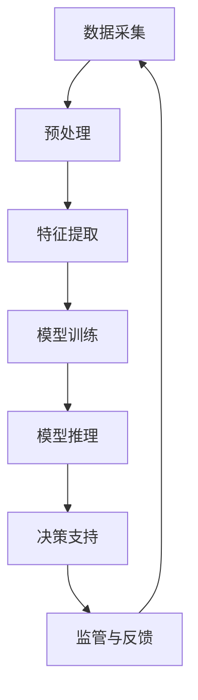

                 

# AI在农业和食品安全中的应用

在21世纪，随着全球人口的迅速增长和农业资源的紧缺，如何利用科技手段提高农业生产效率、保障食品安全，成为了一个迫在眉睫的问题。人工智能（AI）作为当前最为前沿的技术，以其强大的数据分析、决策支持和自动化能力，在农业和食品安全领域展现出广阔的应用前景。本文将从背景介绍、核心概念、算法原理、项目实践、应用场景等多个角度，全面系统地阐述AI在农业和食品安全中的应用，帮助读者深入理解AI技术的潜力与挑战，展望未来发展趋势。

## 1. 背景介绍

### 1.1 问题由来

近年来，由于气候变化、资源短缺和环境污染等问题的加剧，全球农业生产面临前所未有的挑战。传统的农业生产模式已经难以满足日益增长的粮食需求。同时，食品安全问题也频繁发生，尤其是食品中农药残留、重金属超标等问题，严重威胁着人类的健康。在这样的背景下，农业和食品安全领域亟需引入新技术，以提高生产效率和保障食品安全。

### 1.2 问题核心关键点

AI技术在农业和食品安全领域的应用，关键在于通过数据分析和模型优化，提升农业生产的智能化水平和食品安全的监管能力。具体来说，AI可以帮助：
- 精准农业：利用AI分析气象、土壤、作物等数据，实现精准施肥、灌溉、病虫害防治等，提高农作物产量和品质。
- 智能检测：利用AI对食品成分、污染物进行快速检测，及时发现食品安全隐患。
- 食品安全监管：利用AI对食品供应链进行监测，确保食品安全可追溯。

## 2. 核心概念与联系

### 2.1 核心概念概述

在探讨AI在农业和食品安全中的应用之前，首先需要理解以下几个核心概念：

- **精准农业（Precision Agriculture）**：通过采集和分析大量农业数据，如气象、土壤、作物生长状态等，实现农业生产的精细化管理。
- **机器学习（Machine Learning）**：一种数据驱动的人工智能技术，通过构建模型，自动从数据中学习规律，并用于预测和决策。
- **深度学习（Deep Learning）**：机器学习的一个分支，通过多层神经网络模型，从大量数据中学习复杂的特征表示。
- **计算机视觉（Computer Vision）**：利用计算机算法和模型，分析图像和视频数据，实现目标检测、分类、识别等任务。
- **自然语言处理（Natural Language Processing, NLP）**：处理和理解人类语言，包括文本分类、信息抽取、情感分析等。

### 2.2 核心概念原理和架构的 Mermaid 流程图



## 3. 核心算法原理 & 具体操作步骤

### 3.1 算法原理概述

AI在农业和食品安全中的应用，主要是通过收集和分析相关数据，构建和优化机器学习模型，实现智能化的决策和监管。其核心算法原理包括以下几个方面：

- **数据采集与预处理**：通过传感器、卫星遥感、无人机等技术，收集农业环境和食品生产的各类数据，包括气象数据、土壤数据、作物生长数据、食品成分数据等。对数据进行清洗、归一化、标记等预处理，保证数据的质量和一致性。

- **特征提取与选择**：从原始数据中提取有意义的特征，包括但不限于气象参数、土壤参数、作物生长指标、食品营养成分、污染物浓度等。利用主成分分析（PCA）、线性判别分析（LDA）等技术，选择最具代表性的特征，构建特征向量。

- **模型训练与优化**：根据选定的特征向量，构建机器学习模型，如支持向量机（SVM）、决策树、随机森林、神经网络等。利用历史数据进行模型训练，并采用交叉验证、正则化等技术，优化模型参数和结构，提高模型的泛化能力和鲁棒性。

- **模型推理与决策支持**：将训练好的模型应用于新的数据，进行实时推理和预测。如通过深度学习模型，分析气象数据和土壤参数，预测作物生长状况和产量；通过计算机视觉技术，对食品成分和污染物进行快速检测。结合业务规则和专家知识，生成智能决策和推荐。

- **监管与反馈**：对模型预测结果进行实时监控和评估，如发现异常数据或模型性能下降，及时进行调整和优化。同时，对模型结果进行反馈，积累经验，持续改进模型性能。

### 3.2 算法步骤详解

AI在农业和食品安全中的应用，可以分为以下几个具体步骤：

1. **数据采集与预处理**：
   - 利用传感器、无人机等技术，采集气象、土壤、作物生长、食品成分等数据。
   - 对采集到的数据进行清洗、归一化、标记等预处理，确保数据质量。

2. **特征提取与选择**：
   - 从原始数据中提取特征，如气象参数、土壤参数、作物生长指标、食品营养成分等。
   - 利用特征选择技术，选择最具代表性的特征，构建特征向量。

3. **模型训练与优化**：
   - 根据选定的特征向量，构建机器学习模型，如支持向量机、决策树、神经网络等。
   - 利用历史数据进行模型训练，并采用交叉验证、正则化等技术，优化模型参数和结构。

4. **模型推理与决策支持**：
   - 将训练好的模型应用于新的数据，进行实时推理和预测。
   - 结合业务规则和专家知识，生成智能决策和推荐。

5. **监管与反馈**：
   - 对模型预测结果进行实时监控和评估，及时进行调整和优化。
   - 对模型结果进行反馈，积累经验，持续改进模型性能。

### 3.3 算法优缺点

AI在农业和食品安全中的应用，具有以下优点：
- **效率提升**：通过自动化和智能化技术，大幅提高农业生产效率和食品安全监管效率。
- **数据驱动**：利用大量数据进行模型训练和优化，提高模型的准确性和泛化能力。
- **实时监测**：实现对农业环境和食品生产的实时监控和预测，及时发现问题并进行干预。

同时，也存在一些缺点：
- **数据依赖**：AI的应用效果高度依赖于数据的质量和多样性，数据缺失或不准确会影响模型性能。
- **技术复杂**：AI技术的应用需要较高的技术门槛和专业人才，推广和应用成本较高。
- **模型解释**：AI模型的决策过程通常缺乏可解释性，难以对其内部工作机制进行调试和优化。

### 3.4 算法应用领域

AI在农业和食品安全中的应用，主要涵盖以下几个领域：

1. **精准农业**：通过收集和分析气象、土壤、作物等数据，实现精准施肥、灌溉、病虫害防治等，提高农作物产量和品质。
2. **智能检测**：利用AI对食品成分、污染物进行快速检测，及时发现食品安全隐患。
3. **食品安全监管**：利用AI对食品供应链进行监测，确保食品安全可追溯。
4. **农业机器人**：利用AI技术开发农业机器人，实现自动化种植、收获等农业操作。
5. **智能物流**：利用AI优化食品供应链管理，提高物流效率和食品安全。

## 4. 数学模型和公式 & 详细讲解 & 举例说明

### 4.1 数学模型构建

AI在农业和食品安全中的应用，通常涉及多个数学模型。以下以预测农作物产量为例，介绍数学模型的构建。

设 $X=\{x_1, x_2, \ldots, x_n\}$ 为输入特征向量，$y$ 为输出变量（如农作物产量）。根据历史数据，构建线性回归模型：

$$
y = \theta_0 + \theta_1x_1 + \theta_2x_2 + \ldots + \theta_nx_n
$$

其中 $\theta_0, \theta_1, \ldots, \theta_n$ 为模型参数，需要通过历史数据进行训练。利用最小二乘法，求解最优参数：

$$
\theta = (X^T X)^{-1} X^T y
$$

### 4.2 公式推导过程

在上述线性回归模型的基础上，引入正则化项 $\lambda \sum_{i=1}^n \theta_i^2$，以防止过拟合：

$$
\min_{\theta} \frac{1}{2N} \sum_{i=1}^N (y_i - \theta_0 - \theta_1x_{i1} - \ldots - \theta_nx_{in})^2 + \frac{\lambda}{2} \sum_{i=1}^n \theta_i^2
$$

利用拉格朗日乘子法求解上述优化问题，得到正则化最小二乘法的解：

$$
\theta = (X^T X + \lambda I)^{-1} X^T y
$$

### 4.3 案例分析与讲解

以智能检测为例，介绍AI在食品安全中的应用。设 $X=\{x_1, x_2, \ldots, x_n\}$ 为输入特征向量，$y$ 为输出变量（如食品是否含有超标物质）。通过计算机视觉技术，对食品图像进行预处理和特征提取，构建卷积神经网络（CNN）模型：

$$
y = f_{CNN}(X)
$$

其中 $f_{CNN}$ 为CNN模型，通过历史数据进行训练。在训练过程中，利用交叉验证技术，评估模型性能：

$$
\text{Accuracy} = \frac{1}{N} \sum_{i=1}^N I(y_i = \hat{y_i})
$$

## 5. 项目实践：代码实例和详细解释说明

### 5.1 开发环境搭建

要进行AI在农业和食品安全中的应用开发，首先需要搭建相应的开发环境。以下是基于Python的开发环境搭建流程：

1. **安装Anaconda**：从官网下载并安装Anaconda，用于创建独立的Python环境。
```bash
conda create -n py38 python=3.8
conda activate py38
```

2. **安装必要的Python库**：
```bash
conda install numpy scipy pandas matplotlib sklearn scikit-learn
```

3. **安装深度学习框架**：
```bash
pip install torch torchvision
```

4. **安装计算机视觉库**：
```bash
pip install opencv-python
```

5. **安装自然语言处理库**：
```bash
pip install nlp
```

完成上述步骤后，即可在`py38`环境中进行开发。

### 5.2 源代码详细实现

以下是一个基于Python和TensorFlow实现智能检测的代码实例。

```python
import tensorflow as tf
from tensorflow.keras.layers import Conv2D, MaxPooling2D, Flatten, Dense
from tensorflow.keras.models import Sequential
from tensorflow.keras.preprocessing.image import ImageDataGenerator

# 定义模型
model = Sequential()
model.add(Conv2D(32, (3, 3), activation='relu', input_shape=(32, 32, 3)))
model.add(MaxPooling2D((2, 2)))
model.add(Conv2D(64, (3, 3), activation='relu'))
model.add(MaxPooling2D((2, 2)))
model.add(Conv2D(128, (3, 3), activation='relu'))
model.add(MaxPooling2D((2, 2)))
model.add(Flatten())
model.add(Dense(128, activation='relu'))
model.add(Dense(1, activation='sigmoid'))

# 编译模型
model.compile(optimizer='adam', loss='binary_crossentropy', metrics=['accuracy'])

# 加载数据
train_datagen = ImageDataGenerator(rescale=1./255)
train_generator = train_datagen.flow_from_directory('train', target_size=(32, 32), batch_size=32, class_mode='binary')

test_datagen = ImageDataGenerator(rescale=1./255)
test_generator = test_datagen.flow_from_directory('test', target_size=(32, 32), batch_size=32, class_mode='binary')

# 训练模型
model.fit(train_generator, epochs=10, validation_data=test_generator)

# 评估模型
test_loss, test_acc = model.evaluate(test_generator)
print(f'Test loss: {test_loss}, Test accuracy: {test_acc}')
```

### 5.3 代码解读与分析

上述代码实现了一个简单的卷积神经网络模型，用于对食品图像进行分类。具体解读如下：

- **模型定义**：利用`Sequential`模型定义了一个包含多个卷积层、池化层和全连接层的神经网络。其中，卷积层用于提取图像特征，池化层用于降低特征维度，全连接层用于分类决策。
- **数据加载**：利用`ImageDataGenerator`对数据进行增强和预处理，然后通过`flow_from_directory`加载训练和测试数据。
- **模型训练**：通过`fit`方法对模型进行训练，指定训练轮数和验证集。
- **模型评估**：通过`evaluate`方法对模型进行评估，输出测试损失和准确率。

## 6. 实际应用场景

### 6.1 精准农业

在精准农业中，AI技术可以通过分析气象、土壤、作物生长等数据，实现精准施肥、灌溉、病虫害防治等。以下是一个基于机器学习模型的精准农业应用实例：

1. **数据采集**：通过气象站、土壤传感器、无人机等设备，采集气象数据、土壤数据、作物生长数据等。
2. **数据预处理**：对采集到的数据进行清洗、归一化、标记等预处理，确保数据质量。
3. **模型训练**：构建机器学习模型，如随机森林、支持向量机等，通过历史数据进行训练。
4. **模型推理**：将训练好的模型应用于新的数据，进行实时推理和预测，生成施肥、灌溉、病虫害防治等决策。

### 6.2 智能检测

在智能检测中，AI技术可以用于快速检测食品中的成分和污染物。以下是一个基于计算机视觉技术的智能检测应用实例：

1. **数据采集**：通过摄像头、光谱仪等设备，采集食品图像和光谱数据。
2. **数据预处理**：对采集到的数据进行预处理和增强，如去噪、归一化等。
3. **模型训练**：利用计算机视觉技术，构建卷积神经网络（CNN）模型，通过历史数据进行训练。
4. **模型推理**：将训练好的模型应用于新的数据，进行实时检测和分析，生成食品成分和污染物信息。

### 6.3 食品安全监管

在食品安全监管中，AI技术可以用于监测食品供应链，确保食品安全可追溯。以下是一个基于自然语言处理技术的食品安全监管应用实例：

1. **数据采集**：通过物联网设备、溯源系统等，采集食品生产、加工、运输、销售等环节的数据。
2. **数据预处理**：对采集到的数据进行清洗、归一化、标记等预处理，确保数据质量。
3. **模型训练**：利用自然语言处理技术，构建文本分类模型，通过历史数据进行训练。
4. **模型推理**：将训练好的模型应用于新的数据，进行实时监测和分析，生成食品安全信息。

## 7. 工具和资源推荐

### 7.1 学习资源推荐

以下是一些优秀的学习资源，帮助开发者系统掌握AI在农业和食品安全中的应用：

1. **《深度学习》课程**（Coursera）：由斯坦福大学Andrew Ng教授主讲的深度学习课程，系统介绍深度学习原理和应用。
2. **《机器学习》课程**（Coursera）：由斯坦福大学Andrew Ng教授主讲的机器学习课程，涵盖机器学习基本概念和算法。
3. **《计算机视觉》课程**（Coursera）：由斯坦福大学李飞飞教授主讲的计算机视觉课程，涵盖计算机视觉基本概念和算法。
4. **《自然语言处理》课程**（Coursera）：由斯坦福大学Christopher Manning教授主讲的自然语言处理课程，涵盖自然语言处理基本概念和算法。
5. **TensorFlow官方文档**：TensorFlow的官方文档，提供详细的API参考和代码示例，帮助开发者快速上手使用。

### 7.2 开发工具推荐

以下是一些常用的开发工具，帮助开发者高效开发AI在农业和食品安全中的应用：

1. **Jupyter Notebook**：一个免费的交互式笔记本环境，支持Python代码的编写、执行和展示。
2. **PyCharm**：一个功能强大的Python IDE，支持代码调试、版本控制、环境管理等。
3. **TensorBoard**：TensorFlow的可视化工具，用于实时监测模型训练状态，提供丰富的图表呈现方式。
4. **GitHub**：一个代码托管平台，支持代码版本控制和团队协作，方便开发者共享和复用代码。

### 7.3 相关论文推荐

以下是几篇重要的相关论文，推荐阅读：

1. **《基于深度学习的精准农业管理》**（International Journal of Agriculture and Crop Science）：介绍基于深度学习的精准农业管理技术，包括气象预测、土壤分析、作物生长预测等。
2. **《智能检测在食品安全中的应用》**（IEEE Transactions on Food Science and Technology）：介绍基于计算机视觉和深度学习的智能检测技术，包括食品成分检测、污染物检测等。
3. **《自然语言处理在食品安全监管中的应用》**（Journal of Food Science）：介绍基于自然语言处理技术的食品安全监管技术，包括食品安全事件监测、食品标签分析等。

## 8. 总结：未来发展趋势与挑战

### 8.1 研究成果总结

AI在农业和食品安全中的应用，已经在多个方面展示了其潜力。通过AI技术，农业生产效率得到了显著提升，食品安全监管能力得到了增强。未来，随着技术的发展，AI在农业和食品安全领域的应用将更加广泛和深入。

### 8.2 未来发展趋势

1. **自动化和智能化**：未来AI在农业和食品安全中的应用将更加自动化和智能化，减少人工干预，提高生产效率和监管能力。
2. **多模态融合**：未来AI将更多地融合多种数据类型，如图像、视频、传感器数据等，实现更加全面和准确的分析。
3. **模型优化和解释**：未来AI模型将更加注重优化和解释，提升模型的泛化能力和可解释性，便于用户理解和应用。
4. **边缘计算**：未来AI将在边缘设备上运行，实时处理和分析数据，提高响应速度和可靠性。
5. **人机协同**：未来AI将更多地融入人类活动，实现人机协同，提高系统的可靠性和可用性。

### 8.3 面临的挑战

尽管AI在农业和食品安全中的应用取得了初步成果，但仍面临一些挑战：

1. **数据质量和多样性**：数据质量和多样性直接影响AI模型的性能，如何获取高质量、多样化的数据是关键。
2. **技术复杂性**：AI技术的应用需要较高的技术门槛和专业人才，推广和应用成本较高。
3. **模型可解释性**：AI模型的决策过程通常缺乏可解释性，难以对其内部工作机制进行调试和优化。
4. **安全性和隐私保护**：AI在农业和食品安全中的应用涉及大量敏感数据，如何保障数据安全和隐私保护是重要问题。
5. **伦理和法律问题**：AI在农业和食品安全中的应用可能涉及伦理和法律问题，如何确保技术应用符合道德和法律标准是关键。

### 8.4 研究展望

未来，AI在农业和食品安全中的应用将面临更多的机遇和挑战。以下是一些研究展望：

1. **数据增强和扩充**：通过数据增强和扩充技术，提升数据质量和多样性，提高AI模型的性能。
2. **模型优化和解释**：开发更加优化和可解释的AI模型，提升模型的泛化能力和可解释性，便于用户理解和应用。
3. **多模态融合和集成**：融合多种数据类型，实现更加全面和准确的分析，提升系统的可靠性和可用性。
4. **边缘计算和分布式系统**：在边缘设备上运行AI模型，实时处理和分析数据，提高响应速度和可靠性。
5. **人机协同和智能决策**：实现人机协同，提高系统的可靠性和可用性，提升用户的使用体验。

## 9. 附录：常见问题与解答

### 9.1 问题1：AI在农业和食品安全中的应用有哪些优势？

答：AI在农业和食品安全中的应用具有以下优势：
- **提高效率**：通过自动化和智能化技术，大幅提高农业生产效率和食品安全监管效率。
- **数据驱动**：利用大量数据进行模型训练和优化，提高模型的准确性和泛化能力。
- **实时监测**：实现对农业环境和食品生产的实时监测和预测，及时发现问题并进行干预。

### 9.2 问题2：AI在农业和食品安全中的应用有哪些挑战？

答：AI在农业和食品安全中的应用面临以下挑战：
- **数据质量和多样性**：数据质量和多样性直接影响AI模型的性能，如何获取高质量、多样化的数据是关键。
- **技术复杂性**：AI技术的应用需要较高的技术门槛和专业人才，推广和应用成本较高。
- **模型可解释性**：AI模型的决策过程通常缺乏可解释性，难以对其内部工作机制进行调试和优化。
- **安全性和隐私保护**：AI在农业和食品安全中的应用涉及大量敏感数据，如何保障数据安全和隐私保护是重要问题。
- **伦理和法律问题**：AI在农业和食品安全中的应用可能涉及伦理和法律问题，如何确保技术应用符合道德和法律标准是关键。

### 9.3 问题3：AI在农业和食品安全中的应用前景如何？

答：AI在农业和食品安全中的应用前景广阔，未来将从以下几个方面得到发展：
- **自动化和智能化**：未来AI在农业和食品安全中的应用将更加自动化和智能化，减少人工干预，提高生产效率和监管能力。
- **多模态融合**：未来AI将更多地融合多种数据类型，如图像、视频、传感器数据等，实现更加全面和准确的分析。
- **模型优化和解释**：未来AI模型将更加注重优化和解释，提升模型的泛化能力和可解释性，便于用户理解和应用。
- **边缘计算**：未来AI将在边缘设备上运行，实时处理和分析数据，提高响应速度和可靠性。
- **人机协同**：未来AI将更多地融入人类活动，实现人机协同，提高系统的可靠性和可用性。

---

作者：禅与计算机程序设计艺术 / Zen and the Art of Computer Programming

