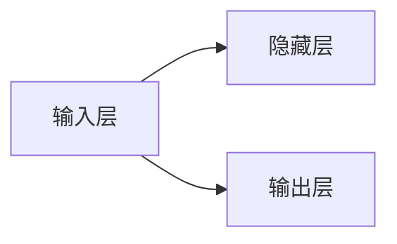

                 

# AI在智能交通流量预测中的应用：减少拥堵

> 关键词：智能交通,流量预测,拥堵缓解,人工智能,机器学习,深度学习,交通仿真

## 1. 背景介绍

### 1.1 问题由来

随着城市化进程的加快和车辆数量的激增，交通拥堵已经成为全球各大城市的普遍问题。交通拥堵不仅会导致车辆行驶效率的下降，增加燃油消耗和污染排放，还会影响人们的日常出行和生活质量。针对这一问题，智能交通系统(Smart Traffic Systems)应运而生，它通过集成各种传感器、监控设备和智能算法，对交通流量进行实时监测和预测，从而实现交通流量的调控和管理。

AI技术在大数据处理、模式识别、预测建模等方面具有天然优势，近年来被广泛应用于智能交通系统中。其中，基于机器学习和深度学习的交通流量预测模型，能够精准地预测交通流量变化，为交通管理部门提供决策支持，有效缓解交通拥堵，提升城市交通运行效率。

### 1.2 问题核心关键点

交通流量预测的核心在于准确地预测特定时间、特定区域内的车辆数量和行驶状态。这需要解决以下几个核心问题：

1. **数据收集与处理**：收集交通流量相关的历史和实时数据，并进行预处理和特征工程。
2. **模型选择与训练**：选择合适的模型结构，训练出高性能的流量预测模型。
3. **预测与优化**：利用预测模型输出流量预测结果，结合交通管理策略进行优化调控。
4. **评估与部署**：对预测模型进行评估，并部署到实际交通管理系统中。

### 1.3 问题研究意义

交通流量预测模型的有效应用，对于提升城市交通管理水平、改善居民出行体验、促进绿色交通具有重要意义。具体来说：

1. **提升交通效率**：通过预测流量高峰和低谷，合理规划道路通行，优化信号灯控制，减少车辆在道路上的等待时间。
2. **降低环境污染**：预测流量可以帮助制定有效的交通管理策略，减少因拥堵导致的车辆怠速和频繁启动，降低尾气排放。
3. **支持智能决策**：为交通管理部门提供科学决策依据，支持动态调控、事故应急处理等智能交通管理功能。
4. **促进绿色出行**：通过预测流量和优化路线规划，引导居民选择公共交通等低碳出行方式，促进绿色交通发展。

## 2. 核心概念与联系

### 2.1 核心概念概述

智能交通流量预测涉及多个关键概念和技术，以下是核心概念及其联系的简要介绍：

- **智能交通系统**：利用先进的信息、通信和控制技术，实现交通流的实时监测和动态控制，优化交通运行效率。
- **交通流量预测**：通过数学模型和算法，对未来交通流量进行预测，为交通管理提供数据支撑。
- **AI和机器学习**：利用机器学习算法和大数据处理技术，从海量交通数据中提取规律，构建高效的流量预测模型。
- **深度学习**：使用神经网络模型，从原始数据中学习复杂的非线性关系，提高流量预测的精度和泛化能力。
- **交通仿真**：利用计算机仿真技术，模拟交通流动的动态过程，评估不同交通管理策略的效果。
- **模型评估与优化**：通过交叉验证、对比实验等方法，对流量预测模型进行评估，并根据评估结果进行模型优化。

这些概念和技术相互关联，构成了智能交通流量预测的基本框架。下面将详细介绍AI和机器学习在交通流量预测中的应用。

## 3. 核心算法原理 & 具体操作步骤

### 3.1 算法原理概述

基于AI的交通流量预测模型主要基于机器学习和深度学习技术。其核心思想是通过历史交通流量数据训练模型，学习交通流量的变化规律，并利用这些规律预测未来的交通流量。

具体来说，交通流量预测模型一般分为以下几个步骤：

1. **数据收集与预处理**：收集历史和实时的交通流量数据，并进行清洗、归一化和特征提取。
2. **模型训练与评估**：选择合适的模型架构，如线性回归、支持向量机、随机森林、神经网络等，训练模型并进行交叉验证，评估模型性能。
3. **模型调优与部署**：根据评估结果调整模型参数，优化模型性能，并将模型部署到实际的交通管理系统。
4. **预测与反馈**：利用训练好的模型对未来交通流量进行预测，并结合实际交通状况进行反馈，进一步优化预测模型。

### 3.2 算法步骤详解

下面以深度学习模型为例，详细说明交通流量预测模型的操作步骤：

#### 3.2.1 数据收集与预处理

**Step 1: 数据收集**
- 收集交通流量相关的历史和实时数据，包括时间、地点、车辆类型、速度、密度等。
- 可以采用传感器、视频监控、GPS等手段获取实时交通数据。

**Step 2: 数据预处理**
- 对数据进行清洗，去除噪声和异常值。
- 对数据进行归一化和标准化，便于模型训练。
- 提取有用的特征，如历史流量、天气条件、节假日等。

#### 3.2.2 模型训练与评估

**Step 3: 模型选择**
- 选择合适的深度学习模型，如长短期记忆网络(LSTM)、卷积神经网络(CNN)、门控循环单元(GRU)等。
- 可以使用现有开源模型，如TensorFlow、PyTorch等，进行模型搭建。

**Step 4: 模型训练**
- 利用历史交通流量数据训练模型，使用交叉熵损失函数进行优化。
- 可以使用GPU或TPU等高性能设备加速训练过程。

**Step 5: 模型评估**
- 利用交叉验证技术，评估模型的性能。
- 常用的评估指标包括均方误差(MSE)、平均绝对误差(MAE)、R²等。

#### 3.2.3 模型调优与部署

**Step 6: 模型调优**
- 根据评估结果，调整模型参数，如学习率、正则化系数等。
- 使用梯度下降等优化算法，进一步优化模型性能。

**Step 7: 模型部署**
- 将训练好的模型部署到实际的交通管理系统。
- 可以实现实时流量预测和动态调控功能。

### 3.3 算法优缺点

基于AI的交通流量预测模型具有以下优点：

1. **预测精度高**：通过深度学习模型，能够从大量数据中学习复杂的非线性关系，提高预测精度。
2. **动态适应性强**：模型能够实时接收新数据，动态更新预测结果，适应交通流量的变化。
3. **应用范围广**：可以应用于城市道路、高速公路、机场等多个场景。
4. **协同优化能力强**：结合其他交通管理系统，可以实现流量预测与优化调控的协同。

但同时也存在一些缺点：

1. **数据需求高**：需要大量高质量的历史和实时数据，数据收集成本较高。
2. **模型复杂度高**：深度学习模型结构复杂，训练和调优过程较慢。
3. **计算资源要求高**：需要高性能计算设备，如GPU、TPU等，硬件成本较高。
4. **模型解释性不足**：黑盒模型难以解释内部决策机制，缺乏透明度。

### 3.4 算法应用领域

基于AI的交通流量预测模型在智能交通系统中得到了广泛应用，主要领域包括：

1. **城市道路交通管理**：通过实时流量预测，优化信号灯控制，减少车辆等待时间，提升道路通行效率。
2. **高速公路流量调控**：预测高速公路流量，实现动态收费、车辆引导等功能，缓解交通拥堵。
3. **机场航班调度**：预测机场人流和车流，优化航班调度，提升机场运营效率。
4. **公共交通系统**：预测公交站点客流量，调整发车频率，提升公共交通服务水平。

此外，AI流量预测技术还可以应用于物流配送、智能停车、共享单车等多个领域，推动智慧交通的发展。

## 4. 数学模型和公式 & 详细讲解  
### 4.1 数学模型构建

交通流量预测模型的数学模型一般包括输入层、隐藏层和输出层。以LSTM模型为例，其基本结构如图1所示：



图1：LSTM模型结构

具体来说，LSTM模型通过输入层接收历史交通流量数据，通过隐藏层进行时序信息的学习，最后通过输出层输出未来流量预测结果。

### 4.2 公式推导过程

以LSTM模型为例，其预测公式可以表示为：

$$
y_{t+1} = \sigma(W_{hy} \cdot [h_t, x_t] + b_h)
$$

其中，$y_{t+1}$ 为未来时间步的预测流量，$x_t$ 为当前时间步的输入特征，$h_t$ 为隐藏层状态，$\sigma$ 为激活函数，$W_{hy}$ 和 $b_h$ 为模型参数。

在训练过程中，LSTM模型使用反向传播算法更新参数，最小化预测值与实际值之间的误差。常用的误差函数包括均方误差(MSE)和交叉熵损失(Cross-entropy Loss)。

### 4.3 案例分析与讲解

以某城市道路交通流量预测为例，以下是LSTM模型的实现过程：

**Step 1: 数据收集与预处理**
- 收集该城市道路的历史交通流量数据，包括时间、地点、车辆类型、速度、密度等。
- 对数据进行清洗，去除噪声和异常值。
- 对数据进行归一化和标准化，便于模型训练。

**Step 2: 模型选择与训练**
- 选择LSTM模型，使用TensorFlow框架搭建模型。
- 利用历史流量数据训练模型，使用交叉熵损失函数进行优化。

**Step 3: 模型评估与调优**
- 利用交叉验证技术，评估模型的性能。
- 根据评估结果，调整模型参数，如学习率、正则化系数等。

**Step 4: 模型部署与预测**
- 将训练好的模型部署到实际的交通管理系统。
- 利用实时交通流量数据，进行流量预测和动态调控。

## 5. 项目实践：代码实例和详细解释说明

### 5.1 开发环境搭建

在进行交通流量预测项目开发前，需要准备好开发环境。以下是使用Python进行TensorFlow开发的环境配置流程：

1. 安装Anaconda：从官网下载并安装Anaconda，用于创建独立的Python环境。

2. 创建并激活虚拟环境：
```bash
conda create -n traffic-env python=3.8 
conda activate traffic-env
```

3. 安装TensorFlow：根据CUDA版本，从官网获取对应的安装命令。例如：
```bash
conda install tensorflow==2.3.0
```

4. 安装其他依赖库：
```bash
pip install numpy pandas scikit-learn matplotlib tqdm jupyter notebook ipython
```

完成上述步骤后，即可在`traffic-env`环境中开始项目实践。

### 5.2 源代码详细实现

下面以LSTM模型为例，给出使用TensorFlow进行交通流量预测的代码实现。

```python
import tensorflow as tf
import numpy as np
import pandas as pd

# 数据预处理
def preprocess_data(df):
    df = df.dropna()  # 去除缺失值
    df = df.drop_duplicates()  # 去除重复值
    df['time'] = pd.to_datetime(df['time'])
    df = df.groupby('time')['flow'].sum().reset_index()
    return df

# 构建LSTM模型
class LSTMModel(tf.keras.Model):
    def __init__(self, input_dim, output_dim, hidden_units):
        super(LSTMModel, self).__init__()
        self.lstm = tf.keras.layers.LSTM(units=hidden_units, return_sequences=True)
        self.dense = tf.keras.layers.Dense(units=output_dim)

    def call(self, inputs):
        lstm_outputs = self.lstm(inputs)
        dense_outputs = self.dense(lstm_outputs[:, -1, :])
        return dense_outputs

# 模型训练与评估
def train_model(model, x_train, y_train, x_val, y_val, batch_size, epochs):
    model.compile(optimizer=tf.keras.optimizers.Adam(learning_rate=0.001),
                  loss=tf.keras.losses.MeanSquaredError())
    history = model.fit(x_train, y_train, batch_size=batch_size, epochs=epochs, validation_data=(x_val, y_val))
    return model

# 数据生成
def generate_data():
    # 假设生成1000个时间步的流量数据
    x = np.random.rand(1000)
    y = x + np.random.rand(1000)
    return x, y

# 主函数
def main():
    # 生成数据
    x, y = generate_data()

    # 数据预处理
    df = pd.DataFrame({'x': x, 'y': y})
    df = preprocess_data(df)

    # 划分训练集和验证集
    train_data = df[:-100]
    val_data = df[-100:]

    # 构建模型
    model = LSTMModel(input_dim=1, output_dim=1, hidden_units=64)

    # 模型训练与评估
    model = train_model(model, train_data['x'].values.reshape(-1, 1, 1), train_data['y'].values.reshape(-1, 1), val_data['x'].values.reshape(-1, 1, 1), val_data['y'].values.reshape(-1, 1), batch_size=32, epochs=50)

    # 模型预测
    test_data = pd.DataFrame({'x': np.random.rand(100)})
    test_data = preprocess_data(test_data)
    pred = model.predict(test_data['x'].values.reshape(-1, 1, 1))

    print('预测结果：', pred)

if __name__ == '__main__':
    main()
```

### 5.3 代码解读与分析

让我们再详细解读一下关键代码的实现细节：

**preprocess_data函数**：
- 对原始数据进行清洗，去除缺失值和重复值。
- 对时间戳进行时间对齐，以确保时间序列的连续性。
- 将原始流量数据按时间求和，得到时间序列数据。

**LSTMModel类**：
- 定义LSTM模型的结构和层数。
- 定义模型的前向传播函数，输出预测结果。

**train_model函数**：
- 编译模型，选择优化器和损失函数。
- 使用训练集和验证集进行模型训练，并保存训练历史。

**generate_data函数**：
- 生成模拟流量数据，用于测试模型的预测性能。

**main函数**：
- 加载数据，进行预处理和模型训练。
- 在测试集上预测流量，并输出结果。

可以看到，TensorFlow框架提供了丰富的API和工具，可以方便地实现交通流量预测模型的构建和训练。开发者可以将更多精力放在数据处理、模型设计等方面，而不必过多关注底层实现细节。

当然，工业级的系统实现还需考虑更多因素，如模型的保存和部署、超参数的自动搜索、更灵活的任务适配层等。但核心的预测过程基本与此类似。

## 6. 实际应用场景

### 6.1 智能交通系统

基于AI的交通流量预测模型在智能交通系统中具有广泛的应用场景。以下是几个典型应用案例：

**案例1: 城市道路交通管理**
- 利用LSTM模型预测城市道路的交通流量，优化信号灯控制。
- 根据预测结果，动态调整信号灯配时，减少车辆等待时间。
- 实现红绿灯的智能控制，提升道路通行效率。

**案例2: 高速公路流量调控**
- 预测高速公路的交通流量，实现动态收费、车辆引导等功能。
- 根据流量预测结果，优化车辆收费方案，缓解高峰期的拥堵。
- 利用实时流量数据，动态调整车道通行策略，提升高速公路通行效率。

**案例3: 机场航班调度**
- 预测机场的人流和车流，优化航班调度。
- 根据预测结果，调整航班发车频率，减少延误和等待时间。
- 实现实时人流监控和动态调度，提升机场运营效率。

### 6.2 未来应用展望

随着AI技术的发展，基于AI的交通流量预测模型将进一步优化和扩展。以下是未来可能的发展趋势：

1. **多模态融合**：将交通流量预测与其他交通数据（如气象数据、交通事故数据）进行融合，提高预测精度。
2. **自适应学习**：利用在线学习技术，实时更新模型参数，适应交通流量的动态变化。
3. **跨域预测**：将交通流量预测与其他城市交通系统进行协同预测，提升预测能力。
4. **智能化决策**：结合交通流量预测结果，自动生成交通管理策略，实现智能化决策。
5. **安全性提升**：利用AI技术提升交通管理的智能性和安全性，减少交通事故的发生。

## 7. 工具和资源推荐

### 7.1 学习资源推荐

为了帮助开发者系统掌握AI在交通流量预测中的应用，这里推荐一些优质的学习资源：

1. 《深度学习与智能交通》系列博文：由AI专家撰写，系统介绍了深度学习在智能交通中的应用，包括流量预测、信号控制等。

2. 《机器学习在智能交通中的应用》课程：斯坦福大学开设的机器学习课程，涵盖智能交通的多个方面，包括数据预处理、模型选择、评估等。

3. 《AI交通流量预测》书籍：介绍AI在交通流量预测中的应用，包括LSTM模型、RNN模型等。

4. TensorFlow官方文档：提供了丰富的教程和示例，帮助开发者快速上手TensorFlow框架。

5. Kaggle交通流量预测比赛：Kaggle上的交通流量预测比赛，提供了大量的数据集和模型评估标准，帮助开发者提升实战能力。

通过对这些资源的学习实践，相信你一定能够快速掌握AI在交通流量预测中的应用，并用于解决实际的交通管理问题。

### 7.2 开发工具推荐

高效的开发离不开优秀的工具支持。以下是几款用于AI流量预测开发的常用工具：

1. TensorFlow：基于Python的开源深度学习框架，灵活动态的计算图，适合快速迭代研究。

2. PyTorch：基于Python的开源深度学习框架，动态图和静态图并存，灵活高效。

3. Keras：基于TensorFlow和Theano的高级API，提供简单易用的API接口，适合快速原型开发。

4. Weights & Biases：模型训练的实验跟踪工具，可以记录和可视化模型训练过程中的各项指标，方便对比和调优。

5. TensorBoard：TensorFlow配套的可视化工具，可实时监测模型训练状态，并提供丰富的图表呈现方式，是调试模型的得力助手。

合理利用这些工具，可以显著提升AI流量预测任务的开发效率，加快创新迭代的步伐。

### 7.3 相关论文推荐

AI交通流量预测技术的发展离不开学界的持续研究。以下是几篇奠基性的相关论文，推荐阅读：

1. Deep Traffic Flow Prediction using LSTM Networks：提出基于LSTM模型的交通流量预测方法，在数据集上的表现优异。

2. Traffic Flow Prediction Using Deep Belief Networks：利用深度信念网络进行交通流量预测，提出层次化的特征提取方法。

3. Multi-scale Temporal Attention Networks for Traffic Flow Prediction：提出基于多尺度注意力网络的流量预测方法，提升模型对长序列数据的处理能力。

4. Long Short-Term Memory-Based Traffic Prediction：利用LSTM模型进行交通流量预测，并结合遗传算法优化模型参数。

5. Attention-based Deep Traffic Flow Prediction：提出基于注意力机制的深度学习模型，提高流量预测的精度和泛化能力。

这些论文代表了大流量预测技术的发展脉络。通过学习这些前沿成果，可以帮助研究者把握学科前进方向，激发更多的创新灵感。

## 8. 总结：未来发展趋势与挑战

### 8.1 研究成果总结

本文对基于AI的交通流量预测技术进行了全面系统的介绍。首先阐述了交通流量预测的背景和重要性，明确了AI技术在流量预测中的应用潜力。其次，从原理到实践，详细讲解了交通流量预测的数学模型和算法实现，给出了模型训练和评估的完整代码实例。同时，本文还探讨了AI流量预测技术在智能交通系统中的广泛应用，展示了其巨大的应用前景。

通过本文的系统梳理，可以看到，AI流量预测技术正在成为智能交通系统的重要组成部分，极大地提升了交通管理效率和通行效率，带来了显著的经济和社会效益。

### 8.2 未来发展趋势

展望未来，AI流量预测技术将呈现以下几个发展趋势：

1. **模型复杂化**：随着AI技术的不断发展，未来流量预测模型将更加复杂，融合更多先进的深度学习技术。
2. **数据多样化**：将更多交通数据融合到流量预测中，提高模型的泛化能力和预测精度。
3. **算法优化**：提出新的算法优化方法，如自适应学习、多模态融合等，提升模型的实时性和适应性。
4. **应用场景扩展**：AI流量预测技术将应用于更多交通场景，如公共交通、物流配送等，推动智慧交通的发展。

### 8.3 面临的挑战

尽管AI流量预测技术已经取得了瞩目成就，但在迈向更加智能化、普适化应用的过程中，它仍面临着诸多挑战：

1. **数据获取困难**：高质量的交通流量数据难以获取，成为制约流量预测性能的瓶颈。如何优化数据采集和预处理技术，提高数据的准确性和可靠性，仍是一个重要问题。
2. **计算资源昂贵**：大规模深度学习模型的训练和推理需要高性能计算设备，硬件成本较高。如何降低计算成本，提高模型的实时性和效率，仍是一个难题。
3. **模型解释性不足**：AI流量预测模型通常缺乏解释性，难以解释其内部决策机制，不利于实际应用中的可解释性和可控性。
4. **安全性问题**：AI模型可能存在偏见、漏洞等问题，容易受到攻击。如何提升模型的鲁棒性和安全性，保障数据和模型安全，仍是一个重要挑战。

### 8.4 研究展望

面对AI流量预测面临的这些挑战，未来的研究需要在以下几个方面寻求新的突破：

1. **数据增强技术**：利用数据增强技术，提升数据的质量和多样性，提高模型的泛化能力。
2. **模型压缩与优化**：提出新的模型压缩和优化方法，提高模型的实时性和效率。
3. **模型解释性提升**：结合符号化知识，提升模型的可解释性，增强决策的透明度和可控性。
4. **安全性增强**：利用对抗样本、鲁棒性分析等技术，提升模型的鲁棒性和安全性。

这些研究方向将推动AI流量预测技术向更加智能化、普适化方向发展，为智能交通系统的建设提供有力支持。相信随着技术的发展和应用的深化，AI流量预测技术必将在提升交通管理效率、改善居民出行体验、促进绿色交通等方面发挥更加重要的作用。

## 9. 附录：常见问题与解答

**Q1: 如何选择合适的交通流量预测模型？**

A: 选择合适的交通流量预测模型需要综合考虑以下几个因素：
1. 数据特征：如时间序列、空间分布、季节性等。
2. 预测精度：不同模型的预测精度不同，需要根据应用场景选择合适的模型。
3. 计算资源：深度学习模型需要高性能计算资源，需考虑计算资源限制。
4. 可解释性：部分模型（如线性回归）更易于解释，适合需要透明决策的场景。

**Q2: 如何提高交通流量预测模型的泛化能力？**

A: 提高模型的泛化能力需要从以下几个方面入手：
1. 数据多样性：收集更多不同场景、不同时间段的交通数据，丰富模型训练数据。
2. 特征工程：选择合适的特征，提取有用的信息，避免过拟合。
3. 模型正则化：使用正则化技术，如L2正则、Dropout等，防止过拟合。
4. 模型集成：采用模型集成技术，如Bagging、Boosting等，提高模型的泛化能力。

**Q3: 如何缓解交通流量预测模型的过拟合问题？**

A: 缓解过拟合问题需要从以下几个方面入手：
1. 数据增强：通过对数据进行扩充、变换，增加数据多样性。
2. 正则化技术：使用L2正则、Dropout等技术，防止模型过拟合。
3. 早停机制：设置早停阈值，避免模型在训练集上过拟合。
4. 模型集成：采用模型集成技术，如Bagging、Boosting等，提高模型的泛化能力。

**Q4: 如何提升交通流量预测模型的实时性？**

A: 提升模型的实时性需要从以下几个方面入手：
1. 模型压缩：对模型进行压缩，减小模型大小，提高推理速度。
2. 模型量化：将浮点模型转为定点模型，降低计算资源消耗。
3. 并行计算：利用多核、多机等并行计算技术，提高计算效率。
4. 算法优化：提出新的算法优化方法，如在线学习、增量学习等，提高模型的实时性。

**Q5: 如何优化交通流量预测模型的计算资源？**

A: 优化模型的计算资源需要从以下几个方面入手：
1. 硬件优化：使用高性能计算设备，如GPU、TPU等，加速模型训练和推理。
2. 模型并行：利用多机多核等并行计算技术，提高计算效率。
3. 模型压缩：对模型进行压缩，减小模型大小，降低计算资源消耗。
4. 算法优化：提出新的算法优化方法，如增量学习、在线学习等，减少计算成本。

这些技术手段可以帮助开发者在资源有限的条件下，提升交通流量预测模型的实时性和效率，更好地应用于实际交通管理系统中。

