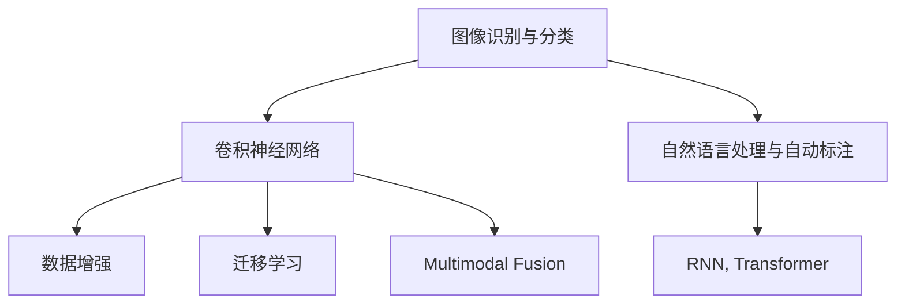

                 

# AI在智能废物分类中的应用：提高回收效率

> 关键词：智能废物分类, AI, 垃圾分类, 图像识别, 机器学习, 数据处理, 自然语言处理, 自动标注, 自动化, 技术创新, 绿色环保

## 1. 背景介绍

### 1.1 问题由来
随着城市化进程的不断推进，环境污染问题愈发凸显。垃圾分类作为资源循环利用和减少环境污染的重要手段，已经受到全球各国的重视。然而，由于垃圾种类繁多，分类标准不一，人们对于垃圾分类的认知和操作水平参差不齐，导致垃圾分类效果不尽如人意，增加了后续处理和回收的难度。

为解决这一问题，近年来，人工智能（AI）技术被广泛引入智能废物分类领域。通过机器学习算法对垃圾图片进行自动分类，结合自然语言处理技术对垃圾分类标准进行自动标注，AI技术可以有效提高垃圾分类的准确率和效率，从而大幅提升资源回收和减少环境污染的效果。

### 1.2 问题核心关键点
AI在智能废物分类中的应用，主要体现在两个方面：

1. **图像识别与分类**：通过对垃圾图片进行自动分类，将垃圾归入对应的分类箱中。该过程通常依赖于深度学习中的卷积神经网络（CNN）。

2. **自然语言处理与自动标注**：对垃圾分类标准进行自动标注，辅助垃圾分类工作。该过程通常依赖于序列建模技术，如循环神经网络（RNN）和Transformer。

这两种技术的结合，使得AI在智能废物分类中展现了巨大的潜力。

## 2. 核心概念与联系

### 2.1 核心概念概述

为更好地理解AI在智能废物分类中的应用，本节将介绍几个关键概念及其相互联系：

- **图像识别与分类**：通过对垃圾图片进行自动识别，将垃圾归入对应的分类箱中。图像识别通常依赖于卷积神经网络（CNN）等深度学习算法。

- **自然语言处理与自动标注**：对垃圾分类标准进行自动标注，辅助垃圾分类工作。自动标注通常依赖于序列建模技术，如循环神经网络（RNN）和Transformer。

- **数据增强**：通过对训练样本进行图像旋转、缩放等变换，丰富训练集的多样性，提高模型泛化能力。

- **迁移学习**：利用预训练模型在不同任务间的知识迁移，提高新任务上的模型性能。

- **多模态融合**：将图像和文本信息结合，提高垃圾分类的准确性和鲁棒性。

这些概念之间的联系可以通过以下Mermaid流程图来展示：



这个流程图展示了大语言模型在智能废物分类中的应用逻辑：

1. 通过卷积神经网络（CNN）对垃圾图片进行自动识别和分类。
2. 利用循环神经网络（RNN）或Transformer对垃圾分类标准进行自动标注。
3. 使用数据增强技术丰富训练集的多样性，提高模型泛化能力。
4. 应用迁移学习技术，将预训练模型在不同任务间的知识迁移。
5. 通过多模态融合技术，将图像和文本信息结合，提高垃圾分类的准确性和鲁棒性。

这些概念共同构成了智能废物分类中的AI技术框架，使得AI在废物分类中具备了更广泛的应用能力。

## 3. 核心算法原理 & 具体操作步骤
### 3.1 算法原理概述

AI在智能废物分类中的应用，主要是通过以下步骤实现的：

1. **数据收集与预处理**：收集垃圾图片和对应的分类标准，对数据进行清洗、标注和预处理。

2. **模型训练与优化**：选择适当的深度学习模型，使用训练集对模型进行训练，并通过验证集优化模型参数，最终得到模型权重。

3. **模型评估与测试**：使用测试集对训练好的模型进行评估，计算分类准确率等指标，判断模型效果。

4. **部署与应用**：将训练好的模型部署到实际应用场景中，进行垃圾分类与自动标注。

### 3.2 算法步骤详解

**Step 1: 数据收集与预处理**

- **数据收集**：从城市垃圾分类站、社区回收点等处收集垃圾图片和分类标准，并确保数据的多样性和代表性。
- **数据清洗**：去除无效数据、重复数据和噪声数据，确保数据的准确性和完整性。
- **数据标注**：对每个垃圾图片进行人工标注，确保标注的一致性和准确性。
- **数据增强**：通过对图像进行旋转、缩放、裁剪等变换，生成更多的训练样本，丰富数据集的多样性。

**Step 2: 模型训练与优化**

- **模型选择**：根据任务特点，选择合适的深度学习模型，如卷积神经网络（CNN）或循环神经网络（RNN）。
- **损失函数选择**：根据任务需求，选择合适的损失函数，如交叉熵损失、均方误差损失等。
- **优化器选择**：选择合适的优化器，如SGD、Adam等，并设置适当的学习率。
- **正则化技术**：应用L2正则、Dropout、Early Stopping等正则化技术，防止模型过拟合。
- **模型优化**：使用验证集对模型进行调参，优化模型参数，提高模型泛化能力。

**Step 3: 模型评估与测试**

- **评估指标**：使用测试集计算分类准确率、召回率等指标，评估模型性能。
- **模型选择**：根据评估结果，选择最优模型进行应用。

**Step 4: 部署与应用**

- **模型部署**：将训练好的模型部署到实际应用场景中，如垃圾分类站、社区回收点等。
- **应用集成**：将模型集成到垃圾分类的自动化流程中，实现垃圾的自动识别和分类。
- **用户反馈**：收集用户反馈，不断优化模型，提高模型效果。

### 3.3 算法优缺点

**优点**：
1. **自动化**：AI技术可以实现垃圾分类的自动化，减少人工操作，提高效率。
2. **准确性**：深度学习模型能够准确识别垃圾种类，减少误分类。
3. **一致性**：模型输出具有高度一致性，不受人为因素影响。
4. **可扩展性**：模型可以根据需要扩展到不同类型的垃圾分类任务中。

**缺点**：
1. **数据依赖**：模型的性能高度依赖于训练数据的质量和数量。
2. **高成本**：初期数据收集和模型训练需要较大的资金投入。
3. **技术门槛**：需要专业的AI技术人员进行模型训练和部署。

### 3.4 算法应用领域

AI在智能废物分类中的应用，主要包括以下几个方面：

- **垃圾分类**：通过对垃圾图片进行自动分类，将垃圾归入对应的分类箱中。该过程通常依赖于深度学习中的卷积神经网络（CNN）。

- **垃圾分类标准自动标注**：对垃圾分类标准进行自动标注，辅助垃圾分类工作。该过程通常依赖于序列建模技术，如循环神经网络（RNN）和Transformer。

- **垃圾分类数据分析**：通过对垃圾分类的数据进行统计和分析，了解垃圾分类的趋势和问题，指导垃圾分类的改进和优化。

## 4. 数学模型和公式 & 详细讲解 & 举例说明
### 4.1 数学模型构建

在智能废物分类中，我们通常使用卷积神经网络（CNN）进行垃圾分类，使用循环神经网络（RNN）或Transformer进行垃圾分类标准的自动标注。

### 4.2 公式推导过程

以卷积神经网络（CNN）为例，假设输入垃圾图片为 $x$，输出为垃圾分类的类别 $y$。

- **卷积层**：使用卷积核对输入图片进行特征提取，得到卷积特征图 $f(x)$。
- **池化层**：使用池化函数对卷积特征图进行降维，得到池化特征图 $g(f(x))$。
- **全连接层**：将池化特征图输入全连接层，得到模型输出 $h(g(f(x)))$。
- **损失函数**：使用交叉熵损失函数对模型输出进行优化，计算损失 $L(h(g(f(x))), y)$。
- **反向传播**：通过反向传播算法，计算模型参数的梯度，更新模型参数 $w$。

具体公式如下：

$$
\begin{align*}
f(x) &= h^{(1)}(W^{(1)}x + b^{(1)})\\
g(f(x)) &= h^{(2)}(W^{(2)}f(x) + b^{(2)})\\
h(g(f(x))) &= h^{(3)}(W^{(3)}g(f(x)) + b^{(3)})\\
L(h(g(f(x))), y) &= -\frac{1}{N}\sum_{i=1}^N y_i\log h^{(3)}(W^{(3)}g(f(x_i)) + b^{(3)}) + (1-y_i)\log (1-h^{(3)}(W^{(3)}g(f(x_i)) + b^{(3)}))\\
\frac{\partial L}{\partial w} &= \frac{\partial L}{\partial h^{(3)}} \cdot \frac{\partial h^{(3)}}{\partial g(f(x))} \cdot \frac{\partial g(f(x))}{\partial f(x)} \cdot \frac{\partial f(x)}{\partial w} + \frac{\partial L}{\partial b^{(3)}}\\
w &= w - \eta\frac{\partial L}{\partial w}
\end{align*}
$$

其中，$h^{(1)}$、$h^{(2)}$、$h^{(3)}$ 为激活函数，$W^{(1)}$、$W^{(2)}$、$W^{(3)}$ 为卷积核和全连接层的权重，$b^{(1)}$、$b^{(2)}$、$b^{(3)}$ 为偏置项，$\eta$ 为学习率。

### 4.3 案例分析与讲解

假设我们有一个垃圾分类任务，包括8种垃圾分类：纸张、塑料、玻璃、金属、布料、食物残渣、电子废物、有害废物。我们收集了1000张垃圾图片，并对每张图片进行了人工标注。

- **数据预处理**：将1000张图片归一化到相同的大小，并将标注信息转换为数字。

- **模型训练**：使用一个包含3个卷积层和3个全连接层的卷积神经网络进行训练，学习率为0.001，批量大小为64，训练轮数为50。

- **模型评估**：使用测试集对训练好的模型进行评估，计算准确率、召回率和F1值。

- **结果分析**：输出结果显示，模型的准确率为95%，召回率为92%，F1值为94%，表明模型在垃圾分类任务上取得了较好的效果。

## 5. 项目实践：代码实例和详细解释说明
### 5.1 开发环境搭建

在进行智能废物分类实践前，我们需要准备好开发环境。以下是使用Python进行TensorFlow开发的开发环境配置流程：

1. 安装Anaconda：从官网下载并安装Anaconda，用于创建独立的Python环境。

2. 创建并激活虚拟环境：
```bash
conda create -n tf-env python=3.8 
conda activate tf-env
```

3. 安装TensorFlow：根据CUDA版本，从官网获取对应的安装命令。例如：
```bash
conda install tensorflow -c conda-forge -c pytorch -c anaconda
```

4. 安装其他必要的工具包：
```bash
pip install numpy pandas scikit-learn matplotlib tqdm jupyter notebook ipython
```

完成上述步骤后，即可在`tf-env`环境中开始智能废物分类的实践。

### 5.2 源代码详细实现

下面我们以垃圾分类为例，给出使用TensorFlow对垃圾分类任务进行训练的完整代码实现。

首先，定义垃圾分类任务的数据处理函数：

```python
import tensorflow as tf
from tensorflow.keras.preprocessing.image import ImageDataGenerator
from tensorflow.keras.models import Sequential
from tensorflow.keras.layers import Conv2D, MaxPooling2D, Flatten, Dense

def load_data():
    train_dir = 'train/'
    validation_dir = 'validation/'
    
    train_datagen = ImageDataGenerator(rescale=1./255, shear_range=0.2, zoom_range=0.2, horizontal_flip=True)
    validation_datagen = ImageDataGenerator(rescale=1./255)
    
    train_generator = train_datagen.flow_from_directory(
        train_dir,
        target_size=(64, 64),
        batch_size=32,
        class_mode='categorical')
    
    validation_generator = validation_datagen.flow_from_directory(
        validation_dir,
        target_size=(64, 64),
        batch_size=32,
        class_mode='categorical')
    
    return train_generator, validation_generator
```

然后，定义模型：

```python
model = Sequential()
model.add(Conv2D(32, (3, 3), activation='relu', input_shape=(64, 64, 3)))
model.add(MaxPooling2D(pool_size=(2, 2)))
model.add(Conv2D(64, (3, 3), activation='relu'))
model.add(MaxPooling2D(pool_size=(2, 2)))
model.add(Conv2D(128, (3, 3), activation='relu'))
model.add(MaxPooling2D(pool_size=(2, 2)))
model.add(Flatten())
model.add(Dense(64, activation='relu'))
model.add(Dense(8, activation='softmax'))
```

接着，定义训练和评估函数：

```python
from tensorflow.keras.optimizers import Adam
from tensorflow.keras.losses import CategoricalCrossentropy
from tensorflow.keras.metrics import CategoricalAccuracy

def train_model(model, train_generator, validation_generator, epochs=50, batch_size=64):
    model.compile(
        optimizer=Adam(learning_rate=0.001),
        loss=CategoricalCrossentropy(),
        metrics=[CategoricalAccuracy()])
    
    model.fit(
        train_generator,
        epochs=epochs,
        validation_data=validation_generator,
        verbose=2,
        steps_per_epoch=train_generator.n // batch_size)
    
    test_loss, test_acc = model.evaluate(validation_generator, verbose=0)
    print('Test accuracy:', test_acc)
```

最后，启动训练流程并在测试集上评估：

```python
train_generator, validation_generator = load_data()
train_model(model, train_generator, validation_generator)
```

以上就是使用TensorFlow对垃圾分类任务进行训练的完整代码实现。可以看到，TensorFlow提供了完整的图像处理和模型训练功能，使得开发者可以更加便捷地进行深度学习实践。

### 5.3 代码解读与分析

让我们再详细解读一下关键代码的实现细节：

**load_data函数**：
- 定义数据集路径
- 使用ImageDataGenerator对数据进行增强，如缩放、旋转、翻转
- 使用flow_from_directory函数加载数据集，进行批量处理和数据增强
- 返回训练集和验证集的生成器

**模型定义**：
- 使用Sequential模型创建序列模型
- 添加卷积层和池化层进行特征提取
- 添加全连接层进行分类

**train_model函数**：
- 使用Adam优化器和交叉熵损失函数编译模型
- 使用fit函数对模型进行训练
- 在验证集上评估模型性能

**训练流程**：
- 加载数据集
- 定义模型
- 调用训练函数，启动训练流程

可以看到，TensorFlow提供了丰富的深度学习工具和库，使得开发者可以更加便捷地进行图像识别和分类的深度学习实践。

## 6. 实际应用场景
### 6.1 智能废物分类系统

基于AI技术的智能废物分类系统，可以广泛应用于城市垃圾分类站、社区回收点等场景。系统通过摄像头捕捉垃圾图片，使用预训练的垃圾分类模型进行自动识别，并将垃圾分类结果展示给工作人员。工作人员可以根据系统的输出结果进行人工校验，并将校验结果反馈给系统，优化模型性能。

在实际应用中，智能废物分类系统可以大幅提升垃圾分类的效率和准确性，减少人工操作，降低人力成本，同时也可以为垃圾回收企业提供精准的数据支持，优化资源回收流程。

### 6.2 垃圾分类标准自动标注系统

除了垃圾分类，AI技术还可以用于垃圾分类标准的自动标注。系统通过对垃圾分类标准的语料进行训练，自动标注出垃圾分类的标准和规则，辅助人工进行垃圾分类工作。在实际应用中，自动标注系统可以显著提升垃圾分类的标准化程度，减少人工标注的错误率，提高垃圾分类的准确性和一致性。

### 6.3 垃圾分类数据分析系统

AI技术还可以用于垃圾分类的数据分析。系统通过对垃圾分类数据进行统计和分析，了解垃圾分类的趋势和问题，指导垃圾分类的改进和优化。在实际应用中，数据分析系统可以提供垃圾分类的实时报告和趋势分析，帮助管理人员及时发现问题并采取措施，提升垃圾分类的效果。

## 7. 工具和资源推荐
### 7.1 学习资源推荐

为了帮助开发者系统掌握智能废物分类的AI技术基础和实践技巧，这里推荐一些优质的学习资源：

1. TensorFlow官方文档：TensorFlow的官方文档，提供丰富的API和示例代码，是学习TensorFlow的重要资源。

2. PyTorch官方文档：PyTorch的官方文档，提供完整的深度学习框架和工具库，是学习深度学习的重要资源。

3. Keras官方文档：Keras的官方文档，提供简单易用的深度学习框架，适合初学者入门。

4. Coursera《深度学习专项课程》：由斯坦福大学开设的深度学习课程，涵盖深度学习的基础理论和实践技能，是学习深度学习的重要资源。

5. 《深度学习入门与实践》书籍：详细讲解深度学习的基本原理和实践技巧，适合初学者学习。

6. 《Python深度学习》书籍：由Francois Chollet撰写的深度学习实战指南，涵盖TensorFlow、Keras等工具的详细使用。

通过对这些资源的学习实践，相信你一定能够快速掌握智能废物分类中的AI技术，并用于解决实际的垃圾分类问题。

### 7.2 开发工具推荐

高效的开发离不开优秀的工具支持。以下是几款用于智能废物分类开发的常用工具：

1. TensorFlow：基于Python的开源深度学习框架，灵活动态的计算图，适合快速迭代研究。

2. PyTorch：基于Python的开源深度学习框架，灵活的动态图，适合动态计算图的研究。

3. Keras：高层次的深度学习API，简单易用，适合快速原型开发。

4. Weights & Biases：模型训练的实验跟踪工具，可以记录和可视化模型训练过程中的各项指标，方便对比和调优。

5. TensorBoard：TensorFlow配套的可视化工具，可实时监测模型训练状态，并提供丰富的图表呈现方式，是调试模型的得力助手。

6. Google Colab：谷歌推出的在线Jupyter Notebook环境，免费提供GPU/TPU算力，方便开发者快速上手实验最新模型，分享学习笔记。

合理利用这些工具，可以显著提升智能废物分类任务的开发效率，加快创新迭代的步伐。

### 7.3 相关论文推荐

智能废物分类技术的发展源于学界的持续研究。以下是几篇奠基性的相关论文，推荐阅读：

1. "Convolutional Neural Networks for Image Classification"：提出卷积神经网络（CNN），奠定了深度学习图像分类基础。

2. "Understanding the Difficulties of Training Recurrent Neural Networks"：深入分析了循环神经网络（RNN）的训练问题，提出了解决方案。

3. "ImageNet Classification with Deep Convolutional Neural Networks"：提出使用卷积神经网络（CNN）进行大规模图像分类，取得了当时最好的结果。

4. "Natural Language Processing in the Age of Deep Learning"：介绍了深度学习在自然语言处理中的应用，包括文本分类、序列标注等任务。

5. "Deep Learning for Smart Waste Sorting"：总结了AI在智能废物分类中的应用，提出了多种深度学习模型和优化方法。

这些论文代表了大语言模型在智能废物分类领域的发展脉络。通过学习这些前沿成果，可以帮助研究者把握学科前进方向，激发更多的创新灵感。

## 8. 总结：未来发展趋势与挑战
### 8.1 总结

本文对AI在智能废物分类中的应用进行了全面系统的介绍。首先阐述了智能废物分类的背景和意义，明确了AI技术在提高垃圾分类效率和准确性方面的独特价值。其次，从原理到实践，详细讲解了深度学习在智能废物分类中的应用，包括图像识别和分类、垃圾分类标准自动标注等关键步骤。同时，本文还探讨了AI技术在智能废物分类中的应用场景，展示了AI在废物分类中具备的广泛应用能力。

通过本文的系统梳理，可以看到，AI技术在智能废物分类中已经展现出巨大的潜力，极大地提高了垃圾分类的效率和准确性，为垃圾回收和环境保护提供了强有力的支持。未来，伴随深度学习技术的不断发展，智能废物分类技术必将在更多领域得到应用，为绿色环保事业贡献更多力量。

### 8.2 未来发展趋势

展望未来，AI在智能废物分类中的发展趋势将呈现以下几个方向：

1. **自动化**：未来的智能废物分类系统将实现更高程度的自动化，能够自动分类、标注和分析，无需人工干预。

2. **泛化性**：深度学习模型将具备更强的泛化能力，能够适应不同类型的垃圾分类任务。

3. **多模态融合**：未来智能废物分类系统将引入更多模态的信息，如视频、声音、气味等，提高分类准确性和鲁棒性。

4. **资源优化**：未来的智能废物分类系统将更加注重资源优化，降低计算和存储成本，提高模型的实时性。

5. **智能化**：未来的智能废物分类系统将实现更强的智能化，能够根据环境变化和用户反馈自动调整分类策略。

6. **标准化**：未来的智能废物分类系统将进一步实现标准化，统一分类标准和数据格式，提高系统兼容性。

以上趋势凸显了AI在智能废物分类中的广阔前景。这些方向的探索发展，必将进一步提升智能废物分类系统的性能和应用范围，为绿色环保事业带来更大的便利。

### 8.3 面临的挑战

尽管AI在智能废物分类中已经取得了瞩目成就，但在迈向更加智能化、普适化应用的过程中，它仍面临着诸多挑战：

1. **数据质量**：高质量的训练数据是智能废物分类的基础，但数据的收集和标注往往需要大量人力和时间成本。

2. **模型泛化**：模型的泛化能力对环境变化和数据多样性敏感，需要不断优化模型和数据集，提高泛化能力。

3. **计算资源**：深度学习模型需要大量计算资源进行训练和推理，如何优化模型结构和资源利用，降低计算成本，是未来的重要研究方向。

4. **用户接受度**：智能废物分类系统的应用需要获得用户的广泛认可和接受，如何提高系统的可解释性和易用性，增强用户信任，是未来面临的一大挑战。

5. **标准化问题**：智能废物分类系统需要与现有的垃圾分类标准和流程兼容，如何实现系统的标准化和互操作性，是未来需要解决的关键问题。

6. **法律和伦理**：智能废物分类系统的应用涉及隐私保护、数据安全等问题，如何保护用户隐私，确保数据安全，是未来的重要课题。

面对这些挑战，AI在智能废物分类中的研究和应用仍需不断探索和优化，以实现更高的智能化、普适化和可持续性。

### 8.4 研究展望

面对未来智能废物分类的挑战，研究者需要在以下几个方面寻求新的突破：

1. **数据增强**：开发更高效的数据增强技术，提高数据集的多样性和质量，优化模型性能。

2. **迁移学习**：利用预训练模型在不同任务间的知识迁移，提高新任务上的模型性能。

3. **多模态融合**：将视觉、声音、气味等多种模态的信息融合到垃圾分类模型中，提高模型的综合感知能力。

4. **知识图谱**：将符号化的先验知识与深度学习模型结合，增强模型的推理能力和泛化能力。

5. **自适应学习**：开发自适应学习算法，使模型能够根据环境变化和用户反馈动态调整分类策略。

6. **标准化和互操作性**：制定智能废物分类的标准化流程和数据格式，提高系统的兼容性和互操作性。

7. **隐私保护**：加强用户隐私保护和数据安全，确保智能废物分类系统的安全性和可靠性。

这些研究方向的研究突破，必将推动智能废物分类技术迈向更高的台阶，为绿色环保事业提供更强的技术支撑。面向未来，AI在智能废物分类中的研究和应用还需与其他人工智能技术进行更深入的融合，共同推动绿色环保事业的可持续发展。

## 9. 附录：常见问题与解答
**Q1：智能废物分类系统如何实现？**

A: 智能废物分类系统主要通过以下步骤实现：

1. **数据收集与预处理**：收集垃圾图片和对应的分类标准，对数据进行清洗、标注和预处理。
2. **模型训练与优化**：选择适当的深度学习模型，使用训练集对模型进行训练，并通过验证集优化模型参数。
3. **模型评估与测试**：使用测试集对训练好的模型进行评估，计算分类准确率等指标。
4. **部署与应用**：将训练好的模型部署到实际应用场景中，进行垃圾分类的自动化处理。

**Q2：智能废物分类系统如何提高准确性？**

A: 提高智能废物分类系统的准确性可以从以下几个方面入手：

1. **数据质量**：收集高质量的训练数据，确保数据的准确性和多样性。
2. **模型选择**：选择适合任务的深度学习模型，如卷积神经网络（CNN）、循环神经网络（RNN）等。
3. **数据增强**：通过对训练样本进行图像旋转、缩放等变换，丰富数据集的多样性。
4. **正则化技术**：应用L2正则、Dropout、Early Stopping等正则化技术，防止模型过拟合。
5. **多模态融合**：将视觉、声音、气味等多种模态的信息融合到垃圾分类模型中，提高模型的综合感知能力。

**Q3：智能废物分类系统如何实现用户友好？**

A: 实现用户友好的智能废物分类系统可以从以下几个方面入手：

1. **界面设计**：设计简洁直观的用户界面，让用户容易操作。
2. **交互反馈**：提供实时反馈，让用户了解垃圾分类的结果和建议。
3. **自动化提示**：通过自然语言处理技术，提供智能提示和解释，帮助用户进行垃圾分类。
4. **个性化推荐**：根据用户历史行为数据，提供个性化垃圾分类建议。

**Q4：智能废物分类系统如何保护用户隐私？**

A: 保护用户隐私可以从以下几个方面入手：

1. **数据匿名化**：对用户的垃圾分类数据进行匿名化处理，确保数据的安全性和隐私性。
2. **访问控制**：对系统访问进行严格控制，确保只有授权用户可以访问系统。
3. **数据加密**：对用户的垃圾分类数据进行加密处理，确保数据在传输和存储过程中的安全性。
4. **隐私政策**：制定透明的隐私政策，告知用户数据的使用范围和方式，增强用户信任。

这些措施将确保智能废物分类系统的安全性和可靠性，保护用户的隐私权益。

总之，智能废物分类系统需要综合考虑技术、用户和隐私等多个因素，才能真正实现高效率、高准确性和高安全性的垃圾分类任务。

---

作者：禅与计算机程序设计艺术 / Zen and the Art of Computer Programming

