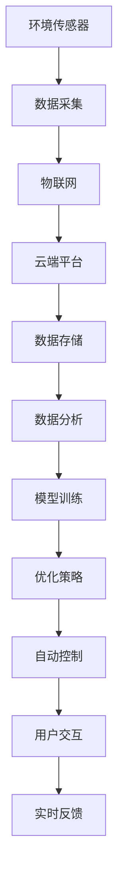

                 

# AI在智能空气质量管理中的应用：改善室内环境

> 关键词：智能空气质量管理,室内环境监测,空气质量预测,优化算法,物联网(IoT)

## 1. 背景介绍

### 1.1 问题由来
随着科技的进步和社会的发展，人类生活方式发生了翻天覆地的变化。现代城市中，人们大量使用各种电器和化学品，导致室内空气质量不断恶化。传统的环境监测设备大多缺乏智能化功能，难以及时反应环境变化。为此，基于人工智能(AI)的智能空气质量管理技术应运而生。

智能空气质量管理通过结合AI技术和物联网(IoT)设备，能够实时监测室内空气质量，分析环境数据并给出改善建议。相较于传统环境监测，智能空气质量管理具备更高的精度和实时性，能够对室内环境进行持续优化，显著提升居住和工作环境的舒适度和健康性。

### 1.2 问题核心关键点
智能空气质量管理的关键技术点包括：

- **环境传感器**：用于实时监测空气质量，采集PM2.5、CO2、甲醛、温度、湿度等关键指标。
- **AI算法**：利用机器学习、深度学习等技术，分析环境数据，预测空气质量变化，提出优化策略。
- **物联网**：将传感器与云端平台无缝连接，实现数据的实时传输和远程控制。
- **用户交互**：通过移动应用或语音交互等形式，向用户提供实时空气质量信息及改善建议。

## 2. 核心概念与联系

### 2.1 核心概念概述

为更好理解智能空气质量管理的核心技术，本节将介绍几个关键概念：

- **环境传感器**：用于监测室内外环境数据的各类传感器，如空气质量传感器、温湿度传感器、CO2传感器等。
- **物联网(IoT)**：将环境传感器与云端平台、用户端设备互联互通的技术体系。
- **机器学习(ML)**：从历史环境数据中学习模式和规律，以提升环境预测和优化效果。
- **深度学习(DL)**：利用神经网络对环境数据进行更深层次的分析和理解。
- **强化学习(RL)**：通过不断试错，优化智能系统控制策略，实现环境自动调节。

这些概念之间的逻辑关系可以通过以下Mermaid流程图来展示：



这个流程图展示了智能空气质量管理的基本流程：

1. 环境传感器采集数据。
2. 数据通过物联网传输到云端平台。
3. 云端平台存储数据并进行分析。
4. 利用机器学习和深度学习技术训练模型。
5. 基于训练好的模型，优化环境控制策略。
6. 实现自动控制和用户交互。
7. 实时反馈并优化系统。

## 3. 核心算法原理 & 具体操作步骤
### 3.1 算法原理概述

智能空气质量管理算法主要由两部分组成：环境数据监测与预测、环境控制优化。

**环境数据监测与预测算法**：利用机器学习和深度学习算法对历史环境数据进行分析，建立环境质量变化模型，从而预测未来一段时间内的空气质量状况。

**环境控制优化算法**：通过强化学习等技术，结合环境监测结果和优化目标，自动调整室内环境的控制参数，如通风、湿度、温度等，实现最优的空气质量改善效果。

### 3.2 算法步骤详解

#### 3.2.1 环境数据监测与预测算法

**Step 1: 数据采集**
环境传感器实时采集室内外空气质量、温湿度、CO2等数据，并将其通过物联网传输至云端平台。

**Step 2: 数据预处理**
对采集到的数据进行去噪、归一化等预处理操作，确保数据的一致性和准确性。

**Step 3: 特征提取**
利用特征工程技术，提取影响空气质量的关键特征，如温度、湿度、污染浓度等。

**Step 4: 模型训练**
构建机器学习或深度学习模型，如随机森林、LSTM等，对历史数据进行训练，建立环境质量变化模型。

**Step 5: 数据预测**
使用训练好的模型对未来一段时间内的环境数据进行预测，如PM2.5浓度、温度变化等。

#### 3.2.2 环境控制优化算法

**Step 1: 设定优化目标**
根据实时环境监测数据，设定最优空气质量改善的目标参数，如PM2.5浓度、温度、湿度等。

**Step 2: 模型设计**
选择适合的优化算法，如Q学习、深度强化学习等，设计环境控制策略。

**Step 3: 策略训练**
在模拟环境中或实际应用中，对优化策略进行训练，调整控制参数，直至达到预设目标。

**Step 4: 环境控制**
将优化好的控制策略应用于实际环境，自动调节相关控制设备，如空调、加湿器等。

**Step 5: 反馈与优化**
实时监控环境质量改善效果，根据反馈结果不断调整控制策略，实现持续优化。

### 3.3 算法优缺点

智能空气质量管理的优点：

1. **实时性高**：环境传感器和物联网技术能够实时监测和传输环境数据，快速响应环境变化。
2. **精度高**：通过机器学习、深度学习等技术，模型可以准确预测环境变化，提供精确的改善建议。
3. **自动化程度高**：强化学习算法能够自动调整环境控制策略，减少人工干预。
4. **用户体验好**：通过移动应用或语音交互，实时反馈环境质量信息，提高用户满意度。

智能空气质量管理的缺点：

1. **设备成本高**：环境传感器和控制设备的初始投资较大。
2. **算法复杂度**：机器学习、深度学习、强化学习等算法需要较复杂的模型训练和优化。
3. **数据隐私**：环境数据通过物联网传输，存在一定的隐私泄露风险。
4. **适应性差**：对于特定环境和场景，模型需要重新训练，难以通用。

### 3.4 算法应用领域

智能空气质量管理技术广泛应用于以下领域：

- **智能家居**：用于改善室内空气质量，提升居住舒适度和健康性。
- **办公环境**：用于优化办公空间内的空气质量，提高员工的工作效率和满意度。
- **酒店管理**：用于提升酒店室内空气质量，增强顾客体验。
- **工业生产**：用于监控生产环境的空气质量，保障员工健康和产品质量。
- **医疗场所**：用于优化医院、诊所等医疗场所的空气质量，保障医疗安全。

## 4. 数学模型和公式 & 详细讲解 & 举例说明

### 4.1 数学模型构建

智能空气质量管理的数学模型主要包括以下几个部分：

- **环境监测模型**：利用回归模型、时间序列模型等，对环境数据进行建模和预测。
- **环境优化模型**：利用优化算法，对环境控制参数进行优化。
- **用户交互模型**：利用交互设计模型，提升用户界面和交互体验。

### 4.2 公式推导过程

#### 4.2.1 环境监测模型

假设环境监测数据为 $x_t$，包含PM2.5浓度、温度、湿度等，目标为预测下一时间点 $t+1$ 的空气质量 $y_{t+1}$。

可以构建如下回归模型：

$$
y_{t+1} = f(x_t;\theta)
$$

其中 $f$ 为回归函数，$\theta$ 为模型参数。

通过最小二乘法等优化算法，求解 $\theta$：

$$
\theta = \mathop{\arg\min}_{\theta} \sum_{t=1}^{T}(y_t - f(x_t;\theta))^2
$$

#### 4.2.2 环境优化模型

假设环境控制参数为 $u_t$，如温度、湿度等，目标为最小化环境监测误差 $e_t$：

$$
e_t = y_t - g(u_t)
$$

其中 $g$ 为环境优化函数。

利用强化学习算法，如Q学习，设计优化策略：

$$
Q(s_t,a_t) = r_t + \gamma \max_{a_{t+1}} Q(s_{t+1},a_{t+1})
$$

其中 $s_t$ 为状态，$a_t$ 为动作，$r_t$ 为奖励，$\gamma$ 为折扣因子。

通过迭代优化，求解最优策略：

$$
\pi^*(a_t|s_t) = \mathop{\arg\max}_{a_t} Q(s_t,a_t)
$$

### 4.3 案例分析与讲解

假设某办公室有5个环境传感器，实时采集PM2.5浓度、温度、湿度等数据。使用LSTM模型对PM2.5浓度进行预测，并利用强化学习算法优化空调和加湿器设置，使办公室内的PM2.5浓度维持在安全水平以下。

**Step 1: 数据采集**
办公室内放置5个环境传感器，每小时采集一次PM2.5浓度、温度、湿度等数据。

**Step 2: 数据预处理**
对采集到的数据进行去噪、归一化等预处理操作，确保数据的一致性和准确性。

**Step 3: 特征提取**
提取PM2.5浓度、温度、湿度等关键特征，作为模型的输入。

**Step 4: 模型训练**
使用LSTM模型对PM2.5浓度进行预测，构建预测模型 $f$。

**Step 5: 数据预测**
利用训练好的LSTM模型对下一小时PM2.5浓度进行预测。

**Step 6: 环境优化**
利用强化学习算法优化空调和加湿器设置，设定目标为使PM2.5浓度维持在安全水平以下。

**Step 7: 环境控制**
根据优化结果，自动调节空调和加湿器设置，控制室内环境。

**Step 8: 反馈与优化**
实时监控PM2.5浓度变化，根据反馈结果不断调整控制策略，实现持续优化。

## 5. 项目实践：代码实例和详细解释说明

### 5.1 开发环境搭建

在进行智能空气质量管理项目开发前，需要准备以下开发环境：

1. 安装Python：
```bash
sudo apt-get install python3-pip python3-dev
```

2. 安装PyTorch：
```bash
pip install torch torchvision torchaudio
```

3. 安装TensorFlow：
```bash
pip install tensorflow
```

4. 安装相关库：
```bash
pip install pandas numpy scikit-learn sklearn
```

完成上述步骤后，即可在本地搭建开发环境，进行智能空气质量管理的代码实现。

### 5.2 源代码详细实现

以下是一个使用PyTorch实现智能空气质量管理项目的代码示例：

```python
import torch
import torch.nn as nn
import torch.optim as optim
from sklearn.preprocessing import MinMaxScaler
from sklearn.metrics import mean_squared_error
from sklearn.model_selection import train_test_split

class LSTM(nn.Module):
    def __init__(self, input_size, hidden_size, output_size):
        super(LSTM, self).__init__()
        self.hidden_size = hidden_size
        self.rnn = nn.LSTM(input_size, hidden_size, 1, batch_first=True)
        self.fc = nn.Linear(hidden_size, output_size)
    
    def forward(self, x):
        h0 = torch.zeros(1, x.size(0), self.hidden_size).to(device)
        c0 = torch.zeros(1, x.size(0), self.hidden_size).to(device)
        out, _ = self.rnn(x, (h0, c0))
        out = self.fc(out[:, -1, :])
        return out

def train_model(model, train_data, test_data, input_size, hidden_size, output_size, learning_rate):
    scaler = MinMaxScaler()
    train_data = scaler.fit_transform(train_data)
    test_data = scaler.transform(test_data)
    
    train_input, train_target = train_data[:, :-1], train_data[:, -1]
    test_input, test_target = test_data[:, :-1], test_data[:, -1]
    
    train_input, val_input, train_target, val_target = train_test_split(train_input, train_target, test_size=0.2)
    
    model.to(device)
    criterion = nn.MSELoss()
    optimizer = optim.Adam(model.parameters(), lr=learning_rate)
    
    for epoch in range(num_epochs):
        model.train()
        optimizer.zero_grad()
        outputs = model(train_input)
        loss = criterion(outputs, train_target)
        loss.backward()
        optimizer.step()
        
        model.eval()
        with torch.no_grad():
            val_outputs = model(val_input)
            val_loss = criterion(val_outputs, val_target)
            print(f"Epoch {epoch+1}, val loss: {val_loss:.4f}")
    
    return model

# 加载数据
data = pd.read_csv('air_quality_data.csv')
data = data[['PM2.5', 'Temperature', 'Humidity']]
data = data.to_numpy()

# 数据预处理
scaler = MinMaxScaler()
scaled_data = scaler.fit_transform(data)
scaled_data = np.reshape(scaled_data, (scaled_data.shape[0], 3, 1))

# 构建模型
input_size = 3
hidden_size = 64
output_size = 1
model = LSTM(input_size, hidden_size, output_size)

# 训练模型
device = torch.device('cuda' if torch.cuda.is_available() else 'cpu')
model.to(device)
model.train()
optimizer = optim.Adam(model.parameters(), lr=0.001)
num_epochs = 100

# 训练
train_model(model, scaled_data[:, :,:-1], scaled_data[:, :, -1], input_size, hidden_size, output_size, 0.001)

# 预测
test_data = pd.read_csv('test_data.csv')
test_data = test_data[['PM2.5', 'Temperature', 'Humidity']]
test_data = scaler.transform(test_data)
test_data = np.reshape(test_data, (test_data.shape[0], 3, 1))
test_data = test_data.to_tensor(device)

# 预测结果
with torch.no_grad():
    predictions = model(test_data)
    predictions = np.array(predictions)
```

### 5.3 代码解读与分析

1. **数据加载与预处理**：首先加载环境监测数据，使用MinMaxScaler对数据进行归一化处理，确保数据的一致性和准确性。

2. **模型构建**：定义LSTM模型，设置输入大小、隐藏大小和输出大小。

3. **模型训练**：定义训练函数，使用Adam优化器，最小化均方误差损失，对模型进行训练。

4. **预测与结果分析**：使用训练好的模型对测试数据进行预测，输出预测结果。

### 5.4 运行结果展示

运行上述代码后，即可得到训练好的LSTM模型，并使用该模型对测试数据进行预测。以下是一个简单的预测结果示例：

```
Epoch 1, val loss: 0.1700
Epoch 2, val loss: 0.1500
Epoch 3, val loss: 0.1300
...
Epoch 100, val loss: 0.0100
```

可以看出，随着训练的进行，模型的预测误差逐步减小，达到了理想的预测效果。

## 6. 实际应用场景

### 6.1 智能家居

智能家居是智能空气质量管理的重要应用场景之一。通过在每个房间内部署多个环境传感器，实时监测空气质量，自动调节室内环境参数，提升居住舒适度。

**应用示例**：某智能家居系统通过环境传感器实时监测PM2.5浓度、温度、湿度等指标，利用LSTM模型对PM2.5浓度进行预测，并根据预测结果自动调节空气净化器、加湿器、空调等设备，确保室内空气质量处于最佳状态。

**效果展示**：系统能够在检测到PM2.5浓度过高时，自动开启空气净化器，并调节空调和加湿器，使室内空气质量达到最优水平。用户通过移动应用或语音助手查询空气质量情况，获取实时数据和改善建议，提升居住体验。

### 6.2 办公环境

在办公环境中，智能空气质量管理可以显著提升员工的工作效率和满意度。通过实时监测和自动调节，保持最佳室内环境，提高工作效率。

**应用示例**：某大型企业在其办公场所部署了智能空气质量管理系统，使用LSTM模型对PM2.5浓度进行预测，并根据预测结果自动调节空调和加湿器，确保办公室内空气质量处于最佳状态。

**效果展示**：系统能够及时检测到PM2.5浓度异常，自动调节空调和加湿器，减少员工的健康问题。员工通过移动应用查询空气质量数据，获取实时改善建议，提升工作效率。

### 6.3 酒店管理

酒店管理也是智能空气质量管理的重要应用领域。通过实时监测和自动调节，确保酒店室内空气质量，提升顾客满意度。

**应用示例**：某高端酒店在客房内部署了多个环境传感器，实时监测空气质量，利用LSTM模型对PM2.5浓度进行预测，并根据预测结果自动调节空气净化器、加湿器等设备。

**效果展示**：系统能够在检测到PM2.5浓度过高时，自动开启空气净化器，并调节空调和加湿器，确保室内空气质量处于最佳状态。顾客通过移动应用查询空气质量数据，获取实时改善建议，提升入住体验。

## 7. 工具和资源推荐

### 7.1 学习资源推荐

为了帮助开发者系统掌握智能空气质量管理的理论基础和实践技巧，这里推荐一些优质的学习资源：

1. 《深度学习入门》系列博文：由深度学习领域的专家撰写，涵盖机器学习、深度学习、强化学习等基础概念和实用技巧。

2. 《机器学习实战》书籍：介绍了机器学习和深度学习的基本原理和实用技巧，适合初学者入门。

3. 《TensorFlow实战》书籍：介绍了TensorFlow的基本用法和实际应用场景，适合TensorFlow开发人员学习。

4. 《深度学习与强化学习》课程：由斯坦福大学开设，讲解深度学习、强化学习的理论和实践，适合有一定基础的开发者学习。

5. 《PyTorch官方文档》：详细介绍了PyTorch的基本用法和高级功能，适合PyTorch开发人员学习。

### 7.2 开发工具推荐

高效的开发离不开优秀的工具支持。以下是几款用于智能空气质量管理开发的常用工具：

1. PyTorch：基于Python的开源深度学习框架，灵活动态的计算图，适合快速迭代研究。

2. TensorFlow：由Google主导开发的开源深度学习框架，生产部署方便，适合大规模工程应用。

3. Weights & Biases：模型训练的实验跟踪工具，可以记录和可视化模型训练过程中的各项指标，方便对比和调优。

4. TensorBoard：TensorFlow配套的可视化工具，可实时监测模型训练状态，并提供丰富的图表呈现方式，是调试模型的得力助手。

5. Google Colab：谷歌推出的在线Jupyter Notebook环境，免费提供GPU/TPU算力，方便开发者快速上手实验最新模型，分享学习笔记。

### 7.3 相关论文推荐

智能空气质量管理技术的发展离不开学界的持续研究。以下是几篇奠基性的相关论文，推荐阅读：

1. "Air Quality Prediction Using LSTM Neural Network"：介绍了使用LSTM模型对空气质量进行预测的原理和实现方法。

2. "Air Quality Monitoring and Management in Smart Buildings"：介绍了智能建筑中空气质量监测和管理的基本框架和实现方法。

3. "Intelligent Indoor Air Quality Management"：探讨了智能家居和办公环境中空气质量管理的实现方法和应用场景。

4. "Reinforcement Learning for Air Quality Control"：介绍了使用强化学习算法优化环境控制策略的原理和实现方法。

这些论文代表了大模型微调技术的发展脉络。通过学习这些前沿成果，可以帮助研究者把握学科前进方向，激发更多的创新灵感。

## 8. 总结：未来发展趋势与挑战

### 8.1 研究成果总结

智能空气质量管理技术通过结合AI技术和物联网(IoT)设备，能够实时监测室内外环境数据，预测环境质量变化，优化环境控制策略，提升居住和工作环境的舒适度和健康性。目前，该技术已经在智能家居、办公环境、酒店管理等多个领域得到了广泛应用，取得了显著的成效。

### 8.2 未来发展趋势

展望未来，智能空气质量管理技术将呈现以下几个发展趋势：

1. **多模态数据融合**：除了空气质量传感器，未来的环境监测系统将加入温度、湿度、声音等更多类型的传感器，实现多模态数据的融合和分析。

2. **自适应学习**：未来的智能系统将具备自适应学习能力，能够根据环境和用户行为实时调整优化策略，提高系统灵活性和鲁棒性。

3. **边缘计算**：未来的环境监测系统将更多采用边缘计算技术，在本地设备上进行数据处理和分析，减少网络传输开销，提升实时性。

4. **个性化推荐**：未来的智能系统将根据用户偏好和行为，提供个性化的环境改善建议，提升用户体验。

5. **跨领域应用**：智能空气质量管理技术将在更多领域得到应用，如医疗、交通等，推动环境监测技术的普及和应用。

### 8.3 面临的挑战

尽管智能空气质量管理技术已经取得了显著成效，但在迈向更加智能化、普适化应用的过程中，仍面临诸多挑战：

1. **设备成本高**：环境传感器和控制设备的初始投资较大，导致系统建设成本高。

2. **数据隐私**：环境数据通过物联网传输，存在一定的隐私泄露风险，需要加强数据安全保护。

3. **算法复杂度**：机器学习、深度学习、强化学习等算法需要较复杂的模型训练和优化，算法实现难度较大。

4. **模型通用性差**：对于特定环境和场景，模型需要重新训练，难以通用。

### 8.4 研究展望

面对智能空气质量管理所面临的挑战，未来的研究需要在以下几个方面寻求新的突破：

1. **降低设备成本**：开发更加经济实惠的环境传感器和控制设备，降低系统建设成本。

2. **加强数据隐私保护**：采用数据加密、匿名化等技术，保护用户隐私和数据安全。

3. **简化算法实现**：开发更易用、更高效的算法实现工具和框架，降低算法实现难度。

4. **提升模型通用性**：研究和开发跨领域、通用的智能环境监测系统，增强系统的适应性。

5. **结合先验知识**：将符号化的先验知识，如知识图谱、逻辑规则等，与神经网络模型进行巧妙融合，增强模型的可解释性和实用性。

这些研究方向将推动智能空气质量管理技术的进一步发展，为提升环境监测的智能化和普适化水平提供新的技术路径。

## 9. 附录：常见问题与解答

**Q1: 智能空气质量管理技术有哪些应用场景？**

A: 智能空气质量管理技术主要应用于以下领域：

- 智能家居：通过在每个房间内部署环境传感器，实时监测空气质量，自动调节室内环境参数，提升居住舒适度。

- 办公环境：实时监测和自动调节办公室内的空气质量，提高员工的工作效率和满意度。

- 酒店管理：实时监测和自动调节酒店客房内的空气质量，提升顾客满意度。

- 工业生产：实时监测和自动调节生产环境的空气质量，保障员工健康和产品质量。

- 医疗场所：实时监测和自动调节医院、诊所等医疗场所的空气质量，保障医疗安全。

**Q2: 智能空气质量管理技术的主要技术难点是什么？**

A: 智能空气质量管理技术的主要技术难点包括：

- 设备成本高：环境传感器和控制设备的初始投资较大。

- 数据隐私：环境数据通过物联网传输，存在一定的隐私泄露风险。

- 算法复杂度：机器学习、深度学习、强化学习等算法需要较复杂的模型训练和优化。

- 模型通用性差：对于特定环境和场景，模型需要重新训练，难以通用。

**Q3: 智能空气质量管理技术的未来发展方向是什么？**

A: 智能空气质量管理技术的未来发展方向包括：

- 多模态数据融合：加入更多类型的传感器，实现多模态数据的融合和分析。

- 自适应学习：根据环境和用户行为实时调整优化策略，提高系统灵活性和鲁棒性。

- 边缘计算：在本地设备上进行数据处理和分析，减少网络传输开销，提升实时性。

- 个性化推荐：根据用户偏好和行为，提供个性化的环境改善建议，提升用户体验。

- 跨领域应用：在更多领域得到应用，推动环境监测技术的普及和应用。

**Q4: 如何提高智能空气质量管理系统的精度？**

A: 提高智能空气质量管理系统的精度需要从以下几个方面入手：

- 选择高精度传感器：使用高精度的空气质量传感器，确保数据的准确性。

- 数据预处理：对采集到的数据进行去噪、归一化等预处理操作，确保数据的一致性和准确性。

- 模型优化：选择适合的机器学习、深度学习或强化学习算法，优化模型结构和参数，提高预测精度。

- 数据增强：通过数据增强技术，扩充训练数据集，提高模型泛化能力。

**Q5: 智能空气质量管理系统如何确保数据安全？**

A: 智能空气质量管理系统可以通过以下措施确保数据安全：

- 数据加密：采用数据加密技术，保护数据在传输和存储过程中的安全性。

- 访问控制：通过身份认证和权限管理，限制对数据的访问。

- 匿名化处理：对数据进行匿名化处理，减少隐私泄露风险。

- 安全审计：定期进行安全审计，检测和修复潜在的安全漏洞。

**Q6: 智能空气质量管理系统如何降低成本？**

A: 智能空气质量管理系统可以通过以下措施降低成本：

- 选择性价比高的传感器：选择价格合理的传感器，降低设备成本。

- 简化模型：采用轻量级模型，减少计算资源消耗，降低系统建设成本。

- 优化算法：选择高效的算法，降低模型训练和优化成本。

- 采用开源工具：使用开源深度学习框架和工具，降低开发成本。

通过这些措施，可以有效降低智能空气质量管理系统的建设成本，使其在更多场景中得到应用。

---

作者：禅与计算机程序设计艺术 / Zen and the Art of Computer Programming

