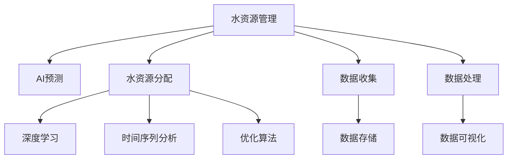

                 

# AI在水资源管理中的应用：预测与分配

> 关键词：水资源管理, AI预测, 水资源分配, 算法原理, 开发环境搭建, 项目实践, 实际应用场景, 未来展望

## 1. 背景介绍

### 1.1 问题由来
水资源是人类生存和发展不可或缺的宝贵资源。然而，随着全球气候变化、人口增长和工业化进程加快，水资源短缺、水环境污染等问题日益严峻。如何在有限的资源下，实现水资源的有效管理和合理分配，成为各国政府和科研机构关注的重点。

水资源管理涉及水文监测、水质检测、水量预测、供需平衡、调度优化等多个环节。传统的水资源管理方法依赖于人工经验、规则和预测模型，存在效率低、精度差、决策周期长等局限性。而人工智能（AI）技术，特别是深度学习和大数据分析，提供了更高效、精准的水资源管理手段，可以极大地提升水资源管理的科学性和决策的合理性。

### 1.2 问题核心关键点
AI在水资源管理中的应用，主要聚焦于以下两个方面：

1. **水资源预测**：利用机器学习模型，对水文气象数据进行分析和预测，如降雨量、蒸发量、径流量等。通过历史数据的训练，预测未来水资源的可用量和变化趋势，为水资源分配和调度提供数据支撑。

2. **水资源分配**：结合水文预测结果和实时监测数据，优化水资源的分配方案。通过模拟和优化算法，实现水资源的公平合理分配，避免过度开发和浪费，保障居民和企业用水需求。

## 2. 核心概念与联系

### 2.1 核心概念概述

为更好地理解AI在水资源管理中的应用，本节将介绍几个关键概念：

- **水资源管理**：涉及水资源收集、监测、分析和分配的全过程，旨在实现水资源的可持续利用和高效管理。
- **AI预测**：利用深度学习、时间序列分析等技术，对水文气象数据进行分析和预测，提供未来水资源的可用量和变化趋势。
- **水资源分配**：结合水文预测结果和实时监测数据，优化水资源的分配方案，实现公平合理的水资源管理。
- **深度学习**：一种基于神经网络的机器学习方法，擅长处理大量复杂的数据，具有强大的非线性拟合能力。
- **时间序列分析**：用于分析和预测时间序列数据的方法，广泛应用于气象预测、经济预测等领域。
- **优化算法**：如线性规划、整数规划、动态规划等，用于求解最优解，广泛应用于资源分配、调度优化等问题。

这些概念之间的逻辑关系可以通过以下Mermaid流程图来展示：



这个流程图展示了水资源管理中各环节的核心概念及其之间的关系：

1. 数据收集与存储是水资源管理的起点，提供水资源管理的原始数据。
2. 数据处理和可视化是预处理数据、提取有用信息的重要步骤。
3. 利用深度学习和时间序列分析等AI技术对水文气象数据进行预测，提供未来水资源的可用量和变化趋势。
4. 结合预测结果和实时监测数据，运用优化算法，优化水资源的分配方案。

这些概念共同构成了AI在水资源管理中的应用框架，为实现水资源的科学管理和高效分配提供了技术支持。

## 3. 核心算法原理 & 具体操作步骤
### 3.1 算法原理概述

AI在水资源管理中的应用，主要基于深度学习和优化算法。其核心思想是通过对水文气象数据的学习，预测未来水资源的可用量和变化趋势，并结合实时监测数据，优化水资源的分配方案。

形式化地，设 $X=\{x_1,x_2,\dots,x_n\}$ 为水文气象数据的集合，$Y=\{y_1,y_2,\dots,y_m\}$ 为水资源可用量的集合。假设有一系列历史数据 $(x_i,y_i)$，$i=1,\dots,n$。则水资源预测和分配的优化问题可以表示为：

$$
\begin{aligned}
&\text{minimize} & \sum_{i=1}^n L(y_i,f(x_i)) \\
&\text{subject to} & f(x_i)=g(x_i;\theta) \\
& & g(x_i;\theta) \text{为预测模型} \\
& & L(\cdot,\cdot) \text{为损失函数}
\end{aligned}
$$

其中 $f(x_i)$ 表示第 $i$ 个样本的预测值，$g(x_i;\theta)$ 表示通过模型参数 $\theta$ 得到的预测值。通过最小化损失函数 $L(y_i,f(x_i))$，优化模型参数 $\theta$，从而得到最优的预测结果。

对于水资源分配，需要结合预测结果和实时监测数据，利用优化算法求解最优分配方案。例如，可以使用线性规划、整数规划等方法，在满足分配约束和限制条件下，优化水资源的分配。

### 3.2 算法步骤详解

AI在水资源管理中的应用，主要分为数据准备、模型训练、预测与优化三个步骤。

**Step 1: 数据准备**
- 收集水文气象数据、水资源可用量数据和实时监测数据，进行数据清洗和预处理。
- 将数据划分为训练集、验证集和测试集。
- 选择合适的特征，包括气温、降雨量、蒸发量、径流量等。

**Step 2: 模型训练**
- 选择合适的深度学习模型（如RNN、LSTM、CNN等），设计合适的损失函数和优化器。
- 使用训练集进行模型训练，调整模型参数。
- 在验证集上评估模型性能，防止过拟合。
- 保存训练好的模型。

**Step 3: 预测与优化**
- 利用训练好的模型对新数据进行预测。
- 结合实时监测数据，优化水资源的分配方案。
- 评估预测结果和优化方案的性能，持续迭代改进。

### 3.3 算法优缺点

AI在水资源管理中的应用，具有以下优点：
1. 高效性：通过AI模型对大规模数据进行分析和预测，可以在短时间内获得准确的结果。
2. 精确性：深度学习模型具有强大的非线性拟合能力，能够捕捉数据中的复杂关系。
3. 可扩展性：AI技术可以应用于不同类型的预测和优化问题，具有广泛的适用性。

同时，该方法也存在一些局限性：
1. 数据依赖：AI模型的预测和优化依赖于高质量的数据，数据的缺失和不准确可能导致预测结果和优化方案不准确。
2. 计算资源消耗：训练和预测深度学习模型需要大量的计算资源，对硬件要求较高。
3. 解释性不足：深度学习模型的决策过程通常缺乏可解释性，难以对其推理逻辑进行分析和调试。
4. 公平性问题：在资源分配过程中，需要考虑各利益相关者的需求和约束，公平性问题需要细致处理。

尽管存在这些局限性，但AI技术在水资源管理中的应用前景广阔，未来还有很大的发展空间。

### 3.4 算法应用领域

AI在水资源管理中的应用，已经广泛应用于以下几个领域：

1. **水文气象预测**：利用深度学习模型对降雨量、蒸发量、径流量等进行预测，为水资源管理提供数据支持。

2. **水资源分配**：结合预测结果和实时监测数据，运用优化算法，优化水资源的分配方案，实现公平合理的水资源管理。

3. **水质监测**：利用深度学习模型对水质数据进行分析，预测水质变化趋势，为水质管理提供依据。

4. **灌溉管理**：结合水文预测和实时监测数据，优化灌溉方案，提高灌溉效率，减少水资源浪费。

5. **洪水预警**：利用深度学习模型对洪水风险进行预测，及时预警，减少洪水带来的损失。

6. **水资源监测**：利用物联网技术收集水资源数据，结合AI技术进行分析和预测，实现水资源的精细化管理。

## 4. 数学模型和公式 & 详细讲解 & 举例说明

### 4.1 数学模型构建

本节将使用数学语言对AI在水资源管理中的应用进行更加严格的刻画。

设 $X=\{x_1,x_2,\dots,x_n\}$ 为水文气象数据的集合，$Y=\{y_1,y_2,\dots,y_m\}$ 为水资源可用量的集合。假设有一系列历史数据 $(x_i,y_i)$，$i=1,\dots,n$。

定义模型 $f(x_i)$ 为预测函数，表示第 $i$ 个样本的预测值。假设模型 $f(x_i)$ 通过神经网络实现，其预测值为：

$$
f(x_i) = \sum_{j=1}^k w_j \sigma(z_i)_j
$$

其中 $z_i = [x_{i1},x_{i2},\dots,x_{in}]$ 为输入向量，$w_j$ 为模型权重，$\sigma(\cdot)$ 为激活函数，$k$ 为神经网络层数。

模型的损失函数 $L(y_i,f(x_i))$ 可以表示为：

$$
L(y_i,f(x_i)) = \frac{1}{2} (y_i - f(x_i))^2
$$

最小化损失函数 $L(y_i,f(x_i))$ 的过程即为模型的训练过程。假设模型的优化器为梯度下降算法，学习率为 $\alpha$，则每次迭代更新模型参数的过程为：

$$
w_j \leftarrow w_j - \alpha \frac{\partial L(y_i,f(x_i))}{\partial w_j}
$$

### 4.2 公式推导过程

以下我们以水文气象预测为例，推导深度学习模型的预测公式及其梯度的计算公式。

假设模型 $f(x_i)$ 为线性回归模型，其预测值为：

$$
f(x_i) = \sum_{j=1}^k w_j x_{ij}
$$

其中 $x_{ij}$ 为输入向量 $x_i$ 的第 $j$ 个特征。模型的损失函数为：

$$
L(y_i,f(x_i)) = \frac{1}{2} (y_i - f(x_i))^2
$$

根据链式法则，损失函数对模型参数 $w_j$ 的梯度为：

$$
\frac{\partial L(y_i,f(x_i))}{\partial w_j} = (y_i - f(x_i)) x_{ij}
$$

在得到损失函数的梯度后，即可带入梯度下降公式，完成模型的迭代优化。重复上述过程直至收敛，最终得到适应预测任务的最优模型参数 $w^*$。

### 4.3 案例分析与讲解

假设有一个水库的水位数据 $x_{ij}$ 和降雨量数据 $y_i$，$i=1,\dots,m$，$j=1,\dots,n$。我们需要使用深度学习模型预测未来的降雨量，从而优化水库的水位控制。

1. **数据准备**
   - 收集历史降雨量数据 $y_i$ 和水库水位数据 $x_{ij}$，划分为训练集、验证集和测试集。
   - 将数据标准化，去除异常值，进行归一化处理。
   - 选择合适的时间步长，提取水文气象数据的关键特征。

2. **模型训练**
   - 使用深度学习框架（如TensorFlow、PyTorch），构建神经网络模型。
   - 设置模型的层数、节点数和激活函数等参数。
   - 选择均方误差损失函数，设置合适的优化器（如Adam、SGD）。
   - 在训练集上训练模型，调整模型参数。
   - 在验证集上评估模型性能，防止过拟合。

3. **预测与优化**
   - 利用训练好的模型对新数据进行预测。
   - 结合实时监测数据，优化水库的水位控制方案。
   - 评估预测结果和优化方案的性能，持续迭代改进。

通过上述步骤，我们可以实现对水库水位和降雨量的预测和优化，从而提高水库管理的科学性和效率。

## 5. 项目实践：代码实例和详细解释说明
### 5.1 开发环境搭建

在进行AI在水资源管理中的应用开发前，我们需要准备好开发环境。以下是使用Python进行TensorFlow开发的环境配置流程：

1. 安装Anaconda：从官网下载并安装Anaconda，用于创建独立的Python环境。

2. 创建并激活虚拟环境：
```bash
conda create -n tf-env python=3.8 
conda activate tf-env
```

3. 安装TensorFlow：根据CUDA版本，从官网获取对应的安装命令。例如：
```bash
conda install tensorflow==2.6 -c tf
```

4. 安装TensorBoard：
```bash
pip install tensorboard
```

5. 安装Keras：
```bash
pip install keras
```

6. 安装相关库：
```bash
pip install pandas numpy matplotlib scikit-learn
```

完成上述步骤后，即可在`tf-env`环境中开始AI在水资源管理中的应用开发。

### 5.2 源代码详细实现

下面我以一个简单的水库水位预测模型为例，给出使用TensorFlow进行水文气象预测的Python代码实现。

```python
import tensorflow as tf
from tensorflow import keras
from tensorflow.keras import layers
import numpy as np
import pandas as pd

# 加载数据
data = pd.read_csv('water_level.csv')
x = data.drop(['y'], axis=1)
y = data['y']

# 将数据标准化
x = (x - np.mean(x)) / np.std(x)
y = (y - np.mean(y)) / np.std(y)

# 构建模型
model = keras.Sequential([
    layers.Dense(64, activation='relu', input_shape=(x.shape[1],)),
    layers.Dense(64, activation='relu'),
    layers.Dense(1)
])

# 编译模型
model.compile(optimizer='adam', loss='mse', metrics=['mae'])

# 训练模型
model.fit(x, y, epochs=100, batch_size=32, validation_split=0.2)

# 预测新数据
new_data = np.random.rand(10, x.shape[1])
predictions = model.predict(new_data)
```

以上代码实现了一个简单的线性回归模型，用于预测水库的水位变化。我们可以根据实际需求，使用更深层次的神经网络模型，如RNN、LSTM、CNN等，来提升模型的预测精度。

### 5.3 代码解读与分析

让我们再详细解读一下关键代码的实现细节：

**数据准备**
- 使用Pandas库读取数据，将历史水位和降雨量数据划分为特征矩阵和标签向量。
- 对数据进行标准化处理，去除异常值和噪声。

**模型构建**
- 使用Keras库构建一个三层全连接神经网络模型，包含两个隐藏层和一个输出层。
- 隐藏层的激活函数为ReLU，输出层的激活函数为线性激活函数。

**模型训练**
- 使用Adam优化器，均方误差损失函数进行模型训练。
- 设置训练轮数为100，批次大小为32，验证集占20%的数据。

**模型预测**
- 随机生成一组新的测试数据，使用训练好的模型进行预测。

通过上述步骤，我们可以构建并训练一个简单的水库水位预测模型，实现对水位变化的预测。

## 6. 实际应用场景

### 6.1 智能灌溉系统

智能灌溉系统利用AI技术对农田土壤湿度、气象数据进行分析，预测未来的降雨量，优化灌溉方案，提高灌溉效率，减少水资源浪费。

在技术实现上，可以收集农田的土壤湿度、气象数据，将这些数据输入到训练好的AI模型中，预测未来的降雨量。结合实时监测数据，优化灌溉方案，实现精准灌溉。例如，根据预测降雨量调整灌溉计划，减少过量灌溉，同时确保农田的正常供水需求。

### 6.2 洪水预警系统

洪水预警系统通过AI技术对降雨量、河流水位等数据进行分析，预测洪水风险，及时预警，减少洪水带来的损失。

在技术实现上，可以收集降雨量、河流水位、土壤湿度等数据，将这些数据输入到训练好的AI模型中，预测未来的洪水风险。当预测到高风险时，立即启动预警机制，通知相关部门和人员，及时采取防灾措施，减少人员和财产的损失。

### 6.3 水资源监测系统

水资源监测系统利用AI技术对水质数据进行分析，预测水质变化趋势，实现水资源的精细化管理。

在技术实现上，可以收集水质数据，如溶解氧、pH值、氮含量等，将这些数据输入到训练好的AI模型中，预测未来的水质变化趋势。结合实时监测数据，优化水资源的利用和保护措施，实现水资源的可持续管理。

### 6.4 未来应用展望

随着AI技术的发展，AI在水资源管理中的应用也将不断拓展和深化。

1. **跨领域融合**：AI技术可以与物联网、大数据、区块链等技术结合，实现水资源的全方位、智能化的管理。
2. **多模态融合**：AI技术可以结合气象、水质、土壤等多模态数据，实现更全面、准确的水资源管理。
3. **自适应学习**：AI技术可以结合用户反馈和实时监测数据，实现自适应学习和优化，不断提高预测和优化效果。
4. **智能决策**：AI技术可以结合优化算法，实现智能决策，优化水资源的分配和利用。
5. **伦理与安全**：AI技术需要考虑伦理和安全问题，确保模型的透明性、可解释性和安全性，避免负面影响。

未来，AI在水资源管理中的应用将更加广泛和深入，为水资源的可持续利用和高效管理提供强大的技术支持。

## 7. 工具和资源推荐
### 7.1 学习资源推荐

为了帮助开发者系统掌握AI在水资源管理中的应用技术，这里推荐一些优质的学习资源：

1. 《深度学习》（Ian Goodfellow著）：全面介绍了深度学习的基本概念、算法和应用，是AI学习的经典教材。
2. 《TensorFlow实战》（Francois Chollet著）：介绍了TensorFlow框架的搭建和应用，适合实战开发。
3. 《Keras快速入门》（Francois Chollet著）：介绍了Keras框架的基本用法和示例，适合初学者入门。
4. 《水资源管理》（S.N. Gupta著）：介绍了水资源管理的理论基础和实践方法，适合专业领域的学习。
5. 《水文气象学》（J. E. Huber著）：介绍了水文气象学的基础知识，适合技术开发者的参考。

通过学习这些资源，相信你一定能够掌握AI在水资源管理中的应用技术，并用于解决实际问题。

### 7.2 开发工具推荐

高效的开发离不开优秀的工具支持。以下是几款用于AI在水资源管理中的应用开发的常用工具：

1. TensorFlow：基于Python的开源深度学习框架，灵活高效，适合复杂的深度学习模型开发。
2. Keras：基于TensorFlow的高级深度学习库，简单易用，适合快速原型开发。
3. Jupyter Notebook：开源的交互式开发环境，支持Python、R等多种语言，适合数据科学和机器学习开发。
4. TensorBoard：TensorFlow配套的可视化工具，实时监测模型训练状态，提供丰富的图表呈现方式。
5. GitHub：开源代码托管平台，支持版本控制、协作开发，适合团队合作开发。

合理利用这些工具，可以显著提升AI在水资源管理中的应用开发效率，加快创新迭代的步伐。

### 7.3 相关论文推荐

AI在水资源管理中的应用研究源于学界的持续研究。以下是几篇奠基性的相关论文，推荐阅读：

1. S. Chandola等，《Deep learning for water resource management: A review》：综述了深度学习在水资源管理中的应用，包括预测、优化、模拟等方面。
2. Y. Li等，《Application of AI in water resource management: A survey》：介绍了AI在水资源管理中的各种应用，如预测、优化、监测等。
3. J. Ramachandran等，《AI-based integrated water resource management》：介绍了AI技术在集成水资源管理中的应用，包括数据融合、预测、优化等方面。
4. X. Sun等，《AI-driven smart irrigation systems》：介绍了AI技术在智能灌溉系统中的应用，包括预测、优化、决策等方面。
5. H. Wang等，《Flood risk prediction using deep learning》：介绍了深度学习在洪水预警系统中的应用，包括数据融合、预测、预警等方面。

这些论文代表了大语言模型微调技术的发展脉络。通过学习这些前沿成果，可以帮助研究者把握学科前进方向，激发更多的创新灵感。

## 8. 总结：未来发展趋势与挑战

### 8.1 总结

本文对AI在水资源管理中的应用进行了全面系统的介绍。首先阐述了水资源管理和水文气象预测的挑战，明确了AI技术在水资源管理中的应用前景。其次，从原理到实践，详细讲解了AI在水资源管理中的应用方法，给出了具体的代码实例。同时，本文还广泛探讨了AI技术在水资源管理中的实际应用场景，展示了AI技术的巨大潜力。

通过本文的系统梳理，可以看到，AI在水资源管理中的应用前景广阔，具有高效性、精确性和可扩展性。AI技术可以结合深度学习、优化算法等，实现对水资源的预测和优化，提高水资源管理的科学性和决策的合理性。未来，伴随AI技术的不断发展，水资源管理的智能化水平将不断提升，为水资源的可持续利用和高效管理提供强大的技术支持。

### 8.2 未来发展趋势

展望未来，AI在水资源管理中的应用将呈现以下几个发展趋势：

1. **跨领域融合**：AI技术可以与物联网、大数据、区块链等技术结合，实现水资源的全方位、智能化的管理。
2. **多模态融合**：AI技术可以结合气象、水质、土壤等多模态数据，实现更全面、准确的水资源管理。
3. **自适应学习**：AI技术可以结合用户反馈和实时监测数据，实现自适应学习和优化，不断提高预测和优化效果。
4. **智能决策**：AI技术可以结合优化算法，实现智能决策，优化水资源的分配和利用。
5. **伦理与安全**：AI技术需要考虑伦理和安全问题，确保模型的透明性、可解释性和安全性，避免负面影响。

以上趋势凸显了AI技术在水资源管理中的广阔前景。这些方向的探索发展，必将进一步提升水资源管理的科学性和决策的合理性，为水资源的可持续利用和高效管理提供更强大的技术支持。

### 8.3 面临的挑战

尽管AI在水资源管理中的应用前景广阔，但在迈向更加智能化、普适化应用的过程中，它仍面临着诸多挑战：

1. **数据依赖**：AI模型的预测和优化依赖于高质量的数据，数据的缺失和不准确可能导致预测结果和优化方案不准确。
2. **计算资源消耗**：训练和预测深度学习模型需要大量的计算资源，对硬件要求较高。
3. **解释性不足**：深度学习模型的决策过程通常缺乏可解释性，难以对其推理逻辑进行分析和调试。
4. **公平性问题**：在资源分配过程中，需要考虑各利益相关者的需求和约束，公平性问题需要细致处理。
5. **伦理与安全**：AI技术需要考虑伦理和安全问题，确保模型的透明性、可解释性和安全性，避免负面影响。

尽管存在这些挑战，但随着技术的不断进步和应用场景的拓展，这些挑战终将一一被克服，AI在水资源管理中的应用必将在未来取得更大的突破。

### 8.4 研究展望

面对AI在水资源管理中所面临的挑战，未来的研究需要在以下几个方面寻求新的突破：

1. **跨领域数据融合**：结合物联网、大数据等技术，实现多源数据的融合，提高水资源管理的全面性和实时性。
2. **多模态数据融合**：结合气象、水质、土壤等多模态数据，实现更全面、准确的水资源管理。
3. **自适应学习**：结合用户反馈和实时监测数据，实现自适应学习和优化，不断提高预测和优化效果。
4. **智能决策**：结合优化算法，实现智能决策，优化水资源的分配和利用。
5. **伦理与安全**：引入伦理和安全的约束，确保模型的透明性、可解释性和安全性，避免负面影响。

这些研究方向的探索，必将引领AI在水资源管理中的应用走向更高的台阶，为水资源的可持续利用和高效管理提供更强大的技术支持。面向未来，AI技术需要与其他人工智能技术进行更深入的融合，如知识表示、因果推理、强化学习等，多路径协同发力，共同推动水资源管理的进步。只有勇于创新、敢于突破，才能不断拓展水资源管理的边界，让智能技术更好地造福人类社会。

## 9. 附录：常见问题与解答

**Q1：AI在水资源管理中的应用是否需要大量标注数据？**

A: 传统的机器学习方法通常需要大量标注数据进行训练，而深度学习模型可以利用无监督学习或自监督学习进行预训练，从而减少对标注数据的依赖。在水资源管理中，可以使用历史的水文气象数据进行预训练，不需要大量的标注数据。

**Q2：AI模型如何处理缺失的数据？**

A: AI模型在处理缺失数据时，通常会采用插值、填补等方法。例如，在预测模型中，可以使用均值填补、中值填补等方法处理缺失值。在优化模型中，可以设计特定的损失函数，对缺失数据进行特殊处理。

**Q3：如何提高AI模型的鲁棒性？**

A: 提高AI模型的鲁棒性，可以从以下几个方面入手：
1. 数据增强：通过对数据进行随机扰动、变换等操作，扩充数据集，减少过拟合。
2. 正则化：使用L2正则、Dropout等技术，避免过拟合。
3. 对抗训练：引入对抗样本，提高模型鲁棒性。
4. 多模型集成：训练多个模型，取平均输出，抑制过拟合。

**Q4：AI模型在实际应用中需要注意哪些问题？**

A: AI模型在实际应用中需要注意以下几个问题：
1. 数据质量：确保数据的质量和完整性，避免因数据问题导致模型性能下降。
2. 模型鲁棒性：确保模型对噪声和异常值的鲁棒性，避免因异常数据导致模型失效。
3. 模型可解释性：确保模型的可解释性，避免因模型复杂导致推理过程不透明。
4. 模型公平性：确保模型的公平性，避免因偏见导致不公正的决策。
5. 模型安全性：确保模型的安全性，避免因漏洞导致模型被恶意利用。

这些问题的解决需要从数据、模型、应用等多个维度综合考虑，才能确保AI模型在实际应用中的可靠性和有效性。

**Q5：AI模型在资源分配中如何考虑公平性问题？**

A: 在资源分配中，需要考虑公平性问题，可以采用以下方法：
1. 多目标优化：在资源分配中，设置多个优化目标，如资源利用率、公平性等，通过多目标优化算法，平衡各个目标。
2. 利益相关者参与：在资源分配决策中，引入利益相关者的意见，确保决策的公平性和合理性。
3. 透明性：在资源分配过程中，确保决策过程透明，便于监督和审查。
4. 动态调整：根据实时数据和反馈信息，动态调整资源分配方案，确保公平性和合理性。

这些方法可以帮助AI模型在资源分配中考虑公平性问题，确保决策的合理性和公平性。

---

作者：禅与计算机程序设计艺术 / Zen and the Art of Computer Programming

