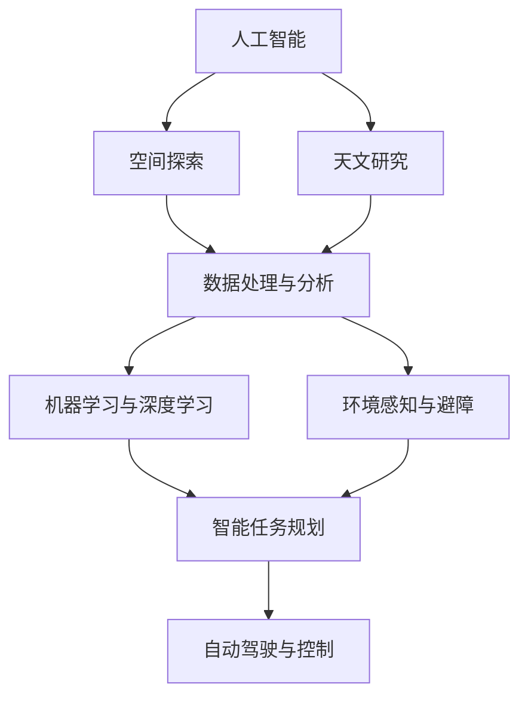

                 

## 1. 背景介绍

### 1.1 问题由来

随着人工智能（AI）技术在多个领域的深入应用，其在空间探索和天文研究中的应用也逐渐显现出巨大的潜力。AI技术能够在处理大量数据、识别复杂模式、优化资源分配等方面发挥重要作用。当前，AI在空间探索和天文研究中的应用已经涉及天体识别、空间任务规划、卫星数据处理等多个方面，为人类进一步认识宇宙、探索新天地提供了强有力的技术支持。

### 1.2 问题核心关键点

AI在空间探索和天文研究中的应用涉及核心关键点包括：

- **数据处理与分析**：处理和分析来自太空探测器、望远镜等设备的大量数据，识别和分类天体、星云、星系等。
- **智能任务规划**：优化空间任务规划路径，确保高效利用有限的资源，实现最大化任务完成率。
- **自动驾驶与控制**：实现无人驾驶的卫星、探测器等设备的自主导航和精准控制。
- **环境感知与避障**：在空间环境中识别障碍物，确保任务执行过程中的安全。
- **故障诊断与维护**：利用AI技术进行设备故障的实时诊断和维护，提高设备可靠性和任务成功率。

这些问题关键点的解决，能够有效推动空间探索和天文研究的前沿技术发展，促进人类对宇宙的深入理解。

## 2. 核心概念与联系

### 2.1 核心概念概述

要全面理解AI在空间探索和天文研究中的应用，需先了解相关核心概念：

- **人工智能（AI）**：利用机器学习、深度学习等技术，赋予机器模拟人类智能过程的能力。
- **空间探索**：通过航天器等设备对太阳系内外空间进行探测和研究，探索宇宙的奥秘。
- **天文研究**：研究天体、宇宙背景辐射、暗物质等宇宙现象和结构，了解宇宙起源和演化。
- **数据处理与分析**：对海量数据进行高效的采集、存储、处理和分析，提取有价值的信息。
- **机器学习与深度学习**：利用数据驱动的学习模型，实现对未知数据的预测和模式识别。
- **环境感知与避障**：在复杂和动态环境中，通过传感器和AI技术实现环境的感知和避障。

这些概念之间的联系可以通过以下Mermaid流程图来展示：



这个流程图展示了AI技术在空间探索和天文研究中的应用框架：

1. 人工智能技术为空间探索和天文研究提供支持，如数据处理与分析、环境感知与避障等。
2. 数据处理与分析是AI技术的重要应用场景，涉及海量数据的处理和分析。
3. 机器学习与深度学习是AI的核心技术，用于从数据中提取模式和知识。
4. 环境感知与避障是AI技术在复杂空间环境中的重要应用，确保任务执行的安全。
5. 智能任务规划和自动驾驶与控制是AI在空间探索中的关键应用，提高任务执行的效率和成功率。

## 3. 核心算法原理 & 具体操作步骤

### 3.1 算法原理概述

AI在空间探索和天文研究中的应用涉及多种算法和技术，其中核心算法原理包括：

- **深度学习**：通过多层神经网络对数据进行抽象和分类，实现对天体的自动识别和分类。
- **强化学习**：通过与环境的交互，优化空间任务规划和设备控制策略。
- **计算机视觉**：利用图像处理技术，从望远镜观测数据中提取天体信息。
- **自然语言处理**：处理来自空间探测器的文本数据，提取有价值的信息。
- **时间序列分析**：分析天体运动和空间环境的变化，预测未来状态。

这些算法原理通过联合应用，实现空间探索和天文研究的自动化和智能化。

### 3.2 算法步骤详解

以下是AI在空间探索和天文研究中应用的具体操作步骤：

#### 3.2.1 数据采集与预处理

1. **数据采集**：通过卫星、探测器、望远镜等设备，采集空间环境的相关数据。
2. **数据预处理**：对采集到的数据进行清洗、去噪、归一化等预处理，确保数据质量。

#### 3.2.2 数据标注与训练

1. **数据标注**：对已处理的数据进行标注，如天体位置、类型等。
2. **模型训练**：利用标注好的数据集，训练AI模型，如卷积神经网络（CNN）、递归神经网络（RNN）等。

#### 3.2.3 模型评估与优化

1. **模型评估**：使用测试数据集对训练好的模型进行评估，如准确率、召回率等指标。
2. **模型优化**：根据评估结果，对模型进行优化，调整网络结构、学习率等参数。

#### 3.2.4 应用部署与监控

1. **模型部署**：将训练好的模型部署到空间探测器、卫星等设备上，实现实时处理和分析。
2. **模型监控**：实时监控模型运行状态，确保模型性能稳定。

#### 3.2.5 数据存储与共享

1. **数据存储**：将处理好的数据存储在云平台或本地数据库中，方便后续分析和共享。
2. **数据共享**：与科学社区、研究机构等共享数据，促进科学研究进展。

### 3.3 算法优缺点

AI在空间探索和天文研究中的应用具有以下优点：

- **高效处理海量数据**：AI技术能够处理海量数据，从中提取有价值的信息，提高研究效率。
- **自动识别与分类**：通过深度学习等技术，实现对天体的自动识别和分类，提高研究精度。
- **优化任务规划**：利用强化学习等技术，优化空间任务规划路径，提高任务执行效率。

同时，也存在以下缺点：

- **数据标注成本高**：高质量的数据标注需要大量人力和时间成本，限制了AI技术的应用范围。
- **模型依赖数据质量**：模型效果依赖于数据质量，数据噪声和标注错误会影响模型性能。
- **解释性和透明性不足**：AI模型的决策过程难以解释，缺乏透明性。
- **资源消耗大**：深度学习模型通常需要大量计算资源和存储空间，限制了设备的部署和应用。

### 3.4 算法应用领域

AI在空间探索和天文研究中的应用主要集中在以下几个领域：

1. **天体识别与分类**：利用AI技术，自动识别和分类天体，如恒星、行星、彗星等。
2. **空间任务规划**：优化卫星、探测器的路径规划，确保高效完成任务。
3. **卫星数据处理**：处理来自卫星的观测数据，提取天体信息。
4. **自动驾驶与控制**：实现无人驾驶的卫星、探测器等设备的自主导航和精准控制。
5. **环境感知与避障**：在空间环境中识别障碍物，确保任务执行过程中的安全。
6. **故障诊断与维护**：利用AI技术进行设备故障的实时诊断和维护，提高设备可靠性和任务成功率。

## 4. 数学模型和公式 & 详细讲解 & 举例说明

### 4.1 数学模型构建

AI在空间探索和天文研究中的应用涉及多个数学模型，以下是对其中几个关键模型的构建：

#### 4.1.1 深度学习模型

深度学习模型通常采用卷积神经网络（CNN）和递归神经网络（RNN）等结构，用于图像识别和序列数据处理。

- **卷积神经网络（CNN）**：
  $$
  f(x) = \sum_{i=1}^n w_i x_i + b
  $$
  其中，$x_i$为输入特征，$w_i$为权重，$b$为偏置。

#### 4.1.2 强化学习模型

强化学习模型通过与环境交互，优化决策策略。常用的强化学习模型包括Q-learning和Policy Gradient等。

- **Q-learning**：
  $$
  Q(s,a) \leftarrow Q(s,a) + \alpha [r + \gamma \max Q(s',a') - Q(s,a)]
  $$
  其中，$s$为状态，$a$为动作，$r$为奖励，$Q(s,a)$为Q值，$\alpha$为学习率，$\gamma$为折扣因子，$s'$和$a'$为下一步状态和动作。

### 4.2 公式推导过程

以下是几个关键模型的公式推导过程：

#### 4.2.1 卷积神经网络（CNN）

卷积神经网络的基本结构包括卷积层、池化层和全连接层。其推导过程如下：

- **卷积层**：
  $$
  f(x) = \sum_{i=1}^n \sum_{j=1}^m w_{ij} x_{ij} + b
  $$
  其中，$w_{ij}$为卷积核权重，$x_{ij}$为输入特征。

- **池化层**：
  $$
  f(x) = \sum_{i=1}^n \sum_{j=1}^m w_{ij} x_{ij} + b
  $$
  其中，$w_{ij}$为池化核权重，$x_{ij}$为输入特征。

- **全连接层**：
  $$
  f(x) = \sum_{i=1}^n w_i x_i + b
  $$
  其中，$x_i$为输入特征，$w_i$为权重，$b$为偏置。

#### 4.2.2 Q-learning

Q-learning的核心思想是通过与环境的交互，逐步优化Q值。其推导过程如下：

- **状态值函数**：
  $$
  Q(s,a) = r + \gamma \max Q(s',a')
  $$
  其中，$s$为状态，$a$为动作，$r$为奖励，$Q(s,a)$为Q值，$\gamma$为折扣因子，$s'$和$a'$为下一步状态和动作。

### 4.3 案例分析与讲解

以一个简单的天体识别案例为例，分析AI在空间探索中的应用：

- **数据采集**：通过望远镜采集天体的图像数据。
- **数据预处理**：对图像进行去噪、归一化等预处理。
- **模型训练**：使用CNN模型对预处理后的图像进行训练，识别天体类型。
- **模型评估**：使用测试数据集对训练好的模型进行评估，如准确率、召回率等指标。
- **模型应用**：将训练好的模型部署到空间探测器上，实时处理和分析图像数据，自动识别天体。

## 5. 项目实践：代码实例和详细解释说明

### 5.1 开发环境搭建

在进行AI在空间探索和天文研究中的应用开发前，需要搭建合适的开发环境。以下是具体的搭建步骤：

1. **安装Python**：
   ```bash
   sudo apt-get update
   sudo apt-get install python3
   ```

2. **安装TensorFlow**：
   ```bash
   pip install tensorflow
   ```

3. **安装PyTorch**：
   ```bash
   pip install torch torchvision
   ```

4. **安装OpenCV**：
   ```bash
   pip install opencv-python
   ```

### 5.2 源代码详细实现

以下是一个简单的天体识别代码实现：

```python
import tensorflow as tf
from tensorflow.keras.models import Sequential
from tensorflow.keras.layers import Conv2D, MaxPooling2D, Flatten, Dense

# 定义模型结构
model = Sequential([
    Conv2D(32, (3,3), activation='relu', input_shape=(32,32,3)),
    MaxPooling2D((2,2)),
    Conv2D(64, (3,3), activation='relu'),
    MaxPooling2D((2,2)),
    Conv2D(128, (3,3), activation='relu'),
    MaxPooling2D((2,2)),
    Flatten(),
    Dense(64, activation='relu'),
    Dense(10, activation='softmax')
])

# 编译模型
model.compile(optimizer='adam', loss='categorical_crossentropy', metrics=['accuracy'])

# 训练模型
model.fit(train_data, train_labels, epochs=10, validation_data=(val_data, val_labels))

# 测试模型
test_loss, test_acc = model.evaluate(test_data, test_labels)
print('Test accuracy:', test_acc)
```

### 5.3 代码解读与分析

上述代码实现了一个简单的卷积神经网络模型，用于天体识别任务。其中，Conv2D和MaxPooling2D层用于卷积和池化操作，Flatten层将卷积后的数据展平，Dense层用于全连接操作。在模型训练过程中，使用了Adam优化器和交叉熵损失函数。

## 6. 实际应用场景

### 6.1 太空探测器的自主导航与避障

在太空探测器的自主导航与避障应用中，AI技术可以通过环境感知与避障算法，实现探测器的自主导航和障碍物的识别和避让。例如，使用计算机视觉技术处理从摄像头采集的图像数据，通过卷积神经网络对图像进行处理，识别出前方的障碍物，从而调整探测器的导航路径。

### 6.2 卫星数据处理与分析

在卫星数据处理与分析应用中，AI技术可以对卫星采集的高分辨率图像进行分析和处理，提取有价值的信息。例如，利用深度学习技术，自动识别和分类卫星图像中的天体和地物，如行星、星系、山脉等。

### 6.3 空间任务规划与优化

在空间任务规划与优化应用中，AI技术可以通过强化学习算法，优化空间任务规划路径，提高任务执行效率。例如，利用Q-learning算法，优化卫星的通信任务路径，确保高效利用有限的通信资源。

## 7. 工具和资源推荐

### 7.1 学习资源推荐

为了帮助开发者系统掌握AI在空间探索和天文研究中的应用，这里推荐一些优质的学习资源：

1. **Deep Learning Specialization**：由Andrew Ng教授开设的深度学习课程，系统讲解深度学习的基本原理和应用。
2. **TensorFlow官方文档**：TensorFlow的官方文档，提供了丰富的教程和样例，适合深入学习TensorFlow的开发和应用。
3. **OpenAI Gym**：用于强化学习研究的开源平台，提供了大量的环境模拟和实验工具。
4. **Kaggle**：数据科学竞赛平台，提供大量的数据集和竞赛，有助于实战训练和应用创新。

### 7.2 开发工具推荐

以下几款工具可以帮助开发者进行AI在空间探索和天文研究中的应用开发：

1. **PyTorch**：基于Python的深度学习框架，灵活、高效，适用于多种深度学习模型。
2. **TensorFlow**：由Google主导开发的深度学习框架，支持分布式计算和优化，适用于大规模深度学习模型。
3. **OpenCV**：计算机视觉库，提供图像处理和分析工具，支持多种图像处理算法。
4. **Jupyter Notebook**：交互式开发环境，支持Python和其他语言的混合编程。

### 7.3 相关论文推荐

AI在空间探索和天文研究中的应用涉及多个前沿领域，以下是几篇重要的相关论文，推荐阅读：

1. **ImageNet Classification with Deep Convolutional Neural Networks**：AlexNet论文，提出了卷积神经网络，奠定了深度学习在图像识别领域的基础。
2. **Playing Atari with Deep Reinforcement Learning**：使用深度强化学习技术，实现了AI玩游戏的突破。
3. **A Survey on Deep Learning-based Image Classification and Object Detection**：综述了深度学习在图像分类和目标检测领域的应用，提供了丰富的算法和应用案例。
4. **Crowdsourcing Accuracy Estimates for AI Systems**：提出利用大规模众包数据进行模型评估的方法，提高了AI模型的可信度。

## 8. 总结：未来发展趋势与挑战

### 8.1 研究成果总结

AI在空间探索和天文研究中的应用已经取得了一系列突破性进展，以下是几个关键的研究成果：

1. **深度学习在图像识别中的应用**：利用卷积神经网络，实现了天体的自动识别和分类，提升了研究效率。
2. **强化学习在任务规划中的应用**：利用Q-learning等算法，优化了空间任务规划路径，提高了任务执行效率。
3. **计算机视觉在环境感知中的应用**：利用计算机视觉技术，从望远镜观测数据中提取天体信息，提升了研究精度。

### 8.2 未来发展趋势

展望未来，AI在空间探索和天文研究中的应用将呈现以下几个趋势：

1. **多模态数据融合**：未来AI模型将更多地结合多模态数据，如图像、声音、文本等，实现更全面的数据分析和处理。
2. **边缘计算与物联网**：利用边缘计算和物联网技术，实现数据的就地处理和分析，提高数据处理效率。
3. **自主学习与自适应系统**：未来AI模型将具备更强的自主学习能力，能够根据环境变化动态调整策略，适应复杂环境。
4. **人机协同智能**：实现人与AI的协同工作，提高任务执行的效率和成功率。

### 8.3 面临的挑战

尽管AI在空间探索和天文研究中的应用取得了一定的进展，但仍面临诸多挑战：

1. **数据质量与标注成本**：高质量的数据和标注需要大量时间和人力成本，限制了AI技术的应用范围。
2. **模型复杂度与计算资源**：深度学习模型通常需要大量计算资源，限制了设备的部署和应用。
3. **环境适应性与鲁棒性**：AI模型在复杂和动态环境中的适应性和鲁棒性仍需提升。
4. **伦理与安全问题**：AI模型在处理敏感数据和决策时，需要考虑伦理和安全问题。

### 8.4 研究展望

为了应对未来面临的挑战，未来的研究需要在以下几个方面进行突破：

1. **数据采集与标注自动化**：开发自动化数据采集和标注工具，降低人工成本。
2. **模型压缩与优化**：优化深度学习模型结构，降低计算资源消耗，提升模型效率。
3. **多模态数据融合与处理**：开发多模态数据融合与处理算法，实现更全面的数据分析和处理。
4. **伦理与安全性研究**：加强AI伦理和安全研究，确保模型决策的透明性和安全性。

总之，AI在空间探索和天文研究中的应用前景广阔，但仍需在数据、模型、计算资源等多个方面进行持续优化和创新，方能真正实现其在实际应用中的潜力。

## 9. 附录：常见问题与解答

**Q1：AI在空间探索和天文研究中的应用是否适用于所有类型的任务？**

A: 目前AI在空间探索和天文研究中的应用主要集中在图像识别、任务规划和数据分析等领域，对于其他类型的任务，如地质勘探、能源利用等，仍需进一步研究与探索。

**Q2：AI在空间探索和天文研究中的应用是否依赖于高精度的数据和设备？**

A: 是的，AI模型需要高精度的数据和设备支持，如高分辨率的图像、高性能的计算资源等，以确保模型的准确性和可靠性。

**Q3：如何评估AI在空间探索和天文研究中的应用效果？**

A: 评估AI模型效果通常使用准确率、召回率、F1分数等指标，同时结合专家评估和实际应用效果进行综合评价。

**Q4：AI在空间探索和天文研究中的应用存在哪些伦理和安全问题？**

A: AI模型可能存在数据隐私、模型偏见、决策透明性等问题，需要在模型设计和应用中考虑伦理和安全问题，确保AI应用的安全和可信。

通过本文的系统梳理，可以看到，AI在空间探索和天文研究中的应用前景广阔，已在多个关键领域展现出显著效果。未来，随着技术的不断进步，AI将在更广阔的领域发挥重要作用，推动人类对宇宙的深入探索。

