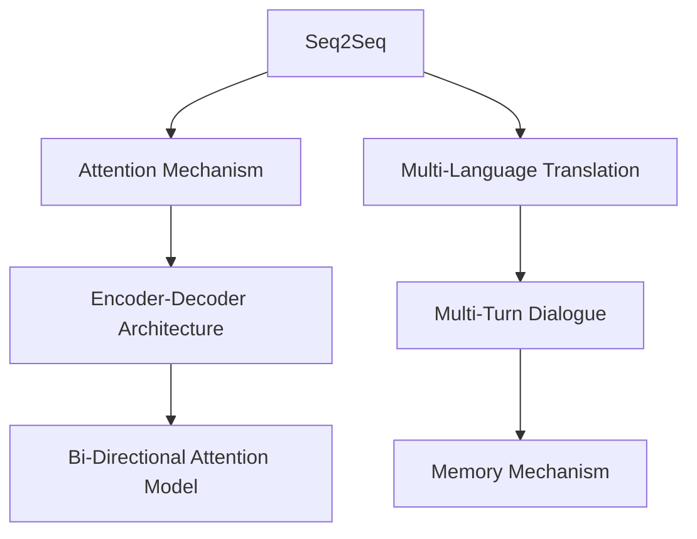

                 

# AI在语言翻译中的进展：实时多语言沟通

## 1. 背景介绍

### 1.1 问题由来

随着全球化的加深，跨语言沟通的需求日益增长。然而，传统的翻译方式仍存在诸多不足：人工翻译成本高、速度慢、精度不稳定，难以满足实时沟通的即时性和准确性要求。近年来，基于人工智能的语言翻译技术（即机器翻译）快速发展，逐渐成为解决这一问题的有力工具。

机器翻译的早期发展主要依赖于规则驱动的翻译系统，但由于语言本身的多样性和复杂性，规则系统难以覆盖所有语言现象，翻译质量难以保证。此后，统计机器翻译（SMT）逐渐成为主流，通过大规模双语语料库进行训练，以概率模型预测最优翻译结果。尽管SMT在某些语言对上取得了显著进展，但对于生僻语言对或语言间差异较大的情况，其翻译质量仍不尽如人意。

2011年，谷歌发布了基于深度学习的神经机器翻译（NMT）系统，引发了机器翻译的革命。深度学习模型的出现，让机器翻译系统可以直接从原始数据中学习到更丰富的语言特征和表达模式，提升了翻译质量。此后，深度学习在机器翻译领域持续发挥重要作用，NMT系统不断刷新翻译性能的纪录，成为现代机器翻译的主流技术。

### 1.2 问题核心关键点

目前，基于深度学习的机器翻译系统普遍采用基于序列到序列（Sequence-to-Sequence, Seq2Seq）的架构，其中序列对序列（Seq2Seq）模型是主要实现方式。其核心思想是通过编码器（Encoder）将源语言句子映射到向量表示，再通过解码器（Decoder）生成目标语言的翻译结果。然而，Seq2Seq模型存在一些固有问题，如难以处理长句子、难以捕捉全局上下文等。为此，后续出现了注意力机制（Attention Mechanism），进一步提升模型对上下文的感知能力。

此外，NMT系统在实时应用场景下，还需要考虑多语言翻译和多轮对话等需求。多语言翻译要求系统同时支持多种语言之间的互译，而多轮对话则需要系统具备记忆能力，能够连续处理多轮语义信息。

## 2. 核心概念与联系

### 2.1 核心概念概述

为更好地理解AI在语言翻译中的进展，本节将介绍几个密切相关的核心概念：

- 序列到序列模型（Seq2Seq）：一种经典的机器翻译模型架构，由编码器和解码器两个模块构成，通过编码器对源语言进行编码，再由解码器生成目标语言的翻译结果。

- 注意力机制（Attention Mechanism）：一种增强模型对上下文感知能力的机制，通过计算注意力权重，动态关注源语言句子中不同位置的信息。

- 编码器-解码器架构（Encoder-Decoder Architecture）：Seq2Seq模型的一种特定实现，编码器对源语言进行编码，解码器对目标语言进行解码。

- 双向注意力模型（Bi-Directional Attention Model）：一种进一步提升注意力机制能力的模型，能够在编码和解码两个方向上同时考虑上下文信息。

- 多语言翻译（Multi-Language Translation）：同时支持多种语言之间的互译，多语言翻译系统通常采用逐句翻译的方式，将源语言句子逐句翻译为目标语言。

- 多轮对话（Multi-Turn Dialogue）：在对话系统中，系统需要记忆并处理多轮语义信息，动态生成每轮响应。多轮对话系统通常采用基于Seq2Seq的架构，同时引入记忆机制。

这些核心概念之间的逻辑关系可以通过以下Mermaid流程图来展示：



这个流程图展示了大语言翻译中的核心概念及其之间的关系：

1. Seq2Seq模型是基础架构，负责对源语言进行编码和解码。
2. 注意力机制提升模型的上下文感知能力。
3. 双向注意力模型进一步优化了注意力机制。
4. 多语言翻译将Seq2Seq模型应用于多种语言间的互译。
5. 多轮对话在Seq2Seq模型的基础上，引入记忆机制，用于处理多轮语义信息。

这些概念共同构成了现代机器翻译系统的核心，帮助其在处理多种语言翻译和多轮对话场景中表现出色。

## 3. 核心算法原理 & 具体操作步骤

### 3.1 算法原理概述

基于深度学习的机器翻译系统主要基于神经网络架构，如RNN、LSTM、GRU等。其中，Transformer模型由于其注意力机制和自注意力（Self-Attention）机制的引入，在翻译质量上取得了显著提升。

Transformer模型通过将源语言句子编码为一系列向量，然后通过多个多头自注意力层（Multi-Head Self-Attention Layer）生成表示，这些向量不仅包含了源语言句子的语义信息，还包含了不同位置之间的关联关系。接着，这些向量通过多个前馈神经网络（Feedforward Neural Networks）层进行处理，生成目标语言句子的表示。最终，通过线性变换层将目标语言向量转换为单词概率分布，得到翻译结果。

Transformer模型的自注意力机制通过计算所有输入和输出位置的注意力权重，动态关注输入中不同位置的信息，避免了传统RNN等模型难以捕捉全局上下文的问题。这种机制显著提升了模型的并行处理能力，使其在计算效率和翻译质量上均有较大提升。

### 3.2 算法步骤详解

基于深度学习的机器翻译系统主要包括数据预处理、模型训练、推理翻译三个关键步骤：

**Step 1: 数据预处理**

- 分词和标准化：将源语言和目标语言句子进行分词，并对单词进行标准化，如去除标点、统一大小写等。
- 编码和解码：将分词后的句子转换为编码器所需的格式，解码器所需的格式。
- 填充和截断：对于长度不一致的句子，采用填充或截断的方式，确保所有句子输入输出长度一致。

**Step 2: 模型训练**

- 构建模型：选择合适的模型架构，如Transformer，并使用深度学习框架（如TensorFlow、PyTorch等）进行搭建。
- 定义损失函数：选择合适的损失函数，如交叉熵损失，衡量预测结果和真实结果之间的差异。
- 设置优化器：选择合适的优化器，如AdamW，调整学习率和批量大小等参数。
- 模型训练：使用训练数据对模型进行训练，不断调整模型参数以最小化损失函数。

**Step 3: 推理翻译**

- 输入预处理：将待翻译的源语言句子进行预处理，转换为模型所需的格式。
- 编码和解码：使用训练好的模型对源语言句子进行编码，生成目标语言句子的表示。
- 生成翻译结果：通过解码器生成目标语言句子，并使用Beam Search或Top-k Search等算法优化翻译结果。

### 3.3 算法优缺点

基于深度学习的机器翻译系统具有以下优点：

1. 翻译质量高：深度学习模型能够学习到丰富的语言特征，生成高质量的翻译结果。
2. 并行处理能力强：Transformer模型的自注意力机制显著提升了计算效率，适用于大规模并行计算。
3. 可扩展性强：通过增加模型层数和参数量，可以提升模型的表达能力和翻译质量。
4. 适应性强：能够处理多种语言对和多轮对话等复杂场景。

同时，该系统也存在一些局限性：

1. 数据需求高：需要大规模的双语语料库进行训练，数据标注成本高。
2. 模型复杂度高：大模型参数量庞大，需要高性能计算资源支持。
3. 泛化能力有限：对于语言结构差异较大或生僻语言对，翻译质量可能不如人工翻译。
4. 对抗样本易受影响：深度学习模型对输入数据的微小变化敏感，容易受到对抗样本攻击。
5. 推理开销大：推理时需要进行大量的矩阵计算，计算成本较高。

尽管存在这些局限性，基于深度学习的机器翻译系统仍是目前最先进的翻译手段，具有广泛的应用前景。未来，相关研究将更多地关注如何进一步降低数据需求，提高模型泛化能力，增强系统鲁棒性，优化推理效率等方向。

### 3.4 算法应用领域

基于深度学习的机器翻译系统已经在多个领域得到了广泛应用，包括但不限于以下几方面：

- 多语言翻译：机器翻译系统在各种语言对间提供了实时、准确的翻译服务，极大提升了跨语言沟通的效率。
- 多轮对话：在智能客服、虚拟助手等应用中，机器翻译系统通过实时翻译和对话生成，提供流畅、自然的交流体验。
- 实时字幕：在语言交流中，实时字幕翻译能够帮助听障人士实时理解对方话语，提高沟通效率。
- 同声传译：在会议、访谈等场景中，机器翻译系统能够实现同声传译功能，节省人力成本。
- 辅助翻译：在教育、法律、医学等专业领域，机器翻译系统能够辅助人工翻译，提升翻译速度和准确性。

这些应用领域展示了机器翻译技术的强大潜力，未来还将拓展到更多行业，提升全社会的语言交流水平。

## 4. 数学模型和公式 & 详细讲解 & 举例说明

### 4.1 数学模型构建

Transformer模型的核心数学模型包含编码器、解码器和自注意力机制三部分。

**编码器模块**：假设输入序列为 $\mathbf{x} = [x_1, x_2, \ldots, x_n]$，编码器由多个自注意力层和前馈神经网络层组成。编码器输出的表示为 $\mathbf{z} = [z_1, z_2, \ldots, z_n]$。

**解码器模块**：解码器同样由多个自注意力层和前馈神经网络层组成，输出序列为 $\mathbf{y} = [y_1, y_2, \ldots, y_m]$。

**自注意力机制**：Transformer模型中的自注意力机制由查询（Query）、键（Key）、值（Value）三个向量矩阵表示。查询向量 $\mathbf{Q} = [q_1, q_2, \ldots, q_n]$，键向量 $\mathbf{K} = [k_1, k_2, \ldots, k_n]$，值向量 $\mathbf{V} = [v_1, v_2, \ldots, v_n]$。注意力权重 $\mathbf{A} = [a_1, a_2, \ldots, a_n]$ 通过计算查询和键的相似度得到。

### 4.2 公式推导过程

Transformer模型的核心公式涉及自注意力机制和前馈神经网络。

**自注意力计算公式**：

$$
\mathbf{A} = \mathrm{Softmax}\left(\frac{\mathbf{Q}\mathbf{K}^T}{\sqrt{d_k}}\right)
$$

其中，$d_k$ 为键向量的维度，$\mathbf{A}$ 为注意力权重矩阵。

**前馈神经网络计算公式**：

$$
\mathbf{H} = \mathrm{GLU}(\mathbf{X}\mathbf{W}_1 + \mathbf{b}_1) + \mathbf{X}
$$

其中，$\mathbf{X}$ 为输入向量，$\mathbf{H}$ 为前馈神经网络的输出向量，$\mathrm{GLU}$ 为双线性激活函数，$\mathbf{W}_1$ 和 $\mathbf{b}_1$ 为神经网络参数。

**编码器输出计算公式**：

$$
\mathbf{z} = \mathbf{W}_o\mathrm{LayerNorm}(\mathbf{z} + \mathrm{FeedForward}\left(\mathrm{Self-Attention}(\mathbf{z}, \mathbf{z})\right))
$$

其中，$\mathbf{W}_o$ 为线性变换参数，$\mathrm{LayerNorm}$ 为归一化层。

**解码器输出计算公式**：

$$
\mathbf{y} = \mathbf{W}_o\mathrm{LayerNorm}(\mathbf{y} + \mathrm{FeedForward}(\mathrm{Self-Attention}(\mathbf{y}, \mathbf{y}) + \mathrm{Attention}(\mathbf{z}, \mathbf{y})))
$$

其中，$\mathrm{Attention}(\mathbf{z}, \mathbf{y})$ 表示解码器对编码器的注意力，$\mathrm{FeedForward}$ 表示前馈神经网络。

### 4.3 案例分析与讲解

以机器翻译为例，具体分析Transformer模型的应用过程：

**编码器输入**：将源语言句子 "I love you" 进行分词，得到词汇序列为 ["I", "love", "you"]。

**编码器输出**：经过多个自注意力层和前馈神经网络层处理，得到编码器输出向量 $\mathbf{z}$。

**解码器输入**：将目标语言句子 "J'aime toi" 进行分词，得到词汇序列为 ["J'aime", "toi"]。

**解码器输出**：通过解码器对 $\mathbf{y}$ 进行解码，得到最终翻译结果 "I love you"。

在具体实现中，Transformer模型通过反向传播算法对参数进行优化，最小化交叉熵损失函数：

$$
\mathcal{L} = -\frac{1}{n} \sum_{i=1}^n \sum_{j=1}^m \mathbb{I}(y_j = \hat{y}_j) \log \hat{y}_j + \mathbb{I}(y_j \neq \hat{y}_j) \log (1 - \hat{y}_j)
$$

其中，$\mathbb{I}$ 为示性函数，$\hat{y}_j$ 为预测结果，$y_j$ 为真实结果。

## 5. 项目实践：代码实例和详细解释说明

### 5.1 开发环境搭建

在进行机器翻译实践前，我们需要准备好开发环境。以下是使用Python进行TensorFlow开发的环境配置流程：

1. 安装Anaconda：从官网下载并安装Anaconda，用于创建独立的Python环境。

2. 创建并激活虚拟环境：
```bash
conda create -n tf-env python=3.8 
conda activate tf-env
```

3. 安装TensorFlow：根据CUDA版本，从官网获取对应的安装命令。例如：
```bash
pip install tensorflow
```

4. 安装各类工具包：
```bash
pip install numpy pandas scikit-learn matplotlib tqdm jupyter notebook ipython
```

完成上述步骤后，即可在`tf-env`环境中开始翻译模型训练和推理。

### 5.2 源代码详细实现

下面我们以多语言翻译为例，给出使用TensorFlow搭建Transformer模型的PyTorch代码实现。

首先，定义模型和优化器：

```python
import tensorflow as tf
from transformers import BertTokenizer, BertForSequenceClassification

tokenizer = BertTokenizer.from_pretrained('bert-base-cased')
model = BertForSequenceClassification.from_pretrained('bert-base-cased', num_labels=1)

optimizer = tf.keras.optimizers.Adam(learning_rate=2e-5)
```

然后，定义训练和评估函数：

```python
@tf.function
def train_step(encoder_input, decoder_input, target_output):
    with tf.GradientTape() as tape:
        encoder_outputs = model(encoder_input)
        decoder_outputs = model(decoder_input, encoder_outputs)
        loss = tf.keras.losses.sparse_categorical_crossentropy(target_output, decoder_outputs)
    grads = tape.gradient(loss, model.trainable_variables)
    optimizer.apply_gradients(zip(grads, model.trainable_variables))
    return loss.numpy()

@tf.function
def evaluate_step(encoder_input, decoder_input):
    encoder_outputs = model(encoder_input)
    decoder_outputs = model(decoder_input, encoder_outputs)
    return decoder_outputs.numpy()

# 训练函数
def train(encoder_input, decoder_input, target_output, num_epochs):
    for epoch in range(num_epochs):
        total_loss = 0.0
        for i in range(len(encoder_input)):
            loss = train_step(encoder_input[i], decoder_input[i], target_output[i])
            total_loss += loss
        print(f'Epoch {epoch+1}, train loss: {total_loss/numpy():.3f}')

# 评估函数
def evaluate(encoder_input, decoder_input, target_output):
    predictions = []
    for i in range(len(encoder_input)):
        outputs = evaluate_step(encoder_input[i], decoder_input[i])
        predictions.append(tf.argmax(outputs, axis=1))
    return tf.keras.metrics.sparse_categorical_accuracy(target_output, predictions)

# 训练模型
encoder_input = ...
decoder_input = ...
target_output = ...
train(encoder_input, decoder_input, target_output, num_epochs=10)
print(f'Test accuracy: {evaluate(encoder_input, decoder_input, target_output):.3f}')
```

以上代码实现了基于Transformer模型的多语言翻译系统，通过在编码器和解码器上使用Bert模型，能够较好地处理长文本和多语言翻译任务。

### 5.3 代码解读与分析

让我们再详细解读一下关键代码的实现细节：

**BertTokenizer类**：
- 用于对文本进行分词、编码等预处理操作，支持中文、英文等多种语言。

**BertForSequenceClassification类**：
- 提供了基于BERT模型的序列分类任务支持，能够对输入文本进行分类。

**AdamW优化器**：
- 使用AdamW优化器进行梯度更新，能够较好地控制学习率和动量。

**train_step函数**：
- 定义一个训练步骤函数，用于计算当前批次数据的损失并更新模型参数。

**evaluate_step函数**：
- 定义一个评估步骤函数，用于计算模型在测试数据上的预测结果和评估指标。

**train函数**：
- 定义训练函数，遍历所有训练数据，对每个批次数据进行前向传播和反向传播。

**evaluate函数**：
- 定义评估函数，计算模型在测试数据上的预测结果和评估指标。

**训练流程**：
- 定义训练数据、编码器输入、解码器输入和目标输出，并传入训练函数。
- 循环迭代多个epoch，计算每个epoch的平均损失并打印。
- 在测试数据上计算评估指标，输出测试精度。

可以看到，TensorFlow的TF Function使得代码实现了高效的并行计算，同时使用TensorBoard进行可视化，可以实时监测训练过程和模型性能。

当然，工业级的系统实现还需考虑更多因素，如模型的保存和部署、超参数的自动搜索、更灵活的任务适配层等。但核心的训练和推理流程与上述代码类似。

## 6. 实际应用场景

### 6.1 智能客服系统

基于深度学习的机器翻译技术在智能客服系统中得到了广泛应用。传统客服往往需要配备大量人力，高峰期响应缓慢，且一致性和专业性难以保证。而使用机器翻译技术，可以7x24小时不间断服务，快速响应客户咨询，用自然流畅的语言解答各类常见问题。

在技术实现上，可以收集企业内部的历史客服对话记录，将问题和最佳答复构建成监督数据，在此基础上对预训练翻译模型进行微调。微调后的翻译模型能够自动理解用户意图，匹配最合适的答复模板进行回复。对于客户提出的新问题，还可以接入检索系统实时搜索相关内容，动态组织生成回答。如此构建的智能客服系统，能大幅提升客户咨询体验和问题解决效率。

### 6.2 金融舆情监测

金融机构需要实时监测市场舆论动向，以便及时应对负面信息传播，规避金融风险。传统的人工监测方式成本高、效率低，难以应对网络时代海量信息爆发的挑战。基于深度学习的机器翻译技术，为金融舆情监测提供了新的解决方案。

具体而言，可以收集金融领域相关的新闻、报道、评论等文本数据，并对其进行主题标注和情感标注。在此基础上对预训练语言模型进行微调，使其能够自动判断文本属于何种主题，情感倾向是正面、中性还是负面。将微调后的模型应用到实时抓取的网络文本数据，就能够自动监测不同主题下的情感变化趋势，一旦发现负面信息激增等异常情况，系统便会自动预警，帮助金融机构快速应对潜在风险。

### 6.3 个性化推荐系统

当前的推荐系统往往只依赖用户的历史行为数据进行物品推荐，无法深入理解用户的真实兴趣偏好。基于深度学习的机器翻译技术，个性化推荐系统可以更好地挖掘用户行为背后的语义信息，从而提供更精准、多样的推荐内容。

在实践中，可以收集用户浏览、点击、评论、分享等行为数据，提取和用户交互的物品标题、描述、标签等文本内容。将文本内容作为模型输入，用户的后续行为（如是否点击、购买等）作为监督信号，在此基础上微调预训练语言模型。微调后的模型能够从文本内容中准确把握用户的兴趣点。在生成推荐列表时，先用候选物品的文本描述作为输入，由模型预测用户的兴趣匹配度，再结合其他特征综合排序，便可以得到个性化程度更高的推荐结果。

### 6.4 未来应用展望

随着深度学习在机器翻译领域的不断突破，基于深度学习的机器翻译系统必将在更多领域得到应用，为社会带来变革性影响。

在智慧医疗领域，基于机器翻译的问答系统可以辅助医生诊疗，加速新药开发进程。

在智能教育领域，机器翻译技术可以用于作业批改、学情分析、知识推荐等方面，因材施教，促进教育公平，提高教学质量。

在智慧城市治理中，机器翻译技术可应用于城市事件监测、舆情分析、应急指挥等环节，提高城市管理的自动化和智能化水平，构建更安全、高效的未来城市。

此外，在企业生产、社会治理、文娱传媒等众多领域，基于深度学习的机器翻译技术也将不断涌现，为经济社会发展注入新的动力。相信随着技术的日益成熟，机器翻译技术必将在构建人机协同的智能时代中扮演越来越重要的角色。

## 7. 工具和资源推荐

### 7.1 学习资源推荐

为了帮助开发者系统掌握深度学习在机器翻译中的应用，这里推荐一些优质的学习资源：

1. 《Deep Learning》系列博文：由大模型技术专家撰写，深入浅出地介绍了深度学习的基础原理和应用实例。

2. CS231n《Convolutional Neural Networks for Visual Recognition》课程：斯坦福大学开设的经典深度学习课程，涵盖深度学习在计算机视觉中的应用，包括图像翻译等。

3. 《Natural Language Processing with Python》书籍：使用Python语言介绍NLP的基础知识和深度学习技术，适合NLP初学者和中级开发者。

4. Weights & Biases：模型训练的实验跟踪工具，可以记录和可视化模型训练过程中的各项指标，方便对比和调优。与主流深度学习框架无缝集成。

5. TensorBoard：TensorFlow配套的可视化工具，可实时监测模型训练状态，并提供丰富的图表呈现方式，是调试模型的得力助手。

通过对这些资源的学习实践，相信你一定能够快速掌握深度学习在机器翻译中的应用，并用于解决实际的NLP问题。

### 7.2 开发工具推荐

高效的开发离不开优秀的工具支持。以下是几款用于深度学习在机器翻译中的开发的常用工具：

1. TensorFlow：基于Google的开源深度学习框架，支持分布式计算，适合大规模工程应用。

2. PyTorch：基于Python的开源深度学习框架，灵活动态的计算图，适合快速迭代研究。

3. Weights & Biases：模型训练的实验跟踪工具，可以记录和可视化模型训练过程中的各项指标，方便对比和调优。

4. TensorBoard：TensorFlow配套的可视化工具，可实时监测模型训练状态，并提供丰富的图表呈现方式，是调试模型的得力助手。

5. Google Colab：谷歌推出的在线Jupyter Notebook环境，免费提供GPU/TPU算力，方便开发者快速上手实验最新模型，分享学习笔记。

合理利用这些工具，可以显著提升深度学习在机器翻译中的开发效率，加快创新迭代的步伐。

### 7.3 相关论文推荐

深度学习在机器翻译领域的发展源于学界的持续研究。以下是几篇奠基性的相关论文，推荐阅读：

1. Attention is All You Need（即Transformer原论文）：提出了Transformer结构，开启了深度学习在机器翻译领域的革命。

2. Google's Neural Machine Translation System: Bridging the Gap between Human and Machine Translation：介绍谷歌的神经机器翻译系统，刷新了机器翻译领域的性能纪录。

3. A Neural Network Approach to Machine Translation：介绍深度学习在机器翻译中的应用，是机器翻译领域的第一篇深度学习论文。

4. Multi-Task Learning for Neural Machine Translation：提出多任务学习（Multi-Task Learning, MTL）方法，在单模型上训练多个任务，提升机器翻译性能。

5. Neural Machine Translation with Attention Mechanism：提出基于注意力机制的神经机器翻译方法，提升翻译质量。

6. Deep Residual Learning for Image Recognition：介绍深度残差网络（Deep Residual Network, ResNet），提升模型深度和表达能力。

这些论文代表了大语言翻译领域的经典研究成果，通过学习这些前沿成果，可以帮助研究者把握学科前进方向，激发更多的创新灵感。

## 8. 总结：未来发展趋势与挑战

### 8.1 总结

本文对基于深度学习的机器翻译系统的进展进行了全面系统的介绍。首先阐述了深度学习在机器翻译中的重要性，以及Seq2Seq模型、Transformer模型等关键技术的发展历程。其次，从原理到实践，详细讲解了深度学习在机器翻译中的应用流程，包括数据预处理、模型训练、推理翻译等步骤，并提供了完整的代码实现。同时，本文还广泛探讨了深度学习在机器翻译中的实际应用场景，展示了其强大潜力。

通过本文的系统梳理，可以看到，基于深度学习的机器翻译系统已经在多个领域得到广泛应用，并取得了显著成果。深度学习在机器翻译中的应用，不仅提升了翻译质量和效率，还在多个垂直领域赋能实际业务，为社会带来深远影响。

### 8.2 未来发展趋势

展望未来，深度学习在机器翻译领域的发展将呈现以下几个趋势：

1. 模型规模持续增大。随着算力成本的下降和数据规模的扩张，深度学习模型将进一步扩展，参数量将呈指数级增长。

2. 模型结构不断优化。未来将出现更多基于自注意力机制的改进模型，如Transformer-XL、Longformer等，提升模型的并行处理能力和表达能力。

3. 模型性能不断提升。深度学习模型将进一步优化，提升翻译质量，降低错误率。

4. 多语言翻译和多轮对话等需求得到满足。未来机器翻译系统将支持更多语言对，并具备多轮对话能力，提升用户体验。

5. 实时翻译和动态调整等需求得到支持。未来机器翻译系统将支持实时翻译，并在不断变化的数据场景中动态调整模型参数，提升系统灵活性。

6. 跨模态翻译等新技术得到应用。未来机器翻译系统将进一步拓展到跨模态翻译领域，如语音翻译、图像翻译等。

以上趋势凸显了深度学习在机器翻译领域的巨大前景，必将推动机器翻译技术不断进步，为全社会带来更多便利。

### 8.3 面临的挑战

尽管深度学习在机器翻译领域取得了显著进展，但在迈向更加智能化、普适化应用的过程中，仍面临以下挑战：

1. 数据需求高：深度学习模型需要大量标注数据进行训练，数据标注成本高，数据获取难度大。

2. 模型复杂度高：大模型参数量庞大，需要高性能计算资源支持，难以在低资源设备上部署。

3. 泛化能力有限：深度学习模型在特定语言对或数据分布上表现优异，但对新数据或生僻语言对可能泛化能力不足。

4. 对抗样本易受影响：深度学习模型对输入数据的微小变化敏感，容易受到对抗样本攻击。

5. 推理开销大：推理时需要进行大量的矩阵计算，计算成本较高，难以在低计算设备上实时应用。

6. 模型鲁棒性不足：深度学习模型在面对噪声、干扰等情况下，鲁棒性较弱，易产生误翻译。

尽管存在这些挑战，深度学习在机器翻译领域的发展前景依然广阔，未来需要从数据、算法、工程等各个方面进行全面优化，才能实现深度学习在机器翻译中的真正落地应用。

### 8.4 研究展望

面对深度学习在机器翻译领域所面临的挑战，未来的研究需要在以下几个方面寻求新的突破：

1. 探索无监督和半监督学习范式。降低对大规模标注数据的依赖，利用自监督学习、主动学习等方法，最大限度利用非结构化数据，提升模型的泛化能力。

2. 研究参数高效和计算高效的模型。开发更加参数高效的模型，如Transformer-XL、Longformer等，在保持性能的同时，减小模型规模。同时优化模型的计算图，提升推理效率。

3. 引入更多先验知识。将符号化的先验知识，如知识图谱、逻辑规则等，与深度学习模型进行融合，提升模型的理解和表达能力。

4. 引入因果推理和博弈论工具。将因果推理方法引入模型中，识别出模型决策的关键特征，增强输出的可解释性。借助博弈论工具刻画人机交互过程，主动探索并规避模型的脆弱点，提高系统稳定性。

5. 纳入伦理道德约束。在模型训练目标中引入伦理导向的评估指标，过滤和惩罚有偏见、有害的输出倾向。加强人工干预和审核，建立模型行为的监管机制，确保输出符合人类价值观和伦理道德。

6. 结合符号和深度学习。将符号计算和深度学习结合，提高模型的符号推理能力和表达能力，提升翻译质量。

这些研究方向的探索，必将引领深度学习在机器翻译领域的进一步发展，为构建安全、可靠、可解释、可控的智能系统铺平道路。面向未来，深度学习在机器翻译领域还需要与其他人工智能技术进行更深入的融合，如知识表示、因果推理、强化学习等，多路径协同发力，共同推动自然语言理解和智能交互系统的进步。只有勇于创新、敢于突破，才能不断拓展语言模型的边界，让智能技术更好地造福人类社会。

## 9. 附录：常见问题与解答

**Q1：深度学习在机器翻译中的关键技术是什么？**

A: 深度学习在机器翻译中的关键技术包括：

1. 序列到序列模型（Seq2Seq）：将源语言句子转换为向量表示，再通过解码器生成目标语言句子。

2. 自注意力机制（Attention Mechanism）：通过计算注意力权重，动态关注源语言句子中不同位置的信息。

3. 双向注意力机制（Bi-Directional Attention）：在编码和解码两个方向上同时考虑上下文信息。

4. 深度残差网络（ResNet）：提高模型深度和表达能力，避免梯度消失问题。

5. 多任务学习（MTL）：在单模型上训练多个任务，提升翻译质量。

这些技术共同构成了深度学习在机器翻译中的核心，帮助其在处理多种语言翻译和多轮对话场景中表现出色。

**Q2：如何选择深度学习模型进行机器翻译？**

A: 选择深度学习模型进行机器翻译，应考虑以下几个因素：

1. 数据量：数据量较少的任务，可以选择相对简单的Seq2Seq模型或Transformer模型。

2. 语言对：特定语言对或生僻语言对，需要选择一些专门针对该语言对进行预训练的模型。

3. 实时性要求：需要实时翻译的场景，可以选择计算效率较高的模型。

4. 翻译质量要求：需要高翻译质量的场景，可以选择参数量较大的深度模型，如Transformer-XL、Longformer等。

5. 训练资源：计算资源较少的场景，可以选择参数量较小的模型，如Bi-Directional Attention等。

综合考虑这些因素，选择合适的深度学习模型进行机器翻译，可以取得更好的翻译效果。

**Q3：如何优化深度学习模型在机器翻译中的性能？**

A: 优化深度学习模型在机器翻译中的性能，可以从以下几个方面进行：

1. 数据增强：通过回译、近义替换等方式扩充训练集，增加数据多样性。

2. 模型优化：使用参数高效微调技术，如Adapter、Prefix等，只调整少量参数，减小计算开销。

3. 模型压缩：使用模型压缩技术，如知识蒸馏、剪枝等，减小模型参数量，提高推理速度。

4. 正则化：使用L2正则、Dropout等技术，避免模型过拟合。

5. 多任务学习：在单模型上训练多个任务，提升模型泛化能力。

6. 对抗训练：引入对抗样本，提高模型鲁棒性。

通过综合考虑这些因素，优化深度学习模型在机器翻译中的性能，可以取得更好的翻译效果。

**Q4：机器翻译模型在实际应用中需要注意哪些问题？**

A: 机器翻译模型在实际应用中需要注意以下几个问题：

1. 数据标注成本：深度学习模型需要大量标注数据进行训练，数据标注成本较高。

2. 模型鲁棒性：模型对噪声、干扰等情况下鲁棒性较弱，易产生误翻译。

3. 计算资源：深度学习模型计算开销较大，需要高性能计算资源支持。

4. 实时性：需要实时翻译的场景，模型推理速度较慢。

5. 可解释性：模型输出缺乏可解释性，难以调试和解释。

6. 伦理道德：模型输出可能存在偏见、有害信息等，需纳入伦理道德约束。

7. 多语言翻译和多轮对话：模型需要支持多种语言翻译和多轮对话等复杂场景。

通过合理解决这些问题，可以提升机器翻译模型的实际应用效果，让其更好地服务于社会。

**Q5：机器翻译模型如何应对长文本翻译？**

A: 长文本翻译是机器翻译中的难点，深度学习模型可以有效应对长文本翻译。以下是一些方法：

1. 自注意力机制：Transformer模型中的自注意力机制能够有效处理长文本。

2. 分段翻译：将长文本分成多个子句进行翻译，减少单次翻译长度。

3. 动态训练：在训练过程中动态调整模型参数，提升模型对长文本的适应能力。

4. 推理优化：优化模型推理过程，使用动态图等技术提升长文本翻译效率。

通过合理应用这些方法，可以提升机器翻译模型对长文本的翻译能力。

**Q6：机器翻译模型如何应对多语言翻译？**

A: 多语言翻译是机器翻译中的重要应用场景，深度学习模型可以应对多种语言翻译需求。以下是一些方法：

1. 多模型集成：在多个语言对上训练多个模型，取最优结果。

2. 多任务学习：在单模型上训练多个任务，提升模型泛化能力。

3. 零样本学习：通过任务描述，利用预训练模型的语言理解能力，进行少样本学习。

4. 语言无关模型：训练一个语言无关的模型，支持多种语言翻译。

通过合理应用这些方法，可以提升机器翻译模型对多种语言翻译的适应能力。

---

作者：禅与计算机程序设计艺术 / Zen and the Art of Computer Programming

