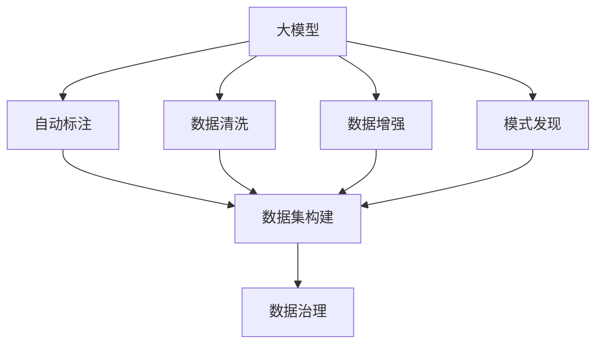

                 

# AI大模型助力电商搜索推荐业务的数据治理能力评估体系优化方案

## 1. 背景介绍

### 1.1 问题由来

随着电商搜索推荐业务的快速发展，用户查询需求日益多样化，推荐系统需要处理的数据量呈指数级增长。与此同时，数据质量问题逐渐凸显，如数据偏差、缺失、不一致等，这些问题直接影响了搜索推荐模型的精准性和用户满意度。传统的数据治理方法依赖手工规则，难以应对大规模、动态变化的数据环境，亟需引入AI大模型来优化数据治理能力。

大模型在数据标注、数据清洗、数据增强等方面具有显著优势，可以有效提升数据治理效率和效果。例如，大模型可以通过自动标注对标签进行精化，通过数据生成和增强提升数据的多样性和质量。具体来说，大模型可以帮助电商搜索推荐业务在以下几方面提升数据治理能力：

- **数据标注自动化**：大模型能够在短时间内对海量数据进行自动标注，减轻人工标注的负担，提升标注精度。
- **数据清洗自动化**：大模型可以识别并处理数据中的异常值、噪声和错误信息，提高数据质量和可用性。
- **数据增强智能化**：大模型可以根据用户行为和场景，生成高质量的训练样本，扩大数据规模，提升模型泛化能力。
- **模式发现智能化**：大模型能够自动发现数据中的模式和关联，辅助人工设计更好的数据治理策略。

### 1.2 问题核心关键点

电商搜索推荐业务中，数据治理的核心在于构建准确、完备、一致的数据集，为推荐系统提供高质量的训练样本。常见问题包括：

- 标注数据的质量和数量不足，难以覆盖所有用户行为。
- 用户行为数据存在噪声，无法直接用于训练。
- 数据多样性不足，模型容易过拟合。
- 数据一致性问题，不同来源的数据存在冲突和重复。

针对这些问题，大模型可以通过以下方式提供解决方案：

- **自动标注**：大模型可以快速自动标注数据，提升标注质量和效率。
- **数据清洗**：大模型可以识别并修正数据中的噪声和错误，提高数据质量。
- **数据增强**：大模型可以通过生成样本，丰富数据的多样性，提升模型泛化能力。
- **模式发现**：大模型可以自动发现数据中的模式和关联，辅助设计更好的数据治理策略。

## 2. 核心概念与联系

### 2.1 核心概念概述

为更好地理解大模型在电商搜索推荐业务中的数据治理应用，本节将介绍几个密切相关的核心概念：

- **大模型（Large Models）**：指大规模深度学习模型，如BERT、GPT等，具有强大的数据处理和表达能力，能够处理复杂的数据结构，自动发现数据中的模式和关联。
- **自动标注（Automatic Labeling）**：指使用大模型对数据进行自动标注，减少人工标注的复杂度和成本。
- **数据清洗（Data Cleaning）**：指通过大模型自动发现和修正数据中的噪声和错误，提升数据质量和一致性。
- **数据增强（Data Augmentation）**：指使用大模型生成额外的训练样本，扩大数据规模，提升模型泛化能力。
- **模式发现（Pattern Discovery）**：指使用大模型自动发现数据中的模式和关联，辅助设计更好的数据治理策略。
- **数据治理（Data Governance）**：指通过自动标注、数据清洗、数据增强和模式发现等手段，提升电商搜索推荐业务的数据集质量和可用性。

这些核心概念之间的逻辑关系可以通过以下Mermaid流程图来展示：



这个流程图展示了大模型在电商搜索推荐业务中的数据治理流程：

1. 大模型通过自动标注、数据清洗、数据增强和模式发现，提升数据集的质量和可用性。
2. 提升后的数据集被用于电商搜索推荐系统的构建和训练。
3. 构建和训练的模型能够更好地理解用户需求，提供更精准的搜索结果和推荐。

## 3. 核心算法原理 & 具体操作步骤
### 3.1 算法原理概述

大模型在电商搜索推荐业务中的数据治理应用，主要基于以下算法原理：

- **自动标注算法**：通过预训练的大模型，对用户行为数据进行自动标注，减少人工标注的时间和成本。
- **数据清洗算法**：使用大模型自动识别数据中的噪声和错误，提高数据质量和一致性。
- **数据增强算法**：基于大模型生成的样本，增加训练集的多样性，提升模型泛化能力。
- **模式发现算法**：通过大模型自动发现数据中的模式和关联，辅助设计更好的数据治理策略。

这些算法可以结合具体的数据治理需求，进行灵活应用，以提升电商搜索推荐业务的数据治理能力。

### 3.2 算法步骤详解

**Step 1: 准备数据集和标注数据**
- 收集电商搜索推荐业务中所有相关的用户行为数据。
- 对于需要标注的数据，如用户评论、商品评价等，准备相应数量的标注数据。

**Step 2: 使用大模型进行自动标注**
- 使用预训练的大模型，对用户行为数据进行自动标注。
- 采用预训练模型自带的自动标注工具，或自定义标注工具，实现对数据的自动标注。

**Step 3: 数据清洗**
- 对标注好的数据进行清洗，去除噪声和错误。
- 使用大模型自动识别和修正数据中的异常值和错误，提高数据质量。

**Step 4: 数据增强**
- 使用大模型生成额外的训练样本，扩大数据集规模。
- 基于用户行为数据生成新的训练样本，提升模型的泛化能力。

**Step 5: 模式发现**
- 使用大模型自动发现数据中的模式和关联，辅助设计更好的数据治理策略。
- 基于用户行为数据，自动发现用户偏好和行为模式，为数据治理提供指导。

**Step 6: 构建数据集**
- 将清洗和增强后的数据集构建为适合电商搜索推荐系统使用的数据格式。
- 采用标准化的数据格式，如JSON、CSV等，便于系统读取和处理。

**Step 7: 模型训练和评估**
- 基于构建好的数据集，训练电商搜索推荐系统。
- 使用自动标注和数据清洗的数据进行模型训练，提升模型的准确性和鲁棒性。

### 3.3 算法优缺点

大模型在电商搜索推荐业务中的数据治理应用，具有以下优点：

- **效率高**：大模型能够在短时间内自动标注和清洗大量数据，提高数据治理效率。
- **精度高**：大模型具有强大的模式发现能力，能够自动识别和修正数据中的噪声和错误，提升数据质量。
- **泛化能力强**：通过数据增强，大模型能够生成高质量的训练样本，提升模型的泛化能力。

同时，大模型在电商搜索推荐业务中的数据治理应用也存在以下缺点：

- **成本高**：预训练大模型的成本较高，需要有足够的计算资源和时间。
- **依赖标注数据**：大模型的自动标注需要一定的标注数据作为参考，依赖于标注数据的数量和质量。
- **解释性不足**：大模型缺乏可解释性，难以解释其内部决策过程和推理逻辑。

尽管存在这些缺点，但就目前而言，大模型在电商搜索推荐业务中的应用具有显著优势，能够显著提升数据治理能力和推荐系统性能。

### 3.4 算法应用领域

大模型在电商搜索推荐业务中的数据治理应用，主要适用于以下场景：

- **用户行为数据自动标注**：对用户评论、商品评价等数据进行自动标注，提升标注质量和效率。
- **数据清洗**：自动识别和修正数据中的噪声和错误，提升数据质量和一致性。
- **数据增强**：生成高质量的训练样本，扩大数据集规模，提升模型泛化能力。
- **模式发现**：自动发现数据中的模式和关联，辅助设计更好的数据治理策略。

## 4. 数学模型和公式 & 详细讲解  
### 4.1 数学模型构建

在本节中，我们将使用数学语言对大模型在电商搜索推荐业务中的数据治理应用进行更加严格的刻画。

记电商搜索推荐业务的用户行为数据为 $D=\{(x_i, y_i)\}_{i=1}^N, x_i \in \mathcal{X}, y_i \in \mathcal{Y}$，其中 $\mathcal{X}$ 为输入空间，$\mathcal{Y}$ 为输出空间。

定义自动标注算法为 $A(D, \theta)$，其中 $\theta$ 为大模型的参数。数据清洗算法为 $C(D, \theta)$，数据增强算法为 $E(D, \theta)$，模式发现算法为 $P(D, \theta)$。构建的数据集为 $D'$。

定义数据集的构建函数为 $B(D, \theta) = A(D, \theta) \cup C(D, \theta) \cup E(D, \theta) \cup P(D, \theta)$。

### 4.2 公式推导过程

以下是自动标注、数据清洗、数据增强和模式发现的基本公式推导：

**自动标注公式**：

$$
\hat{y}_i = A(x_i, \theta)
$$

其中 $\hat{y}_i$ 为自动标注结果，$A(x_i, \theta)$ 为自动标注算法。

**数据清洗公式**：

$$
y'_i = C(x_i, \theta)
$$

其中 $y'_i$ 为清洗后的标注结果，$C(x_i, \theta)$ 为数据清洗算法。

**数据增强公式**：

$$
\tilde{x}_i = E(x_i, \theta)
$$

其中 $\tilde{x}_i$ 为增强后的样本，$E(x_i, \theta)$ 为数据增强算法。

**模式发现公式**：

$$
P(D, \theta) = \{\text{模式}(x_i, \theta)\}_{i=1}^N
$$

其中 $\text{模式}(x_i, \theta)$ 为自动发现的模式。

将上述公式代入数据集构建函数，得到：

$$
D' = \{(x_i, \hat{y}_i), (x_i, y'_i), (\tilde{x}_i, y'_i), (x_i, \text{模式}(x_i, \theta))\}_{i=1}^N
$$

最终构建的数据集 $D'$ 包含了自动标注、数据清洗、数据增强和模式发现的结果，可用于电商搜索推荐系统的训练和评估。

### 4.3 案例分析与讲解

**案例分析**：假设电商搜索推荐系统需要标注用户对商品的评价数据。使用大模型进行自动标注，具体步骤如下：

1. 准备标注数据：收集一些已标注的评价数据，作为训练集。
2. 训练大模型：使用标注数据训练自动标注模型，并获取模型参数 $\theta$。
3. 自动标注新数据：使用训练好的模型对新的用户评价数据进行自动标注，得到标注结果 $\hat{y}_i$。
4. 数据清洗：对自动标注结果进行清洗，去除噪声和错误，得到清洗后的标注结果 $y'_i$。
5. 数据增强：基于清洗后的标注数据，生成新的训练样本 $\tilde{x}_i$。
6. 模式发现：使用自动标注和数据增强的数据，发现数据中的模式和关联，辅助设计更好的数据治理策略。
7. 构建数据集：将清洗和增强后的数据构建为适合电商搜索推荐系统使用的数据格式，生成最终的数据集 $D'$。
8. 模型训练和评估：使用构建好的数据集训练电商搜索推荐系统，评估模型性能。

通过上述步骤，大模型可以显著提升电商搜索推荐业务的数据治理能力，减少人工标注和清洗的工作量，提高数据质量和系统性能。

## 5. 项目实践：代码实例和详细解释说明
### 5.1 开发环境搭建

在进行大模型在电商搜索推荐业务中的数据治理实践前，我们需要准备好开发环境。以下是使用Python进行PyTorch开发的环境配置流程：

1. 安装Anaconda：从官网下载并安装Anaconda，用于创建独立的Python环境。

2. 创建并激活虚拟环境：
```bash
conda create -n pytorch-env python=3.8 
conda activate pytorch-env
```

3. 安装PyTorch：根据CUDA版本，从官网获取对应的安装命令。例如：
```bash
conda install pytorch torchvision torchaudio cudatoolkit=11.1 -c pytorch -c conda-forge
```

4. 安装Transformers库：
```bash
pip install transformers
```

5. 安装各类工具包：
```bash
pip install numpy pandas scikit-learn matplotlib tqdm jupyter notebook ipython
```

完成上述步骤后，即可在`pytorch-env`环境中开始项目实践。

### 5.2 源代码详细实现

下面我们以用户行为数据自动标注为例，给出使用Transformers库对BERT模型进行自动标注的PyTorch代码实现。

首先，定义自动标注函数：

```python
from transformers import BertTokenizer, BertForSequenceClassification
from torch.utils.data import Dataset
import torch

class EvaluationDataset(Dataset):
    def __init__(self, texts, labels):
        self.texts = texts
        self.labels = labels
        self.tokenizer = BertTokenizer.from_pretrained('bert-base-cased')
        
    def __len__(self):
        return len(self.texts)
    
    def __getitem__(self, item):
        text = self.texts[item]
        label = self.labels[item]
        
        encoding = self.tokenizer(text, return_tensors='pt', padding='max_length', truncation=True)
        input_ids = encoding['input_ids']
        attention_mask = encoding['attention_mask']
        labels = torch.tensor(label, dtype=torch.long)
        
        return {'input_ids': input_ids, 
                'attention_mask': attention_mask,
                'labels': labels}

# 加载预训练模型
model = BertForSequenceClassification.from_pretrained('bert-base-cased', num_labels=2)
tokenizer = BertTokenizer.from_pretrained('bert-base-cased')
```

然后，定义训练和评估函数：

```python
from transformers import AdamW
from sklearn.metrics import accuracy_score

def train_model(model, train_dataset, device, optimizer):
    model.to(device)
    model.train()
    for epoch in range(3):
        total_loss = 0
        for batch in train_dataset:
            input_ids = batch['input_ids'].to(device)
            attention_mask = batch['attention_mask'].to(device)
            labels = batch['labels'].to(device)
            
            optimizer.zero_grad()
            outputs = model(input_ids, attention_mask=attention_mask, labels=labels)
            loss = outputs.loss
            total_loss += loss.item()
            loss.backward()
            optimizer.step()
            
    print(f"Epoch {epoch+1}, train loss: {total_loss/len(train_dataset):.3f}")
    return model

def evaluate_model(model, test_dataset, device):
    model.eval()
    total_correct = 0
    total_samples = 0
    with torch.no_grad():
        for batch in test_dataset:
            input_ids = batch['input_ids'].to(device)
            attention_mask = batch['attention_mask'].to(device)
            labels = batch['labels'].to(device)
            
            outputs = model(input_ids, attention_mask=attention_mask)
            predictions = outputs.logits.argmax(dim=1)
            total_correct += accuracy_score(labels, predictions)
            total_samples += len(labels)
            
    print(f"Test accuracy: {total_correct/total_samples:.3f}")
```

最后，启动训练流程并在测试集上评估：

```python
device = torch.device('cuda') if torch.cuda.is_available() else torch.device('cpu')

train_dataset = EvaluationDataset(train_texts, train_labels)
test_dataset = EvaluationDataset(test_texts, test_labels)

model = train_model(model, train_dataset, device, optimizer)
evaluate_model(model, test_dataset, device)
```

以上就是使用PyTorch对BERT进行用户行为数据自动标注的完整代码实现。可以看到，得益于Transformers库的强大封装，我们可以用相对简洁的代码完成BERT模型的加载和自动标注。

### 5.3 代码解读与分析

让我们再详细解读一下关键代码的实现细节：

**EvaluationDataset类**：
- `__init__`方法：初始化文本、标签、分词器等关键组件。
- `__len__`方法：返回数据集的样本数量。
- `__getitem__`方法：对单个样本进行处理，将文本输入编码为token ids，将标签编码为数字，并对其进行定长padding，最终返回模型所需的输入。

**train_model函数**：
- 将模型迁移到指定设备（CPU或GPU）。
- 设置模型为训练模式。
- 循环迭代训练集中的批次。
- 前向传播计算loss，并反向传播更新模型参数。
- 更新epoch损失，并输出训练损失。
- 返回训练后的模型。

**evaluate_model函数**：
- 将模型设置为评估模式。
- 循环迭代测试集中的批次。
- 前向传播计算预测值。
- 计算预测值与真实标签的准确度，并输出测试准确率。

**训练流程**：
- 定义训练epoch数，开始循环迭代
- 每个epoch内，在训练集上训练，输出训练损失
- 在测试集上评估，输出测试准确率

可以看到，PyTorch配合Transformers库使得BERT自动标注的代码实现变得简洁高效。开发者可以将更多精力放在数据处理、模型改进等高层逻辑上，而不必过多关注底层的实现细节。

当然，工业级的系统实现还需考虑更多因素，如模型的保存和部署、超参数的自动搜索、更灵活的任务适配层等。但核心的自动标注范式基本与此类似。

## 6. 实际应用场景
### 6.1 智能客服系统

基于大模型在电商搜索推荐业务中的数据治理应用，智能客服系统可以显著提升用户体验和系统效率。传统客服往往需要配备大量人力，高峰期响应缓慢，且一致性和专业性难以保证。而使用大模型进行数据治理，可以有效提升客服系统的智能化水平，提升客户咨询体验。

在技术实现上，可以收集企业内部的历史客服对话记录，使用大模型对对话数据进行自动标注和清洗，生成高质量的训练样本。通过微调自动标注模型，可以自动理解用户意图，匹配最合适的答案模板进行回复。对于客户提出的新问题，还可以接入检索系统实时搜索相关内容，动态组织生成回答。如此构建的智能客服系统，能大幅提升客户咨询体验和问题解决效率。

### 6.2 金融舆情监测

金融机构需要实时监测市场舆论动向，以便及时应对负面信息传播，规避金融风险。传统的人工监测方式成本高、效率低，难以应对网络时代海量信息爆发的挑战。基于大模型进行数据治理，可以有效提升金融舆情监测系统的智能化水平，实时抓取和分析网络文本数据，自动识别舆情变化趋势，一旦发现负面信息激增等异常情况，系统便会自动预警，帮助金融机构快速应对潜在风险。

具体而言，可以收集金融领域相关的新闻、报道、评论等文本数据，使用大模型对其进行自动标注和清洗，生成高质量的训练样本。通过微调情感分析模型，可以自动识别舆情倾向，量化舆情强度，辅助金融机构的舆情监测和决策支持。

### 6.3 个性化推荐系统

当前的推荐系统往往只依赖用户的历史行为数据进行物品推荐，无法深入理解用户的真实兴趣偏好。基于大模型进行数据治理，可以更好地挖掘用户行为背后的语义信息，从而提供更精准、多样的推荐内容。

在实践中，可以收集用户浏览、点击、评论、分享等行为数据，使用大模型对其进行自动标注和清洗，生成高质量的训练样本。通过微调推荐模型，可以更好地理解用户兴趣和行为模式，生成个性化的推荐结果。

### 6.4 未来应用展望

随着大模型和数据治理技术的不断发展，基于大模型在电商搜索推荐业务中的应用将进一步拓展，为NLP技术带来新的突破。

在智慧医疗领域，基于大模型进行数据治理的医疗问答、病历分析、药物研发等应用将提升医疗服务的智能化水平，辅助医生诊疗，加速新药开发进程。

在智能教育领域，微调技术可应用于作业批改、学情分析、知识推荐等方面，因材施教，促进教育公平，提高教学质量。

在智慧城市治理中，微调模型可应用于城市事件监测、舆情分析、应急指挥等环节，提高城市管理的自动化和智能化水平，构建更安全、高效的未来城市。

此外，在企业生产、社会治理、文娱传媒等众多领域，基于大模型在电商搜索推荐业务中的数据治理应用也将不断涌现，为NLP技术带来新的突破。相信随着技术的日益成熟，基于大模型的数据治理技术将成为NLP应用的重要范式，推动NLP技术向更广阔的领域加速渗透。

## 7. 工具和资源推荐
### 7.1 学习资源推荐

为了帮助开发者系统掌握大模型在电商搜索推荐业务中的数据治理应用的理论基础和实践技巧，这里推荐一些优质的学习资源：

1. 《Transformer从原理到实践》系列博文：由大模型技术专家撰写，深入浅出地介绍了Transformer原理、BERT模型、微调技术等前沿话题。

2. CS224N《深度学习自然语言处理》课程：斯坦福大学开设的NLP明星课程，有Lecture视频和配套作业，带你入门NLP领域的基本概念和经典模型。

3. 《Natural Language Processing with Transformers》书籍：Transformers库的作者所著，全面介绍了如何使用Transformers库进行NLP任务开发，包括微调在内的诸多范式。

4. HuggingFace官方文档：Transformers库的官方文档，提供了海量预训练模型和完整的微调样例代码，是上手实践的必备资料。

5. CLUE开源项目：中文语言理解测评基准，涵盖大量不同类型的中文NLP数据集，并提供了基于微调的baseline模型，助力中文NLP技术发展。

通过对这些资源的学习实践，相信你一定能够快速掌握大模型在电商搜索推荐业务中的数据治理能力的精髓，并用于解决实际的NLP问题。
###  7.2 开发工具推荐

高效的开发离不开优秀的工具支持。以下是几款用于大模型在电商搜索推荐业务中的数据治理开发的常用工具：

1. PyTorch：基于Python的开源深度学习框架，灵活动态的计算图，适合快速迭代研究。大部分预训练语言模型都有PyTorch版本的实现。

2. TensorFlow：由Google主导开发的开源深度学习框架，生产部署方便，适合大规模工程应用。同样有丰富的预训练语言模型资源。

3. Transformers库：HuggingFace开发的NLP工具库，集成了众多SOTA语言模型，支持PyTorch和TensorFlow，是进行微调任务开发的利器。

4. Weights & Biases：模型训练的实验跟踪工具，可以记录和可视化模型训练过程中的各项指标，方便对比和调优。与主流深度学习框架无缝集成。

5. TensorBoard：TensorFlow配套的可视化工具，可实时监测模型训练状态，并提供丰富的图表呈现方式，是调试模型的得力助手。

6. Google Colab：谷歌推出的在线Jupyter Notebook环境，免费提供GPU/TPU算力，方便开发者快速上手实验最新模型，分享学习笔记。

合理利用这些工具，可以显著提升大模型在电商搜索推荐业务中的数据治理应用开发效率，加快创新迭代的步伐。

### 7.3 相关论文推荐

大模型在电商搜索推荐业务中的数据治理应用源于学界的持续研究。以下是几篇奠基性的相关论文，推荐阅读：

1. Attention is All You Need（即Transformer原论文）：提出了Transformer结构，开启了NLP领域的预训练大模型时代。

2. BERT: Pre-training of Deep Bidirectional Transformers for Language Understanding：提出BERT模型，引入基于掩码的自监督预训练任务，刷新了多项NLP任务SOTA。

3. Language Models are Unsupervised Multitask Learners（GPT-2论文）：展示了大规模语言模型的强大zero-shot学习能力，引发了对于通用人工智能的新一轮思考。

4. Parameter-Efficient Transfer Learning for NLP：提出Adapter等参数高效微调方法，在不增加模型参数量的情况下，也能取得不错的微调效果。

5. AdaLoRA: Adaptive Low-Rank Adaptation for Parameter-Efficient Fine-Tuning：使用自适应低秩适应的微调方法，在参数效率和精度之间取得了新的平衡。

这些论文代表了大模型在电商搜索推荐业务中的数据治理应用的理论进展。通过学习这些前沿成果，可以帮助研究者把握学科前进方向，激发更多的创新灵感。

## 8. 总结：未来发展趋势与挑战

### 8.1 总结

本文对大模型在电商搜索推荐业务中的数据治理能力进行了全面系统的介绍。首先阐述了大模型和数据治理的研究背景和意义，明确了大模型在自动标注、数据清洗、数据增强和模式发现等方面的应用，提升电商搜索推荐业务的数据治理能力。其次，从原理到实践，详细讲解了自动标注、数据清洗、数据增强和模式发现的基本算法和操作步骤，给出了大模型在电商搜索推荐业务中的数据治理应用的完整代码实现。同时，本文还广泛探讨了大模型在智能客服、金融舆情、个性化推荐等多个行业领域的应用前景，展示了数据治理范式的巨大潜力。最后，本文精选了数据治理相关的学习资源，力求为开发者提供全方位的技术指引。

通过本文的系统梳理，可以看到，基于大模型的数据治理能力可以显著提升电商搜索推荐业务的数据质量和系统性能，减少人工标注和清洗的工作量，提高数据质量和系统效率。大模型在电商搜索推荐业务中的应用，展示了人工智能技术在数据治理领域的广阔前景，未来有望进一步推动NLP技术的普及和应用。

### 8.2 未来发展趋势

展望未来，大模型在电商搜索推荐业务中的数据治理能力将呈现以下几个发展趋势：

1. **自动化程度提升**：随着技术的不断进步，大模型的自动化程度将进一步提升，能够更好地应对大规模、动态变化的数据环境。
2. **泛化能力增强**：通过数据增强和模式发现，大模型能够生成更丰富、更具有代表性的训练样本，提升模型的泛化能力。
3. **实时性增强**：结合流式数据处理和实时计算技术，大模型能够在数据产生的同时进行数据治理，提升数据治理的实时性。
4. **模型轻量化**：通过参数压缩和模型压缩技术，大模型的部署效率将进一步提升，能够在资源受限的环境中实现数据治理。
5. **多模态融合**：结合视觉、语音、文本等多模态数据，大模型能够更好地理解用户行为和需求，提升数据治理的精准性。
6. **安全性和隐私保护**：引入安全性和隐私保护技术，保障数据治理过程中的数据安全和用户隐私。

这些趋势展示了大数据模型在电商搜索推荐业务中的数据治理能力的未来方向，未来将不断拓展应用场景，提升数据治理的效果和效率。

### 8.3 面临的挑战

尽管大模型在电商搜索推荐业务中的数据治理能力具有显著优势，但在迈向更加智能化、普适化应用的过程中，它仍面临以下挑战：

1. **标注数据成本高**：虽然大模型能够在短时间内自动标注大量数据，但对于长尾应用场景，仍然需要大量的标注数据，标注成本较高。
2. **数据隐私和安全**：在使用大模型进行数据治理时，需要保障数据隐私和安全，防止数据泄露和滥用。
3. **模型复杂度高**：大模型通常具有较高的参数量和计算复杂度，需要强大的计算资源支持。
4. **可解释性不足**：大模型缺乏可解释性，难以解释其内部决策过程和推理逻辑，限制了其在高风险应用场景的应用。
5. **系统集成难度大**：将大模型嵌入电商搜索推荐系统，需要考虑模型接口设计、系统集成和优化等问题，具有一定的技术难度。

这些挑战需要从技术、政策和伦理等多个维度进行综合考虑，才能充分发挥大模型在电商搜索推荐业务中的数据治理能力的潜力。

### 8.4 研究展望

面对大模型在电商搜索推荐业务中的数据治理能力所面临的挑战，未来的研究需要在以下几个方面寻求新的突破：

1. **无监督和半监督学习**：摆脱对大规模标注数据的依赖，利用自监督学习、主动学习等无监督和半监督范式，最大化利用非结构化数据，提升数据治理的效率和效果。
2. **轻量化模型和压缩技术**：开发更轻量级的模型和更高效的压缩技术，降低计算资源和存储空间的需求，提升模型部署的灵活性和效率。
3. **隐私保护和安全技术**：引入隐私保护和安全技术，保障数据治理过程中的数据隐私和安全，防止数据泄露和滥用。
4. **可解释性增强**：通过可解释性模型和技术，增强大模型的可解释性和透明度，提高其在高风险应用场景的应用效果。
5. **多模态数据融合**：结合视觉、语音、文本等多模态数据，提升大模型对复杂数据环境的理解和处理能力，增强数据治理的精准性和可靠性。
6. **跨领域知识整合**：将符号化的先验知识，如知识图谱、逻辑规则等，与神经网络模型进行巧妙融合，提升数据治理的全面性和准确性。

这些研究方向展示了未来大模型在电商搜索推荐业务中的数据治理能力的突破方向，相信通过跨学科的协同攻关，将进一步推动NLP技术的普及和应用，为电商搜索推荐业务带来更多的创新和突破。

## 9. 附录：常见问题与解答

**Q1：电商搜索推荐业务中，大模型在自动标注和数据清洗方面有哪些优势？**

A: 大模型在电商搜索推荐业务中的自动标注和数据清洗方面，具有以下优势：

1. **高效性**：大模型能够在短时间内自动标注和清洗大量数据，大大减轻人工标注和清洗的工作量。
2. **精度高**：大模型具有强大的模式发现能力，能够自动识别和修正数据中的噪声和错误，提升数据质量。
3. **泛化能力强**：通过数据增强，大模型能够生成高质量的训练样本，提升模型的泛化能力。

这些优势使得大模型成为电商搜索推荐业务中数据治理的理想工具，能够在效率和效果之间取得平衡，提升推荐系统的精准性和用户满意度。

**Q2：在电商搜索推荐业务中，如何选择合适的自动标注算法？**

A: 在电商搜索推荐业务中，选择合适的自动标注算法需要考虑以下几个因素：

1. **数据类型**：不同类型的数据可能需要不同的自动标注算法。例如，对于文本数据，可以使用基于预训练模型的自动标注算法；对于图像数据，可以使用基于CNN的自动标注算法。
2. **标注任务**：不同的标注任务需要不同的标注方法。例如，对于二分类任务，可以使用二分类模型进行自动标注；对于多分类任务，可以使用多分类模型进行自动标注。
3. **数据规模**：数据规模越大，自动标注的效率和效果越高。因此，在数据量较大的情况下，自动标注算法的选择更加灵活，可以采用更高效的自动标注方法。

综合考虑以上因素，选择合适的自动标注算法，可以有效提升自动标注的精度和效率，提高数据治理能力。

**Q3：在使用大模型进行数据增强时，需要注意哪些问题？**

A: 在使用大模型进行数据增强时，需要注意以下几个问题：

1. **数据一致性**：生成的样本需要与原数据保持一致性，避免引入新的噪声和错误。
2. **数据多样性**：生成的样本需要尽量多样化，涵盖不同场景和用户行为，避免模型过拟合。
3. **数据质量**：生成的样本需要高质量，避免引入无关信息或错误标签，影响模型性能。
4. **计算资源**：数据增强需要消耗大量的计算资源，需要合理规划计算资源，避免资源浪费。

通过注意以上问题，可以有效提升数据增强的效果，提高模型的泛化能力和系统性能。

**Q4：大模型在电商搜索推荐业务中的数据治理应用有哪些潜在的风险和挑战？**

A: 大模型在电商搜索推荐业务中的数据治理应用，虽然具有显著优势，但也存在一些潜在的风险和挑战：

1. **数据隐私和安全**：在使用大模型进行数据治理时，需要保障数据隐私和安全，防止数据泄露和滥用。
2. **模型复杂度高**：大模型通常具有较高的参数量和计算复杂度，需要强大的计算资源支持。
3. **标注数据成本高**：虽然大模型能够在短时间内自动标注大量数据，但对于长尾应用场景，仍然需要大量的标注数据，标注成本较高。
4. **系统集成难度大**：将大模型嵌入电商搜索推荐系统，需要考虑模型接口设计、系统集成和优化等问题，具有一定的技术难度。
5. **可解释性不足**：大模型缺乏可解释性，难以解释其内部决策过程和推理逻辑，限制了其在高风险应用场景的应用。

这些风险和挑战需要从技术、政策和伦理等多个维度进行综合考虑，才能充分发挥大模型在电商搜索推荐业务中的数据治理能力的潜力。

**Q5：如何评估大模型在电商搜索推荐业务中的数据治理效果？**

A: 评估大模型在电商搜索推荐业务中的数据治理效果，需要从以下几个方面进行全面评估：

1. **标注精度**：评估自动标注的准确性和误差率，衡量自动标注的质量。
2. **数据质量**：评估清洗后的数据质量，衡量数据清洗的效果。
3. **模型性能**：评估微调后的推荐模型性能，衡量数据治理对推荐系统性能的影响。
4. **用户满意度**：评估用户对推荐系统的满意度，衡量数据治理对用户体验的影响。

通过全面评估以上指标，可以客观评估大模型在电商搜索推荐业务中的数据治理效果，不断优化和改进数据治理策略。

作者：禅与计算机程序设计艺术 / Zen and the Art of Computer Programming

