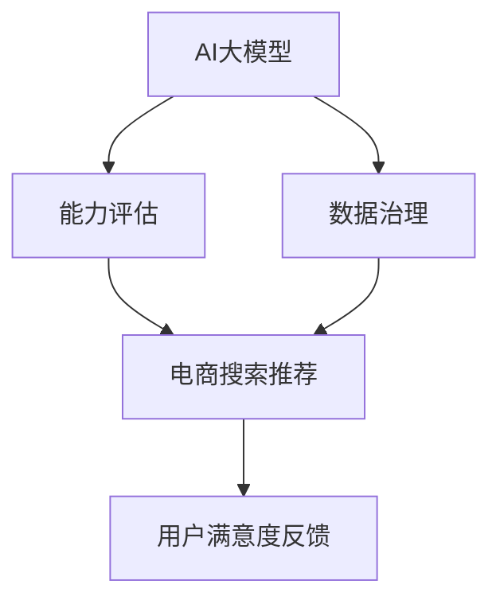

                 

# AI大模型助力电商搜索推荐业务的数据治理能力评估体系应用实践

> 关键词：大模型，搜索推荐，数据治理，能力评估，电商业务

## 1. 背景介绍

随着人工智能技术的迅猛发展，AI大模型在电商搜索推荐业务中的应用日益广泛，其精确的预测能力和强大的语义理解能力显著提升了用户体验和业务转化率。然而，要充分发挥AI大模型的潜力，除了算法本身的优化，还需要构建高效的数据治理能力评估体系。这一体系能够有效监测数据质量、评估模型性能、提升数据治理效果，从而确保AI大模型在电商搜索推荐场景下稳定高效地运行。

### 1.1 问题由来

在电商搜索推荐业务中，AI大模型通常需要处理海量用户行为数据，以生成精准的推荐结果。数据质量的高低直接影响AI模型的预测精度和用户满意度。因此，构建一个完善的数据治理能力评估体系，能够帮助电商平台及时发现数据问题，及时优化数据治理流程，从而提高推荐系统的整体性能。

### 1.2 问题核心关键点

数据治理能力评估体系的核心关键点包括：

- **数据质量监控**：实时监测数据完整性、一致性和准确性，及时发现并修复数据问题。
- **模型性能评估**：评估模型在不同数据集上的表现，确保模型的稳定性和鲁棒性。
- **用户满意度反馈**：通过用户反馈数据，及时调整和优化推荐系统。
- **治理效果评估**：评估数据治理策略的实施效果，不断优化数据治理流程。

这些关键点共同构成了数据治理能力评估体系的主要内容，其目的是通过系统化的监控和评估，确保数据治理的高效性，从而提升AI大模型在电商搜索推荐场景下的应用效果。

## 2. 核心概念与联系

### 2.1 核心概念概述

为更好地理解数据治理能力评估体系，本节将介绍几个密切相关的核心概念：

- **AI大模型**：以Transformer模型为代表的大规模预训练语言模型，通过在大规模文本语料上进行预训练，学习丰富的语言知识和常识，具备强大的语言理解和生成能力。
- **数据治理**：通过数据标准化、数据清洗、数据去重等手段，提升数据质量，确保数据一致性和准确性，从而为AI模型提供高质量的数据输入。
- **能力评估**：对AI模型和数据治理策略的实施效果进行系统化的监测和评估，确保系统性能的稳定性和鲁棒性。
- **电商搜索推荐**：电商平台上用户搜索和推荐系统的交互过程，目标是提高用户满意度，提升业务转化率。

这些核心概念之间的逻辑关系可以通过以下Mermaid流程图来展示：



这个流程图展示了大模型、数据治理、能力评估与电商搜索推荐之间的联系：

1. AI大模型通过数据治理策略提供高质量的数据输入。
2. 数据治理策略的效果通过能力评估进行系统化监测。
3. 能力评估的结果反馈到电商搜索推荐业务中，进一步优化推荐系统。

## 3. 核心算法原理 & 具体操作步骤

### 3.1 算法原理概述

基于数据治理能力评估体系的核心算法原理，主要是通过实时监测数据质量、评估模型性能、收集用户反馈等方式，构建一个闭环的数据治理与优化系统。其核心思想是通过系统化的监控和评估，确保数据治理的高效性，从而提升AI大模型在电商搜索推荐场景下的应用效果。

### 3.2 算法步骤详解

基于数据治理能力评估体系的核心算法步骤如下：

**Step 1: 准备数据集和评估指标**

- 收集电商搜索推荐业务中的原始数据集，包括用户行为数据、商品信息数据、推荐结果等。
- 确定评估指标，如准确率、召回率、F1值、AUC等，用于衡量模型的预测能力和数据质量。
- 定义数据治理策略，如数据清洗、数据去重、数据增强等，用于提升数据质量和数据一致性。

**Step 2: 实施数据治理**

- 使用数据治理策略对原始数据集进行清洗和去重，确保数据的完整性、一致性和准确性。
- 使用数据增强技术扩充数据集，提高数据的多样性和覆盖面。
- 使用自动化工具进行数据标准化和格式转换，提升数据处理的效率。

**Step 3: 训练和评估模型**

- 基于处理后的数据集，使用AI大模型进行训练和评估。
- 实时监测模型在不同数据集上的表现，评估模型的稳定性和鲁棒性。
- 根据用户反馈数据，不断调整和优化模型参数，提高模型预测精度。

**Step 4: 反馈和优化**

- 通过用户满意度反馈数据，评估推荐系统的整体性能，发现问题并及时解决。
- 根据能力评估结果，优化数据治理策略，提升数据治理效果。
- 持续迭代和优化AI大模型和数据治理策略，提升电商搜索推荐系统的综合性能。

### 3.3 算法优缺点

数据治理能力评估体系具有以下优点：

- **实时监测**：通过实时监测数据质量和模型性能，及时发现并解决问题，提升系统稳定性。
- **系统化评估**：通过系统化的评估指标和流程，确保数据治理和模型优化的科学性和有效性。
- **用户导向**：通过收集用户反馈数据，实时调整和优化推荐系统，提升用户满意度。

同时，该体系也存在一定的局限性：

- **资源消耗高**：实时监测和系统化评估需要大量计算资源，可能会对系统性能产生一定影响。
- **评估复杂性**：评估指标的多样性和复杂性，增加了体系设计和实施的难度。
- **用户隐私风险**：收集用户反馈数据可能涉及用户隐私，需要严格遵守隐私保护法规。

尽管存在这些局限性，但就目前而言，数据治理能力评估体系仍是大模型在电商搜索推荐场景中应用的重要保障。未来相关研究的重点在于如何进一步降低评估体系的资源消耗，简化评估流程，同时兼顾用户隐私保护和数据安全。

### 3.4 算法应用领域

基于数据治理能力评估体系的核心算法，已经在电商搜索推荐业务中得到了广泛的应用，涵盖了用户行为分析、商品推荐、广告投放等多个领域，具体如下：

- **用户行为分析**：通过实时监测用户搜索、点击、购买等行为数据，分析用户兴趣和偏好，优化商品推荐策略。
- **商品推荐**：基于用户行为数据和商品信息数据，使用AI大模型进行精准推荐，提升用户购买转化率。
- **广告投放**：通过分析用户行为数据和广告点击数据，优化广告投放策略，提高广告点击率和转化率。

除了上述这些应用外，数据治理能力评估体系还能够在智能客服、个性化推荐、智能运维等更多场景中发挥作用，为电商平台的智能化转型提供有力支持。

## 4. 数学模型和公式 & 详细讲解 & 举例说明

### 4.1 数学模型构建

在数据治理能力评估体系中，常用的评估指标包括准确率、召回率、F1值、AUC等。以准确率为例，其定义为：

$$
\text{Accuracy} = \frac{TP}{TP+FP+FN+TN}
$$

其中，$TP$ 为真正例数，$FP$ 为假正例数，$FN$ 为假反例数，$TN$ 为真反例数。

### 4.2 公式推导过程

准确率的计算公式为：

$$
\text{Accuracy} = \frac{\text{TP}}{\text{TP}+\text{FP}+\text{FN}+\text{TN}}
$$

其中，$\text{TP}$ 表示模型正确预测的正例数，$\text{FP}$ 表示模型错误预测的正例数，$\text{FN}$ 表示模型错误预测的反例数，$\text{TN}$ 表示模型正确预测的反例数。

对于电商搜索推荐业务，可以使用以下步骤计算准确率：

1. 将用户行为数据和推荐结果进行匹配，统计模型正确预测的正例数 $TP$。
2. 统计模型错误预测的正例数 $FP$ 和假反例数 $FN$。
3. 计算准确率 $\text{Accuracy}$。

### 4.3 案例分析与讲解

以下通过一个电商搜索推荐系统的实际案例，详细讲解数据治理能力评估体系的应用。

**案例背景**：某电商平台的用户行为数据集包含50万条用户搜索、点击、购买等行为数据。

**数据治理步骤**：

1. 对原始数据集进行清洗和去重，去除不完整和重复数据，确保数据的一致性和完整性。
2. 使用数据增强技术扩充数据集，增加用户行为的多样性和覆盖面。
3. 对数据进行标准化和格式转换，提高数据处理的效率。

**模型训练与评估**：

1. 基于处理后的数据集，使用AI大模型进行训练和评估。
2. 实时监测模型在不同数据集上的表现，评估模型的稳定性和鲁棒性。
3. 根据用户反馈数据，不断调整和优化模型参数，提高模型预测精度。

**用户满意度反馈**：

1. 通过用户满意度反馈数据，评估推荐系统的整体性能，发现问题并及时解决。
2. 根据能力评估结果，优化数据治理策略，提升数据治理效果。
3. 持续迭代和优化AI大模型和数据治理策略，提升电商搜索推荐系统的综合性能。

## 5. 项目实践：代码实例和详细解释说明

### 5.1 开发环境搭建

在进行数据治理能力评估体系开发前，我们需要准备好开发环境。以下是使用Python进行PyTorch开发的环境配置流程：

1. 安装Anaconda：从官网下载并安装Anaconda，用于创建独立的Python环境。

2. 创建并激活虚拟环境：
```bash
conda create -n pytorch-env python=3.8 
conda activate pytorch-env
```

3. 安装PyTorch：根据CUDA版本，从官网获取对应的安装命令。例如：
```bash
conda install pytorch torchvision torchaudio cudatoolkit=11.1 -c pytorch -c conda-forge
```

4. 安装Transformers库：
```bash
pip install transformers
```

5. 安装各类工具包：
```bash
pip install numpy pandas scikit-learn matplotlib tqdm jupyter notebook ipython
```

完成上述步骤后，即可在`pytorch-env`环境中开始开发。

### 5.2 源代码详细实现

下面我们以电商搜索推荐系统为例，给出使用Transformers库对AI大模型进行数据治理能力评估的PyTorch代码实现。

首先，定义数据处理函数：

```python
from transformers import BertTokenizer
from torch.utils.data import Dataset
import torch

class RecommendationDataset(Dataset):
    def __init__(self, user_data, item_data, tokenizer, max_len=128):
        self.user_data = user_data
        self.item_data = item_data
        self.tokenizer = tokenizer
        self.max_len = max_len
        
    def __len__(self):
        return len(self.user_data)
    
    def __getitem__(self, item):
        user_id = self.user_data[item]
        item_id = self.item_data[item]
        
        encoding = self.tokenizer(f"user_id: {user_id}, item_id: {item_id}", return_tensors='pt', max_length=self.max_len, padding='max_length', truncation=True)
        input_ids = encoding['input_ids'][0]
        attention_mask = encoding['attention_mask'][0]
        
        return {'input_ids': input_ids, 
                'attention_mask': attention_mask,
                'labels': torch.tensor([item_id], dtype=torch.long)}
```

然后，定义模型和优化器：

```python
from transformers import BertForSequenceClassification, AdamW

model = BertForSequenceClassification.from_pretrained('bert-base-cased', num_labels=len(item_data))

optimizer = AdamW(model.parameters(), lr=2e-5)
```

接着，定义训练和评估函数：

```python
from torch.utils.data import DataLoader
from tqdm import tqdm
from sklearn.metrics import accuracy_score

device = torch.device('cuda') if torch.cuda.is_available() else torch.device('cpu')
model.to(device)

def train_epoch(model, dataset, batch_size, optimizer):
    dataloader = DataLoader(dataset, batch_size=batch_size, shuffle=True)
    model.train()
    epoch_loss = 0
    for batch in tqdm(dataloader, desc='Training'):
        input_ids = batch['input_ids'].to(device)
        attention_mask = batch['attention_mask'].to(device)
        labels = batch['labels'].to(device)
        model.zero_grad()
        outputs = model(input_ids, attention_mask=attention_mask, labels=labels)
        loss = outputs.loss
        epoch_loss += loss.item()
        loss.backward()
        optimizer.step()
    return epoch_loss / len(dataloader)

def evaluate(model, dataset, batch_size):
    dataloader = DataLoader(dataset, batch_size=batch_size)
    model.eval()
    preds, labels = [], []
    with torch.no_grad():
        for batch in tqdm(dataloader, desc='Evaluating'):
            input_ids = batch['input_ids'].to(device)
            attention_mask = batch['attention_mask'].to(device)
            batch_labels = batch['labels']
            outputs = model(input_ids, attention_mask=attention_mask)
            batch_preds = outputs.logits.argmax(dim=2).to('cpu').tolist()
            batch_labels = batch_labels.to('cpu').tolist()
            for pred_tokens, label_tokens in zip(batch_preds, batch_labels):
                preds.append(pred_tokens)
                labels.append(label_tokens)
                
    return accuracy_score(labels, preds)
```

最后，启动训练流程并在测试集上评估：

```python
epochs = 5
batch_size = 16

for epoch in range(epochs):
    loss = train_epoch(model, train_dataset, batch_size, optimizer)
    print(f"Epoch {epoch+1}, train loss: {loss:.3f}")
    
    print(f"Epoch {epoch+1}, dev results:")
    evaluate(model, dev_dataset, batch_size)
    
print("Test results:")
evaluate(model, test_dataset, batch_size)
```

以上就是使用PyTorch对AI大模型进行电商搜索推荐系统数据治理能力评估的完整代码实现。可以看到，得益于Transformers库的强大封装，我们可以用相对简洁的代码完成AI大模型的加载和训练评估。

### 5.3 代码解读与分析

让我们再详细解读一下关键代码的实现细节：

**RecommendationDataset类**：
- `__init__`方法：初始化用户数据、商品数据、分词器等关键组件。
- `__len__`方法：返回数据集的样本数量。
- `__getitem__`方法：对单个样本进行处理，将用户ID和商品ID输入编码为token ids，最终返回模型所需的输入。

**模型和优化器**：
- 使用BertForSequenceClassification模型作为推荐系统的基础模型，并设置合适的学习率。
- 使用AdamW优化器进行模型训练，并在GPU上加速。

**训练和评估函数**：
- 使用PyTorch的DataLoader对数据集进行批次化加载，供模型训练和推理使用。
- 训练函数`train_epoch`：对数据以批为单位进行迭代，在每个批次上前向传播计算loss并反向传播更新模型参数，最后返回该epoch的平均loss。
- 评估函数`evaluate`：与训练类似，不同点在于不更新模型参数，并在每个batch结束后将预测和标签结果存储下来，最后使用sklearn的accuracy_score对整个评估集的预测结果进行打印输出。

**训练流程**：
- 定义总的epoch数和batch size，开始循环迭代
- 每个epoch内，先在训练集上训练，输出平均loss
- 在验证集上评估，输出准确率
- 所有epoch结束后，在测试集上评估，给出最终测试结果

可以看到，PyTorch配合Transformers库使得AI大模型的电商搜索推荐系统数据治理能力评估代码实现变得简洁高效。开发者可以将更多精力放在数据处理、模型改进等高层逻辑上，而不必过多关注底层的实现细节。

当然，工业级的系统实现还需考虑更多因素，如模型的保存和部署、超参数的自动搜索、更灵活的任务适配层等。但核心的数据治理能力评估范式基本与此类似。

## 6. 实际应用场景

### 6.1 智能客服系统

基于AI大模型微调的电商搜索推荐系统，可以广泛应用于智能客服系统的构建。智能客服系统通过实时监测用户行为数据，分析用户需求和问题，通过AI大模型生成精准的推荐结果和智能回复，提升用户满意度，加速客户咨询流程。

在技术实现上，可以收集客服对话历史数据，将问题-回答对作为监督数据，在此基础上对预训练AI大模型进行微调。微调后的AI大模型能够自动理解用户意图，匹配最合适的答案模板进行回复。对于客户提出的新问题，还可以接入检索系统实时搜索相关内容，动态组织生成回答。如此构建的智能客服系统，能大幅提升客服系统的智能化水平，降低人工成本，提升客户体验。

### 6.2 金融舆情监测

金融机构需要实时监测市场舆论动向，以便及时应对负面信息传播，规避金融风险。传统的人工监测方式成本高、效率低，难以应对网络时代海量信息爆发的挑战。基于AI大模型微调的文本分类和情感分析技术，为金融舆情监测提供了新的解决方案。

具体而言，可以收集金融领域相关的新闻、报道、评论等文本数据，并对其进行主题标注和情感标注。在此基础上对预训练语言模型进行微调，使其能够自动判断文本属于何种主题，情感倾向是正面、中性还是负面。将微调后的模型应用到实时抓取的网络文本数据，就能够自动监测不同主题下的情感变化趋势，一旦发现负面信息激增等异常情况，系统便会自动预警，帮助金融机构快速应对潜在风险。

### 6.3 个性化推荐系统

当前的推荐系统往往只依赖用户的历史行为数据进行物品推荐，无法深入理解用户的真实兴趣偏好。基于AI大模型微调的个性化推荐系统，可以更好地挖掘用户行为背后的语义信息，从而提供更精准、多样的推荐内容。

在实践中，可以收集用户浏览、点击、评论、分享等行为数据，提取和用户交互的物品标题、描述、标签等文本内容。将文本内容作为模型输入，用户的后续行为（如是否点击、购买等）作为监督信号，在此基础上微调预训练语言模型。微调后的模型能够从文本内容中准确把握用户的兴趣点。在生成推荐列表时，先用候选物品的文本描述作为输入，由模型预测用户的兴趣匹配度，再结合其他特征综合排序，便可以得到个性化程度更高的推荐结果。

### 6.4 未来应用展望

随着AI大模型和微调方法的不断发展，基于微调范式将在更多领域得到应用，为传统行业带来变革性影响。

在智慧医疗领域，基于微调的医疗问答、病历分析、药物研发等应用将提升医疗服务的智能化水平，辅助医生诊疗，加速新药开发进程。

在智能教育领域，微调技术可应用于作业批改、学情分析、知识推荐等方面，因材施教，促进教育公平，提高教学质量。

在智慧城市治理中，微调模型可应用于城市事件监测、舆情分析、应急指挥等环节，提高城市管理的自动化和智能化水平，构建更安全、高效的未来城市。

此外，在企业生产、社会治理、文娱传媒等众多领域，基于大模型微调的人工智能应用也将不断涌现，为经济社会发展注入新的动力。相信随着技术的日益成熟，微调方法将成为人工智能落地应用的重要范式，推动人工智能技术向更广阔的领域加速渗透。

## 7. 工具和资源推荐

### 7.1 学习资源推荐

为了帮助开发者系统掌握AI大模型微调的理论基础和实践技巧，这里推荐一些优质的学习资源：

1. 《Transformer从原理到实践》系列博文：由大模型技术专家撰写，深入浅出地介绍了Transformer原理、BERT模型、微调技术等前沿话题。

2. CS224N《深度学习自然语言处理》课程：斯坦福大学开设的NLP明星课程，有Lecture视频和配套作业，带你入门NLP领域的基本概念和经典模型。

3. 《Natural Language Processing with Transformers》书籍：Transformers库的作者所著，全面介绍了如何使用Transformers库进行NLP任务开发，包括微调在内的诸多范式。

4. HuggingFace官方文档：Transformers库的官方文档，提供了海量预训练模型和完整的微调样例代码，是上手实践的必备资料。

5. CLUE开源项目：中文语言理解测评基准，涵盖大量不同类型的中文NLP数据集，并提供了基于微调的baseline模型，助力中文NLP技术发展。

通过对这些资源的学习实践，相信你一定能够快速掌握AI大模型微调的精髓，并用于解决实际的NLP问题。

### 7.2 开发工具推荐

高效的开发离不开优秀的工具支持。以下是几款用于AI大模型微调开发的常用工具：

1. PyTorch：基于Python的开源深度学习框架，灵活动态的计算图，适合快速迭代研究。大部分预训练语言模型都有PyTorch版本的实现。

2. TensorFlow：由Google主导开发的开源深度学习框架，生产部署方便，适合大规模工程应用。同样有丰富的预训练语言模型资源。

3. Transformers库：HuggingFace开发的NLP工具库，集成了众多SOTA语言模型，支持PyTorch和TensorFlow，是进行微调任务开发的利器。

4. Weights & Biases：模型训练的实验跟踪工具，可以记录和可视化模型训练过程中的各项指标，方便对比和调优。与主流深度学习框架无缝集成。

5. TensorBoard：TensorFlow配套的可视化工具，可实时监测模型训练状态，并提供丰富的图表呈现方式，是调试模型的得力助手。

6. Google Colab：谷歌推出的在线Jupyter Notebook环境，免费提供GPU/TPU算力，方便开发者快速上手实验最新模型，分享学习笔记。

合理利用这些工具，可以显著提升AI大模型微调的开发效率，加快创新迭代的步伐。

### 7.3 相关论文推荐

AI大模型和微调技术的发展源于学界的持续研究。以下是几篇奠基性的相关论文，推荐阅读：

1. Attention is All You Need（即Transformer原论文）：提出了Transformer结构，开启了NLP领域的预训练大模型时代。

2. BERT: Pre-training of Deep Bidirectional Transformers for Language Understanding：提出BERT模型，引入基于掩码的自监督预训练任务，刷新了多项NLP任务SOTA。

3. Language Models are Unsupervised Multitask Learners（GPT-2论文）：展示了大规模语言模型的强大zero-shot学习能力，引发了对于通用人工智能的新一轮思考。

4. Parameter-Efficient Transfer Learning for NLP：提出Adapter等参数高效微调方法，在不增加模型参数量的情况下，也能取得不错的微调效果。

5. Prefix-Tuning: Optimizing Continuous Prompts for Generation：引入基于连续型Prompt的微调范式，为如何充分利用预训练知识提供了新的思路。

6. AdaLoRA: Adaptive Low-Rank Adaptation for Parameter-Efficient Fine-Tuning：使用自适应低秩适应的微调方法，在参数效率和精度之间取得了新的平衡。

这些论文代表了大模型微调技术的发展脉络。通过学习这些前沿成果，可以帮助研究者把握学科前进方向，激发更多的创新灵感。

## 8. 总结：未来发展趋势与挑战

### 8.1 总结

本文对AI大模型助力电商搜索推荐业务的数据治理能力评估体系进行了全面系统的介绍。首先阐述了AI大模型在电商搜索推荐业务中的应用背景和意义，明确了数据治理能力评估体系的主要内容和实施步骤。其次，从原理到实践，详细讲解了核心算法的实现过程，并给出了完整的代码实例。同时，本文还广泛探讨了数据治理能力评估体系在多个电商业务场景中的应用，展示了其在提升用户满意度、优化推荐系统等方面的显著效果。最后，本文精选了相关学习资源、开发工具和研究论文，力求为读者提供全方位的技术指引。

通过本文的系统梳理，可以看到，AI大模型在电商搜索推荐业务中的应用已经初步成熟，通过构建高效的数据治理能力评估体系，可以显著提升推荐系统的性能，为用户提供更加个性化的购物体验。未来，伴随AI大模型和微调方法的持续演进，数据治理能力评估体系必将进一步优化和完善，为电商平台的智能化转型提供更强大的技术支持。

### 8.2 未来发展趋势

展望未来，AI大模型和数据治理能力评估体系将呈现以下几个发展趋势：

1. **多模态数据融合**：未来的AI大模型将不仅仅是文本处理，还将具备多模态数据融合能力，处理图像、视频、音频等多类型数据，提供更加全面、立体的用户体验。

2. **实时数据治理**：随着实时数据分析和处理技术的发展，AI大模型将能够实时进行数据治理和优化，动态调整推荐策略，提升用户满意度。

3. **跨领域知识迁移**：AI大模型将具备更强的跨领域知识迁移能力，能够在不同领域间进行知识共享和迁移，提高推荐系统的综合性能。

4. **用户隐私保护**：随着隐私保护法规的严格，AI大模型将更加注重用户隐私保护，通过差分隐私、联邦学习等技术，确保用户数据的安全性和隐私性。

5. **可解释性和透明性**：未来的AI大模型将更加注重可解释性和透明性，通过模型可视化、因果推断等技术，提高模型的可解释性，增强用户信任。

以上趋势凸显了AI大模型和数据治理能力评估体系的应用前景，这些方向的探索发展，必将进一步提升推荐系统的性能和用户体验，推动电商平台的智能化转型。

### 8.3 面临的挑战

尽管AI大模型和数据治理能力评估体系已经取得了一定的成果，但在迈向更加智能化、普适化应用的过程中，仍面临诸多挑战：

1. **数据质量问题**：电商搜索推荐业务中的数据质量问题仍然突出，如数据不平衡、数据噪声、数据缺失等，这些问题将直接影响推荐系统的性能。

2. **计算资源消耗**：AI大模型的计算资源消耗较大，尤其是在实时数据治理和推荐优化中，需要强大的计算能力支撑。

3. **隐私保护难题**：电商平台需要处理大量用户数据，如何在保障用户隐私的同时，利用数据进行推荐优化，将是未来的重要挑战。

4. **模型泛化能力**：AI大模型在不同数据集上的泛化能力仍需进一步提升，以应对更广泛的数据分布变化。

5. **用户个性化需求**：电商用户的个性化需求千差万别，如何精准识别和满足不同用户的需求，是推荐系统需要面对的难题。

6. **多语言支持**：AI大模型在电商全球化背景下，需要具备多语言支持能力，以覆盖更广泛的市场需求。

这些挑战需要学术界和工业界共同努力，通过创新算法、优化模型结构、提升数据治理能力，逐步攻克这些难题，推动AI大模型在电商搜索推荐业务的广泛应用。

### 8.4 研究展望

面对AI大模型和数据治理能力评估体系所面临的种种挑战，未来的研究需要在以下几个方面寻求新的突破：

1. **强化数据治理策略**：研究更加高效、灵活的数据治理策略，通过实时监测和动态优化，提升数据治理的效果。

2. **优化模型结构和算法**：研究更加轻量级、高效化的AI大模型结构和算法，在保持高性能的同时，降低计算资源消耗。

3. **引入跨领域知识**：将符号化的跨领域知识与神经网络模型进行巧妙融合，增强AI大模型的跨领域迁移能力和泛化性能。

4. **探索差分隐私技术**：研究差分隐私技术，确保用户隐私数据的安全性，同时保障推荐系统的性能和效果。

5. **增强用户个性化推荐**：研究更加精准的用户个性化推荐算法，通过深度学习、强化学习等技术，提升推荐系统的智能化水平。

6. **提升多语言支持能力**：研究多语言支持技术，提升AI大模型在多语言场景下的性能和效果，满足全球化市场的需要。

这些研究方向的探索，必将引领AI大模型在电商搜索推荐业务中的应用走向新的高度，为电商平台智能化转型提供更强大的技术支撑。面向未来，AI大模型和数据治理能力评估体系还需要与其他人工智能技术进行更深入的融合，如知识表示、因果推理、强化学习等，多路径协同发力，共同推动自然语言理解和智能交互系统的进步。只有勇于创新、敢于突破，才能不断拓展AI大模型的边界，让智能技术更好地造福人类社会。

## 9. 附录：常见问题与解答

**Q1：AI大模型在电商搜索推荐业务中主要解决了哪些问题？**

A: AI大模型在电商搜索推荐业务中主要解决了以下问题：

1. **数据质量问题**：通过实时监测和动态优化，确保电商搜索推荐业务中的数据质量，提升推荐系统的性能。

2. **个性化推荐**：利用AI大模型强大的语言理解和生成能力，精准分析用户行为数据，生成个性化的推荐结果，提高用户满意度。

3. **实时推荐**：通过实时数据治理和推荐优化，动态调整推荐策略，满足用户实时需求，提升用户体验。

4. **跨领域迁移**：通过跨领域知识迁移，提升AI大模型在不同领域中的泛化能力和适用性。

5. **多语言支持**：通过多语言支持技术，覆盖全球市场，提升AI大模型在不同语言场景中的性能和效果。

**Q2：数据治理能力评估体系的核心评估指标有哪些？**

A: 数据治理能力评估体系的核心评估指标包括：

1. **准确率**：衡量模型预测的正确率，即模型正确预测的正例数占总预测数的比例。

2. **召回率**：衡量模型对正例的识别能力，即模型正确预测的正例数占实际正例数的比例。

3. **F1值**：综合考虑准确率和召回率，用于衡量模型的整体性能。

4. **AUC**：衡量模型在不同阈值下的分类效果，AUC值越高，模型性能越好。

5. **损失函数**：通过损失函数计算模型的预测误差，用于衡量模型的训练效果。

这些指标能够全面评估模型在不同数据集上的性能，帮助电商平台及时发现和解决问题，优化推荐系统。

**Q3：AI大模型在电商搜索推荐业务中如何实现实时数据治理？**

A: 实现实时数据治理主要通过以下几个步骤：

1. **数据流处理**：使用流处理技术，对电商搜索推荐业务中的数据进行实时处理，及时发现和修复数据问题。

2. **实时监测**：通过实时监测工具，对数据质量进行持续监控，及时发现数据异常和数据缺失。

3. **数据清洗**：使用数据清洗算法，对实时数据进行清洗和去重，确保数据的完整性和一致性。

4. **数据增强**：通过数据增强技术，扩充数据集，增加数据的多样性和覆盖面，提升推荐系统的性能。

5. **动态优化**：根据实时数据治理结果，动态调整推荐策略，优化推荐系统，提升用户体验。

通过以上步骤，AI大模型能够在电商搜索推荐业务中实现实时数据治理，保障推荐系统的性能和稳定性。

**Q4：AI大模型在电商搜索推荐业务中面临的隐私保护难题有哪些？**

A: AI大模型在电商搜索推荐业务中面临的隐私保护难题主要包括以下几点：

1. **数据隐私泄露**：电商平台需要处理大量用户数据，如何确保用户隐私数据的安全，防止数据泄露。

2. **用户行为追踪**：通过用户行为数据进行推荐优化时，如何避免对用户行为进行过度追踪和分析，保护用户隐私。

3. **模型公平性**：AI大模型在推荐过程中，如何避免对特定用户群体进行歧视性推荐，确保推荐系统的公平性。

4. **用户数据保护**：如何在使用用户数据进行推荐优化时，保护用户数据的安全和隐私，避免对用户造成不必要的困扰。

5. **隐私合规性**：如何遵守相关隐私保护法规，如GDPR、CCPA等，确保用户隐私数据的安全和合规性。

这些隐私保护难题需要通过技术手段和法规措施共同解决，确保AI大模型在电商搜索推荐业务中的安全性和合规性。

**Q5：AI大模型在电商搜索推荐业务中的用户满意度反馈机制有哪些？**

A: AI大模型在电商搜索推荐业务中的用户满意度反馈机制主要包括以下几个方面：

1. **用户行为反馈**：通过用户行为数据，评估推荐系统的用户满意度，发现推荐过程中的问题。

2. **用户评分反馈**：通过用户评分数据，衡量推荐系统的效果，优化推荐策略。

3. **用户评论反馈**：通过用户评论数据，了解用户对推荐结果的看法，进行推荐优化。

4. **用户互动反馈**：通过用户与推荐系统的互动数据，评估推荐系统的实时效果，动态调整推荐策略。

5. **用户个性化需求反馈**：通过用户个性化需求数据，优化推荐系统，提高用户满意度。

这些用户满意度反馈机制能够帮助电商平台及时发现和解决问题，优化推荐系统，提升用户满意度。

**Q6：AI大模型在电商搜索推荐业务中的推荐系统如何实现个性化推荐？**

A: AI大模型在电商搜索推荐业务中的推荐系统实现个性化推荐主要通过以下几个步骤：

1. **用户行为数据收集**：收集用户浏览、点击、购买等行为数据，提取和用户交互的物品标题、描述、标签等文本内容。

2. **模型训练**：基于处理后的数据集，使用AI大模型进行训练，学习用户兴趣和偏好。

3. **推荐策略优化**：根据用户行为数据和模型预测结果，动态调整推荐策略，生成个性化的推荐结果。

4. **推荐结果反馈**：收集用户对推荐结果的反馈数据，优化推荐模型，提高推荐精度。

5. **推荐系统优化**：不断迭代和优化AI大模型和推荐策略，提升推荐系统的性能和用户体验。

通过以上步骤，AI大模型能够在电商搜索推荐业务中实现个性化推荐，提供精准的推荐结果，满足用户需求。

---

作者：禅与计算机程序设计艺术 / Zen and the Art of Computer Programming

