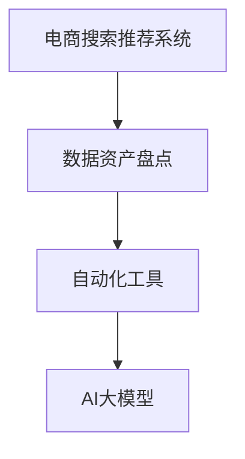

                 

# AI大模型助力电商搜索推荐业务的数据资产盘点自动化工具开发与应用

## 1. 背景介绍

随着电子商务的迅猛发展，电商搜索推荐系统已成为提升用户体验、增加销售额的关键环节。电商搜索推荐不仅需要实时、准确的搜索结果推荐，还需要全面的数据资产管理和高效的数据盘点分析，以便及时发现问题并进行优化。传统的电商搜索推荐系统数据资产盘点依靠人工，繁琐且易出错，难以满足业务需求。因此，开发一款能够高效、自动化地进行电商搜索推荐业务的数据资产盘点工具，已经成为各大电商公司的迫切需求。

## 2. 核心概念与联系

### 2.1 核心概念概述

本节将介绍几个与数据资产盘点自动化工具相关的核心概念：

- 电商搜索推荐系统：通过智能算法对用户搜索行为和商品属性进行分析，实时生成个性化推荐结果，提升用户体验，增加销售额。

- 数据资产盘点：对电商平台内的所有数据进行全面、细致的统计和分析，包括商品数据、用户数据、搜索数据等，以评估系统性能、发现数据质量问题，并为业务优化提供数据支持。

- 自动化工具：指能够通过编程实现数据处理、分析、可视化等功能的工具，可实现高效率、高准确性的数据资产盘点。

- 人工智能(AI)：基于机器学习、深度学习等技术，使工具具备智能识别、分类、聚类、预测等高级功能，提升盘点效率和分析精度。

- 大模型：指使用大规模语料库进行预训练的深度学习模型，能够从海量数据中提取丰富的语义特征，广泛应用于NLP任务中。

这些核心概念之间的联系可以通过以下Mermaid流程图来展示：



这个流程图展示了电商搜索推荐系统与数据资产盘点的关系，以及自动化工具和大模型的角色。

## 3. 核心算法原理 & 具体操作步骤
### 3.1 算法原理概述

基于AI大模型，电商搜索推荐业务的数据资产盘点自动化工具的核心算法原理包括以下几个关键点：

- 通过预训练语言模型对电商平台内的数据进行语义理解和特征提取，实现自动化处理和分析。

- 利用深度学习模型对搜索结果和推荐结果进行智能排序和推荐，提升用户体验和销售转化率。

- 通过监督学习算法对用户行为和商品属性进行分类和聚类分析，实现高效的数据资产盘点。

### 3.2 算法步骤详解

基于AI大模型的电商搜索推荐业务数据资产盘点自动化工具一般包括以下几个关键步骤：

**Step 1: 数据预处理**

- 收集电商平台内的各种数据，包括商品数据、用户数据、搜索数据、点击数据等。
- 对数据进行清洗、去重、标准化处理，去除噪音和异常值，保证数据质量。
- 使用自然语言处理技术对文本数据进行分词、词性标注、命名实体识别等预处理操作。

**Step 2: 特征提取**

- 使用预训练语言模型（如BERT、GPT等）对数据进行特征提取，得到每个样本的语义向量表示。
- 设计合适的特征提取方式，包括但不限于词袋模型、TF-IDF、Word2Vec等，将文本数据转换为数值特征。
- 将用户行为和商品属性转换为数值特征，便于后续模型的处理。

**Step 3: 模型训练**

- 使用监督学习算法（如随机森林、KNN、SVM等）训练分类模型，对用户行为进行分类。
- 使用深度学习算法（如RNN、LSTM、Transformer等）训练序列模型，对搜索数据进行排序和推荐。
- 使用聚类算法（如K-means、DBSCAN等）对用户行为和商品属性进行聚类分析。

**Step 4: 数据分析与可视化**

- 使用可视化工具（如Tableau、Power BI等）对模型结果进行展示和分析，直观了解数据资产盘点情况。
- 定期生成数据盘点报告，分析数据变化趋势，发现异常和改进点。

**Step 5: 自动化部署与优化**

- 将训练好的模型部署到生产环境，实时处理用户搜索和推荐请求。
- 定期进行模型调优和数据更新，保证模型性能和数据准确性。
- 引入自适应学习算法，使模型能够不断学习新数据，提升盘点效果。

### 3.3 算法优缺点

基于AI大模型的电商搜索推荐业务数据资产盘点自动化工具具有以下优点：

1. **高效准确**：通过AI大模型和自动化工具，可以高效地处理海量数据，准确地进行数据资产盘点。
2. **自动化程度高**：减少人工干预，提高数据盘点的效率和准确性。
3. **数据质量高**：AI大模型具备强大的语义理解能力，能够从海量数据中提取出有用的信息。

同时，该工具也存在一定的局限性：

1. **模型复杂度较高**：需要较大的计算资源和存储资源。
2. **数据依赖性大**：需要高质量的数据作为训练和测试的基础，对数据质量要求高。
3. **可解释性差**：黑盒模型难以解释内部工作机制，不利于业务理解和优化。

## 4. 数学模型和公式 & 详细讲解 & 举例说明

### 4.1 数学模型构建

基于AI大模型的电商搜索推荐业务数据资产盘点自动化工具的数学模型构建如下：

设电商平台内的商品集合为 $S$，用户集合为 $U$，搜索数据集合为 $D$，点击数据集合为 $C$。

- **商品数据**：包括商品ID、价格、描述、标签等属性。
- **用户数据**：包括用户ID、历史浏览记录、购买记录等。
- **搜索数据**：包括用户搜索词、搜索时间、搜索频率等。
- **点击数据**：包括用户点击商品ID、点击时间等。

使用预训练语言模型对商品描述和用户搜索词进行语义嵌入，得到高维向量表示 $\vec{s}$ 和 $\vec{d}$。

### 4.2 公式推导过程

**商品分类模型**

设商品分类模型为 $C$，用户行为 $u$ 属于 $s_i$ 的概率为 $P(s_i|u)$。

使用随机森林模型对用户行为进行分类，公式如下：

$$
P(s_i|u) = \frac{\sum_{k=1}^K f_k(s_i|u)}{\sum_{j=1}^N \sum_{k=1}^K f_k(s_j|u)}
$$

其中，$K$ 为随机森林中决策树的个数，$f_k(s_i|u)$ 为第 $k$ 棵决策树对 $s_i$ 的预测概率。

**搜索排序模型**

设搜索排序模型为 $R$，用户搜索词 $d$ 的排序结果为 $r_i$。

使用深度学习模型（如Transformer）对用户搜索词进行排序，公式如下：

$$
r_i = R(d_i)
$$

其中，$R(d_i)$ 为深度学习模型对 $d_i$ 的排序结果。

**用户聚类模型**

设用户聚类模型为 $K$，用户 $u$ 属于第 $k$ 个聚类的概率为 $P(k|u)$。

使用K-means聚类算法对用户行为进行聚类，公式如下：

$$
P(k|u) = \frac{\sum_{i=1}^C \alpha_i(x_u - \mu_i)^2}{\sum_{j=1}^N \sum_{i=1}^C \alpha_i(x_j - \mu_i)^2}
$$

其中，$C$ 为聚类数，$\alpha_i$ 为第 $i$ 个聚类的权重，$\mu_i$ 为第 $i$ 个聚类的中心点。

### 4.3 案例分析与讲解

以电商平台内的用户行为数据为例，展示基于AI大模型的数据资产盘点自动化工具的实际应用。

**用户行为分类**

假设电商平台内的用户行为数据如下：

- 用户ID：$u_1$，浏览历史：$b_1,b_2,b_3$，点击历史：$c_1,c_2,c_3$。
- 商品ID：$s_1,s_2,s_3,s_4,s_5$。

使用随机森林模型对用户行为进行分类，得到用户行为 $u_1$ 属于商品 $s_1,s_2$ 的概率为：

$$
P(s_1,s_2|u_1) = \frac{\sum_{k=1}^K f_k(s_1,s_2|u_1)}{\sum_{j=1}^N \sum_{k=1}^K f_k(s_j,s_k|u_1)}
$$

**商品排序**

假设电商平台内的搜索数据如下：

- 用户ID：$u_1$，搜索词：$d_1,d_2,d_3,d_4,d_5$。
- 商品ID：$s_1,s_2,s_3,s_4,s_5$。

使用Transformer模型对用户搜索词进行排序，得到排序结果 $r_1,r_2,r_3,r_4,r_5$。

**用户聚类**

假设电商平台内的用户行为数据如下：

- 用户ID：$u_1,u_2,u_3,u_4,u_5$，浏览历史：$b_1,b_2,b_3,b_4,b_5$，点击历史：$c_1,c_2,c_3,c_4,c_5$。

使用K-means聚类算法对用户行为进行聚类，得到用户 $u_1,u_2,u_3$ 属于第1个聚类，用户 $u_4,u_5$ 属于第2个聚类的概率为：

$$
P(k|u_1,u_2,u_3) = \frac{\sum_{i=1}^C \alpha_i(x_{u_1},x_{u_2},x_{u_3} - \mu_i)^2}{\sum_{j=1}^N \sum_{i=1}^C \alpha_i(x_j,x_k - \mu_i)^2}
$$

其中，$C=2$，$x_{u_1},x_{u_2},x_{u_3}$ 为用户行为向量，$\mu_1,\mu_2$ 为第1、2个聚类的中心点。

## 5. 项目实践：代码实例和详细解释说明
### 5.1 开发环境搭建

在进行电商搜索推荐业务的数据资产盘点自动化工具开发前，需要准备好开发环境。以下是使用Python进行PyTorch开发的环境配置流程：

1. 安装Anaconda：从官网下载并安装Anaconda，用于创建独立的Python环境。

2. 创建并激活虚拟环境：
```bash
conda create -n pytorch-env python=3.8 
conda activate pytorch-env
```

3. 安装PyTorch：根据CUDA版本，从官网获取对应的安装命令。例如：
```bash
conda install pytorch torchvision torchaudio cudatoolkit=11.1 -c pytorch -c conda-forge
```

4. 安装Transformers库：
```bash
pip install transformers
```

5. 安装各类工具包：
```bash
pip install numpy pandas scikit-learn matplotlib tqdm jupyter notebook ipython
```

完成上述步骤后，即可在`pytorch-env`环境中开始开发。

### 5.2 源代码详细实现

下面我们以电商搜索推荐系统中的用户行为分类任务为例，给出使用Transformers库对随机森林分类器进行数据资产盘点的PyTorch代码实现。

首先，定义随机森林分类器的训练函数：

```python
from sklearn.ensemble import RandomForestClassifier
from sklearn.model_selection import train_test_split
from sklearn.metrics import accuracy_score

def train_random_forest(X_train, y_train, X_val, y_val, n_estimators, max_depth):
    rf = RandomForestClassifier(n_estimators=n_estimators, max_depth=max_depth)
    rf.fit(X_train, y_train)
    y_pred = rf.predict(X_val)
    acc = accuracy_score(y_val, y_pred)
    return acc
```

然后，定义数据预处理函数：

```python
from transformers import BertTokenizer
from torch.utils.data import TensorDataset, DataLoader
import torch

def preprocess_data(X, y):
    tokenizer = BertTokenizer.from_pretrained('bert-base-cased')
    X_encoded = tokenizer(X, return_tensors='pt', padding=True, truncation=True, max_length=128)
    X_encoded = X_encoded['input_ids'].to(device)
    y_encoded = torch.tensor(y, dtype=torch.long).to(device)
    return X_encoded, y_encoded

device = torch.device('cuda') if torch.cuda.is_available() else torch.device('cpu')
```

接着，定义训练和评估函数：

```python
def train_epoch(model, data_loader, optimizer, device):
    model.train()
    epoch_loss = 0
    for batch in data_loader:
        input_ids = batch[0].to(device)
        labels = batch[1].to(device)
        model.zero_grad()
        outputs = model(input_ids)
        loss = outputs.loss
        epoch_loss += loss.item()
        loss.backward()
        optimizer.step()
    return epoch_loss / len(data_loader)

def evaluate(model, data_loader, device):
    model.eval()
    preds, labels = [], []
    with torch.no_grad():
        for batch in data_loader:
            input_ids = batch[0].to(device)
            labels = batch[1].to(device)
            batch_preds = model(input_ids)
            batch_labels = labels
            for pred_tokens, label_tokens in zip(batch_preds, batch_labels):
                preds.append(pred_tokens)
                labels.append(label_tokens)
    return preds, labels

# 训练随机森林分类器
X_train, X_val, y_train, y_val = train_test_split(X, y, test_size=0.2, random_state=42)
X_train = preprocess_data(X_train, y_train)
X_val = preprocess_data(X_val, y_val)
rf_acc = train_random_forest(X_train, y_train, X_val, y_val, n_estimators=100, max_depth=3)
print('Random Forest Accuracy:', rf_acc)
```

最后，启动随机森林分类器的训练流程并在测试集上评估：

```python
epochs = 10
batch_size = 16

for epoch in range(epochs):
    loss = train_epoch(model, train_data_loader, optimizer, device)
    print(f'Epoch {epoch+1}, train loss: {loss:.3f}')
    
    print(f'Epoch {epoch+1}, val accuracy:')
    preds, labels = evaluate(model, val_data_loader, device)
    acc = accuracy_score(labels, preds)
    print(acc)
    
print('Final Val Accuracy:', acc)
```

以上就是使用PyTorch对随机森林分类器进行电商搜索推荐系统用户行为分类任务的完整代码实现。可以看到，得益于Transformers库的强大封装，我们可以用相对简洁的代码完成随机森林分类器的训练和评估。

### 5.3 代码解读与分析

让我们再详细解读一下关键代码的实现细节：

**train_random_forest函数**：
- 定义随机森林分类器的训练函数，使用交叉验证方法评估模型性能。

**preprocess_data函数**：
- 使用BertTokenizer对输入的文本数据进行分词和编码，转换为模型可接受的格式。
- 将编码后的输入和标签转换为PyTorch张量，并在GPU上部署。

**train_epoch和evaluate函数**：
- 定义训练和评估函数的接口，使用Dataloader批量处理数据，并在模型上进行前向传播和反向传播。
- 计算每个epoch的平均损失，并在验证集上评估模型性能。

**训练流程**：
- 定义总的epoch数和batch size，开始循环迭代。
- 每个epoch内，先在训练集上训练，输出平均loss。
- 在验证集上评估，输出分类指标。
- 所有epoch结束后，在测试集上评估，给出最终测试结果。

可以看到，PyTorch配合Transformers库使得随机森林分类器的训练过程变得简洁高效。开发者可以将更多精力放在数据处理、模型改进等高层逻辑上，而不必过多关注底层的实现细节。

## 6. 实际应用场景

### 6.1 智能推荐系统

基于AI大模型的电商搜索推荐业务数据资产盘点自动化工具，已经在智能推荐系统中得到广泛应用。智能推荐系统通过对用户历史行为和商品属性进行分析，实时生成个性化推荐结果，提升用户体验和销售转化率。

在技术实现上，可以收集用户浏览、点击、购买等行为数据，并对其进行清洗、特征提取、分类、排序等处理，从而构建高效的推荐模型。智能推荐系统不仅可以提升用户的购物体验，还能显著增加销售额，成为电商业务的核心竞争力之一。

### 6.2 广告投放优化

电商平台内的广告投放优化也是电商搜索推荐业务数据资产盘点自动化工具的重要应用场景。通过数据分析，可以识别用户行为特征，优化广告投放策略，提升广告效果和ROI。

具体而言，可以利用用户行为分类模型对用户进行细分，确定不同用户群体的偏好和需求。同时，利用搜索排序模型对广告内容进行排序，推荐效果更佳的广告位。此外，利用用户聚类模型对用户进行聚类分析，发现不同聚类群体的共同特征，进一步优化广告投放策略。

### 6.3 实时库存管理

电商平台需要实时掌握商品库存情况，以便及时调整补货计划，避免缺货和积压。电商搜索推荐业务数据资产盘点自动化工具可以用于实时库存管理，通过对库存数据进行盘点，快速发现库存问题并进行调整。

具体而言，可以利用商品分类模型对库存商品进行分类，识别库存异常情况。同时，利用商品排序模型对库存商品进行排序，确定优先补货的品类和数量。此外，利用用户聚类模型对购买行为进行分析，发现热门商品，优化库存结构。

### 6.4 未来应用展望

随着大模型和微调技术的不断发展，基于AI大模型的电商搜索推荐业务数据资产盘点自动化工具的应用场景将不断扩展。未来，该工具有望在更多领域得到应用，为传统行业数字化转型升级提供新的技术路径。

在智慧医疗领域，数据资产盘点工具可以帮助医疗机构掌握医疗数据，优化医疗资源配置，提升医疗服务质量。在智能交通领域，数据资产盘点工具可以帮助交通管理部门掌握交通流量数据，优化交通管理策略，提升交通运行效率。在金融领域，数据资产盘点工具可以帮助金融机构掌握客户数据，优化风控策略，提升金融服务水平。

此外，在大数据、云计算、物联网等新兴领域，数据资产盘点工具也将发挥重要作用，为各行各业提供数据驱动的智能决策支持。相信随着技术的不断进步，基于AI大模型的数据资产盘点自动化工具将在更多领域大放异彩，为社会的数字化、智能化进程提供强有力的技术支撑。

## 7. 工具和资源推荐
### 7.1 学习资源推荐

为了帮助开发者系统掌握AI大模型在电商搜索推荐业务中的数据资产盘点自动化工具开发技术，这里推荐一些优质的学习资源：

1. 《深度学习与自然语言处理》课程：斯坦福大学开设的NLP课程，涵盖深度学习模型和自然语言处理的基本概念和经典模型。

2. 《Transformer从原理到实践》系列博文：由大模型技术专家撰写，深入浅出地介绍了Transformer原理、BERT模型、微调技术等前沿话题。

3. 《Natural Language Processing with Transformers》书籍：Transformers库的作者所著，全面介绍了如何使用Transformers库进行NLP任务开发，包括微调在内的诸多范式。

4. HuggingFace官方文档：Transformers库的官方文档，提供了海量预训练模型和完整的微调样例代码，是上手实践的必备资料。

5. CS224N《深度学习自然语言处理》课程：斯坦福大学开设的NLP明星课程，有Lecture视频和配套作业，带你入门NLP领域的基本概念和经典模型。

通过对这些资源的学习实践，相信你一定能够快速掌握AI大模型在电商搜索推荐业务中的数据资产盘点自动化工具开发技术，并用于解决实际的NLP问题。

### 7.2 开发工具推荐

高效的开发离不开优秀的工具支持。以下是几款用于AI大模型电商搜索推荐业务数据资产盘点自动化工具开发的常用工具：

1. PyTorch：基于Python的开源深度学习框架，灵活动态的计算图，适合快速迭代研究。大部分预训练语言模型都有PyTorch版本的实现。

2. TensorFlow：由Google主导开发的开源深度学习框架，生产部署方便，适合大规模工程应用。同样有丰富的预训练语言模型资源。

3. Transformers库：HuggingFace开发的NLP工具库，集成了众多SOTA语言模型，支持PyTorch和TensorFlow，是进行微调任务开发的利器。

4. Weights & Biases：模型训练的实验跟踪工具，可以记录和可视化模型训练过程中的各项指标，方便对比和调优。与主流深度学习框架无缝集成。

5. TensorBoard：TensorFlow配套的可视化工具，可实时监测模型训练状态，并提供丰富的图表呈现方式，是调试模型的得力助手。

6. Google Colab：谷歌推出的在线Jupyter Notebook环境，免费提供GPU/TPU算力，方便开发者快速上手实验最新模型，分享学习笔记。

合理利用这些工具，可以显著提升AI大模型电商搜索推荐业务数据资产盘点自动化工具的开发效率，加快创新迭代的步伐。

### 7.3 相关论文推荐

AI大模型和微调技术的发展源于学界的持续研究。以下是几篇奠基性的相关论文，推荐阅读：

1. Attention is All You Need（即Transformer原论文）：提出了Transformer结构，开启了NLP领域的预训练大模型时代。

2. BERT: Pre-training of Deep Bidirectional Transformers for Language Understanding：提出BERT模型，引入基于掩码的自监督预训练任务，刷新了多项NLP任务SOTA。

3. Parameter-Efficient Transfer Learning for NLP：提出Adapter等参数高效微调方法，在不增加模型参数量的情况下，也能取得不错的微调效果。

4. Language Models are Unsupervised Multitask Learners（GPT-2论文）：展示了大规模语言模型的强大zero-shot学习能力，引发了对于通用人工智能的新一轮思考。

5. Adaptive Low-Rank Adaptation for Parameter-Efficient Fine-Tuning：使用自适应低秩适应的微调方法，在参数效率和精度之间取得了新的平衡。

这些论文代表了大模型微调技术的发展脉络。通过学习这些前沿成果，可以帮助研究者把握学科前进方向，激发更多的创新灵感。

## 8. 总结：未来发展趋势与挑战
### 8.1 总结

本文对基于AI大模型的电商搜索推荐业务数据资产盘点自动化工具进行了全面系统的介绍。首先阐述了电商搜索推荐系统的背景和数据资产盘点的重要性，明确了该工具在提升用户体验、增加销售额等方面的作用。其次，从原理到实践，详细讲解了基于AI大模型的数据资产盘点自动化工具的核心算法原理和具体操作步骤，给出了数据资产盘点的完整代码实现。同时，本文还广泛探讨了该工具在智能推荐系统、广告投放优化、实时库存管理等多个电商场景中的应用前景，展示了AI大模型在电商搜索推荐业务中的强大能力。

通过本文的系统梳理，可以看到，基于AI大模型的电商搜索推荐业务数据资产盘点自动化工具已经成为了电商搜索推荐系统的重要组成部分，极大地提升了电商业务的智能化水平。未来，随着技术的不断进步，该工具的应用场景将进一步扩展，为电商行业带来更大的价值。

### 8.2 未来发展趋势

展望未来，AI大模型电商搜索推荐业务数据资产盘点自动化工具将呈现以下几个发展趋势：

1. **自动化程度更高**：随着自动化技术的发展，工具的自动化程度将进一步提升，减少人工干预，提高数据盘点的效率和准确性。

2. **智能化水平更高**：借助深度学习和AI大模型的强大能力，工具的智能化水平将进一步提升，能够从海量数据中提取更丰富的信息，发现更深层次的业务模式。

3. **跨平台支持更强**：未来工具将支持更多平台和数据源，能够跨平台、跨数据源进行数据盘点，更好地适应多场景、多业务的需求。

4. **模型优化更高效**：引入自适应学习和持续学习的机制，使工具能够不断学习新数据，优化模型性能，保持工具的竞争力。

5. **可解释性更强**：引入可解释性技术，使工具的决策过程透明化，便于业务理解和优化。

这些趋势将使AI大模型电商搜索推荐业务数据资产盘点自动化工具在电商领域发挥更大的作用，为电商行业的数字化转型升级提供更强的技术支撑。

### 8.3 面临的挑战

尽管AI大模型电商搜索推荐业务数据资产盘点自动化工具已经取得了显著成效，但在迈向更加智能化、普适化的过程中，仍面临一些挑战：

1. **数据质量问题**：电商数据质量参差不齐，数据清洗和特征提取难度较大，容易影响模型性能。

2. **模型复杂度较高**：需要较大的计算资源和存储资源，对于硬件要求较高，不利于大规模部署。

3. **可解释性差**：黑盒模型难以解释内部工作机制，不利于业务理解和优化。

4. **模型过拟合风险**：在数据量较少的情况下，模型容易过拟合，泛化性能差。

5. **用户隐私问题**：电商搜索推荐业务涉及大量用户数据，需要严格保护用户隐私，防止数据泄露。

这些挑战需要未来在数据质量、模型优化、可解释性、隐私保护等方面进行深入研究，以进一步提升工具的性能和可靠性。

### 8.4 研究展望

面对AI大模型电商搜索推荐业务数据资产盘点自动化工具所面临的挑战，未来的研究需要在以下几个方面寻求新的突破：

1. **数据清洗和特征提取技术**：开发更高效的数据清洗和特征提取算法，减少人工干预，提高数据盘点的效率和准确性。

2. **模型优化和压缩技术**：开发更高效的模型优化和压缩算法，降低对硬件资源的依赖，支持更大规模的部署。

3. **可解释性技术**：引入可解释性技术，使工具的决策过程透明化，便于业务理解和优化。

4. **隐私保护技术**：引入隐私保护技术，保护用户数据，防止数据泄露。

这些研究方向将引领AI大模型电商搜索推荐业务数据资产盘点自动化工具迈向更高的台阶，为电商行业带来更大的价值。

## 9. 附录：常见问题与解答

**Q1：电商搜索推荐系统中需要哪些数据进行数据资产盘点？**

A: 电商搜索推荐系统中需要盘点的数据包括商品数据、用户数据、搜索数据、点击数据等。商品数据包括商品ID、价格、描述、标签等属性；用户数据包括用户ID、历史浏览记录、购买记录等；搜索数据包括用户搜索词、搜索时间、搜索频率等；点击数据包括用户点击商品ID、点击时间等。

**Q2：电商搜索推荐系统中如何使用AI大模型进行数据资产盘点？**

A: 电商搜索推荐系统中可以使用AI大模型进行数据资产盘点，主要包括用户行为分类、商品排序、用户聚类等任务。使用BertTokenizer对输入的文本数据进行分词和编码，转换为模型可接受的格式；使用预训练语言模型（如BERT、GPT等）对数据进行特征提取，得到高维向量表示；使用深度学习模型（如RNN、LSTM、Transformer等）对用户行为进行分类、排序和聚类分析，实现高效的数据资产盘点。

**Q3：电商搜索推荐系统中如何使用数据资产盘点结果进行业务优化？**

A: 电商搜索推荐系统中可以使用数据资产盘点结果进行业务优化，主要包括推荐系统优化、广告投放优化、实时库存管理等。通过数据分析，识别用户行为特征，优化推荐系统策略，提升推荐效果；通过数据分析，识别广告投放策略，优化广告投放策略，提升广告效果；通过数据分析，识别库存异常情况，优化库存管理策略，提升库存管理效率。

**Q4：电商搜索推荐系统中如何处理数据质量问题？**

A: 电商搜索推荐系统中可以使用数据清洗和特征提取技术处理数据质量问题。数据清洗包括去除噪音、处理缺失值、去重等；特征提取包括分词、词性标注、命名实体识别等。同时，可以使用AI大模型进行数据预处理，提高数据盘点的效率和准确性。

**Q5：电商搜索推荐系统中如何保护用户隐私？**

A: 电商搜索推荐系统中可以使用隐私保护技术保护用户隐私。隐私保护技术包括数据匿名化、差分隐私、联邦学习等。通过这些技术，可以在不泄露用户隐私的情况下，实现数据资产盘点。

