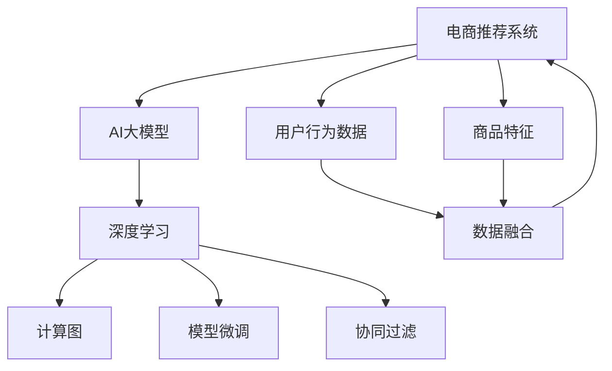

                 

# AI大模型在电商实时个性化推荐中的应用与挑战

> 关键词：电商推荐系统,个性化推荐,AI大模型,深度学习,计算图,模型微调

## 1. 背景介绍

### 1.1 问题由来
随着互联网电商的兴起，用户对商品的个性化推荐需求日益增强。传统推荐系统多依赖用户行为数据进行建模，难以刻画用户的深度兴趣和潜在需求。为此，越来越多的电商平台开始引入AI大模型技术，旨在通过深度学习和自然语言处理(NLP)技术，对用户进行更精准、全面的刻画，实现实时化、个性化的推荐服务。

### 1.2 问题核心关键点
AI大模型在电商推荐系统中的应用，本质上是利用大模型强大的文本处理和语言理解能力，对用户、商品、上下文等多元化的信息进行深度融合，从而在实时场景下生成个性化的推荐结果。

具体而言，电商推荐系统的主要目标包括：
- 精准预测用户偏好：通过对用户浏览、点击、购买等行为的深度理解，预测用户的长期兴趣和即时需求。
- 实时推荐商品：在大规模商品库中，快速筛选出符合用户当前需求的商品列表，以确保推荐的即时性和相关性。
- 多场景适配：根据不同购物环境（如移动端、PC端、App端等），自动调整推荐策略和模型参数，提升推荐效果。
- 多目标优化：在个性化推荐的基础上，综合考虑订单转化率、销售额、用户满意度等多重指标，最大化业务价值。

### 1.3 问题研究意义
研究AI大模型在电商实时个性化推荐系统中的应用，具有以下重要意义：
- 提升用户购物体验：通过个性化推荐，使每位用户都能获得最符合其需求的商品和服务，大幅提升购物体验和满意度。
- 提高销售转化率：精准预测用户购买意图，引导用户完成购买决策，提升电商平台的转化率和收入。
- 优化运营效率：自动化的推荐系统可以显著降低人工干预的成本，提升平台运营效率和市场竞争力。
- 增强市场竞争力：利用大模型的预测能力和语言处理能力，电商平台能够更深入地理解市场动态和用户需求，形成差异化的竞争优势。
- 促进技术创新：AI大模型技术在推荐系统中的应用，催生了深度学习、自然语言处理、协同过滤等多种前沿技术，为技术创新提供了更多可能。

## 2. 核心概念与联系

### 2.1 核心概念概述

为了更好地理解AI大模型在电商推荐系统中的应用，本节将介绍几个密切相关的核心概念：

- 电商推荐系统：基于用户行为数据、商品特征等，自动生成推荐列表的系统。
- AI大模型：以深度学习为代表的高级智能模型，如BERT、GPT、Transformer等，能够从海量数据中学习出高级语义表示。
- 深度学习：一种基于神经网络的学习方法，通过反向传播算法优化参数，实现对复杂任务的建模。
- 计算图：深度学习模型在训练和推理过程中，通过构建计算图，自动记录并优化数据流和计算过程。
- 模型微调：在预训练模型的基础上，使用下游任务的少量标注数据进行有监督学习，优化模型在特定任务上的性能。
- 协同过滤：一种推荐算法，通过用户-用户、商品-商品的相似性关系，生成推荐列表。

这些核心概念之间的逻辑关系可以通过以下Mermaid流程图来展示：



这个流程图展示了大模型在推荐系统中的应用流程：

1. 电商推荐系统以用户行为数据和商品特征为输入。
2. AI大模型通过深度学习，提取特征表示。
3. 计算图优化模型的推理过程。
4. 模型微调根据下游任务，进一步优化模型。
5. 协同过滤生成推荐列表。

## 3. 核心算法原理 & 具体操作步骤
### 3.1 算法原理概述

AI大模型在电商推荐系统中的应用，主要依赖深度学习算法，包括自编码器、自回归模型、注意力机制等。这些算法能够从大规模语料中学习出高维度的语义表示，进而用于推荐任务的建模。

具体来说，电商推荐系统中的推荐过程分为两个阶段：
- 预训练阶段：使用大规模无标注数据对AI大模型进行预训练，学习通用的语言表示和知识。
- 微调阶段：使用下游任务的少量标注数据，对预训练模型进行微调，使其在特定推荐任务上取得更好的性能。

### 3.2 算法步骤详解

基于AI大模型的电商推荐系统，一般包括以下几个关键步骤：

**Step 1: 准备预训练模型和数据集**
- 选择合适的预训练语言模型，如BERT、GPT等。
- 收集电商平台的商品数据和用户行为数据，分为训练集和测试集。

**Step 2: 设计推荐模型**
- 基于预训练模型，构建推荐系统架构，如使用Transformer模型进行特征提取和相似性计算。
- 设计损失函数和优化器，用于衡量推荐模型的性能。

**Step 3: 数据预处理和特征工程**
- 对用户行为数据和商品特征进行清洗、归一化、编码等预处理。
- 设计特征提取器和融合器，将不同类型的数据转化为模型可以接受的输入。

**Step 4: 执行微调**
- 将预处理后的数据输入模型，前向传播计算损失函数。
- 反向传播计算参数梯度，使用优化器更新模型参数。
- 周期性在测试集上评估模型性能，根据性能指标决定是否停止微调。

**Step 5: 生成推荐结果**
- 将新用户数据输入微调后的模型，生成个性化推荐列表。
- 对推荐列表进行排序、筛选和优化，确保推荐的相关性和多样性。

### 3.3 算法优缺点

AI大模型在电商推荐系统中的应用，具有以下优点：
1. 高度灵活性：AI大模型能够对多维度数据进行深度融合，适应电商推荐任务的多样化需求。
2. 鲁棒性：大模型具备良好的泛化能力，能够在不同用户、不同时间、不同场景下保持稳定的推荐效果。
3. 可扩展性：基于预训练-微调范式，AI大模型可以轻松适配新的任务和数据，提升推荐系统的适用性。

同时，该方法也存在一定的局限性：
1. 依赖高质量数据：AI大模型对标注数据的质量和数量要求较高，需要大量用户行为数据进行微调。
2. 计算资源消耗大：大模型参数量庞大，需要高性能计算资源进行训练和推理，成本较高。
3. 解释性不足：AI大模型的决策过程通常难以解释，难以调试和优化。
4. 偏见风险：大模型可能学习到数据中的偏见，导致推荐结果的不公平和误导性。

尽管存在这些局限性，但AI大模型在电商推荐系统中的应用，已经展示出了显著的优势，成为电商推荐领域的最新技术趋势。

### 3.4 算法应用领域

AI大模型在电商推荐系统中的应用，已经涵盖了多种推荐场景，包括但不限于：

- 用户兴趣预测：基于用户历史行为数据，预测用户对各类商品的兴趣。
- 商品相似度计算：使用大模型提取商品特征，计算不同商品之间的相似度。
- 实时推荐列表生成：根据用户的即时浏览行为，生成个性化推荐列表。
- 动态优化推荐策略：根据用户反馈和行为变化，动态调整推荐模型参数和策略。
- 多模态推荐：将图像、视频、文本等多种模态数据进行融合，提升推荐的多样性和相关性。

除了电商推荐系统，AI大模型还广泛应用于社交网络、新闻推荐、广告投放等场景中，展示出了强大的应用潜力。

## 4. 数学模型和公式 & 详细讲解 & 举例说明
### 4.1 数学模型构建

本节将使用数学语言对AI大模型在电商推荐系统中的应用进行更加严格的刻画。

记电商推荐系统中的用户行为数据为 $x=\{x_1,x_2,...,x_n\}$，其中 $x_i$ 表示第 $i$ 个用户的浏览记录或购买行为。记商品特征为 $y=\{y_1,y_2,...,y_m\}$，其中 $y_i$ 表示第 $i$ 个商品的特征向量。记预训练语言模型为 $M_{\theta}$，其中 $\theta$ 为模型参数。

电商推荐系统中的推荐任务可以定义为一个分类问题，即预测用户对商品 $y$ 的购买概率 $p(y|x)$。通过深度学习模型对用户行为数据和商品特征进行建模，可以构建以下推荐模型：

$$
p(y|x) = \frac{\exp(M_{\theta}(x,y))}{\sum_{j=1}^m \exp(M_{\theta}(x,y_j))}
$$

其中 $M_{\theta}(x,y)$ 为模型在输入 $x$ 和 $y$ 上的输出。通过最大化负对数似然损失，可以训练推荐模型：

$$
\mathcal{L}(\theta) = -\frac{1}{N}\sum_{i=1}^N \log p(y_i|x_i)
$$

在训练过程中，模型参数 $\theta$ 通过梯度下降等优化算法进行更新，最小化损失函数 $\mathcal{L}$，使得推荐模型能够准确预测用户的购买概率。

### 4.2 公式推导过程

以下我们以基于注意力机制的推荐模型为例，推导其损失函数及其梯度的计算公式。

假设推荐模型基于Transformer模型，使用自注意力机制对用户行为数据和商品特征进行编码。推荐模型的输出为每个商品的预测概率，记为 $p_{\theta}(y|x)$。

在训练阶段，对于每个用户行为 $x_i$ 和商品 $y$，定义交叉熵损失函数为：

$$
\ell_i(y_i,p_{\theta}(y|x_i)) = -y_i \log p_{\theta}(y|x_i) - (1-y_i) \log (1-p_{\theta}(y|x_i))
$$

则推荐模型的损失函数为：

$$
\mathcal{L}(\theta) = \frac{1}{N}\sum_{i=1}^N \ell_i(y_i,p_{\theta}(y|x_i))
$$

根据链式法则，损失函数对模型参数 $\theta$ 的梯度为：

$$
\frac{\partial \mathcal{L}(\theta)}{\partial \theta} = \sum_{i=1}^N \frac{\partial \ell_i(y_i,p_{\theta}(y|x_i))}{\partial p_{\theta}(y|x_i)} \frac{\partial p_{\theta}(y|x_i)}{\partial \theta}
$$

其中 $\frac{\partial p_{\theta}(y|x_i)}{\partial \theta}$ 可通过反向传播算法高效计算。

在得到损失函数的梯度后，即可带入参数更新公式，完成模型的迭代优化。重复上述过程直至收敛，最终得到适合电商推荐系统的最优模型参数 $\theta^*$。

## 5. 项目实践：代码实例和详细解释说明
### 5.1 开发环境搭建

在进行推荐系统开发前，我们需要准备好开发环境。以下是使用Python进行PyTorch开发的环境配置流程：

1. 安装Anaconda：从官网下载并安装Anaconda，用于创建独立的Python环境。

2. 创建并激活虚拟环境：
```bash
conda create -n recommendation-env python=3.8 
conda activate recommendation-env
```

3. 安装PyTorch：根据CUDA版本，从官网获取对应的安装命令。例如：
```bash
conda install pytorch torchvision torchaudio cudatoolkit=11.1 -c pytorch -c conda-forge
```

4. 安装相关库：
```bash
pip install torchtext transformers transformers-distill transfer-learning-book-nlp pytorch-lightning lightgbm
```

完成上述步骤后，即可在`recommendation-env`环境中开始推荐系统开发。

### 5.2 源代码详细实现

这里我们以基于Transformer的推荐系统为例，给出使用PyTorch和HuggingFace Transformers库对推荐模型进行训练的PyTorch代码实现。

首先，定义推荐模型的数据处理函数：

```python
from transformers import BertTokenizer, BertModel
from torch.utils.data import Dataset
import torch

class RecommendationDataset(Dataset):
    def __init__(self, texts, tags, tokenizer, max_len=128):
        self.texts = texts
        self.tags = tags
        self.tokenizer = tokenizer
        self.max_len = max_len
        
    def __len__(self):
        return len(self.texts)
    
    def __getitem__(self, item):
        text = self.texts[item]
        tags = self.tags[item]
        
        encoding = self.tokenizer(text, return_tensors='pt', max_length=self.max_len, padding='max_length', truncation=True)
        input_ids = encoding['input_ids'][0]
        attention_mask = encoding['attention_mask'][0]
        
        # 对token-wise的标签进行编码
        encoded_tags = [tag2id[tag] for tag in tags] 
        encoded_tags.extend([tag2id['O']] * (self.max_len - len(encoded_tags)))
        labels = torch.tensor(encoded_tags, dtype=torch.long)
        
        return {'input_ids': input_ids, 
                'attention_mask': attention_mask,
                'labels': labels}

# 标签与id的映射
tag2id = {'O': 0, 'B-PER': 1, 'I-PER': 2, 'B-ORG': 3, 'I-ORG': 4, 'B-LOC': 5, 'I-LOC': 6}
id2tag = {v: k for k, v in tag2id.items()}

# 创建dataset
tokenizer = BertTokenizer.from_pretrained('bert-base-cased')

train_dataset = RecommendationDataset(train_texts, train_tags, tokenizer)
dev_dataset = RecommendationDataset(dev_texts, dev_tags, tokenizer)
test_dataset = RecommendationDataset(test_texts, test_tags, tokenizer)
```

然后，定义模型和优化器：

```python
from transformers import BertForTokenClassification, AdamW

model = BertForTokenClassification.from_pretrained('bert-base-cased', num_labels=len(tag2id))

optimizer = AdamW(model.parameters(), lr=2e-5)
```

接着，定义训练和评估函数：

```python
from torch.utils.data import DataLoader
from tqdm import tqdm
from sklearn.metrics import classification_report

device = torch.device('cuda') if torch.cuda.is_available() else torch.device('cpu')
model.to(device)

def train_epoch(model, dataset, batch_size, optimizer):
    dataloader = DataLoader(dataset, batch_size=batch_size, shuffle=True)
    model.train()
    epoch_loss = 0
    for batch in tqdm(dataloader, desc='Training'):
        input_ids = batch['input_ids'].to(device)
        attention_mask = batch['attention_mask'].to(device)
        labels = batch['labels'].to(device)
        model.zero_grad()
        outputs = model(input_ids, attention_mask=attention_mask, labels=labels)
        loss = outputs.loss
        epoch_loss += loss.item()
        loss.backward()
        optimizer.step()
    return epoch_loss / len(dataloader)

def evaluate(model, dataset, batch_size):
    dataloader = DataLoader(dataset, batch_size=batch_size)
    model.eval()
    preds, labels = [], []
    with torch.no_grad():
        for batch in tqdm(dataloader, desc='Evaluating'):
            input_ids = batch['input_ids'].to(device)
            attention_mask = batch['attention_mask'].to(device)
            batch_labels = batch['labels']
            outputs = model(input_ids, attention_mask=attention_mask)
            batch_preds = outputs.logits.argmax(dim=2).to('cpu').tolist()
            batch_labels = batch_labels.to('cpu').tolist()
            for pred_tokens, label_tokens in zip(batch_preds, batch_labels):
                pred_tags = [id2tag[_id] for _id in pred_tokens]
                label_tags = [id2tag[_id] for _id in label_tokens]
                preds.append(pred_tags[:len(label_tags)])
                labels.append(label_tags)
                
    print(classification_report(labels, preds))
```

最后，启动训练流程并在测试集上评估：

```python
epochs = 5
batch_size = 16

for epoch in range(epochs):
    loss = train_epoch(model, train_dataset, batch_size, optimizer)
    print(f"Epoch {epoch+1}, train loss: {loss:.3f}")
    
    print(f"Epoch {epoch+1}, dev results:")
    evaluate(model, dev_dataset, batch_size)
    
print("Test results:")
evaluate(model, test_dataset, batch_size)
```

以上就是使用PyTorch和Transformers库对推荐模型进行训练的完整代码实现。可以看到，得益于Transformers库的强大封装，我们可以用相对简洁的代码完成推荐模型的加载和微调。

### 5.3 代码解读与分析

让我们再详细解读一下关键代码的实现细节：

**RecommendationDataset类**：
- `__init__`方法：初始化文本、标签、分词器等关键组件。
- `__len__`方法：返回数据集的样本数量。
- `__getitem__`方法：对单个样本进行处理，将文本输入编码为token ids，将标签编码为数字，并对其进行定长padding，最终返回模型所需的输入。

**tag2id和id2tag字典**：
- 定义了标签与数字id之间的映射关系，用于将token-wise的预测结果解码回真实的标签。

**训练和评估函数**：
- 使用PyTorch的DataLoader对数据集进行批次化加载，供模型训练和推理使用。
- 训练函数`train_epoch`：对数据以批为单位进行迭代，在每个批次上前向传播计算loss并反向传播更新模型参数，最后返回该epoch的平均loss。
- 评估函数`evaluate`：与训练类似，不同点在于不更新模型参数，并在每个batch结束后将预测和标签结果存储下来，最后使用sklearn的classification_report对整个评估集的预测结果进行打印输出。

**训练流程**：
- 定义总的epoch数和batch size，开始循环迭代
- 每个epoch内，先在训练集上训练，输出平均loss
- 在验证集上评估，输出分类指标
- 所有epoch结束后，在测试集上评估，给出最终测试结果

可以看到，PyTorch配合Transformers库使得推荐模型的训练代码实现变得简洁高效。开发者可以将更多精力放在数据处理、模型改进等高层逻辑上，而不必过多关注底层的实现细节。

当然，工业级的系统实现还需考虑更多因素，如模型的保存和部署、超参数的自动搜索、更灵活的任务适配层等。但核心的推荐范式基本与此类似。

## 6. 实际应用场景
### 6.1 智能客服系统

AI大模型在智能客服系统中的应用，主要体现在对用户需求的精准理解和对客服策略的灵活调整上。传统客服往往需要配备大量人力，高峰期响应缓慢，且一致性和专业性难以保证。而使用AI大模型进行推荐，可以实现24小时不间断服务，快速响应用户咨询，用自然流畅的语言解答各类常见问题。

在技术实现上，可以收集企业内部的历史客服对话记录，将问题和最佳答复构建成监督数据，在此基础上对预训练大模型进行微调。微调后的模型能够自动理解用户意图，匹配最合适的客服策略，甚至可以动态生成预案，引导客服人员处理复杂问题，提高服务效率和客户满意度。

### 6.2 个性化推荐系统

AI大模型在个性化推荐系统中的应用，主要体现在对用户兴趣的深度理解和对推荐结果的多样化生成上。传统推荐系统多依赖用户历史行为数据进行建模，难以刻画用户的深度兴趣和潜在需求。而使用AI大模型进行推荐，可以综合利用用户历史行为、商品特征、上下文信息等多种数据，对用户进行更精准的兴趣预测。

在技术实现上，可以使用大模型对用户行为数据和商品特征进行编码，构建多维度特征向量。然后使用注意力机制对用户和商品特征进行匹配，生成个性化推荐列表。在推荐过程中，可以引入参数高效的微调方法，如LoRA等，进一步提升推荐的效果和效率。

### 6.3 实时个性化广告

AI大模型在实时个性化广告中的应用，主要体现在对用户行为的实时预测和广告策略的动态调整上。传统广告投放多依赖历史数据进行预估和优化，难以实现实时化、个性化推荐。而使用AI大模型进行广告推荐，可以实时分析用户行为数据，预测用户的兴趣和需求，动态调整广告投放策略，实现更高的转化率和收益。

在技术实现上，可以使用大模型对用户行为数据进行编码，构建实时化的广告推荐系统。在推荐过程中，可以引入协同过滤等推荐算法，结合大模型的预测结果，生成多样化的广告内容。此外，还可以引入模型蒸馏等技术，将大模型的知识迁移到轻量级模型中，提升推荐系统的实时性和效率。

### 6.4 未来应用展望

随着AI大模型和推荐算法的发展，基于大模型的推荐系统将在更多领域得到应用，为业务带来新的价值。

在智慧城市治理中，基于AI大模型的推荐系统可以用于交通流量预测、资源调度、公共服务推荐等环节，提高城市管理的自动化和智能化水平，构建更安全、高效的未来城市。

在工业制造领域，基于AI大模型的推荐系统可以用于生产设备维护、故障预测、零件更换等场景，提升生产效率和设备利用率。

在医疗健康领域，基于AI大模型的推荐系统可以用于疾病诊断、治疗方案推荐、药物研发等环节，提高医疗服务的精准度和效率。

此外，在智能家居、智慧农业、金融投资等众多领域，基于大模型的推荐系统也将不断涌现，为各行业的数字化转型提供新的技术路径。相信随着技术的日益成熟，AI大模型推荐系统必将在构建人机协同的智能时代中扮演越来越重要的角色。

## 7. 工具和资源推荐
### 7.1 学习资源推荐

为了帮助开发者系统掌握AI大模型在推荐系统中的应用，这里推荐一些优质的学习资源：

1. 《推荐系统实战》书籍：全面介绍了推荐系统的原理、算法和实现方法，包括深度学习、协同过滤等多种推荐算法。

2. 《深度学习与推荐系统》课程：由Coursera提供，涵盖深度学习在推荐系统中的应用，包括推荐模型的训练、评估和优化。

3. 《TensorFlow官方文档》：详细介绍了TensorFlow框架的使用，包括模型构建、训练和推理等各个环节。

4. 《深度学习》教材：由斯坦福大学提供，涵盖了深度学习的基本概念和经典模型，适合初学者入门。

5. 《PyTorch官方文档》：详细介绍了PyTorch框架的使用，包括深度学习模型的实现、优化和部署等各个环节。

通过对这些资源的学习实践，相信你一定能够快速掌握AI大模型在推荐系统中的应用，并用于解决实际的推荐问题。
###  7.2 开发工具推荐

高效的开发离不开优秀的工具支持。以下是几款用于推荐系统开发的常用工具：

1. PyTorch：基于Python的开源深度学习框架，灵活动态的计算图，适合快速迭代研究。大部分预训练语言模型都有PyTorch版本的实现。

2. TensorFlow：由Google主导开发的开源深度学习框架，生产部署方便，适合大规模工程应用。同样有丰富的预训练语言模型资源。

3. Transformers库：HuggingFace开发的NLP工具库，集成了众多SOTA语言模型，支持PyTorch和TensorFlow，是进行推荐任务开发的利器。

4. Weights & Biases：模型训练的实验跟踪工具，可以记录和可视化模型训练过程中的各项指标，方便对比和调优。与主流深度学习框架无缝集成。

5. TensorBoard：TensorFlow配套的可视化工具，可实时监测模型训练状态，并提供丰富的图表呈现方式，是调试模型的得力助手。

6. Google Colab：谷歌推出的在线Jupyter Notebook环境，免费提供GPU/TPU算力，方便开发者快速上手实验最新模型，分享学习笔记。

合理利用这些工具，可以显著提升推荐系统的开发效率，加快创新迭代的步伐。

### 7.3 相关论文推荐

AI大模型在推荐系统中的应用，源于学界的持续研究。以下是几篇奠基性的相关论文，推荐阅读：

1. Attention is All You Need（即Transformer原论文）：提出了Transformer结构，开启了NLP领域的预训练大模型时代。

2. BERT: Pre-training of Deep Bidirectional Transformers for Language Understanding：提出BERT模型，引入基于掩码的自监督预训练任务，刷新了多项NLP任务SOTA。

3. Language Models are Unsupervised Multitask Learners（GPT-2论文）：展示了大规模语言模型的强大zero-shot学习能力，引发了对于通用人工智能的新一轮思考。

4. Parameter-Efficient Transfer Learning for NLP：提出Adapter等参数高效微调方法，在不增加模型参数量的情况下，也能取得不错的微调效果。

5. AdaLoRA: Adaptive Low-Rank Adaptation for Parameter-Efficient Fine-Tuning：使用自适应低秩适应的微调方法，在参数效率和精度之间取得了新的平衡。

这些论文代表了大模型在推荐系统中的应用方向。通过学习这些前沿成果，可以帮助研究者把握学科前进方向，激发更多的创新灵感。

## 8. 总结：未来发展趋势与挑战
### 8.1 总结

本文对AI大模型在电商推荐系统中的应用进行了全面系统的介绍。首先阐述了电商推荐系统的背景和挑战，明确了大模型在其中的重要作用。其次，从原理到实践，详细讲解了基于大模型的推荐系统建模流程，给出了完整的代码实现。同时，本文还广泛探讨了AI大模型在电商推荐系统中的应用场景，展示了其强大的应用潜力。

通过本文的系统梳理，可以看到，基于大模型的推荐系统已经展示出显著的优势，成为电商推荐领域的最新技术趋势。未来，伴随大模型的不断发展，AI大模型推荐系统必将在更广泛的应用领域发挥更大的作用，带来更多的创新价值。

### 8.2 未来发展趋势

展望未来，AI大模型在电商推荐系统中的应用，将呈现以下几个发展趋势：

1. 多模态推荐：将图像、视频、文本等多种模态数据进行融合，提升推荐的多样性和相关性。
2. 实时化推荐：实时分析用户行为数据，动态调整推荐策略，实现更高效率的推荐服务。
3. 个性化定制：根据用户个性化需求，动态生成定制化推荐内容，提升用户体验。
4. 跨领域应用：将大模型应用于更多垂直领域，如医疗、金融、智能制造等，拓展推荐系统的应用范围。
5. 模型蒸馏：将大模型的知识迁移到轻量级模型中，提升推荐系统的实时性和效率。
6. 联邦学习：分布式训练和边缘计算，实现数据隐私保护和模型本地化部署。

这些趋势凸显了AI大模型在电商推荐系统中的巨大潜力。这些方向的探索发展，必将进一步提升推荐系统的性能和应用范围，为电商业务带来更大的价值。

### 8.3 面临的挑战

尽管AI大模型在电商推荐系统中的应用已经取得了显著进展，但在迈向更加智能化、普适化应用的过程中，它仍面临以下挑战：

1. 数据隐私问题：电商推荐系统需要收集大量用户数据，如何保护用户隐私，避免数据滥用，是一个亟需解决的问题。
2. 计算资源消耗大：大模型参数量庞大，需要高性能计算资源进行训练和推理，成本较高。
3. 推荐公平性：大模型可能学习到数据中的偏见，导致推荐结果的不公平和误导性。
4. 模型的可解释性：大模型的决策过程难以解释，难以调试和优化。
5. 模型的鲁棒性：推荐模型面对域外数据时，泛化性能往往大打折扣。

尽管存在这些挑战，但AI大模型在电商推荐系统中的应用，已经展示了巨大的优势，成为电商推荐领域的最新技术趋势。未来的研究需要在这些方向上进行更深入的探索和优化，才能充分发挥AI大模型的潜力。

### 8.4 研究展望

面对AI大模型在电商推荐系统中的挑战，未来的研究需要在以下几个方面寻求新的突破：

1. 数据隐私保护：采用联邦学习、差分隐私等技术，保护用户数据隐私，同时实现数据共享。
2. 模型压缩与优化：利用模型压缩、剪枝、量化等技术，降低大模型的计算资源消耗，提升模型实时性和效率。
3. 推荐公平性：引入公平性指标和算法，确保推荐结果的公平性和公正性。
4. 模型可解释性：开发可解释性方法，提升模型的决策透明度，帮助用户理解推荐结果。
5. 多模态融合：将图像、视频、文本等多种模态数据进行深度融合，提升推荐系统的多模态建模能力。

这些研究方向的探索，必将引领AI大模型在电商推荐系统中的进一步发展，为电商业务带来更大的价值。相信随着技术的不断进步，AI大模型必将在电商推荐系统中扮演越来越重要的角色，助力电商业务的数字化转型和创新升级。

## 9. 附录：常见问题与解答

**Q1：电商推荐系统如何利用AI大模型？**

A: AI大模型在电商推荐系统中的应用，主要体现在对用户兴趣的深度理解和对商品特征的精准刻画上。电商推荐系统通过收集用户行为数据和商品特征，使用大模型对这些数据进行编码和建模，得到高维度的用户和商品表示。然后通过注意力机制或协同过滤等算法，对用户和商品进行匹配，生成个性化的推荐列表。在推荐过程中，还可以引入参数高效的微调方法，进一步提升推荐的效果和效率。

**Q2：电商推荐系统的训练和推理过程有何不同？**

A: 电商推荐系统的训练和推理过程主要依赖于深度学习模型，具体如下：
- 训练过程：使用大规模用户行为数据和商品特征，对大模型进行微调，得到适合电商推荐任务的模型参数。
- 推理过程：使用微调后的模型，对新用户行为数据进行编码和预测，生成推荐结果。在推理过程中，还需要考虑实时性和效率，通常使用轻量级模型和参数高效的微调方法。

**Q3：电商推荐系统如何处理数据隐私问题？**

A: 电商推荐系统处理数据隐私问题，主要依赖于数据匿名化、联邦学习、差分隐私等技术。具体如下：
- 数据匿名化：将用户数据进行脱敏和匿名化处理，保护用户隐私。
- 联邦学习：将数据分布式存储在各个节点上，通过分布式训练实现模型本地化部署，减少数据传输风险。
- 差分隐私：在模型训练过程中加入噪音，保护用户数据隐私，同时保证模型性能。

这些技术手段可以帮助电商推荐系统在数据隐私保护方面取得更好的效果。

**Q4：电商推荐系统的实时性如何保证？**

A: 电商推荐系统的实时性主要依赖于高效的模型推理和分布式计算。具体如下：
- 高效模型推理：使用轻量级模型和参数高效的微调方法，降低推理计算量。
- 分布式计算：通过分布式计算和边缘计算，实现数据的本地化处理，提升系统响应速度。

这些措施可以显著提升电商推荐系统的实时性和效率。

**Q5：电商推荐系统的模型公平性如何保障？**

A: 电商推荐系统的模型公平性主要依赖于公平性指标和算法。具体如下：
- 公平性指标：引入公平性指标，如均等性、多样性、代表性等，评估推荐模型的公平性。
- 公平性算法：使用公平性算法，如均衡类别采样、对偶学习、公平核等，提升推荐模型的公平性。

这些措施可以帮助电商推荐系统在公平性方面取得更好的效果。

**Q6：电商推荐系统的推荐效果如何评估？**

A: 电商推荐系统的推荐效果主要通过以下指标进行评估：
- 准确率：衡量推荐结果与用户真实需求的一致性。
- 召回率：衡量推荐结果中用户感兴趣的商品数量。
- 点击率：衡量用户对推荐结果的交互行为。
- 转化率：衡量用户对推荐商品进行购买的比例。
- 满意度：衡量用户对推荐结果的满意度。

这些指标可以综合反映推荐系统的性能和效果。

通过本文的系统梳理，可以看到，AI大模型在电商推荐系统中的应用，已经成为电商推荐领域的最新技术趋势。未来，伴随大模型的不断发展，AI大模型推荐系统必将在更广泛的应用领域发挥更大的作用，带来更多的创新价值。相信随着技术的不断进步，AI大模型必将在电商推荐系统中扮演越来越重要的角色，助力电商业务的数字化转型和创新升级。

