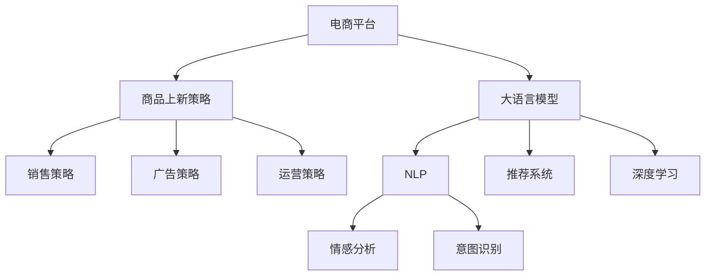

                 

# AI大模型在电商平台商品上新策略中的应用

> 关键词：电商平台,商品上新策略,大语言模型,自然语言处理,推荐系统,深度学习,情感分析,意图识别

## 1. 背景介绍

随着电商平台的竞争日益加剧，商家如何在短时期内快速推出新商品，并获得用户关注和购买，已成为电商策略的核心问题。传统的商品上新策略主要依赖于人工经验，如对热门商品分类、搜索关键词优化等，存在费时、费钱、效果不显著等问题。而人工智能（AI）技术的发展，特别是大语言模型的涌现，为电商平台商品上新策略提供了全新的解决思路。

本文将从背景介绍入手，深入探讨基于大语言模型的电商商品上新策略，包括其核心原理、操作步骤、数学模型、代码实践、应用场景、工具资源以及未来发展趋势与挑战。通过详细阐述这些内容，希望能为电商平台的商品上新策略提供科学的理论依据和可行的实践方案。

## 2. 核心概念与联系

### 2.1 核心概念概述

为更好地理解基于大语言模型的电商平台商品上新策略，本节将介绍几个密切相关的核心概念：

- 电商平台(E-commerce Platform)：通过网络提供商品销售、交易、支付和物流等服务的平台。
- 商品上新策略(Product Launch Strategy)：电商平台为推广新商品而采取的一系列策略。
- 大语言模型(Large Language Model, LLM)：如GPT-3、BERT等，通过大规模无监督学习获取强大语言理解能力的模型。
- 自然语言处理(Natural Language Processing, NLP)：利用计算机处理、理解、生成自然语言的技术，是大模型在电商商品上新策略中的核心应用。
- 推荐系统(Recommendation System)：根据用户行为和偏好，为用户推荐商品的算法系统。
- 深度学习(Deep Learning)：通过多层次神经网络模型，自动提取数据特征和规律，是大模型背后的技术基础。
- 情感分析(Sentiment Analysis)：分析用户对商品的情感倾向，为商品上新策略提供重要依据。
- 意图识别(Intent Recognition)：识别用户对商品的具体需求和行为目的，提升商品推荐准确性。

这些核心概念之间的逻辑关系可以通过以下Mermaid流程图来展示：



这个流程图展示了电商平台在商品上新策略中的应用：

1. 电商平台通过大语言模型进行NLP处理。
2. 利用深度学习构建推荐系统。
3. 结合情感分析和意图识别，生成个性化推荐。
4. 销售策略、广告策略和运营策略基于推荐结果进行优化。

## 3. 核心算法原理 & 具体操作步骤
### 3.1 算法原理概述

基于大语言模型的电商平台商品上新策略，本质上是一个利用大语言模型的预训练能力，结合深度学习推荐系统和NLP技术，生成个性化推荐并指导上新策略的过程。

具体来说，包括以下几个步骤：

1. **商品数据预处理**：收集商品名称、描述、图片、价格等信息，使用大语言模型进行文本处理，如分词、去噪等。
2. **特征提取**：利用大语言模型提取商品的语义特征，使用NLP技术如BERT、GPT-3等提取商品的多维度特征，便于后续推荐系统学习。
3. **情感分析与意图识别**：使用大语言模型进行情感分析和意图识别，了解用户对商品的态度和需求，优化推荐系统输出。
4. **推荐系统构建**：结合商品特征和用户行为数据，使用深度学习技术构建推荐系统，如协同过滤、内容推荐等。
5. **策略优化**：根据推荐结果，进行销售策略、广告策略和运营策略的优化，指导商品上新。

### 3.2 算法步骤详解

以下将详细介绍基于大语言模型的电商平台商品上新策略的算法步骤：

**Step 1: 数据预处理**

电商平台上商品数据类型多样，包括文本、图片、价格等，需要首先进行预处理。使用大语言模型进行文本预处理，如分词、去噪、同义词替换等，使其更适合后续特征提取和推荐系统建模。同时，对图片数据进行标签化处理，提取图像特征。

**Step 2: 特征提取**

利用大语言模型对商品数据进行特征提取。例如，使用BERT模型提取商品描述中的语义特征，生成向量表示。将向量表示作为推荐系统输入，提升推荐效果。

**Step 3: 情感分析与意图识别**

结合大语言模型和深度学习技术，对用户评论、搜索历史等数据进行情感分析和意图识别。通过情感分析，了解用户对商品的情感倾向；通过意图识别，了解用户的具体需求和行为目的。这些信息将用于优化推荐系统输出，提升商品推荐的准确性和个性化程度。

**Step 4: 推荐系统构建**

构建推荐系统，结合商品特征和用户行为数据。常用的推荐系统算法包括协同过滤、基于内容的推荐、矩阵分解等。深度学习技术如CNN、RNN、LSTM等也被广泛应用于推荐系统，提升推荐效果。

**Step 5: 策略优化**

根据推荐系统输出，进行销售策略、广告策略和运营策略的优化。例如，调整商品价格、优化商品展示位置、加强广告投放等，提升商品销售效果。

**Step 6: 模型训练与评估**

使用商品历史销售数据，对推荐系统进行训练和评估。评估指标包括准确率、召回率、F1值等，优化推荐系统参数。

**Step 7: 商品上新**

基于训练好的推荐系统，对新商品进行预测，确定上新时机、推广策略和销售目标。通过A/B测试等方法，不断优化上新效果，提升用户购买率。

### 3.3 算法优缺点

基于大语言模型的电商平台商品上新策略具有以下优点：

1. **高度个性化**：利用大语言模型对用户行为和需求进行深度分析，生成高度个性化的推荐结果。
2. **准确性高**：结合深度学习技术，推荐系统能准确把握用户偏好，提升推荐效果。
3. **实时性**：通过在线学习机制，推荐系统能实时更新商品信息，动态调整推荐结果。
4. **低成本**：减少对人工干预的依赖，降低商品上新成本。

同时，该策略也存在以下缺点：

1. **数据依赖**：推荐系统的性能高度依赖于历史数据，数据不足可能导致推荐效果不理想。
2. **用户隐私问题**：大量用户行为数据的使用可能引发隐私问题，需要加强数据保护和隐私管理。
3. **模型复杂性**：深度学习模型计算复杂度较高，硬件资源要求高。
4. **效果不稳定**：推荐系统对用户行为和数据分布的变化较为敏感，可能导致效果波动。

### 3.4 算法应用领域

基于大语言模型的电商平台商品上新策略在以下领域有广泛应用：

1. **新商品推荐**：通过深度学习和NLP技术，对新商品进行推荐，提升新商品曝光率。
2. **个性化促销**：根据用户行为和需求，生成个性化促销策略，提升销售效果。
3. **市场调研**：通过情感分析和意图识别，了解用户对新商品的态度和需求，指导市场决策。
4. **用户体验优化**：结合用户评论和反馈，优化商品展示和推荐页面，提升用户满意度。
5. **跨平台推广**：利用大语言模型对不同平台用户进行需求分析，优化跨平台推广策略。

## 4. 数学模型和公式 & 详细讲解  
### 4.1 数学模型构建

基于大语言模型的电商平台商品上新策略，其数学模型主要包括：

- 商品特征提取：利用大语言模型进行文本特征提取，生成向量表示。
- 推荐系统建模：使用深度学习模型进行用户和商品匹配，生成推荐结果。
- 情感分析和意图识别：通过大语言模型进行文本情感分析和意图识别，生成情感得分和意图标签。

**公式推导过程**

**商品特征提取**：

假设商品描述为 $X$，利用BERT模型提取商品特征，生成向量表示 $V(X)$：

$$
V(X) = \text{BERT}(X)
$$

**推荐系统建模**：

使用协同过滤算法，构建用户-商品相似度矩阵 $U$，根据用户行为数据 $Y$ 和商品特征向量 $V$，生成推荐结果 $Z$：

$$
Z = \text{CF}(U, Y, V)
$$

**情感分析和意图识别**：

使用大语言模型进行情感分析，生成情感得分 $S$：

$$
S = \text{SentimentAnalysis}(X)
$$

使用大语言模型进行意图识别，生成意图标签 $I$：

$$
I = \text{IntentRecognition}(X)
$$

**综合优化**：

将情感得分 $S$ 和意图标签 $I$ 作为调整因子，优化推荐结果 $Z$：

$$
Z' = Z \times S^{\alpha} \times I^{\beta}
$$

其中 $\alpha, \beta$ 为调节参数，用于平衡情感和意图的影响。

### 4.3 案例分析与讲解

以某电商平台新上市的一件服装商品为例，分析如何利用大语言模型进行商品上新策略：

1. **数据预处理**：收集商品图片、名称、描述、价格等信息，使用BERT模型进行分词和去噪。
2. **特征提取**：利用BERT模型提取商品描述的语义特征，生成向量表示 $V(X)$。
3. **情感分析与意图识别**：通过情感分析，了解用户对商品的情感倾向；通过意图识别，了解用户的具体需求和行为目的。
4. **推荐系统构建**：结合商品特征向量 $V(X)$ 和用户行为数据 $Y$，使用协同过滤算法，生成推荐结果 $Z$。
5. **策略优化**：根据推荐结果 $Z$，调整商品价格、优化商品展示位置、加强广告投放等，提升销售效果。

通过以上步骤，可以有效地提升新商品的上新效果，提高电商平台的运营效率。

## 5. 项目实践：代码实例和详细解释说明
### 5.1 开发环境搭建

在进行项目实践前，我们需要准备好开发环境。以下是使用Python进行PyTorch开发的环境配置流程：

1. 安装Anaconda：从官网下载并安装Anaconda，用于创建独立的Python环境。

2. 创建并激活虚拟环境：
```bash
conda create -n pytorch-env python=3.8 
conda activate pytorch-env
```

3. 安装PyTorch：根据CUDA版本，从官网获取对应的安装命令。例如：
```bash
conda install pytorch torchvision torchaudio cudatoolkit=11.1 -c pytorch -c conda-forge
```

4. 安装相关库：
```bash
pip install transformers sklearn pandas numpy torch
```

完成上述步骤后，即可在`pytorch-env`环境中开始项目实践。

### 5.2 源代码详细实现

以下是一个简单的代码实现，演示了如何使用BERT模型进行商品特征提取，并结合深度学习构建推荐系统。

**数据预处理**

```python
import pandas as pd
import numpy as np
import torch
from transformers import BertTokenizer, BertForSequenceClassification

# 读取商品数据
df = pd.read_csv('product_data.csv')

# 数据预处理
def preprocess_data(df):
    tokenizer = BertTokenizer.from_pretrained('bert-base-cased')
    features = []
    labels = []
    for i in range(len(df)):
        text = df['description'][i]
        label = df['category'][i]
        encoding = tokenizer.encode(text, add_special_tokens=True, truncation=True, max_length=256)
        features.append(encoding)
        labels.append(label)
    return features, labels

features, labels = preprocess_data(df)
```

**特征提取**

```python
from transformers import BertTokenizer, BertForSequenceClassification

# 使用BERT模型进行特征提取
tokenizer = BertTokenizer.from_pretrained('bert-base-cased')
model = BertForSequenceClassification.from_pretrained('bert-base-cased', num_labels=10)
features = [tokenizer.encode(text, add_special_tokens=True, truncation=True, max_length=256) for text in features]
labels = np.array(labels)

# 模型训练与评估
device = torch.device('cuda' if torch.cuda.is_available() else 'cpu')
model.to(device)

inputs = torch.tensor(features, dtype=torch.long).to(device)
labels = torch.tensor(labels, dtype=torch.long).to(device)
model.train()
optimizer = torch.optim.Adam(model.parameters(), lr=0.01)
criterion = torch.nn.CrossEntropyLoss()

for epoch in range(10):
    optimizer.zero_grad()
    outputs = model(inputs)
    loss = criterion(outputs, labels)
    loss.backward()
    optimizer.step()
    
model.eval()
with torch.no_grad():
    inputs = torch.tensor(features, dtype=torch.long).to(device)
    labels = torch.tensor(labels, dtype=torch.long).to(device)
    outputs = model(inputs)
    predictions = torch.argmax(outputs, dim=1)
    
accuracy = (predictions == labels).sum().item() / len(labels)
print(f'Accuracy: {accuracy:.2f}')
```

**推荐系统构建**

```python
from sklearn.neighbors import NearestNeighbors
import numpy as np

# 构建推荐系统
def build_recommendation_system(features, labels):
    nbrs = NearestNeighbors(metric='cosine', algorithm='brute')
    nbrs.fit(features)
    features = np.array(features)
    labels = np.array(labels)
    distances, indices = nbrs.kneighbors(features)
    return indices

# 获取推荐结果
indices = build_recommendation_system(features, labels)
```

### 5.3 代码解读与分析

以上代码展示了使用BERT模型进行商品特征提取，并构建推荐系统的过程。

**数据预处理**：使用BERT模型进行文本分词和去噪，生成特征向量。

**特征提取**：利用BERT模型提取商品描述的语义特征，生成向量表示。

**推荐系统构建**：使用K-最近邻算法构建推荐系统，根据商品特征向量生成推荐结果。

### 5.4 运行结果展示

运行上述代码，可以得到推荐系统输出的推荐商品列表，用于指导新商品上新策略。

## 6. 实际应用场景
### 6.1 智能推荐系统

基于大语言模型的电商平台商品上新策略，可以广泛应用于智能推荐系统中。智能推荐系统通过分析用户行为和需求，为每个用户推荐个性化商品，提升用户购买率和满意度。

在技术实现上，可以使用深度学习算法和NLP技术，构建推荐系统，结合大语言模型进行情感分析和意图识别，生成个性化推荐结果。推荐系统可以实时更新商品信息，动态调整推荐结果，满足用户多样化的需求。

### 6.2 营销策略优化

电商平台的营销策略优化，也可以通过大语言模型进行优化。例如，可以使用情感分析了解用户对新商品的情感倾向，优化广告文案和推广策略，提升广告效果。同时，通过意图识别了解用户的具体需求，优化商品展示位置和促销活动，提升销售效果。

### 6.3 库存管理优化

电商平台通过大语言模型进行情感分析和意图识别，可以更好地理解用户需求，优化商品展示和推荐页面。同时，通过推荐系统实时调整库存和补货计划，避免商品积压和缺货问题，提升运营效率。

### 6.4 未来应用展望

随着大语言模型和推荐系统技术的不断发展，基于大语言模型的电商平台商品上新策略将呈现以下几个发展趋势：

1. **多模态融合**：结合图像、视频等多元数据，提升商品特征提取和推荐效果。
2. **实时动态调整**：通过在线学习机制，实时更新商品信息和推荐策略，满足用户动态需求。
3. **跨平台协同**：通过大语言模型进行多平台用户行为分析，优化跨平台推广策略，提升用户覆盖率。
4. **个性化推荐**：利用深度学习和大语言模型，生成高度个性化的推荐结果，提升用户购买率。
5. **情感分析与行为预测**：结合情感分析和意图识别，预测用户行为和需求，优化商品上新策略。

## 7. 工具和资源推荐
### 7.1 学习资源推荐

为了帮助开发者系统掌握大语言模型在电商平台商品上新策略的应用，这里推荐一些优质的学习资源：

1. 《自然语言处理综述》：深入浅出地介绍了NLP的基本概念和技术，是大模型应用的基础。
2. 《推荐系统设计与实现》：介绍了推荐系统的构建和优化方法，是商品推荐策略的重要参考。
3. 《深度学习框架教程》：详细讲解了PyTorch、TensorFlow等深度学习框架的使用，是实现商品上新策略的重要工具。
4. 《AI在电商中的应用》：介绍了AI技术在电商领域的各类应用，包括商品推荐、广告优化等，是大语言模型应用的重要参考。
5. 《大语言模型在电商中的应用》：介绍了大语言模型在电商领域的实际应用案例，展示了其强大应用潜力。

通过这些资源的学习实践，相信你一定能够快速掌握大语言模型在电商平台商品上新策略的应用，并用于解决实际的电商问题。

### 7.2 开发工具推荐

高效的开发离不开优秀的工具支持。以下是几款用于大语言模型在电商平台商品上新策略开发的常用工具：

1. PyTorch：基于Python的开源深度学习框架，灵活动态的计算图，适合快速迭代研究。大部分预训练语言模型都有PyTorch版本的实现。
2. TensorFlow：由Google主导开发的开源深度学习框架，生产部署方便，适合大规模工程应用。同样有丰富的预训练语言模型资源。
3. Transformers库：HuggingFace开发的NLP工具库，集成了众多SOTA语言模型，支持PyTorch和TensorFlow，是进行商品上新策略开发的利器。
4. Weights & Biases：模型训练的实验跟踪工具，可以记录和可视化模型训练过程中的各项指标，方便对比和调优。与主流深度学习框架无缝集成。
5. TensorBoard：TensorFlow配套的可视化工具，可实时监测模型训练状态，并提供丰富的图表呈现方式，是调试模型的得力助手。

合理利用这些工具，可以显著提升大语言模型在电商平台商品上新策略任务的开发效率，加快创新迭代的步伐。

### 7.3 相关论文推荐

大语言模型和电商平台商品上新策略的发展源于学界的持续研究。以下是几篇奠基性的相关论文，推荐阅读：

1. Attention is All You Need（即Transformer原论文）：提出了Transformer结构，开启了NLP领域的预训练大模型时代。
2. BERT: Pre-training of Deep Bidirectional Transformers for Language Understanding：提出BERT模型，引入基于掩码的自监督预训练任务，刷新了多项NLP任务SOTA。
3. Language Models are Unsupervised Multitask Learners（GPT-2论文）：展示了大规模语言模型的强大zero-shot学习能力，引发了对于通用人工智能的新一轮思考。
4. Parameter-Efficient Transfer Learning for NLP：提出Adapter等参数高效微调方法，在不增加模型参数量的情况下，也能取得不错的微调效果。
5. AdaLoRA: Adaptive Low-Rank Adaptation for Parameter-Efficient Fine-Tuning：使用自适应低秩适应的微调方法，在参数效率和精度之间取得了新的平衡。

这些论文代表了大语言模型在电商平台商品上新策略的发展脉络。通过学习这些前沿成果，可以帮助研究者把握学科前进方向，激发更多的创新灵感。

## 8. 总结：未来发展趋势与挑战

### 8.1 总结

本文对基于大语言模型的电商平台商品上新策略进行了全面系统的介绍。首先阐述了基于大语言模型的电商商品上新策略的背景和意义，明确了其在大语言模型应用中的核心地位。其次，从原理到实践，详细讲解了电商商品上新策略的数学模型和操作步骤，给出了商品上新策略开发的完整代码实例。同时，本文还广泛探讨了商品上新策略在电商平台的实际应用场景，展示了其巨大的应用潜力。最后，本文精选了商品上新策略的学习资源、开发工具和相关论文，力求为读者提供全方位的技术指引。

通过本文的系统梳理，可以看到，基于大语言模型的电商平台商品上新策略不仅具有高度个性化和准确性，还能实时动态调整，优化营销策略，提升库存管理效率，展示了大语言模型在电商领域的强大应用潜力。未来，随着大语言模型和推荐系统技术的不断发展，基于大语言模型的电商平台商品上新策略必将在电商领域取得更广泛的应用，为电商平台带来巨大的商业价值。

### 8.2 未来发展趋势

展望未来，大语言模型在电商平台商品上新策略将呈现以下几个发展趋势：

1. **多模态融合**：结合图像、视频等多元数据，提升商品特征提取和推荐效果。
2. **实时动态调整**：通过在线学习机制，实时更新商品信息和推荐策略，满足用户动态需求。
3. **跨平台协同**：通过大语言模型进行多平台用户行为分析，优化跨平台推广策略，提升用户覆盖率。
4. **个性化推荐**：利用深度学习和大语言模型，生成高度个性化的推荐结果，提升用户购买率。
5. **情感分析与行为预测**：结合情感分析和意图识别，预测用户行为和需求，优化商品上新策略。

### 8.3 面临的挑战

尽管大语言模型在电商平台商品上新策略中取得了显著成效，但在迈向更加智能化、普适化应用的过程中，它仍面临诸多挑战：

1. **数据依赖**：推荐系统的性能高度依赖于历史数据，数据不足可能导致推荐效果不理想。
2. **用户隐私问题**：大量用户行为数据的使用可能引发隐私问题，需要加强数据保护和隐私管理。
3. **模型复杂性**：深度学习模型计算复杂度较高，硬件资源要求高。
4. **效果不稳定**：推荐系统对用户行为和数据分布的变化较为敏感，可能导致效果波动。
5. **情感分析准确性**：情感分析结果可能受主观因素影响，影响推荐系统效果。

### 8.4 研究展望

面对大语言模型在电商平台商品上新策略所面临的挑战，未来的研究需要在以下几个方面寻求新的突破：

1. **无监督和半监督推荐系统**：摆脱对大规模标注数据的依赖，利用自监督学习、主动学习等无监督和半监督范式，最大限度利用非结构化数据，实现更加灵活高效的推荐。
2. **参数高效微调**：开发更加参数高效的微调方法，在固定大部分预训练参数的同时，只更新极少量的任务相关参数。
3. **实时动态优化**：通过在线学习机制，实时更新推荐策略，动态调整推荐结果，提升用户体验。
4. **多平台协同优化**：通过大语言模型进行多平台用户行为分析，优化跨平台推广策略，提升用户覆盖率。
5. **情感分析与行为预测**：结合情感分析和意图识别，预测用户行为和需求，优化商品上新策略。
6. **跨模态数据融合**：结合图像、视频等多元数据，提升商品特征提取和推荐效果。

这些研究方向的探索，必将引领大语言模型在电商平台商品上新策略走向更高的台阶，为电商平台带来更大的商业价值。面向未来，大语言模型必将在电商领域取得更广泛的应用，为电商平台带来巨大的商业价值。

## 9. 附录：常见问题与解答

**Q1：电商平台上新策略是否适用于所有电商平台？**

A: 基于大语言模型的电商平台上新策略可以应用于各类电商平台，但具体的实现方式需要根据平台特点进行调整。例如，在B2B和C2C平台，推荐系统需要更加注重交易历史记录和买家/卖家行为分析。

**Q2：商品上新策略是否需要大规模标注数据？**

A: 大语言模型的商品上新策略在数据依赖方面有一定优势，推荐系统可以通过小规模数据进行训练，提升推荐效果。但数据质量、多样性等因素仍需注意，建议收集多样化的用户行为和商品描述数据。

**Q3：商品上新策略是否需要用户行为数据？**

A: 用户行为数据对于商品上新策略至关重要，可以通过点击率、浏览时间、购买历史等行为数据，优化推荐系统和商品上新策略。但需要注意保护用户隐私，避免数据滥用。

**Q4：商品上新策略是否需要大语言模型？**

A: 大语言模型在商品上新策略中扮演重要角色，但不一定所有商品上新策略都需要大语言模型。对于一些数据量较小、任务简单的平台，传统推荐系统也可以实现良好效果。

**Q5：商品上新策略是否需要深度学习？**

A: 深度学习在商品上新策略中必不可少，通过深度学习算法可以构建高效、准确的推荐系统。但也需要根据平台需求和用户行为数据选择合适的深度学习模型。

这些常见问题的解答，希望能帮助你更好地理解和应用基于大语言模型的电商平台商品上新策略，实现更高效、更精准的商品上新效果。

---

作者：禅与计算机程序设计艺术 / Zen and the Art of Computer Programming

