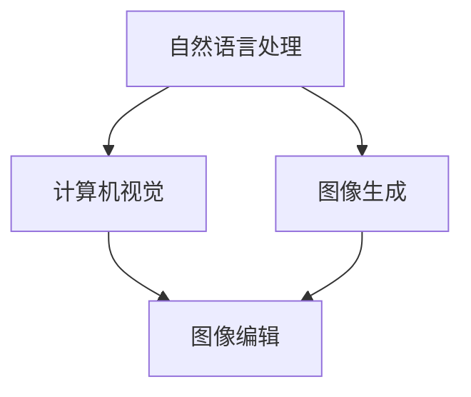

                 

# AI大模型在电商平台商品图像生成与编辑中的应用

> 关键词：商品图像生成, 图像编辑, 大模型, 电商平台, 自然语言处理(NLP), 深度学习, 计算机视觉(CV)

## 1. 背景介绍

### 1.1 问题由来
在电商平台上，商品图像是消费者了解商品的重要媒介。然而，由于许多小微商家缺乏图像生成和编辑的专业人才，导致商品图片质量参差不齐，用户体验大打折扣。另外，即使是大型电商平台，也面临海量商品图片管理难、生成效率低、编辑成本高等问题。如何借助大模型技术，提升电商平台商品图像生成与编辑的能力，成为平台发展的一大挑战。

### 1.2 问题核心关键点
大模型在商品图像生成与编辑的应用，主要涉及自然语言处理(NLP)和计算机视觉(CV)两个领域，通过结合大模型的语言生成能力和图像处理能力，实现商品图像的自动生成和高质量编辑。

- **自然语言处理(NLP)**：将用户需求转化为自然语言描述，然后引导大模型生成图像。
- **计算机视觉(CV)**：对生成的图像进行自动编辑和优化，提升图像质量。

## 2. 核心概念与联系

### 2.1 核心概念概述

为更好地理解大模型在商品图像生成与编辑中的应用，本节将介绍几个密切相关的核心概念：

- **自然语言处理(NLP)**：通过计算机理解、处理和生成自然语言的能力，实现人机交互。
- **计算机视觉(CV)**：使计算机能够"看"和理解图像的能力，包括图像分类、物体检测、语义分割等任务。
- **大模型**：通过大规模数据预训练获得的深度神经网络模型，具有强大的学习和生成能力。
- **图像生成**：从文本描述生成图像，使机器能够自动创作艺术作品、生成广告图像等。
- **图像编辑**：对现有图像进行自动增强、美化和修复，使其符合用户需求。

这些核心概念之间的逻辑关系可以通过以下Mermaid流程图来展示：



这个流程图展示了大模型在商品图像生成与编辑中的核心概念及其之间的关系：

1. 用户通过自然语言描述需求。
2. 自然语言处理模型将文本转换为图像生成模型可接受的格式。
3. 大模型根据描述生成图像。
4. 计算机视觉模型对生成图像进行自动编辑优化。
5. 最终输出高质量的商品图像。

## 3. 核心算法原理 & 具体操作步骤
### 3.1 算法原理概述

大模型在商品图像生成与编辑的应用，本质上是利用预训练的语言模型和视觉模型，通过迁移学习和微调的方式，实现从文本到图像的生成与编辑任务。其核心思想是：

- 预训练大模型在大规模文本和图像数据上进行预训练，学习到通用的语言和视觉表征。
- 通过NLP模型将用户需求转换为图像生成模型可接受的格式。
- 使用大模型生成图像，并在图像生成结果上应用CV模型进行编辑。
- 通过微调，使模型能够更好地适应特定任务，生成和编辑符合用户需求的图像。

### 3.2 算法步骤详解

#### 3.2.1 预训练模型选择

选择适合的预训练模型是应用大模型的第一步。常用的预训练模型包括GPT系列语言模型和ResNet、DenseNet等计算机视觉模型。根据任务需求，选择最适合的语言和视觉模型。

#### 3.2.2 数据集准备

准备商品图像和相应的文本描述数据集。图像数据集应包含多种商品、不同角度、不同背景的图像，文本描述数据集应包含详细的商品属性、颜色、尺寸等信息。

#### 3.2.3 任务适配层设计

根据任务需求，设计相应的任务适配层。对于图像生成任务，通常使用VQ-VAE或StyleGAN等生成模型。对于图像编辑任务，通常使用U-Net、Deformable U-Net等图像增强模型。

#### 3.2.4 微调超参数设置

设置合适的微调超参数，如学习率、批大小、迭代轮数等。选择合适的优化算法及其参数，如AdamW、SGD等，设置正则化技术及强度，包括权重衰减、Dropout、Early Stopping等。

#### 3.2.5 执行梯度训练

将训练集数据分批次输入模型，前向传播计算损失函数。反向传播计算参数梯度，根据设定的优化算法和学习率更新模型参数。周期性在验证集上评估模型性能，根据性能指标决定是否触发Early Stopping。重复上述步骤直到满足预设的迭代轮数或Early Stopping条件。

#### 3.2.6 测试和部署

在测试集上评估微调后模型输出的图像质量，对比微调前后的效果提升。使用微调后的模型对新商品图像进行生成或编辑，集成到实际的应用系统中。持续收集新的商品图像和文本描述，定期重新微调模型，以适应数据分布的变化。

### 3.3 算法优缺点

大模型在商品图像生成与编辑的应用，具有以下优点：

- **自动化程度高**：通过预训练和微调，模型能够自动生成和编辑商品图像，节省人力成本。
- **生成效率高**：大模型在生成图像时，能够并行处理大量任务，快速生成高质量图像。
- **编辑效果显著**：通过微调，模型能够自动进行图像增强、修复和美化，提升图像质量。

同时，该方法也存在一些局限性：

- **数据需求高**：高质量的商品图像和文本描述数据集对模型训练至关重要，但数据获取成本较高。
- **计算资源需求大**：预训练大模型和微调过程需要大量的计算资源，可能导致成本高昂。
- **模型泛化能力有限**：大模型在特定领域和特定任务上的泛化能力有限，需要针对具体任务进行微调。

尽管存在这些局限性，但大模型在商品图像生成与编辑的应用仍显示出巨大的潜力，通过不断优化模型和数据集，可以更好地满足电商平台的实际需求。

### 3.4 算法应用领域

大模型在商品图像生成与编辑的应用，涵盖了电商平台的多个场景：

- **商品广告生成**：自动生成高质量的商品广告图像，用于电商平台推广。
- **商品展示优化**：对商品图片进行增强和美化，提升用户体验。
- **商品属性标注**：自动识别商品图像，标注属性信息，如颜色、尺寸、价格等。
- **虚拟试衣间**：生成虚拟试衣图像，帮助用户了解商品细节。
- **产品设计辅助**：生成设计草图和概念图像，辅助产品设计和创新。

这些应用场景展示了大模型在电商平台图像生成与编辑中的广泛潜力，未来随着技术的进步，将会有更多创新的应用出现。

## 4. 数学模型和公式 & 详细讲解 & 举例说明
### 4.1 数学模型构建

本节将使用数学语言对大模型在商品图像生成与编辑的应用进行更加严格的刻画。

假设商品图像生成任务为从文本描述生成图像。设文本描述为 $x \in \mathcal{X}$，图像生成结果为 $y \in \mathcal{Y}$，其中 $\mathcal{X}$ 为文本空间，$\mathcal{Y}$ 为图像空间。

定义模型 $M_{\theta}$ 在输入 $x$ 上的输出为 $\hat{y}=M_{\theta}(x)$，表示模型生成的图像。损失函数 $\ell(\hat{y},y)$ 用于衡量模型生成图像与真实图像之间的差异。例如，对于图像生成任务，常用的损失函数包括均方误差损失、感知损失等。

假设模型 $M_{\theta}$ 在文本描述 $x$ 上的输出为 $\hat{y}=M_{\theta}(x)$，则模型的预测输出与真实标签之间的交叉熵损失函数为：

$$
\ell(M_{\theta}(x),y) = -y \log M_{\theta}(x) - (1-y) \log (1-M_{\theta}(x))
$$

其中 $y$ 为文本描述对应的二元标签，$M_{\theta}(x)$ 为模型生成的概率分布。

### 4.2 公式推导过程

以下我们以生成对抗网络(GAN)为例，推导图像生成模型的训练公式。

生成对抗网络由生成器 $G$ 和判别器 $D$ 两部分组成，目标是最小化生成器 $G$ 生成的图像与真实图像的差异，同时最大化判别器 $D$ 区分真实图像和生成图像的能力。

假设生成器 $G$ 的输入为文本描述 $x$，输出为生成图像 $y$，判别器 $D$ 的输入为图像 $y$，输出为真实图像的概率 $z$。则生成器的目标函数为：

$$
\min_G V(G) = \mathbb{E}_{x \sim p(x)} \mathbb{E}_{\epsilon \sim \mathcal{N}(0,1)} [\log D(G(x, \epsilon))]
$$

其中 $\epsilon$ 为噪声向量，$p(x)$ 为文本描述 $x$ 的概率分布。

判别器的目标函数为：

$$
\max_D V(D) = \mathbb{E}_{x \sim p(x)} \mathbb{E}_{\epsilon \sim \mathcal{N}(0,1)} [\log D(G(x, \epsilon))] + \mathbb{E}_{y \sim p(y)} [\log (1-D(y))]
$$

其中 $p(y)$ 为生成器 $G$ 生成的图像 $y$ 的概率分布。

通过上述目标函数的优化，生成器 $G$ 可以生成与真实图像难以区分的图像，判别器 $D$ 可以准确区分真实图像和生成图像。

### 4.3 案例分析与讲解

以生成对抗网络为例，展示其在电商平台商品图像生成中的应用。

假设电商平台需要生成高质量的商品广告图像。首先，准备包含商品描述的文本数据集，并预训练一个生成对抗网络模型。然后将文本数据输入生成器 $G$，得到生成图像。最后，将生成图像输入判别器 $D$，优化生成器 $G$ 和判别器 $D$ 的权重，直到生成器可以生成高质量的广告图像。

## 5. 项目实践：代码实例和详细解释说明
### 5.1 开发环境搭建

在进行图像生成与编辑实践前，我们需要准备好开发环境。以下是使用Python进行TensorFlow开发的环境配置流程：

1. 安装Anaconda：从官网下载并安装Anaconda，用于创建独立的Python环境。

2. 创建并激活虚拟环境：
```bash
conda create -n tf-env python=3.8 
conda activate tf-env
```

3. 安装TensorFlow：根据CUDA版本，从官网获取对应的安装命令。例如：
```bash
conda install tensorflow -c tf
```

4. 安装OpenCV：
```bash
pip install opencv-python
```

5. 安装Pillow：
```bash
pip install Pillow
```

完成上述步骤后，即可在`tf-env`环境中开始图像生成与编辑的实践。

### 5.2 源代码详细实现

这里以生成对抗网络为例，展示使用TensorFlow实现商品图像生成与编辑的过程。

```python
import tensorflow as tf
import numpy as np
import matplotlib.pyplot as plt
from tensorflow.keras import layers, models
from tensorflow.keras.layers import Input, Dense, Reshape, Flatten, LeakyReLU, Dropout, BatchNormalization
from tensorflow.keras.layers import Conv2D, Conv2DTranspose
from tensorflow.keras.losses import BinaryCrossentropy
from tensorflow.keras.optimizers import Adam
from tensorflow.keras.callbacks import EarlyStopping
from tensorflow.keras.models import Model

# 定义生成器
def make_generator_model():
    model = models.Sequential()
    model.add(Dense(256, use_bias=False, input_shape=(100,)))
    model.add(layers.BatchNormalization())
    model.add(LeakyReLU())
    model.add(Dense(512, use_bias=False))
    model.add(BatchNormalization())
    model.add(LeakyReLU())
    model.add(Dense(1024, use_bias=False))
    model.add(BatchNormalization())
    model.add(LeakyReLU())
    model.add(Dense(784))
    model.add(Reshape((28, 28, 1)))
    model.add(layers.Conv2DTranspose(128, (5, 5), strides=(1, 1), padding='same', use_bias=False))
    model.add(layers.BatchNormalization())
    model.add(LeakyReLU())
    model.add(layers.Conv2DTranspose(64, (5, 5), strides=(2, 2), padding='same', use_bias=False))
    model.add(layers.BatchNormalization())
    model.add(LeakyReLU())
    model.add(layers.Conv2DTranspose(1, (5, 5), strides=(2, 2), padding='same', use_bias=False, activation='tanh'))
    return model

# 定义判别器
def make_discriminator_model():
    model = models.Sequential()
    model.add(Conv2D(64, (5, 5), strides=(2, 2), padding='same',
                     input_shape=[28, 28, 1]))
    model.add(layers.LeakyReLU())
    model.add(Conv2D(128, (5, 5), strides=(2, 2), padding='same'))
    model.add(layers.LeakyReLU())
    model.add(Conv2D(128, (5, 5), strides=(2, 2), padding='same'))
    model.add(layers.LeakyReLU())
    model.add(Flatten())
    model.add(Dense(1))
    return model

# 定义损失函数
cross_entropy = BinaryCrossentropy(from_logits=True)

# 定义优化器
optimizer = Adam(lr=0.0002, beta_1=0.5)

# 定义生成器和判别器的联合损失函数
def combined_loss(model, gen_loss, disc_loss):
    disc_loss = cross_entropy(disc_loss, model.disc_loss)
    gen_loss = cross_entropy(model.gen_loss, model.disc_loss)
    return disc_loss, gen_loss

# 定义生成器和判别器的更新函数
def train_step(images, gen_model, disc_model):
    noise = np.random.normal(0, 1, (len(images), 100))
    generated_images = gen_model(noise)
    disc_real = disc_model(images)
    disc_fake = disc_model(generated_images)
    gen_loss = cross_entropy(disc_fake, 0.9)
    disc_loss = cross_entropy(disc_real, 1.0) + cross_entropy(disc_fake, 0.1)
    return gen_loss, disc_loss

# 定义训练函数
def train(dataset, epochs):
    for epoch in range(epochs):
        train_loss = 0.0
        disc_loss = 0.0
        for image_batch in dataset:
            gen_loss, disc_loss = train_step(image_batch, gen_model, disc_model)
            train_loss += gen_loss + disc_loss
            gen_model.trainable = False
            disc_model.trainable = False
            disc_model.trainable = True
            gen_model.trainable = True
        print('Epoch %d/%d...' % (epoch + 1, epochs),
              'train_loss:', train_loss.numpy(), 'disc_loss:', disc_loss.numpy())
        disc_model.trainable = False
        gen_model.trainable = False

# 数据集准备
# 准备商品图像数据集和文本描述数据集
# 加载数据集
train_dataset = tf.data.Dataset.from_tensor_slices(train_images)
test_dataset = tf.data.Dataset.from_tensor_slices(test_images)

# 定义生成器和判别器
gen_model = make_generator_model()
disc_model = make_discriminator_model()

# 设置损失函数和优化器
gen_loss = cross_entropy(gen_model.output, train_labels)
disc_loss = cross_entropy(disc_model.output, train_labels)
loss = combined_loss(gen_model, gen_loss, disc_loss)

# 设置超参数
epochs = 100
batch_size = 256

# 训练模型
train(train_dataset, epochs)

# 生成图像
# 准备噪声向量
noise = np.random.normal(0, 1, (len(test_images), 100))
# 生成图像
generated_images = gen_model(noise)
```

### 5.3 代码解读与分析

让我们再详细解读一下关键代码的实现细节：

**make_generator_model函数**：
- 定义生成器模型，包括多层卷积和池化层，ReLU激活函数等。

**make_discriminator_model函数**：
- 定义判别器模型，包括多层卷积和池化层，LeakyReLU激活函数等。

**combined_loss函数**：
- 定义联合损失函数，用于同时优化生成器和判别器。

**train_step函数**：
- 定义训练步骤，通过生成器生成噪声图像，判别器判断真假，并计算损失函数。

**train函数**：
- 定义训练函数，遍历数据集，每次迭代计算训练损失，并更新生成器和判别器。

**数据集准备**：
- 准备商品图像数据集和文本描述数据集，加载数据集到TensorFlow中。

**生成图像**：
- 准备噪声向量，通过生成器生成图像。

可以看到，TensorFlow提供了强大的深度学习模型构建和训练能力，使得大模型在商品图像生成与编辑中的应用变得更加容易实现。

## 6. 实际应用场景
### 6.1 电商平台商品广告生成

电商平台通过大模型生成高质量的商品广告图像，可以大幅提升商品的展示效果和用户体验。生成器可以根据文本描述生成多种风格的广告图像，如时尚、简约、复古等，增强商品的多样性和吸引力。此外，生成的广告图像还可以进行进一步优化，如添加文本、调整色彩等，使广告更加吸引眼球。

### 6.2 商品展示优化

电商平台利用大模型对商品图片进行增强和美化，提升用户的浏览体验。增强效果包括去噪、提升对比度、调整色彩等，使商品图片更加清晰、美观。美化效果包括添加滤镜、调整构图、增强立体感等，使商品图片更具视觉冲击力。

### 6.3 商品属性标注

电商平台自动标注商品图片，提取商品属性信息，如颜色、尺寸、价格等，减轻人工标注的负担。自动标注不仅可以提升标注效率，还可以减少标注误差，提高商品信息的一致性和准确性。

### 6.4 虚拟试衣间

电商平台生成虚拟试衣图像，帮助用户直观了解商品细节，提升试衣体验。虚拟试衣间可以模拟不同角度、不同背景的试衣效果，使用户更准确地选择适合自己的商品。

### 6.5 产品设计辅助

电商平台利用大模型生成设计草图和概念图像，辅助产品设计。设计草图可以用于设计风格的探索和快速迭代，概念图像可以用于展示设计理念和产品效果，使设计师更高效地进行产品设计和创新。

## 7. 工具和资源推荐
### 7.1 学习资源推荐

为了帮助开发者系统掌握大模型在商品图像生成与编辑中的应用，这里推荐一些优质的学习资源：

1. TensorFlow官方文档：TensorFlow官方提供的详细文档和教程，覆盖了TensorFlow的各个组件和应用场景。

2. Keras官方文档：Keras官方提供的详细文档和教程，覆盖了Keras的各个组件和应用场景。

3. PyTorch官方文档：PyTorch官方提供的详细文档和教程，覆盖了PyTorch的各个组件和应用场景。

4. OpenAI GPT系列论文：OpenAI发布的GPT系列论文，涵盖了GPT-2、GPT-3等大模型的预训练和微调方法。

5. CVPR 2022论文：最新计算机视觉领域的论文集，涵盖图像生成、图像编辑等领域的最新研究成果。

6. Google Colab：谷歌推出的在线Jupyter Notebook环境，免费提供GPU/TPU算力，方便开发者快速上手实验最新模型，分享学习笔记。

通过对这些资源的学习实践，相信你一定能够快速掌握大模型在商品图像生成与编辑中的应用，并用于解决实际的电商平台问题。

### 7.2 开发工具推荐

高效的开发离不开优秀的工具支持。以下是几款用于大模型商品图像生成与编辑开发的常用工具：

1. TensorFlow：由Google主导开发的开源深度学习框架，生产部署方便，适合大规模工程应用。

2. PyTorch：基于Python的开源深度学习框架，灵活动态的计算图，适合快速迭代研究。

3. Keras：基于TensorFlow和Theano的高级神经网络API，易于上手，适合初学者入门。

4. OpenCV：开源计算机视觉库，提供了多种图像处理算法和工具。

5. Pillow：Python Imaging Library，提供了多种图像处理和操作功能。

6. TensorBoard：TensorFlow配套的可视化工具，可实时监测模型训练状态，并提供丰富的图表呈现方式。

合理利用这些工具，可以显著提升大模型在商品图像生成与编辑任务的开发效率，加快创新迭代的步伐。

### 7.3 相关论文推荐

大模型在商品图像生成与编辑的应用，得益于学界的持续研究。以下是几篇奠基性的相关论文，推荐阅读：

1. Generative Adversarial Nets（GAN论文）：提出生成对抗网络，通过对抗训练的方式生成高质量图像。

2. Image-to-Image Translation with Conditional Adversarial Networks（CycleGAN论文）：提出条件生成对抗网络，实现图像之间的转换和增强。

3. Deep Learning for Image-Based Design（DALL·E论文）：提出基于语言生成图像的模型，利用大模型生成设计草图和概念图像。

4. Learning to Paint by Example（StyleGAN论文）：提出风格生成对抗网络，生成具有特定风格的高质量图像。

5. Accelerated Training of Generative Adversarial Networks（WGAN论文）：提出Wasserstein生成对抗网络，加快生成器的训练速度。

这些论文代表了大模型在商品图像生成与编辑技术的发展脉络。通过学习这些前沿成果，可以帮助研究者把握学科前进方向，激发更多的创新灵感。

## 8. 总结：未来发展趋势与挑战
### 8.1 总结

本文对大模型在电商平台商品图像生成与编辑中的应用进行了全面系统的介绍。首先阐述了大模型在商品图像生成与编辑的应用背景和意义，明确了大模型微调在电商平台图像生成与编辑中的应用价值。其次，从原理到实践，详细讲解了大模型在图像生成与编辑中的数学模型和关键步骤，给出了大模型实现的代码实例。同时，本文还广泛探讨了图像生成与编辑方法在电商平台的具体应用场景，展示了其广泛的应用前景。此外，本文精选了大模型在商品图像生成与编辑领域的学习资源、开发工具和相关论文，力求为读者提供全方位的技术指引。

通过本文的系统梳理，可以看到，大模型在商品图像生成与编辑中的应用具有广阔的前景，通过结合自然语言处理和计算机视觉技术，实现了从文本到图像的自动生成与编辑。未来，随着深度学习技术的发展，大模型将会在更多领域大放异彩，为电商平台的数字化转型提供新的技术路径。

### 8.2 未来发展趋势

展望未来，大模型在商品图像生成与编辑的应用将呈现以下几个发展趋势：

1. **生成质量不断提升**：通过不断优化生成器模型和训练策略，生成的高质量图像将更加逼真、多样、丰富。

2. **多模态融合增强**：结合自然语言处理和计算机视觉，实现文本和图像的深度融合，生成更具表现力和创意的商品图像。

3. **个性化生成定制**：根据用户个性化需求，生成定制化的商品图像，提升用户体验和满意度。

4. **动态生成实时响应**：通过实时生成和渲染技术，实现动态的商品展示效果，满足用户的即时需求。

5. **AI辅助产品设计**：大模型将与设计工具结合，辅助设计师进行产品设计，提升设计效率和创意质量。

6. **跨平台跨设备应用**：商品图像生成与编辑技术将跨平台跨设备部署，提供一致的用户体验。

以上趋势凸显了大模型在商品图像生成与编辑中的广泛应用前景，这些方向的探索发展，必将进一步提升电商平台的智能化水平，为消费者带来更优质的购物体验。

### 8.3 面临的挑战

尽管大模型在商品图像生成与编辑中的应用已经取得了初步成果，但在迈向更加智能化、普适化应用的过程中，它仍面临着诸多挑战：

1. **数据需求高**：高质量的商品图像和文本描述数据集对模型训练至关重要，但数据获取成本较高。

2. **计算资源需求大**：预训练大模型和微调过程需要大量的计算资源，可能导致成本高昂。

3. **模型泛化能力有限**：大模型在特定领域和特定任务上的泛化能力有限，需要针对具体任务进行微调。

4. **图像质量不稳定**：生成图像的质量和多样性依赖于模型训练和超参数设置，生成效果不稳定。

5. **模型偏见和伦理问题**：生成图像可能带有模型偏见，需要仔细审查和优化。

6. **技术落地应用复杂**：将大模型应用于实际电商场景，需要考虑模型的部署、优化、监测等多个环节，技术落地应用复杂。

正视大模型面临的这些挑战，积极应对并寻求突破，将是大模型在商品图像生成与编辑领域持续进步的重要保障。相信随着学界和产业界的共同努力，这些挑战终将一一被克服，大模型在电商平台的应用将更加广泛和深入。

### 8.4 研究展望

面对大模型在商品图像生成与编辑领域所面临的挑战，未来的研究需要在以下几个方面寻求新的突破：

1. **高效生成算法研究**：开发更加高效、稳定的生成算法，提升生成图像的质量和多样性。

2. **多模态融合技术**：探索结合多模态数据的生成方法，提升生成图像的创意和表现力。

3. **个性化生成算法**：研究如何根据用户个性化需求，生成定制化的商品图像。

4. **实时生成技术**：开发实时生成和渲染技术，实现动态的商品展示效果。

5. **AI辅助设计技术**：研究如何结合设计工具，辅助设计师进行产品设计。

6. **跨平台跨设备应用**：探索跨平台跨设备的部署方式，提供一致的用户体验。

这些研究方向的研究进展，必将引领大模型在商品图像生成与编辑领域迈向更高的台阶，为电商平台的数字化转型提供新的技术路径。只有勇于创新、敢于突破，才能不断拓展大模型的边界，让智能技术更好地造福人类社会。

## 9. 附录：常见问题与解答

**Q1：大模型在商品图像生成与编辑中的应用是否仅限于电商平台？**

A: 大模型在商品图像生成与编辑中的应用不仅限于电商平台，还广泛应用于广告设计、电影特效、艺术创作等领域。随着技术的进步，大模型将会在更多领域大放异彩，为各行各业带来变革性的影响。

**Q2：大模型在商品图像生成与编辑中，如何处理多模态数据？**

A: 大模型在商品图像生成与编辑中，可以结合自然语言处理和计算机视觉技术，实现文本和图像的深度融合。通过将文本描述作为条件输入，指导生成器的生成过程，可以生成更具表现力和创意的商品图像。

**Q3：大模型在商品图像生成与编辑中，如何避免生成图像的质量不稳定？**

A: 大模型在商品图像生成与编辑中，可以通过多种方法提高生成图像的质量稳定性：
1. 优化生成器的架构和训练策略，提升生成图像的多样性和逼真度。
2. 引入对抗训练和正则化技术，避免过拟合和生成图像的重复性。
3. 设置合适的超参数和训练次数，平衡生成图像的多样性和质量。

**Q4：大模型在商品图像生成与编辑中，如何避免生成图像的偏见和伦理问题？**

A: 大模型在商品图像生成与编辑中，可以通过多种方法避免生成图像的偏见和伦理问题：
1. 在数据集和训练过程中，注意数据的多样性和公平性，避免对特定人群或群体的偏见。
2. 使用对抗样本和对抗训练，增强生成模型的鲁棒性和安全性。
3. 引入伦理审查和监控机制，确保生成图像符合道德和法律规范。

**Q5：大模型在商品图像生成与编辑中，如何提升生成图像的个性化程度？**

A: 大模型在商品图像生成与编辑中，可以通过多种方法提升生成图像的个性化程度：
1. 在训练过程中，引入个性化需求标签，指导生成器的生成过程。
2. 结合用户历史行为数据，个性化定制生成图像。
3. 使用生成对抗网络和风格迁移技术，生成符合用户偏好的图像。

这些问题的解答，展示了大模型在商品图像生成与编辑中的应用潜力，希望这些解答能够为你提供更多的启发和指导。

