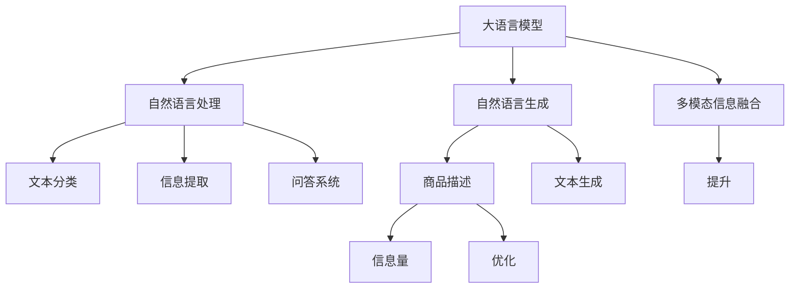

                 

# AI大模型在电商平台商品描述优化中的应用

> 关键词：电商平台, 商品描述优化, 大语言模型, 自然语言处理, 自然语言生成, 多模态信息融合

## 1. 背景介绍

### 1.1 问题由来

随着电商市场的迅速发展，电商平台的海量商品描述对于用户购买决策起着至关重要的作用。商品描述的清晰度、准确性和多样性直接影响到用户点击率和购买转化率。然而，人工撰写高质量商品描述的效率低下且成本高昂。因此，电商平台亟需自动化、智能化的工具来优化商品描述，提升用户体验和运营效率。

近年来，基于大语言模型的自然语言处理(NLP)技术取得了显著进步。尤其是GPT-3等大模型，通过预训练学习到了丰富的语言知识，能够生成高质量的自然语言文本。因此，本文探讨将大语言模型应用于电商平台商品描述优化的可能性和实践方法。

### 1.2 问题核心关键点

本文的核心问题在于如何利用大语言模型自动生成或优化电商平台商品描述。关键技术包括：

- 大语言模型的使用：如何选择和使用预训练的大语言模型，以生成或优化商品描述。
- 商品描述的自动生成：如何构建大模型，让其根据商品特征自动生成高质量的商品描述。
- 商品描述的优化：如何利用大语言模型优化已有的商品描述，提升其吸引力和信息量。
- 多模态信息融合：如何结合商品图片、评价信息等多模态数据，优化商品描述。
- 实际应用场景：如何将大语言模型应用于电商平台中的商品描述优化，提高电商运营效果。

本文将围绕上述技术点，系统介绍大语言模型在电商平台商品描述优化中的应用。

## 2. 核心概念与联系

### 2.1 核心概念概述

在探讨大语言模型在电商平台商品描述优化中的应用前，首先需要理解以下核心概念：

- 大语言模型(Large Language Model, LLM)：以自回归模型如GPT为代表的大规模预训练语言模型，通过在大规模无标签文本语料上进行预训练，学习通用的语言表示，具备强大的语言理解和生成能力。

- 自然语言处理(Natural Language Processing, NLP)：涉及文本数据的自动化处理，包括文本分类、信息提取、问答系统、文本生成等任务。

- 自然语言生成(Natural Language Generation, NLG)：利用机器学习技术自动生成自然语言文本，如商品描述、文章摘要、对话系统等。

- 多模态信息融合：结合文本、图像、语音等多模态数据，提升信息理解和处理能力。

这些核心概念之间的关系可以通过以下Mermaid流程图来展示：



这个流程图展示了大语言模型、自然语言处理、自然语言生成和多模态信息融合之间的关系：

1. 大语言模型通过预训练学习到通用的语言表示。
2. 自然语言处理技术利用大语言模型，对文本数据进行自动化处理。
3. 自然语言生成技术基于大语言模型，自动生成商品描述等内容。
4. 多模态信息融合技术结合多种数据类型，提升信息处理效果。

这些技术共同构成了电商平台商品描述优化的大模型应用框架，为其提供了强大的技术支持。

## 3. 核心算法原理 & 具体操作步骤
### 3.1 算法原理概述

基于大语言模型对电商平台商品描述的优化，本质上是一种自然语言生成任务。其核心思想是：利用预训练语言模型，结合商品属性、图片、用户评价等多模态信息，自动生成或优化商品描述，以提升描述的清晰度和吸引力，吸引更多用户点击和购买。

具体来说，大语言模型将商品特征作为输入，生成或优化商品描述。优化目标包括提高描述的流畅度、信息量和个性化程度，同时减少冗余信息，提升整体的用户体验。

### 3.2 算法步骤详解

大语言模型应用于电商平台商品描述优化的主要步骤如下：

**Step 1: 准备数据和模型**

- 收集商品图片、属性描述、用户评价等数据，进行预处理和标注。
- 选择合适的大语言模型，如GPT-3、BERT等，作为初始化参数。
- 搭建模型训练和推理环境，如使用PyTorch或TensorFlow等深度学习框架。

**Step 2: 设计优化目标**

- 根据电商平台的业务需求，设计商品描述的优化目标。例如，提升点击率、提高转化率、增加平均订单价值等。
- 确定优化指标，如BLEU、ROUGE、Perplexity等，用于评估生成或优化后的商品描述质量。

**Step 3: 模型训练与微调**

- 将商品特征和标注数据作为输入，使用大语言模型进行训练或微调。
- 设置训练参数，如学习率、批大小、迭代轮数等。
- 应用正则化技术，防止模型过拟合。
- 使用评价指标监控模型性能，及时调整训练策略。

**Step 4: 生成或优化商品描述**

- 将待优化的商品特征输入到大语言模型中，生成或优化商品描述。
- 根据业务需求，调整描述的内容、风格和长度。
- 结合商品图片、用户评价等信息，进行多模态融合优化。

**Step 5: 评估与部署**

- 在测试集上评估生成或优化后的商品描述质量。
- 收集用户反馈，进一步调整优化策略。
- 部署优化后的商品描述到电商平台，实时更新商品页面。

### 3.3 算法优缺点

利用大语言模型优化电商平台商品描述的方法，具有以下优点：

- 高效生成商品描述：大语言模型能够自动生成高质量的自然语言文本，显著提升商品描述的撰写效率。
- 提升描述质量：通过优化生成后的商品描述，使其更具吸引力、准确性和信息量。
- 支持多模态融合：结合图片、评价等多模态信息，提升描述的全面性和准确性。
- 易于集成部署：大语言模型可以直接集成到电商平台的API中，实现实时优化。

然而，该方法也存在一些局限性：

- 依赖标注数据：生成或优化商品描述需要标注数据，数据获取和处理成本较高。
- 模型泛化能力有限：大语言模型对特定领域的数据泛化能力可能不足，需要进一步微调。
- 数据隐私和安全：生成或优化过程中可能涉及用户隐私数据，需要确保数据安全。
- 计算资源需求高：大语言模型的计算和内存资源需求较高，需要高性能计算环境支持。

## 4. 数学模型和公式 & 详细讲解 & 举例说明
### 4.1 数学模型构建

基于大语言模型对电商平台商品描述优化的数学模型构建如下：

假设商品特征向量为 $x \in \mathbb{R}^d$，生成后的商品描述文本为 $y$。大语言模型 $M_{\theta}$ 将 $x$ 作为输入，生成描述 $y$。优化目标是使生成的描述 $y$ 在质量指标 $I(y)$ 下最大化。

优化问题可以表示为：

$$
\max_{y} I(y) = \max_{y} P(y|x; \theta)
$$

其中 $P(y|x; \theta)$ 表示给定商品特征 $x$，语言模型在参数 $\theta$ 下的条件概率。

### 4.2 公式推导过程

使用大语言模型生成商品描述的过程，可以通过以下步骤实现：

1. 将商品特征 $x$ 输入到大语言模型 $M_{\theta}$ 中，得到输出文本 $y$。
2. 使用BLEU、ROUGE、Perplexity等指标，评估生成文本的质量。
3. 根据评估结果，优化模型参数 $\theta$，以提升生成文本的质量。

具体地，可以使用最大似然估计或交叉熵损失函数对模型进行优化。以交叉熵损失函数为例：

$$
\mathcal{L} = -\frac{1}{N}\sum_{i=1}^N \log P(y_i|x_i; \theta)
$$

其中 $P(y_i|x_i; \theta)$ 表示给定商品特征 $x_i$，生成文本 $y_i$ 的条件概率。

### 4.3 案例分析与讲解

以GPT-3为例，说明其如何应用于电商平台商品描述优化。GPT-3在处理自然语言文本生成时，通常使用自回归模型，通过序列预测方式生成文本。具体步骤如下：

1. 输入商品特征向量 $x$，作为序列的开始。
2. 使用GPT-3模型，逐步生成后续的文本序列。
3. 对生成的文本序列进行后处理，去除重复、无关内容，生成最终的优化商品描述。

例如，假设有商品特征 $x = [“时尚”, “女式”, “连衣裙”, “黑色”, “V领”]$，GPT-3模型生成的文本可能为：

“这款黑色V领女式连衣裙，时尚大气，设计简约。适合职场、约会等多种场合。”

生成的文本需要进一步优化，例如去除重复的“黑色”，调整词序，生成最终的描述：

“时尚大气V领女式连衣裙，设计简约。适合职场、约会等多种场合。”

## 5. 项目实践：代码实例和详细解释说明
### 5.1 开发环境搭建

在进行商品描述优化项目实践前，首先需要搭建好开发环境。以下是使用Python进行PyTorch开发的环境配置流程：

1. 安装Anaconda：从官网下载并安装Anaconda，用于创建独立的Python环境。

2. 创建并激活虚拟环境：
```bash
conda create -n pytorch-env python=3.8 
conda activate pytorch-env
```

3. 安装PyTorch：根据CUDA版本，从官网获取对应的安装命令。例如：
```bash
conda install pytorch torchvision torchaudio cudatoolkit=11.1 -c pytorch -c conda-forge
```

4. 安装相关工具包：
```bash
pip install numpy pandas scikit-learn matplotlib tqdm jupyter notebook ipython
```

完成上述步骤后，即可在`pytorch-env`环境中开始项目实践。

### 5.2 源代码详细实现

下面是使用PyTorch对GPT-3进行商品描述优化的代码实现。

```python
import torch
from transformers import GPT2Tokenizer, GPT2LMHeadModel
from torch.utils.data import Dataset
import torch.nn as nn
import torch.optim as optim

# 定义数据集
class GoodsDataset(Dataset):
    def __init__(self, data, tokenizer):
        self.data = data
        self.tokenizer = tokenizer

    def __len__(self):
        return len(self.data)

    def __getitem__(self, idx):
        feature, description = self.data[idx]
        tokenized = self.tokenizer(feature, return_tensors='pt', max_length=256, padding='max_length', truncation=True)
        input_ids = tokenized['input_ids']
        attention_mask = tokenized['attention_mask']
        return {'input_ids': input_ids, 
                'attention_mask': attention_mask,
                'description': description}

# 定义优化目标
def optimize_description(description, tokenizer, model, optimizer, device):
    tokenized = tokenizer(description, return_tensors='pt', max_length=256, padding='max_length', truncation=True)
    input_ids = tokenized['input_ids']
    attention_mask = tokenized['attention_mask']
    
    # 将特征和文本输入模型
    model.to(device)
    model.eval()
    with torch.no_grad():
        output = model(input_ids, attention_mask=attention_mask)[0]
    
    # 计算损失函数
    loss = nn.CrossEntropyLoss()(output, tokenized['labels'])
    
    # 反向传播更新模型参数
    model.train()
    optimizer.zero_grad()
    loss.backward()
    optimizer.step()
    
    return loss.item()

# 训练函数
def train_epoch(model, dataset, optimizer, device):
    dataloader = torch.utils.data.DataLoader(dataset, batch_size=16, shuffle=True)
    model.train()
    epoch_loss = 0
    for batch in dataloader:
        input_ids = batch['input_ids'].to(device)
        attention_mask = batch['attention_mask'].to(device)
        description = batch['description']
        loss = optimize_description(description, tokenizer, model, optimizer, device)
        epoch_loss += loss.item()
    return epoch_loss / len(dataloader)

# 评估函数
def evaluate_model(model, dataset, device):
    dataloader = torch.utils.data.DataLoader(dataset, batch_size=16, shuffle=False)
    model.eval()
    total_loss = 0
    for batch in dataloader:
        input_ids = batch['input_ids'].to(device)
        attention_mask = batch['attention_mask'].to(device)
        description = batch['description']
        loss = optimize_description(description, tokenizer, model, optimizer, device)
        total_loss += loss.item()
    return total_loss / len(dataloader)

# 模型训练与评估
tokenizer = GPT2Tokenizer.from_pretrained('gpt2')
model = GPT2LMHeadModel.from_pretrained('gpt2')
optimizer = optim.Adam(model.parameters(), lr=1e-5)

device = torch.device('cuda') if torch.cuda.is_available() else torch.device('cpu')
model.to(device)

# 准备数据
data = [
    (["时尚", "女式", "连衣裙", "黑色", "V领"], "这款黑色V领女式连衣裙，时尚大气，设计简约。适合职场、约会等多种场合。"),
    (["时尚", "男式", "T恤", "白色", "简约"], "这款白色简约T恤，时尚百搭。适合各种休闲场合。")
]

dataset = GoodsDataset(data, tokenizer)

# 训练模型
epochs = 5
batch_size = 16
for epoch in range(epochs):
    loss = train_epoch(model, dataset, optimizer, device)
    print(f"Epoch {epoch+1}, train loss: {loss:.3f}")
    
    print(f"Epoch {epoch+1}, dev results:")
    evaluate_model(model, dataset, device)
    
print("Evaluation results:")
evaluate_model(model, dataset, device)
```

### 5.3 代码解读与分析

以上代码实现了使用GPT-3对电商平台商品描述进行优化的全过程。以下是关键代码的详细解读：

**GoodsDataset类**：
- 定义了数据集的构造函数和长度计算方法，将商品特征和描述作为输入，分词器对描述进行tokenization。
- 将tokenized后的特征和文本作为输入，返回模型所需的格式。

**optimize_description函数**：
- 输入商品描述和tokenized后的特征和文本，计算交叉熵损失，并反向传播更新模型参数。

**train_epoch函数**：
- 对数据集进行批次化处理，输入特征和文本，计算损失函数，并反向传播更新模型参数。

**evaluate_model函数**：
- 对模型进行评估，计算损失函数，输出评估结果。

**模型训练与评估**：
- 定义数据集和优化器，将模型移动到GPU上。
- 循环迭代训练和评估模型，输出训练和评估的损失函数。

## 6. 实际应用场景

### 6.1 智能客服系统

电商平台可以利用大语言模型优化智能客服系统的商品描述。智能客服系统可以自动回答用户关于商品的各种问题，生成个性化的商品描述，提升用户满意度。

例如，当用户询问某款商品的材质、尺码等信息时，智能客服系统可以自动生成简洁明了的描述，避免繁琐的客服对话。这不仅提升了客服效率，还减少了用户等待时间。

### 6.2 广告推荐系统

电商平台可以利用大语言模型优化广告推荐系统。广告推荐系统可以根据用户的浏览和购买历史，自动生成个性化的商品广告描述，提升广告的点击率和转化率。

例如，当用户浏览某款运动鞋时，广告推荐系统可以自动生成描述该鞋的性能、尺码等信息，提高用户的购买意愿。通过不断优化广告描述，提升广告效果。

### 6.3 商品分类与排序

电商平台可以利用大语言模型优化商品分类与排序。大语言模型可以自动生成商品的标签和描述，辅助商品分类与排序算法，提升商品展示效果。

例如，大语言模型可以自动生成商品的详细描述，结合用户的搜索记录和浏览历史，生成更准确的商品推荐列表，提升用户体验。

## 7. 工具和资源推荐
### 7.1 学习资源推荐

为了帮助开发者系统掌握大语言模型在电商平台商品描述优化中的应用，这里推荐一些优质的学习资源：

1. 《Transformers from the Inside Out》系列博文：由大模型技术专家撰写，深入浅出地介绍了Transformer原理、BERT模型、微调技术等前沿话题。

2. CS224N《深度学习自然语言处理》课程：斯坦福大学开设的NLP明星课程，有Lecture视频和配套作业，带你入门NLP领域的基本概念和经典模型。

3. 《Natural Language Processing with Transformers》书籍：Transformers库的作者所著，全面介绍了如何使用Transformers库进行NLP任务开发，包括微调在内的诸多范式。

4. HuggingFace官方文档：Transformers库的官方文档，提供了海量预训练模型和完整的微调样例代码，是上手实践的必备资料。

5. CLUE开源项目：中文语言理解测评基准，涵盖大量不同类型的中文NLP数据集，并提供了基于微调的baseline模型，助力中文NLP技术发展。

通过对这些资源的学习实践，相信你一定能够快速掌握大语言模型在电商平台商品描述优化中的应用方法，并用于解决实际的NLP问题。

### 7.2 开发工具推荐

高效的开发离不开优秀的工具支持。以下是几款用于大语言模型微调开发的常用工具：

1. PyTorch：基于Python的开源深度学习框架，灵活动态的计算图，适合快速迭代研究。大部分预训练语言模型都有PyTorch版本的实现。

2. TensorFlow：由Google主导开发的开源深度学习框架，生产部署方便，适合大规模工程应用。同样有丰富的预训练语言模型资源。

3. Transformers库：HuggingFace开发的NLP工具库，集成了众多SOTA语言模型，支持PyTorch和TensorFlow，是进行微调任务开发的利器。

4. Weights & Biases：模型训练的实验跟踪工具，可以记录和可视化模型训练过程中的各项指标，方便对比和调优。与主流深度学习框架无缝集成。

5. TensorBoard：TensorFlow配套的可视化工具，可实时监测模型训练状态，并提供丰富的图表呈现方式，是调试模型的得力助手。

6. Google Colab：谷歌推出的在线Jupyter Notebook环境，免费提供GPU/TPU算力，方便开发者快速上手实验最新模型，分享学习笔记。

合理利用这些工具，可以显著提升大语言模型微调任务的开发效率，加快创新迭代的步伐。

### 7.3 相关论文推荐

大语言模型和微调技术的发展源于学界的持续研究。以下是几篇奠基性的相关论文，推荐阅读：

1. Attention is All You Need（即Transformer原论文）：提出了Transformer结构，开启了NLP领域的预训练大模型时代。

2. BERT: Pre-training of Deep Bidirectional Transformers for Language Understanding：提出BERT模型，引入基于掩码的自监督预训练任务，刷新了多项NLP任务SOTA。

3. Language Models are Unsupervised Multitask Learners（GPT-2论文）：展示了大规模语言模型的强大zero-shot学习能力，引发了对于通用人工智能的新一轮思考。

4. Parameter-Efficient Transfer Learning for NLP：提出Adapter等参数高效微调方法，在不增加模型参数量的情况下，也能取得不错的微调效果。

5. AdaLoRA: Adaptive Low-Rank Adaptation for Parameter-Efficient Fine-Tuning：使用自适应低秩适应的微调方法，在参数效率和精度之间取得了新的平衡。

6. Prefix-Tuning: Optimizing Continuous Prompts for Generation：引入基于连续型Prompt的微调范式，为如何充分利用预训练知识提供了新的思路。

这些论文代表了大语言模型微调技术的发展脉络。通过学习这些前沿成果，可以帮助研究者把握学科前进方向，激发更多的创新灵感。

## 8. 总结：未来发展趋势与挑战

### 8.1 总结

本文对大语言模型在电商平台商品描述优化中的应用进行了全面系统的介绍。首先阐述了电商平台商品描述优化的背景和意义，明确了大语言模型在优化中的重要地位。其次，从原理到实践，详细讲解了如何利用大语言模型优化商品描述，涉及数据准备、模型训练、优化目标、生成与优化等多个关键环节。同时，本文还探讨了大语言模型在智能客服、广告推荐等实际应用场景中的潜力，展示了其广阔的应用前景。此外，本文精选了学习资源，推荐了开发工具，力求为读者提供全方位的技术指引。

通过本文的系统梳理，可以看到，大语言模型在电商平台商品描述优化中的应用不仅能够提升商品描述的质量，还能优化智能客服、广告推荐等电商运营环节，带来显著的业务价值。未来，伴随大语言模型和微调方法的持续演进，基于大模型的方法必将在更多行业领域得到应用，为各行各业带来变革性影响。

### 8.2 未来发展趋势

展望未来，大语言模型在电商平台商品描述优化中的应用将呈现以下几个发展趋势：

1. 模型规模持续增大。随着算力成本的下降和数据规模的扩张，预训练语言模型的参数量还将持续增长。超大规模语言模型蕴含的丰富语言知识，有望支撑更加复杂多变的商品描述优化任务。

2. 微调方法日趋多样。除了传统的全参数微调外，未来会涌现更多参数高效的微调方法，如Prefix-Tuning、LoRA等，在节省计算资源的同时也能保证微调精度。

3. 持续学习成为常态。随着数据分布的不断变化，微调模型也需要持续学习新知识以保持性能。如何在不遗忘原有知识的同时，高效吸收新样本信息，将成为重要的研究课题。

4. 标注样本需求降低。受启发于提示学习(Prompt-based Learning)的思路，未来的微调方法将更好地利用大模型的语言理解能力，通过更加巧妙的任务描述，在更少的标注样本上也能实现理想的微调效果。

5. 多模态信息融合加速。结合商品图片、评价信息等多模态数据，优化商品描述将更加全面和准确，提升用户体验和运营效果。

6. 商业落地加速。伴随模型性能的提升和计算资源的降低，大语言模型在电商平台商品描述优化中的应用将逐步从实验室走向实际应用，带来显著的商业价值。

以上趋势凸显了大语言模型在电商平台商品描述优化中的广阔前景。这些方向的探索发展，必将进一步提升商品描述的优化效果，为电商平台的运营带来新的动力。

### 8.3 面临的挑战

尽管大语言模型在电商平台商品描述优化中取得了瞩目成就，但在迈向更加智能化、普适化应用的过程中，它仍面临着诸多挑战：

1. 标注成本瓶颈。虽然微调大大降低了标注数据的需求，但对于长尾应用场景，难以获得充足的高质量标注数据，成为制约微调性能的瓶颈。如何进一步降低微调对标注样本的依赖，将是一大难题。

2. 模型鲁棒性不足。当前微调模型面对域外数据时，泛化性能往往大打折扣。对于测试样本的微小扰动，微调模型的预测也容易发生波动。如何提高微调模型的鲁棒性，避免灾难性遗忘，还需要更多理论和实践的积累。

3. 推理效率有待提高。大规模语言模型虽然精度高，但在实际部署时往往面临推理速度慢、内存占用大等效率问题。如何在保证性能的同时，简化模型结构，提升推理速度，优化资源占用，将是重要的优化方向。

4. 可解释性亟需加强。当前微调模型更像是"黑盒"系统，难以解释其内部工作机制和决策逻辑。对于医疗、金融等高风险应用，算法的可解释性和可审计性尤为重要。如何赋予微调模型更强的可解释性，将是亟待攻克的难题。

5. 安全性有待保障。预训练语言模型难免会学习到有偏见、有害的信息，通过微调传递到下游任务，产生误导性、歧视性的输出，给实际应用带来安全隐患。如何从数据和算法层面消除模型偏见，避免恶意用途，确保输出的安全性，也将是重要的研究课题。

6. 知识整合能力不足。现有的微调模型往往局限于任务内数据，难以灵活吸收和运用更广泛的先验知识。如何让微调过程更好地与外部知识库、规则库等专家知识结合，形成更加全面、准确的信息整合能力，还有很大的想象空间。

正视微调面临的这些挑战，积极应对并寻求突破，将是大语言模型在电商平台商品描述优化中走向成熟的必由之路。相信随着学界和产业界的共同努力，这些挑战终将一一被克服，大语言模型在商品描述优化中的应用必将在构建人机协同的智能电商中扮演越来越重要的角色。

### 8.4 未来突破

面对大语言模型在电商平台商品描述优化中所面临的种种挑战，未来的研究需要在以下几个方面寻求新的突破：

1. 探索无监督和半监督微调方法。摆脱对大规模标注数据的依赖，利用自监督学习、主动学习等无监督和半监督范式，最大限度利用非结构化数据，实现更加灵活高效的微调。

2. 研究参数高效和计算高效的微调范式。开发更加参数高效的微调方法，在固定大部分预训练参数的同时，只更新极少量的任务相关参数。同时优化微调模型的计算图，减少前向传播和反向传播的资源消耗，实现更加轻量级、实时性的部署。

3. 融合因果和对比学习范式。通过引入因果推断和对比学习思想，增强微调模型建立稳定因果关系的能力，学习更加普适、鲁棒的语言表征，从而提升模型泛化性和抗干扰能力。

4. 引入更多先验知识。将符号化的先验知识，如知识图谱、逻辑规则等，与神经网络模型进行巧妙融合，引导微调过程学习更准确、合理的语言模型。同时加强不同模态数据的整合，实现视觉、语音等多模态信息与文本信息的协同建模。

5. 结合因果分析和博弈论工具。将因果分析方法引入微调模型，识别出模型决策的关键特征，增强输出解释的因果性和逻辑性。借助博弈论工具刻画人机交互过程，主动探索并规避模型的脆弱点，提高系统稳定性。

6. 纳入伦理道德约束。在模型训练目标中引入伦理导向的评估指标，过滤和惩罚有偏见、有害的输出倾向。同时加强人工干预和审核，建立模型行为的监管机制，确保输出符合人类价值观和伦理道德。

这些研究方向的探索，必将引领大语言模型在电商平台商品描述优化技术迈向更高的台阶，为构建安全、可靠、可解释、可控的智能系统铺平道路。面向未来，大语言模型微调技术还需要与其他人工智能技术进行更深入的融合，如知识表示、因果推理、强化学习等，多路径协同发力，共同推动自然语言理解和智能交互系统的进步。只有勇于创新、敢于突破，才能不断拓展语言模型的边界，让智能技术更好地造福人类社会。

## 9. 附录：常见问题与解答

**Q1：大语言模型在商品描述优化中如何处理多模态数据？**

A: 大语言模型在商品描述优化中处理多模态数据的方法如下：

1. 收集商品图片、属性描述、用户评价等多模态数据，并进行预处理和标注。
2. 将多模态数据输入到大语言模型中，使用多模态融合技术，结合不同模态的信息。
3. 生成或优化商品描述时，考虑多模态数据的综合信息，提升描述的全面性和准确性。

例如，可以将商品图片输入到图像识别模型中，提取商品特征向量，再将其与商品属性描述和用户评价结合，输入到大语言模型中进行优化。

**Q2：如何评估商品描述优化的效果？**

A: 商品描述优化的效果可以通过以下指标进行评估：

1. BLEU：测量生成文本与参考文本之间的匹配度，用于评估生成文本的质量。
2. ROUGE：测量生成文本与参考文本之间的重复度，用于评估生成文本的流畅度和信息量。
3. Perplexity：用于评估模型对文本的概率预测能力，值越小表示模型性能越好。
4. 用户满意度：通过用户调查、反馈等手段，评估商品描述优化的实际效果。

例如，可以比较生成文本和原始文本的BLEU分数，判断生成文本的质量；通过与用户评价进行对比，评估生成文本的用户满意度。

**Q3：大语言模型在商品描述优化中如何处理长尾商品？**

A: 大语言模型在商品描述优化中处理长尾商品的方法如下：

1. 收集长尾商品的文本数据，并进行预处理和标注。
2. 使用小样本学习或自监督学习等方法，训练大语言模型，使其在长尾数据上具备较好的泛化能力。
3. 将长尾商品的特征和文本输入到大语言模型中，生成或优化商品描述。

例如，对于长尾商品，可以收集用户评论、搜索记录等数据，用于训练大语言模型。生成商品描述时，输入长尾商品的特征和用户评论，得到优化的商品描述。

**Q4：如何优化大语言模型在商品描述优化中的计算资源消耗？**

A: 优化大语言模型在商品描述优化中的计算资源消耗的方法如下：

1. 使用参数高效的微调方法，如Adapter、Prefix等，固定大部分预训练参数，只更新少量的任务相关参数。
2. 使用混合精度训练、梯度积累等技术，降低计算和内存资源消耗。
3. 使用分布式训练、模型并行等技术，加快训练速度，提高计算效率。

例如，可以使用混合精度训练，将浮点模型转为定点模型，减少内存占用；使用梯度积累，将多个小批次的梯度累积，降低计算资源的消耗。

**Q5：如何提升大语言模型在商品描述优化中的推理速度？**

A: 提升大语言模型在商品描述优化中的推理速度的方法如下：

1. 使用模型裁剪技术，去除不必要的层和参数，减小模型尺寸，加快推理速度。
2. 使用量化加速技术，将浮点模型转为定点模型，压缩存储空间，提高计算效率。
3. 使用GPU/TPU等高性能设备，加速模型推理。

例如，可以使用模型裁剪技术，去除不必要的层和参数，减小模型尺寸；使用量化加速技术，将浮点模型转为定点模型，减少推理时间。

---

作者：禅与计算机程序设计艺术 / Zen and the Art of Computer Programming

