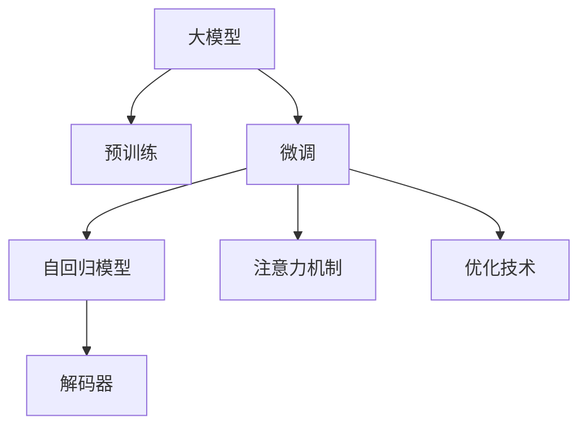
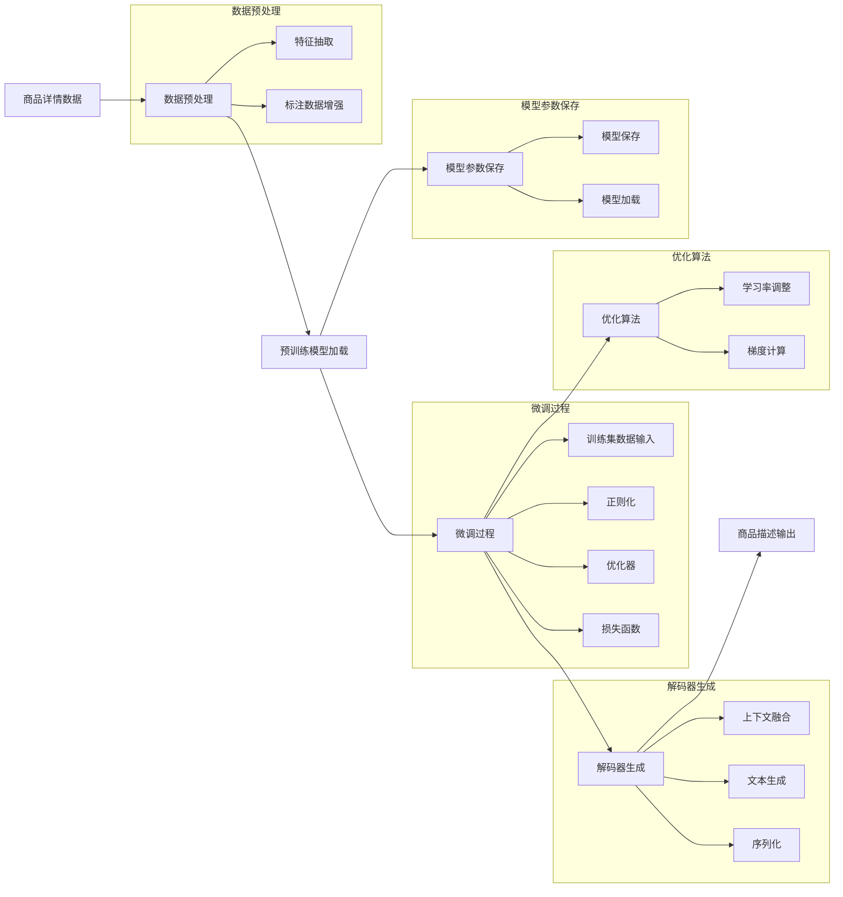

                 

# AI大模型在电商平台商品描述生成中的应用

> 关键词：AI大模型,商品描述生成,电商平台,自然语言处理(NLP),GPT模型,深度学习,注意力机制,自回归模型,解码器

## 1. 背景介绍

### 1.1 问题由来

在电商平台上，商品描述的精准性和生动性直接影响着用户的购物体验和转化率。一个清晰、准确、吸引人的商品描述，能够帮助用户更好地理解商品特点，提升购买意愿。然而，手动编写商品描述的效率低下，且质量难以保证。为了解决这个问题，电商平台亟需一种高效、自动化的商品描述生成技术，以提升用户购物体验，同时也减轻客服和运营团队的压力。

近年来，基于大模型的自然语言生成技术（NLG）迅速发展，尤其是通过预训练和微调的方式，生成高质量的文本描述成为可能。大模型如GPT-3在生成文本、对话等方面的卓越表现，引发了广泛的关注。本文聚焦于如何将大模型应用于电商平台商品描述生成，通过系统性梳理相关技术，探讨其实现原理、具体步骤和未来展望。

### 1.2 问题核心关键点

大模型在商品描述生成中的应用主要体现在以下几个关键点：

- **预训练与微调**：如何利用大模型在无标签文本语料上预训练，并通过特定任务的数据集微调，生成符合要求的商品描述。
- **自回归模型**：如何选择自回归模型（如GPT），并通过适当的序列化技术，使模型能够逐步生成详细的商品描述。
- **注意力机制**：如何通过注意力机制，使大模型能够聚焦于当前生成的描述内容，避免生成重复或不相关的信息。
- **解码器设计**：如何设计解码器，使大模型能够依据上下文信息生成高质量的商品描述，同时保持语句的流畅性和连贯性。
- **优化技术**：如何应用优化算法和技巧，提升模型训练和推理效率，确保生成的商品描述符合用户期望。

通过解决这些问题，可以构建一个高效、自动化的商品描述生成系统，显著提升电商平台的运营效率和用户购物体验。

## 2. 核心概念与联系

### 2.1 核心概念概述

为了深入理解大模型在商品描述生成中的应用，首先介绍几个核心概念：

- **大模型（Large Model）**：指基于深度学习架构（如Transformer）构建的、参数量较大的模型，如GPT系列、BERT等。通过在海量数据上进行预训练，学习到通用的语言表示。
- **预训练（Pre-training）**：指在大规模无标签文本数据上训练模型，学习通用语言知识的过程。常见的预训练任务包括自回归语言模型、掩码语言模型等。
- **微调（Fine-tuning）**：指在大模型的基础上，利用特定任务的数据集进行有监督学习，优化模型在该任务上的性能。
- **自然语言生成（Natural Language Generation, NLG）**：指利用机器学习模型生成自然语言文本，包括对话、摘要、描述等。
- **自回归模型（Autoregressive Model）**：指模型根据前面的信息，逐步生成后续文本，如GPT模型。
- **注意力机制（Attention Mechanism）**：指模型通过关注当前输入序列中的相关部分，提高生成文本的质量。
- **解码器（Decoder）**：指模型中的子模块，负责根据上下文信息生成文本。

这些概念之间通过合法的逻辑链条相连，形成了大模型应用于商品描述生成的框架，如图1所示：



### 2.2 核心概念原理和架构的 Mermaid 流程图

接下来，通过一个详细的Mermaid流程图，进一步展示大模型在商品描述生成中的具体应用流程：



这个流程图示意图涵盖了从数据预处理、模型微调、解码器生成、优化算法到最终商品描述输出的完整过程。

## 3. 核心算法原理 & 具体操作步骤

### 3.1 算法原理概述

商品描述生成的大模型应用，主要依赖于预训练和微调两个步骤。其核心思想是通过大模型在无标签数据上进行预训练，学习到通用的语言表示，再利用特定任务的数据集进行微调，优化模型在生成商品描述上的性能。

具体步骤如下：

1. **数据预处理**：收集电商平台的商品详情数据，将其转换为模型可以处理的格式，如文本序列。
2. **模型加载**：使用预训练的大模型（如GPT），将其加载到计算设备中。
3. **微调过程**：在商品详情数据上，应用有监督学习优化模型，使其生成符合要求的商品描述。
4. **解码器生成**：使用解码器，逐步生成商品描述的每个部分，确保描述连贯、准确。
5. **优化算法**：应用优化算法，调整模型参数，确保训练过程高效且模型性能稳定。

### 3.2 算法步骤详解

#### 3.2.1 数据预处理

商品详情数据通常包括商品名称、类别、价格、属性等，需要将其转换为模型能够处理的文本序列。具体步骤包括：

1. **文本编码**：将商品详情数据转换为标准化的文本格式，去除无关信息，如HTML标签、特殊字符等。
2. **特征抽取**：提取文本中的关键特征，如商品名称、属性、价格等，作为模型的输入。
3. **数据增强**：对标注数据进行一些随机变换，增加数据多样性，防止过拟合。

#### 3.2.2 模型加载

预训练的大模型（如GPT-3）通常以模型权重形式存在，需要加载到计算设备中。具体步骤如下：

1. **模型导入**：使用深度学习框架（如PyTorch、TensorFlow等），导入预训练模型权重。
2. **模型定制**：根据任务需求，对模型进行微调，定制化输出层和损失函数。
3. **设备选择**：选择适合硬件设备（如GPU、TPU），确保模型训练和推理速度。

#### 3.2.3 微调过程

微调过程主要包括以下几个步骤：

1. **损失函数选择**：根据任务类型，选择合适的损失函数，如交叉熵损失、均方误差损失等。
2. **优化器选择**：选择合适的优化算法，如Adam、SGD等，并设置学习率等超参数。
3. **正则化技术**：应用L2正则化、Dropout等正则化技术，防止过拟合。
4. **数据输入**：将微调数据输入模型，进行前向传播计算损失函数。
5. **反向传播**：计算参数梯度，使用优化算法更新模型参数。
6. **模型保存**：定期保存模型参数，以便后续部署和调整。

#### 3.2.4 解码器生成

解码器是生成商品描述的关键模块，其主要作用是利用上下文信息逐步生成文本。具体步骤如下：

1. **上下文融合**：将模型当前生成的文本片段与上下文信息进行融合，确保生成的文本连贯。
2. **文本生成**：使用解码器，根据上下文信息生成下一个文本片段。
3. **序列化**：将生成的文本片段序列化，形成完整的商品描述。

#### 3.2.5 优化算法

优化算法是微调过程的核心，主要作用是调整模型参数，提升生成文本的质量。具体步骤如下：

1. **学习率调整**：根据训练进度，调整学习率，避免参数更新的抖动。
2. **梯度计算**：计算模型参数的梯度，指导参数更新。
3. **模型更新**：使用优化算法，更新模型参数，优化生成文本的质量。

### 3.3 算法优缺点

**优点：**

1. **高效生成**：大模型通过预训练学习到通用的语言表示，能够高效生成高质量的商品描述。
2. **灵活性高**：模型的微调过程可以根据不同任务进行调整，适应不同的商品描述需求。
3. **可解释性**：大模型的内部结构和决策过程相对透明，便于理解生成文本的来源。
4. **广泛应用**：大模型已经在多种自然语言处理任务上取得优异表现，具有广泛的应用前景。

**缺点：**

1. **依赖标注数据**：商品描述生成任务依赖于标注数据，标注数据量不足可能导致模型性能不佳。
2. **计算资源消耗大**：预训练和微调大模型需要大量的计算资源，可能对硬件设备提出较高要求。
3. **过拟合风险**：微调过程中可能出现过拟合现象，特别是在标注数据较少的情况下。
4. **模型复杂度高**：大模型结构复杂，推理速度较慢，可能影响系统响应速度。

### 3.4 算法应用领域

商品描述生成技术可以应用于多种电商平台场景，具体包括：

1. **商品详情自动生成**：在商品发布时，自动生成商品详情页面，减少人工编写的工作量。
2. **客服聊天机器人**：利用商品描述生成技术，自动回答用户关于商品详情的问题。
3. **个性化推荐**：根据用户的历史行为，生成个性化的商品描述，提升推荐效果。
4. **商品搜索优化**：在搜索结果页面，自动生成商品描述，提高用户点击率。

## 4. 数学模型和公式 & 详细讲解 & 举例说明

### 4.1 数学模型构建

大模型在商品描述生成中的应用，主要基于自回归模型（如GPT）。假设商品详情数据序列为 $X=\{x_1, x_2, ..., x_n\}$，其中 $x_i$ 表示商品描述中的第 $i$ 个单词或字符。模型的生成过程可以看作一个自回归过程，即：

$$
P(X|Y) = \prod_{i=1}^{n} P(x_i|X_{< i}, Y)
$$

其中 $X_{< i}$ 表示到第 $i$ 个单词之前的所有单词。

### 4.2 公式推导过程

以GPT模型为例，其生成过程基于注意力机制和自回归模型。假设模型的编码为 $H_{< i}$，解码器为 $H_i$，目标单词为 $x_t$，则生成过程的公式推导如下：

1. **编码器输出**：

$$
H_i = \text{Encoder}(X_{< i}, H_{< i})
$$

2. **注意力机制**：

$$
\alpha_{ij} = \frac{e^{z_{ij}}}{\sum_{j=1}^{n}e^{z_{ij}}}
$$

其中 $z_{ij} = u^\top \tanh(v^\top [H_i; X_j])$，$u$ 和 $v$ 为注意力机制的参数。

3. **解码器输出**：

$$
H_i = \text{Attention}(H_{< i}, H_i, X_i, \alpha)
$$

4. **目标单词概率**：

$$
P(x_t|X_{< t}, Y) = \text{softmax}(W^\top \tanh(H_t + Ux_t + VY))
$$

其中 $W$、$U$、$V$ 为模型参数。

### 4.3 案例分析与讲解

以商品描述生成为例，使用GPT模型进行数学模型构建和公式推导。具体步骤如下：

1. **数据预处理**：将商品详情数据转换为文本序列，并进行特征抽取和数据增强。
2. **模型加载**：加载预训练的GPT模型，并进行微调适配。
3. **解码器生成**：使用GPT的解码器，逐步生成商品描述。
4. **优化算法**：应用优化算法，调整模型参数，提升生成文本的质量。

以一个简单的商品描述生成任务为例，我们假设商品详情数据为“手机壳，颜色黑色，材质硬塑料，价格100元”，其生成过程如下：

1. **编码器输出**：根据商品详情数据，生成初始编码 $H_1$。
2. **注意力机制**：将初始编码与目标单词序列进行注意力计算，生成上下文表示 $H_2$。
3. **解码器输出**：根据上下文表示和目标单词序列，生成下一个单词 $x_2$。
4. **目标单词概率**：根据生成单词的上下文表示，计算下一个单词的概率分布。
5. **输出结果**：根据概率分布，选择最可能的单词作为生成结果，重复上述步骤，生成完整的商品描述。

## 5. 项目实践：代码实例和详细解释说明

### 5.1 开发环境搭建

以下是使用Python和PyTorch框架搭建商品描述生成系统的开发环境配置流程：

1. 安装Anaconda：从官网下载并安装Anaconda，用于创建独立的Python环境。

2. 创建并激活虚拟环境：
```bash
conda create -n pytorch-env python=3.8 
conda activate pytorch-env
```

3. 安装PyTorch：根据CUDA版本，从官网获取对应的安装命令。例如：
```bash
conda install pytorch torchvision torchaudio cudatoolkit=11.1 -c pytorch -c conda-forge
```

4. 安装HuggingFace Transformers库：
```bash
pip install transformers
```

5. 安装各类工具包：
```bash
pip install numpy pandas scikit-learn matplotlib tqdm jupyter notebook ipython
```

完成上述步骤后，即可在`pytorch-env`环境中开始商品描述生成系统的开发。

### 5.2 源代码详细实现

下面以GPT模型为例，给出使用Transformers库进行商品描述生成的PyTorch代码实现：

```python
from transformers import GPT2Tokenizer, GPT2LMHeadModel

# 加载预训练模型和分词器
tokenizer = GPT2Tokenizer.from_pretrained('gpt2')
model = GPT2LMHeadModel.from_pretrained('gpt2')

# 商品详情数据
item_info = "手机壳，颜色黑色，材质硬塑料，价格100元"

# 数据预处理
encoded_input = tokenizer.encode(item_info, return_tensors='pt')

# 模型前向传播
outputs = model.generate(encoded_input)

# 解码器输出
decoded_output = tokenizer.decode(outputs[0], skip_special_tokens=True)

print(decoded_output)
```

这段代码展示了商品详情数据的预处理、模型加载和生成过程。通过简单的代码实现，即可快速获得商品描述的生成结果。

### 5.3 代码解读与分析

接下来，详细解读上述代码中的关键步骤和实现细节：

1. **分词器加载**：使用GPT-2的分词器，将商品详情数据转换为模型能够处理的token序列。
2. **预训练模型加载**：加载预训练的GPT-2模型，将其作为生成器的输入。
3. **数据预处理**：将商品详情数据编码为token序列，并转换为PyTorch张量格式。
4. **模型前向传播**：将编码后的输入序列输入模型，进行前向传播计算。
5. **解码器输出**：将模型输出解码为自然语言文本。
6. **输出结果**：打印生成的商品描述文本。

## 6. 实际应用场景

### 6.1 智能客服

电商平台可以利用商品描述生成技术，自动生成智能客服的回复内容，提升客服效率和用户体验。例如，当用户询问商品信息时，智能客服可以即时生成详细的商品描述，解答用户问题。

### 6.2 个性化推荐

基于商品描述生成技术，电商平台可以生成个性化的商品描述，用于提升推荐系统的效果。例如，根据用户的浏览记录和偏好，生成个性化商品描述，吸引用户点击和购买。

### 6.3 搜索优化

商品描述生成技术可以应用于商品搜索结果的优化，提高用户的点击率和转化率。例如，在搜索结果页面中，自动生成商品描述，吸引用户进一步查看商品详情。

### 6.4 未来应用展望

未来，商品描述生成技术将在电商平台中发挥更大的作用，成为提升用户体验和运营效率的重要工具。随着技术的发展，商品描述生成的效果将不断提升，应用场景也将更加广泛。

## 7. 工具和资源推荐

### 7.1 学习资源推荐

为了帮助开发者掌握商品描述生成技术的实现细节，这里推荐一些优质的学习资源：

1. **《深度学习》**：Ian Goodfellow等著，系统介绍了深度学习的基本概念和算法，适合初学者。
2. **《自然语言处理综述》**：Yoav Goldberg等著，全面介绍了自然语言处理的研究现状和最新进展，适合进阶学习。
3. **《自然语言处理实战》**：Christopher Manning等著，结合实际案例，介绍了自然语言处理的实践技巧。
4. **HuggingFace官方文档**：包含丰富的模型介绍、代码示例和最佳实践，是深度学习开发者必备的资源。
5. **《深度学习与自然语言处理》**：在线课程，由斯坦福大学开设，讲解深度学习和自然语言处理的基本原理和算法。

### 7.2 开发工具推荐

以下是几款用于商品描述生成系统开发的常用工具：

1. **PyTorch**：基于Python的开源深度学习框架，灵活的动态计算图，适合快速迭代研究。
2. **TensorFlow**：由Google主导开发的开源深度学习框架，生产部署方便，适合大规模工程应用。
3. **Transformers库**：HuggingFace开发的NLP工具库，集成了多个预训练模型，支持PyTorch和TensorFlow。
4. **Jupyter Notebook**：交互式笔记本，支持代码编辑、执行和展示，适合快速原型开发和共享。
5. **GitHub**：代码托管平台，支持版本控制和协作开发，方便团队共同维护商品描述生成系统的代码。

### 7.3 相关论文推荐

商品描述生成技术的发展源于学界的持续研究，以下是几篇奠基性的相关论文，推荐阅读：

1. **Attention is All You Need**：提出的Transformer结构，开启了NLP领域的预训练大模型时代。
2. **Language Models are Unsupervised Multitask Learners**：展示了基于语言模型的无监督多任务学习框架。
3. **A Survey on the Applications of Natural Language Generation in E-Commerce**：综述了自然语言生成在电商领域的应用研究现状。
4. **Generating Product Descriptions with Deep Learning**：提出基于深度学习模型自动生成商品描述的方法。
5. **Semantic Sequence Generation with Hierarchical Attention Networks**：提出使用层次注意力网络生成语义序列的技术，适用于商品描述生成。

这些论文代表了大语言模型在商品描述生成技术的发展脉络，通过学习这些前沿成果，可以帮助研究者把握学科前进方向，激发更多的创新灵感。

## 8. 总结：未来发展趋势与挑战

### 8.1 研究成果总结

本文系统介绍了大模型在电商平台商品描述生成中的应用，通过详细的算法原理和操作步骤，展示了商品描述生成的实现过程。具体包括：

1. **数据预处理**：将商品详情数据转换为模型可以处理的文本序列。
2. **模型加载**：加载预训练的大模型，并进行微调适配。
3. **解码器生成**：使用解码器逐步生成商品描述。
4. **优化算法**：调整模型参数，提升生成文本的质量。

### 8.2 未来发展趋势

展望未来，商品描述生成技术将呈现以下几个发展趋势：

1. **模型规模增大**：预训练大模型的参数量将持续增长，模型在商品描述生成中的应用效果将不断提升。
2. **技术多样化**：除了GPT模型，还将出现更多先进的自然语言生成模型，如T5、M2M-100等。
3. **应用场景扩展**：商品描述生成技术将在更多电商场景中得到应用，如客服聊天、个性化推荐等。
4. **跨模态融合**：结合视觉、语音等多模态信息，生成更加丰富多样的商品描述。
5. **用户交互增强**：通过自然语言生成技术，实现更智能、自然的人机交互体验。

### 8.3 面临的挑战

尽管商品描述生成技术在电商平台中取得了初步成功，但仍面临以下挑战：

1. **数据质量问题**：商品详情数据质量参差不齐，数据标注成本高，可能影响生成效果。
2. **计算资源消耗大**：预训练和微调大模型需要大量的计算资源，可能对硬件设备提出较高要求。
3. **模型泛化能力不足**：商品描述生成模型对不同商品类别和描述风格适应性较差，需要进一步优化。
4. **技术门槛高**：深度学习和自然语言生成技术复杂，需要专业知识，一般开发者难以快速上手。

### 8.4 研究展望

针对上述挑战，未来的研究方向包括：

1. **数据增强技术**：研究如何通过数据增强技术提高商品描述生成的效果。
2. **模型优化算法**：研究更高效的模型优化算法，降低计算资源消耗。
3. **多模态融合**：结合视觉、语音等多模态信息，提高商品描述生成的效果。
4. **模型自适应能力**：研究模型对不同商品类别和描述风格的自适应能力，提升生成效果。
5. **跨领域迁移学习**：研究模型在不同领域间的迁移学习技术，提高通用性。

总之，商品描述生成技术在电商平台中具有广阔的应用前景，但如何进一步提升生成效果、降低计算成本、增强技术可访问性，将是未来研究的重要方向。相信随着技术的不断进步，商品描述生成技术将为电商平台带来更高效、更智能的运营体验。

## 9. 附录：常见问题与解答

### Q1：商品描述生成技术为什么需要大模型支持？

A: 大模型通过预训练学习到通用的语言表示，具有强大的语言理解和生成能力。小模型在处理复杂的自然语言生成任务时，容易过拟合或产生不合理的输出，而大模型通过更大的参数量和更多的数据，能够更好地处理这类任务，生成高质量的商品描述。

### Q2：商品描述生成技术中的预训练和微调有什么区别？

A: 预训练是指在大规模无标签数据上训练模型，学习通用的语言表示。微调是指在预训练模型的基础上，使用特定任务的数据集进行有监督学习，优化模型在该任务上的性能。商品描述生成技术中，预训练和微调是相互补充的，预训练提供了通用的语言表示，微调则进一步适应商品描述生成任务，提高生成文本的质量。

### Q3：商品描述生成技术中使用的模型有哪些？

A: 商品描述生成技术中常用的模型包括自回归模型（如GPT）、变分自编码器（VAE）、注意力机制等。其中，GPT模型因其在自然语言生成任务上的卓越表现，成为商品描述生成中的主流选择。

### Q4：商品描述生成技术中使用的优化算法有哪些？

A: 商品描述生成技术中常用的优化算法包括Adam、SGD、RMSprop等。这些算法通过调整模型参数，最小化生成文本的损失函数，提高生成文本的质量。

### Q5：商品描述生成技术中使用的注意力机制有哪些？

A: 商品描述生成技术中常用的注意力机制包括单头注意力、多头注意力、注意力机制的变种等。这些机制通过关注当前输入序列中的相关部分，提高生成文本的质量。

---

作者：禅与计算机程序设计艺术 / Zen and the Art of Computer Programming

