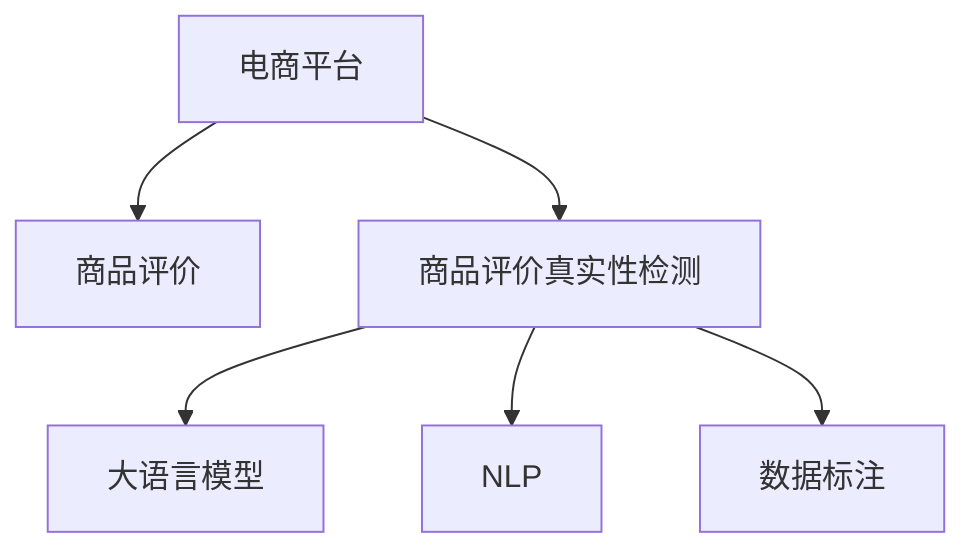

                 

# AI大模型在电商平台商品评价真实性检测中的应用

> 关键词：
- 电商平台
- 商品评价
- 真实性检测
- 大模型
- 自然语言处理
- 数据标注
- 假冒评价识别

## 1. 背景介绍

随着电商行业的迅猛发展，商品评价作为用户对商品质量、性能、满意度等方面的反馈，已经成为电商平台决策的重要依据。然而，真实性问题也随之凸显：商家或竞争对手可能会雇佣水军，发布大量虚假好评，影响其他消费者做出客观决策。平台不仅需要积累真实评价，还需要过滤虚假评论，维护平台声誉和交易公信力。

大语言模型（Large Language Model, LLM）作为当前NLP领域的前沿技术，具备丰富的语言理解和生成能力，能在海量文本数据上进行预训练，提取通用语言知识。结合自然语言处理(Natural Language Processing, NLP)技术，可以用于电商平台商品评价的真实性检测。

本博文旨在介绍如何利用大模型技术进行商品评价真实性检测，从算法原理、实现方法、应用场景等多个维度进行系统阐述。

## 2. 核心概念与联系

### 2.1 核心概念概述

为更好地理解大模型在商品评价真实性检测中的应用，本节将介绍几个关键概念及其内在联系：

- **电商平台**：提供商品展示、交易、评价等服务的在线平台，如淘宝、京东、亚马逊等。
- **商品评价**：用户对所购商品发布的评论、评分等信息，包括文字评价、图片、视频等，是电商平台的重要数据来源。
- **商品评价真实性检测**：识别评价是否为真实购买者发布，并区分恶意刷单、竞品评价等情况，过滤虚假评价。
- **大语言模型**：以自回归(如GPT)或自编码(如BERT)为代表的，通过大规模无标签文本数据进行预训练的语言模型。
- **自然语言处理(NLP)**：使用计算机算法处理和分析自然语言数据的技术，涉及文本分类、情感分析、实体识别、问答、生成等多种任务。
- **数据标注**：给定数据集，由标注者为其添加标签，标注过程包括监督标注、半监督标注、无监督标注等。

这些概念之间的逻辑关系可以通过以下Mermaid流程图来展示：



这个流程图展示了大语言模型、NLP、数据标注与电商平台商品评价真实性检测之间的联系：

1. 电商平台收集商品评价，为后续分析提供数据基础。
2. 商品评价真实性检测系统对评价文本进行分析，判别其真实性。
3. 利用大语言模型进行深度特征提取，提高检测系统的准确性。
4. 通过NLP技术，对评价文本进行文本分类、实体识别、情感分析等处理。
5. 数据标注过程为模型训练提供有标签样本，提升模型性能。

## 3. 核心算法原理 & 具体操作步骤

### 3.1 算法原理概述

商品评价真实性检测的核心在于识别评价是否为真实购买者发布。具体流程如下：

1. **数据收集**：从电商平台收集商品评价数据，划分为训练集、验证集和测试集。
2. **数据预处理**：对评价文本进行分词、去除停用词、标注等处理。
3. **模型训练**：利用大语言模型进行文本特征提取，结合NLP技术进行文本分类、实体识别等任务，构建商品评价真实性检测模型。
4. **模型评估**：在验证集上评估模型性能，调整参数和超参数，确保模型准确性。
5. **模型部署**：将训练好的模型部署到实际场景中，实时检测商品评价真实性。

### 3.2 算法步骤详解

下面详细介绍大模型在商品评价真实性检测中的具体步骤：

**Step 1: 数据收集与预处理**

- **数据收集**：从电商平台API接口收集商品评价，包括评分、文字评价、图片、视频等。注意去除重复和异常数据。
- **数据预处理**：使用NLTK、spaCy等工具，对文本进行分词、去除停用词、词形还原等处理，提升模型输入数据的规范性。

**Step 2: 特征提取**

- **预训练模型选择**：选择BERT、GPT等预训练模型作为特征提取器，这些模型经过大规模语料训练，具备强大的语言理解能力。
- **特征提取步骤**：将预训练模型应用于评价文本，提取其文本特征。对于文本分类任务，可提取文本的平均词向量作为特征。

**Step 3: 模型构建与训练**

- **模型构建**：使用TensorFlow、PyTorch等深度学习框架构建商品评价真实性检测模型，如Logistic回归、SVM、深度神经网络等。
- **模型训练**：将预训练模型的特征提取结果作为输入，训练商品评价真实性检测模型，在标注数据集上进行有监督学习。

**Step 4: 模型评估与调优**

- **模型评估**：使用验证集对模型进行评估，计算准确率、召回率、F1值等指标，调整模型超参数。
- **模型调优**：通过网格搜索或随机搜索方法，调整学习率、批次大小、正则化参数等，提高模型性能。

**Step 5: 模型部署**

- **模型部署**：将训练好的模型部署到电商平台后台或第三方服务中，实时接收评价数据，进行真实性检测。
- **系统集成**：将检测结果与电商平台进行集成，自动标记虚假评价，并采取相应的处理措施。

### 3.3 算法优缺点

大模型在商品评价真实性检测中的应用，具备以下优点：

- **高效性**：大模型能够自动提取文本特征，省去了手工特征工程的工作，显著提升模型构建效率。
- **准确性**：大模型具备强大的语言理解能力，能够识别多种语言模式和表达方式，提升检测准确性。
- **可扩展性**：大模型能够处理大规模数据，适用于电商平台大规模的商品评价检测任务。

但同时，也存在以下局限：

- **依赖标注数据**：模型的准确性依赖于标注数据的数量和质量，获取高质量标注数据成本较高。
- **高计算资源需求**：预训练大模型需要大量的计算资源和时间，对计算硬件有较高要求。
- **可能引入偏见**：预训练模型可能学习到一些社会偏见或有害信息，影响模型公平性和安全性。

### 3.4 算法应用领域

商品评价真实性检测技术不仅适用于电商平台，还广泛应用于社交媒体、新闻评论、金融等领域。例如：

- **社交媒体**：识别和过滤恶意评论、网络谣言等，维护社区秩序和公信力。
- **新闻评论**：对新闻报道进行情感分析，判断评论真实性，避免假新闻的传播。
- **金融领域**：检测金融评论的真实性，保护投资者权益。
- **客户服务**：在客户反馈中识别虚假评价，提升服务质量。

## 4. 数学模型和公式 & 详细讲解 & 举例说明

### 4.1 数学模型构建

假设平台收集了$m$条商品评价，每条评价$x_i$包含文本部分$T_i$，标签部分$y_i$表示该评价是否为真实购买者发布。对于文本分类任务，将文本通过大语言模型提取词向量$\overrightarrow{v_i}$，构建以下分类模型：

$$
\hat{y} = \sigma\left(\mathbf{W} \cdot \overrightarrow{v_i} + b\right)
$$

其中$\sigma$为激活函数，$\mathbf{W}$为权重矩阵，$b$为偏置项。通过最小化交叉熵损失函数：

$$
\mathcal{L} = -\frac{1}{m} \sum_{i=1}^{m} \left(y_i \log \hat{y_i} + (1 - y_i) \log (1 - \hat{y_i})\right)
$$

训练模型得到最优权重$\mathbf{W}$和偏置$b$。

### 4.2 公式推导过程

下面给出模型推导的详细过程：

- **损失函数推导**：
$$
\mathcal{L} = -\frac{1}{m} \sum_{i=1}^{m} \left(y_i \log \hat{y_i} + (1 - y_i) \log (1 - \hat{y_i})\right)
$$
- **模型训练过程**：
$$
\hat{y} = \sigma\left(\mathbf{W} \cdot \overrightarrow{v_i} + b\right)
$$
- **梯度更新**：
$$
\begin{aligned}
&\frac{\partial \mathcal{L}}{\partial \mathbf{W}} = \frac{1}{m} \sum_{i=1}^{m} \left(y_i \hat{y_i} - (1 - y_i) (1 - \hat{y_i})\right) \overrightarrow{v_i} \\
&\frac{\partial \mathcal{L}}{\partial b} = \frac{1}{m} \sum_{i=1}^{m} \left(y_i - \hat{y_i}\right)
\end{aligned}
$$
- **更新参数**：
$$
\mathbf{W} \leftarrow \mathbf{W} - \eta \frac{\partial \mathcal{L}}{\partial \mathbf{W}}, b \leftarrow b - \eta \frac{\partial \mathcal{L}}{\partial b}
$$

### 4.3 案例分析与讲解

以商品评价分类任务为例，使用大模型进行特征提取和分类。假设平台收集了2000条商品评价数据，其中1000条为真实评价，1000条为虚假评价。使用BERT作为预训练模型，进行特征提取，得到每条评价的BERT向量$\overrightarrow{v_i}$。将向量作为输入，使用SVM构建分类模型，具体步骤如下：

1. **数据准备**：将评价文本和标签构建成训练集$D=\{(x_i, y_i)\}_{i=1}^{2000}$。
2. **特征提取**：使用BERT模型提取向量$\overrightarrow{v_i}$，得到特征矩阵$\mathbf{V}$。
3. **模型训练**：使用SVM算法，将特征矩阵$\mathbf{V}$和标签$y$作为输入，训练分类模型$h$。
4. **模型评估**：在验证集上评估模型性能，计算准确率、召回率、F1值等指标。
5. **模型部署**：将训练好的模型部署到电商平台，实时检测商品评价真实性。

## 5. 项目实践：代码实例和详细解释说明

### 5.1 开发环境搭建

在进行商品评价真实性检测的实践时，需要准备好开发环境。以下是使用Python进行PyTorch开发的环境配置流程：

1. 安装Anaconda：从官网下载并安装Anaconda，用于创建独立的Python环境。

2. 创建并激活虚拟环境：
```bash
conda create -n nlp-env python=3.8 
conda activate nlp-env
```

3. 安装PyTorch：根据CUDA版本，从官网获取对应的安装命令。例如：
```bash
conda install pytorch torchvision torchaudio cudatoolkit=11.1 -c pytorch -c conda-forge
```

4. 安装Transformer库：
```bash
pip install transformers
```

5. 安装各类工具包：
```bash
pip install numpy pandas scikit-learn matplotlib tqdm jupyter notebook ipython
```

完成上述步骤后，即可在`nlp-env`环境中开始项目实践。

### 5.2 源代码详细实现

下面我们以商品评价分类任务为例，给出使用Transformers库对BERT模型进行微调的PyTorch代码实现。

```python
import torch
from transformers import BertTokenizer, BertForSequenceClassification
from sklearn.model_selection import train_test_split
from sklearn.metrics import accuracy_score, precision_score, recall_score, f1_score

# 数据准备
texts = ["..."]  # 真实评价文本
labels = [1, 0, ...]  # 真实评价标记，1为真实，0为虚假

# 分词器初始化
tokenizer = BertTokenizer.from_pretrained('bert-base-cased')

# 构造训练集和测试集
train_texts, test_texts, train_labels, test_labels = train_test_split(texts, labels, test_size=0.2, random_state=42)

# 模型构建
model = BertForSequenceClassification.from_pretrained('bert-base-cased', num_labels=2)

# 优化器设置
optimizer = torch.optim.Adam(model.parameters(), lr=2e-5)

# 模型训练
for epoch in range(3):
    model.train()
    for text, label in zip(train_texts, train_labels):
        input_ids = tokenizer(text, return_tensors='pt', padding=True, truncation=True).input_ids
        attention_mask = tokenizer(text, return_tensors='pt', padding=True, truncation=True).attention_mask
        output = model(input_ids, attention_mask=attention_mask, labels=label)
        loss = output.loss
        optimizer.zero_grad()
        loss.backward()
        optimizer.step()
    
    model.eval()
    with torch.no_grad():
        predictions = []
        labels = []
        for text, label in zip(test_texts, test_labels):
            input_ids = tokenizer(text, return_tensors='pt', padding=True, truncation=True).input_ids
            attention_mask = tokenizer(text, return_tensors='pt', padding=True, truncation=True).attention_mask
            output = model(input_ids, attention_mask=attention_mask)
            predictions.append(output.logits.argmax(dim=1).item())
            labels.append(label)
        accuracy = accuracy_score(labels, predictions)
        precision = precision_score(labels, predictions)
        recall = recall_score(labels, predictions)
        f1 = f1_score(labels, predictions)
        print(f"Epoch {epoch+1}, Accuracy: {accuracy:.2f}, Precision: {precision:.2f}, Recall: {recall:.2f}, F1: {f1:.2f}")
```

### 5.3 代码解读与分析

让我们再详细解读一下关键代码的实现细节：

**数据准备**：
- 文本数据`texts`包含真实评价的文本内容。
- 标签数据`labels`表示每条评价是否为真实购买者发布，1表示真实，0表示虚假。

**模型构建**：
- 选择BERT模型作为特征提取器，`num_labels`参数指定分类数目。

**模型训练**：
- 使用Adam优化器进行梯度更新。
- 在每个epoch内，对训练集文本进行迭代，计算损失并反向传播更新模型参数。
- 在每个epoch结束后，对测试集进行评估，计算准确率、精确率、召回率、F1值等指标。

## 6. 实际应用场景

### 6.1 电商平台

电商平台使用大模型进行商品评价真实性检测，能够帮助平台过滤虚假评价，提升用户体验和信任度。例如，某电商平台收集到10000条商品评价数据，其中2000条为虚假评价。通过大模型进行检测，可以识别并标记这些虚假评价，从而提升其他消费者的信任感，增加真实评价的比重。

**应用场景**：
- 实时监控：对每条评价进行实时检测，标记为虚假评价。
- 数据清洗：对历史评价数据进行清洗，去除虚假评价。
- 搜索结果优化：根据评价真实性对商品排名进行优化，提高搜索相关性。

### 6.2 社交媒体

社交媒体平台使用大模型进行评论真实性检测，可以过滤恶意评论和虚假消息，维护社区秩序。例如，某社交媒体平台每天接收100万条评论数据，其中5万条为虚假评论。通过大模型进行检测，可以识别并标记这些虚假评论，从而提高平台的用户体验和公信力。

**应用场景**：
- 社区治理：自动检测并过滤虚假评论，减少社区噪声。
- 舆情分析：对热点话题的评论进行筛选，避免虚假消息传播。
- 用户管理：对恶意评论的用户进行限制或封禁。

### 6.3 金融领域

金融机构使用大模型进行客户评价真实性检测，可以过滤虚假评价和误导性评论，保护投资者权益。例如，某金融机构每天接收10万条金融评价数据，其中1000条为虚假评价。通过大模型进行检测，可以识别并标记这些虚假评价，从而提升用户对金融产品的信任度。

**应用场景**：
- 风险控制：过滤虚假评价，避免误导性信息。
- 产品优化：根据真实评价进行产品改进和优化。
- 用户服务：提升客户服务质量，增加用户粘性。

## 7. 工具和资源推荐

### 7.1 学习资源推荐

为了帮助开发者系统掌握商品评价真实性检测的理论基础和实践技巧，这里推荐一些优质的学习资源：

1. 《自然语言处理综述》系列博文：由大模型技术专家撰写，深入浅出地介绍了NLP的基础知识、经典模型和前沿技术。

2. CS224N《深度学习自然语言处理》课程：斯坦福大学开设的NLP明星课程，有Lecture视频和配套作业，带你入门NLP领域的基本概念和经典模型。

3. 《深度学习与自然语言处理》书籍：清华大学出版社出版的NLP经典教材，系统介绍了NLP的理论和应用，涵盖大量实战案例。

4. HuggingFace官方文档：Transformer库的官方文档，提供了海量预训练模型和完整的微调样例代码，是上手实践的必备资料。

5. 《NLP基础与实战》课程：Coursera上的NLP入门课程，涵盖NLP的基本理论和实际应用，适合初学者学习。

通过对这些资源的学习实践，相信你一定能够快速掌握商品评价真实性检测的精髓，并用于解决实际的NLP问题。

### 7.2 开发工具推荐

高效的开发离不开优秀的工具支持。以下是几款用于商品评价真实性检测开发的常用工具：

1. PyTorch：基于Python的开源深度学习框架，灵活动态的计算图，适合快速迭代研究。大部分预训练语言模型都有PyTorch版本的实现。

2. TensorFlow：由Google主导开发的开源深度学习框架，生产部署方便，适合大规模工程应用。同样有丰富的预训练语言模型资源。

3. Transformers库：HuggingFace开发的NLP工具库，集成了众多SOTA语言模型，支持PyTorch和TensorFlow，是进行商品评价真实性检测任务的开发的利器。

4. Weights & Biases：模型训练的实验跟踪工具，可以记录和可视化模型训练过程中的各项指标，方便对比和调优。与主流深度学习框架无缝集成。

5. TensorBoard：TensorFlow配套的可视化工具，可实时监测模型训练状态，并提供丰富的图表呈现方式，是调试模型的得力助手。

6. Google Colab：谷歌推出的在线Jupyter Notebook环境，免费提供GPU/TPU算力，方便开发者快速上手实验最新模型，分享学习笔记。

合理利用这些工具，可以显著提升商品评价真实性检测任务的开发效率，加快创新迭代的步伐。

### 7.3 相关论文推荐

商品评价真实性检测技术的发展源于学界的持续研究。以下是几篇奠基性的相关论文，推荐阅读：

1. "A Survey of Deep Learning Techniques for Automated Deception Detection in Text"：综述了深度学习在文本虚假性检测中的应用，涵盖各种模型和任务。

2. "A Survey of Spam Detection Techniques and Tools"：综述了垃圾信息检测技术，介绍了各种特征提取和分类方法。

3. "A Survey on Multi-Aspect Sentiment Analysis for Product Reviews"：综述了产品评论多维度情感分析，介绍了NLP技术在评论分析中的应用。

4. "Text Classification Using Deep Learning and Natural Language Processing"：介绍了深度学习和NLP在文本分类任务中的应用，提供了实用的代码示例。

5. "Natural Language Processing for Fraud Detection in E-commerce"：介绍了NLP在电商领域的应用，包括评论真实性检测和假冒评价识别。

这些论文代表了大语言模型在商品评价真实性检测技术的发展脉络。通过学习这些前沿成果，可以帮助研究者把握学科前进方向，激发更多的创新灵感。

## 8. 总结：未来发展趋势与挑战

### 8.1 总结

本文对商品评价真实性检测的实现进行了全面系统的介绍。首先阐述了商品评价真实性检测的背景和意义，明确了大模型在其中的应用价值。其次，从算法原理到实现方法，详细讲解了基于大模型的商品评价真实性检测技术，给出了完整的代码实例。同时，本文还探讨了商品评价真实性检测在电商平台、社交媒体、金融等多个领域的应用前景，展示了大模型的广泛应用潜力。此外，本文精选了商品评价真实性检测的相关学习资源，力求为读者提供全方位的技术指引。

通过本文的系统梳理，可以看到，大模型技术在商品评价真实性检测中的应用，不仅能够提升评价数据的质量，还能有效过滤虚假评价，维护平台声誉。未来，伴随大语言模型和微调方法的持续演进，商品评价真实性检测技术必将在大规模电商平台上得到广泛应用，提升电商平台的决策科学性和用户满意度。

### 8.2 未来发展趋势

展望未来，大模型在商品评价真实性检测领域的应用将呈现以下几个发展趋势：

1. **模型规模持续增大**：随着算力成本的下降和数据规模的扩张，预训练语言模型的参数量还将持续增长。超大规模语言模型蕴含的丰富语言知识，有望支撑更加复杂多变的商品评价检测任务。

2. **多模态融合**：未来会进一步拓展到图像、视频、语音等多模态数据检测，融合多模态信息的商品评价检测系统将具备更强的鲁棒性和泛化能力。

3. **参数高效微调**：开发更加参数高效的微调方法，在固定大部分预训练参数的情况下，只更新极少量的任务相关参数，实现更加轻量级、实时性的部署。

4. **数据生成技术**：结合生成对抗网络（GAN）等技术，生成假评价数据，用于模型训练和测试，提升模型的泛化性和鲁棒性。

5. **实时反馈与优化**：利用在线学习技术，实时接收评价数据，动态更新模型，保持模型的最新状态。

6. **联邦学习**：将本地数据本地训练的模型参数上传到云端，进行聚合训练，提升模型性能，同时保护数据隐私。

以上趋势凸显了大模型在商品评价真实性检测技术的应用前景。这些方向的探索发展，必将进一步提升商品评价检测的准确性，满足电商平台的实际需求。

### 8.3 面临的挑战

尽管大模型在商品评价真实性检测技术的应用中取得了显著效果，但在迈向更加智能化、普适化应用的过程中，它仍面临着诸多挑战：

1. **标注数据依赖**：模型的准确性依赖于标注数据的数量和质量，获取高质量标注数据成本较高。如何进一步降低微调对标注样本的依赖，将是一大难题。

2. **计算资源消耗**：预训练大模型需要大量的计算资源和时间，对计算硬件有较高要求。如何在保证模型性能的同时，优化计算资源使用，降低成本，是重要的优化方向。

3. **模型偏见问题**：预训练模型可能学习到一些社会偏见或有害信息，影响模型公平性和安全性。如何从数据和算法层面消除模型偏见，确保模型的公正性和可靠性，还需要更多研究和实践。

4. **模型可解释性不足**：当前的大模型如BERT、GPT等，往往像黑盒系统，难以解释其内部工作机制和决策逻辑。对于医疗、金融等高风险应用，算法的可解释性和可审计性尤为重要。

5. **实时处理能力**：电商平台需要处理大量的实时评价数据，大模型在实时处理能力上存在不足。如何在保证模型准确性的同时，提升实时处理能力，是重要的技术挑战。

6. **跨平台兼容**：不同电商平台的数据格式和处理方式可能存在差异，大模型需要适配不同的平台环境，才能在各个平台上稳定运行。

### 8.4 研究展望

面对商品评价真实性检测面临的种种挑战，未来的研究需要在以下几个方面寻求新的突破：

1. **无监督和半监督学习**：摆脱对大规模标注数据的依赖，利用自监督学习、主动学习等无监督和半监督范式，最大限度利用非结构化数据，实现更加灵活高效的检测。

2. **数据生成技术**：结合生成对抗网络（GAN）等技术，生成假评价数据，用于模型训练和测试，提升模型的泛化性和鲁棒性。

3. **参数高效微调**：开发更加参数高效的微调方法，在固定大部分预训练参数的情况下，只更新极少量的任务相关参数，实现更加轻量级、实时性的部署。

4. **多模态融合**：结合图像、视频、语音等多模态信息，提升商品评价检测的准确性和鲁棒性。

5. **实时反馈与优化**：利用在线学习技术，实时接收评价数据，动态更新模型，保持模型的最新状态。

6. **联邦学习**：将本地数据本地训练的模型参数上传到云端，进行聚合训练，提升模型性能，同时保护数据隐私。

7. **可解释性研究**：开发可解释性强的模型，提供模型决策的逻辑和依据，增加模型的透明度和可靠性。

这些研究方向将进一步推动大模型在商品评价真实性检测中的应用，提升电商平台的决策科学性和用户满意度。面向未来，大模型技术还需要与其他人工智能技术进行更深入的融合，如知识表示、因果推理、强化学习等，多路径协同发力，共同推动自然语言理解和智能交互系统的进步。只有勇于创新、敢于突破，才能不断拓展语言模型的边界，让智能技术更好地造福人类社会。

## 9. 附录：常见问题与解答

**Q1: 大模型在商品评价真实性检测中的应用有什么优势？**

A: 大模型在商品评价真实性检测中的应用具备以下优势：

1. **高效性**：大模型能够自动提取文本特征，省去了手工特征工程的工作，显著提升模型构建效率。

2. **准确性**：大模型具备强大的语言理解能力，能够识别多种语言模式和表达方式，提升检测准确性。

3. **可扩展性**：大模型能够处理大规模数据，适用于电商平台大规模的商品评价检测任务。

**Q2: 大模型在商品评价真实性检测中如何处理数据标注？**

A: 大模型在商品评价真实性检测中的数据标注过程如下：

1. **数据收集**：从电商平台收集商品评价数据，包括评分、文字评价、图片、视频等。

2. **数据预处理**：使用NLTK、spaCy等工具，对文本进行分词、去除停用词、词形还原等处理，提升模型输入数据的规范性。

3. **数据标注**：由标注者对评价文本进行标注，标记每条评价是否为真实购买者发布，1表示真实，0表示虚假。

4. **标注数据集**：将标注后的文本和标签构建成训练集$D=\{(x_i, y_i)\}_{i=1}^{N}$，用于训练和评估商品评价检测模型。

**Q3: 大模型在商品评价真实性检测中如何处理多模态数据？**

A: 大模型在商品评价真实性检测中处理多模态数据的过程如下：

1. **多模态数据收集**：收集包含文本、图片、视频等多模态信息的商品评价数据。

2. **数据预处理**：对文本进行分词、去除停用词、词形还原等处理，对图片进行预处理（如缩放、裁剪、归一化等），对视频进行帧提取、特征提取等处理。

3. **多模态特征提取**：利用预训练大模型，对文本、图片、视频分别提取特征向量，形成多模态特征矩阵。

4. **融合特征**：将文本、图片、视频的特征向量进行融合，形成多模态特征向量。

5. **模型训练**：使用融合后的多模态特征向量训练商品评价检测模型。

6. **模型评估**：在测试集上评估模型性能，计算准确率、召回率、F1值等指标。

**Q4: 大模型在商品评价真实性检测中的数据生成技术有哪些？**

A: 大模型在商品评价真实性检测中的数据生成技术主要包括：

1. **生成对抗网络（GAN）**：利用GAN生成假评价数据，用于模型训练和测试，提升模型的泛化性和鲁棒性。

2. **半监督学习**：利用少量标注数据和大量未标注数据，通过半监督学习生成假评价数据，增强模型的泛化能力。

3. **数据增强**：通过回译、近义替换等方式扩充训练集，增加假评价数据的多样性。

4. **基于规则的生成**：根据预设规则生成假评价数据，如随机生成、合成数据等，用于模型训练和测试。

**Q5: 大模型在商品评价真实性检测中如何处理模型的实时反馈与优化？**

A: 大模型在商品评价真实性检测中处理模型的实时反馈与优化过程如下：

1. **在线学习**：利用在线学习技术，实时接收评价数据，动态更新模型，保持模型的最新状态。

2. **增量学习**：根据新的评价数据，不断更新模型参数，提升模型的鲁棒性和泛化能力。

3. **模型融合**：结合多个模型的输出结果，进行加权平均或投票，提升模型性能。

4. **模型压缩**：对模型进行压缩，减少内存占用，提升推理速度。

5. **分布式训练**：利用分布式训练技术，对大规模数据进行并行处理，加速模型训练过程。

---

作者：禅与计算机程序设计艺术 / Zen and the Art of Computer Programming

