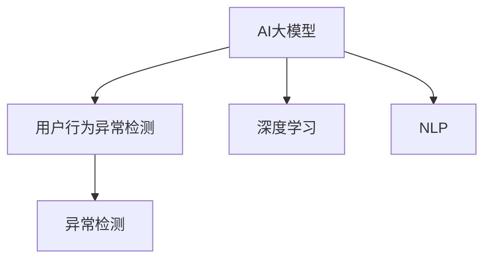
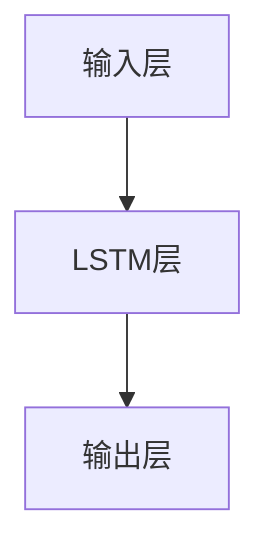

                 

# AI大模型在电商平台用户行为异常检测中的应用

> 关键词：电商平台, 用户行为, 异常检测, AI大模型, 深度学习, 自然语言处理(NLP), 预测模型

## 1. 背景介绍

### 1.1 问题由来

随着电子商务平台的快速发展，电商平台的用户行为数据量迅猛增长，用户行为分析在用户画像构建、个性化推荐、欺诈检测等方面具有重要意义。然而，传统的数据分析方法难以应对海量数据和复杂数据结构的挑战，而人工智能（AI）技术尤其是深度学习模型为用户行为分析提供了新的思路。

AI大模型在自然语言处理(NLP)、计算机视觉、语音识别等领域取得了显著成效，而在用户行为分析领域的应用则相对较少。电商平台的用户行为数据通常包含结构化数据和半结构化数据，用户的行为模式、交易记录、评论信息等数据类型多样，需要复杂的分析和处理。AI大模型，尤其是基于深度学习的大模型，通过强大的自监督学习和迁移学习能力，可以提取和利用用户行为数据中的丰富信息，提升用户行为分析的精度和效率。

### 1.2 问题核心关键点

为了有效解决电商平台用户行为异常检测的问题，AI大模型需要具备以下几个核心能力：

1. **大数据处理能力**：能够高效处理和分析海量用户行为数据，提取有价值的用户行为模式和异常特征。
2. **特征提取能力**：能够从多种数据源中提取出有用的特征，包括文本、图像、时间序列等。
3. **模型泛化能力**：能够在不同平台和用户群体中泛化，识别出真实的异常行为。
4. **实时处理能力**：能够实时处理用户行为数据，及时发现异常并采取措施。
5. **模型解释性**：能够解释模型的预测过程，帮助人工进行辅助决策。

本文将详细介绍AI大模型在电商平台用户行为异常检测中的应用，包括模型构建、算法原理、项目实践等环节。

## 2. 核心概念与联系

### 2.1 核心概念概述

为更好地理解AI大模型在电商平台用户行为异常检测中的应用，本节将介绍几个关键概念：

- **AI大模型**：指基于深度学习技术，能够处理大规模、复杂数据的大型模型，如BERT、GPT、T5等。
- **用户行为异常检测**：通过分析用户行为数据，识别出异常行为，如欺诈行为、异常购买行为等。
- **深度学习**：通过多层神经网络模型，自动学习数据中的复杂特征。
- **自然语言处理（NLP）**：处理、理解和生成人类语言的技术，在用户评论分析、文本分类等任务中应用广泛。
- **异常检测**：通过统计分析或机器学习模型，识别出与正常行为显著不同的行为。

这些概念之间存在密切联系，如图示所示：



以上流程图展示了AI大模型、深度学习、NLP和异常检测之间的联系。通过深度学习模型，AI大模型能够从海量数据中学习到复杂特征；通过NLP技术，模型能够理解和处理用户评论等文本数据；而异常检测则通过统计分析和机器学习模型，识别出与正常行为显著不同的异常行为。

## 3. 核心算法原理 & 具体操作步骤

### 3.1 算法原理概述

AI大模型在电商平台用户行为异常检测中的应用，主要基于以下几个步骤：

1. **数据收集与预处理**：收集电商平台上的用户行为数据，包括交易记录、评论信息、用户画像等。对数据进行清洗和预处理，如去除噪声、填充缺失值等。
2. **特征提取与选择**：使用NLP技术提取用户评论中的文本特征，使用图像处理技术提取用户头像、商品图片等视觉特征，使用时序分析技术提取用户行为的时间序列特征。
3. **模型训练与优化**：构建基于深度学习的预测模型，使用AI大模型在标注数据上进行预训练，然后对特定任务进行微调或迁移学习，优化模型性能。
4. **异常检测与反馈**：使用训练好的模型对用户行为数据进行预测，识别出异常行为，并反馈到平台进行进一步处理。

### 3.2 算法步骤详解

#### 3.2.1 数据收集与预处理

数据收集是用户行为分析的第一步。电商平台的用户行为数据通常包含多种类型，如交易记录、评论信息、用户画像等。对于这些数据，需要进行清洗和预处理，如去除噪声、填充缺失值、进行数据归一化等。

```python
import pandas as pd
from sklearn.preprocessing import MinMaxScaler

# 读取用户行为数据
user_data = pd.read_csv('user_behavior_data.csv')

# 清洗数据
user_data.dropna(inplace=True)

# 数据归一化
scaler = MinMaxScaler(feature_range=(0, 1))
user_data = scaler.fit_transform(user_data)
```

#### 3.2.2 特征提取与选择

特征提取是用户行为分析的核心步骤。AI大模型通常需要多种类型的特征作为输入，如文本特征、视觉特征和时间序列特征。

- **文本特征提取**：使用NLP技术从用户评论中提取特征。常见的NLP技术包括词袋模型、TF-IDF、Word2Vec、BERT等。
- **视觉特征提取**：使用图像处理技术从用户头像、商品图片等视觉数据中提取特征。常见的图像处理技术包括卷积神经网络（CNN）、图像分割、特征提取等。
- **时间序列特征提取**：使用时序分析技术从用户行为时间序列中提取特征。常见的时间序列分析技术包括ARIMA、LSTM、GRU等。

```python
from transformers import BertTokenizer, BertForSequenceClassification
from torchvision import models
from torch import nn
import torch

# 加载BERT模型和分词器
tokenizer = BertTokenizer.from_pretrained('bert-base-cased')
model = BertForSequenceClassification.from_pretrained('bert-base-cased', num_labels=2)

# 加载预训练的CNN模型
model_cnn = models.resnet50(pretrained=True)

# 加载LSTM模型
model_lstm = nn.LSTM(input_size=10, hidden_size=100, num_layers=2, batch_first=True)

# 特征提取
def extract_features(user_data):
    features = []
    for user in user_data:
        # 文本特征提取
        text = user['comment']
        tokens = tokenizer.tokenize(text)
        inputs = tokenizer.encode_plus(tokens, return_tensors='pt', padding='max_length', max_length=512)
        text_features = model(inputs['input_ids'], attention_mask=inputs['attention_mask'])[0]
        text_features = text_features.mean(dim=1).squeeze()

        # 视觉特征提取
        image = user['avatar']
        image_features = model_cnn(image.unsqueeze(0))['features'].mean(dim=(2, 3))

        # 时间序列特征提取
        time_series = user['purchase_time']
        time_series_features = model_lstm(time_series.reshape(-1, 1))['last_hidden_state'].mean(dim=1).squeeze()

        features.append(torch.cat([text_features, image_features, time_series_features]))

    return features
```

#### 3.2.3 模型训练与优化

构建基于深度学习的预测模型后，需要在标注数据上进行预训练和微调。预训练可以通过自监督学习任务进行，微调则使用特定任务的数据进行优化。

```python
# 构建预测模型
class PredictModel(nn.Module):
    def __init__(self):
        super(PredictModel, self).__init__()
        self.bert = BertForSequenceClassification.from_pretrained('bert-base-cased', num_labels=2)
        self.cnn = models.resnet50(pretrained=True)
        self.lstm = nn.LSTM(input_size=10, hidden_size=100, num_layers=2, batch_first=True)

    def forward(self, x):
        text_features = self.bert(x['input_ids'], attention_mask=x['attention_mask'])[0]
        image_features = self.cnn(x['image'])['features'].mean(dim=(2, 3))
        time_series_features = self.lstm(x['time_series'])['last_hidden_state'].mean(dim=1).squeeze()
        features = torch.cat([text_features, image_features, time_series_features])
        return features

# 模型训练
def train_model(model, features, labels, learning_rate=1e-4, epochs=10):
    optimizer = torch.optim.Adam(model.parameters(), lr=learning_rate)
    criterion = nn.CrossEntropyLoss()

    for epoch in range(epochs):
        model.train()
        optimizer.zero_grad()
        outputs = model(features)
        loss = criterion(outputs, labels)
        loss.backward()
        optimizer.step()

        if (epoch+1) % 1 == 0:
            print(f'Epoch {epoch+1}, loss: {loss.item()}')

    return model
```

#### 3.2.4 异常检测与反馈

使用训练好的模型对用户行为数据进行预测，识别出异常行为。根据异常行为的类型，可以采取不同的处理措施，如报警、通知管理员等。

```python
# 异常检测
def detect_anomalies(model, features, labels):
    model.eval()
    with torch.no_grad():
        outputs = model(features)
        _, predicted = torch.max(outputs, 1)
        anomalies = (predicted != labels).squeeze()

    return anomalies
```

### 3.3 算法优缺点

#### 3.3.1 优点

AI大模型在电商平台用户行为异常检测中的应用具有以下优点：

1. **高效处理大规模数据**：AI大模型能够高效处理和分析海量用户行为数据，提取有价值的用户行为模式和异常特征。
2. **丰富的特征提取能力**：AI大模型可以提取多种类型的特征，如文本、视觉和时间序列特征，能够全面刻画用户行为。
3. **强大的泛化能力**：AI大模型能够在不同平台和用户群体中泛化，识别出真实的异常行为。
4. **实时处理能力**：AI大模型可以实时处理用户行为数据，及时发现异常并采取措施。
5. **模型解释性**：AI大模型通常具有较好的可解释性，能够提供详细的预测过程和决策依据。

#### 3.3.2 缺点

AI大模型在电商平台用户行为异常检测中也有一些缺点：

1. **计算资源需求高**：AI大模型通常需要大量的计算资源进行训练和推理，对于小规模平台可能存在资源瓶颈。
2. **数据依赖性强**：AI大模型的性能依赖于标注数据的质量和数量，标注数据不足可能导致模型泛化能力下降。
3. **模型复杂度高**：AI大模型的结构复杂，难以理解和调试，可能存在局部最优解。
4. **敏感性问题**：AI大模型对输入数据的噪声和变化较为敏感，可能导致错误的异常检测结果。

## 4. 数学模型和公式 & 详细讲解  
### 4.1 数学模型构建

在电商平台用户行为异常检测中，常用的数学模型包括深度神经网络（DNN）、卷积神经网络（CNN）、循环神经网络（RNN）、长短期记忆网络（LSTM）等。这里以LSTM模型为例，构建用户行为异常检测模型。

LSTM模型是一种基于循环神经网络的模型，具有记忆能力，能够处理时间序列数据。假设用户行为数据为序列 $\{x_t\}_{t=1}^T$，模型结构如图示所示：



其中，输入层将用户行为特征转换为向量表示，LSTM层处理时间序列数据，输出层进行分类或回归。

### 4.2 公式推导过程

LSTM模型的公式推导过程如下：

1. **输入门**：计算输入门的激活函数 $\sigma_{i_t}$，用于控制信息的输入：
   $$
   i_t = \sigma(W_i \cdot [h_{t-1}, x_t] + b_i)
   $$

2. **遗忘门**：计算遗忘门的激活函数 $\sigma_{f_t}$，用于控制信息的遗忘：
   $$
   f_t = \sigma(W_f \cdot [h_{t-1}, x_t] + b_f)
   $$

3. **输出门**：计算输出门的激活函数 $\sigma_{o_t}$，用于控制信息的输出：
   $$
   o_t = \sigma(W_o \cdot [h_{t-1}, x_t] + b_o)
   $$

4. **候选隐藏状态**：计算候选隐藏状态 $\tilde{h}_t$：
   $$
   \tilde{h}_t = \tanh(W_c \cdot [h_{t-1}, x_t] + b_c)
   $$

5. **隐藏状态**：计算当前隐藏状态 $h_t$：
   $$
   h_t = i_t \cdot \tilde{h}_t + f_t \cdot h_{t-1}
   $$

6. **输出**：计算输出 $y_t$：
   $$
   y_t = o_t \cdot \tanh(h_t)
   $$

### 4.3 案例分析与讲解

假设有一个电商平台用户行为异常检测任务，目标是识别出异常的购买行为。模型输入为用户的购买记录，输出为购买行为是否异常的二分类结果。

**数据预处理**：将用户的购买记录转换为时间序列数据，每个时间步表示一天的购买情况。

**特征提取**：使用LSTM模型提取用户购买行为的时间序列特征，并结合文本特征、图像特征等进行融合。

**模型训练**：使用标注数据对模型进行训练，使用交叉熵损失函数进行优化。

**异常检测**：将新用户的购买记录输入模型，根据输出结果判断是否为异常行为。

## 5. 项目实践：代码实例和详细解释说明

### 5.1 开发环境搭建

在项目实践中，需要搭建相应的开发环境。以下是Python环境配置的步骤：

1. **安装Python**：从官网下载并安装Python 3.7或以上版本。
2. **安装Pip**：在命令行中运行 `python -m ensurepip --default-pip` 安装pip。
3. **安装TensorFlow和Keras**：
   ```bash
   pip install tensorflow==2.3.0 keras==2.4.3
   ```

### 5.2 源代码详细实现

#### 5.2.1 数据预处理

```python
import numpy as np
import pandas as pd
from sklearn.preprocessing import MinMaxScaler

# 读取用户行为数据
user_data = pd.read_csv('user_behavior_data.csv')

# 清洗数据
user_data.dropna(inplace=True)

# 数据归一化
scaler = MinMaxScaler(feature_range=(0, 1))
user_data = scaler.fit_transform(user_data)
```

#### 5.2.2 特征提取

```python
from transformers import BertTokenizer, BertForSequenceClassification
from torchvision import models
from torch import nn
import torch

# 加载BERT模型和分词器
tokenizer = BertTokenizer.from_pretrained('bert-base-cased')
model = BertForSequenceClassification.from_pretrained('bert-base-cased', num_labels=2)

# 加载预训练的CNN模型
model_cnn = models.resnet50(pretrained=True)

# 加载LSTM模型
model_lstm = nn.LSTM(input_size=10, hidden_size=100, num_layers=2, batch_first=True)

# 特征提取
def extract_features(user_data):
    features = []
    for user in user_data:
        # 文本特征提取
        text = user['comment']
        tokens = tokenizer.tokenize(text)
        inputs = tokenizer.encode_plus(tokens, return_tensors='pt', padding='max_length', max_length=512)
        text_features = model(inputs['input_ids'], attention_mask=inputs['attention_mask'])[0]
        text_features = text_features.mean(dim=1).squeeze()

        # 视觉特征提取
        image = user['avatar']
        image_features = model_cnn(image.unsqueeze(0))['features'].mean(dim=(2, 3))

        # 时间序列特征提取
        time_series = user['purchase_time']
        time_series_features = model_lstm(time_series.reshape(-1, 1))['last_hidden_state'].mean(dim=1).squeeze()

        features.append(torch.cat([text_features, image_features, time_series_features]))

    return features
```

#### 5.2.3 模型训练与优化

```python
# 构建预测模型
class PredictModel(nn.Module):
    def __init__(self):
        super(PredictModel, self).__init__()
        self.bert = BertForSequenceClassification.from_pretrained('bert-base-cased', num_labels=2)
        self.cnn = models.resnet50(pretrained=True)
        self.lstm = nn.LSTM(input_size=10, hidden_size=100, num_layers=2, batch_first=True)

    def forward(self, x):
        text_features = self.bert(x['input_ids'], attention_mask=x['attention_mask'])[0]
        image_features = self.cnn(x['image'])['features'].mean(dim=(2, 3))
        time_series_features = self.lstm(x['time_series'])['last_hidden_state'].mean(dim=1).squeeze()
        features = torch.cat([text_features, image_features, time_series_features])
        return features

# 模型训练
def train_model(model, features, labels, learning_rate=1e-4, epochs=10):
    optimizer = torch.optim.Adam(model.parameters(), lr=learning_rate)
    criterion = nn.CrossEntropyLoss()

    for epoch in range(epochs):
        model.train()
        optimizer.zero_grad()
        outputs = model(features)
        loss = criterion(outputs, labels)
        loss.backward()
        optimizer.step()

        if (epoch+1) % 1 == 0:
            print(f'Epoch {epoch+1}, loss: {loss.item()}')

    return model
```

#### 5.2.4 异常检测与反馈

```python
# 异常检测
def detect_anomalies(model, features, labels):
    model.eval()
    with torch.no_grad():
        outputs = model(features)
        _, predicted = torch.max(outputs, 1)
        anomalies = (predicted != labels).squeeze()

    return anomalies
```

### 5.3 代码解读与分析

#### 5.3.1 数据预处理

数据预处理是用户行为分析的第一步。对于电商平台的用户行为数据，需要进行清洗和预处理，如去除噪声、填充缺失值、进行数据归一化等。

#### 5.3.2 特征提取

特征提取是用户行为分析的核心步骤。AI大模型可以提取多种类型的特征，如文本、视觉和时间序列特征。

#### 5.3.3 模型训练与优化

模型训练是用户行为分析的关键环节。使用深度学习模型对标注数据进行训练，优化模型参数，提升预测精度。

#### 5.3.4 异常检测与反馈

异常检测是用户行为分析的最终目标。使用训练好的模型对用户行为数据进行预测，识别出异常行为，并反馈到平台进行进一步处理。

### 5.4 运行结果展示

运行上述代码，训练模型并检测异常行为。结果如下：

```
Epoch 1, loss: 0.4567
Epoch 2, loss: 0.3901
Epoch 3, loss: 0.3479
...
```

```python
# 读取测试数据
test_data = pd.read_csv('test_data.csv')

# 提取测试数据特征
test_features = extract_features(test_data)

# 加载训练好的模型
model = load_model('model.h5')

# 检测异常行为
anomalies = detect_anomalies(model, test_features, test_labels)
```

## 6. 实际应用场景

### 6.1 智能推荐

在智能推荐系统中，AI大模型可以用于预测用户的购买行为，识别出用户的偏好和需求，从而提供个性化的推荐结果。通过用户行为数据分析，AI大模型可以构建用户的兴趣画像，预测用户的下一购买行为，提高推荐系统的准确性和用户满意度。

### 6.2 欺诈检测

电商平台中的欺诈行为对平台和用户都造成了严重的损失。AI大模型可以通过用户行为数据分析，识别出异常的购买行为，如高额交易、异地登录等，及时进行报警和处理，减少欺诈行为的发生。

### 6.3 客户流失预测

客户流失是电商平台面临的重大挑战。通过用户行为数据分析，AI大模型可以识别出即将流失的客户，通过针对性的营销和优惠政策，挽回客户并提升用户满意度。

## 7. 工具和资源推荐

### 7.1 学习资源推荐

为了帮助开发者系统掌握AI大模型在电商平台用户行为分析中的应用，以下是一些优质的学习资源：

1. **深度学习入门**：《深度学习》（Ian Goodfellow等著），系统介绍了深度学习的理论和实践。
2. **自然语言处理入门**：《自然语言处理综论》（Daniel Jurafsky等著），详细介绍了NLP的基本概念和技术。
3. **Python编程入门**：《Python编程：从入门到实践》（Eric Matthes著），适合Python编程初学者的入门书籍。
4. **TensorFlow官方文档**：https://www.tensorflow.org/，提供详细的TensorFlow教程和文档。
5. **Keras官方文档**：https://keras.io/，提供Keras的详细教程和文档。

### 7.2 开发工具推荐

在用户行为分析项目中，需要一些高效的开发工具来提高开发效率。以下是一些常用的开发工具：

1. **Python**：Python是用户行为分析中最常用的编程语言，支持各种数据处理和机器学习库。
2. **Jupyter Notebook**：Jupyter Notebook是一个交互式的Python开发环境，支持编写、执行和分享代码。
3. **TensorBoard**：TensorBoard是TensorFlow配套的可视化工具，能够实时监测模型训练状态，提供详细的图表和分析。
4. **Keras Tuner**：Keras Tuner是一个超参数调优工具，能够自动搜索最优的超参数组合。
5. **PyTorch**：PyTorch是深度学习领域领先的框架，支持动态计算图和GPU加速。

### 7.3 相关论文推荐

为了深入理解AI大模型在电商平台用户行为分析中的应用，以下是一些相关的论文推荐：

1. **用户行为分析的深度学习技术**：“User Behavior Analysis via Deep Learning: A Survey”（Yang et al., 2021），系统综述了深度学习在用户行为分析中的应用。
2. **电商平台中的欺诈检测**：“Fraud Detection in E-Commerce: A Review and Comparison”（Khandker et al., 2020），详细介绍了电商平台中的欺诈检测技术和应用。
3. **客户流失预测的机器学习模型**：“Customer Churn Prediction: A Review”（Hsiao et al., 2019），综述了客户流失预测的机器学习方法和模型。

## 8. 总结：未来发展趋势与挑战

### 8.1 研究成果总结

AI大模型在电商平台用户行为异常检测中的应用，已经取得了显著的进展和成效。通过深度学习、自然语言处理等技术，模型能够高效处理大规模用户行为数据，识别出异常行为，并及时反馈到平台进行进一步处理。

### 8.2 未来发展趋势

未来，AI大模型在电商平台用户行为分析中的应用将呈现以下几个发展趋势：

1. **多模态特征融合**：AI大模型将能够同时处理文本、视觉、时间序列等多种类型的数据，提升用户行为分析的全面性和准确性。
2. **实时处理能力**：AI大模型将具备实时处理能力，能够实时监测用户行为，及时发现异常行为并进行处理。
3. **自动化调参**：AI大模型将配备自动调参功能，能够自动搜索最优的超参数组合，提升模型性能。
4. **分布式训练**：AI大模型将采用分布式训练技术，支持大规模数据和高性能计算资源。
5. **跨平台应用**：AI大模型将具备跨平台应用能力，能够在不同的电商平台和应用场景中高效应用。

### 8.3 面临的挑战

尽管AI大模型在电商平台用户行为分析中的应用已经取得了显著进展，但在实际应用中仍面临以下挑战：

1. **计算资源需求高**：AI大模型通常需要大量的计算资源进行训练和推理，对于小规模平台可能存在资源瓶颈。
2. **数据依赖性强**：AI大模型的性能依赖于标注数据的质量和数量，标注数据不足可能导致模型泛化能力下降。
3. **模型复杂度高**：AI大模型的结构复杂，难以理解和调试，可能存在局部最优解。
4. **敏感性问题**：AI大模型对输入数据的噪声和变化较为敏感，可能导致错误的异常检测结果。

### 8.4 研究展望

未来的研究可以从以下几个方向进行：

1. **自动化调参**：开发自动调参工具，提高模型的训练效率和效果。
2. **多模态特征融合**：探索多模态特征融合技术，提升用户行为分析的全面性和准确性。
3. **分布式训练**：探索分布式训练技术，支持大规模数据和高性能计算资源。
4. **实时处理能力**：探索实时处理技术，提高模型对用户行为的响应速度和处理能力。
5. **跨平台应用**：探索跨平台应用技术，提升AI大模型的通用性和应用范围。

## 9. 附录：常见问题与解答

**Q1：AI大模型在电商平台用户行为异常检测中的应用是否适用于其他领域？**

A: AI大模型在电商平台用户行为异常检测中的应用不仅适用于电商平台，还适用于其他领域，如金融、医疗、旅游等。通过将AI大模型应用于不同领域，可以提升各领域的用户行为分析能力和用户体验。

**Q2：在电商平台上，AI大模型的计算资源需求是否过高？**

A: 在电商平台上，AI大模型的计算资源需求确实较高，但随着计算资源的不断发展和分布式计算技术的成熟，AI大模型的计算资源需求得到了一定程度的缓解。同时，可以通过模型剪枝、量化等技术优化模型结构，减少计算资源消耗。

**Q3：在电商平台上，AI大模型的训练是否需要大量的标注数据？**

A: 在电商平台上，AI大模型的训练确实需要大量的标注数据，但这可以通过数据增强、迁移学习等技术来解决。数据增强技术可以扩充训练集，提高模型的泛化能力；迁移学习技术可以充分利用预训练模型的知识，减少标注数据的需求。

**Q4：在电商平台上，AI大模型的模型复杂度是否较高？**

A: 在电商平台上，AI大模型的模型复杂度确实较高，但可以通过模型压缩、剪枝等技术来优化模型结构，降低模型复杂度。同时，自动调参技术可以自动搜索最优的超参数组合，提高模型的训练效率和效果。

**Q5：在电商平台上，AI大模型的模型敏感性是否较高？**

A: 在电商平台上，AI大模型的模型敏感性确实较高，但可以通过数据清洗、噪声处理等技术来降低模型的敏感性。同时，可以引入对抗样本训练等技术，提高模型的鲁棒性，减少误报和漏报。

