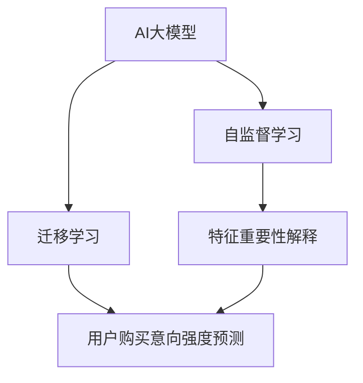

                 

## 1. 背景介绍

### 1.1 问题由来

电商平台已经逐渐成为现代消费的主流渠道。它们通过提供个性化推荐和精准营销，大幅提升了用户的购物体验，并促进了销售转化。然而，电商平台的成功在很大程度上取决于它们对用户购买意向强度的精准预测能力。

在过去，电商平台主要通过传统统计学和机器学习模型来预测用户的购买意向。但是，随着大数据和深度学习技术的发展，AI大模型在电商平台中的应用变得越来越广泛。

### 1.2 问题核心关键点

AI大模型在电商平台用户购买意向强度预测中的作用，主要体现在以下几个方面：

- **高效的多特征融合**：AI大模型通过大规模预训练，可以高效地融合各种特征，如用户历史行为、商品属性、社交媒体互动等，从而更好地捕捉用户潜在的购买意向。
- **跨领域迁移能力**：AI大模型能够快速适应不同的电商平台和产品领域，通过迁移学习机制，利用现有模型的知识来提升预测性能。
- **自监督学习**：AI大模型通常在大规模无标签数据上进行预训练，利用自监督学习机制，自动提取有意义的特征，减少了对标注数据的依赖。
- **动态更新**：AI大模型能够根据实时数据进行微调，动态适应市场变化，提升预测准确性。
- **可解释性**：通过LIME、SHAP等方法，AI大模型可以提供特征重要性解释，帮助电商平台更好地理解模型的决策过程。

### 1.3 问题研究意义

研究AI大模型在电商平台用户购买意向强度预测中的应用，具有以下重要意义：

- **提升预测准确性**：通过高效的特征融合和动态更新，AI大模型可以大幅提升预测的准确性，减少误判，提升用户体验。
- **降低运营成本**：减少对人工标注数据的依赖，降低模型训练和调优的复杂度，降低运营成本。
- **促进个性化推荐**：通过精准预测用户的购买意向强度，电商平台可以提供更加个性化的推荐，提高用户满意度和留存率。
- **驱动决策优化**：电商平台可以根据AI大模型的预测结果，优化库存管理、广告投放和营销策略，提高运营效率。
- **数据驱动的决策支持**：AI大模型提供的数据驱动的决策支持，使得电商平台能够更好地理解和优化其运营流程。

## 2. 核心概念与联系

### 2.1 核心概念概述

为了更好地理解AI大模型在电商平台用户购买意向强度预测中的应用，我们需要介绍几个核心概念：

- **AI大模型(AI Large Model)**：通过大规模数据和先进算法训练出的，具备广泛知识、强大学习和推理能力的深度学习模型。
- **用户购买意向强度预测**：预测用户在一定时间内的购买意向和行为，包括购买、收藏、关注等，是电商推荐和营销的核心任务之一。
- **自监督学习(Self-Supervised Learning)**：通过无标签数据进行预训练，学习通用的知识表示，从而提升模型在不同任务上的泛化能力。
- **迁移学习(Transfer Learning)**：利用已有的模型知识，在新任务上进行微调，快速提升模型性能，减少训练时间和成本。
- **特征重要性解释(Feature Importance Explanation)**：通过可视化方法或统计方法，解释模型预测中各个特征的贡献度，帮助理解模型的决策过程。

这些概念之间的联系可以通过以下Mermaid流程图来展示：



这个流程图展示了AI大模型与用户购买意向强度预测之间的逻辑关系：

1. AI大模型通过自监督学习在大规模数据上进行预训练，学习通用的知识表示。
2. 将预训练的模型应用于用户购买意向强度预测任务，通过迁移学习机制，快速提升预测性能。
3. 利用特征重要性解释方法，理解模型的决策过程，进一步优化预测模型。

## 3. 核心算法原理 & 具体操作步骤
### 3.1 算法原理概述

AI大模型在电商平台用户购买意向强度预测中的核心算法，主要包括预训练、迁移学习和预测三个步骤。

1. **预训练**：通过大规模无标签数据，AI大模型学习通用的语言和行为特征，构建高层次的表示。
2. **迁移学习**：将预训练模型应用于电商平台的数据集上，进行微调，学习特定任务的特征和关系。
3. **预测**：使用微调后的模型，对用户行为数据进行特征提取和预测，输出购买意向强度评分。

### 3.2 算法步骤详解

#### 3.2.1 数据预处理

电商平台的数据通常包括用户行为数据、商品属性数据、用户标签数据等。预处理流程包括：

- **数据清洗**：去除缺失、异常或重复的数据，确保数据质量。
- **特征工程**：设计合理的特征组合，如用户的历史购买记录、浏览记录、评分记录、收藏记录等。
- **数据标准化**：将数据进行归一化、离散化等预处理，方便模型训练。

#### 3.2.2 模型选择与预训练

选择合适的预训练模型，如BERT、GPT-3等，并在大规模无标签数据上进行预训练。

- **选择预训练模型**：根据电商平台的特点和需求，选择合适的预训练模型。通常，预训练模型的参数量越大，性能越好，但计算成本也越高。
- **预训练任务**：选择合适的预训练任务，如掩码语言模型、预训练自回归等，以学习通用的语言和行为特征。

#### 3.2.3 迁移学习

在预训练模型的基础上，进行迁移学习，将模型应用于电商平台的用户购买意向强度预测任务。

- **微调**：使用少量的标注数据，对预训练模型进行微调，学习特定任务的特征和关系。通常，微调学习率较小，以避免破坏预训练权重。
- **参数冻结**：仅微调模型的顶层或部分层，保留预训练层以避免过拟合。
- **正则化**：使用L2正则化、Dropout等技术，防止模型过拟合。
- **模型评估**：在验证集上评估模型的性能，并根据结果调整模型超参数。

#### 3.2.4 预测

使用微调后的模型，对新的用户行为数据进行预测。

- **特征提取**：将用户行为数据输入微调后的模型，提取特征表示。
- **预测输出**：将特征表示输入到预测模型，输出用户购买意向强度评分。

### 3.3 算法优缺点

AI大模型在电商平台用户购买意向强度预测中的优点包括：

- **高效的多特征融合**：AI大模型通过预训练学习通用的知识表示，可以高效地融合各种特征。
- **泛化能力强**：预训练模型在大规模无标签数据上学习，具备良好的泛化能力，适用于不同电商平台和产品领域。
- **动态更新**：AI大模型可以根据实时数据进行微调，动态适应市场变化。

缺点包括：

- **计算成本高**：预训练模型通常需要大量的计算资源和时间，增加了训练和部署成本。
- **模型复杂度高**：大规模预训练模型的参数量很大，增加了推理和调优的复杂度。
- **数据依赖性强**：虽然AI大模型可以通过自监督学习减少对标注数据的依赖，但在某些任务上仍需要大量标注数据进行微调。

### 3.4 算法应用领域

AI大模型在电商平台用户购买意向强度预测中的应用领域包括：

- **个性化推荐**：通过预测用户购买意向强度，提供个性化的商品推荐，提升用户体验和转化率。
- **库存管理**：预测热门商品的需求量，优化库存管理，减少库存积压和缺货。
- **广告投放**：预测广告点击率和转化率，优化广告投放策略，提高广告效果和ROI。
- **营销策略**：通过预测用户购买意向，优化营销活动和促销策略，提高用户参与度和转化率。
- **风险管理**：预测欺诈行为和不良订单，降低风险和损失。

## 4. 数学模型和公式 & 详细讲解 & 举例说明

### 4.1 数学模型构建

设电商平台用户行为数据为 $D=\{x_i\}_{i=1}^N$，其中 $x_i$ 表示用户第 $i$ 次行为数据。用户购买意向强度预测的目标是输出一个连续的评分 $y_i \in [0,1]$，表示用户对商品 $x_i$ 的购买意向强度。

AI大模型通常采用Transformer等架构，其预训练目标可以表示为：

$$
\mathcal{L}_{pre-train} = -\frac{1}{N} \sum_{i=1}^N \log P(x_i | \theta)
$$

其中 $P(x_i | \theta)$ 表示在模型参数 $\theta$ 下，生成 $x_i$ 的概率。

迁移学习的目标是在预训练模型的基础上，最小化预测误差：

$$
\mathcal{L}_{fine-tune} = -\frac{1}{N} \sum_{i=1}^N \log P(y_i | x_i, \theta)
$$

其中 $P(y_i | x_i, \theta)$ 表示在模型参数 $\theta$ 下，给定 $x_i$，预测 $y_i$ 的概率。

### 4.2 公式推导过程

假设AI大模型采用Transformer架构，其预训练任务为掩码语言模型。通过掩码语言模型预训练得到的模型参数 $\theta$，在迁移学习中进行微调，以适应电商平台的数据集。

在微调过程中，模型参数的更新可以通过优化器进行，如AdamW、SGD等。微调的目标函数为：

$$
\mathcal{L} = \mathcal{L}_{pre-train} + \mathcal{L}_{fine-tune}
$$

其中 $\mathcal{L}_{pre-train}$ 为预训练损失，$\mathcal{L}_{fine-tune}$ 为迁移学习损失。

具体到预测模型的实现，通常使用多分类交叉熵损失函数：

$$
\mathcal{L}_{cross-entropy} = -\frac{1}{N} \sum_{i=1}^N \sum_{j=1}^K y_{ij} \log P(y_{ij} | x_i, \theta)
$$

其中 $K$ 表示预测结果的类别数，$y_{ij}$ 为第 $i$ 个样本在 $j$ 类上的真实标签，$P(y_{ij} | x_i, \theta)$ 为模型在 $x_i$ 下，预测 $y_{ij}$ 的概率。

### 4.3 案例分析与讲解

以电商平台用户购买意向强度预测为例，假设我们选择了GPT-3作为预训练模型，在电商平台的训练数据集上进行微调。

首先，我们将电商平台的用户行为数据 $D$ 进行预处理，去除缺失值，标准化特征，设计特征组合，如用户的历史购买记录、浏览记录、评分记录等。然后，使用GPT-3的预训练权重初始化模型，并在无标签数据上进行预训练。

接下来，使用电商平台的数据集进行迁移学习，微调GPT-3模型，学习特定任务的特征和关系。在微调过程中，我们冻结了GPT-3的前几层，仅微调顶层，以减少过拟合风险。同时，使用L2正则化和Dropout等技术，防止模型过拟合。

最后，使用微调后的模型，对新的用户行为数据进行预测，输出购买意向强度评分。通过特征重要性解释方法，如LIME、SHAP等，分析预测结果中各特征的贡献度，帮助电商平台理解模型的决策过程，进一步优化预测模型。

## 5. 项目实践：代码实例和详细解释说明

### 5.1 开发环境搭建

进行电商平台用户购买意向强度预测的开发，需要搭建Python开发环境，并选择合适的深度学习框架和库。

#### 5.1.1 环境配置

- **安装Python**：安装最新版本的Python，如3.8或3.9。
- **安装深度学习框架**：选择PyTorch或TensorFlow等深度学习框架。
- **安装相关库**：安装Numpy、Pandas、Scikit-learn等库，方便数据处理和模型训练。

#### 5.1.2 数据集准备

- **数据收集**：收集电商平台的用户行为数据、商品属性数据、用户标签数据等。
- **数据清洗**：去除缺失值和异常值，确保数据质量。
- **数据标准化**：将数据进行归一化和离散化，方便模型训练。

### 5.2 源代码详细实现

以下是一个基于PyTorch框架的电商平台用户购买意向强度预测的代码实现：

```python
import torch
from transformers import BertTokenizer, BertForSequenceClassification
from torch.utils.data import DataLoader
from sklearn.metrics import accuracy_score, precision_score, recall_score

# 数据准备
tokenizer = BertTokenizer.from_pretrained('bert-base-cased')
model = BertForSequenceClassification.from_pretrained('bert-base-cased', num_labels=2) # 二分类问题

# 数据加载
train_data = ...
val_data = ...
test_data = ...

train_loader = DataLoader(train_data, batch_size=32, shuffle=True)
val_loader = DataLoader(val_data, batch_size=32, shuffle=False)
test_loader = DataLoader(test_data, batch_size=32, shuffle=False)

# 模型训练
device = torch.device('cuda' if torch.cuda.is_available() else 'cpu')
model.to(device)

optimizer = torch.optim.AdamW(model.parameters(), lr=2e-5)
scheduler = torch.optim.lr_scheduler.StepLR(optimizer, step_size=1, gamma=0.9)

for epoch in range(10):
    model.train()
    train_loss = 0
    train_correct = 0
    for batch in train_loader:
        inputs = batch['input_ids'].to(device)
        attention_mask = batch['attention_mask'].to(device)
        labels = batch['labels'].to(device)

        outputs = model(inputs, attention_mask=attention_mask, labels=labels)
        loss = outputs.loss
        train_loss += loss.item()
        train_correct += torch.sum(outputs.logits.argmax(dim=1) == labels).item()

        optimizer.zero_grad()
        loss.backward()
        optimizer.step()

    train_acc = train_correct / len(train_loader.dataset)

    model.eval()
    val_loss = 0
    val_correct = 0
    with torch.no_grad():
        for batch in val_loader:
            inputs = batch['input_ids'].to(device)
            attention_mask = batch['attention_mask'].to(device)
            labels = batch['labels'].to(device)

            outputs = model(inputs, attention_mask=attention_mask, labels=labels)
            loss = outputs.loss
            val_loss += loss.item()
            val_correct += torch.sum(outputs.logits.argmax(dim=1) == labels).item()

        val_acc = val_correct / len(val_loader.dataset)

        if val_acc > max_acc:
            max_acc = val_acc
            torch.save(model.state_dict(), 'model.pth')

# 模型评估
model.load_state_dict(torch.load('model.pth'))
model.eval()

test_correct = 0
with torch.no_grad():
    for batch in test_loader:
        inputs = batch['input_ids'].to(device)
        attention_mask = batch['attention_mask'].to(device)
        labels = batch['labels'].to(device)

        outputs = model(inputs, attention_mask=attention_mask, labels=labels)
        test_correct += torch.sum(outputs.logits.argmax(dim=1) == labels).item()

test_acc = test_correct / len(test_loader.dataset)
print(f'Test accuracy: {test_acc:.2f}')
```

### 5.3 代码解读与分析

以上代码实现了基于Bert模型的电商平台用户购买意向强度预测，其核心步骤包括数据加载、模型训练和评估。

**数据加载**：使用BertTokenizer进行数据预处理，将文本数据转换为模型可以接受的输入格式。

**模型训练**：使用AdamW优化器，在模型上进行梯度下降，更新模型参数。

**模型评估**：在测试集上评估模型性能，计算准确率和损失等指标。

## 6. 实际应用场景

### 6.1 智能推荐系统

电商平台通过用户行为数据，预测用户购买意向强度，可以实现智能推荐系统。根据预测结果，向用户推荐相关商品，提高用户满意度。

### 6.2 库存管理

预测热门商品的需求量，优化库存管理，减少库存积压和缺货，提高运营效率。

### 6.3 广告投放

预测广告点击率和转化率，优化广告投放策略，提高广告效果和ROI。

### 6.4 风险管理

预测欺诈行为和不良订单，降低风险和损失，提高交易安全性。

### 6.5 个性化营销

根据用户的购买意向强度，制定个性化的营销策略，提高用户参与度和转化率。

## 7. 工具和资源推荐

### 7.1 学习资源推荐

为了帮助开发者系统掌握AI大模型在电商平台中的应用，推荐以下学习资源：

1. 《自然语言处理入门》（自然语言处理入门）：讲解自然语言处理的基本概念和应用，适合初学者入门。
2. 《深度学习》（深度学习）：讲解深度学习的基本原理和实现，适合有一定编程基础的读者。
3. 《Transformers: A State-of-the Art Text Representation for Natural Language Processing》：讲解Transformer模型和预训练语言模型的原理和应用，适合进阶学习。
4. HuggingFace官方文档：提供丰富的预训练模型和微调样例，适合实践学习。

### 7.2 开发工具推荐

使用深度学习框架和库，可以快速搭建AI大模型应用。

- **PyTorch**：灵活的动态计算图，适合快速迭代研究。
- **TensorFlow**：生产部署方便，适合大规模工程应用。
- **Transformers**：提供丰富的预训练模型和微调样例，适合实践学习。

### 7.3 相关论文推荐

了解AI大模型在电商平台中的最新进展，可以参考以下论文：

1. "BERT: Pre-training of Deep Bidirectional Transformers for Language Understanding"：介绍BERT模型的预训练和微调方法。
2. "Towards Explainable AI with Attention and Self-Explanation"：介绍注意力机制和模型解释方法。
3. "Feature Importance Explainability in Natural Language Processing"：介绍特征重要性解释方法在NLP中的应用。

## 8. 总结：未来发展趋势与挑战

### 8.1 研究成果总结

本文对AI大模型在电商平台用户购买意向强度预测中的应用进行了详细介绍。通过系统的数学建模和代码实践，展示了AI大模型的高效多特征融合能力和泛化能力，讨论了其在电商平台中的应用场景。

### 8.2 未来发展趋势

未来，AI大模型在电商平台中的应用将进一步拓展，主要趋势包括：

- **多模态融合**：将文本、图像、音频等多种模态数据融合，提升模型的表现能力。
- **实时学习**：通过在线学习和动态更新，模型能够不断学习新的用户行为和市场变化。
- **联邦学习**：在保护用户隐私的前提下，多个电商平台可以联合训练模型，提升整体性能。
- **自监督学习**：利用无标签数据进行预训练，减少对标注数据的依赖，提升模型的泛化能力。

### 8.3 面临的挑战

尽管AI大模型在电商平台中的应用前景广阔，但仍面临以下挑战：

- **数据隐私保护**：电商平台需要保护用户隐私，避免数据泄露。
- **计算资源成本**：大规模预训练模型的计算成本较高，需要优化资源使用。
- **模型可解释性**：模型预测结果需要具备可解释性，以便用户理解。
- **算法鲁棒性**：模型需要具备鲁棒性，避免在异常数据下表现不佳。

### 8.4 研究展望

未来的研究需要针对以上挑战进行突破，主要研究方向包括：

- **隐私保护技术**：开发隐私保护算法，如差分隐私、联邦学习等，保护用户隐私。
- **资源优化技术**：开发模型压缩和加速技术，优化计算资源使用。
- **可解释性算法**：开发模型解释算法，提高模型可解释性。
- **鲁棒性增强**：开发鲁棒性算法，提高模型在异常数据下的表现。

## 9. 附录：常见问题与解答

### Q1: 电商平台的用户购买意向强度预测有多重要？

A: 电商平台的用户购买意向强度预测至关重要，因为它直接影响着用户的购物体验和平台的销售转化。通过预测用户的购买意向，电商平台可以提供个性化的推荐，优化库存管理，提高广告投放的ROI，降低风险和损失，从而提升整体运营效率。

### Q2: 如何选择合适的预训练模型？

A: 选择合适的预训练模型需要考虑电商平台的业务需求和数据特点。一般来说，参数量较大的模型（如BERT、GPT-3等）在数据量较大的情况下表现较好，但计算成本较高。参数量较小的模型（如DistilBERT、MobileBERT等）在资源受限的情况下表现较好。

### Q3: 在电商平台中应用AI大模型时，如何处理数据隐私问题？

A: 在电商平台中应用AI大模型时，需要严格保护用户隐私，避免数据泄露。可以采用差分隐私、联邦学习等隐私保护技术，确保模型训练过程的安全性和合法性。

### Q4: 在电商平台中应用AI大模型时，如何优化计算资源使用？

A: 优化计算资源使用是应用AI大模型的关键。可以采用模型压缩、混合精度训练、模型并行等技术，减少模型的计算和存储成本，提升模型的推理速度。

### Q5: 如何提高AI大模型的可解释性？

A: 提高AI大模型的可解释性可以通过可视化方法（如LIME、SHAP等）和统计方法（如特征重要性分析）来实现。这些方法可以帮助电商平台理解模型的决策过程，提升模型的可信度和透明度。

---

作者：禅与计算机程序设计艺术 / Zen and the Art of Computer Programming

