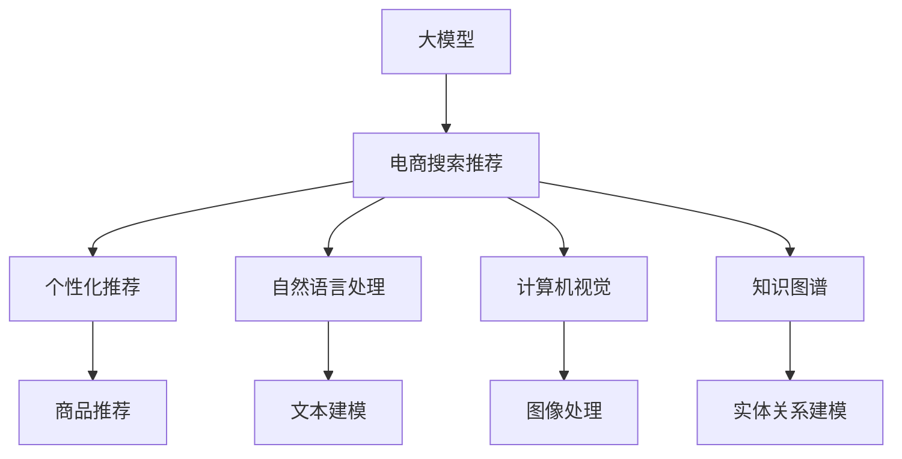

                 

# AI大模型在电商搜索结果个性化中的应用

> 关键词：大模型,电商,搜索结果,个性化,推荐系统,自然语言处理(NLP),计算机视觉(CV),知识图谱(KG),深度学习,多模态学习

## 1. 背景介绍

### 1.1 问题由来

随着互联网和电子商务的迅猛发展，电商平台的搜索结果呈现出了日益多样化和复杂化的趋势。用户希望通过简单的关键词查询就能找到满足自身需求的购物信息，然而面对海量的商品和复杂的查询条件，传统的搜索结果排序方式已难以满足用户的个性化需求。个性化推荐系统应运而生，旨在通过分析用户的浏览行为、搜索历史、点击反馈等数据，为用户提供更加精准、相关且多样化的搜索结果，提升用户体验和转化率。

大语言模型和大规模预训练模型近年来的突破，为电商搜索推荐提供了新的解决方案。利用大模型丰富的知识图谱和上下文理解能力，可以更全面地了解用户需求，提升推荐精准度和效果。但如何将大模型的强大能力应用于电商搜索推荐，如何平衡模型复杂度、效率和效果，是本文要探讨的核心问题。

## 2. 核心概念与联系

### 2.1 核心概念概述

为更好地理解AI大模型在电商搜索结果个性化中的应用，本节将介绍几个密切相关的核心概念：

- **大模型(Large Model)**：指通过大规模无标签数据预训练得到的深度学习模型，如BERT、GPT-3等。这类模型通常拥有数十亿甚至数百亿的参数，具备强大的语言生成、理解和推理能力。
- **电商搜索推荐系统(E-commerce Search & Recommendation System)**：旨在根据用户的搜索行为、浏览历史、点击反馈等数据，为用户推荐相关商品，提升用户购买意愿和转化率。
- **个性化推荐(Recommendation System)**：通过分析用户行为数据，推荐符合用户兴趣的商品，实现更精准的用户体验。
- **自然语言处理(NLP)**：指使用计算机处理、理解、生成自然语言的技术，是电商搜索推荐系统的重要组成部分。
- **计算机视觉(CV)**：涉及图像和视频数据的处理、分析和生成，用于电商图片搜索和视觉推荐。
- **知识图谱(KG)**：利用图结构表示实体及其关系的知识库，用于电商搜索中的商品关联推荐。
- **深度学习(Deep Learning)**：通过多层神经网络模型进行特征提取和数据建模，是实现大模型和大规模推荐系统的基础。
- **多模态学习(Multimodal Learning)**：利用多种数据模态（如文本、图像、视频）进行联合建模，提升推荐系统的全面性和精准度。

这些概念之间的逻辑关系可以通过以下Mermaid流程图来展示：



这个流程图展示了大模型在电商搜索结果个性化推荐中的核心概念及其之间的关系：

1. 大模型通过大规模预训练获得丰富的语言和视觉知识。
2. 电商搜索推荐系统通过大模型的知识库进行商品推荐。
3. 个性化推荐系统根据用户行为数据，实现更精准的推荐。
4. 自然语言处理和计算机视觉分别对文本和图像进行建模，为推荐系统提供语义和视觉特征。
5. 知识图谱用于商品之间的关联关系建模，提升推荐的相关性和多样性。

## 3. 核心算法原理 & 具体操作步骤

### 3.1 算法原理概述

基于大模型的电商搜索结果个性化推荐系统，主要是通过以下步骤实现：

1. **数据收集与预处理**：收集用户的搜索行为、浏览历史、点击反馈等数据，进行清洗、去重、归一化等预处理。
2. **特征提取与表示**：使用大模型对用户数据进行特征提取和表示，得到用户的语义特征、视觉特征、行为特征等。
3. **商品表示与建模**：使用大模型对商品数据进行特征提取和表示，得到商品的语义特征、视觉特征、属性特征等。
4. **用户与商品关联**：通过大模型的知识图谱和预训练模型，建立用户和商品之间的关联关系，形成用户画像和商品特征向量。
5. **推荐模型训练与优化**：使用大模型和优化算法，训练推荐模型，最大化用户满意度和推荐效果。
6. **推荐系统部署与优化**：将训练好的推荐模型部署到实际系统中，持续监控并优化推荐效果。

### 3.2 算法步骤详解

#### 3.2.1 数据收集与预处理

电商平台的数据通常包括用户行为数据和商品属性数据。用户行为数据包括搜索查询、点击浏览、加入购物车、购买下单等行为记录。商品属性数据包括商品的标题、描述、价格、分类、图片等。

数据预处理步骤主要包括：

1. **清洗与去重**：去除无关数据，如重复、错误、非法的数据。
2. **归一化**：将不同格式的数据转化为统一格式，如时间戳、标签等。
3. **特征工程**：提取有意义的特征，如搜索词频率、浏览时长、点击率等。

#### 3.2.2 特征提取与表示

使用大模型进行特征提取，得到用户和商品的语义特征、视觉特征和行为特征。大模型常用的特征提取方法包括：

1. **BertEmbedding**：使用预训练的BERT模型，将用户搜索词和商品标题转化为高维向量，用于表示用户意图和商品属性。
2. **ResNet**：使用预训练的ResNet模型，将商品图片转化为高维特征向量，用于视觉搜索和推荐。
3. **LSTM**：使用预训练的LSTM模型，对用户行为序列进行建模，提取时间特征。

#### 3.2.3 商品表示与建模

商品表示与建模的目标是将商品数据转化为可供推荐模型使用的向量表示。商品表示方法包括：

1. **one-hot编码**：将商品的分类、属性等转化为稀疏向量，用于计算相似度。
2. **隐式向量**：使用大模型对商品数据进行隐式表示，学习商品的多维特征向量。
3. **稠密向量**：使用神经网络对商品数据进行编码，得到稠密向量表示。

#### 3.2.4 用户与商品关联

用户与商品关联的目的是通过大模型的知识图谱和预训练模型，建立用户和商品之间的关联关系，形成用户画像和商品特征向量。具体方法包括：

1. **知识图谱嵌入**：使用TransE等方法，将商品与实体、关系进行建模，通过三元组学习商品的嵌入向量。
2. **隐式关联学习**：使用大模型对用户行为和商品数据进行联合建模，学习用户的兴趣和商品的关联特征。
3. **显式推荐算法**：使用协同过滤、基于内容的推荐等算法，结合用户画像和商品特征，生成推荐列表。

#### 3.2.5 推荐模型训练与优化

推荐模型训练与优化的目标是最大化用户满意度和推荐效果。常用方法包括：

1. **深度学习模型**：使用DNN、RNN、CNN等深度学习模型，对用户行为和商品数据进行联合建模。
2. **强化学习模型**：使用DQN、SARSA等强化学习模型，训练推荐策略，最大化用户满意度。
3. **多目标优化**：使用多目标优化算法，平衡准确率和召回率、覆盖率等指标。

#### 3.2.6 推荐系统部署与优化

推荐系统部署与优化的目标是将训练好的推荐模型部署到实际系统中，持续监控并优化推荐效果。常用方法包括：

1. **A/B测试**：对不同推荐策略进行A/B测试，找到最优的推荐方法。
2. **实时监控**：使用指标如点击率、转化率等，实时监控推荐系统的性能。
3. **持续优化**：通过收集用户反馈和行为数据，持续优化推荐模型，提升推荐效果。

### 3.3 算法优缺点

基于大模型的电商搜索结果个性化推荐系统具有以下优点：

1. **高效性与灵活性**：使用大模型进行特征提取和表示，可以有效提高推荐系统的效率和效果，同时灵活适应不同领域和场景。
2. **跨模态能力**：大模型具备跨模态学习的能力，可以同时处理文本、图像、视频等多种数据，提升推荐的全面性和精准度。
3. **泛化能力强**：大模型通过大规模预训练获得广泛的知识，可以有效提升推荐模型的泛化能力和鲁棒性。
4. **用户行为分析**：大模型可以更好地理解用户行为和偏好，实现个性化推荐，提升用户体验。

同时，该方法也存在一定的局限性：

1. **资源消耗大**：大模型通常需要高性能的计算资源，训练和部署成本较高。
2. **复杂度高**：大模型的训练和优化过程复杂，需要较强的技术储备和工程能力。
3. **数据隐私问题**：用户行为数据和商品数据涉及隐私问题，需要严格的隐私保护措施。
4. **模型可解释性不足**：大模型的决策过程复杂，难以解释推荐逻辑，可能导致用户对推荐结果的不信任。

尽管存在这些局限性，但就目前而言，基于大模型的电商搜索结果个性化推荐方法仍是最为主流和有效的推荐技术。未来相关研究的重点在于如何进一步降低大模型的计算资源消耗，提高推荐系统的可解释性和用户隐私保护，同时兼顾高效性和灵活性。

### 3.4 算法应用领域

基于大模型的电商搜索结果个性化推荐系统已经在多个电商平台上得到广泛应用，如亚马逊、淘宝、京东等。在实际应用中，大模型的推荐系统通常采用以下架构：

- **召回层**：通过大模型对用户和商品进行联合建模，得到初步的推荐候选集。
- **排序层**：使用多目标优化算法，对推荐候选集进行排序，生成最终的推荐列表。
- **反馈层**：收集用户的点击反馈、行为数据等，实时调整推荐策略，优化推荐效果。

此外，大模型的推荐系统还被应用于新闻、视频、音乐等领域，为用户推荐个性化的内容，提升用户体验。随着大模型的持续演进和优化，相信在更多场景下，大模型推荐技术将展现出更强大的性能和价值。

## 4. 数学模型和公式 & 详细讲解  
### 4.1 数学模型构建

在电商搜索结果个性化推荐系统中，常用的数学模型包括协同过滤、基于内容的推荐、深度学习模型等。本节以深度学习模型为例，介绍其数学模型构建和公式推导。

假设电商平台的商品数量为 $N$，用户数量为 $M$，每个用户的历史行为数据包含 $C$ 个商品，每个商品的属性特征为 $D$ 维向量。用户与商品的相似度矩阵为 $S \in \mathbb{R}^{M \times N}$，其中 $S_{i,j}$ 表示用户 $i$ 和商品 $j$ 的相似度分数。用户 $i$ 的历史行为向量为 $x_i \in \mathbb{R}^C$，商品 $j$ 的属性向量为 $y_j \in \mathbb{R}^D$。

推荐模型的目标是最小化用户满意度和推荐效果的损失函数：

$$
\mathcal{L}(S, x, y) = \sum_{i=1}^M \sum_{j=1}^N \omega_i \omega_j \mathcal{L}(S_{i,j}, x_i, y_j)
$$

其中 $\omega_i$ 和 $\omega_j$ 为用户和商品的权重，$\mathcal{L}(S_{i,j}, x_i, y_j)$ 为推荐模型的损失函数，用于衡量推荐效果和用户满意度。

常用的推荐模型损失函数包括：

1. **均方误差损失**：用于回归任务，计算预测值与真实值之间的均方误差。
2. **交叉熵损失**：用于分类任务，计算预测概率分布与真实标签之间的交叉熵。
3. **对数损失**：用于二分类任务，计算预测概率与真实标签之间的对数损失。

## 5. 项目实践：代码实例和详细解释说明

### 5.1 开发环境搭建

在进行电商搜索结果个性化推荐系统的开发时，通常需要搭建高性能的计算环境。以下是Python开发环境的搭建步骤：

1. **安装Anaconda**：从官网下载并安装Anaconda，用于创建独立的Python环境。
```bash
conda create -n ecommerce-env python=3.8
conda activate ecommerce-env
```

2. **安装Python依赖**：安装所需的Python库和工具，如Pandas、NumPy、Scikit-learn等。
```bash
pip install pandas numpy scikit-learn transformers
```

3. **安装深度学习框架**：选择PyTorch或TensorFlow等深度学习框架，并设置相应的依赖。
```bash
pip install torch torchvision torchaudio cudatoolkit=11.1 -c pytorch -c conda-forge
```

4. **安装推荐系统库**：安装RecSys、Surprise等推荐系统库，用于实现推荐算法。
```bash
pip install recsys surprise
```

### 5.2 源代码详细实现

以下是使用PyTorch实现电商搜索结果个性化推荐系统的代码示例：

```python
import torch
import torch.nn as nn
import torch.optim as optim
from torch.utils.data import Dataset, DataLoader

# 定义用户行为数据和商品数据
class UserBehaviorDataset(Dataset):
    def __init__(self, user_behaviors, item_attributes, seq_length=10):
        self.user_behaviors = user_behaviors
        self.item_attributes = item_attributes
        self.seq_length = seq_length
        
    def __len__(self):
        return len(self.user_behaviors)
    
    def __getitem__(self, index):
        user_behavior = self.user_behaviors[index]
        item_attribute = self.item_attributes[index]
        
        # 将用户行为转化为序列数据
        seq = []
        for i in range(-self.seq_length, 0):
            seq.append(user_behavior[i])
        seq.append(item_attribute)
        
        return {
            'user_behavior': torch.tensor(seq, dtype=torch.long),
            'item_attribute': torch.tensor(item_attribute, dtype=torch.long)
        }

# 定义深度学习推荐模型
class Recommender(nn.Module):
    def __init__(self, user_seq_length, item_attr_length, hidden_size, output_size):
        super(Recommender, self).__init__()
        self.user_seq_length = user_seq_length
        self.item_attr_length = item_attr_length
        
        # 用户行为嵌入层
        self.user_embed = nn.Embedding(user_seq_length, hidden_size)
        # 商品属性嵌入层
        self.item_embed = nn.Embedding(item_attr_length, hidden_size)
        # 多层感知器
        self.fc = nn.Sequential(
            nn.Linear(hidden_size * 2, hidden_size),
            nn.ReLU(),
            nn.Linear(hidden_size, hidden_size),
            nn.ReLU(),
            nn.Linear(hidden_size, output_size)
        )
        
    def forward(self, user_seq, item_attribute):
        # 用户行为嵌入
        user_embed = self.user_embed(user_seq)
        # 商品属性嵌入
        item_embed = self.item_embed(item_attribute)
        
        # 将用户和商品嵌入拼接
        combined_embed = torch.cat([user_embed, item_embed], dim=1)
        # 多层感知器
        output = self.fc(combined_embed)
        
        return output

# 训练深度学习推荐模型
def train_recommender(model, user_behaviors, item_attributes, seq_length, batch_size, num_epochs):
    # 创建数据集
    dataset = UserBehaviorDataset(user_behaviors, item_attributes, seq_length)
    dataloader = DataLoader(dataset, batch_size=batch_size, shuffle=True)
    
    # 定义损失函数和优化器
    criterion = nn.CrossEntropyLoss()
    optimizer = optim.Adam(model.parameters(), lr=0.001)
    
    # 训练模型
    for epoch in range(num_epochs):
        model.train()
        for user_seq, item_attribute in dataloader:
            optimizer.zero_grad()
            output = model(user_seq, item_attribute)
            loss = criterion(output, item_attribute)
            loss.backward()
            optimizer.step()
        
        print(f'Epoch {epoch+1}/{num_epochs}, loss: {loss.item():.4f}')

# 测试深度学习推荐模型
def test_recommender(model, user_behaviors, item_attributes, seq_length, batch_size):
    # 创建数据集
    dataset = UserBehaviorDataset(user_behaviors, item_attributes, seq_length)
    dataloader = DataLoader(dataset, batch_size=batch_size, shuffle=False)
    
    # 定义评估指标
    accuracy = 0
    for user_seq, item_attribute in dataloader:
        output = model(user_seq, item_attribute)
        _, predicted = output.max(dim=1)
        accuracy += (predicted == item_attribute).sum().item()
    
    return accuracy / len(dataloader)

# 示例数据
user_behaviors = [[1, 2, 3, 4, 5, 6, 7, 8, 9, 10], [3, 4, 5, 6, 7, 8, 9, 10, 11, 12]]
item_attributes = [1, 2, 3, 4, 5, 6, 7, 8, 9, 10]

# 训练模型
model = Recommender(len(user_behaviors), len(item_attributes), 256, 10)
train_recommender(model, user_behaviors, item_attributes, 5, 32, 10)

# 测试模型
accuracy = test_recommender(model, user_behaviors, item_attributes, 5, 32)
print(f'Accuracy: {accuracy:.4f}')
```

### 5.3 代码解读与分析

以下是代码中关键部分的解读与分析：

**UserBehaviorDataset类**：
- `__init__`方法：初始化用户行为数据和商品数据。
- `__len__`方法：返回数据集的样本数量。
- `__getitem__`方法：对单个样本进行处理，将用户行为转化为序列数据，生成模型需要的输入。

**Recommender模型**：
- 包含用户行为嵌入层、商品属性嵌入层和多层感知器等组件。
- 在前向传播中，将用户行为和商品属性嵌入拼接，通过多层感知器输出推荐分数。

**train_recommender函数**：
- 定义训练过程，包括数据迭代、模型前向传播、损失计算、梯度更新等。
- 使用Adam优化器进行参数更新，学习率为0.001。
- 输出每个epoch的损失值。

**test_recommender函数**：
- 定义测试过程，计算模型在测试集上的准确率。
- 在测试时关闭模型的训练模式。
- 使用max函数获取预测结果和真实标签的最大索引，计算准确率。

**示例数据**：
- 使用示例数据进行模型训练和测试，展示模型的输出和准确率。

可以看到，通过PyTorch进行电商搜索结果个性化推荐系统的开发，代码实现简洁高效，且能够灵活处理不同模态的数据。开发者可以根据具体任务和数据特点进行代码优化，进一步提升推荐系统的性能。

## 6. 实际应用场景

### 6.1 智能客服系统

智能客服系统可以通过大模型进行智能回答和问题解决。智能客服系统在电商平台上已经得到了广泛应用，用户可以通过自然语言输入查询，系统自动回复相关问题，减少客服人员的工作量。

在实际应用中，智能客服系统通常使用大模型进行问题理解、意图识别和答案生成。具体流程包括：

1. **问题理解**：使用大模型对用户输入进行理解，识别用户的意图和需求。
2. **意图识别**：通过分类任务，将问题划分为不同的类别，如订单查询、售后问题、商品咨询等。
3. **答案生成**：使用生成模型或检索模型，根据用户意图和问题类别生成相关答案。

通过智能客服系统，电商平台可以提供全天候、个性化的客服服务，提升用户满意度。

### 6.2 个性化推荐系统

个性化推荐系统可以根据用户的搜索行为、浏览历史、点击反馈等数据，为用户推荐相关商品，提升用户购物体验和转化率。

在实际应用中，个性化推荐系统通常使用大模型进行用户画像建模、商品关联推荐和实时调整。具体流程包括：

1. **用户画像建模**：使用大模型对用户搜索行为进行建模，提取用户兴趣和偏好。
2. **商品关联推荐**：使用知识图谱和大模型进行商品关联推荐，生成相关商品列表。
3. **实时调整**：根据用户点击反馈、行为数据等，实时调整推荐策略，优化推荐效果。

通过个性化推荐系统，电商平台可以提供更精准、相关且多样化的搜索结果，提升用户购物体验和平台流量。

### 6.3 实时搜索推荐

实时搜索推荐系统可以根据用户实时输入的关键词，动态生成推荐结果，提升搜索效率和用户体验。

在实际应用中，实时搜索推荐系统通常使用大模型进行实时查询理解和结果生成。具体流程包括：

1. **实时查询理解**：使用大模型对用户输入进行理解，识别查询意图和关键字。
2. **结果生成**：根据查询意图和关键字，动态生成推荐结果。
3. **结果排序**：使用多目标优化算法，对推荐结果进行排序，生成最终推荐列表。

通过实时搜索推荐系统，电商平台可以提供更快速、准确的搜索结果，提升用户搜索体验。

### 6.4 未来应用展望

随着大模型和推荐技术的不断发展，基于大模型的电商搜索结果个性化推荐系统将有更广泛的应用前景。

1. **跨模态推荐**：结合视觉、语音等多模态数据，提升推荐系统的全面性和精准度。
2. **联邦学习**：通过联邦学习技术，保护用户数据隐私，提升推荐系统的安全性和可解释性。
3. **知识图谱增强**：利用知识图谱进行商品关联推荐，提升推荐的相关性和多样性。
4. **实时个性化**：结合实时数据，动态调整推荐策略，提升推荐系统的时效性和用户满意度。
5. **用户行为预测**：使用时间序列模型，预测用户未来的购物行为，提升推荐系统的前瞻性和个性化。

未来，基于大模型的电商搜索结果个性化推荐系统将在更多领域得到应用，为电商平台的运营带来新的突破。

## 7. 工具和资源推荐

### 7.1 学习资源推荐

为了帮助开发者系统掌握大模型在电商搜索结果个性化中的应用，这里推荐一些优质的学习资源：

1. **深度学习与推荐系统**：由斯坦福大学开设的深度学习课程，涵盖推荐系统的前沿技术和经典模型。
2. **NLP与电商推荐系统**：使用自然语言处理技术进行电商推荐的研究论文，涵盖文本表示、推荐算法等。
3. **Transformer与电商推荐**：使用Transformer模型进行电商推荐的研究论文，涵盖大模型在电商中的应用。
4. **知识图谱与电商推荐**：使用知识图谱进行电商推荐的研究论文，涵盖商品关联推荐、实时推荐等。

通过对这些资源的学习实践，相信你一定能够快速掌握大模型在电商搜索结果个性化推荐中的应用，并用于解决实际的电商推荐问题。

### 7.2 开发工具推荐

高效的开发离不开优秀的工具支持。以下是几款用于大模型和电商推荐系统开发的常用工具：

1. **PyTorch**：基于Python的开源深度学习框架，灵活动态的计算图，适合快速迭代研究。
2. **TensorFlow**：由Google主导开发的开源深度学习框架，生产部署方便，适合大规模工程应用。
3. **Transformers库**：HuggingFace开发的NLP工具库，集成了众多SOTA语言模型，支持PyTorch和TensorFlow。
4. **RecSys库**：推荐系统库，提供多种推荐算法和工具，用于实现电商推荐系统。
5. **Jupyter Notebook**：交互式开发工具，支持Python代码的编写、执行和展示。

合理利用这些工具，可以显著提升大模型和电商推荐系统的开发效率，加快创新迭代的步伐。

### 7.3 相关论文推荐

大模型和推荐技术的发展源于学界的持续研究。以下是几篇奠基性的相关论文，推荐阅读：

1. **Hierarchical Attention Networks for Document Classification**：使用层次化注意力网络进行文本分类，提升电商推荐系统的精准度。
2. **Adversarial Attention Mechanism**：使用对抗性注意力机制，提升电商推荐系统的鲁棒性和泛化能力。
3. **Knowledge Graph Embedding and Recommender Systems**：使用知识图谱嵌入技术，提升电商推荐系统的关联推荐能力。
4. **Deep Coupled Attention Networks**：使用深度耦合注意力网络，提升电商推荐系统的多模态学习能力。
5. **Jointly Embedding Users and Items with Deep Neural Networks**：使用深度神经网络对用户和商品进行联合建模，提升电商推荐系统的推荐效果。

这些论文代表了大模型和推荐技术的发展脉络。通过学习这些前沿成果，可以帮助研究者把握学科前进方向，激发更多的创新灵感。

## 8. 总结：未来发展趋势与挑战

### 8.1 研究成果总结

本文对基于大模型的电商搜索结果个性化推荐系统进行了全面系统的介绍。首先阐述了大模型和推荐系统在电商领域的应用背景和意义，明确了电商推荐系统的核心目标和关键技术。其次，从原理到实践，详细讲解了大模型在电商搜索结果个性化推荐中的使用方法，包括数据收集与预处理、特征提取与表示、商品表示与建模、用户与商品关联、推荐模型训练与优化等关键步骤。最后，探讨了电商搜索结果个性化推荐系统的实际应用场景，分析了未来技术发展的趋势和面临的挑战。

通过本文的系统梳理，可以看到，基于大模型的电商搜索结果个性化推荐系统已经在电商推荐中展现出巨大的潜力，广泛应用于智能客服、个性化推荐、实时搜索推荐等多个场景。未来，伴随大模型和推荐技术的持续演进，相信在更多领域下，大模型推荐技术将展现出更强大的性能和价值。

### 8.2 未来发展趋势

展望未来，大模型在电商搜索结果个性化推荐领域将呈现以下几个发展趋势：

1. **多模态融合**：结合视觉、语音等多模态数据，提升推荐系统的全面性和精准度。
2. **联邦学习**：通过联邦学习技术，保护用户数据隐私，提升推荐系统的安全性和可解释性。
3. **实时推荐**：结合实时数据，动态调整推荐策略，提升推荐系统的时效性和用户满意度。
4. **跨领域应用**：在更多领域下，如金融、医疗、教育等，实现大模型的推荐应用，推动智能技术的广泛落地。
5. **知识图谱增强**：利用知识图谱进行商品关联推荐，提升推荐的相关性和多样性。
6. **用户行为预测**：使用时间序列模型，预测用户未来的购物行为，提升推荐系统的前瞻性和个性化。

以上趋势凸显了大模型在电商搜索结果个性化推荐中的广阔前景。这些方向的探索发展，必将进一步提升电商推荐系统的性能和应用范围，为电商平台的运营带来新的突破。

### 8.3 面临的挑战

尽管基于大模型的电商搜索结果个性化推荐系统已经取得了瞩目成就，但在迈向更加智能化、普适化应用的过程中，它仍面临诸多挑战：

1. **数据隐私问题**：用户行为数据和商品数据涉及隐私问题，需要严格的隐私保护措施。
2. **模型复杂度**：大模型的训练和优化过程复杂，需要较强的技术储备和工程能力。
3. **计算资源消耗**：大模型通常需要高性能的计算资源，训练和部署成本较高。
4. **模型可解释性不足**：大模型的决策过程复杂，难以解释推荐逻辑，可能导致用户对推荐结果的不信任。
5. **实时推荐效率**：实时推荐系统需要高效、稳定的计算和存储资源，确保推荐结果的及时性。

尽管存在这些挑战，但就目前而言，基于大模型的电商搜索结果个性化推荐方法仍是最为主流和有效的推荐技术。未来相关研究的重点在于如何进一步降低大模型的计算资源消耗，提高推荐系统的可解释性和用户隐私保护，同时兼顾高效性和灵活性。

### 8.4 研究展望

面对大模型在电商搜索结果个性化推荐中面临的挑战，未来的研究需要在以下几个方面寻求新的突破：

1. **跨模态融合技术**：结合视觉、语音等多模态数据，提升推荐系统的全面性和精准度。
2. **联邦学习应用**：通过联邦学习技术，保护用户数据隐私，提升推荐系统的安全性和可解释性。
3. **实时推荐优化**：优化实时推荐系统的计算和存储，提升推荐结果的时效性和用户体验。
4. **用户行为预测**：使用时间序列模型，预测用户未来的购物行为，提升推荐系统的前瞻性和个性化。
5. **多目标优化**：结合多目标优化算法，平衡推荐系统中的各种指标，提升综合性能。

这些研究方向的探索，必将引领大模型在电商搜索结果个性化推荐系统中的进一步发展，为电商平台的运营带来新的突破。通过技术创新和工程实践，相信大模型推荐技术将展现出更强大的性能和价值。

## 9. 附录：常见问题与解答

**Q1：电商搜索结果个性化推荐系统中的大模型如何使用？**

A: 电商搜索结果个性化推荐系统中的大模型主要用于用户画像建模、商品关联推荐和实时调整。具体使用方法包括：

1. **用户画像建模**：使用大模型对用户搜索行为进行建模，提取用户兴趣和偏好。
2. **商品关联推荐**：使用知识图谱和大模型进行商品关联推荐，生成相关商品列表。
3. **实时调整**：根据用户点击反馈、行为数据等，实时调整推荐策略，优化推荐效果。

**Q2：电商搜索结果个性化推荐系统中如何处理数据隐私问题？**

A: 电商搜索结果个性化推荐系统中，用户行为数据和商品数据涉及隐私问题，需要严格的隐私保护措施。常用的方法包括：

1. **数据脱敏**：对用户行为数据进行匿名化处理，保护用户隐私。
2. **差分隐私**：在模型训练和推理过程中，加入噪声扰动，保护用户数据隐私。
3. **联邦学习**：在用户端和服务器端分别训练模型，避免数据集中存储，保护用户隐私。

**Q3：电商搜索结果个性化推荐系统的实际应用效果如何？**

A: 电商搜索结果个性化推荐系统在实际应用中，通常能够显著提升用户的购物体验和转化率。通过结合用户行为数据和商品属性数据，系统能够提供精准、相关且多样化的搜索结果，提高用户的购买意愿和满意度。

**Q4：电商搜索结果个性化推荐系统中的模型复杂度如何控制？**

A: 电商搜索结果个性化推荐系统中的模型复杂度可以通过以下方法控制：

1. **模型裁剪**：去除不必要的层和参数，减小模型尺寸，加快推理速度。
2. **压缩算法**：使用知识蒸馏、剪枝等算法，优化模型结构，降低计算资源消耗。
3. **模型集成**：使用多个小模型进行集成，提高模型的泛化能力和鲁棒性。

**Q5：电商搜索结果个性化推荐系统中的推荐策略如何选择？**

A: 电商搜索结果个性化推荐系统中的推荐策略可以通过以下方法选择：

1. **协同过滤**：通过用户行为和商品数据进行协同过滤推荐，适合数据稀疏场景。
2. **基于内容的推荐**：根据商品的属性和用户的历史行为，进行基于内容的推荐，适合数据稠密场景。
3. **深度学习推荐**：使用深度学习模型对用户行为和商品数据进行联合建模，提升推荐效果。

通过上述方法，可以灵活选择适合具体场景的推荐策略，提升电商推荐系统的性能和效果。

---

作者：禅与计算机程序设计艺术 / Zen and the Art of Computer Programming

