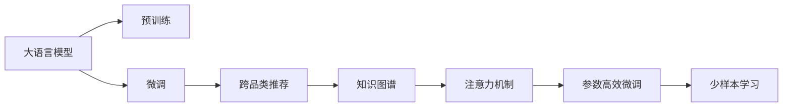

                 

# AI大模型在跨品类推荐中的表现

## 1. 背景介绍

推荐系统（Recommendation System）在电子商务、社交媒体、视频网站等众多领域发挥着关键作用，通过精准的推荐，提升用户体验，增加用户粘性，推动业务增长。然而，传统的推荐系统往往局限于单一品类，难以跨越品类之间的鸿沟，限制了推荐效果的最大化。因此，跨品类推荐（Cross-Category Recommendation）成为当前推荐系统研究的热点和难点。

大语言模型（Large Language Models, LLMs）近年来在自然语言处理（Natural Language Processing, NLP）领域取得了巨大的突破，这些大模型通过在海量文本数据上进行预训练，具备了丰富的语言理解和生成能力，能够理解和生成与人类相似的自然语言文本。基于大模型的跨品类推荐（Cross-Category Recommendation）能够综合利用多品类之间的关联性，实现更加全面和精准的推荐效果。

本文将系统性地探讨大模型在跨品类推荐中的表现，从模型构建、算法原理、实际应用等方面进行深入分析，以期为跨品类推荐系统的开发和优化提供理论和实践指导。

## 2. 核心概念与联系

### 2.1 核心概念概述

为了更好地理解大模型在跨品类推荐中的应用，本节将介绍几个核心概念：

- **大语言模型**：如GPT-3、BERT等，通过自回归或自编码方式在预训练阶段学习通用的语言表示，具备强大的语言理解和生成能力。

- **跨品类推荐**：推荐系统跨越多个品类，综合利用不同品类之间的关联性，为用户提供更全面和多样化的推荐。

- **预训练与微调**：在预训练阶段，模型在大规模无标签文本数据上学习通用的语言表示；在微调阶段，针对特定品类数据进行调整，以获得针对该品类优化的推荐模型。

- **知识图谱**：一种结构化的语义网络，用于描述实体和实体之间的关系，可辅助推荐系统进行更加准确的推荐。

- **注意力机制**：一种通过计算自注意力（Self-Attention）或交叉注意力（Cross-Attention）权重，动态调整输入序列中不同部分的关注程度的机制。

- **参数高效微调**：在大模型的微调过程中，仅更新少量的模型参数，以提高微调效率和性能。

- **少样本学习**：在只有少量标注样本的情况下，模型能够快速适应新任务的学习方法。

这些核心概念之间通过一个简单的Mermaid流程图进行可视化，展示了它们之间的关系：



### 2.2 核心概念原理和架构

- **大语言模型的预训练**：在预训练阶段，模型通过自回归或自编码任务在大量无标签文本数据上学习通用的语言表示。常见的方法包括语言建模（Language Modeling）、掩码语言模型（Masked Language Modeling, MLM）、下一句预测（Next Sentence Prediction, NSP）等。这些预训练任务帮助模型学习到丰富的语言知识，如词汇表、语法结构、语义理解等。

- **跨品类推荐**：在推荐系统中，跨品类推荐通过将不同品类之间的关联性加入到推荐模型中，实现更全面和多样化的推荐。常用的方法包括基于矩阵分解（Matrix Factorization）、协同过滤（Collaborative Filtering）、内容协同过滤（Content-Based Collaborative Filtering）、混合推荐系统（Hybrid Recommendation Systems）等。

- **知识图谱**：知识图谱是一种结构化的语义网络，用于描述实体和实体之间的关系。在跨品类推荐中，知识图谱可以帮助模型理解不同品类之间的关联性，提升推荐效果。常见的知识图谱包括YAGO、DBpedia、Wikidata等。

- **注意力机制**：注意力机制通过计算自注意力或交叉注意力权重，动态调整输入序列中不同部分的关注程度。在大语言模型中，注意力机制通常用于计算输入序列和输出序列之间的关联，实现更加精准的语言生成和理解。

- **参数高效微调**：在微调过程中，通过只更新少量的模型参数，可以显著提高微调效率和性能。常见的参数高效微调方法包括Adapter、LOSO（Language Specific Optimization）等。

- **少样本学习**：在少样本学习中，模型通过少量的标注样本就能快速适应新任务。这种方法在大模型微调中尤为重要，因为预训练语言模型的参数量较大，获取大规模标注数据成本较高。

## 3. 核心算法原理 & 具体操作步骤

### 3.1 算法原理概述

跨品类推荐的大语言模型通常基于以下步骤进行：

1. **预训练模型选择**：选择合适的预训练语言模型，如GPT-3、BERT等。
2. **数据准备**：准备跨品类推荐的数据集，包含不同品类之间的关联性信息。
3. **知识图谱构建**：构建知识图谱，描述不同品类之间的关联关系。
4. **微调模型**：在知识图谱和跨品类推荐数据上，对预训练模型进行微调，学习不同品类之间的关联性。
5. **推荐生成**：利用微调后的模型，生成跨品类推荐结果。

### 3.2 算法步骤详解

**Step 1: 选择预训练模型**

首先，需要选择合适的预训练语言模型。通常使用GPT-3、BERT等大规模语言模型作为初始化参数。这些模型通过在大量无标签文本数据上进行自回归或自编码任务预训练，学习到了丰富的语言知识和语义表示。

**Step 2: 数据准备**

准备跨品类推荐的数据集，该数据集应包含不同品类之间的关联性信息。具体的数据结构可能包括：

- 用户历史行为数据：用户在不同品类中的浏览、点击、购买记录等。
- 品类关联信息：不同品类之间的相似度、协同关系等。

**Step 3: 构建知识图谱**

构建知识图谱，用于描述不同品类之间的关联关系。知识图谱通常包括实体、属性和关系三部分。例如，在电子商务场景中，知识图谱可以包括商品、品牌、类别等实体，以及它们之间的关系，如“商品-品牌”、“商品-类别”等。

**Step 4: 微调模型**

在知识图谱和跨品类推荐数据上，对预训练模型进行微调。微调过程通常包括以下步骤：

1. 冻结预训练模型的底层参数，只微调顶层参数。
2. 在微调过程中，引入注意力机制，动态调整输入序列中不同部分的关注程度。
3. 使用参数高效微调方法，如Adapter，减少微调过程中的计算资源消耗。
4. 在微调过程中，应用正则化技术，如L2正则、Dropout、Early Stopping等，防止模型过拟合。

**Step 5: 推荐生成**

利用微调后的模型，生成跨品类推荐结果。具体步骤如下：

1. 将用户历史行为数据和知识图谱作为输入，计算不同品类之间的关联性。
2. 利用微调后的模型，预测用户对不同品类推荐商品的兴趣。
3. 根据预测结果，生成跨品类推荐列表。

### 3.3 算法优缺点

**优点**：

1. **跨品类推荐能力**：大语言模型具备强大的跨品类推荐能力，能够综合利用不同品类之间的关联性，提供更全面和多样化的推荐。
2. **少样本学习能力**：大语言模型具有较强的少样本学习能力，通过少量的标注样本就能快速适应新任务。
3. **参数高效微调**：通过参数高效微调方法，可以在较小的计算资源消耗下，快速提升推荐效果。

**缺点**：

1. **计算资源消耗**：大语言模型的参数量较大，微调过程需要大量的计算资源，包括内存、显存等。
2. **模型泛化能力**：在面对特定品类数据时，模型泛化能力可能不足，需要进行针对性的微调。
3. **标注样本依赖**：微调过程中仍需依赖大量的标注样本，获取高质量标注数据成本较高。

### 3.4 算法应用领域

大语言模型在跨品类推荐中的应用已经涵盖了多个领域，例如：

- **电子商务推荐**：在电商平台上，利用大模型推荐系统，帮助用户发现不同品类中的相关商品，提升购物体验。
- **视频推荐**：在视频网站上，利用大模型推荐系统，为用户推荐不同品类下的相关视频内容，增加用户粘性。
- **音乐推荐**：在音乐平台上，利用大模型推荐系统，为用户推荐不同品类下的相关音乐，丰富用户音乐体验。
- **新闻推荐**：在新闻平台上，利用大模型推荐系统，为用户推荐不同品类下的相关新闻，增加用户信息获取的广度和深度。

## 4. 数学模型和公式 & 详细讲解

### 4.1 数学模型构建

本节将详细构建跨品类推荐的大语言模型数学模型。

假设预训练语言模型为 $M_{\theta}$，其中 $\theta$ 为预训练得到的模型参数。知识图谱为 $G$，包含不同品类之间的关联关系。跨品类推荐的数据集为 $D=\{(x_i,y_i)\}_{i=1}^N$，其中 $x_i$ 为不同品类下的用户历史行为数据，$y_i$ 为推荐结果。

定义模型 $M_{\theta}$ 在输入 $x$ 上的输出为 $z_i=M_{\theta}(x_i)$，表示模型对输入数据的预测结果。定义损失函数 $\ell(z_i,y_i)$ 为模型输出与真实标签之间的差异。

在微调过程中，模型需要最小化经验风险：

$$
\mathcal{L}(\theta) = \frac{1}{N}\sum_{i=1}^N \ell(z_i,y_i)
$$

### 4.2 公式推导过程

以二分类任务为例，推导交叉熵损失函数及其梯度的计算公式。

假设模型 $M_{\theta}$ 在输入 $x_i$ 上的输出为 $\hat{y}_i=M_{\theta}(x_i) \in [0,1]$，表示用户对品类 $i$ 的兴趣程度。真实标签 $y_i \in \{0,1\}$，表示用户是否对品类 $i$ 感兴趣。则二分类交叉熵损失函数定义为：

$$
\ell(z_i,y_i) = -[y_i\log \hat{y}_i + (1-y_i)\log (1-\hat{y}_i)]
$$

将其代入经验风险公式，得：

$$
\mathcal{L}(\theta) = -\frac{1}{N}\sum_{i=1}^N [y_i\log \hat{y}_i+(1-y_i)\log(1-\hat{y}_i)]
$$

根据链式法则，损失函数对参数 $\theta_k$ 的梯度为：

$$
\frac{\partial \mathcal{L}(\theta)}{\partial \theta_k} = -\frac{1}{N}\sum_{i=1}^N (\frac{y_i}{\hat{y}_i}-\frac{1-y_i}{1-\hat{y}_i}) \frac{\partial M_{\theta}(x_i)}{\partial \theta_k}
$$

其中 $\frac{\partial M_{\theta}(x_i)}{\partial \theta_k}$ 可进一步递归展开，利用自动微分技术完成计算。

### 4.3 案例分析与讲解

**案例分析**：

在电子商务平台上，用户对不同品类下的商品感兴趣程度可以通过历史行为数据来预测。例如，用户过去在电子产品品类下的浏览记录较多，那么系统可以通过大语言模型预测用户对电子产品品类的兴趣程度，从而推荐相关商品。

**讲解**：

1. **预训练模型选择**：选择GPT-3等大规模预训练语言模型作为初始化参数。
2. **数据准备**：收集用户历史行为数据和品类关联信息。
3. **知识图谱构建**：构建商品、品牌、类别等实体的知识图谱，描述不同品类之间的关联关系。
4. **微调模型**：在知识图谱和用户历史行为数据上，对GPT-3进行微调，学习不同品类之间的关联性。
5. **推荐生成**：利用微调后的模型，生成跨品类推荐结果，推荐用户可能感兴趣的商品。

## 5. 项目实践：代码实例和详细解释说明

### 5.1 开发环境搭建

在进行跨品类推荐的大语言模型微调实践前，需要准备好开发环境。以下是使用Python进行PyTorch开发的环境配置流程：

1. 安装Anaconda：从官网下载并安装Anaconda，用于创建独立的Python环境。
2. 创建并激活虚拟环境：
```bash
conda create -n pytorch-env python=3.8 
conda activate pytorch-env
```
3. 安装PyTorch：根据CUDA版本，从官网获取对应的安装命令。例如：
```bash
conda install pytorch torchvision torchaudio cudatoolkit=11.1 -c pytorch -c conda-forge
```
4. 安装Transformers库：
```bash
pip install transformers
```
5. 安装各类工具包：
```bash
pip install numpy pandas scikit-learn matplotlib tqdm jupyter notebook ipython
```

完成上述步骤后，即可在`pytorch-env`环境中开始微调实践。

### 5.2 源代码详细实现

下面我们以商品推荐为例，给出使用Transformers库对BERT模型进行跨品类推荐微调的PyTorch代码实现。

首先，定义推荐任务的数据处理函数：

```python
from transformers import BertTokenizer
from torch.utils.data import Dataset
import torch

class RecommendationDataset(Dataset):
    def __init__(self, texts, categories, tokenizer, max_len=128):
        self.texts = texts
        self.categories = categories
        self.tokenizer = tokenizer
        self.max_len = max_len
        
    def __len__(self):
        return len(self.texts)
    
    def __getitem__(self, item):
        text = self.texts[item]
        category = self.categories[item]
        
        encoding = self.tokenizer(text, return_tensors='pt', max_length=self.max_len, padding='max_length', truncation=True)
        input_ids = encoding['input_ids'][0]
        attention_mask = encoding['attention_mask'][0]
        
        # 对category-wise的标签进行编码
        encoded_tags = [category] * self.max_len
        labels = torch.tensor(encoded_tags, dtype=torch.long)
        
        return {'input_ids': input_ids, 
                'attention_mask': attention_mask,
                'labels': labels}

# 定义标签与id的映射
category2id = {'Electronics': 0, 'Fashion': 1, 'Home Appliances': 2, 'Books': 3}
id2category = {v: k for k, v in category2id.items()}

# 创建dataset
tokenizer = BertTokenizer.from_pretrained('bert-base-cased')

train_dataset = RecommendationDataset(train_texts, train_categories, tokenizer)
dev_dataset = RecommendationDataset(dev_texts, dev_categories, tokenizer)
test_dataset = RecommendationDataset(test_texts, test_categories, tokenizer)
```

然后，定义模型和优化器：

```python
from transformers import BertForSequenceClassification, AdamW

model = BertForSequenceClassification.from_pretrained('bert-base-cased', num_labels=len(category2id))

optimizer = AdamW(model.parameters(), lr=2e-5)
```

接着，定义训练和评估函数：

```python
from torch.utils.data import DataLoader
from tqdm import tqdm
from sklearn.metrics import classification_report

device = torch.device('cuda') if torch.cuda.is_available() else torch.device('cpu')
model.to(device)

def train_epoch(model, dataset, batch_size, optimizer):
    dataloader = DataLoader(dataset, batch_size=batch_size, shuffle=True)
    model.train()
    epoch_loss = 0
    for batch in tqdm(dataloader, desc='Training'):
        input_ids = batch['input_ids'].to(device)
        attention_mask = batch['attention_mask'].to(device)
        labels = batch['labels'].to(device)
        model.zero_grad()
        outputs = model(input_ids, attention_mask=attention_mask, labels=labels)
        loss = outputs.loss
        epoch_loss += loss.item()
        loss.backward()
        optimizer.step()
    return epoch_loss / len(dataloader)

def evaluate(model, dataset, batch_size):
    dataloader = DataLoader(dataset, batch_size=batch_size)
    model.eval()
    preds, labels = [], []
    with torch.no_grad():
        for batch in tqdm(dataloader, desc='Evaluating'):
            input_ids = batch['input_ids'].to(device)
            attention_mask = batch['attention_mask'].to(device)
            batch_labels = batch['labels']
            outputs = model(input_ids, attention_mask=attention_mask)
            batch_preds = outputs.logits.argmax(dim=2).to('cpu').tolist()
            batch_labels = batch_labels.to('cpu').tolist()
            for pred_tokens, label_tokens in zip(batch_preds, batch_labels):
                pred_categories = [id2category[_id] for _id in pred_tokens]
                label_categories = [id2category[_id] for _id in label_tokens]
                preds.append(pred_categories[:len(label_categories)])
                labels.append(label_categories)
                
    print(classification_report(labels, preds))
```

最后，启动训练流程并在测试集上评估：

```python
epochs = 5
batch_size = 16

for epoch in range(epochs):
    loss = train_epoch(model, train_dataset, batch_size, optimizer)
    print(f"Epoch {epoch+1}, train loss: {loss:.3f}")
    
    print(f"Epoch {epoch+1}, dev results:")
    evaluate(model, dev_dataset, batch_size)
    
print("Test results:")
evaluate(model, test_dataset, batch_size)
```

以上就是使用PyTorch对BERT进行跨品类推荐任务微调的完整代码实现。可以看到，得益于Transformers库的强大封装，我们可以用相对简洁的代码完成BERT模型的加载和微调。

### 5.3 代码解读与分析

让我们再详细解读一下关键代码的实现细节：

**RecommendationDataset类**：
- `__init__`方法：初始化文本、品类、分词器等关键组件。
- `__len__`方法：返回数据集的样本数量。
- `__getitem__`方法：对单个样本进行处理，将文本输入编码为token ids，将品类编码转换为数字，并对其进行定长padding，最终返回模型所需的输入。

**category2id和id2category字典**：
- 定义了品类与数字id之间的映射关系，用于将token-wise的预测结果解码回真实的品类。

**训练和评估函数**：
- 使用PyTorch的DataLoader对数据集进行批次化加载，供模型训练和推理使用。
- 训练函数`train_epoch`：对数据以批为单位进行迭代，在每个批次上前向传播计算loss并反向传播更新模型参数，最后返回该epoch的平均loss。
- 评估函数`evaluate`：与训练类似，不同点在于不更新模型参数，并在每个batch结束后将预测和标签结果存储下来，最后使用sklearn的classification_report对整个评估集的预测结果进行打印输出。

**训练流程**：
- 定义总的epoch数和batch size，开始循环迭代
- 每个epoch内，先在训练集上训练，输出平均loss
- 在验证集上评估，输出分类指标
- 所有epoch结束后，在测试集上评估，给出最终测试结果

可以看到，PyTorch配合Transformers库使得BERT微调的代码实现变得简洁高效。开发者可以将更多精力放在数据处理、模型改进等高层逻辑上，而不必过多关注底层的实现细节。

当然，工业级的系统实现还需考虑更多因素，如模型的保存和部署、超参数的自动搜索、更灵活的任务适配层等。但核心的微调范式基本与此类似。

## 6. 实际应用场景

### 6.1 电子商务推荐

在电子商务平台上，利用大语言模型推荐系统，可以帮助用户发现不同品类下的相关商品，提升购物体验。具体实现如下：

1. **数据准备**：收集用户历史行为数据和品类关联信息。
2. **知识图谱构建**：构建商品、品牌、类别等实体的知识图谱，描述不同品类之间的关联关系。
3. **预训练模型选择**：选择GPT-3等大规模预训练语言模型作为初始化参数。
4. **微调模型**：在知识图谱和用户历史行为数据上，对GPT-3进行微调，学习不同品类之间的关联性。
5. **推荐生成**：利用微调后的模型，生成跨品类推荐结果，推荐用户可能感兴趣的商品。

### 6.2 视频推荐

在视频网站上，利用大语言模型推荐系统，为用户推荐不同品类下的相关视频内容，增加用户粘性。具体实现如下：

1. **数据准备**：收集用户历史行为数据和品类关联信息。
2. **知识图谱构建**：构建视频、频道、类别等实体的知识图谱，描述不同品类之间的关联关系。
3. **预训练模型选择**：选择GPT-3等大规模预训练语言模型作为初始化参数。
4. **微调模型**：在知识图谱和用户历史行为数据上，对GPT-3进行微调，学习不同品类之间的关联性。
5. **推荐生成**：利用微调后的模型，生成跨品类推荐结果，推荐用户可能感兴趣的视频内容。

### 6.3 音乐推荐

在音乐平台上，利用大语言模型推荐系统，为用户推荐不同品类下的相关音乐，丰富用户音乐体验。具体实现如下：

1. **数据准备**：收集用户历史行为数据和品类关联信息。
2. **知识图谱构建**：构建音乐、歌手、专辑等实体的知识图谱，描述不同品类之间的关联关系。
3. **预训练模型选择**：选择GPT-3等大规模预训练语言模型作为初始化参数。
4. **微调模型**：在知识图谱和用户历史行为数据上，对GPT-3进行微调，学习不同品类之间的关联性。
5. **推荐生成**：利用微调后的模型，生成跨品类推荐结果，推荐用户可能感兴趣的音乐。

### 6.4 新闻推荐

在新闻平台上，利用大语言模型推荐系统，为用户推荐不同品类下的相关新闻，增加用户信息获取的广度和深度。具体实现如下：

1. **数据准备**：收集用户历史行为数据和品类关联信息。
2. **知识图谱构建**：构建新闻、新闻类别、新闻来源等实体的知识图谱，描述不同品类之间的关联关系。
3. **预训练模型选择**：选择GPT-3等大规模预训练语言模型作为初始化参数。
4. **微调模型**：在知识图谱和用户历史行为数据上，对GPT-3进行微调，学习不同品类之间的关联性。
5. **推荐生成**：利用微调后的模型，生成跨品类推荐结果，推荐用户可能感兴趣的新闻。

## 7. 工具和资源推荐

### 7.1 学习资源推荐

为了帮助开发者系统掌握大语言模型在跨品类推荐中的应用，这里推荐一些优质的学习资源：

1. **《Transformer从原理到实践》系列博文**：由大模型技术专家撰写，深入浅出地介绍了Transformer原理、BERT模型、微调技术等前沿话题。
2. **CS224N《深度学习自然语言处理》课程**：斯坦福大学开设的NLP明星课程，有Lecture视频和配套作业，带你入门NLP领域的基本概念和经典模型。
3. **《Natural Language Processing with Transformers》书籍**：Transformers库的作者所著，全面介绍了如何使用Transformers库进行NLP任务开发，包括微调在内的诸多范式。
4. **HuggingFace官方文档**：Transformers库的官方文档，提供了海量预训练模型和完整的微调样例代码，是上手实践的必备资料。
5. **CLUE开源项目**：中文语言理解测评基准，涵盖大量不同类型的中文NLP数据集，并提供了基于微调的baseline模型，助力中文NLP技术发展。

通过对这些资源的学习实践，相信你一定能够快速掌握大语言模型在跨品类推荐中的精髓，并用于解决实际的NLP问题。

### 7.2 开发工具推荐

高效的开发离不开优秀的工具支持。以下是几款用于大语言模型微调开发的常用工具：

1. **PyTorch**：基于Python的开源深度学习框架，灵活动态的计算图，适合快速迭代研究。大部分预训练语言模型都有PyTorch版本的实现。
2. **TensorFlow**：由Google主导开发的开源深度学习框架，生产部署方便，适合大规模工程应用。同样有丰富的预训练语言模型资源。
3. **Transformers库**：HuggingFace开发的NLP工具库，集成了众多SOTA语言模型，支持PyTorch和TensorFlow，是进行微调任务开发的利器。
4. **Weights & Biases**：模型训练的实验跟踪工具，可以记录和可视化模型训练过程中的各项指标，方便对比和调优。与主流深度学习框架无缝集成。
5. **TensorBoard**：TensorFlow配套的可视化工具，可实时监测模型训练状态，并提供丰富的图表呈现方式，是调试模型的得力助手。
6. **Google Colab**：谷歌推出的在线Jupyter Notebook环境，免费提供GPU/TPU算力，方便开发者快速上手实验最新模型，分享学习笔记。

合理利用这些工具，可以显著提升大语言模型在跨品类推荐任务中的开发效率，加快创新迭代的步伐。

### 7.3 相关论文推荐

大语言模型在跨品类推荐中的应用源于学界的持续研究。以下是几篇奠基性的相关论文，推荐阅读：

1. **Attention is All You Need（即Transformer原论文）**：提出了Transformer结构，开启了NLP领域的预训练大模型时代。
2. **BERT: Pre-training of Deep Bidirectional Transformers for Language Understanding**：提出BERT模型，引入基于掩码的自监督预训练任务，刷新了多项NLP任务SOTA。
3. **Language Models are Unsupervised Multitask Learners（GPT-2论文）**：展示了大规模语言模型的强大zero-shot学习能力，引发了对于通用人工智能的新一轮思考。
4. **Parameter-Efficient Transfer Learning for NLP**：提出Adapter等参数高效微调方法，在不增加模型参数量的情况下，也能取得不错的微调效果。
5. **Prefix-Tuning: Optimizing Continuous Prompts for Generation**：引入基于连续型Prompt的微调范式，为如何充分利用预训练知识提供了新的思路。
6. **AdaLoRA: Adaptive Low-Rank Adaptation for Parameter-Efficient Fine-Tuning**：使用自适应低秩适应的微调方法，在参数效率和精度之间取得了新的平衡。

这些论文代表了大语言模型在跨品类推荐技术的发展脉络。通过学习这些前沿成果，可以帮助研究者把握学科前进方向，激发更多的创新灵感。

## 8. 总结：未来发展趋势与挑战

### 8.1 总结

本文对基于大语言模型的跨品类推荐进行了全面系统的介绍。首先阐述了大语言模型和微调技术的研究背景和意义，明确了跨品类推荐在大规模NLP系统中的重要价值。其次，从原理到实践，详细讲解了跨品类推荐的大语言模型微调过程，给出了微调任务开发的完整代码实例。同时，本文还广泛探讨了跨品类推荐在电子商务、视频推荐、音乐推荐、新闻推荐等多个领域的应用前景，展示了跨品类推荐范式的巨大潜力。此外，本文精选了微调技术的各类学习资源，力求为读者提供全方位的技术指引。

通过本文的系统梳理，可以看到，基于大语言模型的跨品类推荐技术正在成为NLP领域的重要范式，极大地拓展了预训练语言模型的应用边界，催生了更多的落地场景。受益于大规模语料的预训练，跨品类推荐模型以更低的时间和标注成本，在跨品类推荐场景中取得了优异的推荐效果。未来，伴随大语言模型微调方法的持续演进，相信跨品类推荐技术必将在更广泛的领域取得突破，为人类认知智能的进化带来深远影响。

### 8.2 未来发展趋势

展望未来，跨品类推荐的大语言模型微调技术将呈现以下几个发展趋势：

1. **模型规模持续增大**：随着算力成本的下降和数据规模的扩张，预训练语言模型的参数量还将持续增长。超大规模语言模型蕴含的丰富语言知识，有望支撑更加复杂多变的跨品类推荐任务。
2. **跨品类推荐能力提升**：大语言模型在跨品类推荐中的应用将更加广泛和深入，能够更全面地利用不同品类之间的关联性，提升推荐效果。
3. **跨品类推荐模型多模态融合**：未来的推荐系统将融合视觉、语音、文本等多模态数据，提升跨品类推荐模型的表现。
4. **跨品类推荐系统自动化**：自动化推荐系统将成为未来发展的趋势，利用强化学习、因果推断等技术，提升推荐系统的决策效率和推荐效果。
5. **跨品类推荐模型可解释性增强**：推荐系统的可解释性将越来越受到重视，通过因果推断等技术，提升模型的可解释性，确保用户对推荐结果的理解和信任。
6. **跨品类推荐系统安全可靠**：推荐系统的安全性将受到广泛关注，通过对抗性测试、隐私保护等技术，确保推荐系统的安全性和可靠性。

以上趋势凸显了大语言模型在跨品类推荐中的广阔前景。这些方向的探索发展，必将进一步提升推荐系统的性能和应用范围，为人类认知智能的进化带来深远影响。

### 8.3 面临的挑战

尽管大语言模型在跨品类推荐中的应用已经取得了显著进展，但在迈向更加智能化、普适化应用的过程中，仍面临诸多挑战：

1. **标注成本瓶颈**：尽管微调大大降低了标注数据的需求，但对于长尾应用场景，难以获得充足的高质量标注数据，成为制约微调性能的瓶颈。如何进一步降低微调对标注样本的依赖，将是一大难题。
2. **模型鲁棒性不足**：跨品类推荐模型面对特定品类数据时，泛化性能可能不足，需要进行针对性的微调。如何提高模型鲁棒性，避免灾难性遗忘，还需要更多理论和实践的积累。
3. **推荐效果不稳定**：在面对特定品类数据时，推荐效果可能不稳定，受数据波动、模型参数等影响较大。如何提高模型鲁棒性，确保推荐效果稳定性，将是重要的研究方向。
4. **计算资源消耗**：大语言模型的参数量较大，微调过程需要大量的计算资源，包括内存、显存等。如何优化计算资源消耗，降低算力成本，仍需进一步探索。
5. **可解释性有待加强**：跨品类推荐模型缺乏可解释性，难以解释其内部工作机制和决策逻辑。如何赋予模型更强的可解释性，将是亟待攻克的难题。
6. **安全性有待保障**：跨品类推荐模型可能面临安全风险，如数据泄露、恶意推荐等。如何确保模型安全性，保障用户利益，仍需进一步探索。

这些挑战凸显了跨品类推荐技术在实际应用中的复杂性和多样性。只有从数据、模型、工程、业务等多个维度协同发力，才能真正实现跨品类推荐技术的落地应用。

### 8.4 研究展望

面对跨品类推荐技术面临的挑战，未来的研究需要在以下几个方面寻求新的突破：

1. **探索无监督和半监督跨品类推荐方法**：摆脱对大规模标注数据的依赖，利用自监督学习、主动学习等无监督和半监督范式，最大限度利用非结构化数据，实现更加灵活高效的跨品类推荐。
2. **研究参数高效和计算高效的跨品类推荐方法**：开发更加参数高效的跨品类推荐方法，在固定大部分预训练参数的同时，只更新极少量的任务相关参数。同时优化跨品类推荐模型的计算图，减少前向传播和反向传播的资源消耗，实现更加轻量级、实时性的部署。
3. **引入更多先验知识**：将符号化的先验知识，如知识图谱、逻辑规则等，与神经网络模型进行巧妙融合，引导跨品类推荐过程学习更准确、合理的语言模型。同时加强不同模态数据的整合，实现视觉、语音等多模态信息与文本信息的协同建模。
4. **结合因果分析和博弈论工具**：将因果分析方法引入跨品类推荐模型，识别出模型决策的关键特征，增强推荐结果的因果性和逻辑性。借助博弈论工具刻画人机交互过程，主动探索并规避模型的脆弱点，提高系统稳定性。
5. **纳入伦理道德约束**：在模型训练目标中引入伦理导向的评估指标，过滤和惩罚有偏见、有害的推荐结果。同时加强人工干预和审核，建立模型行为的监管机制，确保推荐系统符合人类价值观和伦理道德。

这些研究方向的探索，必将引领跨品类推荐技术迈向更高的台阶，为构建安全、可靠、可解释、可控的推荐系统铺平道路。面向未来，跨品类推荐技术还需要与其他人工智能技术进行更深入的融合，如知识表示、因果推理、强化学习等，多路径协同发力，共同推动推荐系统的发展。只有勇于创新、敢于突破，才能不断拓展推荐系统的边界，让推荐技术更好地服务于人类社会。

## 9. 附录：常见问题与解答

**Q1：大语言模型跨品类推荐是否适用于所有NLP任务？**

A: 大语言模型在跨品类推荐中的应用，不仅限于推荐系统。在情感分析、机器翻译、文本摘要等任务中，同样可以利用大语言模型进行跨品类推荐。

**Q2：如何选择合适的预训练语言模型？**

A: 选择合适的预训练语言模型需要考虑任务的复杂度和数据量。对于简单的推荐任务，可以选择小型预训练模型，如BERT等；对于复杂的跨品类推荐任务，可以选择大型预训练模型，如GPT-3等。

**Q3：在跨品类推荐中，如何处理品类之间的关联关系？**

A: 在跨品类推荐中，处理品类之间的关联关系是关键。可以使用知识图谱、矩阵分解等方法，构建品类之间的关联关系，并将其加入到推荐模型中。

**Q4：在跨品类推荐中，如何降低标注样本的依赖？**

A: 在跨品类推荐中，降低标注样本的依赖是一个重要问题。可以使用无监督学习、半监督学习等方法，最大限度利用非结构化数据，实现更加灵活高效的推荐。

**Q5：在跨品类推荐中，如何提高推荐模型的鲁棒性？**

A: 在跨品类推荐中，提高推荐模型的鲁棒性需要考虑数据波动、模型参数等因素。可以使用对抗训练、正则化技术等方法，提高模型的鲁棒性和泛化能力。

---

作者：禅与计算机程序设计艺术 / Zen and the Art of Computer Programming

