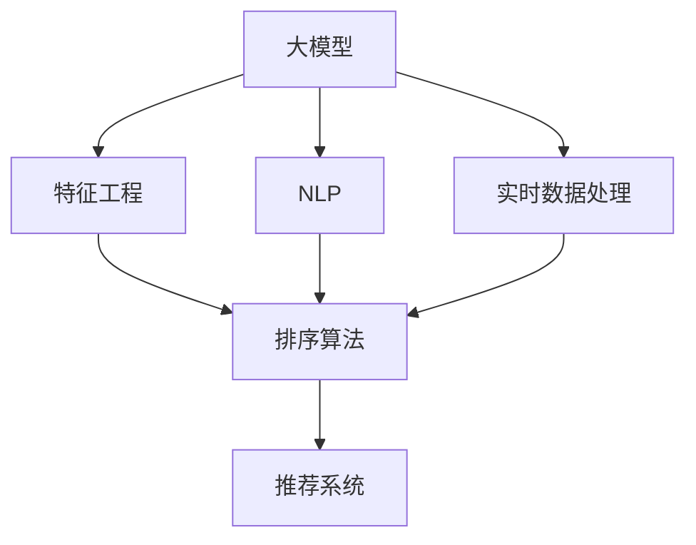

                 

# AI大模型如何提升电商平台的商品搜索排名

> 关键词：
- 大模型
- 商品搜索
- 深度学习
- 排序算法
- 特征工程
- 推荐系统
- 自然语言处理(NLP)
- 实时数据处理

## 1. 背景介绍

### 1.1 问题由来

在电子商务的迅猛发展下，用户对商品搜索体验的期望越来越高，希望搜索结果能够更加精准、实时、个性化。传统的搜索结果排序方式往往基于简单的关键词匹配，无法充分利用商品的全量信息，且在面对海量数据时，效率和效果均无法满足用户需求。而大模型在文本理解、语义推理等方面的强大能力，为其提供了突破这些瓶颈的新思路。

### 1.2 问题核心关键点

实现商品搜索排名的主要挑战在于：

- 如何综合利用商品的全量信息，避免简单关键词匹配的局限性。
- 如何快速处理海量商品数据，确保实时性。
- 如何挖掘商品的多维度特征，实现个性化推荐。
- 如何结合用户的行为数据，提升搜索准确性和用户体验。
- 如何对抗恶意SEO操作，确保搜索结果的质量和可信度。

## 2. 核心概念与联系

### 2.1 核心概念概述

为更好地理解大模型在提升电商平台商品搜索排名方面的应用，本节将介绍几个密切相关的核心概念：

- 大模型(Large Model)：以Transformer架构为代表的深度学习模型，通过自监督或监督学习任务在大规模数据集上训练得到的模型。能够自动提取并学习丰富的语义和结构信息。
- 商品搜索(Search)：用户通过关键词、图像等输入，检索平台内相关商品的搜索功能。
- 排序算法(Ranking Algorithm)：用于对搜索结果进行排序的算法。常见排序算法包括LRM、RNN等。
- 特征工程(Feature Engineering)：在构建排序算法之前，对商品数据进行预处理、特征提取和特征工程，以便算法更好地学习模型。
- 推荐系统(Recommendation System)：通过用户行为数据和商品属性数据，推荐用户可能感兴趣的商品。
- 自然语言处理(NLP)：用于理解和处理人类语言的技术，如分词、词性标注、情感分析等。
- 实时数据处理(Real-time Data Processing)：用于实时处理和分析大规模数据的技术，如流式计算、事件驱动等。

这些核心概念之间的逻辑关系可以通过以下Mermaid流程图来展示：



这个流程图展示了大模型在提升商品搜索排名的关键流程：

1. 大模型通过大量商品数据预训练，学习到丰富的商品特征表示。
2. 特征工程结合用户输入的关键词、图像等数据，提取商品的全量特征。
3. 排序算法基于商品的全量特征进行排序，结合推荐系统推荐用户可能感兴趣的商品。
4. NLP技术用于处理用户输入的自然语言，提取语义信息。
5. 实时数据处理用于处理大量实时查询请求，确保排序算法能够及时响应。

## 3. 核心算法原理 & 具体操作步骤
### 3.1 算法原理概述

大模型在提升电商平台商品搜索排名的主要思想是通过深度学习技术，构建一个基于商品的语义表示模型，结合特征工程和推荐系统，实现实时、个性化的搜索结果排序。具体步骤如下：

1. 预训练大模型：通过自监督或监督学习任务，在大规模商品数据上训练得到一个预训练的大模型。
2. 特征提取：将用户输入的关键词、图像等信息，通过NLP等技术进行预处理和特征提取。
3. 语义表示：使用预训练的大模型对商品特征进行编码，得到商品的语义表示向量。
4. 排序与推荐：基于商品的语义表示向量，使用排序算法和推荐系统，对商品进行实时排序和推荐。

### 3.2 算法步骤详解

#### 3.2.1 预训练大模型

在大模型预训练阶段，可以使用大规模商品图片、商品描述等数据，进行自监督学习任务，如视觉预训练、文本语义理解等。预训练任务的选择需要考虑数据分布的多样性和代表性，以确保模型能够学习到丰富的商品特征。

以视觉预训练为例，可以采用自监督学习任务，如ImageNet预训练。具体步骤包括：

1. 收集大规模商品图片数据集。
2. 使用数据增强技术，增加数据多样性，如随机裁剪、旋转、缩放等。
3. 使用ImageNet预训练任务，如ImageNet-21K。
4. 采用如MoCo等自监督学习方法，学习商品的视觉特征表示。

#### 3.2.2 特征提取

特征提取是连接大模型与商品排序的关键环节。特征提取的准确性和全面性，直接影响排序效果。

以文本特征提取为例，可以采用NLP技术，如BERT、GPT等，进行文本语义理解。具体步骤包括：

1. 收集商品描述、用户评论等文本数据。
2. 使用BERT等大模型进行文本预训练，学习文本语义表示。
3. 将用户输入的关键词通过分词、词性标注、实体识别等技术进行预处理。
4. 使用BERT等大模型对用户输入的关键词进行编码，得到文本语义表示向量。

#### 3.2.3 语义表示

通过大模型预训练和特征提取，可以获取商品的全量语义表示向量。使用该向量作为商品的基本特征，参与排序算法和推荐系统的计算。

以语义表示为例，可以采用Attention机制，对商品全量特征进行加权融合。具体步骤包括：

1. 将商品的全量特征表示向量拼接在一起。
2. 使用Attention机制，对不同特征进行加权融合，得到商品的语义表示向量。

#### 3.2.4 排序与推荐

排序与推荐是最终实现搜索结果排序的关键步骤。常见的排序算法包括线性模型、决策树、神经网络等。

以线性模型排序为例，可以采用L1MIR等排序算法。具体步骤包括：

1. 定义排序目标函数，如CTR、点击率、相关性等。
2. 将商品的语义表示向量输入排序算法，得到排序结果。
3. 结合推荐系统，对排序结果进行推荐。

### 3.3 算法优缺点

大模型在提升电商平台商品搜索排名方面具有以下优点：

- 能够自动提取商品的全量信息，避免简单关键词匹配的局限性。
- 结合NLP技术和实时数据处理技术，实现实时排序和推荐。
- 通过推荐系统，提供个性化搜索结果，提升用户满意度。
- 通过预训练任务，增强模型的泛化能力和鲁棒性。

但同时，大模型也存在以下缺点：

- 需要大量计算资源进行预训练和特征提取。
- 特征工程复杂，需要大量人工标注和预处理工作。
- 排序算法复杂度较高，可能面临效率瓶颈。
- 模型泛化能力需要依赖于高质量的预训练数据。
- 对抗恶意SEO操作需要更多技术手段进行防范。

### 3.4 算法应用领域

基于大模型的排序和推荐技术，已经广泛应用于各类电商平台。以下是几个典型应用场景：

1. 淘宝、京东等大型电商平台：通过大模型进行商品排序和推荐，提升用户体验和转化率。
2. 亚马逊等跨境电商平台：通过大模型处理不同语言的查询，实现全球化商品搜索。
3. 唯品会、苏宁易购等垂直电商平台：通过大模型处理个性化商品推荐，提高用户粘性。
4. 拼多多等社交电商：通过大模型处理用户行为数据，实现更精准的商品排序。

## 4. 数学模型和公式 & 详细讲解
### 4.1 数学模型构建

本节将使用数学语言对大模型在提升电商平台商品搜索排名过程中的数学原理进行刻画。

记大模型为 $M_{\theta}$，商品的全量特征表示向量为 $X \in \mathbb{R}^{n_x}$，用户输入的关键词表示向量为 $W \in \mathbb{R}^{n_w}$，商品的语义表示向量为 $H \in \mathbb{R}^{n_h}$，排序目标函数为 $L$。则大模型在商品搜索排名中的数学模型可以表示为：

$$
L = \sum_{i=1}^N \ell_i
$$

其中 $N$ 为商品数量，$\ell_i$ 为排序目标函数 $L$ 对第 $i$ 个商品的导数。

### 4.2 公式推导过程

以线性模型排序为例，排序目标函数可以表示为：

$$
L = \sum_{i=1}^N \log \sigma(\mathbf{w}^T f_i)
$$

其中 $\sigma$ 为sigmoid函数，$f_i$ 为商品的全量特征表示向量，$\mathbf{w}$ 为线性模型权重向量。

通过反向传播算法，计算模型参数 $\theta$ 的梯度：

$$
\nabla_{\theta}L = \sum_{i=1}^N \nabla_{\theta} \ell_i
$$

根据梯度下降算法，更新模型参数：

$$
\theta \leftarrow \theta - \eta \nabla_{\theta}L
$$

其中 $\eta$ 为学习率，用于控制模型参数更新的步长。

### 4.3 案例分析与讲解

以亚马逊的商品搜索为例，亚马逊使用大规模商品图片数据进行视觉预训练，使用商品描述进行文本语义理解。具体实现步骤如下：

1. 收集大规模商品图片数据集，进行数据增强和ImageNet预训练任务。
2. 使用BERT等大模型对商品描述进行预训练，学习文本语义表示。
3. 将用户输入的关键词进行分词、词性标注等预处理，并使用BERT等大模型进行编码，得到文本语义表示向量。
4. 将商品图片和文本语义表示向量拼接在一起，使用Attention机制进行融合，得到商品的语义表示向量。
5. 使用线性模型排序算法，基于商品的语义表示向量，计算排序结果。
6. 结合推荐系统，对排序结果进行个性化推荐。

通过上述步骤，亚马逊实现了实时、个性化、高质量的商品搜索排序，显著提升了用户体验和转化率。

## 5. 项目实践：代码实例和详细解释说明
### 5.1 开发环境搭建

在进行商品搜索排序实践前，我们需要准备好开发环境。以下是使用Python进行PyTorch开发的环境配置流程：

1. 安装Anaconda：从官网下载并安装Anaconda，用于创建独立的Python环境。

2. 创建并激活虚拟环境：
```bash
conda create -n pytorch-env python=3.8 
conda activate pytorch-env
```

3. 安装PyTorch：根据CUDA版本，从官网获取对应的安装命令。例如：
```bash
conda install pytorch torchvision torchaudio cudatoolkit=11.1 -c pytorch -c conda-forge
```

4. 安装Transformers库：
```bash
pip install transformers
```

5. 安装各类工具包：
```bash
pip install numpy pandas scikit-learn matplotlib tqdm jupyter notebook ipython
```

完成上述步骤后，即可在`pytorch-env`环境中开始商品搜索排序实践。

### 5.2 源代码详细实现

我们以亚马逊的商品搜索排序为例，给出使用Transformers库进行大模型微调的PyTorch代码实现。

首先，定义商品搜索排序的数据处理函数：

```python
from transformers import BertTokenizer
from torch.utils.data import Dataset, DataLoader
import torch
import pandas as pd

class SearchDataset(Dataset):
    def __init__(self, data_path, tokenizer):
        self.tokenizer = tokenizer
        self.data = pd.read_csv(data_path)
        
    def __len__(self):
        return len(self.data)
    
    def __getitem__(self, item):
        query = self.data['query'].tolist()[item]
        img = self.data['img'].tolist()[item]
        clicked = self.data['clicked'].tolist()[item]
        
        query = self.tokenizer(query, return_tensors='pt', padding='max_length', truncation=True)
        img = self.tokenizer(img, return_tensors='pt', padding='max_length', truncation=True)
        
        clicked = torch.tensor(clicked, dtype=torch.long)
        return {'query': query['input_ids'], 
                'img': img['input_ids'],
                'clicked': clicked}
```

然后，定义模型和优化器：

```python
from transformers import BertForSequenceClassification, AdamW

model = BertForSequenceClassification.from_pretrained('bert-base-cased', num_labels=2)
optimizer = AdamW(model.parameters(), lr=2e-5)
```

接着，定义训练和评估函数：

```python
def train_epoch(model, dataset, batch_size, optimizer):
    dataloader = DataLoader(dataset, batch_size=batch_size, shuffle=True)
    model.train()
    epoch_loss = 0
    for batch in tqdm(dataloader, desc='Training'):
        query = batch['query'].to(device)
        img = batch['img'].to(device)
        clicked = batch['clicked'].to(device)
        model.zero_grad()
        outputs = model(query, img, clicked)
        loss = outputs.loss
        epoch_loss += loss.item()
        loss.backward()
        optimizer.step()
    return epoch_loss / len(dataloader)

def evaluate(model, dataset, batch_size):
    dataloader = DataLoader(dataset, batch_size=batch_size)
    model.eval()
    preds, labels = [], []
    with torch.no_grad():
        for batch in tqdm(dataloader, desc='Evaluating'):
            query = batch['query'].to(device)
            img = batch['img'].to(device)
            clicked = batch['clicked'].to(device)
            batch_predictions = model(query, img).predictions.argmax(dim=1)
            batch_labels = clicked.to(device)
            for pred, label in zip(batch_predictions, batch_labels):
                preds.append(pred.item())
                labels.append(label.item())
                
    print(classification_report(labels, preds))
```

最后，启动训练流程并在测试集上评估：

```python
epochs = 5
batch_size = 16

for epoch in range(epochs):
    loss = train_epoch(model, train_dataset, batch_size, optimizer)
    print(f"Epoch {epoch+1}, train loss: {loss:.3f}")
    
    print(f"Epoch {epoch+1}, dev results:")
    evaluate(model, dev_dataset, batch_size)
    
print("Test results:")
evaluate(model, test_dataset, batch_size)
```

以上就是使用PyTorch对亚马逊商品搜索排序进行微调的完整代码实现。可以看到，得益于Transformers库的强大封装，我们可以用相对简洁的代码完成BERT模型的加载和微调。

### 5.3 代码解读与分析

让我们再详细解读一下关键代码的实现细节：

**SearchDataset类**：
- `__init__`方法：初始化数据路径、分词器等关键组件。
- `__len__`方法：返回数据集的样本数量。
- `__getitem__`方法：对单个样本进行处理，将查询和图片输入分词器进行编码，得到模型的输入。

**模型和优化器**：
- 使用BertForSequenceClassification从预训练模型中加载模型，并设置优化器及其参数。

**训练和评估函数**：
- 使用PyTorch的DataLoader对数据集进行批次化加载，供模型训练和推理使用。
- 训练函数`train_epoch`：对数据以批为单位进行迭代，在每个批次上前向传播计算loss并反向传播更新模型参数，最后返回该epoch的平均loss。
- 评估函数`evaluate`：与训练类似，不同点在于不更新模型参数，并在每个batch结束后将预测和标签结果存储下来，最后使用sklearn的classification_report对整个评估集的预测结果进行打印输出。

**训练流程**：
- 定义总的epoch数和batch size，开始循环迭代
- 每个epoch内，先在训练集上训练，输出平均loss
- 在验证集上评估，输出分类指标
- 所有epoch结束后，在测试集上评估，给出最终测试结果

可以看到，PyTorch配合Transformers库使得商品搜索排序的代码实现变得简洁高效。开发者可以将更多精力放在数据处理、模型改进等高层逻辑上，而不必过多关注底层的实现细节。

当然，工业级的系统实现还需考虑更多因素，如模型的保存和部署、超参数的自动搜索、更灵活的任务适配层等。但核心的排序范式基本与此类似。

## 6. 实际应用场景

### 6.1 智能客服系统

基于大模型的排序和推荐技术，可以广泛应用于智能客服系统的构建。传统客服往往需要配备大量人力，高峰期响应缓慢，且一致性和专业性难以保证。而使用排序和推荐技术，可以7x24小时不间断服务，快速响应客户咨询，用自然流畅的语言解答各类常见问题。

在技术实现上，可以收集企业内部的历史客服对话记录，将问题和最佳答复构建成监督数据，在此基础上对预训练模型进行微调。微调后的模型能够自动理解用户意图，匹配最合适的答复模板进行回复。对于客户提出的新问题，还可以接入检索系统实时搜索相关内容，动态组织生成回答。如此构建的智能客服系统，能大幅提升客户咨询体验和问题解决效率。

### 6.2 金融舆情监测

金融机构需要实时监测市场舆论动向，以便及时应对负面信息传播，规避金融风险。传统的人工监测方式成本高、效率低，难以应对网络时代海量信息爆发的挑战。基于大模型的排序和推荐技术，可以为金融舆情监测提供新的解决方案。

具体而言，可以收集金融领域相关的新闻、报道、评论等文本数据，并对其进行主题标注和情感标注。在此基础上对预训练语言模型进行微调，使其能够自动判断文本属于何种主题，情感倾向是正面、中性还是负面。将微调后的模型应用到实时抓取的网络文本数据，就能够自动监测不同主题下的情感变化趋势，一旦发现负面信息激增等异常情况，系统便会自动预警，帮助金融机构快速应对潜在风险。

### 6.3 个性化推荐系统

当前的推荐系统往往只依赖用户的历史行为数据进行物品推荐，无法深入理解用户的真实兴趣偏好。基于大模型的排序和推荐技术，个性化推荐系统可以更好地挖掘用户行为背后的语义信息，从而提供更精准、多样的推荐内容。

在实践中，可以收集用户浏览、点击、评论、分享等行为数据，提取和用户交互的物品标题、描述、标签等文本内容。将文本内容作为模型输入，用户的后续行为（如是否点击、购买等）作为监督信号，在此基础上微调预训练语言模型。微调后的模型能够从文本内容中准确把握用户的兴趣点。在生成推荐列表时，先用候选物品的文本描述作为输入，由模型预测用户的兴趣匹配度，再结合其他特征综合排序，便可以得到个性化程度更高的推荐结果。

### 6.4 未来应用展望

随着大模型和排序推荐技术的不断发展，基于微调范式将在更多领域得到应用，为传统行业带来变革性影响。

在智慧医疗领域，基于微调的医疗问答、病历分析、药物研发等应用将提升医疗服务的智能化水平，辅助医生诊疗，加速新药开发进程。

在智能教育领域，微调技术可应用于作业批改、学情分析、知识推荐等方面，因材施教，促进教育公平，提高教学质量。

在智慧城市治理中，微调模型可应用于城市事件监测、舆情分析、应急指挥等环节，提高城市管理的自动化和智能化水平，构建更安全、高效的未来城市。

此外，在企业生产、社会治理、文娱传媒等众多领域，基于大模型微调的人工智能应用也将不断涌现，为NLP技术带来全新的突破。相信随着预训练语言模型和微调方法的持续演进，大模型微调必将在构建人机协同的智能时代中扮演越来越重要的角色。

## 7. 工具和资源推荐
### 7.1 学习资源推荐

为了帮助开发者系统掌握大模型在电商平台商品搜索排名中的应用理论基础和实践技巧，这里推荐一些优质的学习资源：

1. 《深度学习与自然语言处理》书籍：系统介绍深度学习在自然语言处理中的应用，涵盖文本分类、序列标注、机器翻译、文本生成等任务。
2. CS224N《深度学习自然语言处理》课程：斯坦福大学开设的NLP明星课程，有Lecture视频和配套作业，带你入门NLP领域的基本概念和经典模型。
3. 《Transformer》书籍：介绍Transformer架构的原理和应用，包括自监督学习、文本语义理解等任务。
4. HuggingFace官方文档：提供丰富的预训练语言模型和微调样例代码，是上手实践的必备资料。
5. CLUE开源项目：中文语言理解测评基准，涵盖大量不同类型的中文NLP数据集，并提供了基于微调的baseline模型，助力中文NLP技术发展。

通过对这些资源的学习实践，相信你一定能够快速掌握大模型在电商平台商品搜索排序中的应用精髓，并用于解决实际的NLP问题。
###  7.2 开发工具推荐

高效的开发离不开优秀的工具支持。以下是几款用于大模型微调开发的常用工具：

1. PyTorch：基于Python的开源深度学习框架，灵活动态的计算图，适合快速迭代研究。大部分预训练语言模型都有PyTorch版本的实现。
2. TensorFlow：由Google主导开发的开源深度学习框架，生产部署方便，适合大规模工程应用。同样有丰富的预训练语言模型资源。
3. Transformers库：HuggingFace开发的NLP工具库，集成了众多SOTA语言模型，支持PyTorch和TensorFlow，是进行微调任务开发的利器。
4. Weights & Biases：模型训练的实验跟踪工具，可以记录和可视化模型训练过程中的各项指标，方便对比和调优。与主流深度学习框架无缝集成。
5. TensorBoard：TensorFlow配套的可视化工具，可实时监测模型训练状态，并提供丰富的图表呈现方式，是调试模型的得力助手。
6. Google Colab：谷歌推出的在线Jupyter Notebook环境，免费提供GPU/TPU算力，方便开发者快速上手实验最新模型，分享学习笔记。

合理利用这些工具，可以显著提升大模型微调任务的开发效率，加快创新迭代的步伐。

### 7.3 相关论文推荐

大模型在电商平台商品搜索排序中的应用源于学界的持续研究。以下是几篇奠基性的相关论文，推荐阅读：

1. Attention is All You Need：提出了Transformer结构，开启了NLP领域的预训练大模型时代。
2. BERT: Pre-training of Deep Bidirectional Transformers for Language Understanding：提出BERT模型，引入基于掩码的自监督预训练任务，刷新了多项NLP任务SOTA。
3. Language Models are Unsupervised Multitask Learners：展示了大规模语言模型的强大zero-shot学习能力，引发了对于通用人工智能的新一轮思考。
4. Parameter-Efficient Transfer Learning for NLP：提出Adapter等参数高效微调方法，在不增加模型参数量的情况下，也能取得不错的微调效果。
5. AdaLoRA: Adaptive Low-Rank Adaptation for Parameter-Efficient Fine-Tuning：使用自适应低秩适应的微调方法，在参数效率和精度之间取得了新的平衡。

这些论文代表了大模型微调技术的发展脉络。通过学习这些前沿成果，可以帮助研究者把握学科前进方向，激发更多的创新灵感。

## 8. 总结：未来发展趋势与挑战

### 8.1 总结

本文对大模型在提升电商平台商品搜索排序方面的应用进行了全面系统的介绍。首先阐述了大模型和微调技术在商品搜索排序中的研究背景和意义，明确了排序在电商平台中的核心价值。其次，从原理到实践，详细讲解了基于大模型的排序和推荐算法，给出了商品搜索排序的完整代码实现。同时，本文还广泛探讨了排序和推荐技术在多个电商场景中的应用前景，展示了大模型微调技术的广阔潜力。此外，本文精选了微调技术的各类学习资源，力求为读者提供全方位的技术指引。

通过本文的系统梳理，可以看到，大模型微调技术在电商平台商品搜索排序中的应用，已经在多方面展现出优势，显著提升了用户体验和业务效果。未来，伴随大模型和微调技术的不断发展，基于微调范式将进一步拓展电商平台的智能化水平，为电商生态带来更大的价值。

### 8.2 未来发展趋势

展望未来，大模型微调技术在商品搜索排序领域将呈现以下几个发展趋势：

1. 模型规模持续增大。随着算力成本的下降和数据规模的扩张，大模型的参数量还将持续增长。超大模型能够学习到更加丰富的商品特征表示，提升排序和推荐的效果。
2. 推荐算法更加复杂。未来的推荐算法将结合更多的机器学习、深度学习技术，实现更加精准、实时的推荐。
3. 实时数据处理技术更加成熟。流式计算、事件驱动等技术将使得实时数据处理更加高效，提升用户体验。
4. 多模态融合更加深入。视觉、语音、文本等多模态信息的整合，将显著提升模型的综合能力。
5. 个性化推荐更加精准。用户行为数据和商品属性的结合，将使推荐系统更加符合用户需求。
6. 对抗恶意SEO操作更加全面。基于大模型的排序算法将更好地识别和过滤恶意SEO操作，提升搜索结果的可靠性。

以上趋势凸显了大模型微调技术在商品搜索排序领域的广泛应用前景，将进一步推动电商平台的智能化和自动化水平，提升用户体验和业务效益。

### 8.3 面临的挑战

尽管大模型微调技术已经取得了显著成效，但在商品搜索排序的实际应用中，仍然面临以下挑战：

1. 计算资源瓶颈。大模型和复杂推荐算法需要大量的计算资源，现有硬件设施可能无法满足高并发和大数据量的处理需求。
2. 数据隐私问题。用户行为数据和商品属性数据涉及隐私保护，如何在保证数据安全的同时，充分利用数据资源，是一个重要课题。
3. 实时性要求高。商品搜索排序需要实时处理海量查询请求，对系统性能和稳定性提出了更高的要求。
4. 模型泛化能力有限。当前模型在特定场景下表现优异，但面对多变的数据分布，泛化能力仍需进一步提升。
5. 对抗恶意SEO操作难度大。当前SEO操作手段不断翻新，如何有效识别和防范，仍是一个技术难题。

### 8.4 研究展望

面对大模型微调在商品搜索排序应用中面临的挑战，未来的研究需要在以下几个方面寻求新的突破：

1. 探索更高效的计算模型和算法。开发更适合电商场景的计算模型和算法，降低计算资源消耗，提升实时性。
2. 增强数据隐私保护能力。结合差分隐私等技术，实现数据保护和利用的平衡。
3. 提升模型泛化能力。通过跨领域、跨模态的数据融合，提升模型的泛化能力和鲁棒性。
4. 构建更完善的SEO防御体系。结合多种安全技术手段，构建防御SEO操作的系统框架。
5. 融合多种信息源。结合用户反馈、商品属性、市场动态等多种信息源，实现更加全面和准确的排序和推荐。

这些研究方向将进一步推动大模型微调技术在电商平台的落地应用，提升电商平台的智能化和自动化水平，为电商生态带来更大的价值。

## 9. 附录：常见问题与解答

**Q1：大模型微调在电商平台商品搜索排序中的优缺点是什么？**

A: 大模型微调在电商平台商品搜索排序中的优点包括：
1. 能够自动提取商品的全量信息，避免简单关键词匹配的局限性。
2. 结合NLP技术和实时数据处理技术，实现实时排序和推荐。
3. 通过推荐系统，提供个性化搜索结果，提升用户满意度。
4. 通过预训练任务，增强模型的泛化能力和鲁棒性。

但同时，大模型微调也存在以下缺点：
1. 需要大量计算资源进行预训练和特征提取。
2. 特征工程复杂，需要大量人工标注和预处理工作。
3. 排序算法复杂度较高，可能面临效率瓶颈。
4. 模型泛化能力需要依赖于高质量的预训练数据。
5. 对抗恶意SEO操作需要更多技术手段进行防范。

**Q2：商品搜索排序的排序目标函数有哪些？**

A: 商品搜索排序的排序目标函数包括：
1. CTR（点击率）：衡量用户点击商品的概率。
2. CVR（转化率）：衡量用户实际购买商品的概率。
3. CIR（点击-转化率）：衡量用户点击后购买商品的概率。
4. CTRD（直接点击率）：衡量用户直接点击广告的概率。
5. CIRM（多渠道点击-转化率）：衡量用户在多个渠道点击广告后购买商品的概率。

不同的目标函数适用于不同的业务场景，需要根据实际需求选择合适的目标函数。

**Q3：如何提高商品搜索排序的实时性？**

A: 提高商品搜索排序的实时性，可以从以下几个方面进行优化：
1. 使用流式计算和事件驱动技术，实时处理查询请求。
2. 采用缓存机制，减少查询和处理的时间。
3. 采用多级缓存和多级索引技术，提升查询效率。
4. 使用GPU、TPU等高性能设备，加速计算和推理。
5. 采用分布式计算和分布式缓存技术，提升系统处理能力。

**Q4：如何应对恶意SEO操作？**

A: 应对恶意SEO操作，可以从以下几个方面进行防范：
1. 使用正则表达式和关键词过滤技术，识别和过滤恶意SEO操作。
2. 结合用户行为数据，建立用户可信度模型，识别恶意用户。
3. 结合商品属性数据，建立商品可信度模型，识别虚假商品。
4. 使用分布式溯源和取证技术，对恶意操作进行追踪和打击。

**Q5：大模型微调在商品搜索排序中如何进行特征工程？**

A: 大模型微调在商品搜索排序中的特征工程包括：
1. 数据预处理：对商品图片、商品描述等数据进行预处理，如裁剪、旋转、分词等。
2. 特征提取：使用NLP技术和视觉技术，对商品数据进行特征提取，如BERT预训练、ImageNet预训练等。
3. 特征融合：将商品的全量特征进行加权融合，得到商品的语义表示向量。
4. 特征选择：选择对排序和推荐有贡献的特征，去除冗余特征，提高特征的利用效率。

通过这些特征工程步骤，可以有效地提升大模型微调的效果，增强商品搜索排序的准确性和个性化程度。

---

作者：禅与计算机程序设计艺术 / Zen and the Art of Computer Programming

