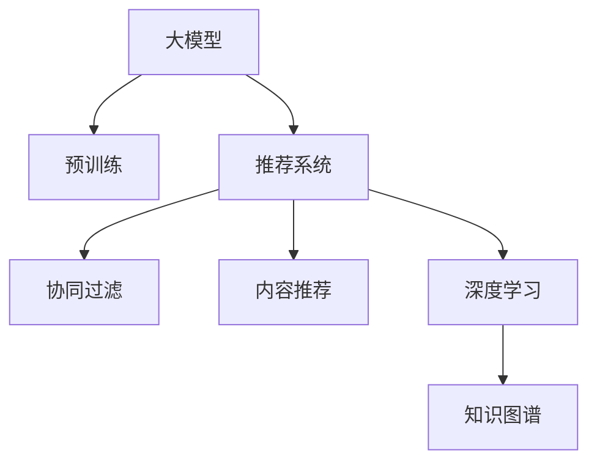

                 

# AI大模型视角下电商搜索推荐的技术人才培养体系

## 1. 背景介绍

随着人工智能技术的不断演进，特别是大模型（如BERT, GPT, Transformer等）在自然语言处理（NLP）领域的突破性应用，电商行业迎来了新的技术革新。以大模型为基础的搜索推荐系统，正在深刻改变用户的购物体验。从推荐商品、搜索结果排序，到个性化问答、用户画像构建，大模型的智能算法成为电商技术栈中的重要一环。然而，面对日益复杂和个性化的电商应用场景，技术人才培养体系面临严峻挑战。

### 1.1 问题由来

电商搜索推荐系统需要处理海量用户数据，并从中挖掘出用户兴趣，实现精准推荐。以往传统的推荐算法（如协同过滤、基于内容的推荐等）在处理大规模数据时，效率低下，且推荐效果有限。而大模型推荐系统的核心优势在于其强大的泛化能力和学习迁移能力，能够从文本语料中学习到丰富的用户行为模式和商品特征，实现高效、精准的推荐。

但大模型推荐系统也存在诸多挑战：
1. **模型训练与优化**：大模型参数量巨大，训练和优化成本高。
2. **数据需求量大**：电商数据质量参差不齐，数据收集和标注工作量大。
3. **模型部署与运行**：大模型推理耗时较长，且资源占用大。
4. **算法解释性差**：大模型往往被视作"黑盒"，难以解释其决策过程。

### 1.2 问题核心关键点

大模型推荐系统的人才培养，需解决以下几个关键问题：
- **知识体系**：构建覆盖大模型原理、推荐算法、模型优化、数据处理等知识点的完整知识体系。
- **技术栈**：掌握常用的深度学习框架（如TensorFlow、PyTorch等）和搜索推荐技术栈。
- **工程实践**：提升在大模型推荐系统中的工程实践能力，包括模型训练、部署、调优等。
- **项目管理**：具备项目管理能力，能够高效协同团队成员，完成复杂电商应用场景的推荐系统开发。

## 2. 核心概念与联系

### 2.1 核心概念概述

为更好地理解基于大模型电商搜索推荐系统的技术人才培养体系，本节将介绍几个核心概念：

- **大模型（Large Models）**：指采用深度学习模型，并使用大量无标签数据进行预训练的语言模型。如BERT、GPT等。
- **推荐系统（Recommendation System）**：通过分析用户行为数据，为用户推荐感兴趣的商品或内容。电商搜索推荐系统是其中重要的一类。
- **知识图谱（Knowledge Graph）**：由实体和关系构成的语义网络，可用于构建用户画像和商品描述。
- **协同过滤（Collaborative Filtering）**：基于用户历史行为数据，寻找相似用户，从而推荐相似商品。
- **内容推荐（Content-based Recommendation）**：根据商品属性、用户兴趣等特征进行推荐。
- **深度学习（Deep Learning）**：采用多层神经网络进行数据建模和处理。

### 2.2 核心概念原理和架构的 Mermaid 流程图



## 3. 核心算法原理 & 具体操作步骤

### 3.1 算法原理概述

基于大模型的电商搜索推荐系统，其核心算法原理包括以下几个方面：

- **用户行为建模**：通过用户浏览、点击、购买等行为，构建用户兴趣和行为模式。
- **商品特征提取**：对商品标题、描述、图片等进行语义分析，提取商品特征。
- **相似度计算**：利用相似性度量方法，计算用户与商品、商品与商品之间的相似度。
- **推荐算法设计**：选择合适的推荐算法，如协同过滤、深度学习等，优化模型性能。

### 3.2 算法步骤详解

基于大模型的电商搜索推荐系统，其微调步骤一般包括以下几个关键步骤：

**Step 1: 数据准备**

- **数据收集与清洗**：收集电商用户行为数据和商品信息数据，去除噪声和冗余数据。
- **数据标注**：对用户行为数据进行标注，如用户购买历史、浏览行为、评分等。
- **数据划分**：将数据划分为训练集、验证集和测试集。

**Step 2: 模型选择与预训练**

- **选择预训练模型**：选择适合电商场景的预训练模型，如BERT、GPT等。
- **模型微调**：在电商数据上进行微调，学习用户行为和商品特征。

**Step 3: 推荐算法实现**

- **特征提取**：设计特征提取器，从商品信息中提取有意义的特征。
- **相似度计算**：实现用户-商品相似度计算算法。
- **推荐算法**：实现深度学习推荐模型，如基于 Transformer 的推荐模型。

**Step 4: 模型优化与部署**

- **模型调优**：在验证集上进行调优，调整模型参数和超参数。
- **模型部署**：将训练好的模型部署到线上，实现实时推荐。
- **性能评估**：在测试集上评估模型性能，根据指标进行迭代优化。

### 3.3 算法优缺点

基于大模型的电商搜索推荐系统具有以下优点：
1. **精度高**：大模型能够学习到丰富的语义知识，推荐精度高。
2. **可扩展性强**：适用于大规模电商场景，能够处理海量用户数据。
3. **自动化程度高**：推荐过程高度自动化，减少人工干预。

同时，该方法也存在一定的局限性：
1. **数据依赖性强**：推荐效果受电商数据质量影响较大。
2. **模型复杂度高**：大模型参数量大，训练和推理复杂度高。
3. **解释性差**：模型内部机制复杂，难以解释推荐决策过程。

尽管存在这些局限性，但就目前而言，基于大模型的推荐方法仍是最主流范式。未来相关研究的重点在于如何进一步降低数据依赖，提高模型的解释性和可扩展性。

### 3.4 算法应用领域

基于大模型的电商搜索推荐系统，在多个电商场景中得到广泛应用，例如：

- **个性化推荐**：根据用户行为数据，实现个性化商品推荐。
- **搜索结果排序**：对搜索结果进行排序，提升用户体验。
- **用户画像构建**：通过用户行为数据，构建用户兴趣和行为模型。
- **内容推荐**：推荐相关内容，如商品、文章、视频等。

## 4. 数学模型和公式 & 详细讲解 & 举例说明

### 4.1 数学模型构建

本节将使用数学语言对基于大模型的电商推荐系统进行更加严格的刻画。

记电商数据为 $D=\{(x_i,y_i)\}_{i=1}^N$，其中 $x_i$ 为用户行为数据，$y_i$ 为用户是否购买商品。定义模型 $M_{\theta}$ 为推荐模型的参数化函数，其中 $\theta$ 为模型参数。

### 4.2 公式推导过程

假设电商数据已经标准化，模型 $M_{\theta}$ 的预测输出为 $y'$。根据损失函数 $\ell(y',y)$，推荐系统模型的训练目标为：

$$
\min_{\theta} \frac{1}{N}\sum_{i=1}^N \ell(y',y)
$$

在实际应用中，通常使用交叉熵损失函数：

$$
\ell(y',y) = -y \log y' + (1-y) \log (1-y')
$$

模型 $M_{\theta}$ 的输出为：

$$
y' = \sigma(\theta^T \phi(x))
$$

其中 $\phi(x)$ 为特征提取函数，$\sigma$ 为激活函数。

### 4.3 案例分析与讲解

考虑一个基于用户行为数据的推荐模型，输入为用户的浏览、购买历史数据，输出为用户可能感兴趣的商品列表。假设模型参数 $\theta$ 包含用户行为模式、商品特征等信息，则模型训练过程可以表示为：

1. **数据准备**：收集用户行为数据和商品信息数据，去除噪声和冗余数据。
2. **模型选择与预训练**：选择适合电商场景的预训练模型，如BERT，在电商数据上进行微调。
3. **特征提取**：设计特征提取器，从商品信息中提取有意义的特征。
4. **相似度计算**：实现用户-商品相似度计算算法。
5. **推荐算法**：实现深度学习推荐模型，如基于 Transformer 的推荐模型。
6. **模型调优**：在验证集上进行调优，调整模型参数和超参数。
7. **模型部署**：将训练好的模型部署到线上，实现实时推荐。
8. **性能评估**：在测试集上评估模型性能，根据指标进行迭代优化。

## 5. 项目实践：代码实例和详细解释说明

### 5.1 开发环境搭建

在进行电商搜索推荐系统开发前，我们需要准备好开发环境。以下是使用Python进行PyTorch开发的环境配置流程：

1. 安装Anaconda：从官网下载并安装Anaconda，用于创建独立的Python环境。

2. 创建并激活虚拟环境：
```bash
conda create -n pytorch-env python=3.8 
conda activate pytorch-env
```

3. 安装PyTorch：根据CUDA版本，从官网获取对应的安装命令。例如：
```bash
conda install pytorch torchvision torchaudio cudatoolkit=11.1 -c pytorch -c conda-forge
```

4. 安装Transformer库：
```bash
pip install transformers
```

5. 安装各类工具包：
```bash
pip install numpy pandas scikit-learn matplotlib tqdm jupyter notebook ipython
```

完成上述步骤后，即可在`pytorch-env`环境中开始电商推荐系统的开发。

### 5.2 源代码详细实现

下面以基于大模型的电商推荐系统为例，给出使用Transformers库进行模型开发的PyTorch代码实现。

首先，定义电商推荐系统的数据处理函数：

```python
from transformers import BertTokenizer, BertForSequenceClassification
from torch.utils.data import Dataset, DataLoader
import torch

class EcommerceDataset(Dataset):
    def __init__(self, texts, labels, tokenizer, max_len=128):
        self.texts = texts
        self.labels = labels
        self.tokenizer = tokenizer
        self.max_len = max_len
        
    def __len__(self):
        return len(self.texts)
    
    def __getitem__(self, item):
        text = self.texts[item]
        label = self.labels[item]
        
        encoding = self.tokenizer(text, return_tensors='pt', max_length=self.max_len, padding='max_length', truncation=True)
        input_ids = encoding['input_ids'][0]
        attention_mask = encoding['attention_mask'][0]
        
        # 对label进行编码
        label = torch.tensor(label, dtype=torch.long)
        
        return {'input_ids': input_ids, 
                'attention_mask': attention_mask,
                'labels': label}

# 加载数据集
tokenizer = BertTokenizer.from_pretrained('bert-base-cased')
train_dataset = EcommerceDataset(train_texts, train_labels, tokenizer)
val_dataset = EcommerceDataset(val_texts, val_labels, tokenizer)
test_dataset = EcommerceDataset(test_texts, test_labels, tokenizer)

# 设置模型和优化器
model = BertForSequenceClassification.from_pretrained('bert-base-cased', num_labels=2)
optimizer = torch.optim.Adam(model.parameters(), lr=2e-5)

# 定义损失函数
criterion = torch.nn.CrossEntropyLoss()

# 训练过程
device = torch.device('cuda') if torch.cuda.is_available() else torch.device('cpu')
model.to(device)

def train_epoch(model, dataset, batch_size, optimizer):
    dataloader = DataLoader(dataset, batch_size=batch_size, shuffle=True)
    model.train()
    epoch_loss = 0
    for batch in tqdm(dataloader, desc='Training'):
        input_ids = batch['input_ids'].to(device)
        attention_mask = batch['attention_mask'].to(device)
        labels = batch['labels'].to(device)
        model.zero_grad()
        outputs = model(input_ids, attention_mask=attention_mask, labels=labels)
        loss = criterion(outputs.logits, labels)
        epoch_loss += loss.item()
        loss.backward()
        optimizer.step()
    return epoch_loss / len(dataloader)

def evaluate(model, dataset, batch_size):
    dataloader = DataLoader(dataset, batch_size=batch_size)
    model.eval()
    preds, labels = [], []
    with torch.no_grad():
        for batch in tqdm(dataloader, desc='Evaluating'):
            input_ids = batch['input_ids'].to(device)
            attention_mask = batch['attention_mask'].to(device)
            labels = batch['labels'].to(device)
            outputs = model(input_ids, attention_mask=attention_mask)
            preds.append(outputs.logits.argmax(dim=1).cpu().tolist())
            labels.append(labels.cpu().tolist())
        
    print(classification_report(labels, preds))
```

然后，定义模型训练与评估函数：

```python
epochs = 5
batch_size = 16

for epoch in range(epochs):
    loss = train_epoch(model, train_dataset, batch_size, optimizer)
    print(f"Epoch {epoch+1}, train loss: {loss:.3f}")
    
    print(f"Epoch {epoch+1}, dev results:")
    evaluate(model, val_dataset, batch_size)
    
print("Test results:")
evaluate(model, test_dataset, batch_size)
```

以上就是使用PyTorch对BERT进行电商推荐系统微调的完整代码实现。可以看到，得益于Transformers库的强大封装，我们可以用相对简洁的代码完成BERT模型的加载和微调。

### 5.3 代码解读与分析

让我们再详细解读一下关键代码的实现细节：

**EcommerceDataset类**：
- `__init__`方法：初始化文本、标签、分词器等关键组件。
- `__len__`方法：返回数据集的样本数量。
- `__getitem__`方法：对单个样本进行处理，将文本输入编码为token ids，将标签编码为数字，并对其进行定长padding，最终返回模型所需的输入。

**特征提取**：
- `model.zero_grad()`：重置模型的梯度。
- `outputs = model(input_ids, attention_mask=attention_mask, labels=labels)`：前向传播计算损失函数。
- `loss = criterion(outputs.logits, labels)`：计算损失函数。
- `loss.backward()`：反向传播计算参数梯度。
- `optimizer.step()`：更新模型参数。

**训练流程**：
- `dataloader = DataLoader(dataset, batch_size=batch_size, shuffle=True)`：对数据集进行批次化加载，供模型训练和推理使用。
- `model.train()`：模型训练模式。
- `model.eval()`：模型评估模式。
- `epoch_loss`：每个epoch的总损失。
- `model.zero_grad()`：重置模型的梯度。
- `outputs = model(input_ids, attention_mask=attention_mask, labels=labels)`：前向传播计算损失函数。
- `loss = criterion(outputs.logits, labels)`：计算损失函数。
- `loss.backward()`：反向传播计算参数梯度。
- `optimizer.step()`：更新模型参数。
- `epoch_loss /= len(dataloader)`：每个epoch的平均损失。

完成上述步骤后，即可在`pytorch-env`环境中开始电商推荐系统的开发。

## 6. 实际应用场景

### 6.1 智能客服

基于大模型的电商推荐系统可以应用于智能客服的构建。传统客服往往需要配备大量人力，高峰期响应缓慢，且一致性和专业性难以保证。而使用微调后的推荐系统，可以7x24小时不间断服务，快速响应客户咨询，用自然流畅的语言解答各类常见问题。

在技术实现上，可以收集企业内部的历史客服对话记录，将问题和最佳答复构建成监督数据，在此基础上对预训练推荐模型进行微调。微调后的推荐模型能够自动理解用户意图，匹配最合适的答复。对于客户提出的新问题，还可以接入检索系统实时搜索相关内容，动态组织生成回答。如此构建的智能客服系统，能大幅提升客户咨询体验和问题解决效率。

### 6.2 个性化推荐

基于大模型的电商推荐系统可以广泛应用于个性化推荐。传统的推荐算法往往只能根据用户历史行为进行推荐，难以把握用户的深度兴趣。而大模型推荐系统可以学习到用户更丰富的行为模式，实现精准推荐。

在具体实现中，可以收集用户浏览、点击、购买等行为数据，提取和商品交互的物品标题、描述、标签等文本内容。将文本内容作为模型输入，用户的后续行为（如是否点击、购买等）作为监督信号，在此基础上微调预训练语言模型。微调后的模型能够从文本内容中准确把握用户的兴趣点。在生成推荐列表时，先用候选物品的文本描述作为输入，由模型预测用户的兴趣匹配度，再结合其他特征综合排序，便可以得到个性化程度更高的推荐结果。

### 6.3 未来应用展望

随着大模型推荐系统的发展，未来的应用前景将更加广阔。在大模型的助力下，推荐系统将能够更好地理解用户需求，提升推荐效果。同时，推荐系统还将融合更多领域知识，如知识图谱、逻辑规则等，实现更全面、精准的推荐。未来，推荐系统有望成为电商应用的核心竞争力，为用户带来更优质、更个性化的购物体验。

## 7. 工具和资源推荐

### 7.1 学习资源推荐

为帮助开发者系统掌握大模型推荐系统的技术，这里推荐一些优质的学习资源：

1. **《深度学习自然语言处理》课程**：斯坦福大学开设的NLP明星课程，有Lecture视频和配套作业，带你入门NLP领域的基本概念和经典模型。
2. **Transformers官方文档**：Transformer库的官方文档，提供了海量预训练模型和完整的推荐系统开发样例代码，是上手实践的必备资料。
3. **Recommender Systems 2021**：顶级学术会议，汇集了推荐系统领域的最新研究成果，可快速了解前沿进展。

### 7.2 开发工具推荐

高效的开发离不开优秀的工具支持。以下是几款用于大模型推荐系统开发的常用工具：

1. **PyTorch**：基于Python的开源深度学习框架，灵活动态的计算图，适合快速迭代研究。大部分预训练语言模型都有PyTorch版本的实现。
2. **TensorFlow**：由Google主导开发的开源深度学习框架，生产部署方便，适合大规模工程应用。同样有丰富的预训练语言模型资源。
3. **Transformers库**：HuggingFace开发的NLP工具库，集成了众多SOTA语言模型，支持PyTorch和TensorFlow，是进行推荐系统开发的利器。
4. **Weights & Biases**：模型训练的实验跟踪工具，可以记录和可视化模型训练过程中的各项指标，方便对比和调优。与主流深度学习框架无缝集成。
5. **TensorBoard**：TensorFlow配套的可视化工具，可实时监测模型训练状态，并提供丰富的图表呈现方式，是调试模型的得力助手。

### 7.3 相关论文推荐

大模型推荐系统的发展源于学界的持续研究。以下是几篇奠基性的相关论文，推荐阅读：

1. **Attention is All You Need**：提出了Transformer结构，开启了NLP领域的预训练大模型时代。
2. **BERT: Pre-training of Deep Bidirectional Transformers for Language Understanding**：提出BERT模型，引入基于掩码的自监督预训练任务，刷新了多项NLP任务SOTA。
3. **Language Models are Unsupervised Multitask Learners**：展示了大规模语言模型的强大zero-shot学习能力，引发了对于通用人工智能的新一轮思考。
4. **Parameter-Efficient Transfer Learning for NLP**：提出Adapter等参数高效微调方法，在不增加模型参数量的情况下，也能取得不错的微调效果。
5. **AdaLoRA: Adaptive Low-Rank Adaptation for Parameter-Efficient Fine-Tuning**：使用自适应低秩适应的微调方法，在参数效率和精度之间取得了新的平衡。

## 8. 总结：未来发展趋势与挑战

### 8.1 总结

本文对基于大模型的电商搜索推荐系统的技术人才培养体系进行了全面系统的介绍。首先阐述了大模型推荐系统的研究背景和意义，明确了推荐系统在电商场景中的应用价值。其次，从原理到实践，详细讲解了大模型推荐系统的数学模型、算法步骤和实际应用。最后，系统梳理了电商推荐系统的人才培养体系，帮助开发者构建完整的知识体系和技术栈。

通过本文的系统梳理，可以看到，大模型推荐系统正在成为电商技术栈中的重要一环，为电商应用带来了新的突破。未来，随着技术的不断演进，推荐系统将在更广泛的电商场景中发挥重要作用，带来更多的商业价值。

### 8.2 未来发展趋势

展望未来，大模型推荐系统的发展趋势如下：

1. **模型规模持续增大**：随着算力成本的下降和数据规模的扩张，预训练语言模型的参数量还将持续增长。超大模型蕴含的丰富语言知识，将进一步提升推荐系统的精度和效果。
2. **算法复杂度降低**：推荐系统算法将逐步从复杂的深度学习模型向轻量级模型发展，提升推荐速度和资源利用效率。
3. **数据需求降低**：推荐系统将逐步从依赖大量标注数据向少样本、无监督学习方向发展，提升数据获取的便利性和推荐系统的泛化能力。
4. **解释性增强**：推荐系统将逐步引入更多可解释性算法，提升推荐过程的透明性和可信度。
5. **融合多领域知识**：推荐系统将逐步融合更多领域知识，如知识图谱、逻辑规则等，实现更全面、精准的推荐。
6. **协同增强推荐**：推荐系统将逐步引入协同增强推荐算法，提升推荐系统的鲁棒性和个性化推荐效果。

### 8.3 面临的挑战

尽管大模型推荐系统取得了显著成果，但在推广应用过程中仍面临诸多挑战：

1. **数据依赖性强**：推荐系统仍需依赖大量的标注数据，数据获取成本高，数据质量参差不齐。
2. **模型复杂度高**：大模型参数量大，训练和推理复杂度高，资源消耗大。
3. **推荐结果一致性差**：推荐系统对输入的扰动敏感，难以保证推荐结果的一致性和稳定性。
4. **算法黑盒性**：推荐系统内部机制复杂，难以解释其推荐过程，缺乏透明度和可信度。
5. **数据隐私保护**：推荐系统涉及用户行为数据的收集和处理，存在隐私泄露和数据滥用的风险。

### 8.4 研究展望

面对大模型推荐系统面临的挑战，未来的研究需要在以下几个方面寻求新的突破：

1. **降低数据依赖**：开发无监督、半监督推荐算法，提升推荐系统的泛化能力和数据获取的便利性。
2. **提升模型效率**：开发轻量级推荐模型和高效的推荐算法，降低推荐系统的资源消耗和延迟。
3. **增强推荐结果一致性**：引入协同增强推荐算法和稳定性优化方法，提升推荐结果的一致性和稳定性。
4. **提升推荐系统透明度**：引入可解释性算法和知识图谱，提升推荐系统的透明度和可信度。
5. **保护用户隐私**：开发隐私保护算法和用户隐私保护机制，确保用户数据的安全和隐私。

## 9. 附录：常见问题与解答

**Q1：电商推荐系统如何选择合适的预训练模型？**

A: 电商推荐系统应选择适合电商场景的预训练模型。如BERT、GPT等通用预训练模型，以及专门用于电商场景的预训练模型，如CLUE开源项目中的电商推荐模型。

**Q2：电商推荐系统的训练数据如何获取？**

A: 电商推荐系统的训练数据可以从电商平台的用户行为数据中获取，包括用户的浏览记录、购买记录、评分记录等。可以通过数据爬虫或API获取，注意去除噪声和冗余数据。

**Q3：电商推荐系统的推荐结果如何优化？**

A: 电商推荐系统的推荐结果优化主要通过调整模型参数和超参数，使用正则化技术，引入对抗训练等方法。同时，还需要进行特征工程，提取和优化商品特征。

**Q4：电商推荐系统的部署如何优化？**

A: 电商推荐系统的部署优化主要通过模型裁剪、量化加速、服务化封装等手段，提升推荐系统的推理速度和资源利用效率。同时，还需要引入负载均衡和缓存机制，提升推荐系统的并发处理能力。

**Q5：电商推荐系统的效果如何评估？**

A: 电商推荐系统的效果评估主要通过准确率、召回率、点击率等指标进行评估。同时，还需要进行A/B测试，评估不同推荐策略的效果。

---

作者：禅与计算机程序设计艺术 / Zen and the Art of Computer Programming

