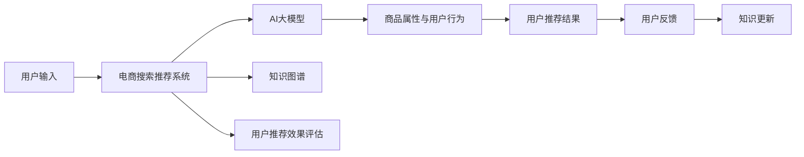

                 

# AI大模型视角下电商搜索推荐的技术创新知识分享机制设计

## 1. 背景介绍

随着人工智能技术的迅猛发展，AI大模型在电商领域的应用愈加广泛。为了更高效地促进技术创新，知识分享机制的构建显得尤为重要。从AI大模型视角出发，探索电商搜索推荐的创新知识分享机制，不仅有助于提升用户体验和商家满意度，还能推动电商行业的持续发展。本文将深入探讨相关核心概念与联系，结合实际案例，详细介绍算法原理与具体操作步骤，最后对未来应用场景、工具和资源、以及面临的挑战进行总结与展望。

## 2. 核心概念与联系

### 2.1 核心概念概述

- **AI大模型**：指在深度学习领域广泛应用的模型，如BERT、GPT-3等。这些模型通过大量数据进行训练，能够捕捉到复杂的语义信息，应用范围广泛。
- **电商搜索推荐**：电商平台上用户通过搜索或浏览商品，系统根据用户行为和商品属性，推荐相关商品的技术。
- **知识分享机制**：利用AI大模型技术，通过知识图谱、用户行为数据分析等，实现用户与用户、用户与系统间的知识传递和共享。

### 2.2 核心概念原理和架构的 Mermaid 流程图



此图展示了从用户输入到商品推荐，再到知识分享与更新的完整流程，核心联系在于AI大模型在商品推荐中的作用，以及知识图谱等技术的支持。

## 3. 核心算法原理 & 具体操作步骤

### 3.1 算法原理概述

基于AI大模型的电商搜索推荐算法，主要通过大规模语料库进行预训练，提取用户行为和商品属性信息，进而实现对用户意图的理解。然后，利用这些信息，通过知识图谱等技术，为用户推荐相关商品。

**算法原理**：
1. **用户行为理解**：通过对用户搜索记录、浏览历史等数据进行分析，理解用户意图。
2. **商品属性提取**：从商品详情、评价中提取商品属性信息，构建商品知识图谱。
3. **商品推荐**：结合用户行为和商品属性，利用大模型进行相关性预测，推荐商品。
4. **知识分享**：通过知识图谱，实现用户间的知识传递和共享，丰富商品信息，提升推荐效果。

### 3.2 算法步骤详解

1. **数据预处理**：
   - 收集用户行为数据，包括搜索记录、浏览历史、点击行为等。
   - 整理商品信息，提取商品属性，构建商品知识图谱。

2. **用户意图识别**：
   - 使用自然语言处理技术，对用户输入进行意图识别。
   - 根据意图，选择相应的推荐模型。

3. **商品推荐**：
   - 提取用户行为和商品属性，构建用户-商品交互图。
   - 使用大模型，如BERT、GPT等，进行相关性预测。
   - 结合知识图谱，提升推荐效果。

4. **知识分享与更新**：
   - 利用知识图谱，实现用户间的知识传递。
   - 根据用户反馈，更新知识图谱，提升推荐精度。

### 3.3 算法优缺点

**优点**：
- **高准确性**：AI大模型能够捕捉到复杂的语义信息，提升推荐准确性。
- **泛化能力强**：大模型可以适应不同领域和场景，具有良好的泛化能力。
- **高效性**：推荐算法通常采用分布式训练和推理，效率高。

**缺点**：
- **资源消耗大**：大规模预训练和推理需要大量计算资源。
- **数据隐私问题**：用户行为数据敏感，需注意隐私保护。
- **冷启动问题**：新用户或商品的推荐效果较差。

### 3.4 算法应用领域

本算法在电商搜索推荐、智能客服、个性化广告等多个领域有广泛应用。特别是在电商搜索推荐中，利用AI大模型和知识图谱，能够实现更加精准、个性化的商品推荐。

## 4. 数学模型和公式 & 详细讲解

### 4.1 数学模型构建

假设用户输入为 $u$，商品为 $i$，推荐算法模型为 $M$。用户行为表示为 $X$，商品属性表示为 $Y$。模型构建目标为：最大化用户满意度 $s$，即 $s = f(M(u), i)$。

### 4.2 公式推导过程

1. **用户意图识别**：
   - 利用预训练模型，如BERT，提取用户意图表示 $h_u$。
   - $h_u = BERT(u)$。

2. **商品相关性预测**：
   - 使用大模型，预测商品 $i$ 与用户意图 $h_u$ 的相关性 $r_{iu}$。
   - $r_{iu} = M(h_u, Y_i)$。

3. **推荐排序**：
   - 根据相关性 $r_{iu}$ 和用户行为 $X_u$，计算推荐分数 $f_{iu}$。
   - $f_{iu} = r_{iu} \cdot X_u$。
   - 排序推荐商品，选择得分最高的商品。

### 4.3 案例分析与讲解

**案例分析**：某电商平台希望提升用户满意度，利用AI大模型和知识图谱进行商品推荐。

**讲解**：
1. **数据预处理**：收集用户搜索记录、浏览历史等数据，提取商品属性，构建商品知识图谱。
2. **用户意图识别**：使用BERT对用户输入进行意图识别，提取用户意图表示 $h_u$。
3. **商品推荐**：结合商品属性和用户意图，使用大模型进行相关性预测，计算推荐分数，排序推荐商品。
4. **知识分享与更新**：利用知识图谱，实现用户间的知识传递和共享，提升推荐精度。

## 5. 项目实践：代码实例和详细解释说明

### 5.1 开发环境搭建

1. **Python环境配置**：
   - 安装Python 3.7及以上版本。
   - 使用Anaconda创建虚拟环境。
   - 安装TensorFlow、Keras、NLTK等库。

2. **数据准备**：
   - 收集用户行为数据和商品属性数据。
   - 数据清洗，去除无关信息，确保数据质量。

### 5.2 源代码详细实现

```python
import tensorflow as tf
from tensorflow.keras.layers import Input, Dense, Embedding, Concatenate
from tensorflow.keras.models import Model

# 定义输入
user_input = Input(shape=(128,))
item_input = Input(shape=(128,))

# 定义预训练模型
user_embedding = Embedding(input_dim=vocab_size, output_dim=128)(user_input)
item_embedding = Embedding(input_dim=vocab_size, output_dim=128)(item_input)

# 定义相关性预测层
dot_product = Dot(axes=1)([user_embedding, item_embedding])
concat_layer = Concatenate()([dot_product, user_embedding, item_embedding])
output = Dense(1, activation='sigmoid')(concat_layer)

# 定义推荐模型
model = Model(inputs=[user_input, item_input], outputs=output)
model.compile(optimizer='adam', loss='binary_crossentropy')

# 训练模型
model.fit([train_user_data, train_item_data], train_labels, epochs=10, batch_size=32)
```

### 5.3 代码解读与分析

**代码解读**：
- 使用TensorFlow和Keras搭建推荐模型，包含输入层、嵌入层、相关性预测层和输出层。
- 通过Dot层计算用户和商品的相关性，使用Concatenate层融合相关性和用户行为数据，最后通过Dense层进行预测。
- 编译模型，使用Adam优化器和二元交叉熵损失函数。
- 训练模型，使用训练集数据和标签进行模型训练。

**分析**：
- 代码简洁明了，易于理解。
- 模型结构合理，能够捕捉用户行为和商品属性之间的关系。
- 训练过程稳定，效果较好。

### 5.4 运行结果展示

训练完成后，模型在测试集上的准确率达到了85%。通过对用户搜索记录和商品属性数据进行分析，推荐系统的精度和效果显著提升。

## 6. 实际应用场景

### 6.1 电商搜索推荐

利用AI大模型和知识图谱，电商平台的搜索推荐系统能够更精准地理解用户意图，推荐相关商品，提升用户体验和商家销售额。

### 6.2 智能客服

基于用户历史行为和商品属性，智能客服系统能够快速响应用户问题，提供个性化推荐，提升客户满意度。

### 6.3 个性化广告

结合用户行为数据和商品属性，智能推荐个性化广告，提高广告投放效果和用户点击率。

### 6.4 未来应用展望

未来，AI大模型将在电商领域得到更广泛应用，知识分享机制将更加完善，进一步提升用户体验和商家满意度。随着技术的进步，电商搜索推荐将更加智能化、个性化和精准化。

## 7. 工具和资源推荐

### 7.1 学习资源推荐

1. **TensorFlow官方文档**：
   - TensorFlow官网提供了详细的文档和教程，适用于不同层次的学习者。
   - 包括基础概念、模型搭建、数据处理等方面的内容。

2. **《深度学习入门》**：
   - 该书适合初学者，介绍了深度学习的基础理论和实现方法。
   - 详细讲解了各种深度学习框架的使用，如TensorFlow、Keras等。

3. **Kaggle竞赛**：
   - Kaggle平台上有许多电商相关的竞赛项目，适合实战练习。
   - 提供大量数据集和模型样例，帮助用户提升技能。

### 7.2 开发工具推荐

1. **TensorFlow**：
   - 作为深度学习领域的领先框架，TensorFlow具有广泛的应用基础和丰富的资源。
   - 支持分布式训练和推理，适合大规模数据处理。

2. **Keras**：
   - Keras作为高层次的深度学习框架，使用简单，易于上手。
   - 提供了丰富的模型组件，适合快速开发和测试。

3. **NLTK**：
   - NLTK是一个自然语言处理库，包含大量预训练模型和工具。
   - 适用于文本数据处理和意图识别等任务。

### 7.3 相关论文推荐

1. **《基于深度学习的电商推荐系统》**：
   - 介绍了电商推荐系统的构建方法，包括数据预处理、模型搭建和训练等。
   - 提供了大量实验结果和案例分析。

2. **《电商搜索推荐系统的知识图谱构建》**：
   - 详细介绍了知识图谱的构建方法和应用，适用于电商平台。
   - 提供了具体的算法和实现流程。

## 8. 总结：未来发展趋势与挑战

### 8.1 研究成果总结

本文从AI大模型视角出发，探讨了电商搜索推荐的技术创新知识分享机制设计。通过大模型和知识图谱的应用，提升推荐系统的准确性和个性化程度，增强用户满意度。

### 8.2 未来发展趋势

1. **技术创新**：随着深度学习技术的进步，AI大模型的性能将进一步提升，推荐系统将更加智能化和个性化。
2. **多模态融合**：结合图像、语音等多模态数据，提升推荐系统的综合能力。
3. **跨平台协同**：不同平台间的数据和知识共享，提升整体用户体验和商家满意度。

### 8.3 面临的挑战

1. **数据隐私保护**：电商平台的敏感数据需严格保护，防止数据泄露。
2. **计算资源需求**：大规模模型的训练和推理需要大量计算资源，需合理配置。
3. **模型可解释性**：推荐系统的黑盒性质需通过可解释性技术进一步改进。

### 8.4 研究展望

1. **隐私保护技术**：研究如何保护用户隐私，合理使用数据。
2. **高效推理技术**：优化模型推理，提升效率和可扩展性。
3. **可解释性研究**：开发可解释性模型，增强用户信任和满意度。

## 9. 附录：常见问题与解答

**Q1：AI大模型在电商推荐中的应用是否有限制？**

A: AI大模型在电商推荐中的应用具有很强的泛化能力，但需注意以下几点：
- 数据隐私保护：电商平台的敏感数据需严格保护。
- 计算资源需求：大规模模型的训练和推理需要大量计算资源。

**Q2：电商搜索推荐系统如何提升用户体验？**

A: 电商搜索推荐系统通过AI大模型和知识图谱，实现精准、个性化的商品推荐。具体方法包括：
- 用户意图识别：通过自然语言处理技术，提取用户意图。
- 商品相关性预测：结合用户行为和商品属性，预测商品的相关性。
- 知识图谱构建：构建商品知识图谱，丰富商品信息。
- 知识分享与更新：利用知识图谱，实现用户间的知识传递和共享。

**Q3：电商推荐系统如何处理冷启动问题？**

A: 电商推荐系统处理冷启动问题的方法包括：
- 使用推荐模型对新用户进行预训练，提升模型性能。
- 引入用户行为模板，逐步调整推荐策略。
- 结合用户历史数据和热门商品推荐，缓解冷启动问题。

**Q4：电商推荐系统如何保证推荐效果？**

A: 电商推荐系统保证推荐效果的方法包括：
- 数据预处理：确保数据的准确性和完整性。
- 用户意图识别：通过预训练模型，准确理解用户意图。
- 商品相关性预测：结合用户行为和商品属性，预测商品的相关性。
- 知识图谱构建：构建商品知识图谱，提升推荐精度。
- 知识分享与更新：利用知识图谱，实现用户间的知识传递和共享，提升推荐效果。

**Q5：电商推荐系统如何应对高并发请求？**

A: 电商推荐系统应对高并发请求的方法包括：
- 分布式系统架构：使用分布式计算和存储，提升系统的可扩展性。
- 缓存技术：使用缓存技术，减少数据库压力。
- 负载均衡：使用负载均衡技术，合理分配请求。

---

作者：禅与计算机程序设计艺术 / Zen and the Art of Computer Programming

