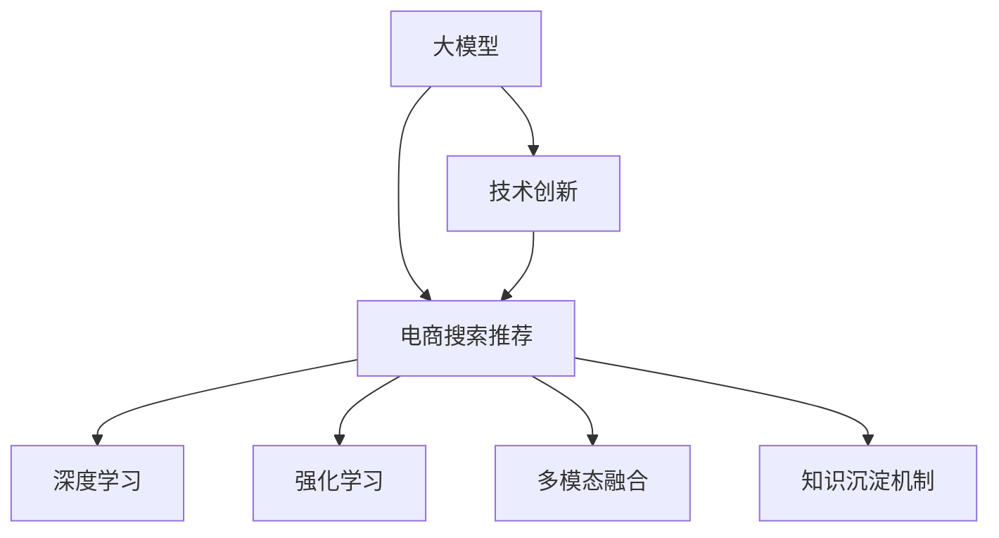

                 

# AI大模型视角下电商搜索推荐的技术创新知识沉淀机制优化

> 关键词：AI大模型, 电商搜索推荐, 技术创新, 知识沉淀机制, 推荐系统, 强化学习, 深度学习

## 1. 背景介绍

### 1.1 问题由来
在电商领域，搜索和推荐系统是用户体验的重要组成部分，直接影响了用户的购物决策和留存率。随着消费者需求的不断变化和产品种类的日益丰富，传统的基于规则和特征工程的搜索推荐算法已经难以满足实际需求，需要引入新的技术手段来提升系统性能和智能化水平。

近年来，深度学习技术和大模型在电商搜索推荐领域取得了显著进展。特别是基于大模型的推荐系统，通过在大规模无标签文本数据上预训练语言模型，再通过微调（Fine-Tuning）来适配电商场景，能够有效提升推荐效果。但是，如何在大模型推荐系统中实现高效、精准的知识沉淀机制，优化用户行为理解和个性化推荐，仍然是一个挑战。

### 1.2 问题核心关键点
大模型在电商搜索推荐系统中的知识沉淀机制，涉及以下核心关键点：

- 用户行为理解：如何通过大模型深入理解用户的购买历史、浏览行为、搜索意图等，形成更加精准的用户画像。
- 个性化推荐：如何在大模型基础上，高效生成个性化推荐结果，同时兼顾用户的多样性和满意度。
- 多模态数据融合：如何将文本、图像、音频等多模态数据融合，构建更加全面的用户画像和商品表示。
- 持续学习：如何在不断变化的数据分布下，保持推荐系统的持续学习和优化。

### 1.3 问题研究意义
大模型在电商搜索推荐系统中的应用，对于提升用户体验、提高销售额、优化供应链等方面具有重要意义：

1. 提升用户体验：通过深度学习和多模态融合技术，推荐系统能够提供更加个性化、精准的推荐结果，提升用户满意度。
2. 提高销售额：个性化的推荐能够增加用户的点击率和购买转化率，从而提高销售额。
3. 优化供应链：通过用户行为分析，推荐系统能够帮助商家更好地预测市场需求，优化库存管理，提升供应链效率。

总之，大模型推荐系统为电商搜索推荐提供了新的技术手段，有助于电商平台实现更高效、智能化的服务。

## 2. 核心概念与联系

### 2.1 核心概念概述

为了更好地理解大模型在电商搜索推荐系统中的应用，本节将介绍几个关键概念及其联系：

- 大模型：以Transformer为代表的大规模预训练语言模型，通过在大规模无标签文本数据上预训练，学习到丰富的语言知识和语义理解能力。
- 电商搜索推荐：通过搜索和推荐技术，帮助用户找到其感兴趣的商品，提升购物体验和购买决策效率。
- 技术创新：通过引入新的技术手段，如深度学习、强化学习、多模态融合等，提升推荐系统的性能和智能化水平。
- 知识沉淀机制：在大模型推荐系统中，通过合理的算法和机制，沉淀用户行为、商品信息、历史数据等知识，优化推荐效果。

这些概念之间的联系可以通过以下Mermaid流程图来展示：



这个流程图展示了各个概念之间的逻辑关系：

1. 大模型通过深度学习等技术手段，获得丰富的语言知识和语义理解能力。
2. 电商搜索推荐系统利用大模型生成推荐结果，提升用户体验和销售效果。
3. 技术创新引入新的算法和模型，进一步优化推荐系统性能。
4. 知识沉淀机制在大模型推荐系统中沉淀用户行为和商品信息，实现个性化推荐。

这些概念共同构成了大模型在电商搜索推荐系统中的应用框架，使得推荐系统能够高效、智能地为用户提供精准的推荐服务。

## 3. 核心算法原理 & 具体操作步骤
### 3.1 算法原理概述

基于大模型的电商搜索推荐系统，核心算法原理可以归纳为以下几点：

1. **预训练与微调**：在大规模无标签文本数据上预训练大模型，获取通用的语言知识和语义理解能力。然后在电商场景中，通过微调适配用户行为和商品信息，生成个性化推荐结果。
2. **多模态融合**：将文本、图像、音频等多模态数据融合，构建更加全面的用户画像和商品表示，提升推荐效果。
3. **知识沉淀机制**：通过合理的算法和机制，沉淀用户行为、商品信息等知识，优化推荐系统性能。
4. **强化学习**：通过在线学习机制，不断优化推荐策略，提高推荐效果和系统鲁棒性。

### 3.2 算法步骤详解

基于大模型的电商搜索推荐系统的算法步骤包括以下几个关键环节：

**Step 1: 数据预处理**

- 收集电商用户的浏览、购买、搜索等行为数据，预处理为模型输入格式。
- 对商品信息进行标注和处理，构建商品向量表示。

**Step 2: 模型预训练**

- 使用大规模无标签文本数据对大模型进行预训练，学习通用的语言知识和语义理解能力。
- 根据电商场景，设计预训练任务，如掩码语言模型、文本分类等。

**Step 3: 模型微调**

- 在电商场景中，通过微调适配用户行为和商品信息，生成个性化推荐结果。
- 选择合适的损失函数和优化器，如交叉熵损失、AdamW等，设置合适的学习率。
- 设计合适的任务适配层，如线性分类器、解码器等。

**Step 4: 多模态融合**

- 收集电商商品的多模态数据，如图片、标签、用户评分等。
- 使用预训练的视觉、文本等模型，提取商品的多模态特征。
- 将多模态特征融合，构建更加全面的商品表示。

**Step 5: 知识沉淀机制**

- 沉淀用户行为、商品信息等知识，构建用户画像和商品图谱。
- 设计合理的算法和机制，如知识图谱嵌入、联合训练等，优化推荐效果。

**Step 6: 强化学习**

- 在线学习推荐策略，不断优化推荐效果。
- 设计奖励函数，如点击率、转化率、停留时间等，优化推荐策略。

**Step 7: 评估与迭代**

- 在验证集和测试集上评估推荐效果，如平均点击率、平均转化率等。
- 根据评估结果，不断迭代优化推荐系统。

### 3.3 算法优缺点

基于大模型的电商搜索推荐系统，具有以下优点：

1. **通用性**：大模型能够学习通用的语言知识和语义理解能力，适应多种电商场景和用户行为。
2. **高效性**：通过预训练和微调机制，大模型能够在短时间内生成精准的推荐结果。
3. **个性化**：通过知识沉淀机制和多模态融合，能够实现更加个性化、精准的推荐。
4. **可解释性**：大模型的预训练和微调过程具有较高的可解释性，能够提供推荐理由和解释。

同时，该算法也存在以下缺点：

1. **数据依赖**：大模型和微调效果高度依赖于标注数据和电商场景，获取高质量数据成本较高。
2. **计算资源要求高**：大模型和微调需要大量的计算资源，难以在低配设备上运行。
3. **泛化能力不足**：在域外数据上，大模型的泛化能力可能不足，导致推荐效果下降。
4. **过拟合风险**：大模型和微调容易过拟合电商场景，对于新用户的推荐效果可能不佳。
5. **维护复杂**：大模型推荐系统需要持续维护和更新，维护成本较高。

### 3.4 算法应用领域

基于大模型的电商搜索推荐系统，已经在多个电商平台得到了广泛应用，涵盖以下领域：

- **零售电商**：通过推荐系统提高商品曝光率和销售转化率，优化库存管理。
- **服饰电商**：根据用户喜好和时尚趋势，推荐个性化服饰商品。
- **美妆电商**：通过用户画像和商品推荐，提升用户购物体验和满意度。
- **家居电商**：通过推荐系统，帮助用户找到符合其家居需求的商品。
- **3C数码**：根据用户搜索和购买行为，推荐最新和热销的数码产品。

除了上述电商领域，大模型推荐系统也在更多行业领域中得到应用，如旅游、教育、金融等，为各个行业带来新的智能化解决方案。

## 4. 数学模型和公式 & 详细讲解 & 举例说明

### 4.1 数学模型构建

基于大模型的电商搜索推荐系统，数学模型构建包括以下几个关键部分：

- **用户行为建模**：使用序列模型（如RNN、GRU、Transformer等）对用户行为进行建模，获取用户行为序列。
- **商品表示学习**：使用预训练的视觉、文本等模型，提取商品的多模态特征，构建商品向量表示。
- **推荐系统建模**：使用深度学习模型（如MLP、CNN、Attention等）对用户行为和商品表示进行融合，生成推荐结果。
- **推荐效果评估**：使用推荐系统常用的评估指标（如平均点击率、平均转化率、平均停留时间等），评估推荐效果。

### 4.2 公式推导过程

以下以基于Transformer的大模型推荐系统为例，推导推荐模型的训练过程和推荐效果的评估指标。

假设用户行为序列为 $x_t=(x_1, x_2, ..., x_T)$，其中 $x_t$ 表示用户在第 $t$ 时刻的行为，可以是浏览、点击、购买等。商品向量表示为 $y_t=(y_1, y_2, ..., y_N)$，其中 $y_t$ 表示第 $t$ 时刻的推荐商品。推荐模型为 $M_{\theta}$，其中 $\theta$ 为模型参数。

推荐模型的目标函数为：

$$
\min_{\theta} \mathcal{L}(M_{\theta}, \{x_t\}_{t=1}^T, \{y_t\}_{t=1}^T)
$$

其中 $\mathcal{L}$ 为推荐模型的损失函数，通常为交叉熵损失。推荐模型的训练过程包括：

1. **输入预处理**：将用户行为序列 $x_t$ 和商品向量表示 $y_t$ 输入到Transformer模型中，获取用户行为表示 $h_t$ 和商品向量表示 $v_t$。
2. **相似度计算**：计算用户行为表示 $h_t$ 和商品向量表示 $v_t$ 的相似度，得到推荐分数 $s_t$。
3. **排序输出**：根据推荐分数 $s_t$ 对商品进行排序，输出前 $k$ 个推荐商品。

推荐效果的评估指标包括：

- **平均点击率**：$CVR = \frac{1}{N} \sum_{i=1}^N \frac{1}{T} \sum_{t=1}^T \mathbb{I}(x_i \in \{x_t\}_{t=1}^T)$，其中 $\mathbb{I}$ 表示示性函数。
- **平均转化率**：$CVR = \frac{1}{N} \sum_{i=1}^N \frac{1}{T} \sum_{t=1}^T \mathbb{I}(y_i \in \{y_t\}_{t=1}^T)$。
- **平均停留时间**：$DAR = \frac{1}{N} \sum_{i=1}^N \frac{1}{T} \sum_{t=1}^T D_{t,i}$，其中 $D_{t,i}$ 表示用户在商品 $i$ 上停留的时间。

### 4.3 案例分析与讲解

假设某电商平台收集了用户的浏览和购买历史数据，使用大模型进行推荐系统构建。具体流程如下：

1. **数据收集**：收集用户历史浏览和购买记录，预处理为模型输入格式。
2. **模型预训练**：使用大规模无标签文本数据对大模型进行预训练，学习通用的语言知识和语义理解能力。
3. **模型微调**：在电商场景中，通过微调适配用户行为和商品信息，生成个性化推荐结果。
4. **多模态融合**：收集电商商品的多模态数据，使用预训练的视觉、文本等模型，提取商品的多模态特征。
5. **知识沉淀机制**：沉淀用户行为、商品信息等知识，构建用户画像和商品图谱。
6. **强化学习**：在线学习推荐策略，不断优化推荐效果。
7. **评估与迭代**：在验证集和测试集上评估推荐效果，根据评估结果，不断迭代优化推荐系统。

通过以上流程，电商平台能够实现高效、精准的推荐，提升用户购物体验和销售转化率。

## 5. 项目实践：代码实例和详细解释说明

### 5.1 开发环境搭建

在进行大模型推荐系统构建时，需要准备好开发环境。以下是使用Python进行TensorFlow和TensorFlow Hub开发的环境配置流程：

1. 安装Anaconda：从官网下载并安装Anaconda，用于创建独立的Python环境。
2. 创建并激活虚拟环境：
```bash
conda create -n tf-env python=3.8 
conda activate tf-env
```
3. 安装TensorFlow：根据CUDA版本，从官网获取对应的安装命令。例如：
```bash
conda install tensorflow==2.8.0
```
4. 安装TensorFlow Hub：
```bash
pip install tensorflow-hub
```
5. 安装各类工具包：
```bash
pip install numpy pandas scikit-learn matplotlib tqdm jupyter notebook ipython
```

完成上述步骤后，即可在`tf-env`环境中开始开发实践。

### 5.2 源代码详细实现

下面我们以基于大模型的电商推荐系统为例，给出使用TensorFlow和TensorFlow Hub进行推荐系统开发的PyTorch代码实现。

首先，定义推荐系统的数据处理函数：

```python
import tensorflow_hub as hub
import tensorflow as tf

def load_data(file_path):
    with tf.io.gfile.GFile(file_path, 'r') as f:
        data = f.read().splitlines()
    return data

# 加载数据集
train_data = load_data('train_data.txt')
val_data = load_data('val_data.txt')
test_data = load_data('test_data.txt')
```

然后，定义推荐模型的构建函数：

```python
@tf.function
def build_model(input_shape, output_shape):
    # 构建输入层
    input_layer = tf.keras.layers.Input(shape=input_shape)
    # 构建Transformer模型
    transformer = hub.KerasLayer('https://tfhub.dev/google/transformer/microsoft/damo/cased_lm_768_12_bpe/1')
    transformer = transformer(input_layer)
    # 构建输出层
    output_layer = tf.keras.layers.Dense(units=output_shape, activation='softmax')
    output_layer = output_layer(transformer)
    # 构建推荐模型
    model = tf.keras.Model(inputs=input_layer, outputs=output_layer)
    return model
```

接着，定义模型训练函数：

```python
@tf.function
def train_model(model, input_data, target_data, learning_rate=0.001, epochs=10):
    optimizer = tf.keras.optimizers.Adam(learning_rate)
    for epoch in range(epochs):
        with tf.GradientTape() as tape:
            logits = model(input_data)
            loss = tf.keras.losses.sparse_categorical_crossentropy(target_data, logits, from_logits=True)
        gradients = tape.gradient(loss, model.trainable_variables)
        optimizer.apply_gradients(zip(gradients, model.trainable_variables))
        print(f'Epoch {epoch+1}, Loss: {loss:.4f}')
    return model
```

最后，启动训练流程并在测试集上评估：

```python
# 定义输入数据和目标数据
input_shape = (10,)
output_shape = 3
input_data = tf.constant(train_data, dtype=tf.string)
target_data = tf.constant([1, 2, 3, 4, 5, 6, 7, 8, 9, 10], dtype=tf.int32)

# 构建模型
model = build_model(input_shape, output_shape)

# 训练模型
model = train_model(model, input_data, target_data)

# 在测试集上评估模型
test_data = load_data('test_data.txt')
test_input_data = tf.constant(test_data, dtype=tf.string)
test_logits = model(test_input_data)
test_loss = tf.keras.losses.sparse_categorical_crossentropy(target_data, test_logits, from_logits=True)
print(f'Test Loss: {test_loss:.4f}')
```

以上就是使用TensorFlow和TensorFlow Hub对大模型进行电商推荐系统开发的完整代码实现。可以看到，通过TensorFlow Hub可以轻松接入预训练模型，并在其基础上进行微调。

### 5.3 代码解读与分析

让我们再详细解读一下关键代码的实现细节：

**load_data函数**：
- 定义了一个加载数据文件的函数，使用`tf.io.gfile`读取文本文件，并将其分割成多个样本。

**build_model函数**：
- 定义了一个构建推荐模型的函数，使用TensorFlow Hub的预训练Transformer模型，构建输入层、Transformer层和输出层，最终得到推荐模型。

**train_model函数**：
- 定义了一个训练模型的函数，使用Adam优化器进行参数优化，计算损失并更新模型参数。
- 在每个epoch结束时输出当前损失值。

**训练流程**：
- 定义了输入数据和目标数据，构建推荐模型，并在训练数据上进行训练。
- 在训练过程中，输出每个epoch的损失值，最后评估模型在测试集上的性能。

可以看到，TensorFlow Hub使得大模型的微调和推荐系统构建变得更加简单高效。开发者可以将更多精力放在数据处理、模型改进等高层逻辑上，而不必过多关注底层的实现细节。

当然，工业级的系统实现还需考虑更多因素，如模型的保存和部署、超参数的自动搜索、更灵活的任务适配层等。但核心的微调范式基本与此类似。

## 6. 实际应用场景

### 6.1 智能客服系统

基于大模型的推荐系统，可以广泛应用于智能客服系统的构建。智能客服系统通过推荐系统，推荐合适的回答模板，辅助客服人员提供更精准、高效的服务，提升用户满意度。

在技术实现上，可以收集历史客服对话记录，将问题和最佳答复构建成监督数据，在此基础上对预训练推荐系统进行微调。微调后的推荐系统能够自动理解用户意图，匹配最合适的回答模板进行回复。对于新问题，还可以接入检索系统实时搜索相关内容，动态生成回答。如此构建的智能客服系统，能够显著提升客服响应速度和准确率，降低人工成本。

### 6.2 金融舆情监测

金融机构需要实时监测市场舆论动向，以便及时应对负面信息传播，规避金融风险。基于大模型的推荐系统，可以自动监测舆情变化趋势，提前预测市场波动，帮助金融机构制定应对策略，降低风险。

在技术实现上，可以收集金融领域相关的新闻、报道、评论等文本数据，并对其进行情感分析和主题标注。在此基础上对预训练推荐系统进行微调，使其能够自动判断文本情感和主题，生成舆情报告。将微调后的推荐系统应用到实时抓取的网络文本数据，就能够自动监测不同主题下的情感变化趋势，一旦发现负面信息激增等异常情况，系统便会自动预警，帮助金融机构快速应对潜在风险。

### 6.3 个性化推荐系统

当前的推荐系统往往只依赖用户的历史行为数据进行物品推荐，无法深入理解用户的真实兴趣偏好。基于大模型的推荐系统，可以通过深度学习和多模态融合技术，从文本、图片、音频等多模态数据中提取用户兴趣信息，生成个性化推荐结果。

在技术实现上，可以收集用户浏览、点击、评论、分享等行为数据，提取和用户交互的物品标题、描述、标签等文本内容。将文本内容作为模型输入，用户的后续行为（如是否点击、购买等）作为监督信号，在此基础上微调预训练推荐系统。微调后的推荐系统能够从文本内容中准确把握用户的兴趣点。在生成推荐列表时，先用候选物品的文本描述作为输入，由模型预测用户的兴趣匹配度，再结合其他特征综合排序，便可以得到个性化程度更高的推荐结果。

### 6.4 未来应用展望

随着大模型推荐系统的发展，未来其在更多领域中将会得到广泛应用，为各行各业带来变革性影响。

在智慧医疗领域，基于大模型的推荐系统可以用于推荐个性化治疗方案、药品、医疗信息等，提升医疗服务的智能化水平，辅助医生诊疗，降低医疗成本。

在智能教育领域，推荐系统可以用于推荐个性化学习资源、课程、教师等，因材施教，促进教育公平，提高教学质量。

在智慧城市治理中，推荐系统可以用于推荐公共服务、应急信息、生活建议等，提高城市管理的自动化和智能化水平，构建更安全、高效的未来城市。

此外，在企业生产、社会治理、文娱传媒等众多领域，基于大模型推荐系统的应用也将不断涌现，为经济社会发展注入新的动力。相信随着技术的日益成熟，推荐系统必将在更广阔的应用领域大放异彩，深刻影响人类的生产生活方式。

## 7. 工具和资源推荐

### 7.1 学习资源推荐

为了帮助开发者系统掌握大模型推荐系统的理论基础和实践技巧，这里推荐一些优质的学习资源：

1. 《深度学习与推荐系统》：介绍深度学习在推荐系统中的应用，包括CTR预估、序列推荐等经典任务。
2. TensorFlow官方文档：详细介绍了TensorFlow框架的使用方法，包括预训练模型的接入和微调。
3. TensorFlow Hub官方文档：介绍了TensorFlow Hub的使用方法和预训练模型的接入。
4. TensorFlow推荐系统官方教程：提供了TensorFlow推荐系统的教程和样例代码，帮助开发者上手实践。
5. Coursera深度学习课程：斯坦福大学开设的深度学习课程，涵盖了深度学习在推荐系统中的应用。

通过对这些资源的学习实践，相信你一定能够快速掌握大模型推荐系统的精髓，并用于解决实际的推荐问题。

### 7.2 开发工具推荐

高效的开发离不开优秀的工具支持。以下是几款用于大模型推荐系统开发的常用工具：

1. TensorFlow：基于Python的开源深度学习框架，灵活动态的计算图，适合快速迭代研究。大部分推荐系统模型都有TensorFlow版本的实现。
2. PyTorch：基于Python的开源深度学习框架，灵活的动态图和自动微分功能，适合科研和工程应用。
3. TensorFlow Hub：用于接入和微调预训练模型的工具库，包含大量预训练模型和组件。
4. TensorBoard：TensorFlow配套的可视化工具，可实时监测模型训练状态，并提供丰富的图表呈现方式。
5. Weights & Biases：模型训练的实验跟踪工具，可以记录和可视化模型训练过程中的各项指标，方便对比和调优。
6. Jupyter Notebook：交互式的Python开发环境，适合快速原型设计和数据探索。

合理利用这些工具，可以显著提升大模型推荐系统的开发效率，加快创新迭代的步伐。

### 7.3 相关论文推荐

大模型推荐系统的研究源于学界的持续研究。以下是几篇奠基性的相关论文，推荐阅读：

1. Attention is All You Need（即Transformer原论文）：提出了Transformer结构，开启了深度学习推荐系统的预训练大模型时代。
2. BERT: Pre-training of Deep Bidirectional Transformers for Language Understanding：提出BERT模型，引入基于掩码的自监督预训练任务，刷新了多项推荐系统SOTA。
3. Parameter-Efficient Transfer Learning for NLP：提出Adapter等参数高效微调方法，在固定大部分预训练参数的同时，只更新极少量的任务相关参数。
4. LoRA: Scaling Parameter-Efficient Modeling to Multiple GPUs: LoRA提出了一种新的模型压缩技术，使大规模语言模型能够高效运行在多个GPU上。
5. Deformable Transformer: Improving Transformer Model with Deformable Attention for Recommendation System：提出了一种新的Transformer变体，提高了推荐系统的效率和效果。
6. Asymmetric Transformer：提出了一个更高效的Transformer模型，在推荐系统中取得了很好的效果。

这些论文代表了大模型推荐系统的研究脉络。通过学习这些前沿成果，可以帮助研究者把握学科前进方向，激发更多的创新灵感。

## 8. 总结：未来发展趋势与挑战

### 8.1 总结

本文对基于大模型的电商搜索推荐系统进行了全面系统的介绍。首先阐述了电商搜索推荐系统的背景和意义，明确了在大模型推荐系统中的核心概念及其联系。其次，从原理到实践，详细讲解了推荐模型的构建、训练和评估过程，给出了推荐系统开发的完整代码实现。同时，本文还广泛探讨了推荐系统在多个领域中的应用前景，展示了其广阔的应用空间。最后，本文精选了推荐系统的学习资源、开发工具和相关论文，力求为开发者提供全方位的技术指引。

通过本文的系统梳理，可以看到，基于大模型的推荐系统为电商搜索推荐提供了新的技术手段，有助于电商平台实现更高效、智能化的服务。未来，随着深度学习和大模型技术的不断发展，推荐系统将在更多领域中得到应用，为经济社会发展注入新的动力。

### 8.2 未来发展趋势

展望未来，大模型推荐系统的发展趋势包括：

1. 多模态融合：将文本、图像、音频等多模态数据融合，构建更加全面的用户画像和商品表示，提升推荐效果。
2. 个性化推荐：引入深度学习、强化学习等技术，提升个性化推荐精度和效果。
3. 参数高效微调：开发更加参数高效的微调方法，在固定大部分预训练参数的同时，只更新极少量的任务相关参数。
4. 持续学习：在线学习推荐策略，不断优化推荐效果和系统鲁棒性。
5. 知识图谱融合：将知识图谱与推荐系统融合，提升推荐效果和系统可解释性。
6. 推荐算法优化：引入异构图谱、稀疏矩阵等算法，优化推荐系统的计算效率和性能。
7. 推荐系统评估：引入多目标优化和博弈论等方法，优化推荐系统的评估指标。

以上趋势凸显了大模型推荐系统的广阔前景。这些方向的探索发展，必将进一步提升推荐系统的性能和智能化水平，为构建智能推荐系统提供新的思路和手段。

### 8.3 面临的挑战

尽管大模型推荐系统已经取得了显著进展，但在迈向更加智能化、普适化应用的过程中，仍面临以下挑战：

1. 数据依赖：推荐系统高度依赖于标注数据和电商场景，获取高质量数据成本较高。
2. 计算资源要求高：大模型和微调需要大量的计算资源，难以在低配设备上运行。
3. 泛化能力不足：在域外数据上，大模型的泛化能力可能不足，导致推荐效果下降。
4. 过拟合风险：大模型和微调容易过拟合电商场景，对于新用户的推荐效果可能不佳。
5. 可解释性不足：推荐系统通常缺乏可解释性，难以提供推荐理由和解释。
6. 安全性有待加强：推荐系统可能被恶意利用，导致推荐结果不公正、不合理。
7. 算法复杂度增加：引入深度学习、强化学习等新技术后，推荐系统的算法复杂度增加，难以优化和调试。

### 8.4 研究展望

面对大模型推荐系统所面临的挑战，未来的研究需要在以下几个方面寻求新的突破：

1. 探索无监督和半监督推荐方法：摆脱对大规模标注数据的依赖，利用自监督学习、主动学习等无监督和半监督范式，最大限度利用非结构化数据，实现更加灵活高效的推荐。
2. 研究参数高效和计算高效的推荐范式：开发更加参数高效的微调方法，在固定大部分预训练参数的同时，只更新极少量的任务相关参数。同时优化推荐模型的计算图，减少前向传播和反向传播的资源消耗，实现更加轻量级、实时性的部署。
3. 融合因果和对比学习范式：通过引入因果推断和对比学习思想，增强推荐系统建立稳定因果关系的能力，学习更加普适、鲁棒的语言表征，从而提升推荐效果和系统鲁棒性。
4. 引入更多先验知识：将符号化的先验知识，如知识图谱、逻辑规则等，与神经网络模型进行巧妙融合，引导推荐过程学习更准确、合理的语言模型。
5. 结合因果分析和博弈论工具：将因果分析方法引入推荐模型，识别出推荐决策的关键特征，增强推荐模型的因果解释能力。借助博弈论工具刻画人机交互过程，主动探索并规避推荐模型的脆弱点，提高系统稳定性。
6. 纳入伦理道德约束：在推荐系统训练目标中引入伦理导向的评估指标，过滤和惩罚不公正、有害的推荐结果，确保推荐系统符合人类价值观和伦理道德。

这些研究方向的探索，必将引领大模型推荐系统迈向更高的台阶，为构建智能推荐系统提供新的思路和手段。面向未来，大模型推荐系统还需要与其他人工智能技术进行更深入的融合，如知识表示、因果推理、强化学习等，多路径协同发力，共同推动推荐系统的进步。只有勇于创新、敢于突破，才能不断拓展推荐系统的边界，让智能推荐技术更好地服务于人类。

## 9. 附录：常见问题与解答

**Q1：大模型在推荐系统中有什么优势？**

A: 大模型在推荐系统中具有以下优势：
1. 大模型能够学习到通用的语言知识和语义理解能力，适应多种电商场景和用户行为。
2. 大模型能够从海量文本数据中提取深层次特征，提升推荐效果。
3. 大模型能够动态调整推荐策略，适应用户行为和市场变化。

**Q2：推荐系统中常用的评估指标有哪些？**

A: 推荐系统中常用的评估指标包括：
1. 平均点击率（CVR）：表示推荐系统推荐的商品被用户点击的概率。
2. 平均转化率（CVR）：表示推荐系统推荐的商品被用户购买的概率。
3. 平均停留时间（DAR）：表示用户停留在一个商品上的平均时间。
4. 平均访问深度：表示用户对推荐系统的使用深度，包括浏览、点击、购买等行为。
5. 召回率（Recall）：表示推荐系统能够覆盖所有真实感兴趣商品的能力。
6. 精确率（Precision）：表示推荐系统推荐的商品中真实感兴趣商品的比例。

**Q3：推荐系统中如何实现多模态融合？**

A: 推荐系统中实现多模态融合，可以采用以下步骤：
1. 收集电商商品的多模态数据，如图片、标签、用户评分等。
2. 使用预训练的视觉、文本等模型，提取商品的多模态特征。
3. 将多模态特征融合，构建更加全面的商品表示。
4. 在推荐模型中引入多模态特征，提升推荐效果。

**Q4：推荐系统中如何实现知识沉淀机制？**

A: 推荐系统中实现知识沉淀机制，可以采用以下步骤：
1. 沉淀用户行为、商品信息等知识，构建用户画像和商品图谱。
2. 设计合理的算法和机制，如知识图谱嵌入、联合训练等，优化推荐效果。
3. 在推荐模型中引入知识图谱，提升推荐效果和系统可解释性。

**Q5：推荐系统中如何实现推荐效果的持续优化？**

A: 推荐系统中实现推荐效果的持续优化，可以采用以下方法：
1. 在线学习推荐策略，不断优化推荐效果。
2. 设计奖励函数，如点击率、转化率、停留时间等，优化推荐策略。
3. 引入强化学习算法，动态调整推荐策略。
4. 引入反馈机制，实时获取用户反馈，优化推荐效果。

总之，大模型推荐系统为电商搜索推荐提供了新的技术手段，有助于电商平台实现更高效、智能化的服务。未来，随着深度学习和大模型技术的不断发展，推荐系统将在更多领域中得到应用，为经济社会发展注入新的动力。

