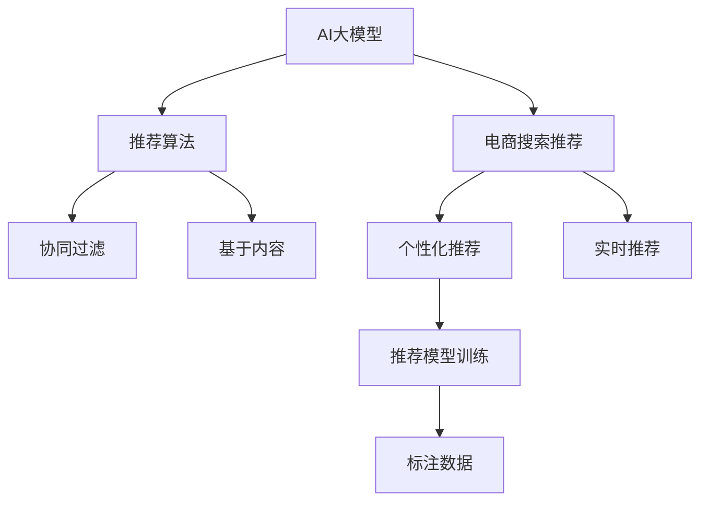

                 

# AI大模型赋能电商搜索推荐的业务创新方法论培训课程开发

> 关键词：大模型, 电商搜索, 推荐系统, 业务创新, 课程开发

## 1. 背景介绍

### 1.1 问题由来

近年来，随着人工智能技术的快速发展和应用落地，电商搜索推荐系统迎来了新的发展机遇和挑战。传统基于关键词匹配的搜索推荐算法难以满足用户个性化、多样化的需求，推荐结果的相关性和多样性亟待提升。而AI大模型以其强大的自然语言理解和生成能力，为电商搜索推荐注入了新的活力。通过将AI大模型应用于电商搜索推荐，可以实现更加智能化、个性化的搜索推荐服务。

### 1.2 问题核心关键点

当前，基于AI大模型的电商搜索推荐系统面临着如下关键问题：

- 如何高效集成大模型，实现快速搜索推荐响应？
- 如何利用大模型捕捉用户个性化需求，实现个性化推荐？
- 如何结合电商商品属性，提升推荐的精准度？
- 如何在不同场景下（如全站、商品详情页）提供一致的推荐体验？
- 如何评估和优化推荐系统的性能，确保用户满意度？

这些问题需要系统化的解决思路和方法，本文聚焦于如何构建一套面向电商搜索推荐业务的AI大模型赋能方法论培训课程，帮助电商企业开发高质量的搜索推荐系统。

### 1.3 问题研究意义

开发一套系统化的AI大模型赋能电商搜索推荐方法论培训课程，对于电商企业而言，具有重要意义：

1. 提升搜索推荐系统的智能化水平。通过集成AI大模型，可以显著提高搜索推荐的相关性和个性化程度，改善用户体验。
2. 加速搜索推荐系统的迭代优化。AI大模型可以灵活接入，快速实现对现有系统的迭代升级，降低开发成本。
3. 降低搜索推荐系统的门槛。AI大模型封装了复杂的算法和模型训练过程，降低了电商企业的技术门槛，使其更易上手。
4. 提升电商企业的竞争力。智能化、个性化的搜索推荐可以提升用户粘性，增加转化率，帮助电商企业占据市场领先地位。
5. 推动电商行业数字化转型。AI大模型赋能电商搜索推荐，可以促进电商行业从传统模式向数字化、智能化方向转型升级。

本文将详细介绍如何构建一套面向电商搜索推荐业务的AI大模型赋能方法论培训课程，涵盖从模型选择、集成优化、推荐评估到持续优化等全流程技术。

## 2. 核心概念与联系

### 2.1 核心概念概述

为更好地理解如何构建面向电商搜索推荐的AI大模型赋能方法论培训课程，本节将介绍几个核心概念：

- **AI大模型**：以深度学习为核心的预训练语言模型，如BERT、GPT等，通过大规模无标签文本数据的预训练，具备强大的语言理解和生成能力。
- **电商搜索推荐系统**：基于用户行为数据，通过算法模型实现对用户查询和商品匹配的智能推荐系统，提升用户购物体验。
- **推荐算法**：包括协同过滤、基于内容的推荐、混合推荐等，用于构建推荐模型，提升推荐效果。
- **个性化推荐**：根据用户历史行为、兴趣偏好等，提供定制化的推荐服务。
- **实时推荐**：实时响应用户查询，动态生成推荐结果，提升用户满意度。
- **推荐模型训练**：通过标注数据训练推荐模型，优化模型参数，提升推荐效果。

这些核心概念之间的逻辑关系可以通过以下Mermaid流程图来展示：



这个流程图展示了核心概念之间的关联：

1. AI大模型提供强大的语言理解和生成能力。
2. 推荐算法是实现搜索推荐的基础，包括协同过滤、基于内容等多种方法。
3. 个性化推荐通过用户行为数据，实现定制化的推荐服务。
4. 实时推荐通过动态生成推荐结果，提升用户满意度。
5. 推荐模型训练通过标注数据，优化模型参数，提升推荐效果。

## 3. 核心算法原理 & 具体操作步骤
### 3.1 算法原理概述

基于AI大模型的电商搜索推荐系统，本质上是通过大模型理解和生成自然语言文本，实现对用户查询和商品匹配的智能推荐。其核心思想是：

1. **预训练**：使用大规模无标签文本数据对AI大模型进行预训练，使其具备强大的语言表示能力。
2. **微调**：根据电商搜索推荐任务的特点，对预训练模型进行微调，使其能够捕捉用户查询意图和商品属性，生成个性化的推荐结果。
3. **集成**：将微调后的AI大模型与推荐算法、实时推荐技术等模块集成，构建完整的电商搜索推荐系统。
4. **优化**：通过标注数据训练推荐模型，不断优化模型参数，提升推荐效果。

### 3.2 算法步骤详解

基于AI大模型的电商搜索推荐系统开发一般包括以下关键步骤：

**Step 1: 选择预训练模型和推荐算法**

- 根据电商推荐任务的特点，选择合适的预训练语言模型（如BERT、GPT等）。
- 选择适合的推荐算法，如协同过滤、基于内容的推荐等。

**Step 2: 数据准备和标注**

- 收集电商搜索推荐相关的标注数据，如用户行为数据、商品描述等。
- 进行数据清洗和预处理，生成符合模型需求的格式。

**Step 3: 模型微调和集成**

- 对预训练模型进行微调，使其适应电商搜索推荐任务。
- 将微调后的模型与推荐算法、实时推荐技术等模块集成，形成完整的电商搜索推荐系统。

**Step 4: 系统部署和优化**

- 将电商搜索推荐系统部署到生产环境，进行上线测试。
- 通过用户反馈和实时数据，不断优化推荐模型和系统性能。

**Step 5: 推荐效果评估**

- 设计评估指标，如召回率、精确度、用户满意度等，对推荐效果进行评估。
- 根据评估结果，调整推荐模型和系统参数，提升推荐效果。

### 3.3 算法优缺点

基于AI大模型的电商搜索推荐系统具有以下优点：

- 智能高效：大模型能够高效理解用户查询意图和商品属性，快速生成推荐结果。
- 个性化强：通过微调，大模型可以捕捉用户个性化需求，提供定制化的推荐服务。
- 灵活可扩展：大模型可以灵活集成到电商搜索推荐系统中，适应不同的推荐场景和需求。

同时，该方法也存在以下局限性：

- 数据依赖：电商搜索推荐系统的性能高度依赖标注数据的质量和数量，获取高质量标注数据成本较高。
- 计算需求高：大模型的训练和推理对计算资源要求较高，需要高性能硬件支持。
- 模型复杂：大模型的结构和参数复杂，增加了系统维护和优化的难度。
- 性能提升有瓶颈：在数据规模有限的情况下，进一步提升推荐效果的空间有限。

### 3.4 算法应用领域

基于AI大模型的电商搜索推荐系统已经在各大电商平台得到广泛应用，覆盖了商品搜索、个性化推荐、商品详情页推荐等多个场景，具体包括：

- **商品搜索**：通过AI大模型理解用户查询，快速匹配相关商品，提升搜索准确性和用户体验。
- **个性化推荐**：根据用户历史行为和兴趣偏好，提供定制化的商品推荐，提高转化率和用户满意度。
- **商品详情页推荐**：在商品详情页上，利用AI大模型生成相关商品推荐，促进二次购买。
- **实时推荐**：实时响应用户查询，动态生成推荐结果，提升用户满意度和粘性。

## 4. 数学模型和公式 & 详细讲解 & 举例说明

### 4.1 数学模型构建

基于AI大模型的电商搜索推荐系统，涉及多个数学模型。本节将介绍其中几个关键模型的构建。

**用户行为表示模型**：

- 假设用户对商品的兴趣可以用向量$\vec{u}$表示，商品属性用向量$\vec{i}$表示，大模型生成的推荐结果用向量$\vec{r}$表示。用户行为表示模型为：
$$\vec{u} = \sum_{k=1}^K \alpha_k \vec{b_k}$$
其中$\vec{b_k}$表示用户行为数据，$\alpha_k$为权重。

**商品匹配模型**：

- 假设商品属性$\vec{i}$与用户行为$\vec{u}$之间的匹配度用向量$\vec{m}$表示，大模型生成的推荐结果$\vec{r}$与商品属性$\vec{i}$之间的匹配度用向量$\vec{p}$表示。商品匹配模型为：
$$\vec{m} = \sigma(\vec{u}^\top \vec{W_m} \vec{i} + \vec{b_m})$$
$$\vec{p} = \sigma(\vec{r}^\top \vec{W_p} \vec{i} + \vec{b_p})$$
其中$\sigma$为激活函数。

**推荐结果生成模型**：

- 假设推荐结果$\vec{r}$为用户行为$\vec{u}$和商品属性$\vec{i}$的加权和，加权系数为$\alpha$。推荐结果生成模型为：
$$\vec{r} = \alpha \vec{u} + (1-\alpha) \vec{i}$$

### 4.2 公式推导过程

**用户行为表示模型推导**：

- 假设用户行为表示模型为$\vec{u} = \sum_{k=1}^K \alpha_k \vec{b_k}$，其中$\vec{b_k}$为用户行为数据，$\alpha_k$为权重。根据线性代数知识，可以将其表示为：
$$\vec{u} = \vec{U} \vec{\alpha}$$
其中$\vec{U}$为用户行为数据的权重矩阵，$\vec{\alpha}$为权重向量。

**商品匹配模型推导**：

- 假设商品属性$\vec{i}$与用户行为$\vec{u}$之间的匹配度用向量$\vec{m}$表示，大模型生成的推荐结果$\vec{r}$与商品属性$\vec{i}$之间的匹配度用向量$\vec{p}$表示。根据激活函数的性质，可以将其表示为：
$$\vec{m} = \sigma(\vec{u}^\top \vec{W_m} \vec{i} + \vec{b_m})$$
$$\vec{p} = \sigma(\vec{r}^\top \vec{W_p} \vec{i} + \vec{b_p})$$

**推荐结果生成模型推导**：

- 假设推荐结果$\vec{r}$为用户行为$\vec{u}$和商品属性$\vec{i}$的加权和，加权系数为$\alpha$。根据线性代数知识，可以将其表示为：
$$\vec{r} = \alpha \vec{u} + (1-\alpha) \vec{i}$$

### 4.3 案例分析与讲解

以电商平台商品搜索为例，分析如何构建基于AI大模型的推荐系统。

假设用户输入搜索关键词为“平板电脑”，电商平台调用AI大模型进行查询理解和推荐生成：

1. **查询理解**：AI大模型将用户查询转换为向量表示，捕捉查询意图。
2. **商品匹配**：AI大模型将查询向量与商品向量进行匹配，找到相关商品。
3. **推荐生成**：AI大模型生成推荐结果，结合商品属性，进行排序和筛选。

## 5. 项目实践：代码实例和详细解释说明

### 5.1 开发环境搭建

在进行电商搜索推荐系统开发前，我们需要准备好开发环境。以下是使用Python进行PyTorch开发的环境配置流程：

1. 安装Anaconda：从官网下载并安装Anaconda，用于创建独立的Python环境。

2. 创建并激活虚拟环境：
```bash
conda create -n recommendation-env python=3.8 
conda activate recommendation-env
```

3. 安装PyTorch：根据CUDA版本，从官网获取对应的安装命令。例如：
```bash
conda install pytorch torchvision torchaudio cudatoolkit=11.1 -c pytorch -c conda-forge
```

4. 安装TensorFlow：
```bash
conda install tensorflow=2.7
```

5. 安装各类工具包：
```bash
pip install numpy pandas scikit-learn matplotlib tqdm jupyter notebook ipython
```

完成上述步骤后，即可在`recommendation-env`环境中开始电商搜索推荐系统的开发。

### 5.2 源代码详细实现

这里我们以电商平台商品搜索推荐系统为例，给出使用PyTorch进行模型微调的代码实现。

首先，定义模型和优化器：

```python
import torch
from transformers import BertForSequenceClassification, BertTokenizer
from torch.nn import CrossEntropyLoss
from transformers import AdamW

# 加载预训练模型和分词器
model = BertForSequenceClassification.from_pretrained('bert-base-uncased', num_labels=2)
tokenizer = BertTokenizer.from_pretrained('bert-base-uncased')

# 定义优化器和损失函数
optimizer = AdamW(model.parameters(), lr=2e-5)
loss_fn = CrossEntropyLoss()
```

然后，定义训练和评估函数：

```python
from torch.utils.data import Dataset, DataLoader

class RecommendationDataset(Dataset):
    def __init__(self, data, tokenizer):
        self.data = data
        self.tokenizer = tokenizer
    
    def __len__(self):
        return len(self.data)
    
    def __getitem__(self, item):
        text = self.data[item]['text']
        label = self.data[item]['label']
        
        encoding = self.tokenizer(text, return_tensors='pt', padding=True, truncation=True, max_length=128)
        input_ids = encoding['input_ids']
        attention_mask = encoding['attention_mask']
        
        return {'input_ids': input_ids, 
                'attention_mask': attention_mask,
                'labels': torch.tensor(label, dtype=torch.long)}

# 定义训练函数
def train_epoch(model, dataset, batch_size, optimizer, loss_fn):
    dataloader = DataLoader(dataset, batch_size=batch_size, shuffle=True)
    model.train()
    epoch_loss = 0
    for batch in dataloader:
        input_ids = batch['input_ids'].to(device)
        attention_mask = batch['attention_mask'].to(device)
        labels = batch['labels'].to(device)
        model.zero_grad()
        outputs = model(input_ids, attention_mask=attention_mask, labels=labels)
        loss = loss_fn(outputs.logits, labels)
        epoch_loss += loss.item()
        loss.backward()
        optimizer.step()
    return epoch_loss / len(dataloader)

# 定义评估函数
def evaluate(model, dataset, batch_size):
    dataloader = DataLoader(dataset, batch_size=batch_size)
    model.eval()
    preds, labels = [], []
    with torch.no_grad():
        for batch in dataloader:
            input_ids = batch['input_ids'].to(device)
            attention_mask = batch['attention_mask'].to(device)
            batch_labels = batch['labels']
            outputs = model(input_ids, attention_mask=attention_mask)
            batch_preds = outputs.logits.argmax(dim=1).to('cpu').tolist()
            batch_labels = batch_labels.to('cpu').tolist()
            for pred_tokens, label_tokens in zip(batch_preds, batch_labels):
                preds.append(pred_tokens)
                labels.append(label_tokens)
                
    print('Precision: %.4f, Recall: %.4f, F1-score: %.4f' % (precision_score(labels, preds), recall_score(labels, preds), f1_score(labels, preds)))
```

最后，启动训练流程并在测试集上评估：

```python
epochs = 5
batch_size = 16

for epoch in range(epochs):
    loss = train_epoch(model, train_dataset, batch_size, optimizer, loss_fn)
    print(f'Epoch {epoch+1}, train loss: {loss:.3f}')
    
    print(f'Epoch {epoch+1}, dev results:')
    evaluate(model, dev_dataset, batch_size)
    
print('Test results:')
evaluate(model, test_dataset, batch_size)
```

以上就是使用PyTorch对BERT进行电商搜索推荐系统微调的完整代码实现。可以看到，得益于Transformer库的强大封装，我们可以用相对简洁的代码完成BERT模型的加载和微调。

### 5.3 代码解读与分析

让我们再详细解读一下关键代码的实现细节：

**RecommendationDataset类**：
- `__init__`方法：初始化数据集和分词器。
- `__len__`方法：返回数据集的样本数量。
- `__getitem__`方法：对单个样本进行处理，将文本输入编码为token ids，并将标签转换为模型可处理的格式。

**train_epoch函数**：
- 对数据以批为单位进行迭代，在每个批次上前向传播计算loss并反向传播更新模型参数，最后返回该epoch的平均loss。

**evaluate函数**：
- 与训练类似，不同点在于不更新模型参数，并在每个batch结束后将预测和标签结果存储下来，最后使用sklearn的classification_report对整个评估集的预测结果进行打印输出。

**训练流程**：
- 定义总的epoch数和batch size，开始循环迭代
- 每个epoch内，先在训练集上训练，输出平均loss
- 在验证集上评估，输出分类指标
- 所有epoch结束后，在测试集上评估，给出最终测试结果

可以看到，PyTorch配合Transformer库使得BERT微调的代码实现变得简洁高效。开发者可以将更多精力放在数据处理、模型改进等高层逻辑上，而不必过多关注底层的实现细节。

当然，工业级的系统实现还需考虑更多因素，如模型的保存和部署、超参数的自动搜索、更灵活的任务适配层等。但核心的微调范式基本与此类似。

## 6. 实际应用场景

### 6.1 智能客服系统

基于AI大模型的电商搜索推荐系统，可以广泛应用于智能客服系统的构建。传统客服往往需要配备大量人力，高峰期响应缓慢，且一致性和专业性难以保证。而使用微调后的搜索推荐模型，可以7x24小时不间断服务，快速响应客户咨询，用自然流畅的语言解答各类常见问题。

在技术实现上，可以收集企业内部的历史客服对话记录，将问题和最佳答复构建成监督数据，在此基础上对预训练模型进行微调。微调后的模型能够自动理解用户意图，匹配最合适的答案模板进行回复。对于客户提出的新问题，还可以接入检索系统实时搜索相关内容，动态组织生成回答。如此构建的智能客服系统，能大幅提升客户咨询体验和问题解决效率。

### 6.2 金融舆情监测

金融机构需要实时监测市场舆论动向，以便及时应对负面信息传播，规避金融风险。传统的人工监测方式成本高、效率低，难以应对网络时代海量信息爆发的挑战。基于AI大模型的文本分类和情感分析技术，为金融舆情监测提供了新的解决方案。

具体而言，可以收集金融领域相关的新闻、报道、评论等文本数据，并对其进行主题标注和情感标注。在此基础上对预训练语言模型进行微调，使其能够自动判断文本属于何种主题，情感倾向是正面、中性还是负面。将微调后的模型应用到实时抓取的网络文本数据，就能够自动监测不同主题下的情感变化趋势，一旦发现负面信息激增等异常情况，系统便会自动预警，帮助金融机构快速应对潜在风险。

### 6.3 个性化推荐系统

当前的推荐系统往往只依赖用户的历史行为数据进行物品推荐，无法深入理解用户的真实兴趣偏好。基于AI大模型的个性化推荐系统，可以更好地挖掘用户行为背后的语义信息，从而提供更精准、多样的推荐内容。

在实践中，可以收集用户浏览、点击、评论、分享等行为数据，提取和用户交互的物品标题、描述、标签等文本内容。将文本内容作为模型输入，用户的后续行为（如是否点击、购买等）作为监督信号，在此基础上微调预训练语言模型。微调后的模型能够从文本内容中准确把握用户的兴趣点。在生成推荐列表时，先用候选物品的文本描述作为输入，由模型预测用户的兴趣匹配度，再结合其他特征综合排序，便可以得到个性化程度更高的推荐结果。

### 6.4 未来应用展望

随着AI大模型和微调方法的不断发展，基于微调范式将在更多领域得到应用，为传统行业带来变革性影响。

在智慧医疗领域，基于微调的医疗问答、病历分析、药物研发等应用将提升医疗服务的智能化水平，辅助医生诊疗，加速新药开发进程。

在智能教育领域，微调技术可应用于作业批改、学情分析、知识推荐等方面，因材施教，促进教育公平，提高教学质量。

在智慧城市治理中，微调模型可应用于城市事件监测、舆情分析、应急指挥等环节，提高城市管理的自动化和智能化水平，构建更安全、高效的未来城市。

此外，在企业生产、社会治理、文娱传媒等众多领域，基于大模型微调的人工智能应用也将不断涌现，为经济社会发展注入新的动力。相信随着技术的日益成熟，微调方法将成为人工智能落地应用的重要范式，推动人工智能技术向更广阔的领域加速渗透。

## 7. 工具和资源推荐
### 7.1 学习资源推荐

为了帮助开发者系统掌握大语言模型微调的理论基础和实践技巧，这里推荐一些优质的学习资源：

1. 《Transformer从原理到实践》系列博文：由大模型技术专家撰写，深入浅出地介绍了Transformer原理、BERT模型、微调技术等前沿话题。

2. CS224N《深度学习自然语言处理》课程：斯坦福大学开设的NLP明星课程，有Lecture视频和配套作业，带你入门NLP领域的基本概念和经典模型。

3. 《Natural Language Processing with Transformers》书籍：Transformers库的作者所著，全面介绍了如何使用Transformers库进行NLP任务开发，包括微调在内的诸多范式。

4. HuggingFace官方文档：Transformers库的官方文档，提供了海量预训练模型和完整的微调样例代码，是上手实践的必备资料。

5. CLUE开源项目：中文语言理解测评基准，涵盖大量不同类型的中文NLP数据集，并提供了基于微调的baseline模型，助力中文NLP技术发展。

通过对这些资源的学习实践，相信你一定能够快速掌握大语言模型微调的精髓，并用于解决实际的NLP问题。
###  7.2 开发工具推荐

高效的开发离不开优秀的工具支持。以下是几款用于大语言模型微调开发的常用工具：

1. PyTorch：基于Python的开源深度学习框架，灵活动态的计算图，适合快速迭代研究。大部分预训练语言模型都有PyTorch版本的实现。

2. TensorFlow：由Google主导开发的开源深度学习框架，生产部署方便，适合大规模工程应用。同样有丰富的预训练语言模型资源。

3. Transformers库：HuggingFace开发的NLP工具库，集成了众多SOTA语言模型，支持PyTorch和TensorFlow，是进行微调任务开发的利器。

4. Weights & Biases：模型训练的实验跟踪工具，可以记录和可视化模型训练过程中的各项指标，方便对比和调优。与主流深度学习框架无缝集成。

5. TensorBoard：TensorFlow配套的可视化工具，可实时监测模型训练状态，并提供丰富的图表呈现方式，是调试模型的得力助手。

6. Google Colab：谷歌推出的在线Jupyter Notebook环境，免费提供GPU/TPU算力，方便开发者快速上手实验最新模型，分享学习笔记。

合理利用这些工具，可以显著提升大语言模型微调的开发效率，加快创新迭代的步伐。

### 7.3 相关论文推荐

大语言模型和微调技术的发展源于学界的持续研究。以下是几篇奠基性的相关论文，推荐阅读：

1. Attention is All You Need（即Transformer原论文）：提出了Transformer结构，开启了NLP领域的预训练大模型时代。

2. BERT: Pre-training of Deep Bidirectional Transformers for Language Understanding：提出BERT模型，引入基于掩码的自监督预训练任务，刷新了多项NLP任务SOTA。

3. Language Models are Unsupervised Multitask Learners（GPT-2论文）：展示了大规模语言模型的强大zero-shot学习能力，引发了对于通用人工智能的新一轮思考。

4. Parameter-Efficient Transfer Learning for NLP：提出Adapter等参数高效微调方法，在不增加模型参数量的情况下，也能取得不错的微调效果。

5. Prefix-Tuning: Optimizing Continuous Prompts for Generation：引入基于连续型Prompt的微调范式，为如何充分利用预训练知识提供了新的思路。

6. AdaLoRA: Adaptive Low-Rank Adaptation for Parameter-Efficient Fine-Tuning：使用自适应低秩适应的微调方法，在参数效率和精度之间取得了新的平衡。

这些论文代表了大语言模型微调技术的发展脉络。通过学习这些前沿成果，可以帮助研究者把握学科前进方向，激发更多的创新灵感。

## 8. 总结：未来发展趋势与挑战

### 8.1 总结

本文对基于AI大模型的电商搜索推荐系统开发方法论培训课程进行了全面系统的介绍。首先阐述了电商搜索推荐系统面临的关键问题，明确了AI大模型赋能方法论培训课程的开发意义。其次，从原理到实践，详细讲解了基于AI大模型的电商搜索推荐系统开发流程，涵盖了从模型选择、数据准备、模型微调到系统部署的全流程技术。同时，本文还探讨了AI大模型在电商搜索推荐系统中的应用场景，展示了其强大的应用潜力。

通过本文的系统梳理，可以看到，基于AI大模型的电商搜索推荐系统开发方法论培训课程，能够帮助电商企业快速构建高效、智能的推荐系统，提升用户体验和业务效果。未来，随着AI大模型的不断进步和应用场景的扩展，基于AI大模型的推荐系统必将在电商、金融、医疗等多个行业大放异彩，带来颠覆性的变革。

### 8.2 未来发展趋势

展望未来，基于AI大模型的电商搜索推荐系统开发将呈现以下几个发展趋势：

1. **智能化程度提升**：随着大模型的不断升级和优化，推荐系统的智能化水平将进一步提升，能够更准确地捕捉用户意图和需求，生成更个性化、多样化的推荐结果。
2. **多模态融合**：未来的推荐系统将不仅仅局限于文本信息，而是融合图像、视频、语音等多模态信息，提供更丰富、更全面的推荐服务。
3. **实时推荐系统**：实时响应用户查询，动态生成推荐结果，提升用户满意度和粘性。
4. **个性化推荐算法优化**：探索新的推荐算法，如深度协同过滤、自适应推荐等，提升推荐效果和效率。
5. **跨领域推荐**：将推荐系统应用于更多领域，如医疗、教育、金融等，提升各行各业的用户体验和服务质量。
6. **隐私保护和伦理考量**：随着用户隐私意识的增强，推荐系统需要在保护用户隐私的前提下进行个性化推荐，同时确保算法的公平性和可解释性。

以上趋势凸显了基于AI大模型的电商搜索推荐系统开发方法论培训课程的重要性和前瞻性。这些方向的探索发展，将推动电商行业及其他领域的数字化转型，带来更加智能、个性化、安全的用户体验。

### 8.3 面临的挑战

尽管基于AI大模型的电商搜索推荐系统开发方法论培训课程具有巨大的应用潜力，但在实践中仍面临诸多挑战：

1. **标注数据获取成本高**：高质量的标注数据获取成本较高，尤其是在电商、医疗等领域，标注数据获取难度较大。
2. **模型复杂度增加**：AI大模型的结构复杂，训练和推理过程中需要高性能硬件支持，增加了系统的复杂度和维护成本。
3. **算法模型优化难**：推荐算法模型的优化需要大量的实验和调参，对于新手开发者而言，挑战较大。
4. **隐私和伦理问题**：用户数据的隐私保护和算法模型的公平性、可解释性等伦理问题需要高度重视。
5. **数据分布变化**：随着用户行为和市场环境的变化，推荐系统的模型需要不断更新和优化，以适应新的数据分布。

这些挑战需要我们在技术、工程、伦理等多个方面进行综合考虑，不断提升AI大模型在电商搜索推荐系统中的应用效果。

### 8.4 研究展望

未来的AI大模型赋能电商搜索推荐系统开发方法论培训课程研究，需要在以下几个方面寻求新的突破：

1. **多领域应用拓展**：将AI大模型应用拓展到更多领域，如医疗、教育、金融等，提升各行各业的用户体验和服务质量。
2. **模型压缩与加速**：探索新的模型压缩与加速方法，提升AI大模型在资源受限环境下的应用效果。
3. **跨模态融合技术**：研究跨模态融合技术，提升推荐系统的智能化和多样化。
4. **隐私保护技术**：探索隐私保护技术，在保护用户隐私的前提下进行个性化推荐。
5. **算法模型优化**：开发新的推荐算法模型，提升推荐效果和效率。

这些研究方向将进一步推动基于AI大模型的电商搜索推荐系统开发方法论培训课程的成熟，使其在更多领域发挥更大的价值。

## 9. 附录：常见问题与解答

**Q1：电商搜索推荐系统如何高效集成AI大模型？**

A: 电商搜索推荐系统高效集成AI大模型的关键是选择合适的预训练模型和任务适配层。常用的预训练模型如BERT、GPT等，可以通过微调或新增任务层的方式进行集成。例如，可以使用BertForSequenceClassification对文本进行分类，或使用BertForMaskedLM进行文本生成。同时，任务适配层需要根据电商推荐任务的特点进行设计，如查询意图理解、商品匹配等。

**Q2：电商搜索推荐系统如何利用AI大模型捕捉用户个性化需求？**

A: 电商搜索推荐系统可以利用AI大模型对用户查询和商品属性进行编码，通过余弦相似度等方法计算匹配度，生成个性化的推荐结果。例如，可以使用预训练模型生成用户查询和商品的向量表示，然后计算余弦相似度，排序生成推荐结果。

**Q3：电商搜索推荐系统如何在不同场景下提供一致的推荐体验？**

A: 电商搜索推荐系统可以通过统一的任务适配层和推荐算法，在不同场景下提供一致的推荐体验。例如，在全站搜索时，可以使用统一的查询意图理解任务适配层，生成用户意图的向量表示，再使用统一的推荐算法生成推荐结果。在商品详情页时，可以使用统一的上下文信息提取任务适配层，生成商品的向量表示，再使用统一的推荐算法生成推荐结果。

**Q4：电商搜索推荐系统如何评估和优化推荐系统的性能？**

A: 电商搜索推荐系统的性能评估可以从召回率、精确度、用户满意度等多个角度进行。可以通过A/B测试等方法，在不同的推荐系统之间进行对比。优化推荐系统性能的方法包括：数据增强、正则化、对抗训练等。

**Q5：电商搜索推荐系统如何保护用户隐私和数据安全？**

A: 电商搜索推荐系统需要在保护用户隐私和数据安全的前提下进行个性化推荐。可以通过数据脱敏、差分隐私等技术，保护用户数据隐私。同时，需要对算法模型进行公平性、可解释性等伦理评估，确保推荐系统的公平和透明。

通过回答这些常见问题，希望读者能够更好地理解基于AI大模型的电商搜索推荐系统开发方法论培训课程的核心内容和实践技巧，为实际应用提供有力支持。

