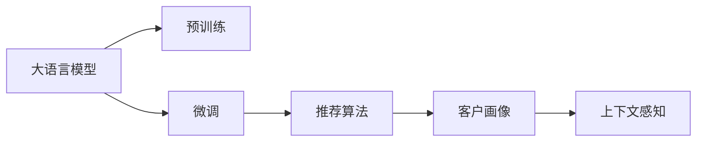

                 

# AI大模型赋能电商搜索推荐的业务创新项目管理方法

在数字化转型的大趋势下，电商企业面临着巨大的竞争压力和市场机遇。为了在激烈的市场竞争中占据优势，电商企业需要不断创新其业务模式和运营策略。近年来，人工智能技术的快速发展，特别是大语言模型在电商搜索推荐系统中的应用，为电商企业的业务创新提供了新的可能。本文将系统介绍基于大模型的电商搜索推荐系统开发及项目管理方法，帮助企业构建更具竞争力的电商搜索推荐系统。

## 1. 背景介绍

### 1.1 问题由来
随着互联网的快速发展，电商企业面临着愈加复杂多变的市场需求。客户期望通过智能化的搜索推荐系统，快速准确地找到自己所需的商品，从而提升购物体验。传统的基于规则的推荐系统已难以满足这些需求，因此，基于深度学习的大模型推荐系统应运而生。

目前，电商搜索推荐系统主要面临以下问题：
- 推荐内容同质化严重，缺乏个性化推荐。
- 推荐系统容易陷入局部最优，泛化能力不足。
- 数据样本规模有限，难以充分学习客户需求。
- 算法模型复杂度高，训练和部署成本大。

通过应用大语言模型，电商企业可以更精准地分析用户行为，实现更个性化的商品推荐，提升用户满意度和企业收益。

### 1.2 问题核心关键点
- **大语言模型**：以自回归或自编码模型为代表，通过大规模无标签文本数据进行预训练的语言模型，具备强大的自然语言理解能力。
- **预训练**：在无标签数据上进行的自我监督学习过程，使模型学习到语言的通用表示。
- **微调**：在有标签数据上进行的进一步训练，调整模型参数，使模型能够适应特定的电商搜索推荐任务。
- **推荐算法**：包括协同过滤、内容推荐、深度学习推荐等，用于生成推荐结果。
- **客户画像**：基于用户历史行为数据构建的用于描述用户兴趣、需求的特征集合。
- **上下文感知**：结合商品描述、用户位置、时间等信息，提升推荐系统的精度和相关性。

这些核心概念之间存在密切联系，相互支撑，共同构建了电商搜索推荐系统的基础框架。

## 2. 核心概念与联系

### 2.1 核心概念概述
以下对电商搜索推荐系统开发涉及的核心概念进行详细阐述：

- **大语言模型**：如BERT、GPT-2、T5等，通过大规模文本数据的预训练，学习到语言的深度表征。
- **预训练**：在大规模无标签数据上，通过自监督学习任务，训练语言模型。
- **微调**：在有标签数据上，通过监督学习任务，进一步优化模型，使其适用于电商搜索推荐任务。
- **推荐算法**：基于协同过滤、深度学习等技术，结合客户画像和上下文信息，生成推荐结果。
- **客户画像**：包含用户历史行为、兴趣偏好、人口统计信息等，用于刻画用户特征。
- **上下文感知**：结合商品描述、位置、时间等上下文信息，提升推荐系统效果。

这些概念通过如下图所示的Mermaid流程图，展现了它们之间的联系：



该图展示了核心概念之间的逻辑关系：大语言模型通过预训练获得基础能力，然后通过微调适应电商推荐任务，推荐算法结合客户画像和上下文信息生成推荐结果。

### 2.2 核心概念原理和架构的 Mermaid 流程图


该图展示了基于大语言模型的电商搜索推荐系统的架构：用户查询经过BERT模型进行特征提取，结合协同过滤算法生成推荐结果，同时结合客户画像和上下文信息进行优化，并根据用户反馈进行客户画像的更新和模型的微调。

## 3. 核心算法原理 & 具体操作步骤
### 3.1 算法原理概述

基于大模型的电商搜索推荐系统，主要分为预训练、微调、推荐三个步骤。其核心算法原理如下：

- **预训练**：在大规模无标签文本数据上，通过自监督学习任务（如掩码语言模型、上下文一致性任务等），训练大语言模型。
- **微调**：在有标签的电商数据集上，通过监督学习任务（如分类、回归等），调整模型参数，使其能够适应电商推荐任务。
- **推荐**：结合客户画像和上下文信息，使用推荐算法（如协同过滤、深度学习等），生成推荐结果。

这些步骤通过如下所示的算法流程得以实现：


其中，预训练和微调过程构成了一个完整的端到端学习框架，推荐算法将结果输出到业务系统中。

### 3.2 算法步骤详解

**Step 1: 预训练**

预训练的目的是使大语言模型学习到通用的语言表征。具体步骤如下：

1. **数据准备**：选择大规模无标签文本数据，如维基百科、新闻、社交媒体等。
2. **模型训练**：使用自监督学习任务（如掩码语言模型、上下文一致性任务等）训练大语言模型，如BERT、GPT-2等。
3. **参数保存**：保存训练好的模型参数，用于后续的微调。

**Step 2: 微调**

微调的过程是将预训练模型适配到电商推荐任务。具体步骤如下：

1. **数据准备**：准备有标签的电商数据集，如用户商品互动数据、用户行为数据等。
2. **模型加载**：加载预训练模型，用于微调的基础。
3. **任务适配**：设计合适的输出层和损失函数，适应电商推荐任务。
4. **模型训练**：在电商数据集上，通过监督学习任务训练微调后的模型。
5. **参数保存**：保存微调后的模型参数，用于推荐系统的应用。

**Step 3: 推荐**

推荐的目的是根据客户画像和上下文信息，生成个性化的商品推荐结果。具体步骤如下：

1. **客户画像**：根据用户历史行为数据，构建客户画像，包含兴趣偏好、购买历史等信息。
2. **上下文感知**：结合商品描述、位置、时间等信息，进行上下文感知处理。
3. **推荐算法**：使用协同过滤、深度学习等推荐算法，生成推荐结果。
4. **结果展示**：将推荐结果展示给用户，并进行后续的反馈收集和优化。

### 3.3 算法优缺点

基于大模型的电商搜索推荐系统有以下优点：

- **精准度提升**：通过预训练和微调，模型能够更好地理解客户需求，生成更精准的推荐结果。
- **鲁棒性增强**：大模型具备更强的泛化能力，能够在不同场景下保持稳定的推荐效果。
- **可解释性增强**：通过分析模型输出，可以理解推荐结果背后的逻辑和原因，提升推荐系统的可解释性。

但该方法也存在以下缺点：

- **计算资源需求高**：大模型的预训练和微调需要大量的计算资源，对硬件要求较高。
- **训练时间长**：由于模型规模庞大，训练时间较长，需要优化以缩短训练时间。
- **数据隐私问题**：电商数据涉及用户隐私，如何处理和保护数据隐私是一个重要问题。

### 3.4 算法应用领域

基于大模型的电商搜索推荐系统，可以广泛应用于以下领域：

- **商品推荐**：根据客户浏览和购买历史，生成个性化商品推荐。
- **广告推荐**：结合用户行为和上下文信息，生成个性化广告推荐。
- **智能客服**：通过自然语言处理技术，实现智能客服和用户互动。
- **内容推荐**：根据用户偏好，推荐相关的新闻、视频、文章等内容。
- **商品搜索**：优化搜索算法，提高搜索结果的相关性和准确性。

## 4. 数学模型和公式 & 详细讲解 & 举例说明

### 4.1 数学模型构建

电商搜索推荐系统的数学模型可以表示为：

$$
y = f(x; \theta)
$$

其中，$y$ 表示推荐结果，$x$ 表示客户画像和上下文信息，$\theta$ 表示模型参数。推荐算法可以根据不同的任务选择合适的损失函数进行训练。

以协同过滤算法为例，模型的目标是最小化预测误差，即：

$$
L = \frac{1}{N} \sum_{i=1}^N \sum_{j=1}^N ||y_i - \hat{y}_i(x_j)||^2
$$

其中，$N$ 表示用户数量，$y_i$ 表示用户$i$的真实购买行为，$\hat{y}_i(x_j)$ 表示用户$i$对用户$j$的预测购买行为。

### 4.2 公式推导过程

协同过滤算法的目标是最小化预测误差，即：

$$
\min_{\theta} \frac{1}{N} \sum_{i=1}^N \sum_{j=1}^N ||y_i - \hat{y}_i(x_j)||^2
$$

其中，$\hat{y}_i(x_j)$ 可以表示为：

$$
\hat{y}_i(x_j) = \sum_{k=1}^K w_k_i x_k_j
$$

其中，$K$ 表示用户画像和上下文特征的数量，$w_k_i$ 表示用户$i$对特征$k$的权重，$x_k_j$ 表示用户$j$对特征$k$的特征值。

将$\hat{y}_i(x_j)$代入目标函数，得：

$$
\min_{\theta} \frac{1}{N} \sum_{i=1}^N \sum_{j=1}^N ||y_i - \sum_{k=1}^K w_k_i x_k_j||^2
$$

通过对目标函数求导，可以解得模型参数$\theta$。

### 4.3 案例分析与讲解

以Amazon商品推荐系统为例，我们可以使用协同过滤算法生成推荐结果。具体步骤如下：

1. **数据准备**：收集用户历史购买数据，生成用户画像和商品特征向量。
2. **模型训练**：在训练集上，通过最小化预测误差，训练协同过滤模型。
3. **模型评估**：在验证集上，评估模型的预测准确率和召回率。
4. **模型应用**：在测试集上，使用模型生成推荐结果，并实时更新推荐算法。

## 5. 项目实践：代码实例和详细解释说明

### 5.1 开发环境搭建

要实现基于大模型的电商搜索推荐系统，需要搭建如下开发环境：

1. **编程语言**：Python，支持PyTorch、TensorFlow等深度学习框架。
2. **硬件设备**：高性能GPU或TPU，支持大规模模型训练。
3. **软件工具**：Jupyter Notebook、Anaconda、TensorBoard等。

### 5.2 源代码详细实现

以下是一个使用PyTorch实现协同过滤推荐算法的示例代码：

```python
import torch
import torch.nn as nn
import torch.optim as optim
import torch.nn.functional as F

class协同过滤模型(nn.Module):
    def __init__(self, user_num, item_num, feature_dim):
        super(协同过滤模型, self).__init__()
        self.user_num = user_num
        self.item_num = item_num
        self.feature_dim = feature_dim
        self.user_embed = nn.Embedding(user_num, feature_dim)
        self.item_embed = nn.Embedding(item_num, feature_dim)
        self.prediction = nn.Linear(feature_dim * 2, 1)
    
    def forward(self, user_idx, item_idx):
        user_vec = self.user_embed(user_idx)
        item_vec = self.item_embed(item_idx)
        prediction = self.prediction(torch.cat([user_vec, item_vec], dim=1))
        return prediction

user_num = 100
item_num = 100
feature_dim = 10
model =协同过滤模型(user_num, item_num, feature_dim)
loss_fn = nn.MSELoss()
optimizer = optim.Adam(model.parameters(), lr=0.01)
```

### 5.3 代码解读与分析

上述代码中，我们首先定义了一个基于协同过滤的推荐模型，包含用户嵌入、商品嵌入和预测层。模型使用Adam优化器进行训练，目标函数为均方误差损失函数。

在实际应用中，我们可以使用Jupyter Notebook进行模型训练和验证，并结合TensorBoard进行可视化分析。

## 6. 实际应用场景

### 6.1 智能客服系统

智能客服系统可以结合大语言模型，实现智能问答和问题解答。具体步骤如下：

1. **数据准备**：收集客户历史聊天记录，生成问答对。
2. **模型训练**：使用大语言模型进行预训练，在问答对上微调。
3. **系统部署**：将微调后的模型部署到智能客服系统中，实现实时问答。

### 6.2 个性化推荐系统

个性化推荐系统可以结合大语言模型，实现更精准的商品推荐。具体步骤如下：

1. **数据准备**：收集用户历史行为数据，生成客户画像。
2. **模型训练**：使用大语言模型进行预训练，在客户画像上微调。
3. **推荐应用**：在电商平台上实时推荐商品，并根据用户反馈进行模型优化。

### 6.3 广告推荐系统

广告推荐系统可以结合大语言模型，实现更精准的广告投放。具体步骤如下：

1. **数据准备**：收集用户历史行为数据，生成广告特征。
2. **模型训练**：使用大语言模型进行预训练，在广告特征上微调。
3. **广告投放**：在广告平台上实时投放广告，并根据广告效果进行模型优化。

## 7. 工具和资源推荐

### 7.1 学习资源推荐

- **课程推荐**：《深度学习理论与实践》、《自然语言处理与深度学习》等课程。
- **书籍推荐**：《深度学习》、《NLP实战》等书籍。
- **在线资源**：Kaggle、Coursera等在线平台提供大量NLP学习资源。

### 7.2 开发工具推荐

- **深度学习框架**：PyTorch、TensorFlow等深度学习框架，支持大模型训练和微调。
- **可视化工具**：TensorBoard、Weights & Biases等可视化工具，方便模型训练和调试。
- **项目管理工具**：Jira、Trello等项目管理工具，支持团队协作和任务管理。

### 7.3 相关论文推荐

- **预训练模型论文**：BERT、GPT-2、T5等大语言模型论文。
- **推荐算法论文**：协同过滤、深度学习推荐算法等论文。
- **智能客服论文**：基于NLP的智能客服系统论文。

## 8. 总结：未来发展趋势与挑战

### 8.1 研究成果总结

本文详细介绍了基于大语言模型的电商搜索推荐系统开发及项目管理方法。通过预训练和微调，可以显著提升推荐系统的精准度和鲁棒性。推荐算法结合客户画像和上下文信息，进一步优化推荐效果。

### 8.2 未来发展趋势

基于大语言模型的电商搜索推荐系统有以下发展趋势：

1. **模型规模进一步扩大**：随着算力成本的下降，预训练和微调模型的规模将进一步增大，提升推荐系统的效果。
2. **推荐算法多样化**：协同过滤、深度学习、多臂赌博机等推荐算法将被更广泛应用，提升推荐系统的灵活性和适应性。
3. **上下文感知能力增强**：结合商品描述、位置、时间等信息，进一步提升推荐系统的精度和相关性。
4. **个性化推荐效果提升**：通过客户画像和行为数据的深度挖掘，实现更精准的个性化推荐。

### 8.3 面临的挑战

基于大语言模型的电商搜索推荐系统在发展过程中，面临以下挑战：

1. **计算资源需求高**：大规模模型训练和微调需要高性能硬件支持。
2. **数据隐私问题**：电商数据涉及用户隐私，需要采取有效的隐私保护措施。
3. **推荐系统公平性**：如何避免模型偏见，提升推荐系统的公平性是一个重要问题。
4. **用户交互界面优化**：提升用户交互体验，增强系统易用性。

### 8.4 研究展望

未来，基于大语言模型的电商搜索推荐系统需要重点解决以下问题：

1. **模型可解释性**：提升推荐系统的可解释性，增强用户信任。
2. **推荐系统公平性**：避免模型偏见，提升推荐系统的公平性。
3. **用户隐私保护**：采取有效的隐私保护措施，保护用户数据安全。
4. **计算资源优化**：优化模型训练和推理算法，提高计算效率。

总之，基于大语言模型的电商搜索推荐系统具有广阔的应用前景，未来需要在技术、管理、伦理等方面不断创新和优化，推动其向更加智能化、普适化方向发展。

## 9. 附录：常见问题与解答

**Q1: 大语言模型在电商搜索推荐中有什么优势？**

A: 大语言模型通过预训练和微调，可以更好地理解客户需求，生成更精准的推荐结果。相比传统推荐系统，大语言模型具备更强的泛化能力和可解释性，能够在不同场景下保持稳定的推荐效果。

**Q2: 如何降低电商推荐系统的计算资源需求？**

A: 可以采用模型压缩、剪枝、量化等方法，减小模型规模。同时，采用分布式训练和推理技术，提升计算效率。

**Q3: 电商推荐系统如何避免模型偏见？**

A: 可以在模型训练中引入公平性约束，避免对特定人群或商品的偏见。同时，定期进行模型评估和优化，提升推荐系统的公平性。

**Q4: 电商推荐系统如何保护用户隐私？**

A: 可以通过数据脱敏、匿名化等技术，保护用户数据隐私。同时，设计合理的用户隐私保护机制，确保用户数据的安全和合法使用。

**Q5: 电商推荐系统如何进行模型优化？**

A: 可以通过在线学习、增量学习等方法，实时更新模型参数。同时，结合用户反馈进行模型优化，提升推荐效果。

作者：禅与计算机程序设计艺术 / Zen and the Art of Computer Programming

