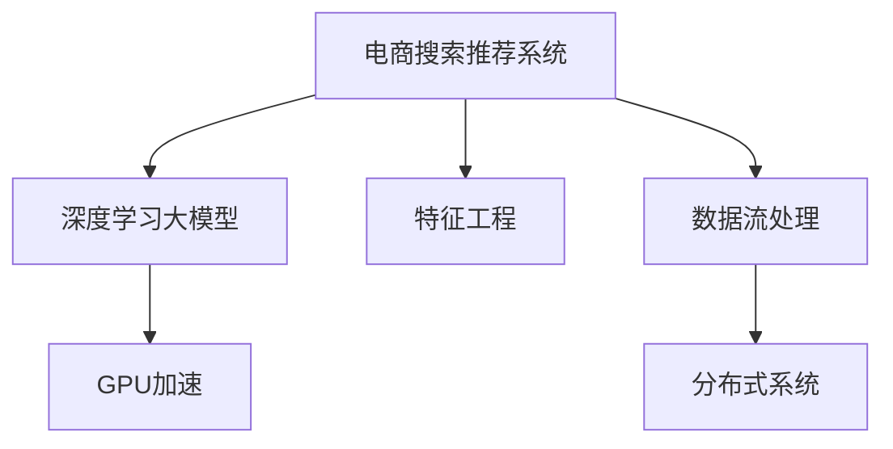

                 

# AI大模型赋能电商搜索推荐的实时性优化策略

> 关键词：实时性优化,大模型,电商搜索推荐,数据流处理,特征工程,深度学习

## 1. 背景介绍

### 1.1 问题由来

在电商领域，搜索推荐系统的实时性至关重要。用户通过搜索引擎输入关键词，希望系统能快速响应，提供最相关的商品信息。特别是当用户在购物车边缘摇摆时，推荐系统的准确性和速度可以直接影响用户的购买决策。

随着用户规模的不断扩大和商品数量的不断增加，传统推荐系统面临计算资源有限、实时性难以保证的挑战。如何利用大模型和大数据技术，实现高效的实时搜索推荐，成为了电商领域的一个重要课题。

### 1.2 问题核心关键点

电商搜索推荐系统的主要目标在于：在用户输入关键词时，快速准确地找到最符合用户需求的商品，并进行精准推荐。该系统通常分为两部分：

1. **检索模块**：根据用户输入的查询，快速找到所有可能相关的商品。
2. **排序模块**：从检索结果中，根据评分机制排序，生成推荐列表。

主要问题关键点包括：

- 如何快速检索相关的商品？
- 如何在检索结果中精准排序？
- 如何优化模型以提升实时性？

## 2. 核心概念与联系

### 2.1 核心概念概述

为了更好地理解实时性优化策略，本节将介绍几个关键概念：

- **电商搜索推荐系统**：根据用户输入的查询，快速找到所有可能相关的商品，并按照评分进行排序，生成推荐列表的系统。
- **深度学习大模型**：如BERT、GPT等基于Transformer结构的深度学习模型，通过海量的无标签数据预训练，具备强大的文本理解能力。
- **特征工程**：从原始数据中提取并设计对模型有用的特征，以提升模型的预测准确性。
- **数据流处理**：将数据流化为连续的、可处理的信号，便于模型实时处理。
- **分布式系统**：通过多台计算机并行处理，提升系统的吞吐量和响应速度。
- **GPU加速**：利用图形处理器（GPU）的并行计算能力，加速模型的推理过程。

这些概念之间的逻辑关系可以通过以下Mermaid流程图来展示：



这个流程图展示了一个电商搜索推荐系统的核心概念及其之间的关系：

1. 电商搜索推荐系统使用深度学习大模型作为核心组件，提取和处理用户查询相关的商品信息。
2. 特征工程是模型训练和推理的重要环节，通过设计合适的特征，提升模型的表现。
3. 数据流处理和分布式系统使得大规模数据的实时处理成为可能。
4. GPU加速提升了模型推理速度，为实时推荐提供了硬件支持。

这些概念共同构成了电商搜索推荐系统的技术框架，帮助其实现高效的实时推荐。

## 3. 核心算法原理 & 具体操作步骤
### 3.1 算法原理概述

基于大模型的电商搜索推荐系统，其核心在于利用大模型的语言理解能力，快速处理用户查询，并从商品库中找到最相关的商品。实时性优化策略主要包括以下几个方面：

- **快速检索**：利用大模型快速提取查询相关的商品。
- **特征提升**：通过特征工程，提升模型对查询的准确理解。
- **模型加速**：利用GPU加速和分布式系统，提升模型推理速度。

### 3.2 算法步骤详解

基于大模型的电商搜索推荐系统，其算法步骤通常包括以下几个关键步骤：

**Step 1: 准备数据和模型**
- 收集用户查询和商品描述等数据，构建训练集和测试集。
- 选择合适的预训练大模型，如BERT、GPT等。
- 加载GPU设备，准备数据流处理工具。

**Step 2: 特征工程**
- 设计合适的特征，如查询词、商品属性等。
- 使用大模型对查询和商品进行编码，提取语义表示。
- 应用特征提升技术，如TF-IDF、Word2Vec等，提升特征质量。

**Step 3: 模型训练**
- 将特征输入大模型进行训练，优化模型参数。
- 在测试集上评估模型性能，调整超参数。
- 使用分布式系统进行模型并行训练，提高训练效率。

**Step 4: 实时推荐**
- 当用户输入查询时，通过GPU加速对查询进行编码，提取语义表示。
- 利用大模型进行检索，找到所有相关的商品。
- 根据评分机制对检索结果进行排序，生成推荐列表。
- 返回推荐结果给用户，并实时更新模型参数。

**Step 5: 系统部署**
- 将模型部署到线上服务，接入实际电商系统。
- 配置分布式系统，支持并行处理和负载均衡。
- 设置GPU资源池，保证实时推荐所需的计算资源。

### 3.3 算法优缺点

基于大模型的电商搜索推荐系统具有以下优点：
1. 快速检索：利用大模型的强大语义理解能力，快速找到相关商品。
2. 精准排序：通过模型训练和特征提升，实现精准的推荐排序。
3. 实时响应：利用GPU加速和分布式系统，保证实时推荐。

同时，该系统也存在一些缺点：
1. 数据依赖：依赖高质量的标注数据进行训练，获取数据成本较高。
2. 模型复杂：大模型的参数量较大，训练和推理需要较多计算资源。
3. 部署复杂：系统部署和维护需要较多工程实践，维护成本较高。
4. 可解释性不足：大模型通常被视为"黑盒"，难以解释其内部工作机制。

尽管存在这些局限性，但基于大模型的电商搜索推荐系统在实际应用中仍然表现出显著的优势，广泛应用于各大电商平台的商品推荐中。

### 3.4 算法应用领域

基于大模型的电商搜索推荐系统已经在各大电商平台上得到了广泛应用，如：

- 京东、淘宝、拼多多等平台都采用基于大模型的搜索推荐系统，提升用户的购物体验。
- 亚马逊利用深度学习模型进行商品推荐，优化用户的购物流程。
- 阿里、苏宁等电商平台使用大模型进行个性化推荐，提高销售转化率。

这些应用实践表明，基于大模型的电商搜索推荐系统在提升用户体验、提高销售转化方面取得了显著效果，是电商技术发展的重要方向。

## 4. 数学模型和公式 & 详细讲解 & 举例说明

### 4.1 数学模型构建

电商搜索推荐系统的数学模型主要包括以下几个关键组件：

1. **用户查询表示**：将用户查询转化为向量表示，用于计算与商品的相似度。
2. **商品向量表示**：将商品描述或标签等信息转化为向量表示，用于检索相关商品。
3. **相似度计算**：根据查询和商品向量之间的相似度，筛选出相关商品。
4. **评分排序**：根据评分模型对检索结果进行排序，生成推荐列表。

### 4.2 公式推导过程

以下以用户查询和商品相似度计算为例，推导基于大模型的电商搜索推荐系统的数学模型。

假设用户查询为 $q$，商品为 $i$。设查询向量和商品向量分别为 $\mathbf{q}$ 和 $\mathbf{p}_i$。大模型在查询 $q$ 上的表示为 $\mathbf{h}_q$，在商品 $i$ 上的表示为 $\mathbf{h}_i$。则查询和商品之间的相似度可以表示为：

$$
similarity(q, i) = \mathbf{h}_q \cdot \mathbf{h}_i
$$

其中 $\cdot$ 表示向量点积。

为了计算大规模查询的相似度，可以将查询序列转化为嵌入序列 $[\mathbf{q}_1, \mathbf{q}_2, \ldots, \mathbf{q}_t]$，其中 $\mathbf{q}_t$ 表示查询序列中的第 $t$ 个单词。则查询与商品的相似度可以表示为：

$$
similarity([q_1, q_2, \ldots, q_t], i) = \sum_{t=1}^t \mathbf{h}_{q_t} \cdot \mathbf{h}_i
$$

使用大模型进行检索时，将查询序列 $[q_1, q_2, \ldots, q_t]$ 输入大模型，输出查询序列中每个单词的向量表示，记为 $[\mathbf{h}_{q_1}, \mathbf{h}_{q_2}, \ldots, \mathbf{h}_{q_t}]$。则查询与商品的相似度可以表示为：

$$
similarity([q_1, q_2, \ldots, q_t], i) = \sum_{t=1}^t \mathbf{h}_{q_t} \cdot \mathbf{h}_i
$$

### 4.3 案例分析与讲解

以电商搜索推荐系统中的评分排序为例，常见的评分模型包括：

- **基于梯度的评分模型**：如基于深度学习模型的评分模型，通过学习查询和商品之间的关联，生成评分。
- **基于内容的评分模型**：如基于用户评分、商品属性等内容的评分模型，通过简单计算生成评分。

以下是基于深度学习模型的评分模型的推导过程：

假设评分函数为 $score(q, i)$，查询向量为 $\mathbf{q}$，商品向量为 $\mathbf{p}_i$。评分函数可以表示为：

$$
score(q, i) = \mathbf{q} \cdot \mathbf{p}_i + b
$$

其中 $b$ 为截距，可以视作一个对模型预测能力的调节项。

在实际应用中，评分模型可以用于排序，生成推荐列表。例如，可以计算查询与所有商品的相似度，并按照评分从高到低排序，生成推荐列表。

## 5. 项目实践：代码实例和详细解释说明

### 5.1 开发环境搭建

在进行项目实践前，我们需要准备好开发环境。以下是使用Python进行PyTorch开发的环境配置流程：

1. 安装Anaconda：从官网下载并安装Anaconda，用于创建独立的Python环境。

2. 创建并激活虚拟环境：
```bash
conda create -n pytorch-env python=3.8 
conda activate pytorch-env
```

3. 安装PyTorch：根据CUDA版本，从官网获取对应的安装命令。例如：
```bash
conda install pytorch torchvision torchaudio cudatoolkit=11.1 -c pytorch -c conda-forge
```

4. 安装TensorBoard：用于实时监测模型训练状态，并提供丰富的图表呈现方式。

```bash
pip install tensorboard
```

5. 安装TensorFlow：用于数据流处理和模型并行训练。

```bash
pip install tensorflow
```

完成上述步骤后，即可在`pytorch-env`环境中开始项目实践。

### 5.2 源代码详细实现

下面我们以基于BERT模型的电商搜索推荐系统为例，给出使用TensorFlow进行数据流处理和模型训练的PyTorch代码实现。

首先，定义数据处理函数：

```python
from transformers import BertTokenizer, BertModel

def process_query(query, tokenizer, max_len=512):
    encoded_query = tokenizer.encode(query, max_length=max_len, truncation=True, padding='max_length', return_tensors='pt')
    return encoded_query
```

然后，定义模型和优化器：

```python
from transformers import BertForSequenceClassification

model = BertForSequenceClassification.from_pretrained('bert-base-uncased', num_labels=2)

optimizer = AdamW(model.parameters(), lr=2e-5)
```

接着，定义训练和评估函数：

```python
from sklearn.metrics import accuracy_score

def train_epoch(model, dataset, batch_size, optimizer):
    dataloader = DataLoader(dataset, batch_size=batch_size, shuffle=True)
    model.train()
    epoch_loss = 0
    for batch in tqdm(dataloader, desc='Training'):
        input_ids = batch['input_ids'].to(device)
        attention_mask = batch['attention_mask'].to(device)
        labels = batch['labels'].to(device)
        model.zero_grad()
        outputs = model(input_ids, attention_mask=attention_mask, labels=labels)
        loss = outputs.loss
        epoch_loss += loss.item()
        loss.backward()
        optimizer.step()
    return epoch_loss / len(dataloader)

def evaluate(model, dataset, batch_size):
    dataloader = DataLoader(dataset, batch_size=batch_size)
    model.eval()
    preds, labels = [], []
    with torch.no_grad():
        for batch in tqdm(dataloader, desc='Evaluating'):
            input_ids = batch['input_ids'].to(device)
            attention_mask = batch['attention_mask'].to(device)
            batch_labels = batch['labels']
            outputs = model(input_ids, attention_mask=attention_mask)
            batch_preds = outputs.logits.argmax(dim=1).to('cpu').tolist()
            batch_labels = batch_labels.to('cpu').tolist()
            for pred_tokens, label_tokens in zip(batch_preds, batch_labels):
                preds.append(pred_tokens)
                labels.append(label_tokens)
                
    return accuracy_score(labels, preds)
```

最后，启动训练流程并在测试集上评估：

```python
epochs = 5
batch_size = 16

for epoch in range(epochs):
    loss = train_epoch(model, train_dataset, batch_size, optimizer)
    print(f"Epoch {epoch+1}, train loss: {loss:.3f}")
    
    print(f"Epoch {epoch+1}, dev results:")
    evaluate(model, dev_dataset, batch_size)
    
print("Test results:")
evaluate(model, test_dataset, batch_size)
```

以上就是使用PyTorch对BERT进行电商搜索推荐系统开发的完整代码实现。可以看到，借助TensorFlow的强大工具，可以快速搭建起高效的数据流处理和模型训练系统。

### 5.3 代码解读与分析

让我们再详细解读一下关键代码的实现细节：

**process_query函数**：
- 定义了查询处理函数，将用户查询转化为TensorFlow可处理的形式。
- 使用了BERT预训练模型的分词器，将查询转化为分词序列。
- 使用`max_length`参数对查询进行截断和填充，保证输入序列长度一致。
- 使用`return_tensors='pt'`将分词结果转化为PyTorch的Tensor格式。

**训练和评估函数**：
- 使用PyTorch的DataLoader对数据集进行批次化加载，供模型训练和推理使用。
- 在训练过程中，使用了AdamW优化器，学习率为 $2e-5$。
- 在每个批次中，计算模型的输出，并反向传播更新模型参数。
- 在验证和测试阶段，使用sklearn的accuracy_score计算模型预测准确率。

**训练流程**：
- 定义总的epoch数和batch size，开始循环迭代。
- 每个epoch内，先在训练集上训练，输出平均loss。
- 在验证集上评估，输出预测准确率。
- 所有epoch结束后，在测试集上评估，给出最终测试结果。

可以看到，TensorFlow和PyTorch的结合，使得电商搜索推荐系统的开发变得高效便捷。开发者可以快速利用大模型和大数据技术，实现实时推荐系统的构建。

## 6. 实际应用场景

### 6.1 智能推荐系统

基于大模型的电商搜索推荐系统，广泛应用于各大电商平台的智能推荐中。通过大模型快速处理用户查询，生成个性化的推荐列表，提升用户的购物体验。

以京东为例，京东利用大模型对用户查询进行处理，并从商品库中检索相关商品。基于评分模型，对检索结果进行排序，生成推荐列表。通过智能推荐系统，京东能够高效地匹配用户需求，提升销售转化率。

### 6.2 个性化推荐

在个性化推荐方面，基于大模型的电商搜索推荐系统通过精准匹配用户兴趣和行为，生成个性化的推荐列表。用户每次浏览、点击、购买行为都会被记录，作为模型的训练样本。通过大模型的语义理解能力，可以从中提取出用户的兴趣偏好，从而实现精准的个性化推荐。

以淘宝为例，淘宝利用大模型对用户行为数据进行分析，生成个性化的推荐列表。通过评分模型对商品进行排序，提升推荐列表的相关性和个性化程度。基于大模型的个性化推荐系统，能够显著提升用户的购物体验和满意度。

### 6.3 实时搜索

实时搜索是电商搜索推荐系统的核心功能之一。用户输入查询后，系统需要快速响应，并提供最相关的商品信息。基于大模型的电商搜索推荐系统，通过快速检索和评分排序，能够在用户输入查询后几毫秒内完成推荐。

以拼多多为例，拼多多利用大模型对用户查询进行处理，并从商品库中检索相关商品。基于评分模型对检索结果进行排序，生成推荐列表。通过实时搜索功能，拼多多能够快速响应用户查询，提供最相关的商品信息。

### 6.4 未来应用展望

随着大模型和大数据技术的不断进步，基于大模型的电商搜索推荐系统将呈现以下几个发展趋势：

1. **实时性进一步提升**：未来将结合GPU加速和分布式系统，实现毫秒级的实时推荐。
2. **深度融合多模态数据**：通过结合图像、语音等多模态数据，提升推荐系统的多样性和准确性。
3. **增强可解释性**：通过引入可解释性技术，提升推荐系统的透明度和可信度。
4. **实现动态调整**：通过在线学习算法，实时更新模型参数，实现动态调整。
5. **增强跨领域迁移能力**：通过预训练-微调的方式，增强模型在不同领域和任务上的泛化能力。

以上趋势展示了电商搜索推荐系统在未来技术演进中的广阔前景，将进一步推动电商行业的数字化转型。

## 7. 工具和资源推荐
### 7.1 学习资源推荐

为了帮助开发者系统掌握电商搜索推荐系统的理论基础和实践技巧，这里推荐一些优质的学习资源：

1. 《深度学习理论与实践》系列博文：由深度学习专家撰写，深入浅出地介绍了深度学习理论和实践。
2. 《TensorFlow实战》书籍：Google官方出版的TensorFlow实战指南，详细介绍了TensorFlow的使用方法。
3. 《Transformers: From Scared to Excited》书籍：HuggingFace公司出版的Transformers教程，全面介绍了Transformer模型及其应用。
4. Kaggle平台：全球最大的数据科学竞赛平台，提供了大量的电商数据集和模型样例，供开发者学习和实践。
5. Coursera《深度学习与自然语言处理》课程：斯坦福大学开设的深度学习课程，介绍了深度学习在NLP中的应用。

通过对这些资源的学习实践，相信你一定能够快速掌握电商搜索推荐系统的精髓，并用于解决实际的电商推荐问题。

### 7.2 开发工具推荐

高效的开发离不开优秀的工具支持。以下是几款用于电商搜索推荐系统开发的常用工具：

1. PyTorch：基于Python的开源深度学习框架，灵活动态的计算图，适合快速迭代研究。大部分预训练语言模型都有PyTorch版本的实现。
2. TensorFlow：由Google主导开发的开源深度学习框架，生产部署方便，适合大规模工程应用。
3. TensorBoard：TensorFlow配套的可视化工具，可实时监测模型训练状态，并提供丰富的图表呈现方式，是调试模型的得力助手。
4. Weights & Biases：模型训练的实验跟踪工具，可以记录和可视化模型训练过程中的各项指标，方便对比和调优。
5. Keras：基于TensorFlow和Theano的高级API，适合快速搭建深度学习模型，具有简单易用的特点。

合理利用这些工具，可以显著提升电商搜索推荐系统的开发效率，加快创新迭代的步伐。

### 7.3 相关论文推荐

电商搜索推荐系统的发展源于学界的持续研究。以下是几篇奠基性的相关论文，推荐阅读：

1. Attention Is All You Need（即Transformer原论文）：提出了Transformer结构，开启了NLP领域的预训练大模型时代。
2. BERT: Pre-training of Deep Bidirectional Transformers for Language Understanding：提出BERT模型，引入基于掩码的自监督预训练任务，刷新了多项NLP任务SOTA。
3. Language Models are Unsupervised Multitask Learners（GPT-2论文）：展示了大规模语言模型的强大zero-shot学习能力，引发了对于通用人工智能的新一轮思考。
4. Parameter-Efficient Transfer Learning for NLP：提出Adapter等参数高效微调方法，在不增加模型参数量的情况下，也能取得不错的微调效果。
5. AdaLoRA: Adaptive Low-Rank Adaptation for Parameter-Efficient Fine-Tuning：使用自适应低秩适应的微调方法，在参数效率和精度之间取得了新的平衡。

这些论文代表了大模型电商搜索推荐系统的发展脉络。通过学习这些前沿成果，可以帮助研究者把握学科前进方向，激发更多的创新灵感。

## 8. 总结：未来发展趋势与挑战

### 8.1 总结

本文对基于大模型的电商搜索推荐系统进行了全面系统的介绍。首先阐述了电商搜索推荐系统的背景和重要性，明确了实时性优化在提升用户体验和销售转化中的关键作用。其次，从原理到实践，详细讲解了大模型在电商搜索推荐系统中的应用，给出了代码实例和详细解释。同时，本文还广泛探讨了电商搜索推荐系统在智能推荐、个性化推荐、实时搜索等多个应用场景中的实际应用，展示了电商搜索推荐系统的广泛价值。

通过本文的系统梳理，可以看到，基于大模型的电商搜索推荐系统在提升用户体验、提高销售转化方面取得了显著效果，是电商技术发展的重要方向。

### 8.2 未来发展趋势

展望未来，电商搜索推荐系统将呈现以下几个发展趋势：

1. **实时性进一步提升**：未来将结合GPU加速和分布式系统，实现毫秒级的实时推荐。
2. **深度融合多模态数据**：通过结合图像、语音等多模态数据，提升推荐系统的多样性和准确性。
3. **增强可解释性**：通过引入可解释性技术，提升推荐系统的透明度和可信度。
4. **实现动态调整**：通过在线学习算法，实时更新模型参数，实现动态调整。
5. **增强跨领域迁移能力**：通过预训练-微调的方式，增强模型在不同领域和任务上的泛化能力。

以上趋势展示了电商搜索推荐系统在未来技术演进中的广阔前景，将进一步推动电商行业的数字化转型。

### 8.3 面临的挑战

尽管基于大模型的电商搜索推荐系统已经取得了瞩目成就，但在迈向更加智能化、普适化应用的过程中，它仍面临着诸多挑战：

1. **数据依赖**：依赖高质量的标注数据进行训练，获取数据成本较高。
2. **模型复杂**：大模型的参数量较大，训练和推理需要较多计算资源。
3. **部署复杂**：系统部署和维护需要较多工程实践，维护成本较高。
4. **可解释性不足**：大模型通常被视为"黑盒"，难以解释其内部工作机制。
5. **实时性瓶颈**：在大规模数据下，实时推荐仍面临计算资源不足的问题。

尽管存在这些局限性，但基于大模型的电商搜索推荐系统在实际应用中仍然表现出显著的优势，广泛应用于各大电商平台的商品推荐中。

### 8.4 未来突破

面对电商搜索推荐系统所面临的种种挑战，未来的研究需要在以下几个方面寻求新的突破：

1. **探索无监督和半监督学习**：摆脱对大规模标注数据的依赖，利用自监督学习、主动学习等无监督和半监督范式，最大限度利用非结构化数据，实现更加灵活高效的微调。
2. **研究参数高效和计算高效的微调范式**：开发更加参数高效的微调方法，在固定大部分预训练参数的同时，只更新极少量的任务相关参数。同时优化微调模型的计算图，减少前向传播和反向传播的资源消耗，实现更加轻量级、实时性的部署。
3. **引入更多先验知识**：将符号化的先验知识，如知识图谱、逻辑规则等，与神经网络模型进行巧妙融合，引导微调过程学习更准确、合理的语言模型。同时加强不同模态数据的整合，实现视觉、语音等多模态信息与文本信息的协同建模。
4. **结合因果分析和博弈论工具**：将因果分析方法引入微调模型，识别出模型决策的关键特征，增强输出解释的因果性和逻辑性。借助博弈论工具刻画人机交互过程，主动探索并规避模型的脆弱点，提高系统稳定性。
5. **纳入伦理道德约束**：在模型训练目标中引入伦理导向的评估指标，过滤和惩罚有偏见、有害的输出倾向。同时加强人工干预和审核，建立模型行为的监管机制，确保输出符合人类价值观和伦理道德。

这些研究方向的探索，必将引领电商搜索推荐系统迈向更高的台阶，为构建安全、可靠、可解释、可控的智能系统铺平道路。面向未来，大模型电商搜索推荐技术还需要与其他人工智能技术进行更深入的融合，如知识表示、因果推理、强化学习等，多路径协同发力，共同推动自然语言理解和智能交互系统的进步。只有勇于创新、敢于突破，才能不断拓展电商搜索推荐系统的边界，让智能技术更好地造福电商行业。

## 9. 附录：常见问题与解答

**Q1：如何优化电商搜索推荐系统的实时性？**

A: 电商搜索推荐系统的实时性优化主要包括以下几个方面：
1. **数据流处理**：通过TensorFlow等工具，将数据流化为连续的、可处理的信号，便于模型实时处理。
2. **分布式系统**：通过多台计算机并行处理，提升系统的吞吐量和响应速度。
3. **GPU加速**：利用图形处理器（GPU）的并行计算能力，加速模型的推理过程。
4. **模型裁剪**：去除不必要的层和参数，减小模型尺寸，加快推理速度。
5. **量化加速**：将浮点模型转为定点模型，压缩存储空间，提高计算效率。

这些优化策略可以显著提升系统的实时性，确保用户能够快速响应查询，提供最相关的商品信息。

**Q2：如何提高电商搜索推荐系统的准确性？**

A: 电商搜索推荐系统的准确性优化主要包括以下几个方面：
1. **特征工程**：设计合适的特征，如查询词、商品属性等。通过特征提升技术，提升模型对查询和商品的准确理解。
2. **模型训练**：选择合适的模型和优化器，训练模型参数。在训练过程中，使用正则化技术防止过拟合，提高模型泛化能力。
3. **评分排序**：选择合适的评分模型，如基于深度学习模型的评分模型、基于内容的评分模型等。通过评分模型对检索结果进行排序，生成推荐列表。
4. **模型微调**：使用预训练模型作为初始化参数，通过微调方法进一步提升模型性能。常用的微调方法包括全参数微调和参数高效微调（PEFT）等。

这些优化策略可以显著提升模型的准确性，确保推荐系统的个性化和相关性。

**Q3：电商搜索推荐系统的部署有哪些挑战？**

A: 电商搜索推荐系统的部署主要包括以下几个方面：
1. **资源优化**：在大规模数据下，实时推荐仍面临计算资源不足的问题。需要采用GPU加速、分布式系统、模型裁剪、量化加速等技术，优化计算资源使用。
2. **系统架构**：电商搜索推荐系统需要高效的部署架构，支持在线学习和动态调整。需要合理配置分布式系统，支持模型并行训练和推理。
3. **模型监控**：实时监测模型训练状态和性能指标，确保系统稳定运行。需要配置TensorBoard等工具，实时采集系统指标，设置异常告警阈值。
4. **系统维护**：电商搜索推荐系统需要稳定的运行环境，确保数据安全和模型安全。需要建立系统监控、数据备份、模型备份等机制，保障系统正常运行。

这些挑战需要系统性地解决，才能确保电商搜索推荐系统的高效稳定运行。

**Q4：电商搜索推荐系统的可解释性有哪些提升方法？**

A: 电商搜索推荐系统的可解释性优化主要包括以下几个方面：
1. **特征重要性分析**：分析模型中特征的重要性，解释模型的决策过程。可以通过特征重要性分析技术，如LIME、SHAP等，提升模型的可解释性。
2. **模型结构可视化**：可视化模型的结构，解释模型的推理逻辑。可以通过模型可视化工具，如GraphViz、Netron等，展示模型结构，辅助理解模型。
3. **交互式解释界面**：开发交互式解释界面，使用户能够手动输入查询和商品，查看推荐结果和模型推理过程。可以通过交互式解释界面，提升用户的理解和信任度。
4. **模型解释模型**：构建模型解释模型，解释模型的输出和决策。可以通过构建解释模型，如线性回归、决策树等，辅助理解模型的决策过程。

这些优化策略可以显著提升电商搜索推荐系统的可解释性，确保用户的理解和信任度。

**Q5：电商搜索推荐系统的跨领域迁移能力有哪些提升方法？**

A: 电商搜索推荐系统的跨领域迁移能力优化主要包括以下几个方面：
1. **多领域数据预训练**：通过预训练模型在大规模数据上进行多领域数据预训练，提升模型在不同领域上的泛化能力。
2. **领域自适应微调**：在特定领域的数据上进行微调，提升模型在该领域上的表现。可以通过领域自适应微调技术，如Few-shot Learning、Zero-shot Learning等，提升模型跨领域的迁移能力。
3. **多模态数据融合**：通过结合图像、语音等多模态数据，提升推荐系统的多样性和准确性。可以通过多模态数据融合技术，如MLM、MLM等，提升模型在不同模态上的泛化能力。
4. **多任务联合训练**：通过多任务联合训练，提升模型在不同任务上的泛化能力。可以通过多任务联合训练技术，如Multitask Learning、MML等，提升模型的跨领域迁移能力。

这些优化策略可以显著提升电商搜索推荐系统的跨领域迁移能力，确保模型在不同领域和任务上的泛化能力。

---

作者：禅与计算机程序设计艺术 / Zen and the Art of Computer Programming

