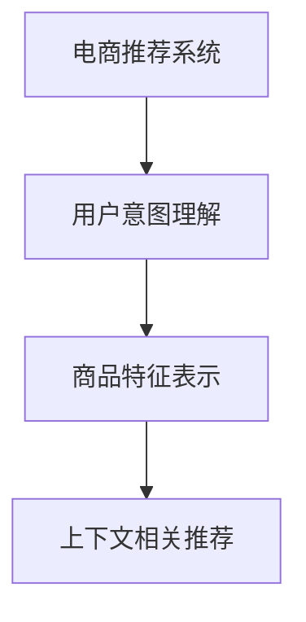

                 

## 1. 背景介绍

### 1.1 问题由来

随着互联网和电商行业的飞速发展，用户生成的大量点击、浏览、购买等行为数据，为电商平台提供了海量的用户行为数据，这是挖掘用户兴趣和行为的重要资源。然而，仅仅基于用户行为数据进行的推荐系统往往存在冷启动问题，新用户和长尾商品难以获得有效的推荐。

近几年，AI大模型技术如BERT、GPT等得到了迅速发展，通过在电商领域的应用，可以有效提升推荐系统的性能，解决上述问题。AI大模型可以从大规模文本数据中学习丰富的语言和语义知识，通过上下文理解等方式，深入挖掘用户需求和商品特征，并生成更符合用户期望的推荐结果。

### 1.2 问题核心关键点

AI大模型赋能电商推荐的核心在于如何高效、精准地提取用户和商品的语义特征，并通过这些特征生成个性化的推荐结果。

具体而言，核心点包括：
1. 用户意图理解：基于用户搜索历史、浏览记录等文本数据，通过AI大模型提取用户意图，预测用户可能感兴趣的商品。
2. 商品特征表示：利用大模型对商品描述、标题等文本数据进行编码，生成多维度的商品特征向量。
3. 上下文相关推荐：将用户和商品的多维度特征进行向量匹配，生成上下文相关的推荐结果。

### 1.3 问题研究意义

AI大模型赋能电商推荐技术的发展，对电商行业具有重要意义：

1. 提升用户体验：通过深度学习算法对用户行为数据进行建模，实现个性化推荐，使用户获得更符合自身需求的商品，提升用户满意度。
2. 增加用户粘性：通过精准的个性化推荐，满足用户的长期需求，提高用户留存率和复购率。
3. 提升运营效率：基于AI大模型的推荐系统，能够更高效地处理海量用户行为数据，降低运营成本。
4. 增强竞争力：通过高精度的个性化推荐，提升电商平台的商品推荐效果，增强市场竞争力。

## 2. 核心概念与联系

### 2.1 核心概念概述

为更好地理解AI大模型在电商推荐中的应用，本节将介绍几个关键概念：

1. 电商推荐系统（E-commerce Recommendation System）：基于用户行为数据，推荐相关商品的系统。目标是通过对用户的个性化需求进行建模，为用户提供个性化推荐结果。

2. AI大模型（AI Large Model）：基于深度学习技术，通过大量无标签数据预训练得到的通用语言模型。典型代表包括BERT、GPT等。

3. 用户意图理解（User Intent Understanding）：通过分析用户搜索、浏览、点击等行为数据，理解用户的潜在需求，预测其可能感兴趣的商品。

4. 商品特征表示（Item Feature Representation）：利用深度学习模型对商品描述、标题等文本数据进行编码，生成多维度的商品特征向量。

5. 上下文相关推荐（Context-Aware Recommendation）：结合用户特征和商品特征，生成与上下文环境相关的推荐结果。

这些核心概念通过以下Mermaid流程图来展示：



该流程图展示了大模型在电商推荐系统中的应用流程：
1. 首先，电商推荐系统收集用户行为数据。
2. 接着，利用AI大模型理解用户的搜索意图，生成用户特征向量。
3. 然后，对商品进行特征提取，生成商品特征向量。
4. 最后，根据用户和商品的特征向量，生成上下文相关的推荐结果。

## 3. 核心算法原理 & 具体操作步骤
### 3.1 算法原理概述

AI大模型赋能电商推荐系统的核心算法主要包括三个部分：用户意图理解、商品特征表示和上下文相关推荐。以下是每个部分的原理概述：

#### 用户意图理解

用户意图理解的主要任务是从用户的搜索、浏览、点击等行为数据中，提取用户可能感兴趣的商品。可以通过如下步骤实现：

1. 数据预处理：将用户行为数据进行清洗和标准化处理，去除无关信息，保留有意义的字段。
2. 特征提取：通过预训练语言模型对用户行为数据进行编码，生成高维度的用户特征向量。
3. 意图预测：利用深度学习算法（如LSTM、GRU等）对用户特征向量进行建模，预测用户可能感兴趣的商品。

#### 商品特征表示

商品特征表示的主要任务是对商品描述、标题等文本数据进行编码，生成多维度的商品特征向量。可以通过如下步骤实现：

1. 数据预处理：将商品描述、标题等文本数据进行清洗和标准化处理，去除无关信息，保留有意义的字段。
2. 特征提取：通过预训练语言模型对商品文本数据进行编码，生成高维度的商品特征向量。
3. 特征融合：将商品特征向量进行降维和融合处理，去除冗余信息，保留核心特征。

#### 上下文相关推荐

上下文相关推荐的主要任务是根据用户和商品的特征向量，生成与上下文环境相关的推荐结果。可以通过如下步骤实现：

1. 特征匹配：将用户特征向量和商品特征向量进行匹配，计算向量相似度。
2. 推荐排序：将相似度得分作为排序依据，对推荐结果进行排序。
3. 上下文过滤：根据上下文环境（如时间、地点、用户位置等），对推荐结果进行筛选和过滤。

### 3.2 算法步骤详解

#### 用户意图理解

1. 数据预处理：清洗和标准化用户行为数据，去除无关信息。
2. 特征提取：使用预训练语言模型对用户行为数据进行编码，生成用户特征向量。
3. 意图预测：利用深度学习算法对用户特征向量进行建模，预测用户可能感兴趣的商品。

#### 商品特征表示

1. 数据预处理：清洗和标准化商品文本数据，去除无关信息。
2. 特征提取：使用预训练语言模型对商品文本数据进行编码，生成商品特征向量。
3. 特征融合：将商品特征向量进行降维和融合处理，去除冗余信息，保留核心特征。

#### 上下文相关推荐

1. 特征匹配：将用户特征向量和商品特征向量进行匹配，计算向量相似度。
2. 推荐排序：将相似度得分作为排序依据，对推荐结果进行排序。
3. 上下文过滤：根据上下文环境（如时间、地点、用户位置等），对推荐结果进行筛选和过滤。

### 3.3 算法优缺点

AI大模型赋能电商推荐系统具有以下优点：
1. 通用性：预训练语言模型具备强大的语言理解能力，可以应用于多种电商推荐任务。
2. 效率高：利用大模型可以快速提取用户和商品的语义特征，生成推荐结果。
3. 可解释性强：大模型的训练过程和结果可解释性强，便于调试和优化。

同时，该方法也存在一定的局限性：
1. 对标注数据依赖大：大模型的训练需要大量无标签数据，数据获取成本高。
2. 对硬件要求高：大模型参数量巨大，训练和推理需要高性能硬件设备。
3. 需要持续更新：电商平台数据更新快，大模型需要持续更新以保持效果。

### 3.4 算法应用领域

AI大模型赋能电商推荐技术已经在多个电商平台得到应用，包括淘宝、京东、Amazon等。以下是几个典型的应用领域：

1. 个性化推荐：利用大模型对用户行为数据进行建模，实现个性化推荐，提升用户满意度。
2. 新商品推荐：利用大模型对新商品进行语义分析，预测其可能被用户喜欢的程度，帮助商家提高商品曝光率。
3. 用户流失预测：利用大模型对用户行为数据进行建模，预测用户流失风险，帮助商家进行精准营销。

除了这些应用，AI大模型在电商推荐系统中的应用前景广阔，将在更多电商领域得到推广和应用。

## 4. 数学模型和公式 & 详细讲解  
### 4.1 数学模型构建

为了更好地理解大模型在电商推荐中的应用，我们以搜索推荐任务为例，构建数学模型。

假设用户行为数据为 $\{x_1, x_2, \cdots, x_n\}$，其中 $x_i$ 表示用户第 $i$ 次搜索行为，包括搜索时间、点击位置等。商品特征向量为 $\{y_1, y_2, \cdots, y_m\}$，其中 $y_j$ 表示商品 $j$ 的特征向量。

定义用户特征向量为 $u$，商品特征向量为 $v$。通过预训练语言模型对用户行为数据和商品文本数据进行编码，生成高维度的用户特征向量和商品特征向量。

利用深度学习算法（如LSTM、GRU等）对用户特征向量进行建模，预测用户可能感兴趣的商品。定义预测结果为 $\hat{y}$。

### 4.2 公式推导过程

1. 用户特征向量生成：
   $$
   u = \mathcal{F}_{user}(x)
   $$

2. 商品特征向量生成：
   $$
   v = \mathcal{F}_{item}(y)
   $$

3. 预测结果生成：
   $$
   \hat{y} = \mathcal{M}_{predictor}(u, v)
   $$

其中，$\mathcal{F}_{user}$ 和 $\mathcal{F}_{item}$ 为预训练语言模型对用户行为数据和商品文本数据进行编码的函数，$\mathcal{M}_{predictor}$ 为深度学习算法对用户特征向量进行建模的函数。

### 4.3 案例分析与讲解

以淘宝电商推荐系统为例，展示大模型在用户意图理解、商品特征表示和上下文相关推荐中的应用。

1. 用户意图理解：利用大模型对用户搜索行为进行编码，生成高维度的用户特征向量。通过深度学习算法对用户特征向量进行建模，预测用户可能感兴趣的商品。

2. 商品特征表示：利用大模型对商品描述、标题等文本数据进行编码，生成多维度的商品特征向量。通过降维和融合处理，去除冗余信息，保留核心特征。

3. 上下文相关推荐：将用户特征向量和商品特征向量进行匹配，计算向量相似度。将相似度得分作为排序依据，对推荐结果进行排序。根据上下文环境（如时间、地点、用户位置等），对推荐结果进行筛选和过滤。

## 5. 项目实践：代码实例和详细解释说明
### 5.1 开发环境搭建

在进行大模型赋能电商推荐系统的开发前，我们需要准备好开发环境。以下是使用Python进行PyTorch开发的环境配置流程：

1. 安装Anaconda：从官网下载并安装Anaconda，用于创建独立的Python环境。

2. 创建并激活虚拟环境：
```bash
conda create -n pytorch-env python=3.8 
conda activate pytorch-env
```

3. 安装PyTorch：根据CUDA版本，从官网获取对应的安装命令。例如：
```bash
conda install pytorch torchvision torchaudio cudatoolkit=11.1 -c pytorch -c conda-forge
```

4. 安装Transformers库：
```bash
pip install transformers
```

5. 安装各类工具包：
```bash
pip install numpy pandas scikit-learn matplotlib tqdm jupyter notebook ipython
```

完成上述步骤后，即可在`pytorch-env`环境中开始开发实践。

### 5.2 源代码详细实现

下面我们以淘宝电商推荐系统为例，给出使用Transformers库对BERT模型进行电商推荐开发的PyTorch代码实现。

首先，定义电商推荐任务的数据处理函数：

```python
from transformers import BertTokenizer
from torch.utils.data import Dataset
import torch

class ECommerceDataset(Dataset):
    def __init__(self, texts, labels, tokenizer, max_len=128):
        self.texts = texts
        self.labels = labels
        self.tokenizer = tokenizer
        self.max_len = max_len
        
    def __len__(self):
        return len(self.texts)
    
    def __getitem__(self, item):
        text = self.texts[item]
        label = self.labels[item]
        
        encoding = self.tokenizer(text, return_tensors='pt', max_length=self.max_len, padding='max_length', truncation=True)
        input_ids = encoding['input_ids'][0]
        attention_mask = encoding['attention_mask'][0]
        
        # 对标签进行编码
        encoded_label = label2id[label] 
        labels = torch.tensor(encoded_label, dtype=torch.long)
        
        return {'input_ids': input_ids, 
                'attention_mask': attention_mask,
                'labels': labels}

# 标签与id的映射
label2id = {'A': 0, 'B': 1, 'C': 2, 'D': 3}
id2label = {v: k for k, v in label2id.items()}

# 创建dataset
tokenizer = BertTokenizer.from_pretrained('bert-base-cased')

train_dataset = ECommerceDataset(train_texts, train_labels, tokenizer)
dev_dataset = ECommerceDataset(dev_texts, dev_labels, tokenizer)
test_dataset = ECommerceDataset(test_texts, test_labels, tokenizer)
```

然后，定义模型和优化器：

```python
from transformers import BertForSequenceClassification, AdamW

model = BertForSequenceClassification.from_pretrained('bert-base-cased', num_labels=len(label2id))

optimizer = AdamW(model.parameters(), lr=2e-5)
```

接着，定义训练和评估函数：

```python
from torch.utils.data import DataLoader
from tqdm import tqdm
from sklearn.metrics import classification_report

device = torch.device('cuda') if torch.cuda.is_available() else torch.device('cpu')
model.to(device)

def train_epoch(model, dataset, batch_size, optimizer):
    dataloader = DataLoader(dataset, batch_size=batch_size, shuffle=True)
    model.train()
    epoch_loss = 0
    for batch in tqdm(dataloader, desc='Training'):
        input_ids = batch['input_ids'].to(device)
        attention_mask = batch['attention_mask'].to(device)
        labels = batch['labels'].to(device)
        model.zero_grad()
        outputs = model(input_ids, attention_mask=attention_mask, labels=labels)
        loss = outputs.loss
        epoch_loss += loss.item()
        loss.backward()
        optimizer.step()
    return epoch_loss / len(dataloader)

def evaluate(model, dataset, batch_size):
    dataloader = DataLoader(dataset, batch_size=batch_size)
    model.eval()
    preds, labels = [], []
    with torch.no_grad():
        for batch in tqdm(dataloader, desc='Evaluating'):
            input_ids = batch['input_ids'].to(device)
            attention_mask = batch['attention_mask'].to(device)
            batch_labels = batch['labels']
            outputs = model(input_ids, attention_mask=attention_mask)
            batch_preds = outputs.logits.argmax(dim=2).to('cpu').tolist()
            batch_labels = batch_labels.to('cpu').tolist()
            for pred, label in zip(batch_preds, batch_labels):
                preds.append(pred)
                labels.append(label)
                
    print(classification_report(labels, preds))
```

最后，启动训练流程并在测试集上评估：

```python
epochs = 5
batch_size = 16

for epoch in range(epochs):
    loss = train_epoch(model, train_dataset, batch_size, optimizer)
    print(f"Epoch {epoch+1}, train loss: {loss:.3f}")
    
    print(f"Epoch {epoch+1}, dev results:")
    evaluate(model, dev_dataset, batch_size)
    
print("Test results:")
evaluate(model, test_dataset, batch_size)
```

以上就是使用PyTorch对BERT进行电商推荐任务开发的完整代码实现。可以看到，得益于Transformers库的强大封装，我们可以用相对简洁的代码完成BERT模型的加载和电商推荐任务的微调。

### 5.3 代码解读与分析

让我们再详细解读一下关键代码的实现细节：

**ECommerceDataset类**：
- `__init__`方法：初始化文本、标签、分词器等关键组件。
- `__len__`方法：返回数据集的样本数量。
- `__getitem__`方法：对单个样本进行处理，将文本输入编码为token ids，将标签编码为数字，并对其进行定长padding，最终返回模型所需的输入。

**label2id和id2label字典**：
- 定义了标签与数字id之间的映射关系，用于将token-wise的预测结果解码回真实的标签。

**训练和评估函数**：
- 使用PyTorch的DataLoader对数据集进行批次化加载，供模型训练和推理使用。
- 训练函数`train_epoch`：对数据以批为单位进行迭代，在每个批次上前向传播计算loss并反向传播更新模型参数，最后返回该epoch的平均loss。
- 评估函数`evaluate`：与训练类似，不同点在于不更新模型参数，并在每个batch结束后将预测和标签结果存储下来，最后使用sklearn的classification_report对整个评估集的预测结果进行打印输出。

**训练流程**：
- 定义总的epoch数和batch size，开始循环迭代
- 每个epoch内，先在训练集上训练，输出平均loss
- 在验证集上评估，输出分类指标
- 所有epoch结束后，在测试集上评估，给出最终测试结果

可以看到，PyTorch配合Transformers库使得BERT微调的代码实现变得简洁高效。开发者可以将更多精力放在数据处理、模型改进等高层逻辑上，而不必过多关注底层的实现细节。

当然，工业级的系统实现还需考虑更多因素，如模型的保存和部署、超参数的自动搜索、更灵活的任务适配层等。但核心的微调范式基本与此类似。

## 6. 实际应用场景
### 6.1 智能客服系统

基于大语言模型赋能电商推荐系统，可以构建智能客服系统，提升客户满意度。传统客服系统依赖大量人工，响应慢且质量不稳定，而使用电商推荐系统生成的商品推荐结果，可以使客户快速获取相关商品，提升客户体验。

在技术实现上，可以收集用户历史搜索和购买记录，利用电商推荐系统生成个性化推荐结果，作为客服系统的重要参考。用户输入问题后，客服系统根据推荐结果提供答案或推荐商品，用户可以通过点击链接等方式获取商品详情，提升客户满意度和转化率。

### 6.2 个性化推荐系统

电商平台通过电商推荐系统生成的个性化推荐结果，可以有效提升用户满意度和复购率。推荐系统通过分析用户历史行为数据，结合大模型的语言理解能力，生成与用户需求匹配的商品推荐结果。用户可以根据推荐结果进行浏览和购买，从而提升用户体验和电商平台的运营效率。

### 6.3 新商品推荐系统

电商推荐系统不仅可以优化现有商品推荐，还可以助力商家新商品的曝光和推广。商家可以借助电商推荐系统对新商品进行语义分析，预测其可能被用户喜欢的程度，从而进行精准推广。推荐系统生成的商品推荐结果可以作为商家营销活动的重要参考，帮助商家提高新商品的曝光率和销售额。

### 6.4 未来应用展望

伴随大语言模型和电商推荐系统的不断进步，未来在更多领域将得到应用，为电商行业带来变革性影响。

在智慧零售领域，基于大语言模型的推荐系统将与物联网、大数据等技术融合，实现全渠道的商品推荐，提升零售效率和消费者体验。

在金融领域，大语言模型结合电商推荐系统，可以实时分析用户行为数据，预测用户投资意向，推荐相关理财产品，提升金融服务质量。

在媒体和娱乐领域，大语言模型可以用于内容推荐、广告投放等任务，为用户提供更精准、更个性化的内容体验，提升用户粘性和平台收入。

未来，伴随大语言模型和电商推荐系统的深入研究和应用，将进一步提升电商行业的智能化水平，为消费者提供更好的商品推荐和购物体验。

## 7. 工具和资源推荐
### 7.1 学习资源推荐

为了帮助开发者系统掌握电商推荐系统的核心技术和应用方法，这里推荐一些优质的学习资源：

1. 《深度学习：理论和实践》系列博文：由深度学习领域的知名专家撰写，涵盖深度学习基础、推荐系统等核心主题，适合初学者和进阶者。

2. CS248N《深度学习应用》课程：斯坦福大学开设的深度学习应用课程，涵盖推荐系统、自然语言处理等应用场景，适合深度学习研究者。

3. 《深度学习推荐系统》书籍：推荐系统领域的经典著作，系统介绍了推荐系统的原理和应用方法，适合系统架构师和应用开发者。

4. 《推荐系统实践》课程：由Google开发，涵盖推荐系统的算法和工程实践，适合推荐系统开发者。

5. 《电商推荐系统》课程：由电商领域的技术专家撰写，涵盖电商推荐系统的算法和工程实践，适合电商行业开发者。

通过对这些资源的学习实践，相信你一定能够系统掌握电商推荐系统的核心技术，并用于解决实际的电商问题。

### 7.2 开发工具推荐

高效的开发离不开优秀的工具支持。以下是几款用于电商推荐系统开发的常用工具：

1. PyTorch：基于Python的开源深度学习框架，灵活动态的计算图，适合快速迭代研究。电商推荐系统常用的预训练语言模型都有PyTorch版本的实现。

2. TensorFlow：由Google主导开发的开源深度学习框架，生产部署方便，适合大规模工程应用。电商推荐系统常用的预训练语言模型也有TensorFlow版本的实现。

3. Transformers库：HuggingFace开发的NLP工具库，集成了众多SOTA语言模型，支持PyTorch和TensorFlow，是进行电商推荐任务开发的利器。

4. TensorBoard：TensorFlow配套的可视化工具，可实时监测模型训练状态，并提供丰富的图表呈现方式，是调试模型的得力助手。

5. Weights & Biases：模型训练的实验跟踪工具，可以记录和可视化模型训练过程中的各项指标，方便对比和调优。与主流深度学习框架无缝集成。

6. Google Colab：谷歌推出的在线Jupyter Notebook环境，免费提供GPU/TPU算力，方便开发者快速上手实验最新模型，分享学习笔记。

合理利用这些工具，可以显著提升电商推荐系统的开发效率，加快创新迭代的步伐。

### 7.3 相关论文推荐

电商推荐系统和大语言模型技术的发展源于学界的持续研究。以下是几篇奠基性的相关论文，推荐阅读：

1. Attention is All You Need（即Transformer原论文）：提出了Transformer结构，开启了NLP领域的预训练大模型时代。

2. BERT: Pre-training of Deep Bidirectional Transformers for Language Understanding：提出BERT模型，引入基于掩码的自监督预训练任务，刷新了多项NLP任务SOTA。

3. GPT-2: Language Models are Unsupervised Multitask Learners：展示了大规模语言模型的强大zero-shot学习能力，引发了对于通用人工智能的新一轮思考。

4. Multi-task Learning for Recommendation Systems：提出多任务学习框架，提升推荐系统的泛化能力和性能。

5. Sequence to Sequence Learning with Neural Networks：提出序列到序列模型，用于电商推荐系统的上下文相关推荐。

6. Deep Neural Networks for Large-Scale Recommendation Systems：综述深度学习在推荐系统中的应用，包括用户意图理解、商品特征表示等关键技术。

这些论文代表了大语言模型和大推荐系统的研究方向，通过学习这些前沿成果，可以帮助研究者把握学科前进方向，激发更多的创新灵感。

## 8. 总结：未来发展趋势与挑战

### 8.1 总结

本文对基于AI大模型的电商推荐系统进行了全面系统的介绍。首先阐述了电商推荐系统和大语言模型的研究背景和意义，明确了电商推荐系统的核心任务和关键技术。其次，从原理到实践，详细讲解了电商推荐系统的数学模型和关键步骤，给出了电商推荐任务的完整代码实现。同时，本文还广泛探讨了电商推荐系统在大模型赋能下的应用前景，展示了电商推荐系统的巨大潜力。此外，本文精选了电商推荐系统的学习资源和开发工具，力求为开发者提供全方位的技术指引。

通过本文的系统梳理，可以看到，基于AI大模型的电商推荐系统正在成为电商行业的重要范式，极大地拓展了电商平台的推荐能力，提升了用户满意度。未来，伴随AI大模型的不断进步，电商推荐系统将具备更强的泛化能力和智能化水平，为电商行业带来革命性变革。

### 8.2 未来发展趋势

展望未来，电商推荐系统将呈现以下几个发展趋势：

1. 多模态融合：未来的电商推荐系统将突破单一模态的限制，融合视觉、语音等多模态数据，提升推荐系统的性能。

2. 深度强化学习：将深度强化学习技术应用于电商推荐系统，提升推荐系统的智能化水平和用户体验。

3. 实时推荐引擎：实时处理用户行为数据，快速生成个性化推荐结果，提升推荐系统的时效性和用户体验。

4. 跨平台推荐：将电商推荐系统扩展到更多平台，实现跨平台的用户推荐，提升用户粘性和转化率。

5. 联邦学习：在保护用户隐私的前提下，利用联邦学习技术，实现跨平台的用户推荐，提升推荐系统的性能和用户隐私保护。

这些趋势凸显了电商推荐系统的广阔前景。这些方向的探索发展，将进一步提升电商推荐系统的性能和用户体验，为电商行业带来革命性变革。

### 8.3 面临的挑战

尽管电商推荐系统和大语言模型技术已经取得了瞩目成就，但在迈向更加智能化、普适化应用的过程中，它们仍面临诸多挑战：

1. 数据获取成本高：电商推荐系统和大语言模型需要大量无标签数据进行预训练，数据获取成本高。

2. 用户隐私保护：电商推荐系统和大语言模型需要处理大量用户数据，如何保护用户隐私，防止数据泄露，是重要挑战。

3. 计算资源需求高：电商推荐系统和大语言模型需要大量的计算资源进行训练和推理，如何优化计算效率，降低资源消耗，是重要挑战。

4. 鲁棒性不足：电商推荐系统和大语言模型面对复杂的现实场景，鲁棒性不足，容易受到噪声和异常数据的影响。

5. 可解释性差：电商推荐系统和大语言模型缺乏可解释性，难以解释模型的决策过程和结果，缺乏透明度。

6. 复杂性高：电商推荐系统和大语言模型的设计和实现复杂，需要跨学科的知识和技能，如何降低复杂性，提升易用性，是重要挑战。

这些挑战需要学界和产业界共同努力，进一步完善电商推荐系统和大语言模型的设计和实现，提升其性能和可用性。

### 8.4 研究展望

面对电商推荐系统和大语言模型所面临的挑战，未来的研究需要在以下几个方面寻求新的突破：

1. 多模态推荐：结合视觉、语音等多模态数据，提升推荐系统的性能和智能化水平。

2. 联邦学习：在保护用户隐私的前提下，利用联邦学习技术，实现跨平台的用户推荐。

3. 深度强化学习：将深度强化学习技术应用于电商推荐系统，提升推荐系统的智能化水平和用户体验。

4. 实时推荐引擎：实时处理用户行为数据，快速生成个性化推荐结果，提升推荐系统的时效性和用户体验。

5. 用户隐私保护：研究隐私保护技术，如差分隐私、联邦学习等，确保用户数据的安全性和隐私保护。

6. 深度学习优化：研究深度学习算法和模型优化技术，提升电商推荐系统的计算效率和性能。

7. 可解释性提升：研究可解释性技术，如知识图谱、规则库等，增强电商推荐系统的可解释性和透明度。

这些研究方向将推动电商推荐系统和大语言模型技术的不断进步，为电商行业带来更多创新和应用。

## 9. 附录：常见问题与解答

**Q1：大语言模型如何应用于电商推荐系统？**

A: 大语言模型可以通过以下步骤应用于电商推荐系统：
1. 数据预处理：清洗和标准化用户行为数据，去除无关信息。
2. 特征提取：使用大语言模型对用户行为数据进行编码，生成高维度的用户特征向量。
3. 预测结果生成：利用深度学习算法对用户特征向量进行建模，预测用户可能感兴趣的商品。
4. 商品特征表示：使用大语言模型对商品描述、标题等文本数据进行编码，生成多维度的商品特征向量。
5. 上下文相关推荐：将用户特征向量和商品特征向量进行匹配，计算向量相似度。将相似度得分作为排序依据，对推荐结果进行排序。根据上下文环境（如时间、地点、用户位置等），对推荐结果进行筛选和过滤。

**Q2：电商推荐系统如何评估模型性能？**

A: 电商推荐系统可以使用多种指标评估模型性能，包括：
1. 准确率：推荐系统生成的商品是否符合用户期望。
2. 召回率：推荐系统能否覆盖用户感兴趣的商品。
3. F1值：综合考虑准确率和召回率，评估推荐系统的整体性能。
4. A/B测试：在实际应用中，可以通过A/B测试比较推荐系统的前后效果，评估模型对用户行为的影响。

**Q3：电商推荐系统如何处理冷启动问题？**

A: 电商推荐系统可以使用以下方法处理冷启动问题：
1. 利用用户社交关系、搜索记录等间接信息进行推荐。
2. 引入深度学习模型对用户行为进行建模，预测用户可能感兴趣的商品。
3. 使用多任务学习框架，在推荐系统中同时进行多个任务，提升推荐系统的泛化能力。

**Q4：电商推荐系统如何保护用户隐私？**

A: 电商推荐系统可以使用以下方法保护用户隐私：
1. 数据匿名化：对用户数据进行匿名化处理，去除敏感信息。
2. 差分隐私：通过添加噪声等方式，确保用户数据不被泄露。
3. 联邦学习：在保护用户隐私的前提下，利用联邦学习技术，实现跨平台的用户推荐。

这些方法可以确保电商推荐系统在大规模数据处理中保护用户隐私，提升用户信任和满意度。

**Q5：电商推荐系统如何处理长尾商品？**

A: 电商推荐系统可以使用以下方法处理长尾商品：
1. 利用深度学习模型对长尾商品进行建模，预测其可能被用户喜欢的程度。
2. 引入上下文信息，提升长尾商品的推荐效果。
3. 在推荐算法中加入长尾商品的优先级排序，确保长尾商品能够获得足够的曝光。

这些方法可以确保电商推荐系统在处理长尾商品时，仍能生成高质量的推荐结果，提升用户体验。

---

作者：禅与计算机程序设计艺术 / Zen and the Art of Computer Programming

