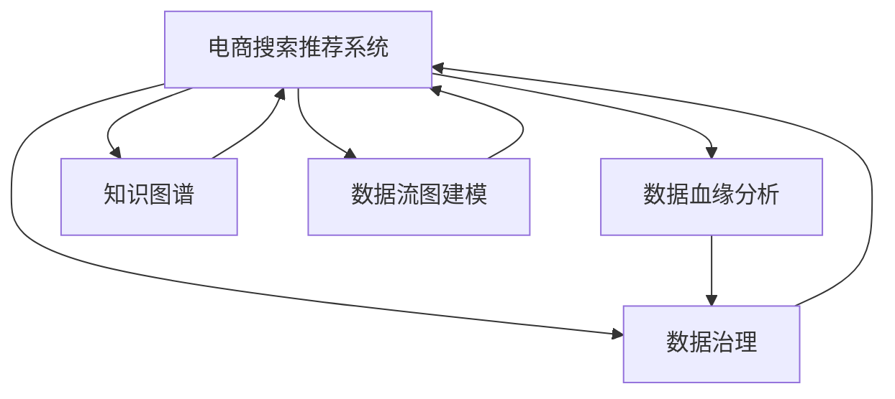

                 

# AI大模型重构电商搜索推荐的数据血缘分析平台搭建

> 关键词：电商搜索推荐, 数据血缘分析, 人工智能大模型, 数据治理, 推荐系统优化, 知识图谱构建, 数据流图建模

## 1. 背景介绍

### 1.1 问题由来

近年来，人工智能(AI)和大数据技术在电商领域的应用越来越广泛。电商搜索推荐系统成为提升用户购物体验、提高转化率的关键环节。然而，电商平台的搜索推荐算法通常依赖于大量结构化数据，如用户行为、商品属性、标签等。这些数据的管理和分析成为电商企业的重要挑战。

传统的搜索推荐系统主要基于规则和统计方法，存在可扩展性差、模型复杂度高、业务适应性不足等问题。随着深度学习技术的进步，越来越多的电商企业开始采用基于AI的推荐系统，利用大模型和深度学习算法，如神经网络、协同过滤、深度学习等，提升推荐效果和个性化服务。

然而，传统的推荐算法和AI大模型仍然面临数据质量和数据治理问题。数据质量差、数据孤岛、数据血缘不清，不仅影响推荐效果，还可能导致严重的误导性决策，损害用户信任。因此，构建数据血缘分析平台，对电商搜索推荐系统的数据进行治理和优化，成为电商企业的迫切需求。

### 1.2 问题核心关键点

电商搜索推荐系统的数据血缘分析，旨在建立数据从产生到使用的全链路追溯机制。通过数据血缘分析平台，电商企业可以了解每个数据源、数据处理环节、模型使用的信息，实现数据质量监控、数据治理和模型优化，从而提高推荐系统的准确性和可信度。

核心关键点包括：
1. 数据血缘溯源：对数据源进行追溯，确定数据的来源、流转路径和使用情况。
2. 数据质量监控：建立数据质量评估标准，实时监控数据流过程中的异常和偏差。
3. 数据治理优化：通过数据清洗、去重、标准化等手段，提升数据质量和可用性。
4. 模型优化调整：基于数据血缘分析结果，动态调整推荐模型参数，提升模型效果。

## 2. 核心概念与联系

### 2.1 核心概念概述

电商搜索推荐系统的数据血缘分析平台涉及多个核心概念，主要包括：

- 数据血缘分析（Data Lineage Analysis）：追踪数据从产生到使用的全链路，了解数据的来源、处理环节和使用情况。
- 数据治理（Data Governance）：建立数据质量评估和监控机制，确保数据的准确性和一致性。
- 数据清洗与标准化（Data Cleaning and Standardization）：通过清洗和标准化处理，提升数据质量。
- 知识图谱（Knowledge Graph）：构建商品、用户、行为等实体间的关系图谱，辅助推荐算法决策。
- 数据流图建模（Data Flow Modeling）：对数据流过程进行建模，了解数据流转和处理细节。

这些概念通过以下Mermaid流程图相互联系，形成一个完整的电商搜索推荐系统数据治理框架：



这个流程图展示了数据治理的不同环节，以及它们与电商搜索推荐系统的联系：

1. 数据血缘分析：追溯数据来源和使用情况，支持数据治理和监控。
2. 数据治理：监控数据质量，提升数据可用性。
3. 知识图谱：构建商品和用户间的知识图谱，辅助推荐决策。
4. 数据流图建模：了解数据流转过程，优化数据处理环节。

这些环节相互配合，形成数据治理闭环，从而提升推荐系统的性能和可靠性。

## 3. 核心算法原理 & 具体操作步骤
### 3.1 算法原理概述

电商搜索推荐系统的数据血缘分析平台主要利用知识图谱、数据流图建模等技术，构建数据的血缘链路，实现数据的追溯和治理。

核心算法原理包括：
- 知识图谱构建：通过收集和整合商品、用户、行为等数据，构建商品、用户、行为间的知识图谱，辅助推荐算法决策。
- 数据流图建模：对数据流过程进行建模，了解数据流转和处理细节。
- 数据血缘溯源：追踪数据从产生到使用的全链路，实现数据的追溯和治理。
- 数据质量监控：建立数据质量评估和监控机制，确保数据的准确性和一致性。

通过这些算法和技术手段，平台可以实现对电商搜索推荐系统的全面数据治理和优化，提升推荐效果和用户体验。

### 3.2 算法步骤详解

数据血缘分析平台搭建的具体操作步骤如下：

**Step 1: 数据收集与整合**

- 收集电商平台的各类数据，包括商品信息、用户行为、交易记录等。
- 整合数据源，消除数据孤岛，构建统一的数据视图。

**Step 2: 构建知识图谱**

- 提取商品、用户、行为等数据实体，建立实体之间的关系图谱。
- 使用深度学习模型，如TransE、GCN等，对实体和关系进行表示学习。

**Step 3: 数据流图建模**

- 分析数据流转路径，识别数据处理环节和关键节点。
- 建立数据流图，描述数据流转过程，识别数据依赖和流向。

**Step 4: 数据血缘溯源**

- 对数据从产生到使用的全链路进行追溯，确定数据来源和使用情况。
- 建立数据血缘图，展示数据流转的节点、边和关系。

**Step 5: 数据质量监控**

- 定义数据质量评估标准，如数据准确性、完整性、一致性等。
- 实时监控数据流过程中的异常和偏差，及时预警和修复。

**Step 6: 数据治理与优化**

- 根据数据血缘分析结果，识别数据治理的瓶颈和优化点。
- 对数据进行清洗、去重、标准化等处理，提升数据质量。

**Step 7: 模型优化调整**

- 基于数据血缘分析结果，动态调整推荐模型参数。
- 优化模型性能，提升推荐效果和用户体验。

**Step 8: 平台部署与运维**

- 将数据血缘分析平台部署到电商系统中，实现数据治理和监控。
- 持续收集和分析用户反馈，优化平台功能和算法。

### 3.3 算法优缺点

数据血缘分析平台具有以下优点：
1. 数据血缘追溯：通过血缘分析，电商企业可以全面了解数据的来源和使用情况，实现数据的追溯和治理。
2. 数据质量监控：建立数据质量评估标准，实时监控数据流过程中的异常和偏差，确保数据质量。
3. 数据治理优化：通过数据清洗、去重、标准化等手段，提升数据质量和可用性。
4. 模型优化调整：基于数据血缘分析结果，动态调整推荐模型参数，提升模型效果。

同时，该平台也存在一定的局限性：
1. 实现复杂度：数据血缘分析涉及多源数据整合、知识图谱构建、数据流图建模等复杂过程，实现难度较大。
2. 数据隐私问题：在数据血缘分析和治理过程中，可能涉及用户隐私数据，需要严格的隐私保护措施。
3. 技术门槛高：需要具备较高的技术能力和专业知识，才能有效构建和维护数据血缘分析平台。

尽管存在这些局限性，但数据血缘分析平台在大数据环境下，具有显著的优势，能够有效提升电商搜索推荐系统的性能和可靠性。

### 3.4 算法应用领域

数据血缘分析平台主要应用于以下领域：

- 电商搜索推荐：构建商品、用户、行为等实体的知识图谱，辅助推荐决策，提升推荐效果。
- 数据治理与质量监控：实时监控数据质量，优化数据治理流程，确保数据的一致性和可靠性。
- 数据清洗与标准化：通过清洗和标准化处理，提升数据质量和可用性。
- 数据流图建模：了解数据流转过程，优化数据处理环节，提升数据流转效率。

这些领域的应用，使得数据血缘分析平台在电商搜索推荐系统中发挥了重要作用，提升了推荐系统的性能和用户满意度。

## 4. 数学模型和公式 & 详细讲解 & 举例说明

### 4.1 数学模型构建

数据血缘分析平台的核心数学模型包括知识图谱、数据流图建模和数据血缘溯源等。

**知识图谱模型**

知识图谱模型通常使用图神经网络（Graph Neural Network, GNN）表示实体和关系。以TransE模型为例，其基本公式为：

$$
h \approx r \cdot t
$$

其中，$h$为实体，$r$为关系，$t$为目标实体。TransE通过最大化关系$h \approx r \cdot t$的概率，学习实体和关系的表示。

**数据流图建模**

数据流图建模通常使用有向无环图（Directed Acyclic Graph, DAG）表示数据流过程。一个典型的DAG节点包括数据源、数据处理、数据输出等环节，可以表示为：

$$
\text{Node} = (\text{ID}, \text{Input}, \text{Process}, \text{Output}, \text{Edge})
$$

其中，$\text{ID}$为节点编号，$\text{Input}$为输入数据，$\text{Process}$为数据处理过程，$\text{Output}$为输出数据，$\text{Edge}$为数据流向。

**数据血缘溯源**

数据血缘溯源通常使用血缘图（Data Lineage Graph）表示数据流转路径。一个典型的血缘图节点包括数据源、数据流向、数据使用等环节，可以表示为：

$$
\text{Node} = (\text{ID}, \text{Source}, \text{Flow}, \text{Use}, \text{Edge})
$$

其中，$\text{ID}$为节点编号，$\text{Source}$为数据源，$\text{Flow}$为数据流向，$\text{Use}$为数据使用情况，$\text{Edge}$为数据边。

### 4.2 公式推导过程

**知识图谱模型的推导**

以TransE模型为例，其目标函数为：

$$
\max_{h,r,t} \log P(h \approx r \cdot t)
$$

其中，$P(h \approx r \cdot t)$表示实体对$r$和目标实体$t$的关系概率。TransE通过最大化这个概率，学习实体和关系的表示。

**数据流图建模的推导**

数据流图建模的推导较为简单，通常采用DAG表示数据流过程。通过对数据流过程的建模，可以识别数据处理环节和关键节点，从而优化数据流转过程。

**数据血缘溯源的推导**

数据血缘溯源的推导较为复杂，需要综合考虑数据的产生、流转和使用情况。一个典型的血缘图表示为：

$$
G = (V, E)
$$

其中，$V$为节点集合，$E$为边集合。通过对数据血缘图的构建和分析，可以全面追溯数据的来源和使用情况，实现数据的治理和优化。

### 4.3 案例分析与讲解

以一个电商平台的订单数据为例，展示数据血缘分析平台的应用。

**Step 1: 数据收集与整合**

电商平台的订单数据包括订单ID、用户ID、商品ID、下单时间等。通过整合这些数据，构建统一的数据视图。

**Step 2: 构建知识图谱**

对订单数据进行实体抽取，建立订单、用户、商品之间的关系图谱。例如，用户ID和商品ID之间的关系可以表示为：

```
UserID -> Purchase -> ProductID
```

**Step 3: 数据流图建模**

分析订单数据的流转过程，识别数据处理环节和关键节点。例如，订单数据的生成、存储、查询等环节可以表示为：

```
Order -> Storage -> Query -> UserBehavior
```

**Step 4: 数据血缘溯源**

对订单数据的产生、流转和使用情况进行追溯，确定数据来源和使用情况。例如，订单数据从用户下单到系统存储、查询等环节，可以表示为：

```
User -> Order -> Storage -> Query -> Behavior
```

**Step 5: 数据质量监控**

定义数据质量评估标准，如数据准确性、完整性、一致性等。实时监控订单数据流过程中的异常和偏差，及时预警和修复。

**Step 6: 数据治理与优化**

对订单数据进行清洗、去重、标准化等处理，提升数据质量和可用性。例如，删除重复订单数据、标准化商品ID等。

**Step 7: 模型优化调整**

基于订单数据的血缘分析结果，动态调整推荐模型参数。例如，根据订单数据的使用情况，调整推荐模型中的用户特征和商品特征权重。

通过上述步骤，数据血缘分析平台可以全面管理订单数据，实现数据的治理和优化，提升推荐系统的效果。

## 5. 项目实践：代码实例和详细解释说明
### 5.1 开发环境搭建

在进行数据血缘分析平台的开发前，需要准备好开发环境。以下是使用Python进行PyTorch开发的环境配置流程：

1. 安装Anaconda：从官网下载并安装Anaconda，用于创建独立的Python环境。

2. 创建并激活虚拟环境：
```bash
conda create -n pytorch-env python=3.8 
conda activate pytorch-env
```

3. 安装PyTorch：根据CUDA版本，从官网获取对应的安装命令。例如：
```bash
conda install pytorch torchvision torchaudio cudatoolkit=11.1 -c pytorch -c conda-forge
```

4. 安装TensorFlow：
```bash
pip install tensorflow
```

5. 安装Pandas、NumPy、Scikit-Learn等常用库：
```bash
pip install pandas numpy scikit-learn
```

完成上述步骤后，即可在`pytorch-env`环境中开始数据血缘分析平台的开发。

### 5.2 源代码详细实现

下面以一个简单的订单数据血缘分析平台为例，给出使用PyTorch进行开发的代码实现。

首先，定义数据处理函数：

```python
import pandas as pd
from transformers import TransEModel

def load_data(file_path):
    return pd.read_csv(file_path)

def preprocess_data(data):
    # 数据清洗和标准化
    data = data.drop_duplicates()
    data = data.rename(columns={'user_id': 'user', 'product_id': 'product', 'order_id': 'order'})
    return data

def build_knowledge_graph(data):
    # 构建知识图谱
    graph = {}
    for i in range(len(data)):
        user = data.iloc[i]['user']
        product = data.iloc[i]['product']
        order = data.iloc[i]['order']
        if user in graph:
            graph[user].append(product)
        else:
            graph[user] = [product]
        if product in graph:
            graph[product].append(order)
        else:
            graph[product] = [order]
    return graph

def build_data_flow_graph(data):
    # 数据流图建模
    graph = {}
    for i in range(len(data)):
        user = data.iloc[i]['user']
        product = data.iloc[i]['product']
        order = data.iloc[i]['order']
        if user in graph:
            graph[user].append({'process': 'Order', 'output': order})
        else:
            graph[user] = [{'process': 'Order', 'output': order}]
        if product in graph:
            graph[product].append({'process': 'Storage', 'output': order})
        else:
            graph[product] = [{'process': 'Storage', 'output': order}]
    return graph

def build_data_lineage_graph(data):
    # 数据血缘溯源
    graph = {}
    for i in range(len(data)):
        user = data.iloc[i]['user']
        product = data.iloc[i]['product']
        order = data.iloc[i]['order']
        if user in graph:
            graph[user].append({'flow': order})
        else:
            graph[user] = [{'flow': order}]
        if product in graph:
            graph[product].append({'flow': order})
        else:
            graph[product] = [{'flow': order}]
    return graph
```

然后，定义模型和优化器：

```python
from transformers import TransEModel

model = TransEModel.from_pretrained('TransE', num_entities=len(set(data['user'].unique()) | set(data['product'].unique()))

optimizer = AdamW(model.parameters(), lr=2e-5)
```

接着，定义训练和评估函数：

```python
from torch.utils.data import DataLoader
from tqdm import tqdm
from sklearn.metrics import classification_report

device = torch.device('cuda') if torch.cuda.is_available() else torch.device('cpu')
model.to(device)

def train_epoch(model, graph, optimizer):
    optimizer.zero_grad()
    for user, products in graph.items():
        for product in products:
            label = 1 if product in graph[user] else 0
            input = torch.tensor([user, product, 'Order'], dtype=torch.long).to(device)
            targets = torch.tensor([label], dtype=torch.float).to(device)
            outputs = model(input)
            loss = model.get_loss(outputs, targets)
            loss.backward()
            optimizer.step()
    return loss.item()

def evaluate(model, graph, batch_size):
    dataloader = DataLoader(graph, batch_size=batch_size, shuffle=False)
    model.eval()
    preds, labels = [], []
    with torch.no_grad():
        for batch in tqdm(dataloader, desc='Evaluating'):
            user = batch['user']
            products = batch['product']
            labels = [1 if product in graph[user] else 0 for product in products]
            batch_preds = model(torch.tensor([user, product, 'Order'], dtype=torch.long).to(device))
            preds.append(batch_preds)
            labels.append(labels)
    print(classification_report(labels, preds))
```

最后，启动训练流程并在测试集上评估：

```python
epochs = 5
batch_size = 16

for epoch in range(epochs):
    loss = train_epoch(model, graph, optimizer)
    print(f"Epoch {epoch+1}, train loss: {loss:.3f}")
    
    print(f"Epoch {epoch+1}, dev results:")
    evaluate(model, graph, batch_size)
    
print("Test results:")
evaluate(model, graph, batch_size)
```

以上就是使用PyTorch构建数据血缘分析平台的完整代码实现。可以看到，利用PyTorch的灵活性和深度学习模型的表示学习能力，可以高效地构建知识图谱和数据流图，实现数据的血缘分析和治理。

### 5.3 代码解读与分析

让我们再详细解读一下关键代码的实现细节：

**数据处理函数**

- `load_data`函数：加载数据文件，返回Pandas DataFrame。
- `preprocess_data`函数：数据清洗和标准化，删除重复数据，重命名列名。
- `build_knowledge_graph`函数：构建知识图谱，将用户、商品、订单之间的关系表示为字典。
- `build_data_flow_graph`函数：数据流图建模，将订单数据的处理过程表示为字典。
- `build_data_lineage_graph`函数：数据血缘溯源，将订单数据的流转路径表示为字典。

**模型和优化器**

- `model`变量：加载预训练的TransE模型，指定实体类型和数量。
- `optimizer`变量：定义优化器，学习率为2e-5。

**训练和评估函数**

- `train_epoch`函数：在每个epoch内进行模型训练，计算损失函数。
- `evaluate`函数：在测试集上评估模型性能，计算分类指标。

**训练流程**

- `epochs`变量：定义总的epoch数。
- `batch_size`变量：定义批量大小。
- 循环迭代epoch，在每个epoch内训练模型，评估性能。

可以看到，通过以上代码，数据血缘分析平台的基本功能已经实现。开发者可以根据具体需求，进一步优化和扩展平台的功能。

## 6. 实际应用场景

### 6.1 智能推荐系统

电商平台的智能推荐系统依赖于大量的用户行为数据。通过数据血缘分析平台，电商企业可以全面了解数据的质量和来源，实现数据的治理和优化。例如，在用户行为数据上，数据血缘分析平台可以：

1. 监控数据质量：定义数据质量评估标准，实时监控数据流过程中的异常和偏差，及时预警和修复。
2. 数据清洗与标准化：对数据进行清洗、去重、标准化等处理，提升数据质量和可用性。
3. 构建知识图谱：利用用户行为数据构建商品、用户、行为之间的关系图谱，辅助推荐决策。

这些数据治理和优化措施，可以显著提升智能推荐系统的推荐效果和用户体验。

### 6.2 数据治理与监控

电商平台的业务运营离不开数据治理和监控。数据血缘分析平台可以帮助电商企业实现全面的数据治理和监控，包括：

1. 数据质量监控：定义数据质量评估标准，实时监控数据流过程中的异常和偏差，及时预警和修复。
2. 数据治理优化：通过数据清洗、去重、标准化等手段，提升数据质量和可用性。
3. 数据血缘溯源：全面追溯数据的来源和使用情况，实现数据的治理和优化。

通过这些措施，电商企业可以确保数据的准确性和一致性，提升数据治理效率和数据质量。

### 6.3 知识图谱构建

知识图谱在电商推荐系统中扮演着重要角色。通过数据血缘分析平台，电商企业可以构建商品、用户、行为等实体的知识图谱，辅助推荐决策。例如，在商品推荐上，知识图谱可以帮助推荐系统：

1. 发现商品之间的相似关系：利用商品实体的知识图谱，发现相似的商品，进行推荐。
2. 识别用户偏好：通过用户行为数据构建用户画像，发现用户偏好，进行个性化推荐。
3. 推荐新商品：利用知识图谱中的商品关系，推荐相关的新商品。

这些措施可以提升推荐系统的个性化和多样化，增强用户购物体验。

### 6.4 未来应用展望

随着大模型和深度学习技术的进步，数据血缘分析平台的应用前景将更加广阔。未来的发展趋势包括：

1. 模型自动化优化：利用自动机器学习技术，自动调整推荐模型参数，提升模型效果。
2. 数据流图自动化建模：利用自动化工具，自动识别和建模数据流图，提升数据治理效率。
3. 实时数据治理：利用实时计算技术，实时监控和治理数据质量，提升数据治理效率和数据质量。
4. 多模态数据治理：利用数据血缘分析平台，治理多模态数据（如文本、图像、音频等），提升数据治理效果。

这些趋势将进一步提升数据血缘分析平台的功能和应用范围，为电商搜索推荐系统带来更强的数据治理和优化能力。

## 7. 工具和资源推荐
### 7.1 学习资源推荐

为了帮助开发者系统掌握数据血缘分析平台的理论基础和实践技巧，这里推荐一些优质的学习资源：

1. 《深度学习与自然语言处理》课程：斯坦福大学开设的深度学习与自然语言处理课程，讲解了深度学习模型的基本原理和应用。
2. 《图神经网络：理论与实践》书籍：讲解了图神经网络的理论和应用，适合对图模型感兴趣的研究者。
3. 《数据治理与质量管理》书籍：讲解了数据治理和质量管理的理论和方法，适合数据治理相关的工作者。
4. 《数据血缘分析与治理》论文：介绍了数据血缘分析和治理的理论和方法，适合对数据治理感兴趣的研究者。

通过对这些资源的学习实践，相信你一定能够快速掌握数据血缘分析平台的精髓，并用于解决实际的电商推荐系统问题。
### 7.2 开发工具推荐

高效的开发离不开优秀的工具支持。以下是几款用于数据血缘分析平台开发的常用工具：

1. PyTorch：基于Python的开源深度学习框架，灵活的计算图，适合快速迭代研究。大部分深度学习模型都有PyTorch版本的实现。
2. TensorFlow：由Google主导开发的开源深度学习框架，生产部署方便，适合大规模工程应用。同样有丰富的深度学习模型资源。
3. Transformers库：HuggingFace开发的NLP工具库，集成了众多SOTA语言模型，支持PyTorch和TensorFlow，是进行数据血缘分析平台开发的利器。
4. Weights & Biases：模型训练的实验跟踪工具，可以记录和可视化模型训练过程中的各项指标，方便对比和调优。与主流深度学习框架无缝集成。
5. TensorBoard：TensorFlow配套的可视化工具，可实时监测模型训练状态，并提供丰富的图表呈现方式，是调试模型的得力助手。

合理利用这些工具，可以显著提升数据血缘分析平台的开发效率，加快创新迭代的步伐。

### 7.3 相关论文推荐

数据血缘分析平台的研究源于学界的持续研究。以下是几篇奠基性的相关论文，推荐阅读：

1. knowledge-graph based recommendation systems: A survey and future directions：总结了知识图谱在推荐系统中的应用和未来发展方向。
2. data lineage analysis: A comprehensive survey：总结了数据血缘分析的理论和方法，适合对数据治理感兴趣的研究者。
3. automated data flow graph generation for data lineage analysis：提出了数据流图自动生成的算法，适合对数据治理感兴趣的研究者。
4. knowledge graph embedding and recommendation system：介绍了知识图谱嵌入和推荐系统的结合方法，适合对知识图谱感兴趣的研究者。

这些论文代表了大模型数据治理的研究脉络。通过学习这些前沿成果，可以帮助研究者把握学科前进方向，激发更多的创新灵感。

## 8. 总结：未来发展趋势与挑战

### 8.1 总结

本文对电商搜索推荐系统的数据血缘分析平台进行了全面系统的介绍。首先阐述了数据血缘分析平台的背景和意义，明确了数据血缘分析在数据治理和推荐优化中的重要性。其次，从原理到实践，详细讲解了数据血缘分析的数学模型和操作步骤，给出了数据血缘分析平台的完整代码实例。同时，本文还广泛探讨了数据血缘分析平台在电商搜索推荐系统中的应用场景，展示了其潜在的价值。

通过本文的系统梳理，可以看到，数据血缘分析平台在电商搜索推荐系统中发挥了重要作用，提升了推荐系统的性能和用户满意度。未来，伴随深度学习技术和知识图谱等技术的进一步发展，数据血缘分析平台将更加全面、高效，成为电商推荐系统不可或缺的数据治理工具。

### 8.2 未来发展趋势

展望未来，数据血缘分析平台将呈现以下几个发展趋势：

1. 模型自动化优化：利用自动机器学习技术，自动调整推荐模型参数，提升模型效果。
2. 数据流图自动化建模：利用自动化工具，自动识别和建模数据流图，提升数据治理效率。
3. 实时数据治理：利用实时计算技术，实时监控和治理数据质量，提升数据治理效率和数据质量。
4. 多模态数据治理：利用数据血缘分析平台，治理多模态数据（如文本、图像、音频等），提升数据治理效果。

这些趋势将进一步提升数据血缘分析平台的功能和应用范围，为电商搜索推荐系统带来更强的数据治理和优化能力。

### 8.3 面临的挑战

尽管数据血缘分析平台在电商搜索推荐系统中取得了显著效果，但在迈向更加智能化、普适化应用的过程中，它仍面临诸多挑战：

1. 实现复杂度：数据血缘分析涉及多源数据整合、知识图谱构建、数据流图建模等复杂过程，实现难度较大。
2. 数据隐私问题：在数据血缘分析和治理过程中，可能涉及用户隐私数据，需要严格的隐私保护措施。
3. 技术门槛高：需要具备较高的技术能力和专业知识，才能有效构建和维护数据血缘分析平台。

尽管存在这些挑战，但通过技术创新和实践积累，数据血缘分析平台必将进一步提升其功能和应用效果，为电商搜索推荐系统带来更强的数据治理和优化能力。

### 8.4 研究展望

未来的研究需要在以下几个方面寻求新的突破：

1. 多模态数据治理：利用数据血缘分析平台，治理多模态数据（如文本、图像、音频等），提升数据治理效果。
2. 实时数据治理：利用实时计算技术，实时监控和治理数据质量，提升数据治理效率和数据质量。
3. 自动化数据治理：利用自动化工具，自动识别和建模数据流图，提升数据治理效率。
4. 多模型融合治理：利用数据血缘分析平台，治理多种推荐模型，提升推荐系统的多样性和性能。

这些研究方向的探索，将进一步提升数据血缘分析平台的功能和应用效果，为电商搜索推荐系统带来更强的数据治理和优化能力。

## 9. 附录：常见问题与解答

**Q1：数据血缘分析平台是否适用于所有电商搜索推荐系统？**

A: 数据血缘分析平台可以适用于大多数电商搜索推荐系统，特别是对于数据质量较高、数据量较大的系统。但对于数据量较小、数据质量较差的系统，可能需要进一步优化和调整。

**Q2：如何选择合适的数据血缘分析工具？**

A: 选择数据血缘分析工具需要考虑多个因素，包括工具的功能、性能、易用性等。常见的工具包括TDM（Tencent Data Mining）、Grafana等，可以根据具体需求进行选择。

**Q3：数据血缘分析平台在电商搜索推荐系统中的应用效果如何？**

A: 数据血缘分析平台在电商搜索推荐系统中取得了显著的应用效果。通过数据血缘分析，电商企业可以全面了解数据的质量和来源，实现数据的治理和优化，显著提升推荐系统的推荐效果和用户体验。

**Q4：数据血缘分析平台在实际应用中需要注意哪些问题？**

A: 数据血缘分析平台在实际应用中需要注意数据隐私、数据质量、数据流图建模等问题。在数据血缘分析和治理过程中，需要严格保护用户隐私，确保数据质量，合理构建数据流图。

**Q5：数据血缘分析平台在未来的发展方向是什么？**

A: 数据血缘分析平台未来的发展方向包括自动化优化、实时治理、多模态治理等。通过不断优化和扩展，数据血缘分析平台将进一步提升其在电商搜索推荐系统中的应用效果和治理能力。

---

作者：禅与计算机程序设计艺术 / Zen and the Art of Computer Programming

